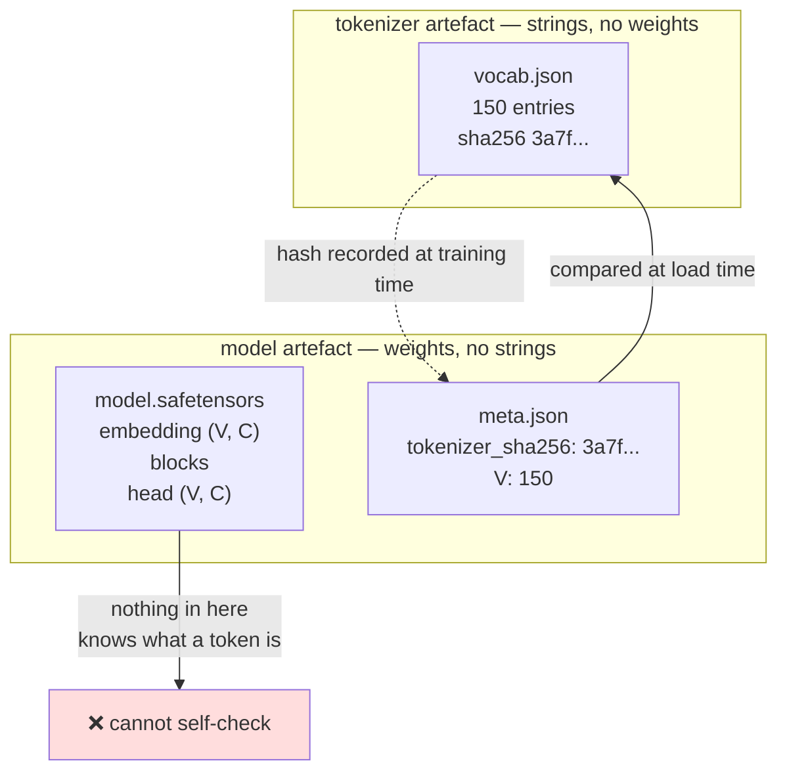

# 2.3 — The tokenizer is not part of the model

## One-line answer

The tokenizer is a **separate artefact** — its own file, its own version, shipped alongside the
weights rather than inside them — and because a checkpoint contains no record of which tokenizer
produced its training ids, the pairing has to be recorded by you or it does not exist.

---

## The story

You order a padlock online and it arrives in a box. The keys arrive four days later, in a different
envelope, from a different warehouse.

That is mildly annoying and completely normal. The padlock is useless without the keys. The keys are
useless without the padlock. And yet nobody would call the keys "part of the padlock" — they are two
objects, made in two places, shipped separately, and either one can be lost without the other
noticing.

So what does everybody actually do? They put the keys on a ring, write on a paper tag which lock they
open, and keep the tag with the lock.

Nobody is taught to do that. It becomes obvious the first time there are two padlocks and two sets of
keys loose in the same drawer — because at that moment, both keys still turn, both locks still open,
and nothing about either object says which pair is which.

---

## The idea in plain language

Part [2.2](2.2-where-the-tokenizer-sits.md) showed the tokenizer sitting at both ends of the stack. It
is easy to read that diagram and conclude the tokenizer is "the model's front door". It is not. It is a
second, independent artefact, and the distinction has practical consequences.

**What a model checkpoint contains.** Numbers. The embedding matrix `(V, C)`, the block weights, the
output head `(V, C)`, and — depending on the format — some metadata about shapes and dtypes. That is
all. There is **no string anywhere in it**. Nothing in a checkpoint records that row 4,271 of the
embedding table corresponds to the piece of text `" model"`.

**What a tokenizer artefact contains.** Strings. The vocabulary table, the merge rules (from Day 12),
any special tokens, and the pre-tokenization pattern (Day 13). **No floating-point weights at all.**

They are disjoint. Neither one can be derived from the other, and neither one validates the other. The
only thing that binds them is that one was used to produce the ids the other was trained on — a fact
about history, not about either file.

That gives three rules, and they are the practical content of this part:

**Rule one: ship them together, always.** A model directory contains the weights *and* the tokenizer.
Publishing one without the other publishes something unusable, and — worse — something that looks
usable, because it will happily load and run with whatever tokenizer happens to be lying around.

**Rule two: version them together.** A change to the vocabulary is a change to the model, even though
no weight moved. If the vocabulary file changes, the pair gets a new version, and the old pair is
still retrievable.

**Rule three: record the binding explicitly.** A hash of the tokenizer file, stored with the model and
checked at load time. This is the paper tag on the key ring. It is one line of code and it converts an
entire class of silent failure into a startup error.

There is one common arrangement that muddies this, and it is worth naming so it does not confuse you
later: some serving frameworks bundle the tokenizer inside the model object in memory, so that
`model.generate("some text")` works. That is a convenience wrapper holding two things at once. **The
two things are still two things**, and the moment anything is saved, loaded, copied or deployed, they
travel as separate files again.

---

## Why Akshara needs it

- **`docs/MODELS.md`** exists for exactly this reason. Principle 13 requires a row with a revision SHA
  for every downloaded checkpoint *before* it is loaded, and the same row is where the tokenizer
  belongs — because a checkpoint and a tokenizer downloaded on different days from a repository that
  moved in between are a mismatched pair with no external sign.
- **Day 16** is vocabulary surgery: adding a token to an existing model. It is a whole day because it
  touches both artefacts at once and they have to be changed consistently — the tokenizer gains an
  entry and both `(V, C)` matrices gain a row.
- **Day 20** adds a chat template, which lives on the tokenizer side and changes what the training
  strings look like. A model trained with one template and served with another is Silent Failure #2,
  and the template is not in the weights.
- **Day 100 onward**, the serving surface loads a model directory. Every startup check that runs there
  is a version of rule three, and the day it fires is the day it pays for itself.

---

## The mechanism

Make the binding explicit. The tokenizer is saved as its own file, and its hash is saved with the
model.

```python
import hashlib
import json
import pathlib


def save_tokenizer(stoi: dict[str, int], path: pathlib.Path) -> str:
    """Write the vocabulary as its own artefact. Return its hash."""
    blob = json.dumps(stoi, ensure_ascii=False, sort_keys=True, indent=None).encode("utf-8")
    path.write_bytes(blob)
    return hashlib.sha256(blob).hexdigest()


def load_tokenizer(path: pathlib.Path) -> tuple[dict[str, int], str]:
    """Read it back, and re-derive the same hash from the same bytes."""
    blob = path.read_bytes()
    return json.loads(blob.decode("utf-8")), hashlib.sha256(blob).hexdigest()
```

**Line by line:**
- `sort_keys=True` is what makes the hash **stable**. Without it, two runs that produce the same
  vocabulary in a different insertion order write different bytes and therefore different hashes — and
  a hash that changes when nothing changed is a check everybody learns to ignore.
- `ensure_ascii=False` keeps non-ASCII characters as themselves rather than as `\uXXXX` escapes. Both
  round-trip correctly; this one is readable when somebody opens the file to debug, which is the only
  time anybody opens it.
- The hash is computed over **the bytes that were written**, not over the dictionary. Hashing the
  in-memory object would depend on Python's internals; hashing the file's bytes is what any other tool,
  in any other language, would compute and get the same answer for.
- `load_tokenizer` returns the hash alongside the table, so the caller cannot forget to compute it. A
  function that returns only the table invites a caller that never checks anything.
- **No weights appear anywhere in this file.** That absence is the part to notice.

Now bind the two artefacts, and refuse to run when they disagree:

```python
def save_model_meta(path: pathlib.Path, tokenizer_sha: str, V: int, C: int) -> None:
    path.write_text(json.dumps({"tokenizer_sha256": tokenizer_sha, "V": V, "C": C}, indent=2),
                    encoding="utf-8")


def load_and_check(model_meta: pathlib.Path, tok_path: pathlib.Path) -> dict[str, int]:
    """The one check that turns a silent failure into a startup error."""
    meta = json.loads(model_meta.read_text(encoding="utf-8"))
    stoi, sha = load_tokenizer(tok_path)

    if sha != meta["tokenizer_sha256"]:
        raise ValueError(
            f"tokenizer mismatch\n"
            f"  model was trained with : {meta['tokenizer_sha256'][:16]}\n"
            f"  this tokenizer is      : {sha[:16]}\n"
            f"  refusing to run — see Day 9 part 2.5 for what happens if you don't"
        )
    if len(stoi) != meta["V"]:
        raise ValueError(f"V mismatch: model expects {meta['V']}, tokenizer has {len(stoi)}")
    return stoi
```

**Line by line:**
- **Two checks, and the second is not redundant.** The hash catches "a different table"; the `V` check
  catches "the same table, re-saved by a different version of the writer" — a case where the bytes
  changed but the vocabulary did not, which should be investigated rather than crashed on. Reporting
  both tells you which happened.
- It **raises**. Not a warning, not a log line. A model loaded against the wrong tokenizer produces
  fluent, plausible, wrong output forever (part [2.5](2.5-the-tokenizer-that-did-not-match.md)), and
  the only useful behaviour is refusing to start.
- The message prints **both** hashes, truncated to 16 characters. One hash tells you something is
  wrong; two tell you what to go and look for. Truncation is for readability — the comparison uses the
  full string.
- The message names the part that explains the failure. An error that teaches is worth writing.
- Measured on Intel Core i3-1115G4 (2 cores / 4 threads), 11.7 GB RAM, Windows 11, CPython 3.12.12, on
  2026-08-26: for the 150-character vocabulary of part [2.1](2.1-a-function-and-its-inverse.md), the
  serialised table is **1,540 bytes** and its SHA-256 begins `78d687e10347a0c6`. **The check costs
  nothing and runs once per process start.**

The two artefacts and the one thing that binds them:



---

## When it breaks

**The loud failure — mismatched `V`.** This one you get for free, because the shapes disagree:

```console
>>> meta = {"V": 150, "C": 8}
>>> stoi = {"a": 0, "b": 1}                    # a tokenizer with V = 2
>>> load_and_check(...)
Traceback (most recent call last):
  File "<stdin>", line 1, in <module>
  File "<stdin>", line 12, in load_and_check
ValueError: V mismatch: model expects 150, tokenizer has 2
```

What it means: the tokenizer and the model were built at different times, or from different corpora,
and the embedding table cannot be indexed by ids this tokenizer produces. **This is the lucky case.**

**The silent failure — matching `V`, different table.** Two tokenizers built from the same alphabet in
different orders have identical `V`, so no shape check anywhere in the stack can tell them apart. Every
id is in range. Every embedding lookup succeeds. Every output decodes to fluent text. Part
[2.5](2.5-the-tokenizer-that-did-not-match.md) reproduces this and prints what comes out.

**The failure nobody classifies as a failure: shipping half a model.** A checkpoint uploaded without
its tokenizer is not broken — it is *incomplete in a way that looks complete*. Somebody downloads it,
pairs it with a tokenizer from a related project because the `V` happens to match, gets output that is
almost sensible, and concludes the model is mediocre. That conclusion then propagates as a fact about
the model.

**The check that catches all three,** and it is a directory layout rather than code:

```text
akshara-v0/
├── model.safetensors        # weights only
├── meta.json                # V, C, tokenizer_sha256, seed, config hash
├── tokenizer.json           # the vocabulary, the merges, the special tokens
└── RUNS.md-row.txt          # the ledger row this checkpoint came from
```

**Line by line:**
- The two artefacts sit **side by side in one directory**, so copying the model copies the tokenizer.
  This is the paper tag on the key ring, implemented as a filesystem convention.
- `meta.json` is the only file that references both, and it is small and human-readable — which matters
  because it is the file somebody will open at two in the morning.
- `.safetensors`, not a pickle. Principle 13: **never load a pickle you did not create.** A tokenizer
  file is JSON for the same reason — a vocabulary is data, and data does not need to be executable.
- The ledger row makes the checkpoint traceable back to the run that produced it, which is Principle 9.
  A checkpoint with no row in `docs/RUNS.md` did not happen.

---

## In production

**What a research engineer writes instead of the teaching version.** They use whatever their framework's
`save_pretrained` / `from_pretrained` pair does, which already writes both artefacts into one directory.
What they carry from this part is the **habit of treating that directory as the unit**: never copy the
weights alone, never update the tokenizer in place, never assume two directories with the same `V` are
compatible. And when a model behaves strangely after a deployment, the first thing checked is whether
the tokenizer directory changed — before anything about the weights is investigated.

The hash check is real practice, not a teaching device. Serving stacks that load models from object
storage routinely verify a manifest at startup, and the failure mode it prevents — a rolling deploy
where the weights update before the tokenizer does — is common enough to have a name in most teams.

**What degrades at scale.** Fleet drift. One model, twenty serving hosts, a deploy that updates them
one at a time: for a few minutes some hosts have the new tokenizer and the old weights. Every host
answers every request successfully. A fraction of users get output from a mismatched pair, and there is
no error metric that moves — only a quality complaint, days later, that cannot be reproduced because by
then every host agrees again.

**The failure that only shows with real data.** Special tokens. A tokenizer updated to add a
`<|im_start|>` token has a `V` one larger than before, so the loud check fires — good. But a tokenizer
updated to *change the string* a special token maps to, leaving `V` alone, changes nothing observable
until a real chat request arrives formatted the old way. Day 20 builds the template and Day 21 tests it
by round-tripping the exact training string through the serving path.

**The review comment.** *"This PR updates `tokenizer.json`. Which checkpoints were trained against the
old one, and what happens when one of them is loaded against this? If the answer is 'nothing visible',
add the hash check before merging."*

**The interview question.** *"Is the tokenizer part of the model?"* The weak answer is yes, because it
comes in the same download. The strong answer distinguishes the two artefacts by content — **the
checkpoint is floats and contains no strings; the tokenizer is strings and contains no floats** — and
then names the consequence: nothing in a checkpoint records which tokenizer produced its training ids,
so a mismatched pair loads cleanly and runs forever. The follow-up that shows judgement: *which is why
the binding has to be recorded out-of-band — a hash in the metadata, checked at load — and why
vocabulary changes are versioned as model changes even though no weight moved.*

**Compute tier: T0.** JSON and SHA-256 on a laptop; the whole vocabulary for this day's tokenizer
serialises to 1,540 bytes, measured on this machine, 2026-08-26.
This part makes no claim that needs a GPU or a trained model — it is about artefact
management, and artefact management is the cheapest thing in the curriculum to get right and one of the
most expensive to get wrong.

---

## Check yourself

Run this. It prints **two hashes that must be equal, and then one that must not be**:

```python
import hashlib, json, pathlib

text = pathlib.Path("docs/00_MASTER_PLAN.md").read_text(encoding="utf-8")
stoi_a = {ch: i for i, ch in enumerate(sorted(set(text)))}
stoi_b = {ch: i for i, ch in enumerate(sorted(set(text), reverse=True))}   # same V, different table


def sha(d: dict[str, int]) -> str:
    return hashlib.sha256(
        json.dumps(d, ensure_ascii=False, sort_keys=True).encode("utf-8")
    ).hexdigest()


print(f"  V(A) = {len(stoi_a)}   V(B) = {len(stoi_b)}   V equal? {len(stoi_a) == len(stoi_b)}")
print(f"  sha(A)          = {sha(stoi_a)[:16]}")
print(f"  sha(A) again    = {sha(stoi_a)[:16]}")
print(f"  sha(B)          = {sha(stoi_b)[:16]}")
print(f"  A and B differ? {sha(stoi_a) != sha(stoi_b)}")
```

**Line by line:**
- The two `sha(A)` lines are identical, on two separate calls. That is `sort_keys=True` doing its job —
  **remove it and say whether they are still identical**, and whether you would trust a check that is
  not.
- `V equal?` prints `True` while `A and B differ?` also prints `True`. **Those two lines together are
  the entire argument for this part**: the shape check cannot see the difference and the hash can.
- Now write `stoi_b` to a file, read it back, and hash the bytes you read rather than the dictionary.
  Say whether you get the same answer, and say which of the two a tool written in another language
  could reproduce.
- Finally, list what is in a `.safetensors` file and say whether the string `"the"` could be in it.

**Say this out loud, without scrolling up:** say what a checkpoint contains and what a tokenizer file
contains, say why neither one can validate the other, and name the one line that turns a mismatched
pair from a silent failure into a startup error.
