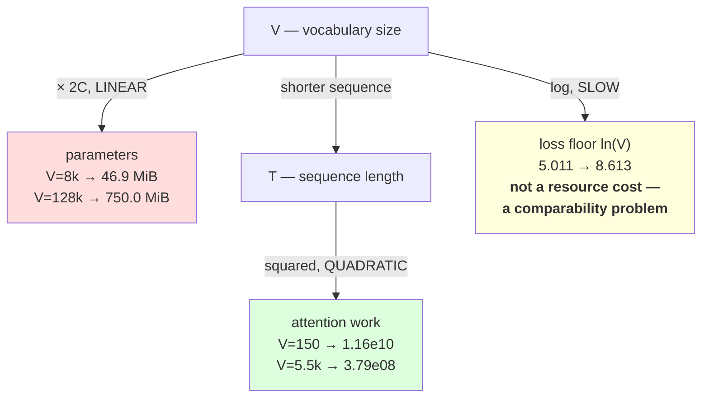

# 2.4 — Vocabulary size is a budget, not a preference

## One-line answer

`V` buys two matrices of `V × C` parameters and sells you a shorter sequence, so choosing it is
arithmetic with three terms — embedding memory that grows **linearly** in `V`, attention work that
grows **quadratically** in `T`, and a loss floor of `ln(V)` that moves the number you compare
everything against.

---

## The story

A small shop has one wall of shelves, and the wall is the whole shop.

Every product that goes on that wall gets its own permanent space, including the one somebody buys
twice a year. Stock more products and you either put fewer of each out, or you rent a bigger wall — and
the wall costs rent every month, whether anything sells off it or not.

Stock fewer products and customers have to buy two things and combine them at home. That is not a
disaster. It is one extra item in the basket, one extra thing to carry, one slightly longer visit,
every single time.

Nobody argues about this in the abstract. The shopkeeper works it out: what does a metre of shelf cost
per month, how often does that product actually move, and how many extra items end up in the average
basket if it goes?

Vocabulary size is the wall. And the mistake nobody makes in a shop, but everybody makes with a
tokenizer, is picking a number because it sounds reasonable rather than because somebody multiplied it
out.

---

## The idea in plain language

Part [1.4](../01-the-vocabulary-problem/1.4-the-subword-compromise.md) showed `V` and `T` moving in
opposite directions as you turn one dial. Part [2.2](2.2-where-the-tokenizer-sits.md) showed exactly
where `V` enters the model: two matrices, `(V, C)` each. This part puts the two together and gives you
the arithmetic to actually choose.

There are **three** costs, and they do not scale alike. That is the whole content of this part.

**Cost one — parameters, linear in `V`.** The embedding table is `(V, C)` and the output head is
`(V, C)`. Unless the two are *tied* — a common trick where the same matrix serves both, halving the
cost — the vocabulary costs `2 × V × C` parameters. At `C = 768`, every 1,000 vocabulary entries costs
1.54 million parameters, or 5.9 MiB in `float32`. **Doubling `V` doubles that, exactly.**

**Cost two — attention work, quadratic in `T`.** A bigger `V` buys a shorter `T`, and attention (Day
30) compares every position with every other, so its work goes as `T²`. Halving `T` quarters that term.
This is the cost that pays for cost one, and it pays at a different rate.

**Cost three — the loss floor, logarithmic in `V`.** Day 6 part
[3.2](../../../day-006-entropy-cross-entropy-perplexity/parts/03-kl-and-perplexity/3.2-perplexity.md)
established that a model that has learned nothing has a loss of `ln(V)` nats. This is not a resource
cost — it costs no memory and no time — but it changes the number you compare against. Two runs with
different `V` start from different floors, so their loss curves are **not comparable**, and part
[3.3](../../../day-006-entropy-cross-entropy-perplexity/parts/03-kl-and-perplexity/3.3-the-perplexity-that-improved.md)
measured a factor of 42 in perplexity from nothing but a tokenization change.

Put those three together and the shape of the answer appears. Going from `V = 150` to `V = 8,000`
costs about 12 million parameters and buys a `5.6×` shorter sequence, which is `31×` less attention
work — an obviously good trade at any realistic model size. Going from `V = 32,000` to `V = 128,000`
costs 147 million parameters and buys almost nothing, because the sequence is already about as short as
words allow. **The curve has an elbow, and the whole job is finding roughly where it is for your data
and your model size.**

One more term, because it decides the answer for small models: **tied embeddings**. If the input
embedding matrix and the output head are the same matrix (transposed), you pay `V × C` once instead of
twice. For a small model this is the difference between the vocabulary being most of the parameters and
being merely a lot of them.

---

## Why Akshara needs it

- **Day 12** trains a BPE vocabulary and has to be given a target size. The number handed to it comes
  from this arithmetic, not from a convention.
- **Day 39** counts every parameter of Akshara v0 by hand and checks the count against the model. The
  embedding and head rows in that count are `V × C` each, and if they dominate, the day says so.
- **Day 66 onward** is the pretraining run on a free notebook GPU, and every "will this fit" question
  is the memory equation from `EFF-01` with the vocabulary term in it. A model whose vocabulary is too
  large simply does not fit, and finding that out at the point of running is expensive on a
  pre-emptible session.
- **Day 78 onward** quantizes the model, and the embedding table is one of the largest single tensors,
  so it is one of the first things anybody looks at. That decision starts here.

---

## The mechanism

The whole budget in one table. Nothing here needs a model — it is multiplication.

```python
import collections
import math
import pathlib

text = pathlib.Path("docs/00_MASTER_PLAN.md").read_text(encoding="utf-8")
words = text.split()
counts = collections.Counter(words)
chars = set(text)
C = 768                                            # d_model, a common small-model width


def keep_top_n(n: int) -> tuple[int, int]:
    """From part 1.4: keep the n commonest words whole, spell the rest. Return (V, T)."""
    kept = {w for w, _ in counts.most_common(n)}
    return len(chars | kept), sum(1 if w in kept else len(w) + 1 for w in words)
```

**Line by line:**
- `C = 768` is a stated assumption, not a discovered fact. Every parameter number below is
  proportional to it, so a different `C` scales the whole table — and quoting a memory figure without
  saying which `C` it assumes is meaningless.
- `keep_top_n` is imported wholesale from part
  [1.4](../01-the-vocabulary-problem/1.4-the-subword-compromise.md) rather than reinvented, so the `V`
  and `T` columns below chain onto that part's measured curve rather than being a separate
  experiment.
- `chars | kept` is rule two from part 1.4: the character fallback is in the vocabulary
  unconditionally, so every `V` in this table is a vocabulary with **no `<unk>`**.

Now price each choice:

```python
print(f"{'V':>8} {'T':>9} {'params (2VC)':>14} {'MiB fp32':>9} {'tied MiB':>9} "
      f"{'ln(V)':>7} {'T^2':>11}")
for n in (0, 500, 2000, 4000, len(counts)):
    V, T = keep_top_n(n)
    params = 2 * V * C
    print(f"{V:>8} {T:>9,} {params:>14,} {params * 4 / 1024**2:>9.1f} "
          f"{params * 2 / 1024**2:>9.1f} {math.log(V):>7.3f} {T * T:>11.3e}")
```

**Line by line:**
- `2 * V * C` is the untied cost — embedding **and** output head. The `tied MiB` column is half of it,
  which is the same arithmetic with the two matrices shared.
- `* 4 / 1024**2` converts parameters to mebibytes in `float32`: four bytes each, `1024²` bytes per
  MiB. Day 2 part
  [1.2](../../../day-002-tensors-shape-stride/parts/01-what-a-tensor-is/1.2-dtype-the-width-of-a-number.md)
  is where shape and dtype became separate ideas; this line is why that separation matters.
- `T * T` is printed in scientific notation because it spans four orders of magnitude across the table,
  and a column of comma-separated integers hides exactly the thing you are meant to see.
- Measured on Intel Core i3-1115G4 (2 cores / 4 threads), 11.7 GB RAM, Windows 11, CPython 3.12.12, on
  2026-08-26, against `docs/00_MASTER_PLAN.md` at the revision in this repository:

```text
       V         T   params (2VC)  MiB fp32  tied MiB   ln(V)         T^2
     150   107,747        230,400       0.9       0.4   5.011   1.161e+10
     620    70,485        952,320       3.6       1.8   6.430   4.968e+09
    2102    46,638      3,228,672      12.3       6.2   7.651   2.175e+09
    4096    30,343      6,291,456      24.0      12.0   8.318   9.207e+08
    5503    19,475      8,452,608      32.2      16.1   8.613   3.793e+08
```

Read the two ends against each other. Going from `V = 150` to `V = 5,503` costs **8.2 million extra
parameters — 31.4 MiB** — and cuts the attention term from `1.161e+10` to `3.793e+08`, a factor of
**30.6**. At `C = 768` that trade is not close: 31 MiB is nothing next to a thirtyfold reduction in the
dominant cost of every forward pass.

Now do it at the sizes real tokenizers use, where the elbow is:

```python
for V in (256, 8_000, 32_000, 128_000):
    params = 2 * V * C
    print(f"  V={V:>7,}  untied {params:>12,} params = {params * 4 / 1024**2:>7.1f} MiB fp32"
          f"   tied {params * 2 / 1024**2:>6.1f} MiB   ln(V) = {math.log(V):.3f}")
```

**Line by line:**
- `256` is the byte vocabulary of Day 10 — the smallest vocabulary that can represent every possible
  input, and the floor of this whole discussion.
- The jump from `32,000` to `128,000` is the one to look at hardest. It is the range multilingual
  models live in, and the reason is coverage of scripts rather than compression of English.
- Measured on this machine, 2026-08-26:

```text
  V=    256  untied      393,216 params =     1.5 MiB fp32   tied    0.8 MiB   ln(V) = 5.545
  V=  8,000  untied   12,288,000 params =    46.9 MiB fp32   tied   23.4 MiB   ln(V) = 8.987
  V= 32,000  untied   49,152,000 params =   187.5 MiB fp32   tied   93.8 MiB   ln(V) = 10.373
  V=128,000  untied  196,608,000 params =   750.0 MiB fp32   tied  375.0 MiB   ln(V) = 11.760
```

**750 MiB of embedding for a twelve-layer, `C = 768` model whose blocks come to roughly 84.9 M
parameters — 324 MiB — put together.** The vocabulary is more than twice the rest of the model. That is
why tying
matters, why small models use small vocabularies, and why the vocabulary term is never left out of a
memory equation.

The three costs and their different shapes:



---

## Shapes

| Tensor | Symbolic shape | Concrete at `V = 8000`, `C = 768` | What each axis means |
| --- | --- | --- | --- |
| embedding table | `(V, C)` | `(8000, 768)` | one row per vocabulary entry · channels |
| output head | `(C, V)` | `(768, 8000)` | channels · one column per vocabulary entry |
| tied head | — | *the embedding, transposed* | one matrix serving both, `V × C` total |
| ids | `(B, T)` | `(4, 128)` | batch · position |
| logits | `(B, T, V)` | `(4, 128, 8000)` | batch · position · **score per vocabulary entry** |
| attention scores | `(B, H, T, T)` | `(4, 12, 128, 128)` | batch · head · query position · key position |

The last row is where the quadratic term lives, and it is the reason `T` is worth buying down. Note
that the logits tensor is also `V`-sized and is **per position** — at `B = 4`, `T = 128`, `V = 8000`
that is 4,096,000 floats, 15.6 MiB in `float32`, held for every layer's output that needs it. The
vocabulary shows up in activation memory, not only in parameter memory.

---

## When it breaks

**The loud failure — it does not fit.** The honest version of this happens at allocation time:

```console
>>> V, C = 128_000, 768
>>> bytes_needed = 2 * V * C * 4
>>> print(f"{bytes_needed / 1024**3:.2f} GiB just for the vocabulary matrices")
0.73 GiB just for the vocabulary matrices
```

What it means: on a free T4-class notebook GPU with roughly 15 GiB, three quarters of a gibibyte spent
before a single transformer block exists is a real fraction of the budget — and the optimizer will want
two more copies of every one of those parameters (Day 8 part
[2.4](../../../day-008-gradient-descent-and-adam/parts/02-adam/2.4-the-optimizers-memory.md)), so the
training-time cost is roughly three times the number above. The fix is a smaller `V`, tied embeddings,
or both — and it is much cheaper to work that out on this page than after a session is revoked
mid-run.

**The silent failure — comparing two runs with different `V`.** Nothing raises. Run A has `V = 2,102`
and a final loss of `4.1`. Run B has `V = 5,503` and a final loss of `4.6`. Run A looks better, and it
is not: its floor was `7.651` and B's was `8.613`, so A closed `3.55` nats of the gap and B closed
`4.01`. **Reading the raw numbers gives the wrong ordering**, and there is nothing in either log to
warn you.

**The check that catches it,** and it belongs next to every loss you print:

```python
def loss_in_context(loss_nats: float, V: int, tokens: int, chars: int) -> None:
    """A loss is not a number, it is a number plus the three things that make it comparable."""
    floor = math.log(V)
    print(f"  loss {loss_nats:.4f} nats/token   floor ln({V}) = {floor:.4f}"
          f"   closed {floor - loss_nats:.4f} of the gap")
    print(f"  loss {loss_nats * tokens / chars:.4f} nats/character  <- compare THIS across tokenizers")
```

**Line by line:**
- The first line reports the loss against **its own floor**, so a reader can see how much learning
  happened rather than how big the vocabulary was.
- The second line is the only cross-tokenizer-comparable quantity: **nats per character**. Multiply by
  tokens and divide by characters, and the tokenization cancels out. Any comparison of two tokenizers
  that is not on a per-character or per-byte basis is comparing two different questions.
- `tokens` and `chars` are both arguments because they must come from **the same text**. Computing them
  on different texts is the most common way this correction is done wrong.
- Neither line raises. This is a reporting check, not a guard — the failure is in interpretation, and
  the fix is printing the context alongside the number so misinterpretation takes effort.

---

## In production

**What a research engineer writes instead of the teaching version.** They keep this arithmetic in a
spreadsheet or a ten-line script and re-run it whenever `C`, `V` or the context length changes. The
habit that distinguishes them is quoting **three numbers together** — vocabulary parameters as a
fraction of total parameters, tokens-per-word on the real data, and the loss floor — because any one of
those alone is misleading and all three together settle the question in a minute.

Typical published vocabularies sit in the tens of thousands, and the reason is coverage rather than
compression: a vocabulary large enough to cover many scripts without falling back to bytes on every
non-English character. **The right number for a project is the one its own arithmetic produces**, and
copying somebody else's without redoing the sum is how a small model ends up with most of its
parameters in an embedding table.

**What degrades at scale.** The output head, at long context. The logits tensor is `(B, T, V)` and it
is materialised in full to compute the loss, so at `V = 128,000`, `T = 4,096`, `B = 4` that single
tensor is 2,097,152,000 floats — 7.8 GiB in `float32`. That is arithmetic on this page, and it is the
reason production training code computes the loss in chunks over the vocabulary axis rather than
materialising the whole thing. **The embedding table's cost is fixed; the logits' cost scales with the
batch and the context.**

**The failure that only shows with real data.** Multilingual traffic against a vocabulary sized for one
language. The parameter cost was budgeted correctly and the tokens-per-word was measured correctly —
on English. Every request in another script tokenizes several times longer, so it costs several times
more, occupies several times more context, and hits the context limit on shorter inputs. The budget was
right about the model and wrong about the data.

**The review comment.** *"`V = 64000` — where did that number come from? Show me the embedding
parameters as a fraction of the total, and the tokens-per-word on our actual eval set at 32k and at
64k. If the difference is under 5% we should take the smaller one."*

**The interview question.** *"How do you choose a vocabulary size?"* The weak answer names a number.
The strong answer names the three terms and their different scalings — **`2VC` parameters growing
linearly, attention work growing with `T²` where `T` shrinks as `V` grows, and a `ln(V)` loss floor
that makes cross-`V` loss comparisons invalid** — and then says where the elbow is and why: past a
point, extra slots stop buying sequence length, because the sequence is already near word-level. The
follow-up that shows judgement: *and for a small model I would tie the embeddings first, because that
halves the whole term for free.*

**Compute tier: T0.** Multiplication on a laptop. Every figure in this part is exact arithmetic over
shapes and dtypes — no benchmark, no training run, no hardware dependence — which is precisely why it
can be trusted and precisely why it should be done *before* a session is spent. What this part cannot
tell you is whether a larger vocabulary makes a *better* model at fixed compute; that needs runs, and
it is Day 17's comparison.

---

## Check yourself

Run this. It prints **the fraction of a small model that is vocabulary**:

```python
import math

C, layers = 768, 12
block_params = layers * 12 * C * C          # rough transformer block cost, Day 39 does it exactly

for V in (256, 8_000, 32_000, 128_000):
    vocab = 2 * V * C
    total = vocab + block_params
    print(f"  V={V:>7,}  vocab {vocab / 1e6:>6.1f}M  blocks {block_params / 1e6:>6.1f}M"
          f"   vocab is {vocab / total:>5.1%} of the model   ln(V)={math.log(V):.3f}")
```

**Line by line:**
- `12 * C * C` per layer is the standard rough count for a transformer block — attention projections
  plus the feed-forward — and it is **approximate on purpose**, because Day 39 does it exactly and this
  part only needs the ratio. Saying which numbers are exact and which are rough is the honest way to
  use an estimate.
- Read the `vocab is X%` column. **Say out loud at which `V` the vocabulary stops being a detail.**
- Now halve `C` to 384 and re-run. Both terms change, but not by the same factor — say which one moved
  more, and why.
- Finally, set `layers = 2` (a toy model) and re-run. Say what happens to the percentage column, and
  say what that means for the toy models this curriculum trains on a laptop.

**Say this out loud, without scrolling up:** name the three costs of a larger vocabulary, say which one
scales linearly and which quadratically, and say why two training runs with different `V` cannot have
their losses compared directly — and what quantity you would compare instead.
