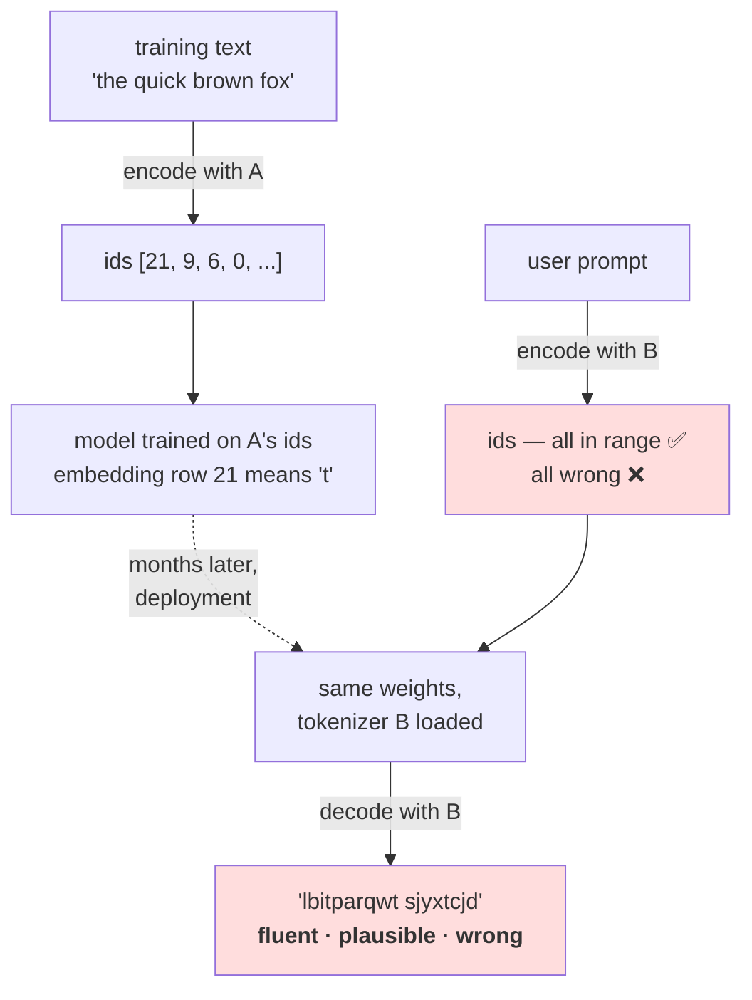

# 2.5 — 💥 The tokenizer that did not match

## One-line answer

Two tokenizers over the same alphabet with the same `V` but a different id ordering produce ids that
are **all in range and all wrong**: encoding `'the quick brown fox'` with one and decoding with the
other gives `'lbitparqwt sjyxtcjd'`, with no exception, no warning and no shape mismatch anywhere in
the stack.

---

## The story

The same cloakroom as part [2.1](2.1-a-function-and-its-inverse.md), later the same evening.

The shift changes. The person coming on finds the pegs unlabelled — the numbers had been on little
paper tags and half of them have fallen off — so they do the sensible thing and number the pegs again,
starting from the other end of the rail.

Every ticket in the building is still a perfectly valid ticket. Every number on every ticket names a
real peg with a real coat hanging on it. Nobody's ticket is refused. Nobody's ticket is torn up.
Nothing is reported to anybody, and the desk hands out coats all evening without a single argument at
the counter.

Everybody goes home in somebody else's coat.

The failure is not that the system stopped working. **The system worked perfectly.** It worked against
a different numbering from the one the tickets were printed under, and there is nothing anywhere on a
ticket that says which numbering it belongs to.

---

## The idea in plain language

This is Silent Failure #2 from the plan's §6 — *"trained with one tokenizer, inferred with another"* —
and this part is where it gets reproduced rather than described.

The setup is depressingly easy to arrive at. You need two tokenizers that:

- cover **the same set of characters** (so nothing is ever out of vocabulary),
- have **the same `V`** (so every shape check in the entire stack passes),
- and assign **different ids** (so every id means something different).

That combination is not exotic. It is what you get from any of these:

**Set iteration order.** `set(text)` has no defined order. `{ch: i for i, ch in enumerate(set(text))}`
builds a different table depending on internal details, so two runs of the same script can produce two
different vocabularies over identical characters. One `sorted` prevents it, which is why part
[2.1](2.1-a-function-and-its-inverse.md) has one.

**A corpus in a different order.** Building the vocabulary by walking the text and assigning ids on
first sight gives an ordering that depends on which document came first. Re-shuffle the corpus, get a
different table, same size.

**A rebuild.** Somebody regenerates the vocabulary from a slightly different snapshot of the data, gets
the same characters, and does not think of it as a change because `V` did not move.

**A different library version.** A tokenizer implementation that changes how it sorts or how it
assigns special-token ids.

Now put a model in the middle. The model's embedding table has one row per id, trained under
tokenizer A. Hand it ids from tokenizer B, and every row it looks up is the wrong row — but it is a
*valid* row, holding a real, well-trained vector for some other piece of text. So the model does what
a model does: it attends over those vectors, produces logits, and emits an id. `decode` renders that
id as text.

**The output is fluent.** It has the statistics of the training corpus, because the model is
undamaged. It is simply about a different input than the one the user typed.

The property that makes this class of bug so persistent is worth stating on its own:

> **An integer carries no record of where it came from.** Nothing in the value `21` says which table
> produced it. Every check that operates on ids — range checks, shape checks, dtype checks — is
> checking a property that both tokenizers share.

Which means no amount of validation *inside* the model can catch it. The check has to be at the
boundary, and it has to be about provenance rather than about values — part
[2.3](2.3-the-tokenizer-is-not-part-of-the-model.md)'s hash.

---

## Why Akshara needs it

- **The plan's §6 requires** that any day touching this trap names it in words and gives the check:
  *round-trip the exact training string through the inference path and `assert` equality*. This part is
  where that instruction is earned.
- **Day 11** writes the tokenizer modules, and the `sorted` in their vocabulary construction is not a
  style choice — it is the fix for the first cause listed above, and this part is the reason it will be
  in the code.
- **Day 20 and Day 21** add the chat template and test it. The template is a *string format*, so a
  template mismatch is this same failure at a coarser grain: the ids are valid, the model is fine, and
  the model was trained on a string that no longer appears at inference.
- **Day 100 onward**, the serving surface loads a model directory and starts answering requests. This
  failure produces zero error-rate signal, so it is invisible to every operational dashboard, and the
  only defence is the startup check.

---

## The mechanism

Build two tokenizers that a reviewer would call identical. Same characters, same `V`, different order.

```python
alphabet = sorted(set("the quick brown fox jumps over lazy dog. "))
stoi_a = {ch: i for i, ch in enumerate(alphabet)}          # A: sorted
itos_a = {i: ch for ch, i in stoi_a.items()}

seen: list[str] = []                                        # B: first-seen order
for ch in "the quick brown fox jumps over the lazy dog. ":
    if ch not in seen:
        seen.append(ch)
stoi_b = {ch: i for i, ch in enumerate(seen)}
itos_b = {i: ch for ch, i in stoi_b.items()}

print(f"  V(A) = {len(stoi_a)}   V(B) = {len(stoi_b)}   equal? {len(stoi_a) == len(stoi_b)}")
print(f"  same characters? {set(stoi_a) == set(stoi_b)}")
```

**Line by line:**
- Tokenizer A sorts. Tokenizer B assigns ids in the order characters are first seen while walking the
  corpus. **Both are entirely reasonable implementations** and neither one is a bug on its own; they
  are only a bug together.
- The corpus B walks contains the word `the` twice, which is the only difference from A's input string
  — and it changes nothing about the *set* of characters, only about the order they are met in. That is
  how little it takes.
- The two `print` lines are the checks a reviewer would run: sizes match, character sets match. **Both
  pass.** Every downstream shape check in the model would pass too.
- Measured on Intel Core i3-1115G4 (2 cores / 4 threads), 11.7 GB RAM, Windows 11, CPython 3.12.12, on
  2026-08-26:

```text
  V(A) = 28   V(B) = 28   equal? True
  same characters? True
```

Now encode with one and decode with the other, which is exactly what a mismatched deployment does:

```python
msg = "the quick brown fox"
ids = [stoi_a[ch] for ch in msg]                 # (T,) — produced by A, e.g. by the data loader

print(f"  message      : {msg!r}")
print(f"  ids under A  : {ids}")
print(f"  in range?    : {all(0 <= i < len(stoi_b) for i in ids)}")
print(f"  decoded by A : {''.join(itos_a[i] for i in ids)!r}")
print(f"  decoded by B : {''.join(itos_b[i] for i in ids)!r}")
```

**Line by line:**
- `ids` is a perfectly ordinary list of small integers. Print it and there is nothing to see: no
  marker, no header, no version, nothing that could tell you which table made it.
- The `in range?` line is the strongest check the model itself can perform, from part
  [2.2](2.2-where-the-tokenizer-sits.md). **It passes.** Every id is a legal row of B's embedding
  table.
- The two decode lines are the same ids read through two tables, which is precisely the cloakroom
  handing out coats under the new numbering.
- Measured on this machine, 2026-08-26:

```text
  message      : 'the quick brown fox'
  ids under A  : [21, 9, 6, 0, 18, 22, 10, 4, 12, 0, 3, 19, 16, 24, 15, 0, 7, 16, 25]
  in range?    : True
  decoded by A : 'the quick brown fox'
  decoded by B : 'lbitparqwt sjyxtcjd'
```

Look at `'lbitparqwt sjyxtcjd'` carefully, because its exact shape is the point.

It is the **same length** as the input — nineteen characters — because a substitution cipher preserves
length. It is lower-case Latin script throughout. And it contains a space, in a plausible place, so it
reads as two words rather than as noise.

Now trace one character. In A the space sorts first, so it is id `0`; in B the first character seen is
`t`, so id `0` is `t`. Every space in the original therefore came out as a `t` — at positions 3, 9 and
15, which is exactly where the spaces were. Meanwhile a completely different letter happened to map
onto a space at position 10, which is why the output *looks* like it has words at all.

**Nothing about that is recoverable by eye.** Squint at it in a log file at midnight and it looks like
a model that has not trained enough, or a temperature that is too high, or a corpus with a problem in
it.

It is none of those. The model, in the real version of this, is perfect.

The whole failure in one picture:



---

## Shapes

| Tensor | Symbolic shape | Concrete here | What it means |
| --- | --- | --- | --- |
| `ids` under A | `(T,)` | `(19,)` | 19 integers, every one in `[0, 28)` |
| `ids` under B | `(T,)` | `(19,)` | **the identical tensor** — same values, same dtype, same shape |
| A's embedding | `(V, C)` | `(28, C)` | one row per entry |
| B's embedding | `(V, C)` | `(28, C)` | **the identical shape** |
| logits | `(B, T, V)` | `(1, 19, 28)` | identical under either tokenizer |

**Every row in this table is identical between the correct and the broken configuration.** That is not
a coincidence to note in passing — it is the reason Principle 20 ("shapes are stated, never inferred")
is necessary but not sufficient. A shape assertion is a real check and it is blind to this, in exactly
the way Day 2 part
[4.1](../../../day-002-tensors-shape-stride/parts/04-where-they-meet/4.1-the-shape-was-right-the-answer-was-wrong.md)
described: when two things have the same size, size stops being a discriminator.

---

## When it breaks

**There is no loud failure available.** That is the definition of this bug. To make the point, here is
every check that *does not* fire:

```console
>>> len(stoi_a) == len(stoi_b)
True
>>> set(stoi_a) == set(stoi_b)
True
>>> all(0 <= i < len(stoi_b) for i in ids)
True
>>> len([itos_b[i] for i in ids]) == len(msg)
True
>>> all(c.isprintable() for c in ''.join(itos_b[i] for i in ids))
True
```

Size, alphabet, range, length, printability. **Five checks, five passes, and the output is wrong.**

**The check that actually works, and it is the plan's own prescription.** Round-trip the exact training
string through the inference path and compare:

```python
def assert_tokenizer_matches(sample: str, encode_train, decode_infer) -> None:
    """The plan's §6 check for Silent Failure #2, in four lines.

    `sample` must be a real string from the training data, byte for byte — including
    any template wrapping, whitespace and trailing newline.
    """
    ids = encode_train(sample)
    back = decode_infer(ids)
    if back != sample:
        raise ValueError(
            f"tokenizer mismatch between training and inference paths\n"
            f"  sent    : {sample!r}\n"
            f"  received: {back!r}\n"
            f"  first difference at index "
            f"{next((i for i, (x, y) in enumerate(zip(sample, back)) if x != y), min(len(sample), len(back)))}"
        )
```

**Line by line:**
- The two functions are passed in **from different sides of the boundary**: `encode_train` from the
  data pipeline, `decode_infer` from the serving path. Calling `tok.encode` and `tok.decode` on one
  object proves nothing at all, because a single object is trivially consistent with itself. **The
  entire value of this check is that the two halves come from different places.**
- `sample` must be a real training string. A hand-typed `"hello"` exercises five characters; a real
  training example exercises the template, the whitespace, the special tokens and the trailing newline
  — which is where template mismatches live (Day 20).
- The message prints both strings with `repr` and **the index of the first difference**, because a
  20-character diff is readable and a 2,000-character one is not. The index is what you actually act
  on.
- It raises. In a serving path this belongs at **startup**, not per request: a mismatch is a
  deployment fact, not a request fact, and discovering it once at boot costs one comparison.

**The second line of defence, from part [2.3](2.3-the-tokenizer-is-not-part-of-the-model.md):** store
the tokenizer's hash with the model and compare at load. The round-trip check catches a mismatch that
changes the *text*; the hash catches a mismatch that has not been exercised by your sample yet. Both
are cheap and they fail on different days.

**The prevention, which is one word.** Every vocabulary in this repository is built with `sorted`:

```python
chars = sorted(set(text))                     # deterministic, reproducible, comparable
# NOT: chars = list(set(text))                # order is not part of set's contract
```

**Line by line:**
- `sorted(set(text))` gives the same table for the same characters, on any machine, in any Python
  process, forever. Two people who build a vocabulary from the same corpus get byte-identical files.
- `list(set(text))` gives *a* table. It is a correct vocabulary and it is not reproducible, which means
  the artefact you saved and the artefact you rebuilt are different files with the same `V`.
- This is Principle 9 — seeds, configs and code are committed — applied to a data structure rather than
  to a random number generator. **Anything whose order affects the output needs its order pinned.**

---

## In production

**What a research engineer writes instead of the teaching version.** They rarely construct the bug,
and they defend against it constantly. Three habits do almost all the work: the tokenizer travels in
the same directory as the weights and is never updated separately; a hash of the tokenizer is checked
at model load; and a handful of real training strings are round-tripped through the serving path in
CI, not just through the training path.

The diagnostic reflex is worth naming too. **Fluent-but-unrelated output is a tokenizer symptom, not a
model symptom.** A model that is undertrained produces repetitive or incoherent text; a model reading
the wrong ids produces coherent text about nothing in particular. Those two look similar in a
screenshot and they have completely different causes, and knowing which is which saves days.

**What degrades at scale.** The detection lag. With one machine and one tokenizer file, a mismatch is
found on the first manual test. With a fleet, a model registry, and a deploy pipeline that updates
weights and tokenizers as separate artefacts, a mismatch can affect a fraction of traffic for a long
time — and because the error rate does not move, nothing pages anybody. The failure surfaces as a slow
drift in a quality metric, or as user complaints that cannot be reproduced on a developer's machine
because that machine has the matching pair.

**The failure that only shows with real data.** Special tokens and templates. A tokenizer whose
ordinary characters match perfectly can still disagree about the id of `<|endoftext|>`, or about
whether a chat turn ends with a newline. Ordinary prose round-trips cleanly and every chat request is
subtly malformed — the model sees a string it was never trained on, at exactly the position where it
was trained to change behaviour. This is why the round-trip sample has to be a **real training string
with its template**, not a bare sentence.

**The review comment.** *"This test round-trips through `tokenizer.encode` and `tokenizer.decode` on
the same object, which will always pass. Load the tokenizer the way the serving path loads it, encode
with the way the data loader encodes, and compare — otherwise this test cannot fail."*

**The interview question.** *"A deployed model starts producing fluent text that has nothing to do with
the prompt. Where do you look first?"* The weak answer starts debugging the model. The strong answer
says: **fluent-but-unrelated points at the tokenizer, because a broken model produces broken text and a
mismatched tokenizer produces good text about the wrong input** — then names the reason no automated
check caught it (every id is in range and every shape matches, so nothing inside the model can tell),
and gives the two fixes: a tokenizer hash checked at load, and a real training string round-tripped
through the serving path. The follow-up that shows judgement: *and the root cause is usually
non-deterministic vocabulary construction, which is one `sorted` away from being impossible.*

**Compute tier: T0.** Two dictionaries and a string, on a laptop, with no model at all. The bug is
demonstrated **without** a trained model on purpose: the failure is in the plumbing, and putting a real
model in the picture would only make it harder to see that the model is not the problem. Day 21 runs
the same check against real weights and a real chat template.

---

## Check yourself

Run this. It prints **`True` four times and then a line of nonsense**:

```python
alphabet = sorted(set("the quick brown fox jumps over lazy dog. "))
stoi_a = {ch: i for i, ch in enumerate(alphabet)}
itos_a = {i: ch for ch, i in stoi_a.items()}

seen = []
for ch in "the quick brown fox jumps over the lazy dog. ":
    if ch not in seen:
        seen.append(ch)
stoi_b = {ch: i for i, ch in enumerate(seen)}
itos_b = {i: ch for ch, i in stoi_b.items()}

msg = "the quick brown fox"
ids = [stoi_a[ch] for ch in msg]

print("  same V?          ", len(stoi_a) == len(stoi_b))
print("  same characters? ", set(stoi_a) == set(stoi_b))
print("  ids in range?    ", all(0 <= i < len(stoi_b) for i in ids))
print("  same length out? ", len([itos_b[i] for i in ids]) == len(msg))
print("  decoded by A     :", repr("".join(itos_a[i] for i in ids)))
print("  decoded by B     :", repr("".join(itos_b[i] for i in ids)))
```

**Line by line:**
- The four checks print `True`, `True`, `True`, `True`. **Say out loud which of them you would have
  written in a code review, and then say what it would have caught.**
- The last two lines print `'the quick brown fox'` and `'lbitparqwt sjyxtcjd'`. Read the second one and
  say whether, in a log at midnight, you would blame the tokenizer or the model.
- Now change B's construction to `sorted(set(...))` and re-run. The last two lines become identical.
  Say which single word fixed it.
- Finally, write `assert_tokenizer_matches(msg, lambda s: [stoi_a[c] for c in s], lambda i: "".join(itos_b[x] for x in i))`
  and read the error. Say why that error is worth more than all four `True`s put together.

**Say this out loud, without scrolling up:** explain why a shape check, a range check and a length
check all pass on a tokenizer mismatch, name the one check that catches it, and say what kind of
output — fluent or broken — tells you to suspect the tokenizer rather than the model.
