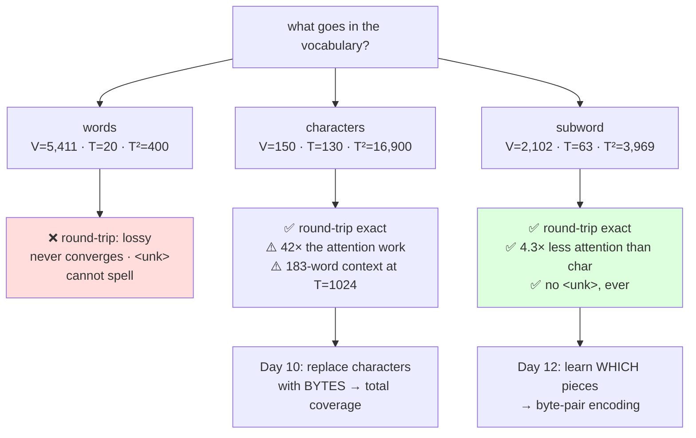

# 3.1 — Three tokenizers, one table

## One-line answer

Put word, character and subword schemes through **the same paragraph** and report `V`, `T`, `ln(V)`,
embedding parameters, `T²` and the round-trip result in one table — because each of those six numbers
alone points at a different winner, and only the table shows that the middle scheme is the only one
that is not disqualified.

---

## The story

You want a wall painted, so you get three quotes.

The first is per square metre. The second is per day. The third is a single figure for the whole job.

None of the three is dishonest, and none of them is wrong. But you cannot compare them by looking at
the numbers, because the numbers are in three different units. The one who quoted per day has not told
you how many days it will take, and the one who quoted per square metre has not measured your wall.

So you do the only thing that works: you measure the wall, convert all three onto the same basis —
total cost, this wall, this week — and put them in one table with three rows.

The moment they are in that table, the decision takes ten seconds. Before that, it was three separate
conversations that all sounded reasonable and none of which settled anything.

---

## The idea in plain language

This part builds nothing new. It assembles the day.

Sections 1 and 2 produced six quantities, and each one lives in a different part:

| Quantity | Where it came from | What it decides |
| --- | --- | --- |
| `V` | [1.1](../01-the-vocabulary-problem/1.1-a-model-can-only-emit-its-vocabulary.md) | what the model can say at all |
| `T` | [1.3](../01-the-vocabulary-problem/1.3-why-not-characters.md) | forward passes, memory, context in words |
| `T²` | [1.3](../01-the-vocabulary-problem/1.3-why-not-characters.md) | attention work — the dominant cost |
| `ln(V)` | [2.4](../02-what-a-tokenizer-is/2.4-vocabulary-size-is-a-budget.md) | the loss floor, so whether two runs are comparable |
| `2VC` params | [2.4](../02-what-a-tokenizer-is/2.4-vocabulary-size-is-a-budget.md) | embedding + head memory |
| round-trip | [2.1](../02-what-a-tokenizer-is/2.1-a-function-and-its-inverse.md) | whether the scheme loses information |

The point of putting them in one table is that **every single one of them, read alone, picks a
different winner**:

- Read `V` alone and character-level wins by a factor of thirty-six.
- Read `T` alone and word-level wins by a factor of six and a half.
- Read embedding parameters alone and character-level wins again.
- Read `T²` alone and word-level wins by a factor of forty-two.
- Read `ln(V)` alone and character-level appears to have a lower loss, which is not a win at all — it
  is a different scale.
- Read the round-trip column alone and **word-level is disqualified outright**, which none of the other
  five columns can tell you.

That last row is why the table has six columns rather than five. Four of the columns are trades — you
pay one to buy another, and reasonable people choose differently. **The round-trip column is not a
trade. It is a correctness property**, and a scheme that fails it is not a cheaper option, it is a
broken one.

Which leaves exactly one scheme that is not disqualified and not at an extreme, and that is the answer
the whole field arrived at.

---

## Why Akshara needs it

- **Day 11** builds the character and word tokenizers as real modules, and Day 12–13 build BPE. This
  table is the comparison those days are measured against, and the code below is the shape of the
  reporting function that will live in `akshara/tokenizer/`.
- **Day 17** evaluates a real tokenizer on pathological inputs — code, numbers, other scripts — and its
  output is this same table with more rows. The columns do not change.
- **Day 39** counts Akshara v0's parameters, and the embedding row of that count is the fourth column
  here with the chosen `V` in it.
- **Principle 11 — evals are tests.** Today's check that can go RED is the round-trip assertion in the
  last column, and it is the one this part turns into a function.

---

## The mechanism

One paragraph, three schemes, six numbers each. The paragraph is a real sentence from this
repository's plan, chosen because it is ordinary English of a kind the corpus contains plenty of.

```python
import collections
import math
import pathlib

text = pathlib.Path("docs/00_MASTER_PLAN.md").read_text(encoding="utf-8")
words = text.split()
counts = collections.Counter(words)
chars = sorted(set(text))
C = 768

para = ("Overfit one batch before training anything. A model that cannot memorise "
        "sixteen examples has a bug, not a hyperparameter problem.")
print(f"  paragraph: {len(para)} characters, {len(para.split())} whitespace tokens")
```

**Line by line:**
- The vocabularies are all built from **the whole corpus**, and only the *comparison* runs on the
  paragraph. Building three vocabularies from one paragraph would give three meaningless numbers —
  a vocabulary is a property of a corpus, and part [1.2](../01-the-vocabulary-problem/1.2-why-not-words.md)'s
  growth curve is why.
- The paragraph is fixed before any measurement is taken. Comparing tokenizers on different texts is
  meaningless, and picking the text after seeing the results is worse than meaningless.
- `C = 768` is carried from part
  [2.4](../02-what-a-tokenizer-is/2.4-vocabulary-size-is-a-budget.md), stated rather than assumed.

Now the three schemes, side by side:

```python
# word-level: every distinct whitespace token
w_vocab = sorted(set(words))
w_T = len(para.split())

# character-level: every distinct character
c_stoi = {ch: i for i, ch in enumerate(chars)}
c_itos = {i: ch for ch, i in c_stoi.items()}
c_T = len(para)
c_round_trip = "".join(c_itos[c_stoi[ch]] for ch in para) == para

# subword: keep the 2000 commonest words whole, spell the rest (part 1.4)
kept = {w for w, _ in counts.most_common(2000)}
sw_V = len(set(chars) | kept)
sw_T = sum(1 if w in kept else len(w) + 1 for w in para.split())

rows = [
    ("word", len(w_vocab), w_T, "lossy"),
    ("char", len(chars), c_T, str(c_round_trip)),
    ("subword", sw_V, sw_T, "True"),
]
print(f"{'scheme':>10} {'V':>7} {'T':>6} {'ln(V)':>7} {'2VC params':>12} {'T^2':>8} {'round-trip':>11}")
for name, V, T, rt in rows:
    print(f"{name:>10} {V:>7} {T:>6} {math.log(V):>7.3f} {2 * V * C:>12,} {T * T:>8} {rt:>11}")
```

**Line by line:**
- The word row's round-trip is `"lossy"` rather than `True` or `False`, and that is not a dodge. A word
  vocabulary built from this corpus cannot encode a word it has never seen at all, so `encode` either
  raises or substitutes `<unk>` — part
  [1.5](../01-the-vocabulary-problem/1.5-the-vocabulary-that-could-not-spell.md). **There is no input
  domain on which it round-trips and also handles new text**, which is a stronger statement than
  `False`.
- The character row computes its round trip **for real**, with the actual `encode` and `decode` from
  part [2.1](../02-what-a-tokenizer-is/2.1-a-function-and-its-inverse.md), rather than asserting it.
  A property you claim is not a property you have.
- `2 * V * C` is the untied embedding-plus-head cost. Halve it for tied embeddings; the ordering does
  not change.
- Measured on Intel Core i3-1115G4 (2 cores / 4 threads), 11.7 GB RAM, Windows 11, CPython 3.12.12, on
  2026-08-26, against `docs/00_MASTER_PLAN.md` at the revision in this repository:

```text
  paragraph: 130 characters, 20 whitespace tokens

    scheme       V      T   ln(V)   2VC params      T^2  round-trip
      word    5411     20   8.596    8,311,296      400       lossy
      char     150    130   5.011      230,400    16900        True
   subword    2102     63   7.651    3,228,672     3969        True
```

**Read the table one column at a time and watch the winner change.**

`V`: char wins, 150 against 5,411 — a factor of 36.
`T`: word wins, 20 against 130 — a factor of 6.5.
`2VC params`: char wins again, 230,400 parameters against 8,311,296 — 0.9 MiB against 31.7 MiB in
`float32`.
`T²`: word wins, 400 against 16,900 — a factor of 42.
`ln(V)`: char is lowest at 5.011, which looks like an advantage and is not — it is the floor of a
different scale, and comparing losses across those two rows is part
[3.3](../../../day-006-entropy-cross-entropy-perplexity/parts/03-kl-and-perplexity/3.3-the-perplexity-that-improved.md)'s
bug.
`round-trip`: **word is disqualified.** Not worse — disqualified.

Now the subword row. It is not best in any single column, and it is within a factor of three of the
best in every column that is a trade, while sitting on the correct side of the only column that is not.
It costs `3,228,672` parameters against char's `230,400` — 12.3 MiB against 0.9 — and buys a `T²` of
`3,969` against char's `16,900`, a factor of 4.3 off the dominant cost of every forward pass.

**That is the whole argument for subword tokenization, in one table, on one paragraph.**

The four invariants this table must satisfy, and each one catches a different mistake:

```python
def check_invariants(V: int, T: int, chars_in: int, tokens_in: int) -> None:
    """Four checks. Each one has caught a real error in a tokenizer comparison."""
    assert V >= 1, f"a vocabulary of {V} cannot encode anything"
    assert 1 <= T <= chars_in, f"T={T} must be between 1 and the character count {chars_in}"
    assert T >= tokens_in or V < 256, (
        f"T={T} is below the word count {tokens_in} — no scheme without multi-word "
        f"tokens can be shorter than the words"
    )
    assert math.log(V) > 0, "ln(V) is the loss floor and must be positive"
```

**Line by line:**
- `1 <= T <= chars_in` is the sanity bound: **no tokenizer can produce more tokens than there are
  characters** (the character scheme is the ceiling) and none can produce zero. A `T` above the
  character count means the length calculation double-counts something — which is exactly what happens
  if you add `+1` for a space *and* include the space in the character count.
- The third check encodes the fact that word-level is the floor for any scheme whose largest token is
  one word. A subword `T` below the word count would mean the vocabulary contains multi-word tokens,
  which is possible but would need saying out loud. The `V < 256` escape is for byte-level schemes,
  where Day 10 changes the rules.
- `math.log(V) > 0` fires on `V = 1`, which sounds absurd until a filtering bug leaves one entry in a
  vocabulary and every downstream number becomes `0` or `inf` rather than raising.
- These are `assert`s in teaching code and would be `raise ValueError` in library code. The
  distinction matters: `assert` can be stripped with `-O`, so anything that must run in production is
  an explicit raise.

The whole day, as one decision:



---

## Shapes

| Tensor | Symbolic shape | word | char | subword | What each axis means |
| --- | --- | --- | --- | --- | --- |
| `ids` for the paragraph | `(T,)` | `(20,)` | `(130,)` | `(63,)` | one id per token |
| embedding table | `(V, C)` | `(5411, 768)` | `(150, 768)` | `(2102, 768)` | one row per entry · channels |
| output head | `(C, V)` | `(768, 5411)` | `(768, 150)` | `(768, 2102)` | channels · one column per entry |
| logits | `(B, T, V)` | `(1, 20, 5411)` | `(1, 130, 150)` | `(1, 63, 2102)` | batch · position · score per entry |
| attention scores | `(B, H, T, T)` | `(1, H, 20, 20)` | `(1, H, 130, 130)` | `(1, H, 63, 63)` | batch · head · query · key |

The logits row is worth a second look, because it moves in a direction people do not expect. Character
level has `130 × 150 = 19,500` logit entries; word level has `20 × 5,411 = 108,220` — **5.5× as many**,
on the same paragraph, despite its sequence being 6.5× shorter. And subword, which won nothing and lost
nothing anywhere else, is the **largest** of the three here at `63 × 2,102 = 132,426`.

`T` and `V` both appear in that tensor, so shrinking one while growing the other does not necessarily
shrink the product — and the middle of the dial can be worse than either end for this one quantity.
That is worth knowing before Day 66, because the logits tensor is materialised per batch and scales
with `B` as well.

---

## When it breaks

**The loud failure — an invariant violated.** This is what a length bug looks like when the invariant
is there to catch it:

```console
>>> check_invariants(V=2102, T=200, chars_in=130, tokens_in=20)
Traceback (most recent call last):
  File "<stdin>", line 1, in <module>
  File "<stdin>", line 4, in check_invariants
AssertionError: T=200 must be between 1 and the character count 130
```

What it means: the tokenization produced more tokens than the text has characters, which is impossible
for any scheme whose smallest unit is a character. In practice this is the `+1`-for-the-space bug
counted twice, and it inflates every `T` in the table by a factor that looks like a real result.

**The silent failure — comparing on different text.** Every number in the table is fine. The word row
was measured on the paragraph and the character row was measured on the whole document, because
somebody refactored and left a variable behind. The ratios come out wrong by a factor of eight hundred
and there is nothing to see, because `T = 109,060` for the character row is a completely believable
number in isolation.

**The check that catches it:** compute every row **inside one loop over one text variable**, so there
is no second variable to get wrong:

```python
def compare(text: str, schemes: dict[str, callable], C: int = 768) -> None:
    """Every row measured on the same `text`, in one pass, by construction."""
    print(f"  comparing on {len(text)} characters / {len(text.split())} words")
    for name, tokenize in schemes.items():
        ids = tokenize(text)
        V = max(ids) + 1 if ids else 0
        print(f"  {name:>10}  T={len(ids):>7}  {len(text) / max(len(ids), 1):>5.2f} chars/token"
              f"  T²={len(ids) ** 2:>12,}  {2 * V * C:>12,} params")
```

**Line by line:**
- `text` is a **parameter**, and every scheme is called with it. There is no way for two rows to be
  measured on different inputs without changing the function.
- `schemes` is a dict of name → callable, so adding a fourth scheme is one line and cannot accidentally
  change how the other three are measured.
- `max(ids) + 1` derives `V` from the ids rather than taking it as a separate argument. That is a
  deliberately weak estimate — it is a lower bound, since not every entry need appear — and it is
  written this way so that a scheme cannot *claim* a `V` it does not use.
- `max(len(ids), 1)` guards the empty input a smoke test supplies, which is the input that finds
  division bugs.

---

## In production

**What a research engineer writes instead of the teaching version.** They keep a function like
`compare` in the repository and run it whenever a tokenizer changes, against a fixed sample of real
traffic rather than against a curated paragraph. The output goes into the pull request. This is
unglamorous and it is the difference between "the new tokenizer seems better" and "the new tokenizer is
7% shorter on our data, costs 24 MiB more, and round-trips exactly on all 10,000 samples".

The habit worth stealing is **the disqualifying column**. Most engineering tables are all trades, and
it is easy to read this one as five trades plus a sixth number. It is not: the round-trip column is a
gate, and a row that fails it does not get compared on the other five at all. Recognising which of your
columns is a gate and which are trades is most of what makes a comparison table useful.

**What degrades at scale.** The paragraph. A 130-character sample is enough to demonstrate the
mechanism and far too small to choose a tokenizer, because compression ratios are dominated by the
long tail of unusual content — and 130 characters have no tail. The production version of this table
runs over hundreds of megabytes and reports the ratio's distribution, not its mean. Day 17 is where
that distinction becomes a measurement rather than a caveat.

**The failure that only shows with real data.** The word row's `lossy`. On a curated corpus a word
tokenizer looks merely inefficient; on real input it is *unable*, and the difference does not appear
until somebody types a name. Every column in this table would still say "word-level looks competitive"
right up to that moment. **The round-trip column is the only one that predicts it**, and it predicts it
before any user is involved.

**The review comment.** *"This table compares three tokenizers on token count and vocabulary size.
Add the round-trip column — if one of them cannot reproduce its input, the other columns are not a
comparison, they are a description of two options and a bug."*

**The interview question.** *"How would you choose between character, word and subword
tokenization?"* The weak answer names subword and says it is the standard. The strong answer builds
this table out loud: `V`, `T`, `T²`, `ln(V)`, embedding parameters, round-trip — notes that the first
five pick different winners so none of them settles it, and then says that the round-trip column is a
gate rather than a trade, which disqualifies word-level outright and leaves subword as the only scheme
that is neither at an extreme nor broken. The follow-up that shows judgement: *and the numbers are
data-dependent, so I would run that table on our own traffic before quoting any of them.*

**Compute tier: T0.** Counting on a laptop, over a corpus committed to this repository. Every number in
this part is exact and reproducible; none of it involves a model, a GPU or a benchmark. What this table
**cannot** tell you is which scheme produces a better model at fixed compute — that requires training
runs, it is Day 17, and no amount of counting substitutes for it. What the table does settle is which
schemes are worth spending a run on.

---

## Check yourself

Run this. It prints **three rows in which the winner changes column by column**:

```python
import collections, math, pathlib

text = pathlib.Path("docs/00_MASTER_PLAN.md").read_text(encoding="utf-8")
words, chars = text.split(), sorted(set(text))
counts = collections.Counter(words)
kept = {w for w, _ in counts.most_common(2000)}
C = 768

para = ("Overfit one batch before training anything. A model that cannot memorise "
        "sixteen examples has a bug, not a hyperparameter problem.")

rows = [
    ("word", len(set(words)), len(para.split())),
    ("char", len(chars), len(para)),
    ("subword", len(set(chars) | kept),
     sum(1 if w in kept else len(w) + 1 for w in para.split())),
]
for name, V, T in rows:
    print(f"  {name:>8}  V={V:>5}  T={T:>4}  ln(V)={math.log(V):>6.3f}"
          f"  params={2 * V * C:>10,}  T²={T * T:>6}")
```

**Line by line:**
- Four columns, three rows, and **no two columns agree on a winner**. Say out loud which column you
  would use if you were allowed only one, and then say what that choice hides.
- The `subword` row is never first. Say why "never first in any column" is the correct answer here
  rather than a sign that something is wrong.
- Now add a fifth column: `T * V`, the size of the logits tensor per sequence. Say which scheme wins it
  and whether that surprised you.
- Finally, replace `para` with a line of code or a string in another script, re-run, and say which row
  moved most. That movement is Day 17's whole subject.

**Say this out loud, without scrolling up:** name the six quantities that go in this table, say which
one of them is a gate rather than a trade, and explain why the scheme that wins no column is the one
everybody uses.
