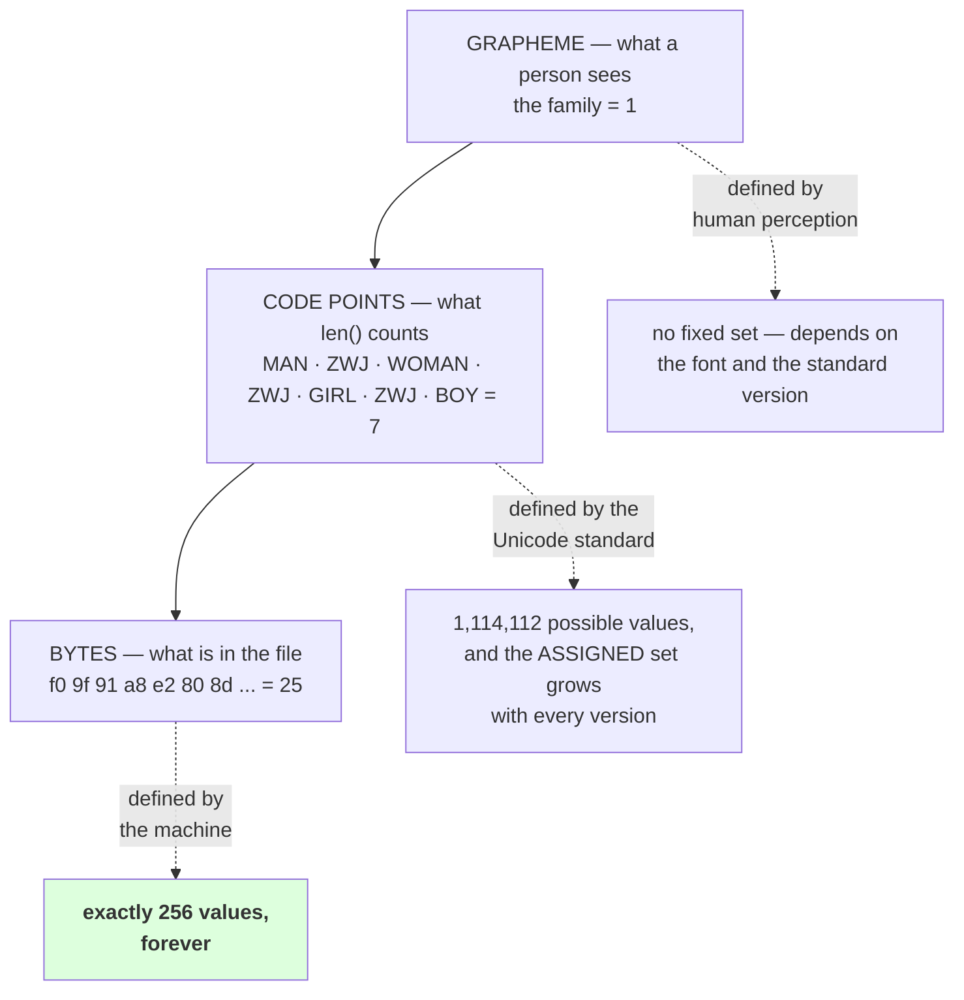

# 1.1 — A character is three different things

## One-line answer

The word "character" names three separate things — a **byte** in a file, a **code point** in Unicode,
and a **grapheme** that a person sees on a screen — and they disagree constantly: the word *café*
written one way is 4 code points and 5 bytes, written another way it is 5 code points and 6 bytes, and
both of them look like four letters.

---

## The story

You are typing a message and the app shows a little counter in the corner: **137 characters left**.

You type a smiley face. The counter drops by two.

You type another one. It drops by two again. You type a full stop and it drops by one.

Nothing is broken. The app is counting something, perfectly consistently, every time. It is simply
not counting the thing you assumed it was counting — the number of separate things you can see on the
screen.

And here is what turns that from a curiosity into a problem. Open the same message in a different app
and its counter says something else. A third app counts that same smiley as one. A fourth counts it as
four.

All four apps are correct. All four are counting different things. And not one of them says which.

---

## The idea in plain language

Day 9 part
[2.1](../../../day-009-the-vocabulary-problem/parts/02-what-a-tokenizer-is/2.1-a-function-and-its-inverse.md)
built a tokenizer over `sorted(set(text))` — "every distinct character". This part is about the fact
that *"character"* in that sentence is ambiguous, and that the ambiguity has three named resolutions.

**A byte.** One of 256 possible values, `0` to `255`. This is what is actually in a file, on a disk, on
a network. A byte has no opinion about language. Section 2 of this day is entirely about bytes.

**A code point.** One entry in the Unicode standard: a number, conventionally written `U+0041` for
`A` or `U+1F600` for a grinning face, together with a name and some properties. There are 1,114,112
possible code point values (`sys.maxunicode` is `1114111`, measured below). **A Python `str` is a
sequence of code points**, and `len()` counts them. This is what most programmers mean by "character",
and it is why most programmers are surprised by this day.

**A grapheme.** One thing a reader sees as a single unit. This is what a person means by "character",
and it is the only one of the three that is defined by human perception rather than by a number.

They line up perfectly for `abc` and immediately stop lining up for anything else:

| What you see | Graphemes | Code points | UTF-8 bytes |
| --- | --- | --- | --- |
| `cafe` | 4 | 4 | 4 |
| *café*, spelled one way | 4 | 4 | 5 |
| *café*, spelled the other way | 4 | 5 | 6 |
| a grinning face | 1 | 1 | 4 |
| a national flag | 1 | 2 | 8 |
| a family of four | 1 | 7 | 25 |
| *shabda* in Devanagari | 2 or 3 | 4 | 12 |

**Every one of those rows is measured below**, and the two *café* rows are the ones to stare at. They
are the same word. They print identically. They are not the same string, and part
[1.5](1.5-the-string-that-was-not-equal-to-itself.md) is what that costs.

The last row hedges on purpose. **The grapheme column is the only one in this table without a single
right answer**, because where one visible unit ends and the next begins is a rendering question, and
part [1.4](1.4-graphemes-what-a-person-sees.md) is about why.

Two more terms you will need, defined now:

- A **combining mark** is a code point that modifies the one before it rather than standing alone — an
  accent, a Devanagari vowel sign, a virama. The second spelling of *café* is the letter `e` followed
  by a combining acute accent: two code points, one grapheme.
- A **zero-width joiner** (ZWJ, `U+200D`) is an invisible code point that says "glue what is on either
  side of me into one thing". The family emoji is four people and three joiners.

The reason this is Day 10 and not a footnote: **a tokenizer's vocabulary is built over one of these
three, and its input arrives as another.** Get that wrong and you have a vocabulary that cannot encode
text which looks, to a reader, completely ordinary.

---

## Why Akshara needs it

- **Day 9 part [2.1](../../../day-009-the-vocabulary-problem/parts/02-what-a-tokenizer-is/2.1-a-function-and-its-inverse.md)**
  raised a `KeyError` on a Devanagari character outside its vocabulary. That vocabulary was built over
  code points, so its domain is "the code points in one document" — a domain that cannot be enumerated
  in advance for arbitrary input. Part [2.4](../02-utf-8-and-bytes/2.4-256-is-a-vocabulary.md) is the
  fix, and it works by changing which of the three things the vocabulary is over.
- **Day 11** builds a character-level tokenizer as a real module, and it has to decide, in code, which
  of these three "character" means. That decision is written today.
- **Day 13** builds byte-level BPE, whose entire point is that bytes are the only one of the three with
  a fixed, complete, never-growing set.
- **Day 17** measures a tokenizer on non-English text, and the numbers there are dominated by the
  code-point-to-byte ratio measured in part [2.4](../02-utf-8-and-bytes/2.4-256-is-a-vocabulary.md):
  1.00 bytes per character for ASCII, 3.00 for Devanagari.

---

## The mechanism

Count the same seven strings four ways. Nothing here needs a library beyond the standard one.

```python
import sys
import unicodedata

print("  python        :", sys.version.split()[0])
print("  unicodedata   :", unicodedata.unidata_version)
print("  sys.maxunicode:", sys.maxunicode)

samples = [
    "cafe",                                 # plain ASCII
    "caf\u00e9",                            # LATIN SMALL LETTER E WITH ACUTE — one code point
    "cafe\u0301",                           # e + COMBINING ACUTE ACCENT — two code points
    "\U0001F600",                           # GRINNING FACE
    "\U0001F1EE\U0001F1F3",                 # REGIONAL INDICATOR I + N
    "\U0001F468\u200d\U0001F469\u200d\U0001F467\u200d\U0001F466",   # family, ZWJ-joined
    "\u0936\u092c\u094d\u0926",             # DEVANAGARI: SHA BA VIRAMA DA
]

print(f"{'repr':>62} {'len':>4} {'utf8':>5} {'utf16':>6} {'utf32':>6}")
for s in samples:
    print(f"{ascii(s):>62} {len(s):>4} {len(s.encode('utf-8')):>5} "
          f"{len(s.encode('utf-16-le')):>6} {len(s.encode('utf-32-le')):>6}")
```

**Line by line:**
- Every sample is written as **escapes**, not as literal characters, and that is the most important
  line in this part. The two spellings of *café* are visually indistinguishable in this file, in your
  editor, in a terminal and in a code review — **escapes are the only way the difference survives
  being read by a person.** Keep this habit for any test data involving non-ASCII text.
- `ascii(s)` prints the repr with non-ASCII escaped, for the same reason. Plain `repr(s)` on Python 3
  prints the characters themselves, so both spellings of *café* would come out looking identical —
  which is exactly the confusion this part is about.
- `len(s)` counts **code points**, because a `str` is a sequence of code points. It is not counting
  bytes and it is not counting what you see.
- `utf-16-le` and `utf-32-le` are in the table because other languages count in those units. A `char`
  in Java or JavaScript is a UTF-16 code unit, so **their** `.length` gives yet another number, and the
  `utf16` column divided by two is that number.
- Measured on Intel Core i3-1115G4 (2 cores / 4 threads), 11.7 GB RAM, Windows 11, CPython 3.12.12,
  `unicodedata` 15.0.0, on 2026-08-26:

```text
  python        : 3.12.12
  unicodedata   : 15.0.0
  sys.maxunicode: 1114111
                                                          repr  len  utf8  utf16  utf32
                                                        'cafe'    4     4      8     16
                                                     'caf\xe9'    4     5      8     16
                                                  'cafe\u0301'    5     6     10     20
                                                  '\U0001f600'    1     4      4      4
                                        '\U0001f1ee\U0001f1f3'    2     8      8      8
  '\U0001f468\u200d\U0001f469\u200d\U0001f467\u200d\U0001f466'    7    25     22     28
                                    '\u0936\u092c\u094d\u0926'    4    12      8     16
```

Read the sixth row. **Seven code points, twenty-five bytes, and one thing on the screen.** Divide the
`utf16` column by two and you get 11, which is what JavaScript's `.length` reports for that same
emoji. Four different numbers, one emoji, and not one of them is `1`.

Now open one of them up, because the structure is the whole point:

```python
family = "\U0001F468\u200d\U0001F469\u200d\U0001F467\u200d\U0001F466"
for ch in family:
    try:
        name = unicodedata.name(ch)
    except ValueError:
        name = "<no name>"
    print(f"    U+{ord(ch):04X}  {unicodedata.category(ch)}  {name}")
```

**Line by line:**
- `ord(ch)` gives the code point's numeric value; `U+%04X` is the conventional way to write it, and
  writing it any other way makes it un-searchable in the standard.
- `unicodedata.name` returns the official name, and **raises `ValueError` for code points that have
  none** — unassigned ones and most control characters. The `try` is not defensive padding; it is
  required by the function's documented contract, which was read rather than guessed (Principle 7).
- `unicodedata.category` returns a two-letter general category. `Lo` is "letter, other", `Mn` is "mark,
  nonspacing" — a combining mark — and `Cf` is "other, format", which is what a zero-width joiner is.
  **Those categories are how you detect this structure in code**, and part
  [1.4](1.4-graphemes-what-a-person-sees.md) uses them.
- Measured on this machine, 2026-08-26:

```text
    U+1F468  So  MAN
    U+200D   Cf  ZERO WIDTH JOINER
    U+1F469  So  WOMAN
    U+200D   Cf  ZERO WIDTH JOINER
    U+1F467  So  GIRL
    U+200D   Cf  ZERO WIDTH JOINER
    U+1F466  So  BOY
```

**Four people and three pieces of invisible glue.** There is no "family of four" code point anywhere in
Unicode. The family is an *instruction* to draw four things as one — which is why every count of it
disagrees, and why every count is right.

The three levels, once:



That green box is where this day is going.

---

## When it breaks

**The loud failure — slicing into the middle of a grapheme.** Slicing a `str` slices code points, and
code points are not what you see:

```console
>>> family = "\U0001F468\u200d\U0001F469\u200d\U0001F467\u200d\U0001F466"
>>> len(family)
7
>>> ascii(family[:3])
"'\\U0001f468\\u200d\\U0001f469'"
>>> print(family[:3])
\U0001F468\u200d\U0001F469
```

What it means: `family[:3]` is "the first three code points" — a man, a joiner and a woman. Nothing
raised, and what came out is a **different, valid, complete emoji**: a couple. A slice that looks like
"roughly half the emoji" quietly produced a smaller family, which is strictly worse than an error,
because an error would have told you.

**The silent failure — a "character" limit that is not one.** A field validated with
`len(name) <= 20` allows twenty *code points*. For a name in ASCII that is twenty letters. For a name
with combining accents it might be twelve. For a name containing one emoji it is fewer still. The check
passes and fails for reasons the person typing cannot see, and the message says "maximum 20
characters", which is true and useless.

**The check that catches it,** and the point of it is to make the ambiguity impossible to ignore:

```python
def describe_length(s: str) -> dict[str, int]:
    """Never report 'the length'. Report which length."""
    return {
        "utf8_bytes": len(s.encode("utf-8")),
        "code_points": len(s),
        "utf16_units": len(s.encode("utf-16-le")) // 2,
        "non_mark_code_points": sum(
            1 for ch in s if unicodedata.category(ch) not in ("Mn", "Cf")
        ),
    }
```

**Line by line:**
- Four numbers, four names, and **not one of them is called `length`**. That is the whole design: a
  function returning one number invites a caller who does not know which one they got.
- `utf16_units` divides by two because `utf-16-le` emits two bytes per code unit. It is here because
  interop bugs with browsers and JVM services are common, and this is the number those systems report.
- `non_mark_code_points` excludes `Mn` (combining marks) and `Cf` (format characters such as ZWJ). **It
  is an approximation of the grapheme count, not the grapheme count** — part
  [1.4](1.4-graphemes-what-a-person-sees.md) shows exactly where it is wrong. Naming it honestly is the
  difference between an estimate and a lie.
- There is deliberately **no `graphemes` key**, because the standard library cannot compute one.
  Returning a wrong number under a right name would be worse than returning nothing at all.

---

## In production

**What a research engineer writes instead of the teaching version.** They do not write
`describe_length`, but they do **say which unit** whenever a length comes up: "8k tokens", "4,000
bytes", "the 2,000-code-point limit". The habit shows in variable names too — `n_bytes`,
`n_code_points`, `n_tokens` — never `length` or `size`, because those two words are precisely where
the ambiguity hides.

The second habit is writing non-ASCII test data as escapes. A test file containing a literal accented
letter cannot tell you *which* accented letter it contains, so a test written to catch a normalization
bug silently changes meaning the day somebody's editor normalises the file on save.

**What degrades at scale.** Storage limits, everywhere. A database column declared `VARCHAR(255)` may
count bytes or characters depending on the database and the encoding; an HTTP header limit counts
bytes; a UI limit counts something closer to graphemes. A pipeline passing text through all three has
three different limits with three different units — and the failures appear only for the users whose
names are not ASCII, which is to say the users least likely to be in the test data.

**The failure that only shows with real data.** Truncation. Cutting a string to "the first 100
characters" for a preview, a log line or a filename is safe in ASCII and produces a broken grapheme in
general: a lone combining mark, half a family, an isolated regional indicator. It renders as a box, or
attaches itself to whatever character it lands beside, and it is not reproducible on a developer's
machine typing English.

**The review comment.** *"`len(text) > 500` — is that bytes, code points, or what the user sees? If
this limit appears in a message shown to a person it needs to be the last one; if it is protecting a
database column it needs to be the first."*

**The interview question.** *"How long is a four-person family emoji?"* The weak answer is one, or
seven. The strong answer is: **that question has at least four answers and the right one depends on who
is asking** — 25 UTF-8 bytes, 7 code points, 11 UTF-16 code units, and 1 thing a reader sees — and then
names the structure that causes it: four people joined by three zero-width joiners, with no "family"
code point existing anywhere. The follow-up that shows judgement: *which is why length limits should
state their unit, and why a text pipeline should agree on one unit end to end.*

**Compute tier: T0.** Counting on a laptop, with the standard library and no data files. Every number
here is a property of the Unicode standard as implemented by `unicodedata` **15.0.0**, and it will
reproduce exactly on any Python carrying that same data version. It may *not* reproduce on a different
Unicode version — and that is not a flaw in the measurement, it is the fact that the assigned set of
code points grows, which is the argument for section 2.

---

## Check yourself

Run this. It prints **four different lengths for one emoji**:

```python
import sys
import unicodedata

sys.stdout.reconfigure(errors="replace")   # a cp1252 console cannot print every character

family = "\U0001F468\u200d\U0001F469\u200d\U0001F467\u200d\U0001F466"
print("  unicodedata   :", unicodedata.unidata_version)
print("  utf-8 bytes   :", len(family.encode("utf-8")))
print("  code points   :", len(family))
print("  utf-16 units  :", len(family.encode("utf-16-le")) // 2)
print("  what you see  : 1")
print("  first 3 points:", ascii(family[:3]))

for spelling in ("caf\u00e9", "cafe\u0301"):
    print(f"  {ascii(spelling):>14}  len={len(spelling)}"
          f"  bytes={len(spelling.encode('utf-8'))}  prints as: {spelling}")
```

**Line by line:**
- `sys.stdout.reconfigure(errors="replace")` is there because the last line of this script prints raw
  characters, and on a Windows console — measured in part
  [2.1](../02-utf-8-and-bytes/2.1-text-has-to-become-bytes.md), this machine's `sys.stdout.encoding` is
  `cp1252` — a combining accent has no representation and `print` raises `UnicodeEncodeError` part way
  through the line. With the handler set, unencodable characters come out as `?` and the script
  finishes. **If your console shows `?` where a character should be, that is your console, not your
  string.**
- The four length lines print `25`, `7`, `11` and `1`. **Say out loud which one belongs in an error
  message and which one in a database check.**
- `family[:3]` prints a complete, valid, two-person emoji. Say whether you expected a crash, and say
  which of the two outcomes is worse.
- The two *café* rows print `len=4` and `len=5`, and then **print identically** in the last column.
  Look at that column and say how you would ever notice this in a log file.
- Now run `len("\U0001F1EE\U0001F1F3")` and say why a flag is two code points. Then look up what those
  two code points are actually called, and say what happens if you slice between them.

**Say this out loud, without scrolling up:** name the three things the word "character" can mean, say
which one `len()` counts, and say which of the three has a set that is finished and will never grow.
