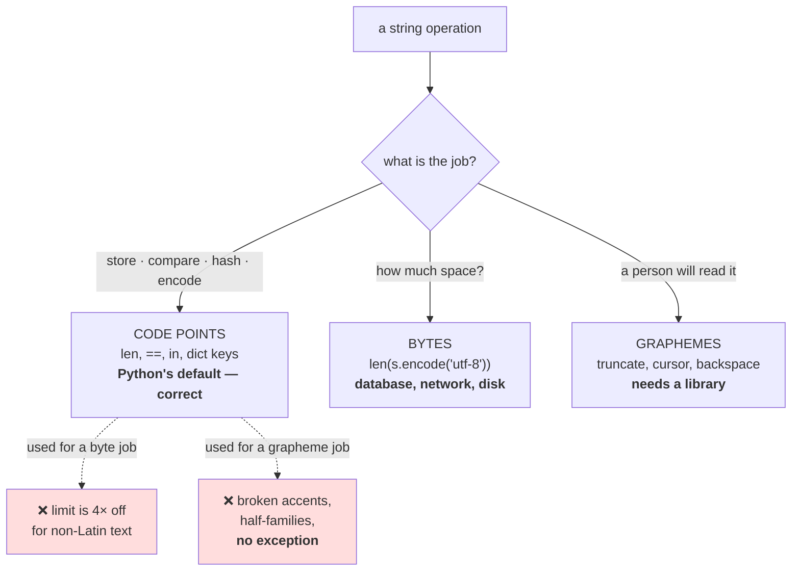

# 1.2 — What `len`, slicing and reversing actually operate on

## One-line answer

Every string operation in Python — `len`, indexing, slicing, `reversed`, `in`, `.find` — works on
**code points**, which means each of them is correct at the code-point level and can be wrong at the
level a person reads, and the damage is silent because the result is always a valid string.

---

## The story

A form online says: **name — maximum 20 characters**.

Somebody types their name with an accent in it and the form rejects it as too long. They count the
letters on the screen. Nineteen. They count again. Still nineteen. They delete the accent and it is
accepted.

Somebody else pastes a name in a different script, twelve letters long. The form accepts it happily.
Then the record is saved, and what comes back out is the first two-thirds of the name followed by a
small black diamond.

Neither person did anything unusual, and nobody wrote a bug. The form's limit, the browser's limit and
the database's limit were three different limits that happened to have the same number printed next to
them — because each one was counting a different thing.

And the person who wrote "maximum 20 characters" on the label never knew there was more than one thing
to count.

---

## The idea in plain language

Part [1.1](1.1-a-character-is-three-different-things.md) established the three levels. This part is
about a narrower and more practical question: **which level does the code you are already writing
operate on?**

For Python 3, the answer is uniform and easy to remember. **A `str` is a sequence of code points**, and
every operation on it works on code points:

| Operation | What it actually does |
| --- | --- |
| `len(s)` | counts code points |
| `s[i]` | returns the `i`-th code point, as a length-1 `str` |
| `s[a:b]` | returns code points `a` through `b-1` |
| `for ch in s` | iterates code points |
| `reversed(s)` | reverses the code point order |
| `"x" in s` | searches for a code point subsequence |
| `s.find(x)` | returns a code point index |

That uniformity is a genuine strength of Python 3 and it is worth appreciating: there is exactly one
answer, it does not change with the content of the string, and it is the same on every platform.

The problem is that **code points are the wrong unit for two of the three jobs people use these
operations for**:

**Jobs where code points are right.** Storing, comparing, hashing, encoding, and anything where you
want an exact, well-defined, reproducible unit. Also: feeding a tokenizer whose vocabulary is over code
points — which is what Day 9 part
[2.1](../../../day-009-the-vocabulary-problem/parts/02-what-a-tokenizer-is/2.1-a-function-and-its-inverse.md)
built.

**Jobs where bytes are right and code points are wrong.** Anything about *size*: a database column
limit, an HTTP header limit, a network payload, a disk quota, a memory estimate. A 100-code-point
string can be 100 bytes or 400 depending entirely on its content.

**Jobs where graphemes are right and code points are wrong.** Anything a person will read or act on:
a length shown in a message, a truncation for display, a cursor position, a backspace, a "first
letter" avatar. Here, code points produce results that are valid strings and wrong output.

The dangerous member of that last group is **truncation**, because it is everywhere — previews,
filenames, log lines, database columns — and because the failure is not an exception. Cutting a string
between a letter and its combining accent gives you a string containing a stray accent, which renders
by attaching itself to whatever it lands next to. Cutting between a person and a zero-width joiner
gives you a family with a trailing piece of invisible glue.

One more thing worth knowing, because it explains why other people's code disagrees with yours: **not
every language counts code points.** Java and JavaScript count UTF-16 code units, so anything outside
the first 65,536 code points counts as two there and one in Python. Go's `len` counts *bytes*. Rust's
`str::len` counts bytes too. **Three languages, three answers, all documented, all different** — and a
service boundary between any two of them is where a length limit stops meaning one thing.

---

## Why Akshara needs it

- **Day 11**'s character tokenizer iterates a string with `for ch in text`, which iterates code points.
  Part [1.4](1.4-graphemes-what-a-person-sees.md) is why that is a decision and not a default.
- **Day 13**'s byte-level BPE never touches a `str` after the first `.encode("utf-8")`, which sidesteps
  everything in this part. That is not laziness — it is the reason byte-level won.
- **Day 51 onward**, the data loader chunks a corpus into `block_size` pieces. Chunking a `str` cuts
  code points; chunking `bytes` cuts bytes; and part
  [2.5](../02-utf-8-and-bytes/2.5-the-decode-that-split-a-character.md) is what the second one does at
  a chunk boundary.
- **Day 100 onward**, the serving surface truncates prompts to a context limit and truncates responses
  for logs. Both are this part, in production, on user text.

---

## The mechanism

Take one string and do ordinary things to it. Every result below is a valid string, and three of them
are wrong.

```python
import unicodedata

s = "caf́"                              # 'c', 'a', 'f' + a stray COMBINING ACUTE ACCENT
word = "café open"                     # 'cafe' + combining acute, then ' open'

print(f"  word          : {ascii(word)}")
print(f"  len           : {len(word)}")
print(f"  word[:4]      : {ascii(word[:4])}")
print(f"  word[:5]      : {ascii(word[:5])}")
print(f"  reversed      : {ascii(''.join(reversed(word)))}")
print(f"  'e' in word   : {'e' in word}")
print(f"  word.find('e'): {word.find('e')}")
```

**Line by line:**
- `word` is written with an escape for exactly the reason part 1.1 gave: written literally, `cafe` plus
  a combining accent and `caf` plus a precomposed `é` are the same six pixels and different strings.
- `word[:4]` takes `c`, `a`, `f`, `e` — and **leaves the accent behind**. The result is a valid string
  that reads `cafe`, having silently dropped an accent that belonged to it.
- `word[:5]` takes the accent too and is therefore correct here — but the correct cut is at 5 and the
  "obvious" one is at 4, and **nothing in the code says which**.
- `reversed` puts the accent *before* the `e` it belongs to. The result is a valid string whose accent
  now attaches to a different letter.
- `'e' in word` is `True`, which is right at the code point level and arguably wrong at the reading
  level, since there is no bare `e` in *café* — the `e` there is accented.
- Measured on Intel Core i3-1115G4 (2 cores / 4 threads), 11.7 GB RAM, Windows 11, CPython 3.12.12,
  `unicodedata` 15.0.0, on 2026-08-26:

```text
  word          : 'café open'
  len           : 10
  word[:4]      : 'cafe'
  word[:5]      : 'café'
  reversed      : 'nepo ́efac'
  'e' in word   : True
  word.find('e'): 3
```

**`len` is 10 and a reader counts nine.** `word[:4]` returns `'cafe'` — the accent is gone, no
exception, and the string prints as an ordinary English word.

Now the same three operations on the family emoji, where the stakes are higher:

```python
family = "\U0001F468‍\U0001F469‍\U0001F467‍\U0001F466"

for cut in (1, 2, 3, 5, 7):
    piece = family[:cut]
    print(f"  family[:{cut}]  len={len(piece)}  {ascii(piece)}")
```

**Line by line:**
- `cut = 1` gives one man. A complete, valid, sensible emoji — **and not a truncation of a family, a
  different thing entirely.**
- `cut = 2` gives a man followed by a dangling zero-width joiner. That is a string ending in invisible
  glue with nothing to glue to; renderers handle it differently and none of them tell you.
- `cut = 3` gives a man, a joiner and a woman: a couple. Also complete, also valid, also not what was
  asked for.
- `cut = 7` is the whole thing. **The only safe cut points are 1, 3, 5 and 7**, and there is nothing in
  the string's type or in any of these operations that knows that.
- Measured on this machine, 2026-08-26: `family[:1]` is `'\U0001f468'`, `family[:2]` is
  `'\U0001f468‍'`, `family[:3]` is `'\U0001f468‍\U0001f469'`. Print them and look at what
  your terminal draws.

The three units and the operations that belong to each:



---

## When it breaks

**The loud failure — there mostly isn't one, and here is the exception.** Encoding a lone surrogate
raises, because a surrogate is not a valid character on its own:

```console
>>> "\ud800".encode("utf-8")
Traceback (most recent call last):
  File "<stdin>", line 1, in <module>
UnicodeEncodeError: 'utf-8' codec can't encode character '\ud800' in position 0: surrogates not allowed
```

What it means: Python let you *build* that string, because a `str` is a sequence of code point values
and `0xD800` is a value — but it is a value reserved for UTF-16's internal machinery and it does not
encode. This is one of the very few places in this part where the wrongness is loud, and it arrives
only at the encode boundary, which may be far from where the string was built.

**The silent failure, which is the normal case.** Everything else on this page returns a valid string.
`word[:4]` dropped an accent. `reversed` moved one onto the wrong letter. A length check compared
apples to a different fruit. In every case the program continued, the output was renderable, and the
only sign was that somebody's name looked slightly wrong on a screen somewhere.

**The check that catches truncation,** and the point of it is that it refuses to cut in a bad place:

```python
def safe_truncate_code_points(s: str, limit: int) -> str:
    """Cut at `limit` code points, then back off any dangling combining marks or joiners.

    This is an APPROXIMATION of grapheme-safe truncation, not the real thing.
    Part 1.4 says exactly what it still gets wrong.
    """
    if len(s) <= limit:
        return s
    cut = limit
    while cut > 0 and unicodedata.category(s[cut - 1]) in ("Mn", "Mc", "Cf"):
        cut -= 1                      # never end on a mark or a joiner
    return s[:cut]
```

**Line by line:**
- The `while` walks **backwards** off the cut point while the last character is a nonspacing mark
  (`Mn`), a spacing combining mark (`Mc`) or a format character (`Cf`, which is what a zero-width
  joiner is). Those three categories are the ones that cannot legitimately end a piece of text.
- It backs off rather than reaching forward, because reaching forward would exceed the limit — and the
  limit usually exists because something downstream will reject a longer string.
- `cut > 0` guards a string that is *entirely* marks, which is rare, real, and an infinite loop
  without the guard.
- **The docstring says it is an approximation.** It does not handle a cut in the middle of a
  regional-indicator pair (a flag), and it does not implement the standard's grapheme-cluster rules.
  Part [1.4](1.4-graphemes-what-a-person-sees.md) is where that gap gets named precisely. **A helper
  whose docstring overstates it is worse than no helper**, because the next person will trust it.
- Note what it does **not** do: it does not fix the byte-length problem. If the limit is a database
  column in bytes, this function is the wrong tool entirely, and the right one truncates
  `s.encode("utf-8")` and backs off to a byte boundary — which is part
  [2.3](../02-utf-8-and-bytes/2.3-self-synchronising.md).

---

## In production

**What a research engineer writes instead of the teaching version.** They avoid the problem rather than
solving it. In a text pipeline, the rule is: **convert to bytes at the boundary and stay there.** Every
limit is in bytes, every chunk is in bytes, every hash is over bytes. The `str` exists only at the very
edges — where text is read from a file and where it is shown to a person — and everything in between
is `bytes`. That is not a style preference; it is the reason byte-level tokenization (Day 13) removed a
whole family of bugs from the field.

Where a `str` is unavoidable, the habit is to **never slice user text by a number** without saying what
the number counts. A truncation helper takes a named unit, or there are two helpers with two names.

**What degrades at scale.** Mixed-language traffic against a code-point limit. A 2,000-code-point
prompt limit is roughly 2,000 bytes for English and roughly 6,000 for Devanagari or Chinese. If the
real constraint downstream is bytes, the limit is enforced four times more loosely for some users than
others, and the failure lands as an unexplained error for exactly the users the limit was measured
least carefully against.

**The failure that only shows with real data.** Reversal and casing. `reversed` on ASCII is a party
trick; on text with combining marks it produces mojibake, and on some scripts it is meaningless
regardless of the unit. `str.upper()` can change a string's *length* — the German `ß` uppercases to two
characters — so a length check before an uppercase and a length check after it can disagree. Neither
shows up in an English test suite.

**The review comment.** *"`text[:200]` — is 200 a display limit or a storage limit? If it's storage,
this needs to be on the encoded bytes; if it's display, this can cut a name in half and we should back
off to a safe boundary."*

**The interview question.** *"What does `len()` return for a Python string?"* The weak answer is "the
number of characters". The strong answer is: **the number of code points** — and then says why that is
worth stating precisely: it is not the byte count (which depends on the content), it is not what a user
sees (an emoji family is 7), and it is not what Java or JavaScript's `.length` returns (UTF-16 code
units) or what Go and Rust return (bytes). The follow-up that shows judgement: *so any length limit
crossing a service boundary has to state its unit, and in a text pipeline the safest answer is to work
in bytes end to end.*

**Compute tier: T0.** String operations on a laptop, standard library only. Every result here is exact
and deterministic under `unicodedata` 15.0.0 — there is no seed, no timing and no hardware dependence.
What this part **cannot** show you is what your terminal or browser actually draws for a broken
grapheme, because that is a font and renderer question and it differs between machines. Run the code
and look at your own screen; the disagreement between what Python reports and what you see is the whole
lesson.

---

## Check yourself

Run this. It prints **a word that lost its accent with no error**:

```python
import sys
import unicodedata

sys.stdout.reconfigure(errors="replace")   # a cp1252 console cannot print every character

word = "cafe\u0301 open"
family = "\U0001F468\u200d\U0001F469\u200d\U0001F467\u200d\U0001F466"

print("  len(word)      :", len(word), " (a reader counts 9)")
print("  word[:4]       :", ascii(word[:4]), "->", word[:4])
print("  word[:5]       :", ascii(word[:5]), "->", word[:5])
print("  reversed       :", ascii("".join(reversed(word))))
for cut in (1, 2, 3, 5, 7):
    print(f"  family[:{cut}]    :", ascii(family[:cut]))
print("  utf-8 bytes    :", len(word.encode("utf-8")), "vs len:", len(word))
```

**Line by line:**
- `sys.stdout.reconfigure(errors="replace")` is there because this script prints raw characters,
  and on a Windows console — measured in part
  [2.1](../02-utf-8-and-bytes/2.1-text-has-to-become-bytes.md), `sys.stdout.encoding` here is
  `cp1252` — a combining accent has no representation and `print` raises `UnicodeEncodeError` part
  way through the line. With the handler set, unencodable characters come out as `?`. **A `?` on
  your screen is your console, not your string.**
- `word[:4]` prints `'cafe'` and then draws as an ordinary English word. **Say out loud what was lost
  and how a log file would have shown it.**
- The `family[:cut]` rows print five different valid emoji. Say which of the five cut points are safe
  and how you would compute that set in code.
- The last line prints `11` bytes against `len` of `10`. Say which of those two numbers a database
  column limit cares about.
- Now try `"straße".upper()` and compare its length before and after. Say what that does to a
  length check that runs on one side of a `.upper()` call.

**Say this out loud, without scrolling up:** name the unit that every Python string operation works on,
name one job where that unit is exactly right and two where it is wrong, and say what happens — with
no exception — when you slice between a letter and its accent.
