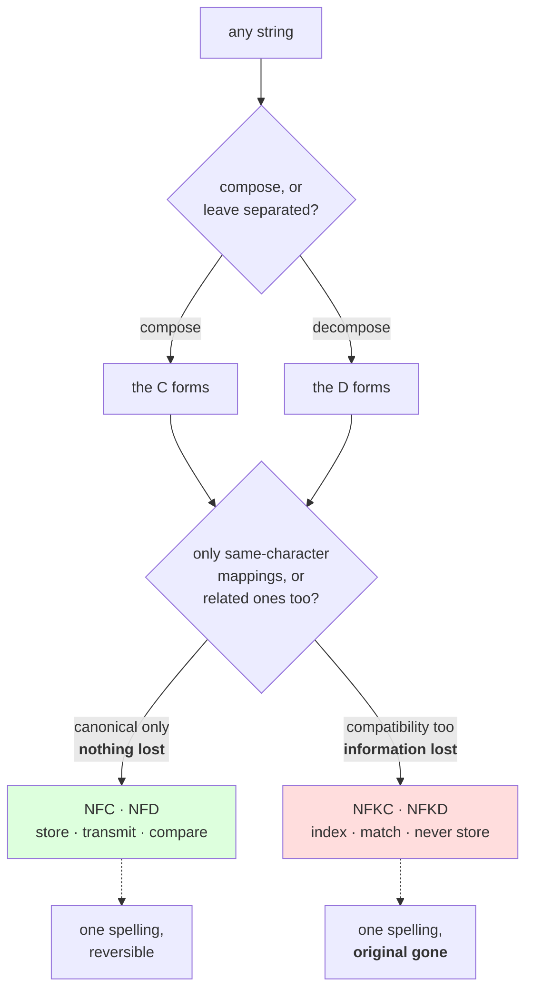

# 1.3 — Normalization, or one spelling for the same thing

## One-line answer

Unicode allows more than one sequence of code points to mean the same text, so it also defines four
**normalization forms** that rewrite any string into one agreed spelling — two of which (`NFC`, `NFD`)
preserve the text exactly and are safe to store, and two of which (`NFKC`, `NFKD`) throw information
away and are not.

---

## The story

You are trying to find an old message. You remember it had the word for a coffee shop in it, with the
accent on the last letter, so you type those four letters into the search box at the top of the app.

Nothing. No results.

You scroll up by hand instead, and there it is, in a message from last week. The word is right there on
the screen, spelled exactly the way you just typed it. Four letters, one accent, no difference you can
see.

So you try something. You select the word inside that old message, copy it, and paste it into the
search box. The search box now looks identical to how it looked a moment ago. This time the app finds
the message.

You did not fix a typo. There was no typo. You replaced a word with a word that looks the same, and the
search started working.

---

## The idea in plain language

Part [1.1](1.1-a-character-is-three-different-things.md) showed that the word in that story has two
spellings in code points: three letters then one accented letter, where the accented letter is a single
code point — or four plain letters followed by a **combining mark**, a code point that modifies the one
before it instead of standing on its own.

That is not an accident or a bug. Unicode deliberately supports both, because it had to absorb dozens
of older character sets that each made a different choice, and dropping either spelling would have made
some existing text unconvertible. The cost of that decision is the one you just met: **two strings that
mean the same text are not equal**, because equality compares code points and the code points differ.

**Normalization** is the standard's answer. It is a function that takes a string and returns a string
with the same meaning in an agreed spelling. Run it on both sides of a comparison and the comparison
starts working.

There are four forms, and they come from two independent choices.

**Choice one: compose or decompose.** Do you want the shortest spelling, where a letter and its accent
are welded into one code point wherever such a code point exists? That is **composition**, form **C**.
Or do you want the fully separated spelling, where every accent is its own code point? That is
**decomposition**, form **D**.

**Choice two: canonical or compatibility.** A **canonical** mapping only relates sequences that are
genuinely the same character — an accented letter and the letter-plus-accent pair are the same
character written two ways, so that mapping loses nothing. A **compatibility** mapping goes further and
relates characters that are *related but not the same*: the single code point at `U+FB01`, which draws
`f` and `i` joined into one shape, maps to the two ordinary letters `f` and `i`; the circled digit at
`U+2460` maps to a plain `1`; the full-width letter at `U+FF21` maps to `A`. That mapping **throws
information away**, and it is marked with a **K**.

Two choices, four forms:

| Form | Composes? | Loses information? | What it is for |
| --- | --- | --- | --- |
| `NFD` | no — fully decomposed | no | comparing, and any code that inspects accents |
| `NFC` | yes — composed where possible | no | **storage, transmission, and the default answer** |
| `NFKD` | no — fully decomposed | **yes** | search indexing, matching, fuzzy lookup |
| `NFKC` | yes — composed where possible | **yes** | search indexing, matching, fuzzy lookup |

**The `K` forms are not "more normal".** They are a different tool for a different job. `NFKC` turns
the joined `fi` shape into two plain letters, which is exactly what a search index wants and exactly
what a name field must never do. Losing information is the *feature*, and it is the feature that makes
those two forms unsafe as a storage format: you cannot get the original back.

One term to define now, because it is the reason a rule you might expect does not hold: a
**composition exclusion** is a code point that decomposes but is deliberately *not* recomposed by
`NFC`, because recomposing it would undo a distinction some script needs. `NFC` is therefore not
"always the shortest form" — measured below, the Devanagari letter at `U+0958` is one code point that
`NFC` turns into **two**. If you have been told `NFC` never makes a string longer, that is the
counterexample.

---

## Why Akshara needs it

- **Part [1.5](1.5-the-string-that-was-not-equal-to-itself.md)** is this part's failure: a vocabulary
  built from one spelling, queried with the other, raising `KeyError` on a word the model has seen ten
  thousand times.
- **Day 11**'s character tokenizer has to choose a normalization form *before* it builds its table,
  because the table's contents and its hash both depend on the choice — measured in part
  [1.5](1.5-the-string-that-was-not-equal-to-itself.md), the same text under `NFC` and under `NFD`
  gives two 16-character vocabularies with different contents and different hashes.
- **Day 12–13**'s BPE trainer counts pair frequencies. If the corpus contains both spellings of the
  same word, the counts are split between them, and both spellings get worse merges than either would
  have got alone.
- **Day 60 onward**, the training corpus is assembled from more than one source. Sources normalize
  differently, and a corpus that mixes forms trains a model that must learn both — spending capacity on
  a distinction that carries no meaning.
- **Day 100 onward**, the serving path must apply **exactly** the normalization the training path
  applied. That is Silent Failure #2 from the plan's §6, and the check for it is written below.

---

## The mechanism

`unicodedata.normalize(form, s)` is the whole interface. The behaviour was checked against the Python
3.12 standard library documentation page for `unicodedata` — the version actually running here — on
2026-08-26: the function takes the form name as a string, one of `"NFC"`, `"NFD"`, `"NFKC"` or
`"NFKD"`, and returns a new `str`.

```python
import sys
import unicodedata

print("  python        :", sys.version.split()[0])
print("  unicodedata   :", unicodedata.unidata_version)

samples = [
    ("caf\u00e9",     "precomposed e-acute"),
    ("cafe\u0301",    "e + combining acute"),
    ("\uFB01le",      "FI LIGATURE + l + e"),
    ("\u212A",        "KELVIN SIGN"),
    ("\uFF21\uFF22",  "FULLWIDTH A, B"),
    ("\u2460",        "CIRCLED DIGIT ONE"),
    ("\u0958",        "DEVANAGARI LETTER QA"),
    ("\u00BD",        "VULGAR FRACTION ONE HALF"),
]

for s, name in samples:
    nfc = unicodedata.normalize("NFC", s)
    nfd = unicodedata.normalize("NFD", s)
    nfkc = unicodedata.normalize("NFKC", s)
    print(f"  {ascii(s):>22} {len(s)}  NFC {ascii(nfc):>18} {len(nfc)}"
          f"  NFD {ascii(nfd):>22} {len(nfd)}  NFKC {ascii(nfkc):>14} {len(nfkc)}  {name}")
```

**Line by line:**
- Every sample is written as an **escape**, for the reason part
  [1.1](1.1-a-character-is-three-different-things.md) gave: the two spellings of the coffee-shop word
  are the same pixels, and a test written with literal characters cannot tell you which one it
  contains.
- `unicodedata.unidata_version` is printed first because **every number below is a property of that
  version**, not of Python. Two machines with the same Python and different Unicode data will disagree,
  and the printed line is what lets you notice.
- `\ufb01` is one code point that draws as a joined `fi`. It is a single real character with its own
  number, not two letters set close together, and that is why a compatibility mapping is needed to
  relate it to `f` and `i`.
- `\u212a` is the **Kelvin sign**. It draws exactly like a capital `K` and is a different code point,
  which is why it is in the list.
- `\u0958` is the composition exclusion named above. Watch its `NFC` column.
- `ascii()` rather than `print(s)` throughout, so the two spellings stay visibly different on the page
  — and so the script keeps working on a console whose encoding is not UTF-8, which part
  [2.1](../02-utf-8-and-bytes/2.1-text-has-to-become-bytes.md) shows is a real failure on Windows.
- Measured on Intel Core i3-1115G4 (2 cores / 4 threads), 11.7 GB RAM, Windows 11, CPython 3.12.12,
  `unicodedata` 15.0.0, on 2026-08-26:

```text
  python        : 3.12.12
  unicodedata   : 15.0.0
               'caf\xe9' 4  NFC          'caf\xe9' 4  NFD           'cafe\u0301' 5  NFKC      'caf\xe9' 4  precomposed e-acute
            'cafe\u0301' 5  NFC          'caf\xe9' 4  NFD           'cafe\u0301' 5  NFKC      'caf\xe9' 4  e + combining acute
              '\ufb01le' 3  NFC         '\ufb01le' 3  NFD             '\ufb01le' 3  NFKC         'file' 4  FI LIGATURE + l + e
                '\u212a' 1  NFC                'K' 1  NFD                    'K' 1  NFKC            'K' 1  KELVIN SIGN
          '\uff21\uff22' 2  NFC     '\uff21\uff22' 2  NFD         '\uff21\uff22' 2  NFKC           'AB' 2  FULLWIDTH A, B
                '\u2460' 1  NFC           '\u2460' 1  NFD               '\u2460' 1  NFKC            '1' 1  CIRCLED DIGIT ONE
                '\u0958' 1  NFC     '\u0915\u093c' 2  NFD         '\u0915\u093c' 2  NFKC '\u0915\u093c' 2  DEVANAGARI LETTER QA
                  '\xbd' 1  NFC             '\xbd' 1  NFD                 '\xbd' 1  NFKC     '1\u20442' 3  VULGAR FRACTION ONE HALF
```

Four rows are worth stopping on.

**Rows one and two** are the point of the whole part. Two different inputs; both become `'caf\xe9'`
under `NFC` and both become `'cafe\u0301'` under `NFD`. Normalize either side and they agree; normalize
neither and they never will.

**The Kelvin row** is the surprise. `NFC` — the *safe*, lossless, composing form — turns `U+212A` into
an ordinary letter `K`. That is a canonical mapping, not a compatibility one: the standard says those
two code points **are** the same character, so nothing is lost by unifying them. It is also why "`NFC`
never changes anything that matters" is false.

**The Devanagari row** is the composition exclusion. One code point in, two code points out, from the
form that is supposed to compose. `NFC` normalizes; it does not minimise.

**The fraction row** shows what the `K` costs going the other way: one character becomes three, and the
three include `U+2044 FRACTION SLASH`, which is not the `/` on your keyboard.

Now the two properties you are allowed to rely on, and one you are not:

```python
import unicodedata

a, b = "caf\u00e9", "cafe\u0301"
print("  a == b                :", a == b)
print("  NFC(a) == NFC(b)      :", unicodedata.normalize("NFC", a) == unicodedata.normalize("NFC", b))
print("  NFD(a) == NFD(b)      :", unicodedata.normalize("NFD", a) == unicodedata.normalize("NFD", b))
print("  is_normalized NFC, a  :", unicodedata.is_normalized("NFC", a))
print("  is_normalized NFC, b  :", unicodedata.is_normalized("NFC", b))

t = "cafe\u0301 \uFB01le \u2460"
for form in ("NFC", "NFD", "NFKC", "NFKD"):
    once = unicodedata.normalize(form, t)
    twice = unicodedata.normalize(form, once)
    print(f"  {form:<4} idempotent: {once == twice}   len {len(t)} -> {len(once)}")

for s in ("\uFB01le", "\u2460", "\u00BD"):
    k = unicodedata.normalize("NFKC", s)
    print(f"  NFKC({ascii(s)}) = {ascii(k)}   can it be undone? "
          f"{unicodedata.normalize('NFC', k) == s}")
```

**Line by line:**
- `is_normalized(form, s)` answers "is this string already in that form?" **without building a new
  string**, which matters when the answer is usually yes and the strings are large. It was checked
  against the Python 3.12 `unicodedata` documentation page on 2026-08-26; it is available from Python
  3.8 onward.
- The idempotence loop is not decoration. **Normalizing twice must equal normalizing once**, and that
  property is what allows a pipeline to normalize defensively at more than one stage without corrupting
  anything.
- The last loop asks the only question that separates the safe forms from the `K` forms: **can you get
  the original back?** For `NFC` and `NFD` the answer is yes by construction. For `NFKC` it is no, and
  the loop measures that rather than asserting it.
- Measured on this machine, 2026-08-26:

```text
  a == b                : False
  NFC(a) == NFC(b)      : True
  NFD(a) == NFD(b)      : True
  is_normalized NFC, a  : True
  is_normalized NFC, b  : False
  NFC  idempotent: True   len 11 -> 10
  NFD  idempotent: True   len 11 -> 11
  NFKC idempotent: True   len 11 -> 11
  NFKD idempotent: True   len 11 -> 12
  NFKC('\ufb01le') = 'file'   can it be undone? False
  NFKC('\u2460') = '1'   can it be undone? False
  NFKC('\xbd') = '1\u20442'   can it be undone? False
```

**`a == b` is `False` and both normalized comparisons are `True`.** That is the entire fix, and it is
one function call on each side.

How much of Unicode does each form actually touch? Worth measuring rather than guessing, because the
intuition "normalization is an edge case for accented European text" is wrong by an order of magnitude:

```python
import sys
import unicodedata

counts = dict.fromkeys(("NFC", "NFD", "NFKC", "NFKD"), 0)
assigned = 0
for cp in range(sys.maxunicode + 1):
    ch = chr(cp)
    if unicodedata.category(ch) not in ("Cn", "Co", "Cs"):
        assigned += 1
    if 0xD800 <= cp <= 0xDFFF:
        continue
    for form in counts:
        if unicodedata.normalize(form, ch) != ch:
            counts[form] += 1

print("  unicodedata          :", unicodedata.unidata_version)
print("  assigned characters  :", assigned)
for form, n in counts.items():
    print(f"  changed by {form:<4}      : {n:>6}  ({n / assigned:.2%} of assigned)")
```

**Line by line:**
- The sweep runs over **every** code point value, `0` to `1114111`, so the answer is a complete count
  rather than a sample. There is no seed and no sampling, which is why the number is exact.
- `category(ch) not in ("Cn", "Co", "Cs")` excludes **unassigned** code points (`Cn`), **private use**
  (`Co` — 137,468 slots reserved for anyone to define locally, which no standard assigns) and
  **surrogates** (`Cs` — the 2,048 values reserved for UTF-16's machinery). Counting those three as
  characters is the most common way this number comes out wrong; it inflates the total by more than
  139,000.
- The `0xD800 <= cp <= 0xDFFF` skip is a separate guard: normalizing a lone surrogate is not a
  meaningful question, and the loop would otherwise spend work on values that cannot appear in valid
  text.
- Measured on this machine, 2026-08-26, `unicodedata` 15.0.0:

```text
  unicodedata          : 15.0.0
  assigned characters  : 149251
  changed by NFC       :   1120  (0.75% of assigned)
  changed by NFD       :  13233  (8.87% of assigned)
  changed by NFKC      :   4928  (3.30% of assigned)
  changed by NFKD      :  17029  (11.41% of assigned)
```

**One assigned character in nine is rewritten by `NFD`.** Whether a given corpus contains any of them
is an empirical question about that corpus — but "normalization only matters for French" is not a
defensible position against 13,233 code points.

The two choices, drawn once:



---

## When it breaks

**The loud failure — passing a form name the function does not know.** The argument is a plain string,
so a typo survives until run time:

```console
>>> import unicodedata
>>> unicodedata.normalize("NFC ", "cafe")
Traceback (most recent call last):
  File "<stdin>", line 1, in <module>
ValueError: invalid normalization form
```

What it means: exactly what it says, and this is the *good* case. The smallest fix is to delete the
trailing space. The habit that prevents it is to put the form in a module-level constant —
`NORM = "NFC"` — used everywhere, so there is one place to be wrong and one place to be right.

**The silent failure, which is the normal case, and it is Silent Failure #2 from the plan's §6.**
Normalize on the training path, forget on the inference path, and nothing raises. The text is valid,
the tokenizer runs, the ids are in range, the model answers. It answers about a slightly different
string from the one it was trained on, and the only symptom is that quality is a little worse than the
evaluation promised. The wrong output looks like this — the same word, the same screen, two different
token sequences:

```text
  training path  : NFC(pasted text) -> 'caf\xe9'      -> 4 ids
  inference path : the raw text     -> 'cafe\u0301'   -> 5 ids
  the model sees a five-token word it has never seen, spelled like a four-token word it knows well.
```

**The check that catches it,** and it is deliberately blunt:

```python
import unicodedata

NORM = "NFC"


def normalize_text(s: str) -> str:
    """The one place in the codebase that normalizes. Imported by training and by serving."""
    return unicodedata.normalize(NORM, s)


def assert_same_path(sample: str) -> None:
    """Round-trip a real training string through the inference path and assert equality (plan §6)."""
    from_training = normalize_text(sample)
    from_serving = normalize_text(sample)
    assert from_training == from_serving, (
        f"normalization mismatch: {ascii(from_training)} != {ascii(from_serving)}"
    )
    assert unicodedata.is_normalized(NORM, from_training), (
        f"normalize_text did not produce {NORM}: {ascii(from_training)}"
    )
```

**Line by line:**
- `NORM` is a constant at module scope and **not** a default argument, so there is no call site that
  can quietly pass a different form. A pipeline with two normalization forms in it has the bug this
  part is about, and the constant makes that hard to write by accident.
- `normalize_text` looks pointless — one line wrapping one call. That is the point: **both paths import
  the same function**, so "the serving path normalizes differently" becomes something you cannot
  express without editing the shared module.
- `assert_same_path` looks even more pointless, because both sides call the same function and the first
  assertion cannot fail today. It is written this way deliberately: when somebody later gives serving
  its own text-preparation module, this test is where the two paths get compared, and it goes red the
  day they diverge. **A test that cannot fail today but fails the day the invariant breaks is doing its
  job.**
- The second assertion catches a subtler mistake: a `normalize_text` edited to strip, lower-case or
  replace characters *after* normalizing, so that it no longer returns `NFC` at all.
- Note what is **not** here: no `NFKC`. A pipeline that stores `NFKC` has destroyed its input, and no
  assertion downstream can get it back.

---

## In production

**What a research engineer writes instead of the teaching version.** They do not call `normalize` at
scattered call sites. There is exactly one text-preparation function, it is imported by the data
pipeline and by the serving path, and the form it uses is recorded in the tokenizer's config file next
to the vocabulary — so a checkpoint carries the answer to "what normalization was this trained with?"
rather than leaving it to a reader of the code. The real tokenizer libraries do exactly this: a
normalizer is a named, serialised component of the tokenizer, not a line in somebody's preprocessing
script. Day 14 is where that is opened and compared against what you will have written by hand.

The second habit is **`NFC` for storage, `NFKC` only for a derived index**. If a search feature needs
the joined `fi` shape to match the two plain letters, the `NFKC` string is a *second* field computed
from the first, and the first is what is stored, returned and displayed. Normalizing destructively on
the way in is how somebody's name stops being their name.

**What degrades at scale.** Corpus mixing. Text collected from many sources arrives in different forms
— some sources normalize, some do not, and some operating systems normalize filenames and metadata on
their own. A corpus that is mostly `NFC` with a minority of `NFD` trains a tokenizer whose merge
statistics are split across two spellings of the same frequent words, so the rare spelling gets bad
merges and encodes longer. The effect is small, real, and invisible in an aggregate loss number.

**The failure that only shows with real data.** Everything on this page is invisible in an English test
suite. ASCII is unaffected by all four forms — every code point below `U+0080` is its own normalization
in every form — so a test corpus of English prose passes every check while the bug sits in the pipeline
waiting for the first accented name, the first Devanagari word, the first full-width character pasted
out of a spreadsheet.

**The review comment.** *"This normalizes to `NFKC` before storing. That is not reversible — it will
turn the joined `fi` into two letters and a circled digit into a plain one, inside the user's own text.
Store `NFC`, and compute an `NFKC` copy for the index if matching needs one."*

**The interview question.** *"What is the difference between `NFC` and `NFKC`?"* The weak answer is
"one composes and one does not", which is wrong — both compose. The strong answer names the two
independent axes: **C versus D is composed versus decomposed; the K is compatibility, and it discards
distinctions rather than unifying spellings.** Then the consequence that shows judgement: *`NFC` and
`NFD` convert into one another losslessly and are safe to store; `NFKC` and `NFKD` are one-way, so they
belong in a search index and never in the field of record.* The follow-up that shows you have used it:
*and whichever form the tokenizer used has to be recorded with the tokenizer, because the serving path
has to apply the identical one — that is a mismatch nothing downstream can detect.*

**Compute tier: T0.** The standard library on a laptop: no packages, no data files, no network. Every
number here is an exact count over the Unicode 15.0.0 data table that ships with CPython 3.12.12; there
is no seed, no timing and no hardware dependence, and any machine carrying that Unicode version
reproduces all of them exactly. What T0 **cannot** show you is the effect on a trained model of mixing
forms in a corpus — that needs a run, it is not measurable by counting, and this part deliberately puts
no number on it.

---

## Check yourself

Run this. It prints **`False` for two words that draw identically, then `True` twice**:

```python
import sys
import unicodedata

sys.stdout.reconfigure(errors="replace")   # a cp1252 console cannot print every character

a, b = "caf\u00e9", "cafe\u0301"
print("  unicodedata     :", unicodedata.unidata_version)
print("  a == b          :", a == b, "  printed:", a, b)
print("  NFC equal       :", unicodedata.normalize("NFC", a) == unicodedata.normalize("NFC", b))
print("  NFD equal       :", unicodedata.normalize("NFD", a) == unicodedata.normalize("NFD", b))
print("  lengths NFC/NFD :", len(unicodedata.normalize("NFC", a)), len(unicodedata.normalize("NFD", a)))

qa = unicodedata.normalize("NFC", "\u0958")
print("  NFC of U+0958   :", ascii(qa), "len", len(qa))

changed = sum(
    1 for cp in range(sys.maxunicode + 1)
    if not 0xD800 <= cp <= 0xDFFF and unicodedata.normalize("NFD", chr(cp)) != chr(cp)
)
print("  code points NFD rewrites:", changed)
```

**Line by line:**
- `sys.stdout.reconfigure(errors="replace")` is there because this script prints raw characters,
  and on a Windows console — measured in part
  [2.1](../02-utf-8-and-bytes/2.1-text-has-to-become-bytes.md), `sys.stdout.encoding` here is
  `cp1252` — a combining accent has no representation and `print` raises `UnicodeEncodeError` part
  way through the line. With the handler set, unencodable characters come out as `?`. **A `?` on
  your screen is your console, not your string.**
- The first line prints `False` and then prints the two words, which draw identically. **Say out loud
  how you would ever have found this in a log file.**
- The `NFC` and `NFD` lines both print `True`. Say which of the two you would store, and why the other
  is still the right choice inside a function that inspects accents.
- The `U+0958` line prints a **two**-code-point result from the composing form. Say what that does to
  the claim "`NFC` is the shortest spelling".
- The last line prints `13233`. Say whether that changes your view of normalization as an
  English-language edge case, and say what would appear there on a machine carrying a different Unicode
  version — and how you would know.

**Say this out loud, without scrolling up:** name the two independent choices that produce the four
normalization forms, say which two of the four you may store and which two you may not, and say what
the `K` actually does to the string.
