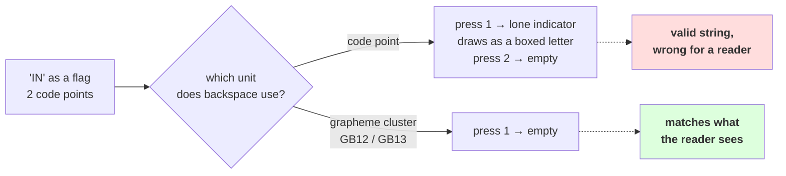

# 1.4 — Graphemes, or what a person sees

## One-line answer

A **grapheme cluster** is the run of code points that a reader treats as one character, the Unicode
standard defines it with a rule set (UAX #29) rather than a lookup table, Python's standard library
does not implement it at all — and the obvious hand-rolled approximation agrees with a reader on **four
of ten** ordinary strings, which one added rule lifts to six.

---

## The story

You are typing a message on your phone. You add a flag at the end, look at it, and decide against it.

You press backspace once. The flag does not go away. It turns into two letters in little boxes.

You press backspace again and one box disappears. A third press and the other one goes. Three presses
to delete one picture that you put there with one tap.

Now try the same thing in a different app. One press, and the whole flag is gone.

Both apps received the same message, holding the same thing. One of them decided that backspace deletes
one code point. The other decided that backspace deletes one thing-a-person-sees. Nobody told you which
rule each app had picked, and the two rules disagree by two presses.

---

## The idea in plain language

Part [1.1](1.1-a-character-is-three-different-things.md) named three levels — byte, code point,
grapheme — and said the third one is defined by human perception rather than by a number. This part is
about what that means when you have to write the code.

A **grapheme cluster** is a run of code points that a reader treats as a single character. The word
*cluster* is doing real work: it is not a code point and it is not a table entry, it is a **rule about
where a boundary is allowed to fall**. Unicode publishes those rules as Annex #29, "Unicode Text
Segmentation" — the standard cited below, with the two revisions that matter for this part.

The rules are short to list and awkward to implement:

| Rule | What it says, in plain words |
| --- | --- |
| `GB1`, `GB2` | there is a boundary at the start and at the end of the text |
| `GB3`–`GB5` | a carriage return and a line feed stay together; every other control character is on its own |
| `GB6`–`GB8` | Hangul jamo — a leading, a vowel and a trailing piece — join into one syllable |
| `GB9` | never break before a combining mark or a zero-width joiner |
| `GB9a`, `GB9b` | never break before a spacing mark, nor after a prepending character |
| `GB11` | never break inside an emoji joined by zero-width joiners, or an emoji plus its modifier |
| `GB12`, `GB13` | regional indicators pair up — break after **every second** one, which is what makes a flag one thing and two flags two things |
| `GB999` | otherwise, break |

Two terms from that table, defined now. A **spacing mark** (`Mc`) is a mark that takes up width of its
own — many Indic vowel signs are spacing marks, unlike a European accent, which sits on top of the
letter and takes no width (`Mn`). A **regional indicator** is one of 26 code points, one per letter
`A`–`Z`, that exist only to be paired: a flag is the country's two-letter code written in those
symbols, which is why a flag is two code points and why *two* flags are four.

Now the part that is easy to miss, and it is the reason section 2 of this day exists at all. **The rule
set changes between Unicode versions.** Revision 41 of the annex, for Unicode 15.0.0 — which is the
version of the data table running on this machine — has rules `GB1`–`GB13` and `GB999`, and no rule
about Indic conjuncts. Revision 43, for Unicode 15.1.0, adds `GB9c`, which keeps consonants joined by a
virama in one cluster. **The same string, the same code, two Unicode versions, two different answers to
"how many characters is this?"**

Both revisions were fetched on 2026-08-26 rather than recalled, because a rule set that changes is
exactly the kind of fact that goes stale in a person's memory:

| Cited | Revision | Dated | Unicode version | Fetched from |
| --- | --- | --- | --- | --- |
| UAX #29, Unicode Text Segmentation | 41 | 2022-08-26 | 15.0.0 | `https://www.unicode.org/reports/tr29/tr29-41.html` |
| UAX #29, Unicode Text Segmentation | 43 | 2023-08-16 | 15.1.0 | `https://www.unicode.org/reports/tr29/tr29-43.html` |

Revision 41 is the one that matches the `unicodedata` 15.0.0 table on this machine, and it lists
`GB1`–`GB13` and `GB999` with no `GB9c`. Revision 43 lists `GB9c` as well. That is the whole of the
claim, and it is checkable in two page loads.

And even with the full rule set implemented perfectly, the standard is explicit that the answer is an
approximation of perception, not a match for it. Its own words, from revision 43:

> It is important to recognize that what the user thinks of as a "character"—a basic unit of a writing
> system for a language—may not be just a single Unicode code point.

The annex says the same thing about aksaras — the orthographic syllables of Indic scripts — noting that
extended grapheme clusters cover "simple combinations" and that anything more needs tailoring that is
"script-, language-, font-, or context-specific". Measured below, the Devanagari conjunct in this
part's test set is **three** clusters by the Unicode 15.0.0 rules and **two** things on the screen.

So: bytes have a fixed set of 256, forever. Code points have a set that grows with each Unicode
version. Graphemes have **rules** that change with each Unicode version, and even then only approximate
what a reader means. That is the ranking that section 2 turns into an argument about vocabularies.

---

## Why Akshara needs it

- **Day 11**'s character tokenizer iterates a string with `for ch in text`. That loop yields code
  points, and this part is the evidence for calling that a *decision* — the tokenizer's "characters"
  are not the reader's characters, and the day says so out loud rather than hoping.
- **Part [2.4](../02-utf-8-and-bytes/2.4-256-is-a-vocabulary.md)** argues that a byte vocabulary is the
  only one of the three levels whose set is finished. This part supplies half of that argument: the
  grapheme level does not even have a *set*, it has a rule set, and the rule set is versioned.
- **Day 17** measures a tokenizer's compression on non-English text. Any per-character figure quoted
  there has to say which "character" it counted, and this part is why that qualifier is not pedantry.
- **Day 100 onward**, the serving surface truncates text for previews and for logs. Cutting between two
  regional indicators turns a flag into a letter in a box, and the check that prevents it is a
  cluster-aware cut, not a code-point cut.

---

## The mechanism

Start with the one measurement that decides everything else: **what does the standard library give
you?**

```python
import unicodedata

print("  unicodedata:", unicodedata.unidata_version)
print("  a grapheme function in the standard library?",
      any("graph" in n for n in dir(unicodedata)))
names = [n for n in dir(unicodedata) if not n.startswith("_")]
print("  public names       :", len(names))
for i in range(0, len(names), 6):
    print("   ", ", ".join(names[i:i + 6]))
```

**Line by line:**
- `dir(unicodedata)` is asked rather than assumed, because "surely there is a function for this" is the
  belief that this measurement exists to kill.
- The check is `"graph" in n` rather than an exact name, so it cannot be fooled by a function called
  `graphemes`, `grapheme_clusters` or `iter_graphemes`. There is no such name at all.
- Measured on Intel Core i3-1115G4 (2 cores / 4 threads), 11.7 GB RAM, Windows 11, CPython 3.12.12,
  `unicodedata` 15.0.0, on 2026-08-26:

```text
  unicodedata: 15.0.0
  a grapheme function in the standard library? False
  public names       : 16
    UCD, bidirectional, category, combining, decimal, decomposition
    digit, east_asian_width, is_normalized, lookup, mirrored, name
    normalize, numeric, ucd_3_2_0, unidata_version
```

Sixteen names, and not one of them segments text. Worth noticing *why*: the rules in the table above
key on a character property called `Grapheme_Cluster_Break`, and **`unicodedata` does not expose that
property**. It exposes `category`, which is a different classification designed for a different
purpose. Everything below is therefore built on a proxy, and the whole point of this part is to measure
how good a proxy it is.

Here is the approximation almost everybody writes first:

```python
import unicodedata


def naive_clusters(s: str) -> list[str]:
    """base + any following Mn/Mc/Me/Cf — the obvious approximation."""
    out: list[str] = []
    for ch in s:
        if out and unicodedata.category(ch) in ("Mn", "Mc", "Me", "Cf"):
            out[-1] += ch
        else:
            out.append(ch)
    return out
```

**Line by line:**
- `Mn` is a **nonspacing mark** — a European accent, a Devanagari nukta, a virama. `Mc` is a **spacing
  mark**. `Me` is an **enclosing mark**, which draws a circle or box around the character before it.
  `Cf` is a **format** character, and the zero-width joiner is one.
- `out[-1] += ch` glues the mark onto the cluster already being built, which is rule `GB9` and rule
  `GB9a` from the table above, expressed with the wrong property. That is the compromise.
- `if out and ...` guards a string that *starts* with a mark. That is not a hypothetical: text cut at
  the wrong place by part [1.2](1.2-what-len-actually-counts.md)'s slicing produces exactly such a
  string, and without the guard this raises `IndexError` on it.
- Nothing here knows about regional indicators, emoji modifiers or Hangul, because `category` cannot
  tell it: measured below, a regional indicator's category is `So` — "symbol, other" — which is the
  same category as an ordinary emoji.

Now score it. Every "seen" number below is what a reader sees, stated by inspection and checkable by
looking at your own screen:

```python
CASES = [
    ("e + combining acute",   "cafe\u0301",                                                4),
    ("precomposed",           "caf\u00e9",                                                 4),
    ("three stacked marks",   "e\u0301\u0328\u0304",                                       1),
    ("heart + VS16",          "\u2764\uFE0F",                                              1),
    ("family, ZWJ-joined",    "\U0001F468\u200d\U0001F469\u200d\U0001F467\u200d\U0001F466", 1),
    ("flag",                  "\U0001F1EE\U0001F1F3",                                      1),
    ("two flags",             "\U0001F1EE\U0001F1F3\U0001F1EE\U0001F1F3",                   2),
    ("thumbs up + skin tone", "\U0001F44D\U0001F3FB",                                      1),
    ("Devanagari conjunct",   "\u0936\u092c\u094d\u0926",                                   2),
    ("Hangul jamo L V T",     "\u1100\u1161\u11A8",                                        1),
]

print(f"  {'case':<22} {'cp':>3} {'naive':>6} {'seen':>5}  verdict")
right = 0
for label, s, seen in CASES:
    n = len(naive_clusters(s))
    right += n == seen
    print(f"  {label:<22} {len(s):>3} {n:>6} {seen:>5}  {'agrees' if n == seen else 'DISAGREES'}")
print(f"  the approximation agrees with a reader on {right} of {len(CASES)} cases")
```

**Line by line:**
- `\uFE0F` is **variation selector-16**, an invisible code point meaning "draw the character before me
  as a colour emoji rather than as black-and-white text". A heart followed by it is one thing on the
  screen and two code points.
- `\U0001F3FB` is a **skin tone modifier**. It follows a hand or a face and changes its colour; it is
  never displayed on its own.
- `\u1100 \u1161 \u11A8` are three Hangul **jamo** — a leading consonant, a vowel and a trailing
  consonant — which combine into one Korean syllable block. They are three separate letters that draw
  as one square.
- `right += n == seen` adds a `bool`, which is `0` or `1` in Python. Written this way rather than with
  an `if` because the whole loop is a count, and the count is the result.
- Measured on this machine, 2026-08-26:

```text
  case                    cp  naive  seen  verdict
  e + combining acute      5      4     4  agrees
  precomposed              4      4     4  agrees
  three stacked marks      4      1     1  agrees
  heart + VS16             2      1     1  agrees
  family, ZWJ-joined       7      4     1  DISAGREES
  flag                     2      2     1  DISAGREES
  two flags                4      4     2  DISAGREES
  thumbs up + skin tone    2      2     1  DISAGREES
  Devanagari conjunct      4      3     2  DISAGREES
  Hangul jamo L V T        3      3     1  DISAGREES
  the approximation agrees with a reader on 4 of 10 cases
```

**Four out of ten.** Note *which* four: the accented-Latin cases, all of them. A test suite written in
English and French would have scored this function ten out of ten and shipped it.

Why does each failure happen? Look at the categories the approximation is keying on:

```python
import unicodedata

for cp in (0x0301, 0x200D, 0xFE0F, 0x1F3FB, 0x1F1EE, 0x094D, 0x1100, 0x1161, 0x11A8):
    ch = chr(cp)
    print(f"    U+{cp:04X}  category={unicodedata.category(ch)}  "
          f"combining={unicodedata.combining(ch):>3}  {unicodedata.name(ch)}")
```

**Line by line:**
- `unicodedata.combining(ch)` returns the **canonical combining class**, a number the normalization
  algorithm uses to decide the order of stacked marks. It is printed here to show that it is *not* a
  segmentation property: a zero-width joiner and a plain letter both return `0`.
- The names come from `unicodedata.name`, which was checked against the Python 3.12 `unicodedata`
  documentation page on 2026-08-26; it raises `ValueError` for code points with no name, and every code
  point in this list has one.
- Measured on this machine, 2026-08-26:

```text
    U+0301  category=Mn  combining=230  COMBINING ACUTE ACCENT
    U+200D  category=Cf  combining=  0  ZERO WIDTH JOINER
    U+FE0F  category=Mn  combining=  0  VARIATION SELECTOR-16
    U+1F3FB  category=Sk  combining=  0  EMOJI MODIFIER FITZPATRICK TYPE-1-2
    U+1F1EE  category=So  combining=  0  REGIONAL INDICATOR SYMBOL LETTER I
    U+094D  category=Mn  combining=  9  DEVANAGARI SIGN VIRAMA
    U+1100  category=Lo  combining=  0  HANGUL CHOSEONG KIYEOK
    U+1161  category=Lo  combining=  0  HANGUL JUNGSEONG A
    U+11A8  category=Lo  combining=  0  HANGUL JONGSEONG KIYEOK
```

Every failure is now explained by one line of that table. The skin tone modifier is `Sk` — "symbol,
modifier" — not a mark, so the approximation starts a new cluster. A regional indicator is `So`,
indistinguishable by category from a grinning face. The Hangul jamo are `Lo`, ordinary letters, three
of them. **The category property was never designed to answer this question, and it does not.**

Add exactly one real rule and measure the difference:

```python
RI_START, RI_END = 0x1F1E6, 0x1F1FF


def clusters_v2(s: str) -> list[str]:
    """Naive, plus one real rule from UAX #29: regional indicators pair up (GB12/GB13)."""
    out: list[str] = []
    ri_run = 0
    for ch in s:
        cp = ord(ch)
        is_ri = RI_START <= cp <= RI_END
        if out and unicodedata.category(ch) in ("Mn", "Mc", "Me", "Cf"):
            out[-1] += ch
            ri_run = 0
        elif is_ri and ri_run % 2 == 1:
            out[-1] += ch
            ri_run += 1
        else:
            out.append(ch)
            ri_run = ri_run + 1 if is_ri else 0
    return out
```

**Line by line:**
- `RI_START, RI_END` are the first and last regional indicator code points — 26 of them, `A` through
  `Z`. The range is hard-coded because the property that would tell you is not exposed, which is the
  same compromise as before, made honestly and in one place.
- `ri_run` counts **how many regional indicators have run consecutively**, and `ri_run % 2 == 1` is
  rules `GB12` and `GB13`: join to the previous cluster only when an odd number has already been seen.
  That is what makes two flags into two clusters instead of one long one.
- `ri_run = 0` inside the mark branch, and `ri_run + 1 if is_ri else 0` in the last branch, together
  guarantee the counter resets at anything that is not a regional indicator. **Forgetting that reset is
  the classic bug here**: a flag, a space, then another flag would otherwise be counted as a run of
  four and merged wrongly.
- Measured on this machine, 2026-08-26, over the same ten cases:

```text
  case                    v2  seen  verdict
  e + combining acute      4     4  agrees
  precomposed              4     4  agrees
  three stacked marks      1     1  agrees
  heart + VS16             1     1  agrees
  family, ZWJ-joined       4     1  DISAGREES
  flag                     1     1  agrees
  two flags                2     2  agrees
  thumbs up + skin tone    2     1  DISAGREES
  Devanagari conjunct      3     2  DISAGREES
  Hangul jamo L V T        3     1  DISAGREES
  one rule added: 6 of 10 now agree
```

**Four of ten became six of ten for about eight lines.** The remaining four need `GB11` (emoji
sequences), `GB6`–`GB8` (Hangul) and, for the Devanagari row, a rule that did not exist in Unicode
15.0.0 at all. That is the honest shape of this problem: the first rule is cheap, the last rules are
not, and the full set is a data table plus a state machine.

Now the story's backspace, in code:

```python
flag = "\U0001F1EE\U0001F1F3"

buf = flag
while buf:
    buf = "".join(clusters_v2(buf)[:-1])
    print(f"    cluster-aware press -> {ascii(buf)}  ({len(buf)} code points left)")

buf = flag
while buf:
    buf = buf[:-1]
    print(f"    code-point press    -> {ascii(buf)}  ({len(buf)} code points left)")
```

**Line by line:**
- `clusters_v2(buf)[:-1]` drops the **last cluster** and rejoins the rest. That is what "backspace
  deletes one character" means to a person.
- `buf[:-1]` drops the last **code point**, which is what the string type makes easy and what the app
  in the story did.
- Measured on this machine, 2026-08-26:

```text
    cluster-aware press -> ''  (0 code points left)
    code-point press    -> '\U0001f1ee'  (1 code points left)
    code-point press    -> ''  (0 code points left)
```

One press against two, and the intermediate state of the second one is a lone regional indicator —
which is the letter in a box from the story. The two apps were not buggy. They picked different units.



---

## When it breaks

**The loud failure — the guard clause earning its place.** Drop the `if out and` from `naive_clusters`
and hand it a string that begins with a combining mark, which is exactly what part
[1.2](1.2-what-len-actually-counts.md)'s slicing produces:

```console
>>> def broken(s):
...     out = []
...     for ch in s:
...         if unicodedata.category(ch) in ("Mn", "Mc", "Me", "Cf"):
...             out[-1] += ch
...         else:
...             out.append(ch)
...     return out
...
>>> broken("\u0301abc")
Traceback (most recent call last):
  File "<stdin>", line 1, in <module>
  File "<stdin>", line 5, in broken
IndexError: list index out of range
```

What it means: there is no previous cluster to attach the mark to. The smallest fix is the `if out and`
that the working version has. The lesson underneath it is that **a string beginning with a combining
mark is not a corrupt string** — it is a valid string, it is what truncation produces, and any function
that walks text has to survive it.

**The silent failure, which is the normal case.** Every wrong count on this page returned a number.
Nothing raised, nothing warned, and the returned lists were lists of valid strings. A "first letter"
avatar built with `name[0]` gives a bare regional indicator for a name starting with a flag and a bare
consonant for a Hangul name; a "20 characters" limit measured in clusters by one service and code
points by another disagrees by a factor that depends on the user's script. The wrong output looks like
this — one flag, sliced by the unit the language made easy:

```text
  name        = 'IN' written as two regional indicators
  name[0]     = '\U0001f1ee'      -> draws as a boxed letter I, not a flag
  len(name)   = 2                 -> "two characters" for one picture
  clusters_v2 = 1                 -> what the reader would say
```

**The check that catches it,** and the important thing about it is what it refuses to claim:

```python
def cluster_count(s: str) -> int:
    """An APPROXIMATE grapheme count. Measured: agrees with a reader on 6 of 10 test cases.

    Handles combining marks (GB9/GB9a) and regional indicator pairs (GB12/GB13).
    Does NOT handle emoji ZWJ sequences (GB11), emoji modifiers, or Hangul jamo (GB6-GB8).
    Not a substitute for a UAX #29 implementation. Never use it for a limit a user is told about.
    """
    return len(clusters_v2(s))


def assert_not_split_mid_cluster(original: str, piece: str) -> None:
    """A cut is safe when it did not increase the cluster count of the text around it."""
    assert cluster_count(piece) <= cluster_count(original), (
        f"the cut created clusters: {ascii(piece)}"
    )
    assert not (piece and unicodedata.category(piece[0]) in ("Mn", "Mc", "Me", "Cf")), (
        f"the piece starts with a mark, so the cut landed inside a cluster: {ascii(piece)}"
    )
```

**Line by line:**
- The docstring names the **measured** score and lists, by rule number, what is not handled. A helper
  whose docstring overstates it is worse than no helper, because the next person will trust it — the
  same argument part [1.2](1.2-what-len-actually-counts.md) made about its truncation helper, and the
  same reason this one is not called `grapheme_count`.
- `assert_not_split_mid_cluster` checks a **property of the cut**, not a property of the string, which
  is what makes it usable in a test over arbitrary text without a table of expected answers.
- The second assertion is the cheap one and catches the common case directly: a piece that begins with
  a mark was cut inside a cluster, full stop, with no counting needed.
- What is deliberately absent: any function returning "the number of characters". After this part there
  is no such number, and a codebase that pretends otherwise is storing a value nobody can define.

---

## In production

**What a research engineer writes instead of the teaching version.** They do not hand-roll this. They
use a library that implements UAX #29 against the property tables — in Python that is usually the
third-party `regex` module, whose `\X` pattern matches one grapheme cluster, and in other stacks it is
ICU. **🅿️ Parked for today:** no package is installed on this day, because Principle 3 says the
hand-rolled version comes first and this part *is* that version. What the parking costs is worth
stating plainly rather than hand-waving: the remaining four failures need the `Grapheme_Cluster_Break`
property for all 149,251 assigned characters — a table the standard library does not ship — plus the
state machine over `GB1`–`GB13`. That is not eight more lines, and pretending otherwise is how people
end up with a `clusters_v3` that scores eight out of ten and gets trusted like it scores ten.

The second habit is architectural, and it is the one this whole day is building toward: **the pipeline
does not carry graphemes at all.** Text goes to bytes at the boundary and stays there. Grapheme
segmentation lives at the two edges where a human is involved — the cursor and the display — and
nowhere in between.

**What degrades at scale.** Anything user-facing that counts. A message-length limit, a preview
truncation, a column width, a "starts with" filter. Each is defined in a different unit somewhere in
the stack, and mixed-script traffic makes the disagreement visible: a limit of 100 that means clusters
in the browser, code points in the API and bytes in the database has three different meanings for the
same text, and the ordering of the three depends on the script.

**The failure that only shows with real data.** The four cases this part's approximation passes are
exactly the four an English or French test suite would contain. Emoji, flags, Korean and Indic
conjuncts are all outside it, and each of them is ordinary text for a large number of people. This is
Silent Failure #5 from the plan's §6 wearing a different hat: **evaluated on the format you tested
on.** The fix is the same one the plan prescribes — hold out a differently-shaped set, here meaning
scripts your test data does not contain.

**The review comment.** *"`name[0]` for the avatar letter — that takes one code point. For a name
starting with a flag or a Hangul syllable it will render as a box or a bare consonant. Take one
grapheme cluster, and if we do not have a UAX #29 implementation, say so in the ticket rather than
approximating in this function."*

**The interview question.** *"How many characters is a flag emoji?"* The weak answer is one, or two.
The strong answer is: **one grapheme cluster, two code points, eight UTF-8 bytes — and the code points
are two regional indicators that pair by a counting rule, which is why two flags is four code points
and not one long flag.** Then the part that shows you have used it: *and the grapheme answer is
version-dependent — the rule set gained a rule for Indic conjuncts in Unicode 15.1 — so a stored
"character count" is a number whose meaning changes when you upgrade a library.*

**Compute tier: T0.** The standard library on a laptop: no packages, no data files, no network. Every
count here is exact and deterministic under `unicodedata` 15.0.0, with no seed and no timing. What T0
**cannot** show you is what your screen actually draws for any of these strings — that is a font and
renderer question, it differs between machines, and the "seen" column above is a claim about your eyes
that you should check against them. Run the code, look at the terminal, and record any row where your
machine disagrees; a disagreement is data, not a mistake.

---

## Check yourself

Run this. It prints **a score out of ten**, and the score is not ten:

```python
import sys
import unicodedata

sys.stdout.reconfigure(errors="replace")   # a cp1252 console cannot print every character

print("  unicodedata:", unicodedata.unidata_version)

flag = "\U0001F1EE\U0001F1F3"
family = "\U0001F468\u200d\U0001F469\u200d\U0001F467\u200d\U0001F466"

print("  len(flag)              :", len(flag))
print("  flag[:1]               :", ascii(flag[:1]), "->", flag[:1])
print("  len(two flags)         :", len(flag * 2))
print("  category of a flag half:", unicodedata.category(flag[0]))
print("  category of the family :", unicodedata.category(family[0]))
print("  the two categories are the same:", unicodedata.category(flag[0]) == unicodedata.category(family[0]))
print("  a grapheme function in the standard library?",
      any("graph" in n for n in dir(unicodedata)))
```

**Line by line:**
- `sys.stdout.reconfigure(errors="replace")` is there because this script prints raw characters,
  and on a Windows console — measured in part
  [2.1](../02-utf-8-and-bytes/2.1-text-has-to-become-bytes.md), `sys.stdout.encoding` here is
  `cp1252` — a combining accent has no representation and `print` raises `UnicodeEncodeError` part
  way through the line. With the handler set, unencodable characters come out as `?`. **A `?` on
  your screen is your console, not your string.**
- `flag[:1]` prints a lone regional indicator. **Look at what your terminal draws for it and say out
  loud whether a user would call that "half a flag" or "a bug".**
- The two `category` lines both print `So`. Say why that single fact makes the naive approximation
  unable to ever get the flag row right, no matter how many marks it handles.
- The last line prints `False`. Say what you would do about that in a real codebase, and say what the
  honest docstring on your own helper would have to admit.
- Now count the clusters in `flag * 3` by hand, then say what a function that pairs regional indicators
  without resetting its counter would return instead.

**Say this out loud, without scrolling up:** say what a grapheme cluster is in one sentence without
using the word "character", name the rule that makes two flags two things rather than one, and say what
happens to a stored "character count" when the Unicode version underneath it changes.
