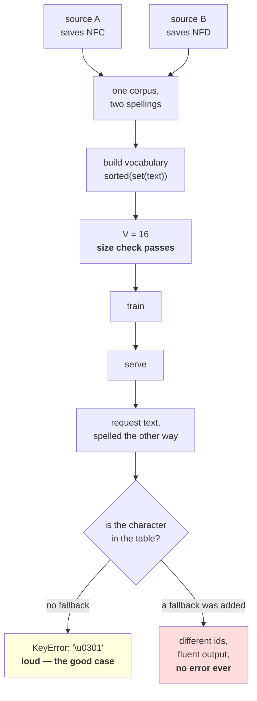

# 1.5 — 💥 The string that was not equal to itself

## One-line answer

Two strings that draw identically on the screen can be unequal, hash differently, miss each other in a
`dict`, fail to deduplicate in a `set`, and produce two vocabularies with **the same size and different
contents** — and every check you would think to write on them passes.

---

## The story

You open your contacts to call a shop and you find the shop listed twice.

Same name. Same number. Same little picture. Two rows, one above the other.

You delete one of them. The other one stays, which is what you wanted, so you forget about it. Two
weeks later there are two again.

You look properly this time. You put the two names side by side and read them letter by letter. They
match. Every letter, in order, including the accent. The phone is showing you two rows that say exactly
the same thing, and it will keep making a new one every time the shop's details get saved again.

Nothing on the screen tells you what is different, because on the screen nothing is different.

---

## The idea in plain language

This is part [1.3](1.3-normalization-one-spelling-for-the-same-thing.md)'s problem, allowed to run into
the rest of a program.

Part 1.3 said two strings can mean the same text and differ in code points. That sounds like a
comparison problem. It is not: **it is everything that is built on comparison**, and in Python that is a
long list. `==` compares code points. `hash()` hashes code points. A `dict` key, a `set` member, a
`Counter` bucket, a `sorted()` order, a `groupby`, a database unique index, a cache key, a
deduplication pass, a vocabulary table — all of them are `==` and `hash` underneath.

So one unnormalized string does not cause one bug. It causes a bug in every one of those places at
once, and none of them raises, because two different strings compared as different is exactly correct
behaviour. There is nothing for Python to complain about. The contact list in the story is doing its
job perfectly.

The place this hurts most in a language-model pipeline is the vocabulary, and for a reason that is
worth stating precisely. Day 9 part
[2.1](../../../day-009-the-vocabulary-problem/parts/02-what-a-tokenizer-is/2.1-a-function-and-its-inverse.md)
built a tokenizer as a `dict` from character to id. A `dict` from character to id is a lookup keyed on
exact code point equality. Feed it text in the other spelling and one of two things happens: it raises
`KeyError` on a character it has "never seen", or — if somebody added a fallback — it quietly maps a
familiar word onto an unfamiliar sequence of ids.

The second one is the dangerous one, and it is **Silent Failure #2** from the plan's §6: trained with
one tokenization, inferred with another. Nothing in the model can detect it. Every id is in range,
every shape matches, the output is fluent. It is fluent about a word the model does not think it has
seen before.

One more thing this part demonstrates, because it is the detail that makes the bug survive review:
**two vocabularies built from the same text under two normalization forms have the same size.** Measured
below, both are exactly 16 entries. A reviewer checking "the vocabulary size matches" sees a match. The
sizes agree and the tables do not.

---

## Why Akshara needs it

- **Day 11** writes the character tokenizer as a real module. The `KeyError` reproduced below is what
  that module does on the wrong spelling, and the constructor argument that prevents it is decided
  today, not discovered on Day 11.
- **Day 12–13**'s BPE trainer counts pairs in a `Counter`. Two spellings of a frequent word are two
  keys, so the counts split and both spellings get worse merges — the same failure as this part,
  costing compression instead of raising.
- **Day 14** opens a real tokenizer library and compares. The thing to look for is where its
  normalizer lives and how it is serialised, because that is this part's fix, made permanent.
- **Day 100 onward**, the serving path takes text from a network request — text that was typed on
  somebody else's keyboard, on somebody else's operating system, and pasted from somewhere else again.
  That is the exact traffic this failure needs, and it does not occur in a test file you typed
  yourself.

---

## The mechanism

Reproduce it in seven lines. Both strings below are the same word; the second one spells the accent
separately.

```python
import unicodedata

a, b = "caf\u00e9", "cafe\u0301"

print("  a == b         :", a == b)
print("  hash equal     :", hash(a) == hash(b))
print("  len            :", len(a), len(b))
print("  sorted order   :", [ascii(x) for x in sorted([b, a])])

d = {a: "the row saved first"}
print("  a in d         :", a in d)
print("  b in d         :", b in d)

names = [a, b, a, b]
print("  len(names)     :", len(names))
print("  len(set(names)):", len(set(names)))
print("  after NFC      :", len({unicodedata.normalize("NFC", n) for n in names}))

print()
print("  now print them raw, side by side:")
try:
    print("  ", a, b)
except UnicodeEncodeError as e:
    print("   UnicodeEncodeError:", e)
```

**Line by line:**
- `a` and `b` are written as escapes, which is the only way this file can show you that they differ.
  Every diagnostic line below goes through `ascii()` for the same reason.
- The last block prints them **raw**, wrapped in a `try`, and that wrapper is not defensive padding: on
  this machine the console encoding is `cp1252`, the precomposed letter exists in `cp1252` and the
  combining accent does not, so printing the pair raises **half way through the line**. Part
  [2.1](../02-utf-8-and-bytes/2.1-text-has-to-become-bytes.md) is why. If your console is UTF-8 you
  will instead see the two words drawn identically, which is the version of this lesson that lands
  hardest — run it and look.
- `hash(a) == hash(b)` is `False`, and that is the root of every symptom that follows. A `dict`, a
  `set`, a `Counter` and a cache all bucket by hash first; two strings that hash differently never even
  reach the equality check.
- `sorted([b, a])` puts the decomposed spelling **first**, because `e` (`U+0065`) sorts before the
  precomposed accented letter (`U+00E9`). A sorted list of names has the two copies in different places
  rather than next to each other, which is why the duplicate in the story is not obvious even in an
  ordered list.
- `set(names)` on four strings that all draw the same returns **two**. That is the contact list.
- Measured on Intel Core i3-1115G4 (2 cores / 4 threads), 11.7 GB RAM, Windows 11, CPython 3.12.12,
  `unicodedata` 15.0.0, on 2026-08-26:

```text
  a == b         : False
  hash equal     : False
  len            : 4 5
  sorted order   : ["'cafe\\u0301'", "'caf\\xe9'"]
  a in d         : True
  b in d         : False
  len(names)     : 4
  len(set(names)): 2
  after NFC      : 1

  now print them raw, side by side:
   café   UnicodeEncodeError: 'charmap' codec can't encode character '\u0301' in position 4: character maps to <undefined>
```

The doubled backslashes in the `sorted order` row are not a typo and are worth a second look:
`ascii(x)` returns a *string* containing a backslash, and printing a **list** calls `repr` on each
element, which escapes that backslash again. One level of escaping per level of container.

The last row is this machine being honest. Four characters made it to the console \u2014 `caf` and a
mangled accented letter \u2014 and then the write failed on the combining mark, mid-line. That is not a bug
in the example; it is the day's second half arriving early.

**Four identical-looking names deduplicate to two.** One `normalize` call takes it to one.

Now the version that costs a model. Build a character vocabulary the way Day 9 did, from a corpus, and
then hand it the other spelling:

```python
import hashlib
import json
import unicodedata

CORPUS = "the cafe\u0301 is open. the caf\u00e9 is closed."

raw_v = sorted(set(CORPUS))
nfc_v = sorted(set(unicodedata.normalize("NFC", CORPUS)))
nfd_v = sorted(set(unicodedata.normalize("NFD", CORPUS)))
print("  V raw / NFC / NFD:", len(raw_v), len(nfc_v), len(nfd_v))


def table_hash(v: list[str]) -> str:
    return hashlib.sha256(json.dumps(v, sort_keys=True).encode("utf-8")).hexdigest()[:16]


print("  sha256[:16] NFC  :", table_hash(nfc_v))
print("  sha256[:16] NFD  :", table_hash(nfd_v))
print("  same V, same hash?", len(nfc_v) == len(nfd_v), table_hash(nfc_v) == table_hash(nfd_v))

vocab = {ch: i for i, ch in enumerate(nfc_v)}
probe = "cafe\u0301"
try:
    ids = [vocab[c] for c in probe]
except KeyError as e:
    print("  encode(NFD probe):  KeyError:", ascii(e.args[0]))
print("  encode(NFC probe):", [vocab[c] for c in unicodedata.normalize("NFC", probe)])
```

**Line by line:**
- `CORPUS` deliberately contains **both** spellings of the same word, which is what a corpus assembled
  from more than one source looks like. That is why `raw_v` is 17 and the two normalized vocabularies
  are 16: the raw text needs a slot for the combining accent *and* a slot for the precomposed letter.
- `sorted(set(...))` is Day 9's construction, kept exactly, including the `sorted` — Day 9 part
  [2.5](../../../day-009-the-vocabulary-problem/parts/02-what-a-tokenizer-is/2.5-the-tokenizer-that-did-not-match.md)
  is why that is not optional. Today's failure is a *different* one that survives having got `sorted`
  right.
- `json.dumps(v, sort_keys=True)` produces stable bytes for hashing, so the hash identifies the table's
  contents and not the order a set happened to iterate in. `hashlib.sha256` hashes bytes, not `str`,
  which is why `.encode("utf-8")` is there and not optional.
- `ascii(e.args[0])` prints the missing key as an escape. Printing the exception directly puts an
  invisible combining accent into your log, where it attaches itself to the previous character and
  makes the error message about a character that is not the one that failed.
- Measured on this machine, 2026-08-26:

```text
  V raw / NFC / NFD: 17 16 16
  sha256[:16] NFC  : 64bdd5ae5871c054
  sha256[:16] NFD  : 2c8765685455576e
  same V, same hash? True False
  encode(NFD probe):  KeyError: '\u0301'
  encode(NFC probe): [3, 2, 6, 15]
```

Read the third line twice. **`V` is 16 both ways and the hashes differ.** Every review question of the
form "is the vocabulary the right size?" gets a yes.

And the `KeyError` is on `'\u0301'` — a combining acute accent. Not on the word. Not on a character
anybody typed on purpose. On an accent that the reader believes is part of the letter beside it.

Here is why this is worth a whole part rather than a footnote — the checks that pass:

| Check a reviewer would write | On the mismatched pair | Verdict |
| --- | --- | --- |
| the two strings print the same | they do | ✅ passes |
| both are `str` | they are | ✅ passes |
| both non-empty | they are | ✅ passes |
| both fully printable | `isprintable()` is `True` for both | ✅ passes |
| the two vocabularies are the same size | 16 and 16 | ✅ passes |
| every id is in range | they are | ✅ passes |
| the round trip through **one** table works | it does | ✅ passes |
| the two table hashes agree | `64bdd5ae…` vs `2c876568…` | ❌ **the only one that fails** |

Seven checks pass and one fails, and the one that fails is the only one that compares the two artefacts
against each other rather than checking each one for plausibility. That is the general shape of this
class of bug, and it is the same shape as Day 9 part 2.5.



---

## When it breaks

**The loud failure, and it is the one to hope for:**

```console
>>> vocab = {ch: i for i, ch in enumerate(sorted(set("the caf\u00e9 is open.")))}
>>> [vocab[c] for c in "cafe\u0301"]
Traceback (most recent call last):
  File "<stdin>", line 1, in <module>
  File "<stdin>", line 1, in <listcomp>
KeyError: '\u0301'
```

What it means: the table was built over text in one normalization form and asked about a character that
only exists in the other. The smallest fix is one call — normalize the input with the same form the
table was built with, before the lookup. The *correct* fix is that both sides call one shared function,
which part [1.3](1.3-normalization-one-spelling-for-the-same-thing.md) wrote as `normalize_text`.

**The silent failure, which is what actually ships.** Somebody sees that `KeyError` in production, and
fixes it the way it deserves to be fixed at three in the morning:

```python
UNK = 0
ids = [vocab.get(c, UNK) for c in text]     # the fix that makes the error go away
```

**Line by line:**
- `vocab.get(c, UNK)` replaces an exception with a value. The crash stops. The alert closes. Somebody
  writes "handled unknown characters gracefully" in the pull request, and it is not untrue.
- What it actually does: the accent becomes `UNK`, so the word arrives at the model as
  *the-letters-plus-an-unknown-thing* instead of the word. The model has never seen that sequence. It
  answers anyway, fluently, because that is what these models do — Day 9 part 1.5 measured what
  pushing text into `UNK` does to the reported loss, and the direction is *down*.
- **There is no error, no warning and no metric that moves.** The output is grammatical text about
  slightly the wrong input, for the subset of users whose text is not in the form your corpus was.
- The line is not wrong in isolation. It is wrong *here*, because the character it is swallowing is not
  an unknown character — it is a known character in a spelling nobody normalized.

The wrong output, verbatim, from a table built on one spelling and fed the other with that fallback in
place:

```text
  text            : 'cafe\u0301'          (draws as: cafe with an acute accent)
  ids             : [3, 2, 6, 0, 0]      <- two zeros: 'e' is known, the accent is UNK... and so is '\u00e9'
  round trip      : 'cafe' + '<unk>'     the accent is gone, permanently
  reported loss   : lower than the run without the fallback (Day 9 part 1.5)
  exceptions      : none
```

**The check that catches it,** and it is the one the plan prescribes for Silent Failure #2 — round-trip
a real training string through the inference path and assert equality:

```python
import unicodedata

NORM = "NFC"


def check_tokenizer_normalization(vocab: dict[str, int], training_sample: str) -> None:
    """Fail if the serving path would produce different ids from the training path."""
    prepared = unicodedata.normalize(NORM, training_sample)

    assert unicodedata.is_normalized(NORM, prepared), "prepare step did not produce " + NORM
    missing = sorted({c for c in prepared if c not in vocab})
    assert not missing, f"vocabulary is missing {len(missing)} character(s): {ascii(''.join(missing))}"

    from_training = [vocab[c] for c in prepared]
    from_serving = [vocab[c] for c in unicodedata.normalize(NORM, training_sample)]
    assert from_training == from_serving, f"same text, different ids: {from_training} vs {from_serving}"
```

**Line by line:**
- The `missing` set is computed **before** any lookup, so the failure message names every character
  that is absent instead of stopping at the first one. A `KeyError` tells you about one character; a
  tokenizer built on the wrong form is usually missing several, and knowing whether it is one or forty
  is the difference between a typo and a pipeline bug.
- `ascii(''.join(missing))` again, so an invisible combining mark appears in the assertion message as
  `\u0301` and not as an accent stuck to the preceding word.
- The final assertion compares two id lists derived from **the same source text by the two paths**.
  Today both paths call `normalize` with the same constant and it cannot fail; the day serving grows
  its own preparation step, it can, and it will.
- What this deliberately does **not** do is call `vocab.get(c, UNK)`. A tokenizer that cannot encode
  its input should say so. Turning that into a value is the fix that hides the bug, and the whole point
  of the section above is that the quiet version costs more than the loud one.

---

## In production

**What a research engineer writes instead of the teaching version.** They do not check normalization at
run time in the serving path — they make it impossible to get wrong by **shipping the normalizer with
the vocabulary**. The tokenizer file records the form; loading the tokenizer loads the form; there is no
separate preprocessing step anybody can forget. Alongside that, the tokenizer file has a hash, and the
checkpoint records the hash it was trained with, which is Day 9 part
[2.3](../../../day-009-the-vocabulary-problem/parts/02-what-a-tokenizer-is/2.3-the-tokenizer-is-not-part-of-the-model.md)'s
argument arriving with a second reason.

The second habit is **normalize at the boundary, once**. Text is normalized where it enters the system
— the crawler, the request handler, the file reader — and never again. Normalizing repeatedly is safe,
because the operation is idempotent, but a codebase that normalizes in six places has six places where
somebody can use a different form, and the measurement in part
[1.3](1.3-normalization-one-spelling-for-the-same-thing.md) showed those forms are not interchangeable.

**What degrades at scale.** Duplicate rate and vocabulary quality, both invisibly. In a corpus
assembled from many sources, the same document collected twice under two normalizations is two
documents to a deduplicator keyed on a hash — so it survives deduplication and gets trained on twice.
That is not a normalization curiosity, it is **Silent Failure #1** wearing a costume: text you believed
was deduplicated is not, and the same argument applies to an eval set you believed was held out.

**The failure that only shows with real data.** Every string in this part is ordinary text for somebody.
None of it appears in an English test fixture. Worse, the two operating systems in common use do not
agree about this: file names are stored in different normalization forms on different systems, so text
that round-trips through a file name — a dataset shard, a downloaded document, a cached artefact — can
change its spelling without any code having touched it.

**The review comment.** *"`vocab.get(c, 0)` — what character is actually falling through here? If it is
a combining mark, the input is in the wrong normalization form and this line is hiding it. Assert the
input is `NFC` at the boundary and let this raise."*

**The interview question.** *"Two identical-looking strings, one is in the dictionary and one is not.
What do you check?"* The weak answer is whitespace or case. The strong answer names the specific
mechanism: **`==` and `hash` work on code points, so compare `ascii(s)` for the two strings and compare
`unicodedata.normalize("NFC", …)` of both — if the normalized forms are equal, it is a normalization
mismatch and the fix belongs at the boundary, not at the comparison.** The follow-up that shows you
have shipped it: *and check whether anything downstream has a fallback that turns the miss into a
default value, because that converts a crash into a quality regression nobody will attribute to this.*

**Compute tier: T0.** The standard library on a laptop: no packages, no data files, no network, no
model, no run. Every number here is an exact property of the strings on this page under `unicodedata`
15.0.0 — including both SHA-256 prefixes, which reproduce byte-for-byte on any machine. What T0
**cannot** show you is the effect on a trained model's quality, and this part is careful not to claim
one: the direction of the loss effect is Day 9 part 1.5's measured arithmetic, and the size of the
quality effect is a training question that no amount of counting answers.

---

## Check yourself

Run this. It prints **`False`, then a `KeyError` on a character nobody typed**:

```python
import sys
import unicodedata

sys.stdout.reconfigure(errors="replace")   # a cp1252 console cannot print every character

a, b = "caf\u00e9", "cafe\u0301"
print("  unicodedata :", unicodedata.unidata_version)
print("  printed     :", a, b)
print("  a == b      :", a == b)
print("  set of four :", len({a, b, a, b}))
print("  after NFC   :", len({unicodedata.normalize("NFC", x) for x in (a, b)}))

vocab = {ch: i for i, ch in enumerate(sorted(set("the caf\u00e9 is open.")))}
print("  V           :", len(vocab))
try:
    print([vocab[c] for c in b])
except KeyError as e:
    print("  KeyError on :", ascii(e.args[0]), "  named:", unicodedata.name(e.args[0]))
print("  with NFC    :", [vocab[c] for c in unicodedata.normalize("NFC", b)])
```

**Line by line:**
- `sys.stdout.reconfigure(errors="replace")` is there because this script prints raw characters,
  and on a Windows console — measured in part
  [2.1](../02-utf-8-and-bytes/2.1-text-has-to-become-bytes.md), `sys.stdout.encoding` here is
  `cp1252` — a combining accent has no representation and `print` raises `UnicodeEncodeError` part
  way through the line. With the handler set, unencodable characters come out as `?`. **A `?` on
  your screen is your console, not your string.**
- The `printed` line shows the two words drawing identically, and the line after it says they are not
  equal. **Say out loud which of those two lines a bug report would contain.**
- `set of four` prints `2` and `after NFC` prints `1`. Say what that does to a deduplication pass over
  a corpus, and say whether the corpus you would have trained on was the size you thought it was.
- The `KeyError` line prints `'\u0301'` and the name `COMBINING ACUTE ACCENT`. Say why the error names
  an accent rather than a word, and say what a reader would have said was missing.
- Now add `vocab.get(c, 0)` in place of `vocab[c]` and run it again. It prints a list of ids and no
  error. Say which of the two behaviours you would rather deploy, and say what you would have to add to
  the quiet one to make it as safe as the loud one.

**Say this out loud, without scrolling up:** name the two builtin operations that make this bug spread
from a comparison into a `dict`, a `set` and a `Counter` all at once; say why the vocabulary size check
passes; and say where the fix belongs — at the lookup, or at the boundary — and why.
