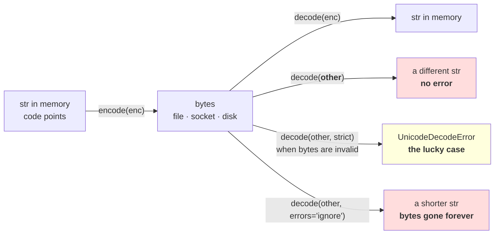

# 2.1 — Text has to become bytes

## One-line answer

A file, a disk and a network carry **bytes**, never characters, so every piece of text crosses two
boundaries — `encode` on the way out and `decode` on the way in — and **the bytes do not say which
encoding produced them**, which is why the wrong guess produces readable nonsense instead of an error.

---

## The story

You write out a shopping list on your laptop and save it as a plain text file. Rice, oil, four kinds of
dal, and a shop name with an accent in it. You look at it, it is fine, and you send it to somebody
else.

They open it and tell you the shop name has come out as two odd letters stuck together. Everything else
in the list is perfect. Rice is rice. Oil is oil. Only the accented word is wrong.

You open your copy again. Still fine. You send it a second time in case something went wrong on the
way. Same result on their machine, same two odd letters, exactly the same two odd letters.

Nothing was damaged. The file that arrived is byte-for-byte the file that left. Both machines read
every byte correctly. They just disagreed about what the bytes meant.

---

## The idea in plain language

Everything in section 1 was about a `str` — a sequence of code points that lives in memory while a
Python program runs. Nothing outside that program can hold a `str`.

A file holds bytes. A network packet holds bytes. A disk, a pipe, a clipboard, a database column, a
socket: bytes. A **byte** is one of 256 values, `0` to `255`, and it means nothing on its own. So text
leaving a program must be turned into bytes, and text arriving must be turned back.

- **Encoding** is text → bytes. In Python: `s.encode("utf-8")`, which returns a `bytes` object.
- **Decoding** is bytes → text. In Python: `b.decode("utf-8")`, which returns a `str`.

An **encoding** is the rulebook that says which byte or bytes stand for which code point. There have
been many. Three that matter for this part:

- **`latin-1`** — one byte per character, exactly 256 characters, covering ASCII plus common Western
  European letters. It cannot represent anything else at all.
- **`cp1252`** — the Windows variant of that idea, differing from `latin-1` in 27 of the 256 slots. It
  is the default text encoding on a Windows machine, including the one this day was measured on.
- **`utf-8`** — variable width, one to four bytes per code point, able to represent **every** code
  point. Part [2.2](2.2-how-utf-8-encodes-a-code-point.md) is how.

Here is the fact that makes the story happen, and it is worth reading twice: **a byte sequence does not
record which encoding produced it.** There is no header, no marker, no field. The bytes
`63 61 66 c3 a9` are a valid UTF-8 encoding of a four-letter word with an accent, and they are equally
a valid `latin-1` encoding of a five-letter word ending in two odd letters. Both readings succeed. Both
are complete. Nothing distinguishes them except an agreement made somewhere else.

That garbled reading has a name — **mojibake** — and its defining property is that it does not raise.
The decode succeeded. It produced a real string, of a real length, made of real characters, which
prints and stores and searches. It is simply the wrong string.

Sometimes you do get an error, and it is worth knowing why that is the lucky case rather than the
normal one: the error only happens when the bytes are not *valid* under the encoding you guessed. UTF-8
has a strict structure — part [2.2](2.2-how-utf-8-encodes-a-code-point.md) shows it — so most non-UTF-8
bytes fail to parse as UTF-8 and you get a loud `UnicodeDecodeError`. Going the other way there is no
such luck: **`latin-1` accepts all 256 byte values**, so decoding UTF-8 bytes as `latin-1` can never
fail. It always succeeds, and it is always wrong.

The whole of this part reduces to one rule, and the rest of the day depends on it: **say the encoding
every single time.** Never rely on a default, because the default is a property of the machine, not of
the data — measured below, this machine's default file encoding is `cp1252` while its default *string*
encoding is `utf-8`, and those two answers being different on one machine is normal.

---

## Why Akshara needs it

- **Part [2.4](2.4-256-is-a-vocabulary.md)** argues that a byte vocabulary never grows. That argument
  starts here: bytes are what the data actually is, and the `str` was always a decoded view of it.
- **Day 13**'s byte-level BPE calls `.encode("utf-8")` once at the front and then never touches a `str`
  again. This part is why that is the design and not a shortcut.
- **Day 14** loads a real corpus from files. A corpus reader that omits `encoding=` reads different text
  on a Windows machine than on a Linux machine, from the same file — which makes a run irreproducible
  for a reason nothing in the training code can show you.
- **Day 51 onward**, the data loader memory-maps a token file and slices it. Bytes are sliceable at any
  offset; text is not, and part [2.3](2.3-self-synchronising.md) is the property that makes the byte
  version safe.
- **Day 100 onward**, the serving surface receives a request body — bytes — and must decode it before
  anything else happens. The encoding is stated in the request or it is guessed, and guessing is this
  part's failure.

---

## The mechanism

Start with what your own machine thinks the defaults are, because the answer is not one number:

```python
import locale
import sys

print("  python                        :", sys.version.split()[0])
print("  sys.getdefaultencoding()      :", sys.getdefaultencoding())
print("  sys.getfilesystemencoding()   :", sys.getfilesystemencoding())
print("  locale.getpreferredencoding() :", locale.getpreferredencoding(False))
print("  sys.stdout.encoding           :", sys.stdout.encoding)
```

**Line by line:**
- `sys.getdefaultencoding()` is the encoding used by `str.encode()` when you pass no argument. On
  Python 3 it is always `utf-8`, and it is **not** the one that opens files.
- `sys.getfilesystemencoding()` is used for **file names**, not file contents. Two different questions,
  two different answers, and confusing them is common.
- `locale.getpreferredencoding(False)` is the one that matters: it is what `open()` and
  `Path.read_text()` use when you do not pass `encoding=`. The `False` argument says "do not re-read
  the locale settings", which was checked against the Python 3.12 `locale` documentation page on
  2026-08-26.
- `sys.stdout.encoding` is what `print` encodes to. **A string your program holds correctly can still
  fail to print**, and part [1.5](../01-code-points-and-graphemes/1.5-the-string-that-was-not-equal-to-itself.md)
  hit exactly that.
- Measured on Intel Core i3-1115G4 (2 cores / 4 threads), 11.7 GB RAM, Windows 11, CPython 3.12.12,
  `unicodedata` 15.0.0, on 2026-08-26:

```text
  python                        : 3.12.12
  sys.getdefaultencoding()      : utf-8
  sys.getfilesystemencoding()   : utf-8
  locale.getpreferredencoding() : cp1252
  sys.stdout.encoding           : cp1252
```

**Four questions, three different answers, one machine.** Any code that leaves the encoding to a
default is picking one of these without saying which — and on a colleague's machine it would pick
differently.

Now write a file and read it back, the careless way and the careful way:

```python
from pathlib import Path

tmp = Path("_encoding_demo.txt")
tmp.write_text("caf\u00e9 \u0936\u092c\u094d\u0926\n", encoding="utf-8")
print("  bytes on disk             :", tmp.read_bytes())

try:
    print("  read with no encoding=    :", ascii(tmp.read_text()))
except UnicodeDecodeError as e:
    print("  read with no encoding=    : UnicodeDecodeError:", e)

print("  read with encoding='utf-8':", ascii(tmp.read_text(encoding="utf-8")))
tmp.unlink()
```

**Line by line:**
- `write_text(..., encoding="utf-8")` states the encoding on the way **out**. Half of the pair, and the
  half people remember.
- `read_bytes()` is the ground truth: it does no decoding at all, so what it prints is exactly what is
  on the disk. Reach for it first whenever text is behaving strangely — it is the only view that cannot
  lie to you.
- `read_text()` with no `encoding=` uses `locale.getpreferredencoding()`, which the block above showed
  is `cp1252` here. **This is the line that breaks, and it breaks on the reader's machine rather than
  the writer's.**
- `tmp.unlink()` deletes the file. The demo writes into the working directory, so it cleans up after
  itself.
- Measured on this machine, 2026-08-26:

```text
  bytes on disk             : b'caf\xc3\xa9 \xe0\xa4\xb6\xe0\xa4\xac\xe0\xa5\x8d\xe0\xa4\xa6\r\n'
  read with no encoding=    : UnicodeDecodeError: 'charmap' codec can't decode byte 0x8d in position 14: character maps to <undefined>
  read with encoding='utf-8': 'caf\xe9 \u0936\u092c\u094d\u0926\n'
```

Three things in that output are worth naming.

**The accented letter is two bytes on disk** — `c3 a9` — and one code point in memory. The Devanagari
word is **twelve** bytes and four code points. Part [2.2](2.2-how-utf-8-encodes-a-code-point.md) is the
rule that produces those widths.

**The default read failed**, which is the good outcome, and it failed on byte `0x8d` — a byte that has
no character in `cp1252`. Had the file contained only the accented word and no Devanagari, every byte
would have had a `cp1252` meaning and the read would have **succeeded, quietly, with the wrong text**.
The Devanagari is what turned a silent bug into a loud one.

**The file ends `\r\n` on disk and `\n` in memory.** `write_text` translated the line ending, because
that is what text mode does on Windows. The file's byte count is therefore not the string's byte count,
which matters the moment anything downstream is counting bytes.

Now mojibake, deliberately, in four lines:

```python
s = "caf\u00e9"
raw = s.encode("utf-8")

print("  s                    :", ascii(s), "len", len(s))
print("  s.encode('utf-8')    :", raw, "len", len(raw))
print("  raw.decode('utf-8')  :", ascii(raw.decode("utf-8")))
print("  raw.decode('latin-1'):", ascii(raw.decode("latin-1")))
print("  raw.decode('cp1252') :", ascii(raw.decode("cp1252")))
print("  same string back?    :", raw.decode("latin-1") == s)
```

**Line by line:**
- `raw` is printed without `ascii()` because a `bytes` repr already escapes everything above `0x7F`.
  That is a property of `bytes`, not of the print, and it is one reason working in bytes is easier to
  debug than working in text.
- `raw.decode("latin-1")` **cannot raise**, ever, for any input. Every one of the 256 byte values has a
  `latin-1` character, so the operation is total. That totality is exactly why the wrong answer is
  silent.
- The last line asks the only question that matters — did the text survive the round trip? — and the
  answer is `False` while every individual step reported success.
- Measured on this machine, 2026-08-26:

```text
  s                    : 'caf\xe9' len 4
  s.encode('utf-8')    : b'caf\xc3\xa9' len 5
  raw.decode('utf-8')  : 'caf\xe9'
  raw.decode('latin-1'): 'caf\xc3\xa9'
  raw.decode('cp1252') : 'caf\xc3\xa9'
  same string back?    : False
```

The `latin-1` reading is `'caf\xc3\xa9'` — five characters, ending in the two odd letters from the
story. **That is the whole of mojibake**: one code point encoded as two bytes, and two bytes decoded as
two code points.

And going the other way, when the bytes are genuinely not UTF-8:

```python
bad = "caf\u00e9".encode("latin-1")
print("  latin-1 bytes read as utf-8:", bad)
for h in ("replace", "ignore", "backslashreplace", "surrogateescape"):
    print(f"    errors={h!r:<18}:", ascii(bad.decode("utf-8", errors=h)))
try:
    bad.decode("utf-8")
except UnicodeDecodeError as e:
    print("    errors='strict'          : UnicodeDecodeError:", e)
print("    surrogateescape round-trips:",
      bad.decode("utf-8", "surrogateescape").encode("utf-8", "surrogateescape") == bad)
```

**Line by line:**
- `errors="replace"` substitutes `U+FFFD REPLACEMENT CHARACTER` — the black diamond with a question
  mark. It is visible, which is its one virtue, and the original byte is gone.
- `errors="ignore"` **drops the byte silently**. No marker, no length change you would notice, no way
  to tell later that anything happened. It is the most dangerous option in the standard library's text
  handling and it is one keyword away from the default.
- `errors="backslashreplace"` writes the byte as the six characters `\xe9`. Readable, greppable, and
  still not reversible by anything downstream that does not know to look for it.
- `errors="surrogateescape"` maps each bad byte into an unused code point in the surrogate range, and
  is the only one of the four that **round-trips**: encode with the same handler and you get the
  original bytes back. That is why Python uses it for file names, which are bytes on some systems and
  need not be valid text at all.
- Measured on this machine, 2026-08-26:

```text
  latin-1 bytes read as utf-8: b'caf\xe9'
    errors='replace'         : 'caf\ufffd'
    errors='ignore'          : 'caf'
    errors='backslashreplace': 'caf\\xe9'
    errors='surrogateescape' : 'caf\udce9'
    errors='strict'          : UnicodeDecodeError: 'utf-8' codec can't decode byte 0xe9 in position 3: unexpected end of data
    surrogateescape round-trips: True
```

`errors='ignore'` returned `'caf'`. **A three-letter word where a four-letter word went in, with no
error and no marker.** That is the line somebody adds to make a crash stop.



---

## When it breaks

**The loud failure — a file read with the machine's default encoding:**

```console
>>> from pathlib import Path
>>> Path("_encoding_demo.txt").read_text()
Traceback (most recent call last):
  File "<stdin>", line 1, in <module>
  File "...\Lib\pathlib.py", line 1027, in read_text
    return f.read()
           ^^^^^^^^
UnicodeDecodeError: 'charmap' codec can't decode byte 0x8d in position 14: character maps to <undefined>
```

What it means: the file is UTF-8, the reader used `cp1252`, and `cp1252` has a hole at `0x8d`. The
smallest fix is `read_text(encoding="utf-8")`. Note the codec name in the message — **`charmap`, not
`cp1252`** — which is the shared machinery behind all the single-byte codecs, and is the giveaway that
somebody let a default choose.

**The second loud failure — printing text a console cannot represent:**

```console
>>> print("cafe\u0301")
Traceback (most recent call last):
  File "<stdin>", line 1, in <module>
  File "...\Lib\encodings\cp1252.py", line 19, in encode
    return codecs.charmap_encode(input,self.errors,encoding_table)[0]
           ^^^^^^^^^^^^^^^^^^^^^^^^^^^^^^^^^^^^^^^^^^^^^^^^^^^^^^^
UnicodeEncodeError: 'charmap' codec can't encode character '\u0301' in position 4: character maps to <undefined>
```

What it means: the string is fine; the *console* cannot render it. This one catches people out because
it fires in a `print`, which feels like it cannot fail, and because it can fire **half way through a
line** — the bytes before the bad character have already gone out. The fix inside a teaching script is
`ascii()`, which is why every part of this day uses it.

**The silent failure, which is the normal case.** No traceback at all. Text decoded with the wrong
single-byte codec becomes different text of a different length, and it flows onward: it is stored, it
is indexed, it is tokenized, it is trained on. In a corpus, mojibake shows up as a long tail of
character pairs — `é`, `è`, `ä` — that a byte-level tokenizer will happily learn merges for, spending
vocabulary slots on an artefact of a decoding bug. The wrong output, verbatim:

```text
  wrote  : 'caf\xe9'                  4 code points
  bytes  : b'caf\xc3\xa9'              5 bytes
  read   : 'caf\xc3\xa9'              5 code points, decoded as latin-1
  printed: café                     no exception, no warning, no metric moves
```

**The check that catches it,** and it is a round trip rather than an inspection:

```python
def read_text_strict(path, encoding: str = "utf-8") -> str:
    """Read text with a stated encoding, and prove the decode was reversible."""
    raw = path.read_bytes()
    text = raw.decode(encoding)                     # strict by default — let it raise
    assert text.encode(encoding) == raw, (
        f"{path}: decode/encode round trip changed the bytes under {encoding!r}"
    )
    return text
```

**Line by line:**
- `read_bytes()` first, then decode by hand. That is deliberate: it keeps the raw bytes in a variable
  so the round-trip check has something to compare against, which `read_text` does not give you.
- `raw.decode(encoding)` uses the **default** `errors="strict"`, so invalid bytes raise. Never pass
  `errors=` here — every other handler turns this check into a check that cannot fail.
- The assertion is the actual test: **encode the decoded text and demand the original bytes back.** It
  catches a lossy handler slipped in later, and it catches a caller who passed a codec that accepts
  everything and means nothing.
- What it cannot catch: `latin-1` on UTF-8 bytes round-trips perfectly and is still the wrong text. **No
  local check can detect that**, because nothing about the bytes says what they were meant to be — which
  is the point of the whole part. The only defence is stating the encoding at the source, and there is
  no substitute for it.

---

## In production

**What a research engineer writes instead of the teaching version.** They pass `encoding="utf-8"` to
every `open()`, `read_text()` and `write_text()` in the codebase, without exception, and they add a
lint rule so the next person does too. Where the data pipeline is theirs end to end, they go further
and **do not decode at all**: files are read as bytes, hashed as bytes, chunked as bytes, and handed to
the tokenizer as bytes. The `str` appears only where a human looks at something. That habit removes
this entire class of bug, and it is the same conclusion parts
[1.2](../01-code-points-and-graphemes/1.2-what-len-actually-counts.md) and
[1.5](../01-code-points-and-graphemes/1.5-the-string-that-was-not-equal-to-itself.md) reached from the
other direction.

The second habit is that **a corpus record carries its encoding as metadata**, resolved once at
collection time, rather than being re-guessed by each consumer. A guess made once and written down is
reproducible; a guess made independently by four readers is four different corpora.

**What degrades at scale.** Detection heuristics. At small scale somebody adds a library that guesses
the encoding from the byte statistics, it works on the sample they tried, and it ships. At scale it is
wrong on a small fraction of documents — and a small fraction of a large corpus is a large number of
documents, each contributing mojibake that the tokenizer then learns. The damage is not the garbled
text; it is that the garbling is *systematic*, so it looks like signal.

**The failure that only shows with real data.** Mixed sources. Everything you produce yourself is UTF-8
because your tools default to it. Data from elsewhere — an old export, a spreadsheet, a form submission,
a file that has been through three systems — is not, and the fraction that is not is exactly the part
your test fixtures do not contain. This is Silent Failure #1 territory as well: a document that appears
twice, once correctly decoded and once as mojibake, is two different documents to any deduplicator, so
it survives deduplication and is trained on twice.

**The review comment.** *"`open(path)` with no `encoding=` — this reads `cp1252` on Windows and `utf-8`
on the build machine, from the same file. Pass `encoding='utf-8'` explicitly, and if the source might
not be UTF-8, say what it is in the loader rather than letting the locale decide."*

**The interview question.** *"A user reports that names with accents come out garbled. Where do you
look?"* The weak answer is "a font problem" or "we should sanitise the input". The strong answer names
the mechanism and the diagnostic: **that is a decode with the wrong codec — one code point encoded as
two UTF-8 bytes, read back as two `latin-1` characters — so I would print the raw bytes at each hop
and find the boundary where the byte count changes without the text changing.** The follow-up that
shows judgement: *and I would not "fix" it downstream by mapping the bad pairs back, because that is a
guess applied to data that is already ambiguous; the fix belongs at the boundary that decoded it
wrongly.*

**Compute tier: T0.** The standard library on a laptop: no packages and no network. The only disk
activity is one temporary file, written and deleted by the example. Every result here is exact and
deterministic, with no seed and no timing. What T0 **cannot** guarantee is that your output matches
this page's: `locale.getpreferredencoding()` is a property of *your* machine, and a Linux or macOS
reader will very likely see `UTF-8` there and no exception from the default read. **That difference is
the lesson, not a failed reproduction** — record what your machine printed, and note that the code
which crashes here runs silently there.

---

## Check yourself

Run this. It prints **five bytes for a four-character word, and then the wrong word with no error**:

```python
import locale
import sys

print("  default str encoding  :", sys.getdefaultencoding())
print("  default file encoding :", locale.getpreferredencoding(False))
print("  stdout encoding       :", sys.stdout.encoding)

s = "caf\u00e9"
raw = s.encode("utf-8")
print("  len(s)                :", len(s))
print("  len(raw)              :", len(raw))
print("  raw                   :", raw)
print("  decoded as utf-8      :", ascii(raw.decode("utf-8")))
print("  decoded as latin-1    :", ascii(raw.decode("latin-1")))
print("  round trip intact     :", raw.decode("latin-1") == s)
print("  ignore drops the byte :", ascii(s.encode("latin-1").decode("utf-8", errors="ignore")))
```

**Line by line:**
- The first three lines may print three different values. **Say out loud which of them decides what
  `open(path)` does, and say what it would print on a colleague's machine.**
- `len(s)` is `4` and `len(raw)` is `5`. Say which of those two numbers a database column limit cares
  about, and which one a `str` slice cares about.
- The two decode lines both succeed and disagree. Say what error you would expect, and then say why
  there is none.
- The last line prints `'caf'`. Say how many bytes went missing, and say what would have told you — in
  a log, a week later — that anything had been dropped.

**Say this out loud, without scrolling up:** say what an encoding is in one sentence, say what a byte
sequence records about which encoding produced it, and name the one thing you must do at every file and
network boundary for the rest of this curriculum.
