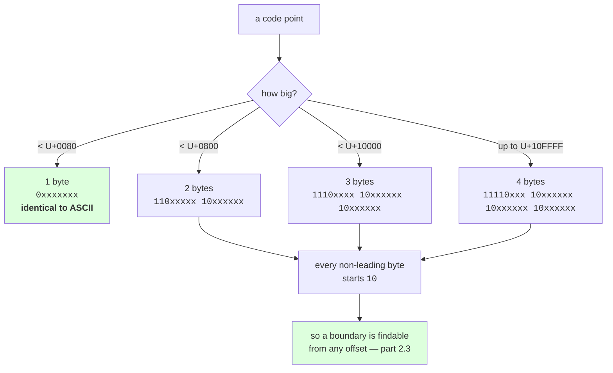

# 2.2 — How UTF-8 encodes a code point

## One-line answer

UTF-8 writes a code point as one, two, three or four bytes, and it makes the **first byte announce the
length** — `0…` for one byte, `110…` for two, `1110…` for three, `11110…` for four — while every byte
after the first begins `10…`, which is why ASCII is unchanged, why no byte of a long sequence can be
mistaken for a short one, and why 13 of the 256 byte values never appear at all.

---

## The story

You are reading a long number down the phone to somebody who is writing it down. An account number,
sixteen digits.

If you just say the digits, they lose their place around the eighth one and ask you to start again.

So you do what everybody does. You say "four digits" and then say four digits. Then "four digits"
again, and four more. You are announcing the size of each piece before you send it, and now the person
writing never has to count — they know when a group has finished because you told them how long it was
before it started.

There is a second thing that happens and you have probably never noticed it. If they get distracted
half way through and miss two digits, they do not have to go back to the beginning. They wait for you
to say "four digits" again and they rejoin there.

Announcing the length first is what makes the stream readable. Announcing it *again at every group* is
what makes it recoverable.

---

## The idea in plain language

Part [2.1](2.1-text-has-to-become-bytes.md) said an encoding is a rulebook mapping code points to
bytes. This part is that rulebook for UTF-8, and it is short enough to hold in your head.

The problem UTF-8 had to solve: there are 1,114,112 possible code points and only 256 byte values. So
some code points need more than one byte. Two obvious answers were both rejected.

**Fixed width.** Give every code point four bytes. That is UTF-32, it works, and it makes an English
document four times bigger for no benefit. Measured in part
[2.4](2.4-256-is-a-vocabulary.md), English text is 1.00 bytes per character in UTF-8.

**Variable width without markers.** Use one byte for common characters and two for the rest, with
nothing to say which is which. Then no reader can tell where a character starts, and a single lost byte
corrupts everything after it. This is the phone-number stream with no "four digits" announcements.

UTF-8 takes the third route: **variable width, with the length announced in the first byte, and every
following byte marked as a follower.**

| Code points | Bytes | Leading byte | Following bytes | Payload bits |
| --- | --- | --- | --- | --- |
| `U+0000`–`U+007F` | 1 | `0xxxxxxx` | — | 7 |
| `U+0080`–`U+07FF` | 2 | `110xxxxx` | `10xxxxxx` | 11 |
| `U+0800`–`U+FFFF` | 3 | `1110xxxx` | `10xxxxxx` × 2 | 16 |
| `U+10000`–`U+10FFFF` | 4 | `11110xxx` | `10xxxxxx` × 3 | 21 |

Read the leading-byte column downward: **the number of `1`s before the first `0` is the number of bytes
in the whole sequence.** That is the "four digits" announcement. And every following byte starts `10`,
which is the marker that says "I am a continuation, not a start".

Two consequences fall straight out, and both of them are why UTF-8 won.

**ASCII is untouched.** A code point below `U+0080` is one byte with a leading `0`, which is exactly the
byte ASCII already used. So every ASCII file ever written is already a valid UTF-8 file, byte for byte,
and a program that only understands ASCII does not break on the ASCII parts of a UTF-8 document.

**No piece of a long sequence can be mistaken for a short one.** Every byte in a multi-byte sequence
has its high bit set — `110…`, `1110…`, `11110…` or `10…` — so none of them can collide with an ASCII
byte. Searching a UTF-8 byte stream for the ASCII byte `0x2F` (a forward slash) can never accidentally
match part of a Devanagari letter. In an encoding without that property, it can, and that has been a
source of real security bugs.

One term before the code. An **overlong encoding** is a longer-than-necessary spelling of a code point
— writing `A` in two bytes instead of one, for example. The standard forbids them and Python's decoder
rejects them, which is why some byte values are not merely unused but *impossible*: measured below,
**13 byte values never appear in the output of any UTF-8 encoding**, and 77 of the 256 can never start
a valid sequence.

---

## Why Akshara needs it

- **Part [2.3](2.3-self-synchronising.md)** is the second consequence of the `10…` marker: you can find
  a character boundary from any position in the stream, which is what makes byte-level chunking safe.
- **Part [2.4](2.4-256-is-a-vocabulary.md)** measures bytes per character by script. Every number in
  that table is this table's arithmetic applied to real text — 3 bytes for Devanagari and 4 for emoji
  are read straight off the rows above.
- **Day 13**'s byte-level BPE learns merges over these byte values. The merges it learns for Devanagari
  are merges over `e0 a4 …` prefixes, and knowing that is the difference between reading its output and
  guessing at it.
- **Day 17** compares tokenizer compression across scripts. A script that needs 3 bytes per character
  starts 3× behind English before any merge is learned, and that handicap is set here, not by the
  tokenizer.

---

## The mechanism

The table above, measured rather than asserted:

```python
SAMPLES = [
    (0x0041, "LATIN CAPITAL LETTER A"),
    (0x007F, "the last 1-byte code point"),
    (0x0080, "the first 2-byte code point"),
    (0x00E9, "LATIN SMALL LETTER E WITH ACUTE"),
    (0x07FF, "the last 2-byte code point"),
    (0x0800, "the first 3-byte code point"),
    (0x0936, "DEVANAGARI LETTER SHA"),
    (0x20AC, "EURO SIGN"),
    (0xFFFF, "the last 3-byte code point"),
    (0x10000, "the first 4-byte code point"),
    (0x1F600, "GRINNING FACE"),
    (0x10FFFF, "the last code point there is"),
]

for cp, name in SAMPLES:
    b = chr(cp).encode("utf-8")
    print(f"    U+{cp:04X} {len(b):>3}  {' '.join(f'{x:02x}' for x in b):<13} "
          f"{' '.join(f'{x:08b}' for x in b):<41} {name}")
```

**Line by line:**
- `chr(cp)` turns a number into a one-code-point string; `.encode("utf-8")` turns that into `bytes`.
  Those two calls are the entire encoder, and everything below is inspection.
- `f"{x:02x}"` prints a byte in hexadecimal with a leading zero, which is how byte dumps are written
  everywhere. `f"{x:08b}"` prints the same byte in binary with all eight bits shown — **the leading
  zeros are the point**, because the pattern lives in the high bits and dropping them hides it.
- The boundary code points are in the list on purpose: `U+007F`/`U+0080` and `U+07FF`/`U+0800` and
  `U+FFFF`/`U+10000` are the exact places the width changes, so the table proves the ranges rather than
  restating them.
- Measured on Intel Core i3-1115G4 (2 cores / 4 threads), 11.7 GB RAM, Windows 11, CPython 3.12.12, on
  2026-08-26:

```text
    U+0041   1  41            01000001                                  LATIN CAPITAL LETTER A
    U+007F   1  7f            01111111                                  the last 1-byte code point
    U+0080   2  c2 80         11000010 10000000                         the first 2-byte code point
    U+00E9   2  c3 a9         11000011 10101001                         LATIN SMALL LETTER E WITH ACUTE
    U+07FF   2  df bf         11011111 10111111                         the last 2-byte code point
    U+0800   3  e0 a0 80      11100000 10100000 10000000                the first 3-byte code point
    U+0936   3  e0 a4 b6      11100000 10100100 10110110                DEVANAGARI LETTER SHA
    U+20AC   3  e2 82 ac      11100010 10000010 10101100                EURO SIGN
    U+FFFF   3  ef bf bf      11101111 10111111 10111111                the last 3-byte code point
    U+10000   4  f0 90 80 80   11110000 10010000 10000000 10000000       the first 4-byte code point
    U+1F600   4  f0 9f 98 80   11110000 10011111 10011000 10000000       GRINNING FACE
    U+10FFFF   4  f4 8f bf bf   11110100 10001111 10111111 10111111       the last code point there is
```

Run your eye down the **binary** column and read only the first byte of each row. `0…`, `0…`, `110…`,
`110…`, `110…`, `1110…`, `1110…`, `1110…`, `1110…`, `11110…`, `11110…`, `11110…`. Then read every other
byte: **every single one starts `10`.** The whole design is visible in one column.

Now do it by hand, once, because a rule you have executed yourself is a rule you can debug:

```python
cp = 0x0936
bits = f"{cp:016b}"

print(f"    code point     : U+{cp:04X}  = {cp}")
print(f"    as 16 bits     : {bits}")
print(f"    lowest 6 bits  : {bits[10:]}   -> continuation byte 10{bits[10:]}")
print(f"    next 6 bits    : {bits[4:10]}   -> continuation byte 10{bits[4:10]}")
print(f"    top 4 bits     : {bits[:4]}     -> leading byte 1110{bits[:4]}")

by_hand = bytes([
    0b1110_0000 | (cp >> 12),
    0b1000_0000 | ((cp >> 6) & 0x3F),
    0b1000_0000 | (cp & 0x3F),
])
print(f"    python says    : {' '.join(f'{x:08b}' for x in chr(cp).encode('utf-8'))}")
print(f"    matches        : {by_hand == chr(cp).encode('utf-8')}")
```

**Line by line:**
- `U+0936` needs three bytes, so the payload is **16 bits**: four in the leading byte and six in each of
  the two continuations. `f"{cp:016b}"` lays those sixteen bits out so the split can be read off.
- `bits[10:]` is the **lowest** six bits, which go in the **last** byte. Lowest bits last, exactly like
  writing a number: the units digit goes on the right.
- `cp >> 12` shifts the top four bits down into position; `(cp >> 6) & 0x3F` shifts the middle six down
  and masks off everything above them. `0x3F` is `0b0011_1111`, six ones — **the mask is six bits wide
  because a continuation byte carries six bits**, and getting that constant wrong is the classic bug in
  a hand-written encoder.
- `0b1110_0000 |` and `0b1000_0000 |` stamp the markers on. The `|` is an OR, which sets those high bits
  without touching the payload underneath.
- The last line compares against Python's own encoder. **A hand-rolled mechanism that is not checked
  against the reference implementation is a guess** (Principle 3: build first, compare after).
- Measured on this machine, 2026-08-26:

```text
    code point     : U+0936  = 2358
    as 16 bits     : 0000100100110110
    lowest 6 bits  : 110110   -> continuation byte 10110110
    next 6 bits    : 100100   -> continuation byte 10100100
    top 4 bits     : 0000     -> leading byte 11100000
    python says    : 11100000 10100100 10110110
    matches        : True
```

How many code points land in each width? An exact count, not an estimate:

```python
from collections import Counter

c = Counter()
for cp in range(0x110000):
    if 0xD800 <= cp <= 0xDFFF:
        continue
    c[len(chr(cp).encode("utf-8"))] += 1

for n in sorted(c):
    print(f"    {n} byte(s): {c[n]:>8}")
print(f"    total     : {sum(c.values()):>8}")
```

**Line by line:**
- `range(0x110000)` is every code point value there is — `0` through `1114111` — so this is a census,
  not a sample.
- The surrogate skip is required, not tidy: `chr(0xD800).encode("utf-8")` raises, because surrogates
  are reserved for UTF-16's machinery and have no UTF-8 encoding. Removing that `continue` turns this
  loop into a traceback.
- Measured on this machine, 2026-08-26:

```text
    1 byte(s):      128
    2 byte(s):     1920
    3 byte(s):    61440
    4 byte(s):  1048576
    total     :  1112064
```

**128 code points cost one byte and over a million cost four.** That distribution looks lopsided until
you notice which 128 they are: the ASCII set, which is most of the bytes in most of the world's stored
text. UTF-8 spends its cheapest codes on its commonest characters, and that is the whole trade.

Finally, the structure has holes in it — bytes that no valid UTF-8 ever contains:

```python
seen = set()
for cp in range(0x110000):
    if 0xD800 <= cp <= 0xDFFF:
        continue
    seen.update(chr(cp).encode("utf-8"))

print(f"    byte values that ever appear: {len(seen)}")
print(f"    never appear: {' '.join(f'{b:02x}' for b in sorted(set(range(256)) - seen))}")
```

**Line by line:**
- `seen.update(...)` on a `bytes` object adds each **integer** byte value, because iterating `bytes`
  yields `int`. That is a small Python fact worth knowing: `b"ab"[0]` is `97`, not `b"a"`.
- The complement `set(range(256)) - seen` is the answer to "which byte values are impossible?", computed
  rather than recalled.
- Measured on this machine, 2026-08-26:

```text
    byte values that ever appear: 243
    never appear: c0 c1 f5 f6 f7 f8 f9 fa fb fc fd fe ff
```

**Thirteen byte values are impossible in UTF-8.** `c0` and `c1` because they could only ever begin an
overlong two-byte spelling of an ASCII character, and `f5` upward because they would encode a code
point above `U+10FFFF`, which does not exist. This is the fact that makes "is this file UTF-8?" a
question with a mostly-reliable answer — and it is also why part 2.4's byte vocabulary has 256 entries
rather than 243, which that part explains.



---

## When it breaks

**The loud failure — asking for a code point that has no encoding:**

```console
>>> chr(0xD800).encode("utf-8")
Traceback (most recent call last):
  File "<stdin>", line 1, in <module>
UnicodeEncodeError: 'utf-8' codec can't encode character '\ud800' in position 0: surrogates not allowed
```

What it means: `U+D800` is a **surrogate**, one of 2,048 values reserved so that UTF-16 can spell large
code points using two 16-bit units. They are not characters, they have no UTF-8 encoding, and Python
lets you build a `str` containing one because a `str` is a sequence of code point values. The failure
arrives at the encode boundary, which may be a long way from where the string was built. The smallest
fix is not to construct it; the usual cause is data that came in through a system that speaks UTF-16.

**The second loud failure — a truncated sequence:**

```console
>>> b"\xe0\xa4".decode("utf-8")
Traceback (most recent call last):
  File "<stdin>", line 1, in <module>
UnicodeDecodeError: 'utf-8' codec can't decode bytes in position 0-1: unexpected end of data
```

What it means: `e0` announced three bytes and only two arrived. **"unexpected end of data" is the
signature of a cut in the wrong place**, and part [2.5](2.5-the-decode-that-split-a-character.md) is
the whole story of where those cuts come from.

**The silent failure, and it is silent in a more interesting way than expected.** A hand-written
encoder with the wrong mask: `0x7F` — seven bits — instead of `0x3F`. That lets a seventh bit leak into
each continuation byte. Measured on this machine on 2026-08-26, across three code points:

```text
  U+0936
    mask 0x3F: e0 a4 b6   python: e0 a4 b6   equal: True
    mask 0x7F: e0 a4 b6   decodes to U+0936
  U+20AC
    mask 0x3F: e2 82 ac   python: e2 82 ac   equal: True
    mask 0x7F: e2 82 ac   decodes to U+20AC
  U+1F600
    mask 0x3F: f0 9f 98 80   python: f0 9f 98 80   equal: True
    mask 0x7F: f0 9f d8 80   UnicodeDecodeError: 'utf-8' codec can't decode bytes in position 0-1: invalid continuation byte
```

Read that carefully, because it is not the failure most people would predict. **For two of the three
code points the wrong mask produces byte-for-byte correct output.** The leaked bit only differs from
zero when the payload happens to have that bit set, and for `U+0936` and `U+20AC` it does not. Only the
emoji exposes it, and there it is *loud* — `d8` is `11011000`, which is not a continuation byte, so the
decoder rejects it.

So the bug is not "wrong bytes, no error". It is worse in a way that matters more for testing: **the
encoder is correct on the characters you are most likely to test with and wrong on the ones you are
not.** A test over the Latin alphabet, a Devanagari letter and a currency symbol passes. Ship it, and
the first emoji in production raises `UnicodeDecodeError` in whatever component decodes it, a long way
from the encoder that produced it.

**The check that catches it,** and it is the cheapest possible one — compare against the reference:

```python
def encode_utf8_by_hand(cp: int) -> bytes:
    """Encode one code point. Written out longhand; checked against Python's encoder."""
    if cp < 0x80:
        return bytes([cp])
    if cp < 0x800:
        return bytes([0xC0 | (cp >> 6), 0x80 | (cp & 0x3F)])
    if cp < 0x10000:
        return bytes([0xE0 | (cp >> 12), 0x80 | ((cp >> 6) & 0x3F), 0x80 | (cp & 0x3F)])
    return bytes([
        0xF0 | (cp >> 18),
        0x80 | ((cp >> 12) & 0x3F),
        0x80 | ((cp >> 6) & 0x3F),
        0x80 | (cp & 0x3F),
    ])


def test_encoder_matches_python() -> None:
    """Every code point, not a sample. This runs on a laptop and it is the only honest test."""
    for cp in range(0x110000):
        if 0xD800 <= cp <= 0xDFFF:
            continue
        assert encode_utf8_by_hand(cp) == chr(cp).encode("utf-8"), f"U+{cp:04X}"
```

**Line by line:**
- The four branches are the four rows of the table, in the same order, with the same constants. `0xC0`,
  `0xE0` and `0xF0` are `110…`, `1110…` and `11110…`; `0x80` is `10…`.
- Every mask is `0x3F` — six bits — and there are six of them. **Writing them all out rather than
  looping is deliberate**: the shifts differ per branch, a loop hides that, and this is the code you
  want to be able to read at a glance when a decoder disagrees with you.
- `test_encoder_matches_python` iterates **all 1,112,064 valid code points** rather than a handful. A
  sampled test passes with a wrong mask, because most masks are wrong for only some bit patterns —
  which is exactly the silent failure above.
- The assertion message is the code point in hex, so a failure names the character instead of saying
  `False != True`.
- This test is CPU-only, offline, deterministic, and needs no seed, which is what `tests/` in this
  repository requires.

---

## In production

**What a research engineer writes instead of the teaching version.** Nobody hand-writes a UTF-8 encoder
in production — the one in the standard library is correct, is written in C, and has been attacked for
twenty-five years. What they *do* keep from this part is the bit patterns, in their head, because those
patterns are how you read a hex dump. When a log line shows `c3 a9` where you expected one character, or
`ef bf bd` repeating, you can name the bug from the bytes alone: the first is a UTF-8 pair, the second
is `U+FFFD` — the replacement character from part [2.1](2.1-text-has-to-become-bytes.md)'s
`errors="replace"` — written out three bytes at a time. **`ef bf bd` in a data file means somebody's
decode failed upstream and the original bytes are gone.**

The second thing that survives into production is the ASCII compatibility, used deliberately. A parser
scanning UTF-8 for structural ASCII characters — a comma, a newline, a quote, a slash — can work on raw
bytes without decoding anything at all, because no multi-byte sequence contains those byte values. That
is why fast CSV and JSON readers operate on bytes, and it is a direct consequence of the leading `0`.

**What degrades at scale.** Storage and context, per script. A 3-bytes-per-character script pays three
times the bytes of English for the same number of characters, and after Day 13 that is three times the
byte tokens before merges. At corpus scale this shows up as a language mix that is not the mix you
thought you sampled: budgeting by bytes silently under-samples non-Latin scripts, and budgeting by
characters silently over-samples them in storage. **Neither unit is neutral, so the budget has to name
its unit.**

**The failure that only shows with real data.** Surrogates arriving from elsewhere. Systems that speak
UTF-16 internally — some databases, some Windows APIs, some JSON producers — can emit a lone surrogate,
and it survives every check until something tries to encode it. The traceback then appears in whatever
component happened to be doing the encoding, which is usually not the component that produced it.

**The review comment.** *"This slices the byte stream at a fixed offset and decodes. The leading byte
tells you the length — check the high bits before you cut, or use an incremental decoder. As written,
this raises on any file that is not pure ASCII."*

**The interview question.** *"Why did UTF-8 win?"* The weak answer is "it is smaller". The strong answer
names the three properties and what each one bought: **ASCII files are already valid UTF-8, so nothing
had to be converted; no byte of a multi-byte sequence can be confused with an ASCII byte, so existing
byte-oriented code keeps working; and the leading byte announces the length while every other byte is
marked as a continuation, so a reader can resynchronise from any position.** The follow-up that shows
you have used it: *and the cost is that indexing by character is not `O(1)` any more — which is fine,
because indexing text by character number is almost never what you actually wanted.*

**Compute tier: T0.** The standard library on a laptop: no packages, no data files, no network. The
census loop runs over 1,114,112 code points on one CPU core, which is a laptop's work and not a
cluster's. Every number here is exact and reproducible on any Python 3 — note that unlike section 1's
figures, **these do not depend on the Unicode version at all**, because the UTF-8 rules are fixed and
the code point range is fixed. That independence is not a detail; it is the beginning of part
[2.4](2.4-256-is-a-vocabulary.md)'s argument.

---

## Check yourself

Run this. It prints **the length announcement in the first byte, in binary**:

```python
for cp in (0x0041, 0x00E9, 0x0936, 0x1F600):
    b = chr(cp).encode("utf-8")
    lead = b[0]
    ones = 0
    while ones < 8 and (lead << ones) & 0x80:
        ones += 1
    print(f"  U+{cp:04X}  {len(b)} byte(s)  first byte {lead:08b}  leading ones = {ones}")

print("  impossible byte values:", 256 - len({x for cp in range(0x110000)
      if not 0xD800 <= cp <= 0xDFFF for x in chr(cp).encode("utf-8")}))
print("  U+0936 == e0 a4 b6 :", chr(0x0936).encode("utf-8") == b"\xe0\xa4\xb6")
```

**Line by line:**
- The `while` counts the leading `1` bits of the first byte by shifting left and testing the top bit.
  For a one-byte sequence it counts **zero**, which is the one case where the count is not the length —
  say out loud why that exception exists and why it is the reason ASCII still works.
- The `leading ones` column prints `0`, `2`, `3`, `4` for the four rows. Say what the byte count is for
  each, and state the rule that connects the two columns.
- The `impossible byte values` line prints `13`. **Name them without scrolling up**, or at least name
  why `c0` is one of them.
- Now try `b"\xe0\xa4".decode("utf-8")` and read the error text. Say which byte announced how many, and
  how many arrived.

**Say this out loud, without scrolling up:** say what the first byte of a UTF-8 sequence tells you, say
what every byte after it starts with, and say what those two rules together buy that a plain
variable-width scheme does not.
