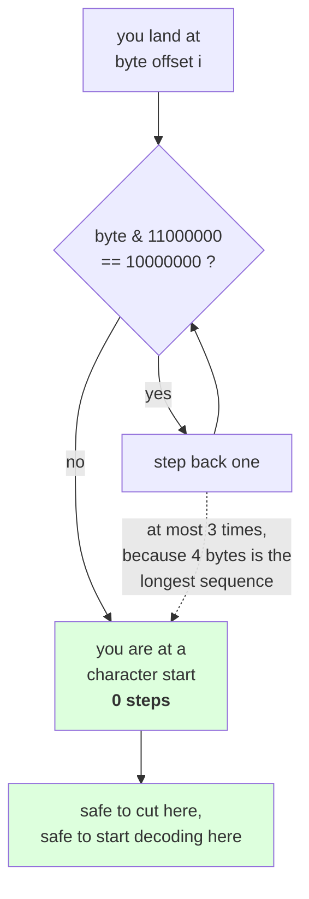

# 2.3 — Self-synchronising, or finding a boundary from anywhere

## One-line answer

Because every continuation byte begins `10` and no leading byte does, you can drop into a UTF-8 stream
at **any** offset and find the start of the character you landed in by stepping backwards **at most
three bytes** — which is what makes it safe to cut, chunk, memory-map and stream a byte buffer without
ever decoding it first.

---

## The story

Somebody hands you a page of writing with all the spaces taken out. One long line of letters, no gaps,
no punctuation. They ask you to start reading from a spot half way down and tell them the first whole
word.

You cannot. You are standing somewhere inside a word, and nothing on the page tells you where that word
began. You would have to go back to the top of the page and read forward, counting, to know.

Now they hand you a second page, also with no spaces — but on this one, the first letter of every word
is a capital and no other letter is. Same question, same spot half way down.

This time it takes you a moment. You look left until you hit a capital. That is where your word starts.
You never had to go back to the top, and it did not matter where you landed.

Nothing was added to the second page except a mark that says "I am a beginning". That one mark turned
an unreadable stream into one you can join anywhere.

---

## The idea in plain language

Part [2.2](2.2-how-utf-8-encodes-a-code-point.md) showed the bit patterns. This part is about the
property they buy, which has a name: UTF-8 is **self-synchronising**.

The definition, in one line: **from any byte position, you can determine whether you are at the start
of a character, and if not, find the start, using only the bytes near you.** No table, no counting from
the beginning of the file, no state.

The mechanism is the capital letter from the story. A continuation byte always looks like `10xxxxxx`. A
leading byte never does — it is `0xxxxxxx`, `110xxxxx`, `1110xxxx` or `11110xxx`. So the test is one
bitwise `and`:

```
byte & 0b1100_0000 == 0b1000_0000   ->  this is a continuation byte, keep walking back
```

And because the longest sequence is four bytes, **you walk back at most three times.** Measured below,
that bound is tight: an offset landing on the last byte of an emoji is exactly three steps from the
start.

Two words to define, because they get used interchangeably and mean different things:

- A **character boundary** is a position where one code point's bytes end and the next one's begin. This
  part is entirely about finding those.
- A **grapheme boundary** is a position where one thing-a-person-sees ends. Part
  [1.4](../01-code-points-and-graphemes/1.4-graphemes-what-a-person-sees.md) showed that those are
  defined by a versioned rule set and are much harder. **Byte-level self-synchronisation gives you the
  first and says nothing about the second**, and conflating them is how a truncation ends up cutting a
  flag in half without producing invalid UTF-8.

Why this matters more than it first appears: it is the property that lets a program treat text as an
**opaque byte buffer** everywhere except the two ends. A chunk boundary can land anywhere and be
repaired locally. A log line can be cut to a byte budget. A file can be memory-mapped and sliced by
byte offset. A search for an ASCII delimiter can run on raw bytes. **None of those need a decode**, and
each one is a place where a decode would have been a cost or a failure.

The comparison that makes the point is UTF-16, which is *not* self-synchronising at the byte level.
Measured below, the same four-character string in UTF-16 contains the byte `0x00` three times, each
time as half of a unit — so a byte offset tells you nothing at all, not even whether you are on an even
or an odd boundary. To read UTF-16 you must know where the stream started. To read UTF-8 you do not.

---

## Why Akshara needs it

- **Part [2.5](2.5-the-decode-that-split-a-character.md)** is what happens when a chunk boundary is
  *not* repaired: the same cut, without the walk-back, decoded independently.
- **Day 13**'s byte-level BPE never decodes at all during training. That is only sound because a byte
  buffer can be cut anywhere and rejoined, which is this property.
- **Day 51 onward**, the data loader takes a large token file, memory-maps it and slices `block_size`
  windows at arbitrary offsets. Slicing a byte buffer at an arbitrary offset is safe; slicing a text
  buffer is what part [1.2](../01-code-points-and-graphemes/1.2-what-len-actually-counts.md) warned
  about.
- **Day 100 onward**, the serving surface truncates prompts to a byte budget and truncates responses
  for logs. The function in this part is the one that does it, and part
  [1.2](../01-code-points-and-graphemes/1.2-what-len-actually-counts.md) explicitly deferred it here.

---

## The mechanism

One short string with one character of each width, so every case appears:

```python
text = "a\u0936\U0001F600b"
raw = text.encode("utf-8")
print("  text  :", ascii(text), " code points:", len(text))
print("  bytes :", " ".join(f"{b:02x}" for b in raw), " n:", len(raw))


def char_start(buf: bytes, i: int) -> int:
    """Walk back to the first byte of the character containing offset i."""
    while i > 0 and (buf[i] & 0b1100_0000) == 0b1000_0000:
        i -= 1
    return i


print("  offset  byte  continuation?  start-of-char  steps back")
for i, b in enumerate(raw):
    cont = (b & 0b1100_0000) == 0b1000_0000
    s = char_start(raw, i)
    print(f"    {i:>4}   0x{b:02x}   {str(cont):<13}  {s:>11}  {i - s:>10}")
```

**Line by line:**
- `0b1100_0000` masks off the top two bits and throws the other six away; comparing the result to
  `0b1000_0000` asks "are the top two bits exactly `10`?". **Two bits is the entire test** — no table,
  no lookup, no context.
- `while i > 0` is the guard for a buffer that *starts* with a continuation byte, which happens when
  somebody hands you a chunk that begins mid-character. That is not a hypothetical; it is the normal
  case in part [2.5](2.5-the-decode-that-split-a-character.md).
- `char_start` reads only `buf[i]` and the bytes just before it. It never looks at the start of the
  buffer, which is what "self-synchronising" means in practice: **the cost does not grow with the file.**
- The `steps back` column is printed because the bound is the interesting part. Watch it reach three
  and stop.
- Measured on Intel Core i3-1115G4 (2 cores / 4 threads), 11.7 GB RAM, Windows 11, CPython 3.12.12, on
  2026-08-26:

```text
  text  : 'a\u0936\U0001f600b'  code points: 4
  bytes : 61 e0 a4 b6 f0 9f 98 80 62  n: 9
  offset  byte  continuation?  start-of-char  steps back
       0   0x61   False                    0           0
       1   0xe0   False                    1           0
       2   0xa4   True                     1           1
       3   0xb6   True                     1           2
       4   0xf0   False                    4           0
       5   0x9f   True                     4           1
       6   0x98   True                     4           2
       7   0x80   True                     4           3
       8   0x62   False                    8           0
```

**Nine offsets, four characters, and the largest walk back is three.** Four bytes, at most three steps
— the bound is not a rule of thumb, it is the maximum sequence length minus one.

Now the reason it matters. Cut the same buffer at every offset and decode strictly:

```python
for i in range(len(raw) + 1):
    try:
        print(f"    raw[:{i}] -> {ascii(raw[:i].decode('utf-8'))}")
    except UnicodeDecodeError as e:
        print(f"    raw[:{i}] -> UnicodeDecodeError: {e}")
```

**Line by line:**
- `range(len(raw) + 1)` includes both the empty prefix and the whole buffer, so the loop covers every
  possible cut rather than the interesting-looking ones.
- The decode is **strict**, which is the default. That is the point of the demonstration: a strict
  decoder tells you that the cut was bad. Every other error handler would hide it, which is part
  [2.1](2.1-text-has-to-become-bytes.md)'s argument arriving with a second example.
- Measured on this machine, 2026-08-26:

```text
    raw[:0] -> ''
    raw[:1] -> 'a'
    raw[:2] -> UnicodeDecodeError: 'utf-8' codec can't decode byte 0xe0 in position 1: unexpected end of data
    raw[:3] -> UnicodeDecodeError: 'utf-8' codec can't decode bytes in position 1-2: unexpected end of data
    raw[:4] -> 'a\u0936'
    raw[:5] -> UnicodeDecodeError: 'utf-8' codec can't decode byte 0xf0 in position 4: unexpected end of data
    raw[:6] -> UnicodeDecodeError: 'utf-8' codec can't decode bytes in position 4-5: unexpected end of data
    raw[:7] -> UnicodeDecodeError: 'utf-8' codec can't decode bytes in position 4-6: unexpected end of data
    raw[:8] -> 'a\u0936\U0001f600'
    raw[:9] -> 'a\u0936\U0001f600b'
```

**Five of the ten cuts are valid and five raise**, and two of the five valid ones are the trivial ends
— the empty prefix and the whole buffer. On this string a cut point chosen at random is as likely to be
wrong as right, and the ratio gets worse as the text gets less English: every extra byte of a
multi-byte character adds another bad offset and no good ones. That is not an argument against cutting
— it is an argument for repairing the cut, which costs three comparisons:

```python
def truncate_bytes(s: str, limit: int) -> bytes:
    """Cut to at most `limit` UTF-8 bytes, never inside a character."""
    raw = s.encode("utf-8")
    if len(raw) <= limit:
        return raw
    cut = limit
    while cut > 0 and (raw[cut] & 0b1100_0000) == 0b1000_0000:
        cut -= 1
    return raw[:cut]
```

**Line by line:**
- The early return matters: a string already within the limit is returned **whole**, and no walk-back
  runs. Without it, a limit equal to the length would index `raw[limit]` and raise `IndexError`.
- `cut = limit` then walking back means the result is always **at or below** the limit, never above.
  Reaching forward to complete the character would exceed the budget, and the budget usually exists
  because something downstream will reject a longer value.
- The test inspects `raw[cut]` — the byte that would be the **first byte kept out** — not `raw[cut - 1]`.
  If the first excluded byte is a continuation, the cut is inside a character. Getting that off-by-one
  wrong gives a function that mostly works, which is worse than one that never does.
- It returns `bytes`, not `str`, on purpose. **The caller asked for a byte budget**, so the byte buffer
  is the honest answer; decoding it back to text invites somebody to measure it in the wrong unit
  again.
- Measured on this machine, 2026-08-26:

```text
    limit  0 -> 0 bytes, ''                         (wasted 0)
    limit  1 -> 1 bytes, 'a'                        (wasted 0)
    limit  2 -> 1 bytes, 'a'                        (wasted 1)
    limit  3 -> 1 bytes, 'a'                        (wasted 2)
    limit  4 -> 4 bytes, 'a\u0936'                  (wasted 0)
    limit  5 -> 4 bytes, 'a\u0936'                  (wasted 1)
    limit  6 -> 4 bytes, 'a\u0936'                  (wasted 2)
    limit  7 -> 4 bytes, 'a\u0936'                  (wasted 3)
    limit  8 -> 8 bytes, 'a\u0936\U0001f600'        (wasted 0)
    limit  9 -> 9 bytes, 'a\u0936\U0001f600b'       (wasted 0)
```

**Every output decodes.** The `wasted` column is the honest cost: up to three bytes of the budget go
unused, because the alternative is a broken sequence. Three bytes is the worst case, always, for any
limit and any text.

And the contrast that makes the property visible by its absence:

```python
u16 = text.encode("utf-16-le")
print("  utf-16-le:", " ".join(f"{b:02x}" for b in u16), " n:", len(u16))
print("  the byte 0x00 appears", sum(1 for b in u16 if b == 0), "times, always as half of a unit")
print("  utf-8 contains a 0x00 byte:", 0 in raw)
```

**Line by line:**
- `utf-16-le` is little-endian UTF-16: two bytes per code unit, low byte first. The `le` matters —
  there is also a big-endian form, and a byte stream does not say which, so UTF-16 needs either a
  byte-order mark or an out-of-band agreement. UTF-8 has no such question.
- `0 in raw` asks whether the UTF-8 buffer contains a zero byte. It does not, and it cannot for any
  text without a genuine `U+0000` — **which is why UTF-8 is safe to pass through C string APIs** and
  UTF-16 is not.
- Measured on this machine, 2026-08-26:

```text
  utf-16-le: 61 00 36 09 3d d8 00 de 62 00  n: 10
  the byte 0x00 appears 3 times, always as half of a unit
  utf-8 contains a 0x00 byte: False
```

Look at bytes 5 and 6 of that UTF-16 dump: `d8 00`. The `00` is the low byte of a surrogate half, and
it is indistinguishable, as a byte, from the `00` at offset 1 that is the high byte of the letter `a`.
**There is no local test that tells you which is which.** That is what "not self-synchronising" costs.



---

## When it breaks

**The loud failure — the cut that was not repaired:**

```console
>>> "a\u0936".encode("utf-8")[:2].decode("utf-8")
Traceback (most recent call last):
  File "<stdin>", line 1, in <module>
UnicodeDecodeError: 'utf-8' codec can't decode byte 0xe0 in position 1: unexpected end of data
```

What it means: `0xe0` announced a three-byte sequence and the buffer ended after one. **"unexpected end
of data" always means a truncation**; "invalid start byte" means the opposite problem, a buffer that
begins mid-character. Learning to tell those two messages apart tells you which end of the cut went
wrong.

**The second loud failure — a chunk that starts mid-character:**

```console
>>> "a\u0936".encode("utf-8")[2:].decode("utf-8")
Traceback (most recent call last):
  File "<stdin>", line 1, in <module>
UnicodeDecodeError: 'utf-8' codec can't decode byte 0xa4 in position 0: invalid start byte
```

What it means: `0xa4` is `10100100`, a continuation byte, and a valid sequence cannot begin with one.
This is `char_start` from above being needed at the *front* of a chunk rather than the back.

**The silent failure.** Repair the cut with `errors="ignore"` instead of the walk-back, and the error
goes away along with a character. Or — subtler and more common — repair it correctly for *characters*
and believe you have repaired it for *readers*. `truncate_bytes` guarantees valid UTF-8. It does not
guarantee a whole flag, a whole family emoji, or a letter with its accent, because those are grapheme
questions and part [1.4](../01-code-points-and-graphemes/1.4-graphemes-what-a-person-sees.md) showed
the standard library cannot answer them. The wrong output, verbatim:

```text
  input       : a flag, as two regional indicators   -> 8 UTF-8 bytes
  limit 4     : truncate_bytes returns 4 bytes       -> valid UTF-8, decodes fine
  what it is  : one regional indicator, alone        -> draws as a letter in a box
  exceptions  : none. The bytes are valid. The output is not a flag.
```

**The check that catches it** is two assertions, and the second one is the one people forget:

```python
def assert_safe_cut(original: str, piece: bytes, limit: int) -> None:
    """A byte-budget cut must decode, and must stay within budget."""
    assert len(piece) <= limit, f"cut is {len(piece)} bytes, over the {limit}-byte budget"
    piece.decode("utf-8")                       # strict: raises if the cut split a character
    assert original.encode("utf-8").startswith(piece), "the cut is not a prefix of the input"
```

**Line by line:**
- `piece.decode("utf-8")` is called for its **exception**, not its value, which is why the result is
  discarded. Passing `errors=` anything here would turn a real check into a no-op.
- The `startswith` assertion catches a whole class of mistake the decode cannot: a "truncation" that
  reordered, re-encoded or normalized the text on the way. A cut must be a prefix, byte for byte.
- The budget assertion is first because it is the cheapest and because the failure it catches — a
  function that reaches *forward* to complete a character — produces output that decodes perfectly and
  is still rejected by whatever imposed the limit.
- What is deliberately absent is any claim about graphemes. If the caller needs a whole flag, that is a
  different function with a different name, and pretending this one provides it is the silent failure
  above.

---

## In production

**What a research engineer writes instead of the teaching version.** They rarely write `char_start` by
hand, because the standard library already has the streaming version: an **incremental decoder** holds
the partial sequence across chunk boundaries and hands back complete characters only. Part
[2.5](2.5-the-decode-that-split-a-character.md) uses it. What they *do* write by hand is
`truncate_bytes`, because a byte budget is a real constraint — a database column, a log field, a
message size — and there is no standard-library function that cuts a string to a byte limit safely.

The larger habit is the one this whole section has been building: **the pipeline holds bytes and the
boundary repair is local.** Once the property in this part is available, a chunk boundary stops being a
correctness problem and becomes a three-comparison detail, which is what allows a corpus to be sharded,
memory-mapped, sliced and streamed without a decode anywhere in the hot path.

**What degrades at scale.** Nothing about this property degrades — that is the point of it, and it is
worth saying plainly because most things in this curriculum do. The walk-back is `O(1)` with a constant
of three, independent of file size, chunk size and script. What degrades is the *wasted* budget when
the limit is small and the text is not English: up to 3 bytes of every cut, which is negligible at
1,000 bytes and 30% at 10.

**The failure that only shows with real data.** Chunk sizes that happen to align. Part
[2.5](2.5-the-decode-that-split-a-character.md) measures a case where one chunk size splits 61% of
boundaries and another splits **none at all**, because the test text had a repeating structure whose
period divided the chunk size. A test corpus made by repeating one sentence can therefore pass with the
repair removed entirely.

**The review comment.** *"`buffer[i:i+n].decode()` — that cut can land inside a character. Either walk
back to a boundary before decoding, or keep an incremental decoder across the chunks. It will pass CI
on ASCII fixtures and raise on the first non-English document."*

**The interview question.** *"What does it mean that UTF-8 is self-synchronising, and why do you care?"*
The weak answer is "you can tell where characters start". The strong answer states the mechanism and the
bound: **continuation bytes are exactly the bytes matching `10xxxxxx`, no leading byte matches that, so
from any offset you find the character start in at most three steps with no state and no table.** Then
the consequence that shows you have used it: *which is why a text pipeline can hold opaque byte buffers
end to end — chunk, shard, memory-map, cut to a byte budget — and only decode at the edges. UTF-16 has
no equivalent property at the byte level, so it has to be read from a known starting point.*

**Compute tier: T0.** The standard library on a laptop: no packages, no data files, no network. Every
number here is exact and deterministic, with no seed and no timing, and — like part
[2.2](2.2-how-utf-8-encodes-a-code-point.md) and unlike section 1 — **none of it depends on the Unicode
version**, because the property is a fact about the encoding rather than about the character table.
What T0 cannot show is the throughput argument: that skipping the decode in a data loader is *faster*
is a timing claim, this part does not measure it, and Day 51 is where a loader gets timed.

---

## Check yourself

Run this. It prints **the walk-back distance for every offset, and the largest one is three**:

```python
text = "a\u0936\U0001F600b"
raw = text.encode("utf-8")

def char_start(buf, i):
    while i > 0 and (buf[i] & 0b1100_0000) == 0b1000_0000:
        i -= 1
    return i

steps = [i - char_start(raw, i) for i in range(len(raw))]
print("  bytes        :", " ".join(f"{b:02x}" for b in raw))
print("  steps back   :", steps)
print("  worst case   :", max(steps))
print("  valid cuts   :", [i for i in range(len(raw) + 1)
                           if i == len(raw) or (raw[i] & 0b1100_0000) != 0b1000_0000])
print("  zero bytes in utf-8 :", raw.count(0), " in utf-16-le:", text.encode("utf-16-le").count(0))
```

**Line by line:**
- `steps` prints `[0, 0, 1, 2, 0, 1, 2, 3, 0]`. **Say out loud why the maximum is three and not four,
  and say what it would be if UTF-8 allowed six-byte sequences.**
- `valid cuts` prints the offsets where a cut is safe. Count them, count the total offsets, and say what
  fraction of arbitrary cuts would raise on this string.
- The last line prints `0` zero bytes for UTF-8 and `3` for UTF-16. Say what that means for passing a
  buffer to something that treats a zero byte as the end of a string.
- Now take `raw[3:]` and decode it. Read the error and say whether it says "unexpected end of data" or
  "invalid start byte", and say which end of the cut that tells you about.

**Say this out loud, without scrolling up:** state the one-line bit test that distinguishes a
continuation byte from a leading byte, say the maximum number of bytes you ever step back and why, and
name one thing `truncate_bytes` guarantees and one thing it does not.
