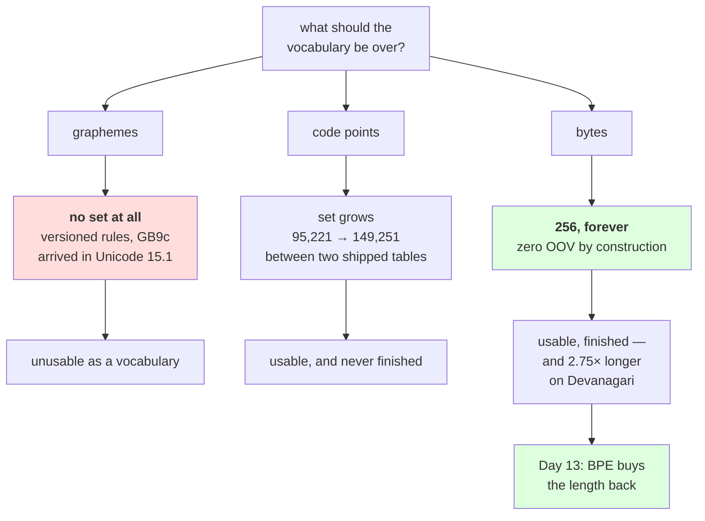

# 2.4 — 256 is a vocabulary that is finished

## One-line answer

Of the three units this day has named, only **bytes** have a set that is complete: there are 256 of
them, there were 256 of them before Unicode existed, and there will be 256 of them after the next
twenty releases — while the assigned character set grew by **54,030 characters** between the two
Unicode tables Python itself ships, and the grapheme level has no set at all, only versioned rules.

---

## The story

You are at a shop paying for things. In your pocket you have coins — ones, twos, fives, tens — and a
couple of notes. Five or six different values in all.

The shop sells thousands of things and adds new ones every month. Last week it started stocking a
soap it never had before, at ₹47. Nobody had to mint a ₹47 coin. You paid with two twenties, a five
and two ones.

Now imagine the other way of doing it: one note printed for each product, worth exactly that product.
It would work, and it would be very convenient at the till — one note, one item, no counting. Until the
shop adds a product. Then somebody has to print a new note, get it to every customer, and update every
till that has never seen it.

The small fixed set is more work at the counter and it never needs updating. The big convenient set is
less work at the counter and is never finished.

---

## The idea in plain language

Day 9 part
[1.1](../../../day-009-the-vocabulary-problem/parts/01-the-vocabulary-problem/1.1-a-model-can-only-emit-its-vocabulary.md)
established the hard fact this part turns on: **a model can only emit what is in its vocabulary**, the
vocabulary is fixed before training, and anything outside it becomes `<unk>` — not a degraded version
of the thing, but the absence of it.

So the question "what should the vocabulary be built over?" is really the question **"which unit has a
set I can finish enumerating before I start training?"** This day has produced three candidates, and
they rank cleanly.

**Graphemes** — what a person sees. There is no set. Part
[1.4](../01-code-points-and-graphemes/1.4-graphemes-what-a-person-sees.md) showed that a grapheme is
defined by a rule set, that the rule set gained a rule between Unicode 15.0 and 15.1, and that the
standard itself calls the result an approximation of perception. **You cannot enumerate a rule.** This
candidate is out before the arithmetic starts.

**Code points** — what `len()` counts. There is a set, and it grows. Measured below, using the two
Unicode tables that CPython ships side by side: **95,221** assigned characters in Unicode 3.2 and
**149,251** in Unicode 15.0. That is 54,030 new characters, a 1.57× increase, and every one of them is
a character that a vocabulary frozen at the earlier version would have had to call `<unk>`. The set is
not finished, and the thing that makes it grow is a committee that will meet again.

**Bytes** — what is actually in the file. The set has exactly 256 members. It had 256 members before
Unicode existed. It will have 256 members after the next twenty Unicode releases, because a byte is
eight bits and eight bits is 256 values, and no standards body can change that.

That is the argument, and it is a **correctness** argument rather than a performance one. A byte
vocabulary has **zero out-of-vocabulary rate by construction** — not "low", not "after enough training
data", but zero, for every input that has ever existed or ever will, including inputs that are not
valid text at all. Measured below: a 20-code-point string mixing Latin, Devanagari, a zero-width-joiner
emoji sequence and Chinese encodes to 51 ids and round-trips exactly, with a vocabulary of 256 entries
that was written down before the string existed.

**The price is sequence length, and it is not small.** Every byte is a token, so text that is 3 bytes
per character is 3× the tokens. Day 9 part
[1.3](../../../day-009-the-vocabulary-problem/parts/01-the-vocabulary-problem/1.3-why-not-characters.md)
already showed why that matters: attention cost grows with the **square** of the sequence length, so 3×
the tokens is 9× the attention work, and the context window holds a third as much. Measured below, that
multiplier runs from 1.00× for English to 16.00× for emoji.

So bytes are not the answer. **Bytes are the floor** — the thing you fall back to so that nothing is
ever unrepresentable — and Day 13 builds upward from that floor with BPE, buying the sequence length
back by merging common byte pairs into single tokens. The floor is what makes the whole scheme
lossless; the merges are what make it affordable.

---

## Why Akshara needs it

- **Day 11** builds a character-level tokenizer and measures where it dies. This part is the answer it
  dies into: the fix for "a character I have never seen" is to stop using characters.
- **Day 12** builds BPE over characters and **Day 13** rebuilds it over bytes. The reason for doing it
  twice is exactly this part — the byte version cannot have an `<unk>` token, and the character version
  always can.
- **Day 17** measures compression across scripts. The bytes-per-character column measured here is the
  starting handicap that the merges have to overcome, and a tokenizer's score on Devanagari cannot be
  read without it.
- **Day 51 onward**, the pretraining corpus is tokenized once, ahead of time. A vocabulary that could
  encounter an unrepresentable character mid-corpus is a vocabulary that can fail half way through a
  job that has already run for hours.

---

## The mechanism

First, the growth. This is measurable without downloading anything, because CPython ships **two**
Unicode tables — the current one and a frozen Unicode 3.2 table, kept for an old normalization
compatibility function:

```python
import sys
import unicodedata


def assigned(mod) -> int:
    """Count real characters: not unassigned (Cn), not private use (Co), not surrogates (Cs)."""
    return sum(1 for cp in range(sys.maxunicode + 1)
               if mod.category(chr(cp)) not in ("Cn", "Co", "Cs"))


old = assigned(unicodedata.ucd_3_2_0)
new = assigned(unicodedata)
print(f"  Unicode {unicodedata.ucd_3_2_0.unidata_version:<7} assigned characters: {old:>7}")
print(f"  Unicode {unicodedata.unidata_version:<7} assigned characters: {new:>7}")
print(f"  added between the two tables       : {new - old:>7}  ({new / old:.2f}x)")
print(f"  byte values, then and now          :     256          (1.00x)")
```

**Line by line:**
- `unicodedata.ucd_3_2_0` is a second module object exposing the **Unicode 3.2** character database,
  shipped inside CPython. It was checked against the Python 3.12 `unicodedata` documentation page on
  2026-08-26; it exists so that `normalize` can implement an older compatibility behaviour, and here it
  is being used as a time machine.
- Both counts come from **the same function on the same machine**, which is what makes the comparison
  worth anything. A number for one version from this machine and a number for the other from memory
  would be exactly the rumour Principle 8 forbids.
- The three exclusions matter and are not cosmetic. Private use (`Co`) is 137,468 code points that no
  standard assigns and both tables count identically; including it would bury the real growth under a
  constant. Surrogates (`Cs`) are not characters at all.
- Measured on Intel Core i3-1115G4 (2 cores / 4 threads), 11.7 GB RAM, Windows 11, CPython 3.12.12, on
  2026-08-26:

```text
  Unicode 3.2.0   assigned characters:   95221
  Unicode 15.0.0  assigned characters:  149251
  added between the two tables       :   54030  (1.57x)
  byte values, then and now          :     256          (1.00x)
```

**Fifty-four thousand new characters, and 256 stayed 256.** Two of those rows are measurements of a
moving target and one is a fact about arithmetic.

Now the byte vocabulary, written out in full. It takes one line, and that is the point:

```python
vocab = {bytes([i]): i for i in range(256)}

hard = ("caf\u00e9 \u0936\u092c\u094d\u0926 "
        "\U0001F468\u200d\U0001F469\u200d\U0001F467\u200d\U0001F466 \u4f60\u597d")

ids = [vocab[bytes([b])] for b in hard.encode("utf-8")]
back = bytes(ids).decode("utf-8")

print("  V                  :", len(vocab))
print("  input code points  :", len(hard))
print("  ids produced       :", len(ids))
print("  ids min / max      :", min(ids), "/", max(ids))
print("  round trip exact   :", back == hard)
print("  ratio ids/codepoint:", f"{len(ids) / len(hard):.2f}")
```

**Line by line:**
- The vocabulary is built from `range(256)` and **never looks at the corpus**. Compare that with Day 9
  part [2.1](../../../day-009-the-vocabulary-problem/parts/02-what-a-tokenizer-is/2.1-a-function-and-its-inverse.md),
  whose table came from `sorted(set(text))` and therefore had a domain limited to one document. This
  table's domain is every byte string.
- `bytes([i])` makes a one-byte `bytes` object as the key rather than the integer `i`, so the table has
  the same shape as the merged-token tables Day 13 builds on top of it. Keying on `int` would work
  today and need rewriting on Day 13.
- `hard` is chosen to break a character vocabulary: two scripts, a precomposed accent, a virama, a
  four-person zero-width-joiner emoji sequence and two Chinese characters. **There is no `try` around
  the encode**, because there is nothing to catch — that is the claim being demonstrated.
- `bytes(ids)` reassembles the byte string from the ids, and `.decode("utf-8")` turns it back into
  text. The round trip is the test; a tokenizer whose `decode(encode(s)) != s` is broken, which is Day
  9 part 2.1's one property.
- Measured on this machine, 2026-08-26:

```text
  V                  : 256
  input code points  : 20
  ids produced       : 51
  ids min / max      : 32 / 240
  round trip exact   : True
  ratio ids/codepoint: 2.55
```

**Twenty code points became 51 ids and came back exactly.** The vocabulary was written before the
string was chosen, it has 256 entries, and there is no `<unk>` in it because there is nothing for
`<unk>` to mean.

One detail worth not skipping: **the vocabulary has 256 entries even though part
[2.2](2.2-how-utf-8-encodes-a-code-point.md) measured that only 243 byte values ever appear in valid
UTF-8.** The 13 impossible bytes get slots anyway, for two reasons. The cheap one is that 256 is a
power of two and 243 is not, and every downstream size is nicer for it. The real one is that **the
tokenizer's input is bytes, not valid UTF-8** — a truncated file, a mislabelled encoding, a binary blob
that got into the corpus, all of them contain those bytes, and a tokenizer that raises on them is a
tokenizer that fails on real data. Thirteen wasted slots out of 256 buys "this function is total".

Now the price, per script:

```python
SAMPLES = [
    ("English",    "the quick brown fox jumps over the lazy dog"),
    ("French",     "le vif renard brun saute par-dessus le chien paresseux"),
    ("Greek",      "\u03b7 \u03b3\u03c1\u03ae\u03b3\u03bf\u03c1\u03b7 \u03ba\u03b1\u03c6\u03ad \u03b1\u03bb\u03b5\u03c0\u03bf\u03cd"),
    ("Russian",    "\u0431\u044b\u0441\u0442\u0440\u0430\u044f \u043a\u043e\u0440\u0438\u0447\u043d\u0435\u0432\u0430\u044f \u043b\u0438\u0441\u0430"),
    ("Devanagari", "\u0924\u0947\u091c\u093c \u092d\u0942\u0930\u0940 \u0932\u094b\u092e\u0921\u093c\u0940"),
    ("Chinese",    "\u5feb\u901f\u7684\u68d5\u8272\u72d0\u72f8"),
    ("Emoji",      "\U0001F600\U0001F601\U0001F602\U0001F603"),
]

base = None
for name, s in SAMPLES:
    n, b = len(s), len(s.encode("utf-8"))
    r = b / n
    if base is None:
        base = r
    print(f"  {name:<12} {n:>6} {b:>6} {r:>11.2f} {(r / base) ** 2:>20.2f}x")
```

**Line by line:**
- Every sample is the same sentence in meaning where possible, so the comparison is between scripts and
  not between contents. The Chinese and emoji rows are shorter in characters because those scripts
  genuinely pack more meaning per character — which is exactly why the *ratio* column is the one to
  read, not the raw counts.
- `base` is set from the first row and every later row is divided by it, so the last column is relative
  to English by construction rather than by an assumed constant.
- `(r / base) ** 2` is squared because **attention cost grows with the square of the sequence length**
  — Day 9 part 1.3's arithmetic, applied here. It is a projection from the measured ratio, not a timed
  benchmark, and it is labelled that way in the header.
- Measured on this machine, 2026-08-26:

```text
  script        chars  bytes  bytes/char  attention vs English
  English          43     43        1.00                 1.00x
  French           54     54        1.00                 1.00x
  Greek            21     39        1.86                 3.45x
  Russian          23     44        1.91                 3.66x
  Devanagari       16     44        2.75                 7.56x
  Chinese           7     21        3.00                 9.00x
  Emoji             4     16        4.00                16.00x
```

**A Devanagari sentence costs 7.56× the attention of an English one at the byte level**, before any
merge is learned. That number is why Day 13 exists and why Day 17 measures tokenizer fairness across
scripts rather than assuming it. Note the French row: 1.00 bytes per character, because this particular
sentence happens to contain no accented letters. **A per-script figure is a figure about a sample, and
this one says so.**

The three candidates, ranked:



---

## When it breaks

**The loud failure — a byte vocabulary keyed the wrong way.** Iterating a `bytes` object yields
integers, not one-byte `bytes`, and the mismatch raises immediately:

```console
>>> vocab = {bytes([i]): i for i in range(256)}
>>> [vocab[b] for b in "hi".encode("utf-8")]
Traceback (most recent call last):
  File "<stdin>", line 1, in <module>
  File "<stdin>", line 1, in <listcomp>
KeyError: 104
```

What it means: `b"hi"[0]` is the integer `104`, and the table's keys are `bytes` objects. The smallest
fix is `vocab[bytes([b])]`, which is what the working version does. This is the good kind of failure —
it happens on the first character, on ASCII, on your own machine.

**The silent failure, and it is the reason this part is at `production` level.** A byte vocabulary
removes `<unk>` entirely, so it removes the one signal that told you the tokenizer was struggling. Day
9 part
[1.5](../../../day-009-the-vocabulary-problem/parts/01-the-vocabulary-problem/1.5-the-vocabulary-that-could-not-spell.md)
measured that pushing text into `<unk>` makes the reported loss go **down**. Byte-level does the
opposite and is just as misleading: text in an expensive script produces a longer token sequence, more
predictions, and a loss that is **not comparable** with a run over English — the two runs have
different numbers of tokens for the same content.

The wrong output is a comparison, not a string:

```text
  run A: English corpus, byte-level   -> mean loss 'X' over N tokens
  run B: Devanagari corpus, byte-level -> mean loss 'Y' over 2.75N tokens for the same text
  reporting "B has lower loss than A" is meaningless: the units differ.
  no exception, no warning, and both numbers are correctly computed.
```

**The check that catches it** is to report a unit that does not move when the tokenizer does:

```python
def bits_per_byte(total_loss_nats: float, n_tokens: int, n_source_bytes: int) -> float:
    """Convert a mean per-token loss into bits per source byte — comparable across tokenizers."""
    import math

    total_nats = total_loss_nats * n_tokens
    return total_nats / math.log(2) / n_source_bytes


def assert_comparable(run_a: dict, run_b: dict) -> None:
    """Refuse to compare two runs' losses unless they are per source byte."""
    assert run_a["unit"] == run_b["unit"] == "bits_per_byte", (
        f"losses are in {run_a['unit']!r} and {run_b['unit']!r} — not comparable"
    )
```

**Line by line:**
- `total_loss_nats * n_tokens` undoes the averaging, giving the total surprise of the whole corpus. That
  total is a property of the *text*, not of the tokenization, which is what makes the rest of the
  calculation legitimate.
- `/ math.log(2)` converts nats to bits. Day 6 defined both units; the conversion is here because bits
  per byte is the form the field reports and nats are what a training loop prints.
- `/ n_source_bytes` divides by the **source** bytes rather than the token count. Two tokenizers over
  the same text give different token counts and the same byte count, so the byte count is the invariant
  denominator.
- `assert_comparable` refuses rather than converts, on purpose. It cannot know the source byte count of
  a run that did not record one, and **a check that guesses a missing number is worse than a check that
  stops** (Principle 10).
- This function is arithmetic over numbers a run must already record. It is not measured here, because
  there is no run today — Day 51 is the first day that produces the inputs it needs.

---

## In production

**What a research engineer writes instead of the teaching version.** They do not ship a raw byte
vocabulary — 256 tokens with no merges would make the sequence unaffordable. What they ship is a
subword vocabulary **with a byte-level floor**: every merge is over byte sequences, so the tokenizer
inherits the zero-OOV property while the merges recover the sequence length. That is precisely Day 13's
build, and the reason Day 12's character-level BPE comes first is that you cannot appreciate what the
floor buys until you have watched a character-level vocabulary fail to spell.

The second habit is a reporting one: **loss per source byte, alongside loss per token.** Per-token loss
is what the training loop prints and what the optimiser cares about; per-byte loss is the only one that
survives a change of tokenizer. A run record with only the first number cannot be compared with next
month's run.

**What degrades at scale.** Language fairness, measurably. A model with a fixed context window holds
2.75× less Devanagari text than English text at the byte level, so the same window is a smaller window
for those users — and if the corpus is budgeted in tokens, those languages contribute proportionally
less text than their token count suggests. Neither effect announces itself; both show up as "the model
is worse in language X" long after the tokenizer was chosen.

**The failure that only shows with real data.** Bytes that are not text. A corpus assembled at scale
contains truncated files, mislabelled encodings, and the occasional binary blob that a crawler thought
was a document. A code-point vocabulary hits those and raises or emits `<unk>`; a byte vocabulary
encodes them without complaint, which is the right behaviour and also means **corpus junk is now
invisible to the tokenizer and has to be caught by a data check instead.** Removing a failure mode
moves the responsibility; it does not delete it.

**The review comment.** *"This compares validation loss between the character-level run and the
byte-level run. Those are different numbers of tokens over the same text — convert both to bits per
source byte before putting them in the same table, or the ordering is an artefact of the tokenizer."*

**The interview question.** *"Why do modern tokenizers work at the byte level?"* The weak answer is
"it handles unicode". The strong answer is the correctness argument with the number attached: **the
byte set is complete and fixed at 256, so out-of-vocabulary is impossible by construction, whereas the
assigned code point set grew by 54,030 characters between Unicode 3.2 and 15.0 — I measured that from
the two tables CPython ships — and a vocabulary frozen at the earlier version would have had to emit
`<unk>` for every one of them.** Then the cost, honestly: *the price is sequence length, up to 4× on
emoji and 2.75× on Devanagari in my measurements, which is why byte-level is the floor under a subword
scheme rather than the scheme itself.*

**Compute tier: T0.** The standard library on a laptop: no packages, no data files, no network, no
training run. The census over both Unicode tables runs over 1,114,112 code points twice on one CPU
core. Every number here is exact and reproducible — the growth figure depends on the Unicode version
CPython ships, so **a future Python will print a larger second number, and that is the claim, not a
reproduction failure.** What T0 **cannot** show is the thing that actually decides the question: whether
a byte-level tokenizer produces a better model at fixed compute. That needs runs, it is Day 17, and the
`attention vs English` column here is arithmetic from a measured ratio, not a timing.

---

## Check yourself

Run this. It prints **a vocabulary of 256 encoding a string it has never seen, exactly**:

```python
import sys
import unicodedata

vocab = {bytes([i]): i for i in range(256)}
hard = "caf\u00e9 \u0936\u092c\u094d\u0926 \U0001F600 \u4f60\u597d"

ids = [vocab[bytes([b])] for b in hard.encode("utf-8")]
print("  V                :", len(vocab))
print("  code points in   :", len(hard))
print("  ids out          :", len(ids))
print("  ids per code pt  :", f"{len(ids) / len(hard):.2f}")
print("  round trip exact :", bytes(ids).decode("utf-8") == hard)

def assigned(mod):
    return sum(1 for cp in range(sys.maxunicode + 1)
               if mod.category(chr(cp)) not in ("Cn", "Co", "Cs"))

print("  Unicode 3.2 chars:", assigned(unicodedata.ucd_3_2_0))
print("  Unicode now      :", unicodedata.unidata_version, assigned(unicodedata))
```

**Line by line:**
- `round trip exact` prints `True`, and there is no `try` anywhere in the script. **Say out loud what
  the equivalent script would need if the vocabulary were built from `sorted(set(corpus))`.**
- `ids per code pt` prints a number above 2. Say what that multiplies the attention cost by, and say
  which day buys it back.
- The two Unicode counts differ by tens of thousands. Say what a vocabulary frozen at the smaller
  number would emit for the characters added since, and say which of the plan's five silent failures
  that resembles.
- Now change `range(256)` to `range(243)` — the count of byte values that appear in valid UTF-8 — and
  run it again. Say what breaks, and say what input would break it in production even if this string
  did not.

**Say this out loud, without scrolling up:** name the three candidate units in order of how finished
their sets are, state the byte vocabulary's out-of-vocabulary rate and why it is that number rather than
a small one, and name the price you pay for it with one measured multiplier.
