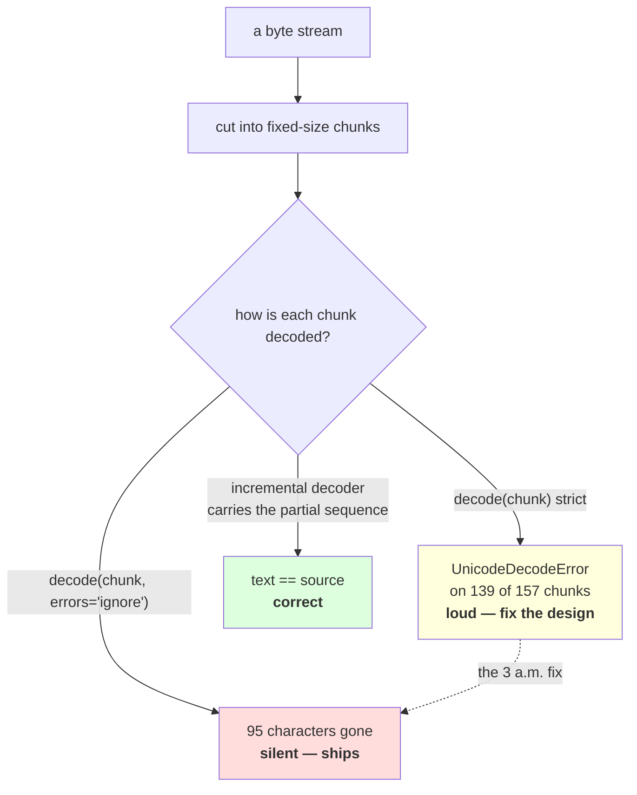

# 2.5 — 💥 The decode that split a character

## One-line answer

Read a byte stream in fixed-size chunks and decode each chunk on its own, and **139 of 157 chunks
raise** on ordinary multilingual text — then "fix" it with `errors="ignore"` and **95 characters vanish
with no exception at all**; the real fix is an incremental decoder that carries the partial sequence
across the boundary, and the trap is that one particular chunk size makes the whole bug disappear.

---

## The story

You paste a long message into a chat app — a paragraph you wrote somewhere else, a few hundred words.

The app has a length limit, so it splits it and sends it as two messages. You watch them arrive: the
first one ends part way through a sentence, the second one picks up from there. That is fine, everybody
has seen that.

Then you look at the join. The word that straddled the split has come out as two half-words, one at the
end of the first message and one at the start of the second. On its own each message looks perfectly
normal. Only at the seam is anything wrong, and only if you look.

Now imagine that instead of showing you both halves, the app had quietly thrown away whichever half was
too short to be a word. You would never see the seam. You would just have a message with a word
missing, and no reason to suspect anything had been dropped.

---

## The idea in plain language

Part [2.3](2.3-self-synchronising.md) showed that a cut in a UTF-8 buffer can land inside a character,
and that you can find your way back to a boundary in at most three steps. This part is what happens in
the code that does not take those three steps.

The pattern is everywhere and it looks completely reasonable:

```
read 64 KB from the file
decode it
process it
repeat
```

Every line of that is sensible on its own. Together they are a bug, because **the chunk boundary is
chosen by the buffer size and the character boundary is chosen by the text**, and nothing makes the two
agree. A chunk that ends mid-character hands the decoder an incomplete sequence, and the decoder — which
is correct — refuses it.

That refusal is the *good* outcome, and it is loud. The bad outcome is what happens next, because a
crash in a data pipeline gets fixed under time pressure, and the two-character fix is `errors="ignore"`.
The exception stops. The pipeline runs. **And every character that straddled a chunk boundary is now
gone**, with no exception, no warning, and no count.

Measured below on 10,000 bytes of ordinary multilingual text: 95 characters lost, out of 5,600. Not a
crash. Not a corruption you can see. A corpus that is quietly 1.7% shorter than the file it came from,
with the missing characters distributed exactly where the chunk boundaries fell.

Three terms, defined before the code:

- A **chunk boundary** is where your reader stops taking bytes. You choose it.
- A **character boundary** is where one code point's bytes end. The text chooses it.
- An **incremental decoder** is a decoder that keeps state between calls: hand it a chunk, it returns
  the complete characters it can and **holds the leftover bytes** until the next chunk arrives. Python
  ships one in the `codecs` module, and it is the correct answer to this entire part.

And then the detail that makes this a `production`-level part rather than a footnote. Measured below,
the same text with a chunk size of 64 splits **60.9%** of boundaries — and with a chunk size of 100 it
splits **none of them, ever.** The test text was built by repeating a 50-byte unit, and 50 divides 100.
A test suite written with that corpus and that chunk size passes with the bug fully present. **This is
Silent Failure #5 from the plan's §6 — evaluated on the format you tested on — arriving in a place
nobody thinks of as an eval.**

---

## Why Akshara needs it

- **Day 14** reads a real corpus. Any reader that does its own byte chunking has this bug; any reader
  that uses text mode with an explicit encoding does not, and knowing which one you wrote is the whole
  point.
- **Day 51 onward**, the pretraining pipeline streams a corpus too large to hold in memory. That is
  exactly the loop above, and a corpus silently 1.7% shorter than its source is a corpus whose
  documented size is wrong.
- **Day 100 onward**, the serving surface streams tokens back to a client as they are produced. A token
  is bytes; a multi-byte character can straddle two tokens; and the same incremental decoder is what
  keeps the streamed text from losing characters at token boundaries.
- **Part [2.4](2.4-256-is-a-vocabulary.md)** argued that the pipeline should hold bytes end to end. This
  part is the discipline that makes that safe: if you must decode, decode incrementally.

---

## The mechanism

A corpus built from literal escapes, so it reproduces exactly with no file on disk:

```python
UNIT = ("hello \u0936\u092c\u094d\u0926 "
        "\U0001F600 caf\u00e9 \u4f60\u597d "
        "\u043f\u0440\u0438\u0432\u0435\u0442 ")
text = UNIT * 200
raw = text.encode("utf-8")
print("  unit bytes    :", len(UNIT.encode("utf-8")))
print("  code points   :", len(text))
print("  utf-8 bytes   :", len(raw))

print("  where do chunk boundaries land?")
for CHUNK in (64, 100, 512, 1024):
    edges = list(range(CHUNK, len(raw), CHUNK))
    mid = sum(1 for i in edges if (raw[i] & 0b1100_0000) == 0b1000_0000)
    print(f"    chunk={CHUNK:>5}: {len(edges):>4} boundaries, {mid:>4} land mid-character "
          f"({mid / len(edges):>6.1%})")
```

**Line by line:**
- `UNIT` mixes five scripts on purpose: ASCII, Devanagari, an emoji, a Latin accent and Cyrillic. A
  corpus of one script would give a misleading answer, and an all-ASCII corpus would give the answer
  zero, which is the most misleading answer of all.
- `UNIT * 200` builds a corpus with a **repeating period**, which is what makes the trap in this part
  visible. Real corpora are not periodic; test corpora very often are, because that is how people make
  them big quickly.
- The boundary test is part [2.3](2.3-self-synchronising.md)'s two-bit check, applied to `raw[i]` — the
  first byte the *next* chunk would start with. If that byte is a continuation byte, the cut is inside a
  character.
- `range(CHUNK, len(raw), CHUNK)` skips offset `0` and the final end-of-buffer, because neither of those
  is a cut between two chunks.
- Measured on Intel Core i3-1115G4 (2 cores / 4 threads), 11.7 GB RAM, Windows 11, CPython 3.12.12, on
  2026-08-26:

```text
  unit bytes    : 50
  code points   : 5600
  utf-8 bytes   : 10000
  where do chunk boundaries land?
    chunk=   64:  156 boundaries,   95 land mid-character ( 60.9%)
    chunk=  100:   99 boundaries,    0 land mid-character (  0.0%)
    chunk=  512:   19 boundaries,   12 land mid-character ( 63.2%)
    chunk= 1024:    9 boundaries,    7 land mid-character ( 77.8%)
```

**Stop on the second row.** Chunk size 100, ninety-nine boundaries, **zero** of them inside a
character. The unit is 50 bytes long and 50 divides 100, so every boundary lands at the same place in
the repeating pattern — a place that happens to be a space. Change one word in the unit and that row
becomes 60% like the others. **A passing test here proves nothing about the code and something about
the corpus.**

Now the three strategies, on the same bytes:

```python
import codecs

CHUNK = 64
n_chunks = (len(raw) + CHUNK - 1) // CHUNK

n_err = 0
for i in range(0, len(raw), CHUNK):
    try:
        raw[i:i + CHUNK].decode("utf-8")
    except UnicodeDecodeError:
        n_err += 1
print(f"    1. strict, per chunk   : {n_err} of {n_chunks} chunks raised")

joined = "".join(raw[i:i + CHUNK].decode("utf-8", errors="ignore")
                 for i in range(0, len(raw), CHUNK))
print(f"    2. errors='ignore'     : no exception, {len(joined)} code points vs {len(text)} "
      f"({len(text) - len(joined)} lost)")
print(f"       joined == text      : {joined == text}")

dec = codecs.getincrementaldecoder("utf-8")()
out = [dec.decode(raw[i:i + CHUNK], final=False) for i in range(0, len(raw), CHUNK)]
out.append(dec.decode(b"", final=True))
print(f"    3. incremental decoder : no exception, joined == text: {''.join(out) == text}")
```

**Line by line:**
- `(len(raw) + CHUNK - 1) // CHUNK` is the ceiling division that counts chunks including a short last
  one. Written out rather than imported because getting it wrong by one is how an off-by-one enters a
  data pipeline.
- Strategy 1 is the honest broken version: decode each chunk alone, strictly. **It raises, loudly, on
  the majority of chunks**, which is exactly what you want a broken design to do.
- Strategy 2 is the fix somebody applies at the end of a long day. `errors="ignore"` never raises, and
  the count printed next to it is the damage.
- Strategy 3 is `codecs.getincrementaldecoder("utf-8")()`, checked against the Python 3.12 `codecs`
  documentation page on 2026-08-26. `dec.decode(chunk, final=False)` returns the characters it can and
  **retains** any trailing incomplete sequence; the final call with `b""` and `final=True` tells it the
  stream is over, so a genuinely truncated file still raises rather than being silently dropped.
- The `final=True` call is not optional and is the most commonly omitted line. Without it, a file whose
  last character is incomplete produces no error and no character — the same silent loss, moved to the
  end of the file.
- Measured on this machine, 2026-08-26:

```text
  chunk=64, three strategies over 157 chunks:
    1. strict, per chunk   : 139 of 157 chunks raised
    2. errors='ignore'     : no exception, 5505 code points vs 5600 (95 lost)
       joined == text      : False
       first lost          : '\u094d' '\xe9' '\u0438' '\U0001f600' '\u597d' '\u0442'
    3. incremental decoder : no exception, joined == text: True
```

Read the list of first-lost characters: a Devanagari virama, an accented Latin letter, a Cyrillic
letter, an emoji, a Chinese character, another Cyrillic letter. **Every single one is non-ASCII, and
the English words are all intact.** That is the shape of this damage — it removes exactly the parts of
the corpus that are hardest to notice missing and hardest to replace.



---

## When it breaks

**The loud failure — the chunk that ended mid-character:**

```console
>>> raw = ("hello \u0936\u092c\u094d\u0926 " * 10).encode("utf-8")
>>> raw[:64].decode("utf-8")
Traceback (most recent call last):
  File "<stdin>", line 1, in <module>
UnicodeDecodeError: 'utf-8' codec can't decode byte 0xe0 in position 63: unexpected end of data
```

What it means: the chunk's last byte, `0xe0`, announced a three-byte Devanagari letter and the chunk
ended immediately after it. **"unexpected end of data" at a position at the end of the buffer is this
bug's signature.** The smallest fix is not to add an error handler; it is to stop decoding chunks
independently.

**The second loud failure — the chunk that started mid-character:**

```console
>>> raw[64:128].decode("utf-8")
Traceback (most recent call last):
  File "<stdin>", line 1, in <module>
UnicodeDecodeError: 'utf-8' codec can't decode byte 0xa4 in position 0: invalid start byte
```

What it means: the *next* chunk begins with the bytes the previous one abandoned — `0xa4` is
`10100100`, a continuation byte, and no valid sequence starts with one. "invalid start byte in position
0" is the other half of the same cut, and seeing both messages together tells you the cut fell between
them rather than that the file is corrupt.

**The silent failure, which is the one that ships.** `errors="ignore"`. Here it is with the damage
counted, verbatim from the run above:

```text
  source                 : 5600 code points, 10000 bytes
  chunked at 64, ignore  : 5505 code points          <- 95 characters gone
  exception raised       : none
  characters lost        : '\u094d' '\xe9' '\u0438' '\U0001f600' '\u597d' '\u0442' ...
  every lost character is non-ASCII. Every English word survived.
  the corpus is now 1.7% shorter than the file it was built from, and nothing recorded that.
```

**The check that catches it,** and it is a byte-count identity rather than an inspection:

```python
import codecs


def decode_stream(chunks, encoding: str = "utf-8") -> str:
    """Decode an iterable of byte chunks correctly, whatever the chunk boundaries are."""
    dec = codecs.getincrementaldecoder(encoding)()
    out = [dec.decode(chunk, final=False) for chunk in chunks]
    out.append(dec.decode(b"", final=True))       # flush: a truncated stream raises here
    return "".join(out)


def assert_no_bytes_lost(source: bytes, decoded: str, encoding: str = "utf-8") -> None:
    """Re-encode and demand the original bytes back. Catches every silent-drop handler."""
    assert decoded.encode(encoding) == source, (
        f"decode lost data: {len(source)} bytes in, "
        f"{len(decoded.encode(encoding))} bytes back out"
    )
```

**Line by line:**
- `decode_stream` takes an **iterable** of chunks rather than a file, so it works for a file reader, a
  socket, an HTTP response and a test list of hand-made chunks — including the pathological ones that
  split every character.
- `final=True` on an empty `bytes` is the flush. It is the line that turns "the file ended half way
  through a character" from silence into an exception, and it is the line people delete because it
  looks redundant.
- `assert_no_bytes_lost` re-encodes and compares **byte for byte**. Comparing code point counts would
  miss a substitution; comparing bytes catches `ignore`, `replace`, `backslashreplace` and a truncated
  flush in one assertion.
- The message prints both byte counts, so a failure tells you *how much* was lost rather than only that
  something was. Ninety-five characters of Devanagari and Cyrillic is a different investigation from
  one byte at the end of the file.
- What this deliberately does not do is accept an `errors` argument. **A function that can be told to
  lose data is a function whose check can be switched off from the call site.**

---

## In production

**What a research engineer writes instead of the teaching version.** For files, they do not chunk bytes
at all: they open in text mode with an explicit encoding and iterate lines, because Python's text-mode
reader already holds an incremental decoder inside it and gets this right. The hand-rolled version is
needed only where text mode is not available — a socket, a streaming HTTP body, a range read from
object storage, a memory-mapped region — and there they reach for `codecs.getincrementaldecoder` rather
than writing the walk-back by hand.

The bigger habit is the one this section has argued for four parts running: **do not decode in the
middle of the pipeline.** Bytes in, bytes hashed, bytes chunked, bytes tokenized. If the decode never
happens, the chunk boundary is not a correctness question at all — it is just an offset, which is why
part [2.4](2.4-256-is-a-vocabulary.md)'s byte vocabulary removes this bug rather than handling it.

**What degrades at scale.** Silence, proportionally. At 10,000 bytes the loss was 95 characters, which
you might notice if you were looking. At corpus scale the same 1.7% is millions of characters and an
utterly invisible fraction of the whole, distributed evenly, with no burst and no anomaly for a
monitoring rule to catch. And the loss is **not random**: it removes only multi-byte characters, so it
systematically thins exactly the non-English portion of the corpus.

**The failure that only shows with real data.** The trap measured above, in reverse. Development
corpora are small, ASCII-heavy, and often synthetic — repeated units, generated fixtures, lorem text.
All three of those hide this bug: ASCII text has no multi-byte characters to split, and periodic text
can align every boundary. The bug appears the first time a real multilingual corpus goes through the
same code, at which point the code has been "working" for months.

**The review comment.** *"This reads the file in 64 KB blocks and decodes each block. That will raise
on any multi-byte character that straddles a block, and if somebody silences it with `errors='ignore'`
we will lose characters without a trace. Use text mode with an explicit encoding, or an incremental
decoder if you need the raw blocks."*

**The interview question.** *"You are streaming a large file and getting `UnicodeDecodeError` about
half the time. What is happening, and what do you change?"* The weak answer is "the file has bad
characters" or "add `errors='ignore'`. The strong answer names the mechanism: **the chunk boundary is
landing inside a multi-byte character, so each chunk is an incomplete sequence — I would use an
incremental decoder that carries the partial bytes across the boundary, and flush it at the end so a
genuinely truncated file still raises.** The follow-up that shows you have been burnt: *and I would not
reach for `errors='ignore'`, because that converts a loud failure into a silent one — on a test I ran
it dropped 95 characters out of 5,600 and every one of them was non-ASCII.*

**Compute tier: T0.** The standard library on a laptop: no packages, no data files, no network. The
corpus is 10,000 bytes built from literal escapes in the script, so **every figure on this page
reproduces exactly on any machine running Python 3**, with no seed, no timing and no dependence on the
Unicode version. What T0 cannot show is the cost of this bug on a real training run — a corpus 1.7%
short with a systematic bias against non-Latin scripts changes a model, and measuring how much needs
runs that Day 51 is the first to make possible.

---

## Check yourself

Run this. It prints **the number of chunks that raise, and then a chunk size where none do**:

```python
import codecs


def fails(chunk: bytes) -> bool:
    try:
        chunk.decode("utf-8")
    except UnicodeDecodeError:
        return True
    return False


UNIT = "hello \u0936\u092c\u094d\u0926 \U0001F600 caf\u00e9 \u4f60\u597d "
text = UNIT * 100
raw = text.encode("utf-8")
unit_bytes = len(UNIT.encode("utf-8"))
print("  unit bytes :", unit_bytes)

for CHUNK in (64, 100, unit_bytes):
    n = sum(1 for i in range(0, len(raw), CHUNK) if fails(raw[i:i + CHUNK]))
    total = (len(raw) + CHUNK - 1) // CHUNK
    print(f"  chunk={CHUNK:>4}: {n:>3} of {total:>3} chunks raise")

lossy = "".join(raw[i:i + 64].decode("utf-8", errors="ignore") for i in range(0, len(raw), 64))
print("  ignore keeps :", len(lossy), "of", len(text), "code points")

dec = codecs.getincrementaldecoder("utf-8")()
ok = "".join([dec.decode(raw[i:i + 64], final=False) for i in range(0, len(raw), 64)]
             + [dec.decode(b"", final=True)])
print("  incremental  :", ok == text)
```

**Line by line:**
- `fails` is defined **before** the loop that calls it, which is not a style point here: the loop runs
  in the module body, so a definition placed below it would raise `NameError` on the first iteration.
- The third chunk size is the unit length itself, so every boundary lands at the same place in the
  repeating pattern. **Say out loud what you expect that row to print before you run it**, then explain
  the result. Measured on this machine, 2026-08-26, it prints:

```text
  unit bytes : 37
  chunk=  64:  43 of  58 chunks raise
  chunk= 100:  26 of  37 chunks raise
  chunk=  37:   0 of 100 chunks raise
  ignore keeps : 2072 of 2100 code points
  incremental  : True
```

- **Zero of a hundred**, at exactly one chunk size, on the same code that fails 43 times at another.
  Say what a CI job pinned to that chunk size would have told you.
- `ignore keeps` prints `2072` against `2100`. Subtract, say what fraction that is, and say what would
  have told you about it in a corpus of a hundred million characters.
- `incremental` prints `True`. Now delete the `final=True` call and run it again; say what changes, and
  say what would change instead if the last character of the text were multi-byte.

**Say this out loud, without scrolling up:** say why decoding fixed-size chunks independently is wrong
even though every chunk is a valid slice of a valid file, name the standard-library object that fixes
it and the one call that must not be omitted, and say why a passing test at one chunk size proves
nothing at another.
