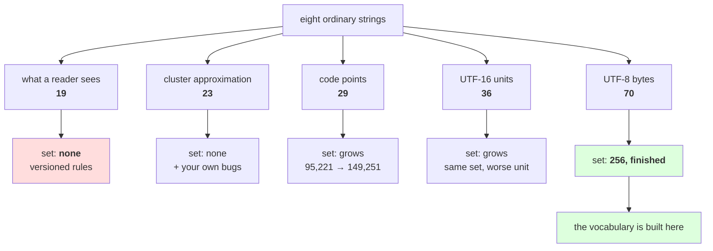

# 3.1 — One string, five layers, one table

## One-line answer

Eight ordinary strings, measured five ways, give five different totals — **19 things a reader sees, 23
cluster-approximations, 29 code points, 36 UTF-16 units and 70 UTF-8 bytes** — and only the last column
is over a set that is finished, which is why it is the one a vocabulary gets built on and the other
four are quantities you must always name the unit of.

---

## The story

A family is planning a function and somebody asks the obvious question: how many are coming?

The person booking the hall says a hundred and twenty, because that is chairs.

The person ordering the food says a hundred and five, because small children share a plate.

The person hiring the bus says a hundred and thirty, because the driver and two helpers need seats too.

The person writing the invitations says thirty-two, because invitations go to households, not people.

Nobody has made a mistake. Four people counted the same event and got four numbers, because each of
them was counting the thing their own job depends on. The argument only starts when somebody writes one
of those numbers down without saying which one it is.

---

## The idea in plain language

This day has named five ways to measure a piece of text, and each of the earlier parts argued for one
of them in isolation. This part puts them side by side, because the comparison is the thing you will
actually use.

The five:

- **What a reader sees** — grapheme clusters, part
  [1.4](../01-code-points-and-graphemes/1.4-graphemes-what-a-person-sees.md). Defined by a versioned
  rule set, not computable with the standard library, and only ever an approximation of perception.
- **The cluster approximation** — the eight-line function from part 1.4, which agreed with a reader on
  six of ten test cases. It is in the table because a hand-rolled approximation is what most codebases
  actually have, and seeing where it disagrees is more useful than pretending it does not exist.
- **Code points** — what `len()` counts, part [1.2](../01-code-points-and-graphemes/1.2-what-len-actually-counts.md).
  Exactly defined, but part [1.3](../01-code-points-and-graphemes/1.3-normalization-one-spelling-for-the-same-thing.md)
  showed the count depends on the normalization form, so this column is really two columns.
- **UTF-16 code units** — what a `.length` in some other languages reports. In the table because a
  service boundary between two languages is where a length limit stops meaning one thing.
- **UTF-8 bytes** — what is in the file, parts [2.1](../02-utf-8-and-bytes/2.1-text-has-to-become-bytes.md)
  to [2.4](../02-utf-8-and-bytes/2.4-256-is-a-vocabulary.md).

Day 9 part [3.1](../../../day-009-the-vocabulary-problem/parts/03-together/3.1-three-tokenizers-one-table.md)
ended with an observation worth reusing here: in a table of trade-offs, **most columns are trades and
one is a gate.** A trade is something you can be worse at and still ship. A gate is something that
disqualifies you.

Here the gate is not a column of the table at all — it is a property of the set behind each column.
Four of these five units are counted over sets that are open, growing or undefined. One is counted over
a set of 256 that was finished before any of this started. That is why part
[2.4](../02-utf-8-and-bytes/2.4-256-is-a-vocabulary.md) ended where it did, and it is the whole answer
to "what does the tokenizer work on?"

Everything else in the table is a trade, and the rule that falls out of it is short: **a number
describing text must carry its unit, or it is not a number.**

---

## Why Akshara needs it

- **Day 11** writes a character tokenizer and must choose a column. This table is the choice, laid out,
  with the consequence of each option visible in one row.
- **Day 12–13** build BPE over characters and then over bytes. The gap between the `cp` and `utf8`
  columns is what the byte version has to overcome with merges, and the gap is 29 against 70 on these
  eight strings.
- **Day 17** measures a tokenizer across scripts. Any figure it reports is per-something, and this part
  is where the habit of naming the something is installed.
- **Day 100 onward**, every limit on the serving surface — prompt length, response length, log field,
  database column — is one of these columns. Getting two components to agree on which one is the whole
  of the work.

---

## The mechanism

Eight strings, chosen so that every disagreement in the day appears at least once:

```python
import unicodedata

RI_START, RI_END = 0x1F1E6, 0x1F1FF


def clusters_v2(s: str) -> int:
    """Part 1.4's approximation: combining marks and joiners attach; regional indicators pair."""
    out, ri = [], 0
    for ch in s:
        cp = ord(ch)
        is_ri = RI_START <= cp <= RI_END
        if out and unicodedata.category(ch) in ("Mn", "Mc", "Me", "Cf"):
            out[-1] += ch
            ri = 0
        elif is_ri and ri % 2 == 1:
            out[-1] += ch
            ri += 1
        else:
            out.append(ch)
            ri = ri + 1 if is_ri else 0
    return len(out)


ROWS = [
    ("plain ASCII",  "cafe",                                                       4),
    ("precomposed",  "caf\u00e9",                                                  4),
    ("decomposed",   "cafe\u0301",                                                 4),
    ("Devanagari",   "\u0936\u092c\u094d\u0926",                                   2),
    ("Chinese",      "\u4f60\u597d",                                               2),
    ("emoji",        "\U0001F600",                                                 1),
    ("flag",         "\U0001F1EE\U0001F1F3",                                       1),
    ("family",       "\U0001F468\u200d\U0001F469\u200d\U0001F467\u200d\U0001F466", 1),
]

print("  unicodedata:", unicodedata.unidata_version)
print(f"  {'row':<13} {'seen':>4} {'v2':>3} {'cp':>3} {'NFC':>4} {'NFD':>4} "
      f"{'utf8':>5} {'utf16':>6} {'ids':>4} {'B/cp':>5}")
for name, s, seen in ROWS:
    b8 = len(s.encode("utf-8"))
    print(f"  {name:<13} {seen:>4} {clusters_v2(s):>3} {len(s):>3} "
          f"{len(unicodedata.normalize('NFC', s)):>4} {len(unicodedata.normalize('NFD', s)):>4} "
          f"{b8:>5} {len(s.encode('utf-16-le')) // 2:>6} {b8:>4} {b8 / len(s):>5.2f}")
```

**Line by line:**
- `clusters_v2` is copied unchanged from part
  [1.4](../01-code-points-and-graphemes/1.4-graphemes-what-a-person-sees.md), including its limits. It
  is not improved here, because the table is meant to show what the approximation does, not to hide it.
- The third element of each row is the **seen** count — what a reader would say — and it is a claim
  about your eyes, not a measurement. Every other column is computed. That distinction is why `seen`
  and `v2` are separate columns rather than one.
- `ids` is the byte-vocabulary token count from part
  [2.4](../02-utf-8-and-bytes/2.4-256-is-a-vocabulary.md), and it equals `utf8` exactly, because a byte
  vocabulary is one token per byte with no merges. It is printed anyway: **on Day 13 that column stops
  matching**, and having it here makes the change visible then.
- `B/cp` is bytes per code point for that row, the per-script cost from part 2.4 measured per string
  instead of per sentence.
- Measured on Intel Core i3-1115G4 (2 cores / 4 threads), 11.7 GB RAM, Windows 11, CPython 3.12.12,
  `unicodedata` 15.0.0, on 2026-08-26:

```text
  unicodedata: 15.0.0
  row           seen  v2  cp  NFC  NFD  utf8  utf16  ids  B/cp
  plain ASCII      4   4   4    4    4     4      4    4  1.00
  precomposed      4   4   4    4    5     5      4    5  1.25
  decomposed       4   4   5    4    5     6      5    6  1.20
  Devanagari       2   3   4    4    4    12      4   12  3.00
  Chinese          2   2   2    2    2     6      2    6  3.00
  emoji            1   1   1    1    1     4      2    4  4.00
  flag             1   1   2    2    2     8      4    8  4.00
  family           1   4   7    7    7    25     11   25  3.57
```

Five things to read off it, in order of how much trouble each one causes.

**Rows two and three are the same word.** `precomposed` and `decomposed` draw identically and disagree
in every computed column except `NFC`. That is part
[1.3](../01-code-points-and-graphemes/1.3-normalization-one-spelling-for-the-same-thing.md)'s whole
subject and part [1.5](../01-code-points-and-graphemes/1.5-the-string-that-was-not-equal-to-itself.md)'s
whole failure, visible as two adjacent lines.

**The `NFC` column makes them agree and the `NFD` column also makes them agree.** Both work; they agree
on different numbers, 4 and 5. Neither is more correct. What is not allowed is one component choosing
`NFC` and another choosing `NFD`.

**The `family` row is the widest disagreement in the day**: 1 seen, 4 by the approximation, 7 code
points, 11 UTF-16 units, 25 bytes. **Five columns, five different numbers, one picture on a screen.**
Any sentence of the form "that emoji is N characters long" is wrong four ways out of five.

**The `flag` row is where the approximation earns its keep** — `v2` says 1 because part 1.4 added the
regional-indicator pairing rule, and the naive version before it said 2. One rule, one row fixed.

**The `Devanagari` row is where it still fails**: `v2` says 3 and a reader sees 2, because a conjunct
formed with a virama draws as one shape and the Unicode 15.0.0 rules do not join it. Part 1.4 cited the
revision that adds `GB9c` for exactly this, and this machine's table predates it.

Now the totals, which are the sentence to remember:

```python
tot = {"seen": 0, "v2": 0, "cp": 0, "utf8": 0, "utf16": 0}
for name, s, seen in ROWS:
    tot["seen"] += seen
    tot["v2"] += clusters_v2(s)
    tot["cp"] += len(s)
    tot["utf8"] += len(s.encode("utf-8"))
    tot["utf16"] += len(s.encode("utf-16-le")) // 2
for k, v in tot.items():
    print(f"    {k:<6}: {v}")
```

**Line by line:**
- The dictionary is initialised with all five keys at zero rather than built with `setdefault`, so the
  printed order is fixed and the output is stable between runs. A summary table whose row order moves is
  a summary table nobody trusts.
- `seen` is accumulated from the hand-written column, so this total inherits that column's status: it
  is a claim, and it is the only one here that is.
- Measured on this machine, 2026-08-26:

```text
    seen  : 19
    v2    : 23
    cp    : 29
    utf8  : 70
    utf16 : 36
```

**Nineteen, twenty-three, twenty-nine, thirty-six, seventy.** Same eight strings. Five totals, and the
largest is 3.7× the smallest. Write down "70" as "the length" and hand it to somebody expecting "19",
and every limit, every truncation and every progress bar downstream is wrong by that factor.



---

## When it breaks

**The loud failure — an approximation handed a string it cannot start on.** Every column in the table
is computed from a function, and one of those functions has a precondition:

```console
>>> clusters_v2("\u0301abc")
4
>>> clusters_v2("")
0
>>> "cafe\u0301"[4:]
'\u0301'
>>> clusters_v2("cafe\u0301"[4:])
1
```

What it means: a string that *begins* with a combining mark gets counted as `4` — the stray mark
becomes a cluster of its own and the three letters follow. That is not a crash, and it is not right
either: no reader looking at the rendered result would say four. The loud version of the same input is
part [1.4](../01-code-points-and-graphemes/1.4-graphemes-what-a-person-sees.md)'s `IndexError`, which
appears when the `if out and` guard is removed. **The guard turns a crash into a wrong number**, which
is the trade this whole day keeps making you look at — and the input that produces it is not exotic, it
is what part [1.2](../01-code-points-and-graphemes/1.2-what-len-actually-counts.md)'s slicing hands you
whenever a cut lands after a letter and before its accent.

**The silent failure, and it is the day's failure in one line.** Every column above is a valid,
correctly computed integer. Nothing here raises. The bug is never in the counting; it is in **writing
one of them down without its name** and letting a second component read it as a different one. The
wrong output is a schema, not a string:

```text
  {"name": "...", "length": 25}      <- which of the five is 25?
  the hall booked 120 chairs for an event where 105 people eat.
  a "20 character" limit that is code points in the form, UTF-16 in the browser and bytes in the column.
```

**The check that catches it** is not a function that computes the right number. It is a type that
refuses to be the wrong one:

```python
from dataclasses import dataclass


@dataclass(frozen=True)
class TextSize:
    """Every length this codebase reports, with its unit attached. There is no `length` field."""

    utf8_bytes: int
    code_points: int
    utf16_units: int
    approx_clusters: int

    def __post_init__(self) -> None:
        assert self.utf8_bytes >= self.code_points, "bytes cannot be fewer than code points"
        assert self.code_points >= self.approx_clusters, "clusters cannot exceed code points"


def measure(s: str) -> TextSize:
    return TextSize(
        utf8_bytes=len(s.encode("utf-8")),
        code_points=len(s),
        utf16_units=len(s.encode("utf-16-le")) // 2,
        approx_clusters=clusters_v2(s),
    )
```

**Line by line:**
- `@dataclass(frozen=True)` makes the value immutable and hashable, so a size can be recorded in a run
  config and hashed with it — Day 9 part 2.3's argument about artefacts carrying their own identity,
  applied to a measurement.
- **There is no field called `length`.** That is the entire design. A caller who wants a number must
  name which one, at the call site, where the choice is visible in a review.
- `approx_clusters`, not `graphemes`. The name states that it is the six-of-ten approximation from part
  1.4 and not a UAX #29 implementation. **A field name is a promise**, and this one keeps a smaller
  promise on purpose.
- The two assertions in `__post_init__` are invariants that hold for every string in any encoding of
  Unicode: UTF-8 uses at least one byte per code point, and a cluster is at least one code point. They
  are cheap and they catch a whole class of transcription error — a size object built by hand in a test
  with two fields swapped fails immediately.
- Note which invariant is **absent**: there is no assertion relating `utf16_units` to `code_points`,
  because the relationship goes both ways — a code point above `U+FFFF` is two UTF-16 units, so
  `utf16_units` can exceed `code_points`, while for the emoji row `utf16_units` (2) is greater than
  `code_points` (1) and for ASCII they are equal. **An invariant you have not checked against the table
  is a guess.**

---

## In production

**What a research engineer writes instead of the teaching version.** They do not carry a `TextSize`
object around; they carry the *habit* it encodes, which shows up as variable names. `n_bytes`,
`n_tokens`, `n_chars`, `prompt_bytes`, `max_new_tokens`. Never `length`, never `size`, never `count` on
its own. The naming is the whole defence, and it costs nothing.

The second habit is that **the pipeline standardises on one unit and converts only at the edges.**
Bytes end to end, per part [2.4](../02-utf-8-and-bytes/2.4-256-is-a-vocabulary.md); grapheme-aware
handling only at the cursor and the display; code points only inside functions that genuinely inspect
characters, such as the normalizer. Three units, three clearly bounded regions, and no arithmetic that
crosses between them without a conversion that is written down.

**What degrades at scale.** Cross-service disagreement, and it degrades with *team* size rather than
data size. Two services written by two people with two default units produce limits that agree on
ASCII and diverge on everything else, so the disagreement is invisible in every test and appears only
for users whose text is not English. Nothing in this table changes as the data grows; what changes is
the number of places somebody could have written `length`.

**The failure that only shows with real data.** Every row of the table below the first. `plain ASCII`
is the only row where all five columns agree, and it is the row every test fixture is made of. The
other seven rows are ordinary text for a very large number of people and absent from most test suites,
which is Silent Failure #5 from the plan's §6 — evaluated on the format you trained on — restated as a
property of your fixtures rather than your eval set.

**The review comment.** *"This DTO has a `length` field. Which of the five is it? Rename it to
`utf8_bytes` if it is protecting the column, or `code_points` if it is what the tokenizer will see, and
then check that the browser sending it is measuring the same thing — it will be sending UTF-16 units."*

**The interview question.** *"How long is this string?"* — with an emoji on the whiteboard. The weak
answer is a number. The strong answer is: **that has at least five answers and they disagree by up to
3.7× on ordinary text; tell me whether you are protecting a database column, drawing a progress bar,
budgeting a context window or writing an error message for a person, and I will tell you which one you
want.** Then the part that shows judgement: *and whichever it is, the field gets named after the unit,
because the bug is never in the counting — it is in a number crossing a boundary without its name.*

**Compute tier: T0.** The standard library on a laptop: no packages, no data files, no network. Every
computed column is exact under `unicodedata` 15.0.0 and reproduces on any machine with that version;
the `utf8`, `utf16` and `ids` columns do not depend on the Unicode version at all. The `seen` column is
**not** a measurement and the part says so twice — it is a claim about what a reader perceives, it
depends on your font and renderer, and the honest thing to do is check it against your own screen and
record any row where you disagree. What T0 cannot settle is whether a byte vocabulary trains a better
model than a character vocabulary; that is Day 17, and this day only narrows the field.

---

## Check yourself

Run this. It prints **five totals for the same eight strings**:

```python
import unicodedata

ROWS = ["cafe", "caf\u00e9", "cafe\u0301", "\u0936\u092c\u094d\u0926", "\u4f60\u597d",
        "\U0001F600", "\U0001F1EE\U0001F1F3",
        "\U0001F468\u200d\U0001F469\u200d\U0001F467\u200d\U0001F466"]

print("  unicodedata :", unicodedata.unidata_version)
print("  code points :", sum(len(s) for s in ROWS))
print("  NFC total   :", sum(len(unicodedata.normalize("NFC", s)) for s in ROWS))
print("  NFD total   :", sum(len(unicodedata.normalize("NFD", s)) for s in ROWS))
print("  utf-16 units:", sum(len(s.encode("utf-16-le")) // 2 for s in ROWS))
print("  utf-8 bytes :", sum(len(s.encode("utf-8")) for s in ROWS))
print("  a reader sees: 19")
print("  largest / smallest ratio:",
      f"{sum(len(s.encode('utf-8')) for s in ROWS) / 19:.2f}")
```

**Line by line:**
- The `code points` total prints `29` and the `utf-8 bytes` total prints `70`. **Say out loud which of
  those two a context-window budget should use, and which one a `VARCHAR` limit should use.**
- The `NFC` and `NFD` totals differ. Say by how much, say which two rows cause the difference, and say
  what would happen if one service normalized one way and the next service the other.
- The ratio prints about `3.68`. Say what that means for a limit written as a bare number and read by
  two components that picked different columns.
- Now add one more string of your own — a name in a script you use — and say, before running it, which
  column will grow fastest. Then run it and see whether you were right.

**Say this out loud, without scrolling up:** name the five units this day measured, say which one is
over a set that is finished and why that makes it the vocabulary's unit, and state the one naming rule
that prevents every bug in this part.
