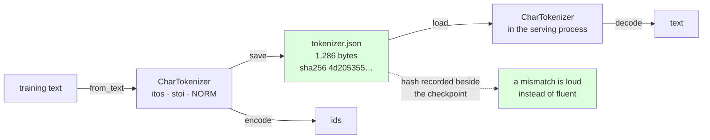

# 1.1 — From a script to a module

## One-line answer

Day 9's nine-line tokenizer and today's `CharTokenizer` class do exactly the same arithmetic; the
difference is that the class **can be saved, reloaded and hashed**, which is what turns a table living
inside one script's memory into an artifact two separate programs can agree on.

---

## The story

A tea stall has one person running it, and that person knows every price. Tea five rupees, tea with
extra milk seven, biscuits three, the big packet twenty.

Nothing is written down anywhere and nothing needs to be. One head, one till, no disagreements.

Then a second person starts helping in the mornings. On the third day a customer buys tea and biscuits
and is charged nine rupees, and the next morning the same order costs eight. Neither person did
anything wrong. One of them remembered the biscuits as four and the other as three.

So the prices go up on the wall, in one place, with the date they were last changed. Now there is one
list, both people read the same list, and if somebody changes a price everybody can see that it
changed and when.

The prices did not get better. They got **written down**, and that is a different kind of improvement.

---

## The idea in plain language

Day 9 part
[2.1](../../../day-009-the-vocabulary-problem/parts/02-what-a-tokenizer-is/2.1-a-function-and-its-inverse.md)
built a working tokenizer in nine lines: a sorted list of characters, two dictionaries, and two
functions. Everything in it was correct. Today it becomes a module, and it is worth being precise about
what that adds, because "make it a class" is not by itself a reason to do anything.

The nine-line version has one property that makes it unusable outside a single script: **the table
exists only while that script is running.** Encode in one program and decode in another and there is
nothing connecting the two except the hope that both ran `sorted(set(text))` over the same text. Day 9
part [2.3](../../../day-009-the-vocabulary-problem/parts/02-what-a-tokenizer-is/2.3-the-tokenizer-is-not-part-of-the-model.md)
already established why that hope is misplaced, and Day 9 part
[2.5](../../../day-009-the-vocabulary-problem/parts/02-what-a-tokenizer-is/2.5-the-tokenizer-that-did-not-match.md)
measured what it costs.

So today's module adds exactly four things, and each one has a reason:

- **`save` and `load`.** The table becomes a file. Training writes it once; serving reads it. Neither
  recomputes it, so neither can compute it differently.
- **A hash.** One short string that identifies the table's *contents*. A checkpoint can record it, and a
  mismatch at load time is a loud failure instead of Day 9's fluent nonsense.
- **A declared normalization form.** Day 10 part
  [1.3](../../../day-010-unicode-code-points-bytes/parts/01-code-points-and-graphemes/1.3-normalization-one-spelling-for-the-same-thing.md)
  showed that the same text has more than one spelling and that a table built over one spelling raises
  on the other. The form is now a property of the tokenizer, stored in its file, applied by `encode`.
  It is not a step somebody remembers to do first.
- **One place for the invariant.** `stoi` and `itos` are built from each other inside `__init__`, so
  they cannot be edited apart.

Two terms, defined here because the rest of the day leans on them. An **artifact** is a file that a
run produces and a later run consumes — the tokenizer file, the checkpoint, the config. A **contract**
is the property that must hold for the artifact to be usable: for a tokenizer it is
`decode(encode(s)) == s`, and Day 9 part 2.1 is where that was established.

What today does *not* change: the ids. Measured below, `"Overfit one batch"` encodes to exactly the
same seventeen numbers Day 9 printed. **If wrapping code in a class changes its output, the wrapping
introduced a bug** — and checking that is the first thing this part does.

---

## Why Akshara needs it

- **Part [1.5](1.5-the-character-tokenizer-that-met-a-new-alphabet.md)** breaks this tokenizer on
  purpose, and the break is only legible because the table is a file with a hash rather than a variable.
- **Section 2** builds a word-level tokenizer with the same shape, so the two can be compared column by
  column in part [3.1](../03-together/3.1-two-tokenizers-one-table.md). Two classes with one interface
  is the reason that comparison is possible at all.
- **Day 12–13** replace the table with a learned merge table. The `save`/`load`/`sha256` surface does
  not change, which is the point: the *artifact* is stable even though the algorithm inside it is not.
- **Day 51 onward**, the pretraining run records the tokenizer hash in `docs/RUNS.md` beside the config
  hash. A run whose tokenizer cannot be identified is a run that cannot be reproduced.

---

## The mechanism

The whole module. Nothing here is new arithmetic — compare it line for line with Day 9 part 2.1:

```python
import hashlib
import json
import unicodedata
from pathlib import Path


class CharTokenizer:
    """A tokenizer over code points. The table is the artifact; everything else is arithmetic."""

    NORM = "NFC"

    def __init__(self, chars: list[str]) -> None:
        self.itos = list(chars)
        self.stoi = {ch: i for i, ch in enumerate(self.itos)}

    @classmethod
    def from_text(cls, text: str) -> "CharTokenizer":
        return cls(sorted(set(unicodedata.normalize(cls.NORM, text))))

    def __len__(self) -> int:
        return len(self.itos)

    def encode(self, s: str) -> list[int]:
        return [self.stoi[ch] for ch in unicodedata.normalize(self.NORM, s)]

    def decode(self, ids: list[int]) -> str:
        return "".join(self.itos[i] for i in ids)
```

**Line by line:**
- `NORM = "NFC"` is a **class attribute**, not an argument with a default. Day 10 part
  [1.3](../../../day-010-unicode-code-points-bytes/parts/01-code-points-and-graphemes/1.3-normalization-one-spelling-for-the-same-thing.md)
  argued for exactly this: one place to be wrong, and no call site that can quietly pass a different
  form.
- `self.itos` is a **list**, not a dict. Day 9 used `{i: ch}`; a list does the same job, because the ids
  are `0..V-1` with no gaps by construction. `itos[i]` is then an array index rather than a hash lookup,
  and the list *is* the serialisable form — which is why `save` has nothing to convert.
- `self.stoi` is built **from** `self.itos` in the same statement block, so the two directions cannot
  drift apart. This is Day 9 part 2.1's point, moved from a comment into the structure.
- `from_text` applies the normalization **before** `set`, so the table is over normalized characters.
  Doing it after would build a table containing both spellings, which is precisely the 17-versus-16
  vocabulary Day 10 part
  [1.5](../../../day-010-unicode-code-points-bytes/parts/01-code-points-and-graphemes/1.5-the-string-that-was-not-equal-to-itself.md)
  measured.
- `encode` normalizes too, with the same constant. **Both sides of the round trip go through the same
  call**, which is the check that part 1.5 of Day 10 wrote as a function, now enforced by construction.
- `encode` still raises `KeyError` on an unknown character. That is unchanged from Day 9 and it is
  deliberate; part [1.4](1.4-the-unknown-character-policy.md) is the whole argument about it.

Now the three additions that make it an artifact:

```python
    def save(self, path: Path) -> None:
        path.write_text(
            json.dumps({"norm": self.NORM, "itos": self.itos}, ensure_ascii=True, sort_keys=True),
            encoding="utf-8",
        )

    @classmethod
    def load(cls, path: Path) -> "CharTokenizer":
        blob = json.loads(path.read_text(encoding="utf-8"))
        assert blob["norm"] == cls.NORM, f"tokenizer was built with {blob['norm']}, not {cls.NORM}"
        return cls(blob["itos"])

    @property
    def sha256(self) -> str:
        payload = json.dumps({"norm": self.NORM, "itos": self.itos},
                             ensure_ascii=True, sort_keys=True)
        return hashlib.sha256(payload.encode("utf-8")).hexdigest()
```

**Line by line:**
- `ensure_ascii=True` writes every non-ASCII character as a `\uXXXX` escape inside the JSON. That is
  Day 10 part
  [1.1](../../../day-010-unicode-code-points-bytes/parts/01-code-points-and-graphemes/1.1-a-character-is-three-different-things.md)'s
  rule applied to a data file: **the two spellings of an accented letter are the same pixels**, so a
  tokenizer file written with literal characters cannot be reviewed, diffed or grepped reliably. It
  also makes the file pure ASCII, which removes the encoding question from every tool that touches it.
- `sort_keys=True` makes the byte output depend only on the contents, not on the order the dict happened
  to be built in. Without it the hash is unstable and the whole point of having one is lost — Day 9 part
  2.3 measured that.
- `encoding="utf-8"` on both `write_text` and `read_text`, explicitly, per Day 10 part
  [2.1](../../../day-010-unicode-code-points-bytes/parts/02-utf-8-and-bytes/2.1-text-has-to-become-bytes.md).
  On this machine the default is `cp1252`, so omitting it makes the file readable on the machine that
  wrote it and not on the machine that reads it.
- The `assert` in `load` is the **normalization mismatch check**, at the only moment it can be made
  cheaply. A file built under `NFD` loaded by a class expecting `NFC` fails here, loudly, instead of
  producing `KeyError`s later on text that looks fine.
- `sha256` rebuilds the same payload rather than hashing `self.itos` directly, so **the hash covers the
  normalization form as well as the characters.** Two tables with identical characters and different
  forms must not hash the same — that is exactly the pair Day 10 part 1.5 measured at 16 entries each
  with different hashes.
- `sha256` is a `@property` computed on demand rather than stored, so it cannot go stale if somebody
  mutates the table. A cached hash that no longer describes its object is worse than no hash.

Run it against the corpus:

```python
import hashlib
from pathlib import Path

raw = Path("docs/00_MASTER_PLAN.md").read_bytes()
text = raw.decode("utf-8")
print("  corpus sha256[:16] :", hashlib.sha256(raw).hexdigest()[:16])

tok = CharTokenizer.from_text(text)
print("  V                  :", len(tok))
print("  round trip corpus  :", tok.decode(tok.encode(text)) == text)
print("  tokenizer sha256[:16]:", tok.sha256[:16])

probe = "Overfit one batch"
print("  ids                :", tok.encode(probe))
print("  back               :", repr(tok.decode(tok.encode(probe))))

out = Path("_tok_demo.json")
tok.save(out)
print("  saved bytes        :", out.stat().st_size)
again = CharTokenizer.load(out)
print("  reloaded V         :", len(again))
print("  hashes match       :", again.sha256 == tok.sha256)
print("  first 40 of file   :", out.read_text(encoding="utf-8")[:40])
out.unlink()
```

**Line by line:**
- **The corpus hash is printed first, and this is not decoration.** Every number in this day is measured
  over one revision of one file, and that file is edited as this curriculum grows. If your corpus hash
  differs from the one below, your numbers *should* differ, and you will know immediately rather than
  wondering. This is Day 10's provenance lesson applied to Day 11's inputs.
- `tok.decode(tok.encode(text)) == text` runs the contract over **the entire corpus**, not a probe
  string. Day 9 made this argument; it is repeated here because the class is new code and the contract
  is the only thing that proves the rewrite did not change behaviour.
- `again.sha256 == tok.sha256` is the save/load round trip. Two objects, one built from text and one
  from a file, must be indistinguishable — and the hash is how you say that in one line.
- Measured on Intel Core i3-1115G4 (2 cores / 4 threads), 11.7 GB RAM, Windows 11, CPython 3.12.12,
  `unicodedata` 15.0.0, on 2026-08-26:

```text
  corpus sha256[:16] : 9760f2b6d4340b97
  V                  : 151
  round trip corpus  : True
  tokenizer sha256[:16]: 4d20535546f6d918
  ids                : [47, 84, 67, 80, 68, 71, 82, 1, 77, 76, 67, 1, 64, 63, 82, 65, 70]
  back               : 'Overfit one batch'
  saved bytes        : 1286
  reloaded V         : 151
  hashes match       : True
  first 40 of file   : {"itos": ["\n", " ", "\"", "#", "$", "%"
```

Two things to notice.

**The ids are identical to Day 9's.** `[47, 84, 67, 80, …]` is exactly what the nine-line version
printed. The class changed the packaging and not one number, which is the only acceptable outcome of a
refactor and the reason to check rather than assume.

**The whole tokenizer is 1,286 bytes.** That is the entire artifact — 151 characters and a
normalization form. Day 9 part 2.3 made the point that a tokenizer is tiny compared with a checkpoint
and yet nothing works without it; here is the number.



---

## When it breaks

**The loud failure — a table built under one normalization form, loaded by a class expecting another:**

```console
>>> import json, pathlib
>>> pathlib.Path("_bad.json").write_text(json.dumps({"norm": "NFD", "itos": ["a", "b"]}))
35
>>> CharTokenizer.load(pathlib.Path("_bad.json"))
Traceback (most recent call last):
  File "<stdin>", line 1, in <module>
  File "<stdin>", line 4, in load
AssertionError: tokenizer was built with NFD, not NFC
```

What it means: the file and the code disagree about how text is spelled before it is looked up. The
smallest fix is to rebuild the table with the form the code expects. **The value of this assertion is
where it fires** — at load, once, before any text is encoded — rather than as a `KeyError` on the first
accented word an hour into a job.

**The second loud failure — mutating the table and expecting the hash to follow.** It does, because the
hash is a property, and that is the behaviour you want:

```console
>>> tok = CharTokenizer(["a", "b"])
>>> before = tok.sha256[:16]
>>> tok.itos.append("c")
>>> before == tok.sha256[:16]
False
```

What it means: the hash describes the object *now*. What it does **not** do is fix `stoi`, which still
has two entries — so after that append the object is internally inconsistent and `encode("c")` raises
`KeyError`. The lesson is that the class is not defended against mutation, and the honest response is
to treat it as read-only after construction rather than to add locks.

**The silent failure, and it is the one this part exists to remove.** Two programs, each calling
`sorted(set(text))` on "the corpus", where one of them read the file with a different encoding, or a
newer revision, or applied `.strip()` first. Both produce a table. Both encode without error. The ids
mean different things. The wrong output looks like Day 9 part 2.5's, and nothing inside the model can
see it:

```text
  process A: builds a table from the corpus        -> V = 151, sha 4d205355…
  process B: builds a table from the corpus + one new paragraph -> V = 152, sha (different)
  both encode without error; ids above the inserted character are all shifted by one
  the model receives valid ids, in range, of the right length, meaning different characters.
```

**The check that catches it** is one line in each of two places, and it only works because `sha256`
exists:

```python
def save_run_metadata(path: Path, tok: CharTokenizer, config_hash: str) -> None:
    """Record what a run was trained with. Written once, at the start of training."""
    path.write_text(
        json.dumps({"tokenizer_sha256": tok.sha256, "config_sha256": config_hash},
                   sort_keys=True),
        encoding="utf-8",
    )


def assert_tokenizer_matches(meta_path: Path, tok: CharTokenizer) -> None:
    """Run this at load time in the serving process, before the first request."""
    expected = json.loads(meta_path.read_text(encoding="utf-8"))["tokenizer_sha256"]
    assert tok.sha256 == expected, (
        f"tokenizer mismatch: serving has {tok.sha256[:16]}, "
        f"the checkpoint was trained with {expected[:16]}"
    )
```

**Line by line:**
- The metadata is written **at the start of training**, not at the end, so a run that crashes half way
  still leaves behind the record of what it was using.
- `assert_tokenizer_matches` runs **before the first request**, not per request. It is a startup check,
  it costs one hash of 1,286 bytes, and it converts the worst failure in this phase into a process that
  refuses to start.
- The message prints both short hashes rather than saying `False`. When this fires at three in the
  morning, the two prefixes are what let you find which artifact is the odd one out.
- What this does **not** do is verify that the *model* matches either — a checkpoint and a tokenizer are
  two files and neither validates the other, which is Day 9 part 2.3's argument. This check ties the
  tokenizer to a record; something still has to tie that record to the weights, and that is the config
  hash sitting next to it.

---

## In production

**What a research engineer writes instead of the teaching version.** They do not write this class at
all, because a real tokenizer library already serialises itself — Day 14 opens one and compares. What
survives from this part is the *discipline*: the tokenizer is a file, the file has a hash, the hash is
recorded next to the checkpoint, and the serving process checks it at startup. Teams that skip the last
step find out about it through a support ticket describing fluent, confident, wrong answers.

The second habit is that **the tokenizer file is committed and the weights are not** (Principle 9). It
is 1,286 bytes here and a few megabytes for a real vocabulary, it is the thing that makes a checkpoint
interpretable, and it belongs in version control where its changes show up in a diff.

**What degrades at scale.** Nothing about this class — the table is small and the lookups are `O(1)`.
What degrades is the *process* around it. With one person and one script, recomputing the table is
harmless. With three services, two clusters and a year of history, "the corpus" stops being a
well-defined phrase, and the only thing that survives is the file and its hash.

**The failure that only shows with real data.** A table rebuilt from a corpus that grew. Add documents,
rerun `from_text`, and a single new character inserts itself into the sorted order, shifting every id
above it. The new table is correct, the old checkpoint is now wrong, and **the vocabulary size barely
changes** — 151 to 152 — so every size check still passes. That is Day 10 part 1.5's "same size,
different table", arriving through a completely different door.

**The review comment.** *"This rebuilds the tokenizer from the corpus at serving startup. That is a
different table from the one training used the moment the corpus changes — load the saved file and
assert its hash against the checkpoint's metadata instead."*

**The interview question.** *"What do you ship alongside model weights?"* The weak answer is "the
config". The strong answer names the tokenizer and says why: **the weights are meaningless without the
exact table that produced their training ids, nothing in the model can detect a mismatch because every
id is in range and every shape matches, so the tokenizer file ships with the weights and its hash is
recorded in the run metadata and checked at startup.** The follow-up that shows you have used it: *and
the tokenizer is the small file — mine was 1,286 bytes against a checkpoint of megabytes — which is
exactly why people forget it.*

**Compute tier: T0.** The standard library on a laptop, over a 113,283-byte file already in this
repository. No packages, no network, no GPU. Every number here is exact and reproduces for anyone whose
corpus hash matches `9760f2b6d4340b97`; if yours differs, the file has been edited since this day was
written and **your numbers are the correct ones for your copy**. There is no seed and no timing
anywhere in this part.

---

## Check yourself

Run this. It prints **a vocabulary size, a hash, and a round trip over the whole corpus**:

```python
import hashlib
from pathlib import Path

raw = Path("docs/00_MASTER_PLAN.md").read_bytes()
text = raw.decode("utf-8")

tok = CharTokenizer.from_text(text)
print("  corpus sha256[:16] :", hashlib.sha256(raw).hexdigest()[:16])
print("  V                  :", len(tok))
print("  tokenizer sha[:16] :", tok.sha256[:16])
print("  round trip corpus  :", tok.decode(tok.encode(text)) == text)
print("  ids for 'batch'    :", tok.encode("batch"))

shorter = CharTokenizer.from_text(text[:1000])
print("  V from 1000 chars  :", len(shorter))
print("  same hash?         :", shorter.sha256 == tok.sha256)
print("  'batch' ids agree? :", shorter.encode("batch") == tok.encode("batch"))
```

**Line by line:**
- The corpus hash line comes first so you can compare it with `9760f2b6d4340b97`. **Say out loud what
  it means if yours is different, and whether that makes this document wrong.**
- `round trip corpus` prints `True`. Say what it would take for that to print `False`, and name two
  one-word edits to `encode` that would do it.
- The last three lines build a second tokenizer from the first 1,000 characters only. It has a smaller
  `V`, a different hash, and — say this before you run it — **decide whether you expect `'batch'` to get
  the same ids from both.** Then run it and explain the answer.
- Now save both tokenizers to two files and diff them. Say which lines differ and why the ids of
  characters *after* the missing ones all moved.

**Say this out loud, without scrolling up:** name the four things the class adds over Day 9's nine
lines, say which one of them turns Day 9's worst failure from silent into loud, and say why the ids in
this part are identical to Day 9's.
