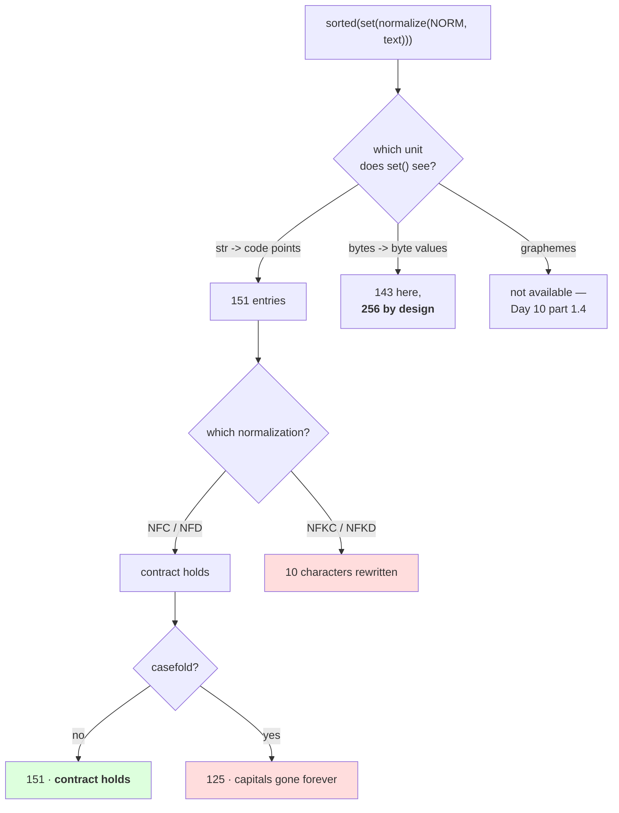

# 1.2 — What counts as a character, decided in code

## One-line answer

"Character-level" names five different tokenizers, and the choice between them is one line in
`from_text`: measured on the same corpus, the vocabulary is **151** over code points, **149** under
`NFKC`, **125** casefolded and **143** distinct byte values — and only one of those choices keeps
`decode(encode(s)) == s`.

---

## The story

Somebody asks you to count how many different things are on the shelf in a shop.

You say six: rice, oil, salt, sugar, tea, soap.

They say no, look properly — there are two sizes of rice and three of oil, so it is eleven.

Somebody else says that is silly, rice is rice whatever the packet size, and there are really only
four things, because tea and soap came in the same delivery and go on the same shelf.

Three people, one shelf, three honest answers. The shelf did not change. What changed is what each
person decided counts as "a different thing", and nobody said out loud which rule they were using
before they started counting.

---

## The idea in plain language

Day 10 part [3.1](../../../day-010-unicode-code-points-bytes/parts/03-together/3.1-one-string-five-layers.md)
ended with five ways to measure text and one rule: **a number describing text must carry its unit.**
This part is that rule arriving at a line of code you have to actually write.

`CharTokenizer.from_text` contains this:

```
sorted(set(unicodedata.normalize(cls.NORM, text)))
```

Every part of that line is a decision, and each one produces a different tokenizer:

- **`set` over a `str`** iterates **code points**. That is the decision to be a code-point tokenizer
  rather than a grapheme tokenizer. Day 10 part
  [1.4](../../../day-010-unicode-code-points-bytes/parts/01-code-points-and-graphemes/1.4-graphemes-what-a-person-sees.md)
  explains why the grapheme option is not on the table: the standard library cannot compute one, and the
  rule set is versioned.
- **`normalize(NORM, …)`** picks which spelling. Day 10 part
  [1.3](../../../day-010-unicode-code-points-bytes/parts/01-code-points-and-graphemes/1.3-normalization-one-spelling-for-the-same-thing.md)
  showed the four forms; two are safe to store and two destroy information.
- **`sorted`** fixes the id order. Day 9 part
  [2.5](../../../day-009-the-vocabulary-problem/parts/02-what-a-tokenizer-is/2.5-the-tokenizer-that-did-not-match.md)
  is what happens without it.
- **What is *not* there** is a `.casefold()` or a `.lower()`, and its absence is a decision too.

The test that separates the good choices from the bad ones is the tokenizer's only contract:
`decode(encode(s)) == s`. Two of the five options below fail it, and they fail it *silently* — encoding
succeeds, decoding succeeds, and what comes out is not what went in.

Here is the reasoning in one sentence, and it is the whole of this part: **a tokenizer may only apply
transformations it can undo.** Normalizing `NFC` is undoable in the sense that matters — the text means
the same thing, and Day 10 measured that `NFC` and `NFD` convert into one another losslessly. Casefolding
is not: once `The` and `the` are the same token, nothing downstream can tell you which one the user
wrote. Neither is `NFKC`, which Day 10 measured turning one character into three.

The last option in the table is the interesting one. Measured below, this corpus contains **143 distinct
byte values** — fewer than the 151 code points. That looks like byte-level wins on vocabulary size, and
it is a trap: the byte vocabulary is **256 by design regardless of the corpus** (Day 10 part
[2.4](../../../day-010-unicode-code-points-bytes/parts/02-utf-8-and-bytes/2.4-256-is-a-vocabulary.md)),
because its job is to handle input the corpus never contained. A byte table sized from a corpus is a
character table wearing a disguise, and it has the same coverage failure part
[1.5](1.5-the-character-tokenizer-that-met-a-new-alphabet.md) demonstrates.

---

## Why Akshara needs it

- **Part [1.4](1.4-the-unknown-character-policy.md)** asks what happens to a character the table does
  not contain. This part is where the size of that table gets decided, and a casefolded table has 26
  fewer ways to be surprised and one guaranteed way to be wrong.
- **Part [1.5](1.5-the-character-tokenizer-that-met-a-new-alphabet.md)** measures the coverage failure.
  The 151 characters counted here are 0.101% of assigned Unicode, and that fraction is the failure's
  size.
- **Day 12–13**'s BPE starts from a base alphabet and merges upward. Whether that base is 151
  corpus characters or 256 bytes is exactly this decision, made once, and Day 13 is where it is made
  again with the other answer.
- **Day 16** adds special tokens to a vocabulary. Adding `<bos>` to a 151-entry table is arithmetic;
  adding it to a table whose entries depend on a `.casefold()` somebody added later is a bug hunt.

---

## The mechanism

Count the same corpus five ways. The measurement is trivial; the point is that the answers differ:

```python
import hashlib
import unicodedata
from pathlib import Path

raw = Path("docs/00_MASTER_PLAN.md").read_bytes()
text = raw.decode("utf-8")
print("  corpus sha256[:16] :", hashlib.sha256(raw).hexdigest()[:16])
print("  code points        :", len(text))

defs = {
    "raw code points": text,
    "NFC":             unicodedata.normalize("NFC", text),
    "NFD":             unicodedata.normalize("NFD", text),
    "NFKC":            unicodedata.normalize("NFKC", text),
    "casefolded NFC":  unicodedata.normalize("NFC", text).casefold(),
}
for name, t in defs.items():
    print(f"    {name:<16} V = {len(set(t)):>4}   tokens = {len(t):>7}")
print(f"    {'utf-8 bytes':<16} V = {len(set(raw)):>4}   tokens = {len(raw):>7}")
```

**Line by line:**
- The corpus hash is printed first, for the reason part [1.1](1.1-from-a-script-to-a-module.md) gave:
  every number below belongs to one revision of one file, and a different hash means different numbers.
- `set(t)` counts **types** and `len(t)` counts **tokens**. Both are printed for every row because a
  vocabulary choice moves them independently — casefolding changes the types and not the tokens, `NFKC`
  changes both.
- `set(raw)` over a `bytes` object yields **integers**, so this counts distinct byte values. It is the
  same census Day 10 part 2.2 ran over all of Unicode, narrowed to one file.
- Measured on Intel Core i3-1115G4 (2 cores / 4 threads), 11.7 GB RAM, Windows 11, CPython 3.12.12,
  `unicodedata` 15.0.0, on 2026-08-26:

```text
  corpus sha256[:16] : 9760f2b6d4340b97
  code points        : 110837
    raw code points  V =  151   tokens =  110837
    NFC              V =  151   tokens =  110837
    NFD              V =  151   tokens =  110837
    NFKC             V =  149   tokens =  110847
    casefolded NFC   V =  125   tokens =  110837
    utf-8 bytes      V =  143   tokens =  113283
```

Four observations, and the third one is the one people get wrong.

**`NFC` and `NFD` agree, at 151, and neither changes the token count.** That is a property of *this
corpus*, not of normalization, and it is worth chasing down rather than filing away — measured below,
no character in this corpus has a canonical decomposition at all.

**`NFKC` removes two entries and adds ten tokens.** Two characters are rewritten: a superscript two
becomes an ordinary `2`, and a single-character ellipsis becomes three full stops. The ellipsis appears
five times, so five characters become fifteen. **That is ten characters of the user's text replaced by
different characters**, and no later stage can tell.

**Casefolding removes 26 entries** — the capital letters — and it is the option that looks most
attractive, because a 17% smaller vocabulary is a real saving. It is also the option that breaks the
contract outright, measured below.

**Byte level shows 143 here, and that number is a distraction.** It is smaller than 151 for a reason
that has nothing to do with the merits: this corpus's non-ASCII characters are multi-byte, so they
contribute their *bytes* rather than themselves, and many of those byte values repeat across
characters. The real byte vocabulary is 256 whatever the corpus says.

Now check which of these choices you are allowed to make. The tokenizer's contract is one line:

```python
import unicodedata


def survives_round_trip(text: str, transform) -> bool:
    """Can the tokenizer put back what it took in, after this transform?"""
    return transform(text) == text


CHOICES = {
    "NFC":            lambda s: unicodedata.normalize("NFC", s),
    "NFD":            lambda s: unicodedata.normalize("NFD", s),
    "NFKC":           lambda s: unicodedata.normalize("NFKC", s),
    "casefold":       lambda s: s.casefold(),
    "strip":          lambda s: s.strip(),
}

probe = "The Plan\u00b2 says\u2026 Overfit one batch.  "
for name, fn in CHOICES.items():
    ok = survives_round_trip(probe, fn)
    print(f"    {name:<9} preserves the text: {str(ok):<5}  -> {ascii(fn(probe))}")
```

**Line by line:**
- `survives_round_trip` does not encode anything. It asks the prior question: **does the transform
  itself lose information?** If it does, no tokenizer built on it can honour the contract, and there is
  no point going further.
- The probe deliberately contains a superscript two, an ellipsis, capital letters and trailing spaces —
  one trigger for each row. A probe of plain lower-case ASCII would report that every option is safe,
  which is exactly the test that lets a casefolding tokenizer ship.
- `strip` is in the list because it is the most common uninvited transform in a `from_text`, usually
  added to tidy up a file's trailing newline. It is not free.
- Measured on this machine, 2026-08-26:

```text
    NFC       preserves the text: True   -> 'The Plan\xb2 says\u2026 Overfit one batch.  '
    NFD       preserves the text: True   -> 'The Plan\xb2 says\u2026 Overfit one batch.  '
    NFKC      preserves the text: False  -> 'The Plan2 says... Overfit one batch.  '
    casefold  preserves the text: False  -> 'the plan\xb2 says\u2026 overfit one batch.  '
    strip     preserves the text: False  -> 'The Plan\xb2 says\u2026 Overfit one batch.'
```

**Three of the five destroy the text and none of them raises.** That is the whole argument for the one
line `CharTokenizer` actually contains, and against the three lines somebody will suggest adding to it.

What is in the 151, anyway? A vocabulary is easier to reason about when you have looked at it:

```python
from collections import Counter

cats = Counter(unicodedata.category(ch) for ch in sorted(set(text)))
for cat, n in sorted(cats.items()):
    print(f"    {cat}: {n:>3}")

print("    canonical decompositions in this corpus:",
      [ascii(c) for c in sorted(set(text)) if unicodedata.normalize("NFD", c) != c])

counts = Counter(text)
singles = [ch for ch, n in counts.items() if n == 1]
print(f"    characters seen exactly once: {len(singles)} of {len(counts)} "
      f"({len(singles) / len(counts):.1%})")
```

**Line by line:**
- `unicodedata.category` is the two-letter general category from Day 10 part
  [1.1](../../../day-010-unicode-code-points-bytes/parts/01-code-points-and-graphemes/1.1-a-character-is-three-different-things.md).
  `Lu` and `Ll` are upper- and lower-case letters, `Nd` is a decimal digit, `Po` is other punctuation,
  `Sm` is a maths symbol, `So` is "symbol, other" — which is where emoji live.
- The `singles` count answers a question the vocabulary size hides: **how many table entries are
  justified by a single occurrence?** Day 9 part
  [1.2](../../../day-009-the-vocabulary-problem/parts/01-the-vocabulary-problem/1.2-why-not-words.md)
  asked this of words and found a third of them; asking it of characters gives a very different answer.
- Measured on this machine, 2026-08-26:

```text
    Cc:   1
    Ll:  26
    Lo:   4
    Lu:  26
    Mn:   2
    Nd:  10
    No:   1
    Pc:   1
    Pd:   3
    Pe:   2
    Po:  16
    Ps:   2
    Sc:   2
    Sk:   1
    Sm:  11
    So:  42
    Zs:   1
    canonical decompositions in this corpus: []
    characters seen exactly once: 18 of 151 (11.9%)
```

**Forty-two of the 151 entries are `So`** — emoji and symbols — against 52 letters. More than a quarter
of this vocabulary is pictures, because the corpus is a technical document with markers in it. That is
not a flaw in the measurement; it is what "build the table from the corpus" means, and it is the first
sign that a corpus-derived alphabet is a description of the corpus rather than of the language.

**Eighteen entries appear exactly once.** Each of those is a table slot, an embedding row and an output
logit, trained on one example. Day 18 is where that becomes a gradient argument.



---

## When it breaks

**The loud failure — a table built from normalized text, asked about unnormalized text.** This is the
one the class prevents by normalizing inside `encode`; remove that and it returns:

```console
>>> chars = sorted(set(unicodedata.normalize("NFC", "café")))
>>> stoi = {ch: i for i, ch in enumerate(chars)}
>>> [stoi[c] for c in "café"]
Traceback (most recent call last):
  File "<stdin>", line 1, in <module>
  File "<stdin>", line 1, in <listcomp>
KeyError: '́'
```

What it means: the table was built over the composed spelling and asked about the decomposed one — Day
10 part
[1.5](../../../day-010-unicode-code-points-bytes/parts/01-code-points-and-graphemes/1.5-the-string-that-was-not-equal-to-itself.md)
exactly. The smallest fix is the one `CharTokenizer.encode` already has: normalize on the way in, with
the same constant the table was built with.

**The silent failure — casefolding, which is the one that ships.** It is added for a good reason: a
17% smaller vocabulary, fewer rare entries, and a model that does not have to learn `The` and `the`
separately. It costs the contract, and nothing complains:

```text
  input   : 'Overfit One Batch'
  encode  : succeeds, 17 ids
  decode  : 'overfit one batch'
  equal?  : False
  raised? : nothing
```

**And the second-order damage is worse than the first.** A model trained on casefolded text cannot emit
a capital letter — there is no id for one. Day 9 part
[1.1](../../../day-009-the-vocabulary-problem/parts/01-the-vocabulary-problem/1.1-a-model-can-only-emit-its-vocabulary.md)
is the rule: the vocabulary is the exact set of things the model can say. Every proper noun, every
sentence start and every acronym is now unsayable, permanently, and the only symptom during training is
a slightly lower loss — because the model no longer has to predict case.

**The check that catches it,** and it is deliberately unforgiving:

```python
PROBES = [
    "",
    " ",
    "\n",
    "  two  spaces  ",
    "The Plan\u00b2 says\u2026",
    "Overfit One Batch",
    "café",
    "शब्द",
]


def assert_lossless(tok, corpus: str) -> None:
    """The contract, on the corpus and on the probes that corpora do not contain."""
    assert tok.decode(tok.encode(corpus)) == corpus, "round trip failed on the corpus"
    for p in PROBES:
        if all(ch in tok.stoi for ch in unicodedata.normalize(tok.NORM, p)):
            assert tok.decode(tok.encode(p)) == p, f"round trip failed on {ascii(p)}"
```

**Line by line:**
- The corpus assertion comes first and is the strong one: it exercises **every** table entry at least
  once by construction, which no hand-written probe list can promise.
- The probe list exists for the cases a corpus round trip cannot fail on — the empty string, a bare
  space, doubled spaces, leading and trailing whitespace. Those are precisely what a stray `.strip()`
  breaks, and a corpus that has no leading space cannot detect one.
- The `if all(ch in tok.stoi …)` guard skips probes whose characters are not in the table, because
  **this function tests losslessness, not coverage.** Coverage is part
  [1.4](1.4-the-unknown-character-policy.md)'s subject and conflating the two gives a test that fails
  for the wrong reason and gets deleted.
- The Devanagari probe is in the list for that reason: on this corpus it is skipped, on a different
  corpus it runs, and either way the test says something true.
- What is deliberately absent is any assertion about `len(tok)`. **A vocabulary size check passes on a
  casefolded tokenizer**, which is the whole problem — Day 10 part 1.5 measured two 16-entry tables with
  different contents, and this is the same shape.

---

## In production

**What a research engineer writes instead of the teaching version.** They put the normalization form in
the tokenizer's serialised config and nowhere else, exactly as part 1.1 does, and they treat any other
text transform as a **separate, named, recorded stage** rather than something hidden inside `from_text`.
If a pipeline lower-cases, that is a documented preprocessing step with its own line in the run record,
not a quiet `.lower()` in a constructor — because the first version is reversible knowledge about the
data and the second is a mystery six months later.

The second habit is looking at the vocabulary. Printing the table by category, and printing the entries
that occur once, takes a minute and routinely finds things: control characters from a bad decode,
private-use characters from a font hack, a stray replacement character meaning an upstream decode
failed. Day 10 part 2.2 named `ef bf bd` as the signature of that last one; a `Cf` or `Co` entry in your
alphabet is where it surfaces.

**What degrades at scale.** The alphabet stops being an alphabet. On 110,837 characters the table is
151 entries and every one is recognisable. On a large multilingual crawl it is tens of thousands of
entries, dominated by scripts nobody on the team reads, with a long tail of characters that appear once
in a billion — and the `sorted` order that Day 9 insisted on now means that **adding one document can
shift most of the ids**. That is the argument for a vocabulary that is trained and frozen, which is
Day 12.

**The failure that only shows with real data.** Case, in a language you do not speak. Casefolding
English costs you 26 characters and proper nouns. Casefolding text in a script with no case at all
costs nothing and looks fine in every test — until the corpus includes a language where case carries
meaning your reviewers cannot see. **The transform that is safe on your test data is not safe on your
users' data**, and this is the plan's Silent Failure #5 in yet another costume.

**The review comment.** *"`from_text` calls `.lower()` before building the table. That makes the
vocabulary 17% smaller and makes capital letters unrepresentable — the model will never be able to emit
one. If we want case-insensitive matching, that belongs in the retrieval layer, not in the tokenizer."*

**The interview question.** *"Your character tokenizer has a vocabulary of 151. What is in it?"* The
weak answer is "the characters in the corpus". The strong answer has looked: **52 letters, 10 digits,
one space, and 42 symbols — more symbols than letters, because the corpus is a technical document —
and 18 entries occur exactly once.** Then the judgement: *which tells me the alphabet describes the
corpus rather than the language, so it will change the moment the corpus does, and every id above an
inserted character shifts. That is why the table gets frozen and hashed rather than recomputed.*

**Compute tier: T0.** The standard library on a laptop, over a 113,283-byte file already in this
repository. No packages, no network, no GPU, no seed. Every number reproduces exactly for anyone whose
corpus hash matches `9760f2b6d4340b97` — and if yours does not, **the numbers that differ are the ones
that describe the corpus** (151, 143, 42, 18) while the ones that describe the transforms (which options
break the contract) will not move. Telling those two kinds apart is the skill this part is teaching.
What T0 cannot show is whether a casefolded vocabulary trains a worse model; that is a run, and this
part rules it out on correctness grounds instead, which is a stronger argument than a benchmark.

---

## Check yourself

Run this. It prints **five vocabulary sizes for one corpus, and three transforms that lose text**:

```python
import hashlib
import unicodedata
from pathlib import Path

raw = Path("docs/00_MASTER_PLAN.md").read_bytes()
text = raw.decode("utf-8")
print("  corpus sha256[:16] :", hashlib.sha256(raw).hexdigest()[:16])

for name, t in (
    ("code points", text),
    ("NFC", unicodedata.normalize("NFC", text)),
    ("NFKC", unicodedata.normalize("NFKC", text)),
    ("casefolded", text.casefold()),
):
    print(f"    {name:<12} V = {len(set(t)):>4}  tokens = {len(t):>7}")
print(f"    {'bytes':<12} V = {len(set(raw)):>4}  tokens = {len(raw):>7}")

probe = "The Plan\u00b2 says\u2026 Overfit one batch.  "
for name, fn in (("NFC", lambda s: unicodedata.normalize("NFC", s)),
                 ("NFKC", lambda s: unicodedata.normalize("NFKC", s)),
                 ("casefold", str.casefold),
                 ("strip", str.strip)):
    print(f"    {name:<9} lossless: {fn(probe) == probe}")
```

**Line by line:**
- The five `V` lines disagree. **Say out loud which one you would put in a config file called
  `vocab_size`, and what you would name the field instead.**
- `NFKC` prints a *larger* token count than `NFC`. Say which two characters caused it and how many
  characters of the user's text were replaced.
- Three of the four transforms print `lossless: False`. Say which one you would still be tempted to add
  to `from_text`, and say what a model trained on it can never emit.
- Now count the byte row against the code-point row. Say why `143 < 151` here, and say what the byte
  vocabulary's size actually is and why it does not depend on this corpus.

**Say this out loud, without scrolling up:** name the four decisions hiding in the single line
`sorted(set(normalize(NORM, text)))`, state the one property that disqualifies casefolding, and say why
the byte count measured on a corpus is the wrong number to size a byte vocabulary with.
