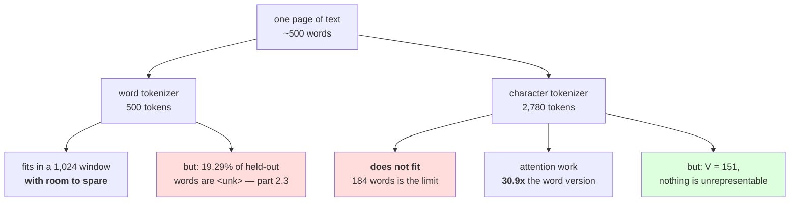

# 1.3 — The sequence-length problem

## One-line answer

A character tokenizer's vocabulary is small and its **sequences are long**: measured on this corpus,
5.56 characters per word, which turns a 1,024-token context window from 1,024 words into **184 words**
and multiplies the attention work for the same text by **30.9×** — and the context number is a
capability limit, not a speed one.

---

## The story

You are moving house and you have to carry everything down three flights of stairs.

You could carry things one at a time. Every trip is easy, nothing is heavy, and you never have to think
about whether something will fit through the door. You will make four hundred trips.

Or you could put things in boxes first. Now it is thirty trips. Packing takes an hour, some boxes are
awkward, and once in a while something does not fit in any box and you carry it loose.

Here is the part that decides it, and it is not the number of trips. The van outside is booked for one
load. Everything that is downstairs when it leaves goes; everything still upstairs does not. Carrying
things one at a time is not slower — it is a **smaller move**.

---

## The idea in plain language

Day 9 part
[1.3](../../../day-009-the-vocabulary-problem/parts/01-the-vocabulary-problem/1.3-why-not-characters.md)
made this argument with numbers taken from an earlier revision of the corpus. This part re-measures it
against the tokenizer you have actually built, and separates the three costs, because they are not the
same kind of cost and only one of them is fatal.

A character tokenizer turns one word into several tokens. Measured below, the average word in this
corpus is 4.897 characters, and adding the space that follows it gives **5.56 characters per word**.
So the same text is 5.56× longer in tokens than a word-level tokenization of it.

That multiplier lands in three places:

**The linear cost — more forward passes.** Every token is a step. 5.56× the tokens is 5.56× the
embedding lookups, 5.56× the layer-norm calls, 5.56× the output projections. This is real and it is the
least interesting of the three, because it is *just* proportional: throw 5.56× the compute at it and it
goes away.

**The quadratic cost — attention.** Attention compares every token with every other token in the
sequence, so its work grows with `T²` where `T` is the sequence length. Day 30 builds it and Day 31
measures it; today the arithmetic is enough: 5.56× the tokens is **5.56² = 30.9×** the attention work.
That is still a resource cost, but it is a steep one, and it is why long-sequence tokenizations are
expensive out of proportion to their length.

**The capability cost — the context window.** This is the one that is not a resource question. A model
is built with a fixed maximum sequence length — 1,024 tokens, say — and text beyond it simply is not
there. At the word level, 1,024 tokens is 1,024 words. At the character level, measured below, it is
**184 words**. The model has not been made slower; it has been made unable to see most of the document.
No amount of compute fixes it, because the limit is baked into the model's shape.

Two terms, defined here. `T` is the curriculum-wide symbol for sequence length, from the plan's style
rules. A **context window** is the maximum `T` a trained model accepts; it is fixed at build time by
the position embeddings, which is Day 21's subject.

And the honest other side, which Day 9 established and this part must not quietly drop: **the character
tokenizer's vocabulary is 151 and it has no out-of-vocabulary problem on text it covers.** Section 2
shows what the word tokenizer trades for its short sequences, and part
[3.1](../03-together/3.1-two-tokenizers-one-table.md) puts both columns side by side. The point of
today is not that one wins; it is that both lose in a way the other does not.

---

## Why Akshara needs it

- **Part [3.1](../03-together/3.1-two-tokenizers-one-table.md)** needs this multiplier as a column. It
  is the character tokenizer's entire cost, and without it the comparison reads as "characters are
  fine".
- **Day 12** builds BPE precisely to sit between these two extremes, and the number it has to beat is
  the 5.56 measured here.
- **Day 21** builds position embeddings, which is where the context window becomes a matrix with a fixed
  number of rows. The 184-words figure is that matrix, seen from the outside.
- **Day 30–31** build and profile attention. The `30.9×` here is arithmetic; those days are where it
  becomes a measured wall-clock number, and comparing the two is the point.
- **Day 51 onward**, the pretraining run has a fixed token budget. A tokenizer that spends 5.56 tokens
  per word spends the budget 5.56× faster in text terms, so the model sees less *content* for the same
  compute.

---

## The mechanism

Measure the ratio, on held-out text, with the tokenizer you built:

```python
import hashlib
import re
from pathlib import Path

raw = Path("docs/00_MASTER_PLAN.md").read_bytes()
text = raw.decode("utf-8")
print("  corpus sha256[:16] :", hashlib.sha256(raw).hexdigest()[:16])

words = re.findall(r"[A-Za-z']+", text.lower())
cut = int(len(words) * 0.8)
held = words[cut:]
held_text = " ".join(held)

print("  held-out word tokens    :", len(held))
print("  held-out characters     :", len(held_text))
print("  characters per word     :", f"{len(held_text) / len(held):.2f}")
print("  attention multiplier    :", f"{(len(held_text) / len(held)) ** 2:.1f}x")
```

**Line by line:**
- The measurement is on **held-out** text — the last 20% of the corpus — rather than on the training
  text. For a length ratio it makes little difference, and doing it anyway is the habit that matters
  when the same split is used for the out-of-vocabulary measurement in part
  [2.3](../02-word-level/2.3-the-out-of-vocabulary-wall.md), where it makes all the difference.
- `" ".join(held)` reconstructs a text from the word list, so the character count includes **one space
  per word**. That is why the ratio is 5.56 and not 4.897: a character tokenizer pays for the
  separators, and a word tokenizer does not represent them at all. Part
  [2.1](../02-word-level/2.1-what-counts-as-a-word.md) is what that omission costs.
- `** 2` is the attention scaling and it is **arithmetic, not a benchmark**. It says what the work
  multiplies by, not how many seconds anything takes; Day 31 is where seconds appear.
- Measured on Intel Core i3-1115G4 (2 cores / 4 threads), 11.7 GB RAM, Windows 11, CPython 3.12.12, on
  2026-08-26:

```text
  corpus sha256[:16] : 9760f2b6d4340b97
  held-out word tokens    : 3017
  held-out characters     : 16774
  characters per word     : 5.56
  attention multiplier    : 30.9x
```

Now the number that is not a resource cost:

```python
CONTEXT = 1024
chars_per_word = len(held_text) / len(held)

print(f"  a {CONTEXT}-token context window holds:")
print(f"    word level      : {CONTEXT:>7.1f} words")
print(f"    character level : {CONTEXT / chars_per_word:>7.1f} words")
print(f"    ratio           : {chars_per_word:>7.2f}x")
```

**Line by line:**
- `CONTEXT = 1024` is a stand-in for the model's fixed maximum `T`. It is written as a named constant
  rather than inlined because **it is a property of the model, not of the tokenizer**, and the two get
  confused constantly.
- The division is the whole argument. Nothing here is a rate or a speed; it is a count of how much text
  fits.
- Measured on this machine, 2026-08-26:

```text
  a 1024-token context window holds:
    word level      :  1024.0 words
    character level :   184.2 words
    ratio           :    5.56x
```

**One hundred and eighty-four words.** That is roughly one page of a paperback, or a long paragraph. A
model with a 1,024-token window and a character tokenizer cannot be asked to summarise a two-page
document, not because it would be slow but because it cannot see the second page.

The same sentence, three ways, to make the abstraction concrete:

```python
probe = "the tokenizer memorises its vocabulary and cannot spell anything else"
print(f"    characters : {len(probe):>3} tokens")
print(f"    words      : {len(probe.split()):>3} tokens")
print(f"    utf-8 bytes: {len(probe.encode('utf-8')):>3} tokens")
```

**Line by line:**
- One short English sentence, so the numbers are small enough to hold in your head and check by
  counting.
- The byte row is there to make a point that part [1.2](1.2-what-counts-as-a-character.md) set up:
  **for pure ASCII, bytes and characters are the same count.** They diverge on everything else, and Day
  10 part [2.4](../../../day-010-unicode-code-points-bytes/parts/02-utf-8-and-bytes/2.4-256-is-a-vocabulary.md)
  measured by how much — 2.75× on Devanagari, 4× on emoji.
- Measured on this machine, 2026-08-26:

```text
    characters :  69 tokens
    words      :  10 tokens
    utf-8 bytes:  69 tokens
```

Sixty-nine against ten. And notice what the ten costs, which is section 2's subject: measured in part
[2.5](../02-word-level/2.5-the-word-tokenizer-that-could-not-say-the-word.md), three of those ten words
are not in a 1,000-word vocabulary at all.



---

## When it breaks

**The loud failure — text longer than the model's window.** This is what the 184 words means in
practice, and it arrives as an assertion or a shape error rather than as a subtle degradation:

```console
>>> import torch
>>> block_size = 1024
>>> ids = tok.encode(long_document)      # 4,312 characters
>>> len(ids)
4312
>>> assert len(ids) <= block_size, f"sequence of {len(ids)} exceeds block_size {block_size}"
Traceback (most recent call last):
  File "<stdin>", line 1, in <module>
AssertionError: sequence of 4312 exceeds block_size 1024
```

What it means: the document is 4,312 characters — about 775 words — and the model's window holds 1,024
tokens. The smallest "fix" is to truncate, and **that is the failure, not the repair**: the model now
answers about the first quarter of the document with no indication that the rest existed.

**The silent failure, and it is the one that produces a bad evaluation rather than a crash.**
Truncation applied quietly. A serving path that does `ids[:block_size]` produces a valid, in-range,
correctly-shaped batch every time. The model answers fluently about a document it has seen a fifth of.
Nothing raises, no metric moves, and the only symptom is that answers about long documents are worse in
a way that looks like a model quality problem:

```text
  document        : 4,312 characters, 775 words
  character ids   : 4,312 tokens
  window          : 1,024
  what the model sees: the first 184 words
  what it answers about: the first 184 words
  what the user asked about: the whole document
  exception raised: none
```

**The check that catches it** refuses to truncate silently, and reports in the unit the caller thinks
in:

```python
def check_fits(tok, text: str, block_size: int) -> dict[str, int]:
    """Report the length in three units before anything is truncated."""
    ids = tok.encode(text)
    report = {
        "tokens": len(ids),
        "block_size": block_size,
        "overflow_tokens": max(0, len(ids) - block_size),
        "words_that_fit": 0,
    }
    if report["overflow_tokens"]:
        kept = tok.decode(ids[:block_size])
        report["words_that_fit"] = len(kept.split())
    return report
```

**Line by line:**
- It returns a **report** rather than raising or truncating, because whether to truncate is the caller's
  decision and the library's job is to make the cost visible. Day 10 part
  [3.1](../../../day-010-unicode-code-points-bytes/parts/03-together/3.1-one-string-five-layers.md)'s
  rule is in force: no field is called `length`.
- `overflow_tokens` is the number that goes in a log line and a metric. A count of *how much was thrown
  away* is monitorable; a boolean "was truncated" is not.
- `words_that_fit` decodes the kept prefix and counts words, because **the person who set the limit was
  thinking in words** and 1,024 tokens means nothing to them. This is the unit conversion happening at
  the edge, where part 3.1 of Day 10 said it belongs.
- It calls `tok.decode` rather than slicing the text, so the count is of what the model actually
  received. Slicing the string instead would give a subtly different answer and would be the same class
  of bug as Day 10 part 1.2's.
- What it deliberately does not do is choose. A pipeline that truncates is fine; a pipeline that
  truncates **without recording the overflow** is how a capability limit gets mistaken for a quality
  problem for six months.

---

## In production

**What a research engineer writes instead of the teaching version.** They do not truncate at the front
of the pipeline at all. They record the token count on every request as a histogram, they alert when the
overflow rate rises, and where documents genuinely exceed the window they chunk with overlap and
combine, or they retrieve the relevant passage first. The choice of tokenizer is upstream of all of
that: **a 5.56× longer tokenization does not make any of those strategies harder, it makes all of them
necessary sooner.**

The second habit is a sizing one. Before a model is built, somebody works out the context window from
the task: the longest document, times the tokens per word, plus the prompt and the expected answer. That
arithmetic uses the tokenizer's measured ratio, and getting it wrong is expensive because the window is
fixed in the position embeddings and changing it means retraining.

**What degrades at scale.** The quadratic term, and it degrades faster than people expect because the
comparison is usually made at the wrong length. At `T = 128` the difference between tokenizations is
barely visible in a profile. At `T = 4096` attention dominates, and a tokenizer that produces 5.56×
the tokens has moved you 30.9× along a curve that was already the bottleneck. Day 31 measures where the
crossover is on this hardware.

**The failure that only shows with real data.** Non-English text, and it compounds with Day 10's
measurement. A character tokenizer over Devanagari produces roughly one token per character just as it
does for English — but Day 10 part 2.4 measured 2.75 UTF-8 bytes per character there, and the words are
built differently, so the words-per-window figure for those users is different again. **A context window
advertised in tokens is a different amount of text for every language**, and the tokenizer is where that
inequality is decided. Day 17 measures it properly.

**The review comment.** *"`ids[:block_size]` — this silently drops everything past the window. At the
character level that is everything after roughly 184 words. Return the overflow count so we can alert
on it, and let the caller decide whether to chunk."*

**The interview question.** *"Why not use character-level tokenization? Compute is cheap."* The weak
answer is "it is too slow". The strong answer separates the three costs: **the linear cost is just
proportional and compute does fix it; the attention cost is quadratic, so my measured 5.56× tokens is
30.9× the attention work; and the third cost is not a resource cost at all — a fixed 1,024-token window
holds 184 words instead of 1,024, so the model cannot see the document.** Then the judgement: *the
first two are budget questions and the third is a capability question, which is why it decides the
argument.*

**Compute tier: T0.** Counting on a laptop with the standard library, over a 113,283-byte file in this
repository. No packages, no network, no GPU, no seed, no timing. Every figure reproduces exactly for
anyone whose corpus hash matches `9760f2b6d4340b97`. What T0 **cannot** show is the `30.9×` as a
wall-clock number — it is arithmetic from a measured ratio and is labelled as such, and Day 31 is where
attention gets timed on real hardware. It also cannot show whether a character-level model is *worse*
at a fixed compute budget; that is a training comparison and it is Day 17.

---

## Check yourself

Run this. It prints **a context window in words, and the number is not 1,024**:

```python
import hashlib
import re
from pathlib import Path

raw = Path("docs/00_MASTER_PLAN.md").read_bytes()
text = raw.decode("utf-8")
print("  corpus sha256[:16] :", hashlib.sha256(raw).hexdigest()[:16])

words = re.findall(r"[A-Za-z']+", text.lower())
held = words[int(len(words) * 0.8):]
held_text = " ".join(held)
ratio = len(held_text) / len(held)

print("  characters per word :", f"{ratio:.2f}")
print("  attention multiplier:", f"{ratio ** 2:.1f}x")
for context in (256, 1024, 4096):
    print(f"  window {context:>5} tokens -> {context / ratio:>7.1f} words at character level,"
          f" {context:>5} at word level")

probe = "the tokenizer memorises its vocabulary and cannot spell anything else"
print("  probe: chars", len(probe), " words", len(probe.split()),
      " bytes", len(probe.encode("utf-8")))
```

**Line by line:**
- `characters per word` prints `5.56`. **Say out loud where the extra 0.66 over the mean word length of
  4.897 comes from, and which tokenizer pays for it.**
- The three window rows print `46.0`, `184.2` and `736.7` words. Say which of those three is enough for
  the task you would actually want a model to do, and say what you would have to change to get it.
- The attention multiplier prints `30.9x`. Say whether that is a measurement or a projection, and say
  which day turns it into seconds.
- The probe line prints the same number for characters and bytes. Say why, and say which one of the two
  would change first if you added a single Devanagari word to the sentence.

**Say this out loud, without scrolling up:** name the three costs of a long tokenization, say which one
of them more compute cannot fix, and state the character-level capacity of a 1,024-token window in
words.
