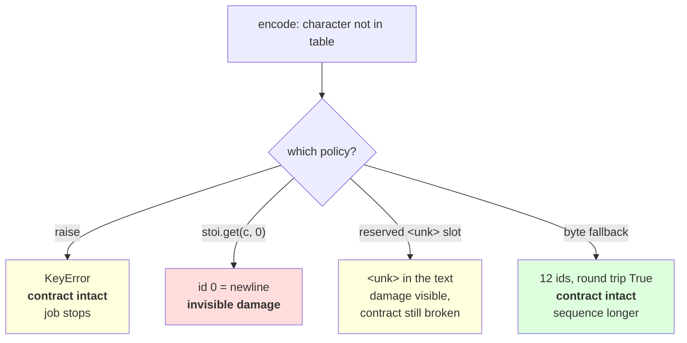

# 1.4 — The unknown-character policy

## One-line answer

A tokenizer meeting a character its table does not contain has exactly three honest options — **raise**,
**substitute a reserved token**, or **fall back to bytes** — and the middle one is the only one that
breaks the round-trip contract, which is why the default has to be the one that crashes.

---

## The story

You go to the shop for a specific brand of soap and they do not have it.

There are three things the person behind the counter can do.

They can say "we do not have that one" — you now know, and you can go somewhere else or buy something
different on purpose.

They can hand you a different soap without mentioning it. You get home, and it is only later, in the
bathroom, that you notice. And you cannot tell whether they were out of stock, misheard you, or thought
this one was better.

Or they can say "we do not stock that, but we have the plain bar and it does the same job" — you leave
with something that works, knowing exactly what you got and what you did not.

Only one of those three leaves you unable to find out what happened, and it is the one that felt
smoothest at the counter.

---

## The idea in plain language

`CharTokenizer.encode` from part [1.1](1.1-from-a-script-to-a-module.md) does a dictionary lookup:

```
[self.stoi[ch] for ch in normalize(NORM, s)]
```

If `ch` is not a key, that raises `KeyError`. Day 9 part
[2.1](../../../day-009-the-vocabulary-problem/parts/02-what-a-tokenizer-is/2.1-a-function-and-its-inverse.md)
called that deliberate and moved on. This part is the argument, because the exception looks like an
oversight and somebody will remove it.

There are three things a tokenizer can do with a character it has no id for.

**Raise.** The default. `encode` is a partial function — defined on the alphabet it was built over and
undefined elsewhere — and Python's way of saying "undefined here" is an exception. The cost is real: a
job dies at three in the morning because one document contained one unusual character.

**Substitute a reserved token.** Add one entry, `<unk>`, and map everything unknown to it. The job does
not die. The cost is that **the contract is gone**: `decode(encode(s)) != s`, permanently and
irreversibly, for any text containing an unknown character. Day 9 part
[1.5](../../../day-009-the-vocabulary-problem/parts/01-the-vocabulary-problem/1.5-the-vocabulary-that-could-not-spell.md)
measured what that does to a reported loss — it goes *down*, because `<unk>` is a frequent, easy token
to predict.

**Fall back to bytes.** Encode the unknown character as its UTF-8 bytes and give each byte an id.
Nothing is ever unrepresentable, the contract holds, and the price is sequence length — Day 10 part
[2.4](../../../day-010-unicode-code-points-bytes/parts/02-utf-8-and-bytes/2.4-256-is-a-vocabulary.md)
measured 2.75 bytes per character for Devanagari and 4 for emoji. This is what real tokenizers do, and
Day 13 builds it.

Now the detail that turns the middle option from "a trade-off" into "a bug", and it is measured below.
The obvious way to add `<unk>` is `self.stoi.get(ch, 0)` — use id `0` for anything unknown. But in a
table built by `sorted(set(text))`, **id `0` is already a real character.** On this corpus it is the
newline. So the "unknown" substitution does not mark the text as damaged; it silently replaces foreign
words with line breaks. Measured below, a six-letter Cyrillic greeting becomes six blank lines.

The rule that follows, and it is the whole practical content of this part: **a reserved token must
occupy a reserved slot.** If you add `<unk>`, it goes in at a fixed index that no real character can
have, and every real character's id shifts up by one — which changes the tokenizer's hash, which is
exactly what you want, because it is a different tokenizer. Day 16 is where reserved tokens get done
properly.

---

## Why Akshara needs it

- **Part [1.5](1.5-the-character-tokenizer-that-met-a-new-alphabet.md)** is this part's failure at full
  size: the same three policies, on real text, with the damage counted.
- **Day 12–13**'s BPE inherits whichever policy you choose here. A character-level BPE has an `<unk>`;
  a byte-level BPE cannot have one, and that difference is the reason Day 13 exists.
- **Day 16** adds `<bos>`, `<eos>` and `<pad>` alongside `<unk>` and has to resize an embedding matrix
  to fit them. The reserved-slot discipline established here is what makes that arithmetic safe.
- **Day 17** measures what unknown tokens do to an evaluation. The measurement only means something if
  the fallback rate is recorded, and nothing records it unless the tokenizer counts it.

---

## The mechanism

Build a table from English text, then hand it five scripts:

```python
import hashlib
from pathlib import Path

raw = Path("docs/00_MASTER_PLAN.md").read_bytes()
text = raw.decode("utf-8")
print("  corpus sha256[:16] :", hashlib.sha256(raw).hexdigest()[:16])

chars = sorted(set(text))
stoi = {ch: i for i, ch in enumerate(chars)}
print("  V           :", len(stoi))

scripts = {
    "Cyrillic":   "\u043f\u0440\u0438\u0432\u0435\u0442",
    "Chinese":    "\u4f60\u597d",
    "Greek":      "\u03b1\u03bb\u03b5\u03c0\u03bf\u03cd",
    "Devanagari": "\u0936\u092c\u094d\u0926",
    "Arabic":     "\u0645\u0631\u062d\u0628\u0627",
}
for name, probe in scripts.items():
    missing = sorted({c for c in probe if c not in stoi})
    verdict = "OK" if not missing else f"KeyError on {ascii(missing[0])} ({len(missing)} missing)"
    print(f"    {name:<11} {verdict}")
```

**Line by line:**
- The probes are written as escapes, per Day 10 part
  [1.1](../../../day-010-unicode-code-points-bytes/parts/01-code-points-and-graphemes/1.1-a-character-is-three-different-things.md).
  A literal here would be unreviewable and would break on a `cp1252` console.
- `sorted({c for c in probe if c not in stoi})` collects **every** missing character rather than
  stopping at the first. A `KeyError` names one character; knowing whether one is missing or all six is
  the difference between "an odd symbol slipped in" and "this table cannot represent this language".
- Measured on Intel Core i3-1115G4 (2 cores / 4 threads), 11.7 GB RAM, Windows 11, CPython 3.12.12,
  `unicodedata` 15.0.0, on 2026-08-26:

```text
  corpus sha256[:16] : 9760f2b6d4340b97
  V           : 151
    Cyrillic    KeyError on '\u0432' (6 missing)
    Chinese     KeyError on '\u4f60' (2 missing)
    Greek       KeyError on '\u03b1' (6 missing)
    Devanagari  KeyError on '\u0926' (3 missing)
    Arabic      KeyError on '\u0627' (5 missing)
```

**Five scripts, five failures.** Devanagari is the interesting row: only **three** of its four
characters are missing, because the corpus happens to contain a few Devanagari letters in an example.
Partial coverage is worse than none — it means some words in that language encode and some do not, so
the failure is intermittent.

Now the three policies, on the Cyrillic probe:

```python
UNK = 0


def enc_raise(s: str) -> list[int]:
    return [stoi[c] for c in s]


def enc_unk(s: str) -> list[int]:
    return [stoi.get(c, UNK) for c in s]


def enc_bytes(s: str) -> list[int]:
    return list(s.encode("utf-8"))


probe = scripts["Cyrillic"]
try:
    enc_raise(probe)
except KeyError as e:
    print("    raise      :", f"KeyError: {ascii(e.args[0])}")

ids = enc_unk(probe)
back = "".join(chars[i] for i in ids)
print("    unk        :", ids, " decodes to", ascii(back), " round trip:", back == probe)

b = enc_bytes(probe)
print("    byte-level :", len(b), "ids, round trip:", bytes(b).decode("utf-8") == probe)
```

**Line by line:**
- `UNK = 0` is written the way people actually write it — the obvious id, chosen because it is the
  obvious id. Watch what it decodes to.
- `stoi.get(c, UNK)` is the two-word change that stops the crash. It is one method call away from the
  correct version and it is the single most common way a tokenizer stops being lossless.
- `list(s.encode("utf-8"))` is the byte fallback in its simplest form: iterating `bytes` yields
  integers, so this *is* a list of ids in `0..255` with no table needed. Day 10 part 2.4 built exactly
  this vocabulary.
- `ascii(e.args[0])` prints the missing character as an escape rather than as an invisible or
  unprintable glyph, for the reason Day 10 part 1.5 gave.
- Measured on this machine, 2026-08-26:

```text
    raise      : KeyError: '\u043f'
    unk        : [0, 0, 0, 0, 0, 0]  decodes to '\n\n\n\n\n\n'  round trip: False
    byte-level : 12 ids, round trip: True
```

**Read the middle row twice.** The `<unk>` policy did not mark the text as unknown. Id `0` in a table
built by `sorted(set(text))` is the **newline**, because `\n` is `U+000A` and sorts before every
printable character. So a Russian greeting became six blank lines, the encode succeeded, the decode
succeeded, and the result is valid text that a human would read as an empty gap.

That is not a hypothetical mis-configuration. `UNK = 0` is what you write when you have not thought
about it, and `sorted(set(text))` is what Day 9 correctly insisted on, and the two together produce
this. **The bug is in the interaction, which is why neither piece looks wrong on its own.**

The fix is one line, and it changes the tokenizer:

```python
UNK_TOKEN = "<unk>"
chars_with_unk = [UNK_TOKEN] + sorted(set(text))     # <unk> occupies slot 0 by construction
stoi2 = {ch: i for i, ch in enumerate(chars_with_unk)}

ids = [stoi2.get(c, 0) for c in probe]
back = "".join(chars_with_unk[i] for i in ids)
print("    reserved slot:", ids, " decodes to", ascii(back), " round trip:", back == probe)
print("    V before/after:", len(stoi), len(stoi2))
print("    id of 'a' before/after:", stoi["a"], stoi2["a"])
```

**Line by line:**
- `[UNK_TOKEN] + sorted(...)` puts the reserved token at index `0` **by construction**, so no real
  character can occupy it. Prepending rather than appending is a choice: it keeps the reserved block at
  the start of the vocabulary, which is the convention Day 16 follows for `<bos>`, `<eos>` and `<pad>`
  too.
- `chars_with_unk` is a list of *strings*, and one of them is five characters long. That is the moment
  the vocabulary stops being an alphabet: **entries are now tokens, not characters**, which is exactly
  the generalisation Day 12's BPE needs.
- The last line prints the id of `'a'` before and after. **Every real character's id has shifted by
  one**, which means the two tokenizers are incompatible and their hashes differ — correctly, because
  they are different tokenizers.
- Measured on this machine, 2026-08-26:

```text
    reserved slot: [0, 0, 0, 0, 0, 0]  decodes to '<unk><unk><unk><unk><unk><unk>'  round trip: False
    V before/after: 151 152
    id of 'a' before/after: 63 64
```

**The round trip is still `False`, and that is correct.** The reserved slot did not fix the contract; it
made the damage **visible**. Six `<unk>` markers in the decoded text is a thing a person or a test can
see. Six newlines is not. That is the entire improvement, and it is worth having.



---

## When it breaks

**The loud failure, which is the design working:**

```console
>>> tok = CharTokenizer.from_text("hello world")
>>> tok.encode("привет")
Traceback (most recent call last):
  File "<stdin>", line 1, in <module>
  File "<stdin>", line 2, in encode
  File "<stdin>", line 2, in <listcomp>
KeyError: 'п'
```

What it means: the table was built over eight distinct characters and asked about a script it has never
seen. The smallest fix is *not* to catch this — it is to decide, deliberately, which of the three
policies this tokenizer has, and to write that decision down where the tokenizer is constructed.

**The silent failure, in two flavours, and the second is the nastier one.**

The first is `stoi.get(c, 0)` and it is measured above: unknown characters become whatever character
happens to hold id `0`.

The second survives even a correctly reserved `<unk>` slot: **nothing counts how often it fires.** A
tokenizer that emits `<unk>` for 0.01% of tokens and one that emits it for 19% are indistinguishable
from the outside, and the second one is a broken pipeline. The wrong output:

```text
  corpus            : 40,000 documents, one language you do not read
  encode            : succeeds on every document
  <unk> rate        : not measured, so not known
  training loss     : lower than the run without <unk> — Day 9 part 1.5 measured why
  eval score        : fine, because the eval set is in the language you do read
  what actually happened: one language was encoded almost entirely as <unk>
```

**The check that catches it** counts, and refuses quietly-high rates:

```python
def encode_with_stats(tok, s: str, unk_id: int) -> tuple[list[int], dict[str, float]]:
    """Encode, and report the fallback rate. A tokenizer that cannot report it cannot be trusted."""
    ids = [tok.stoi.get(ch, unk_id) for ch in unicodedata.normalize(tok.NORM, s)]
    n_unk = sum(1 for i in ids if i == unk_id)
    return ids, {
        "tokens": len(ids),
        "unk_tokens": n_unk,
        "unk_rate": n_unk / len(ids) if ids else 0.0,
    }


def assert_coverage(tok, sample: str, max_unk_rate: float = 0.001) -> None:
    """Fail a corpus whose fallback rate is above a stated threshold."""
    _, stats = encode_with_stats(tok, sample, unk_id=0)
    assert stats["unk_rate"] <= max_unk_rate, (
        f"{stats['unk_rate']:.2%} of tokens are <unk> "
        f"({stats['unk_tokens']} of {stats['tokens']}) — the tokenizer does not cover this text"
    )
```

**Line by line:**
- `encode_with_stats` returns the ids **and** the statistics, so the caller cannot use one without
  having been handed the other. A separate `count_unks` function would be called by nobody.
- `unk_rate` is a rate, not a count, because the threshold that matters is proportional. Ten `<unk>`
  tokens in a tweet and ten in a novel are different problems.
- `max_unk_rate=0.001` is a **stated default, not a discovered one**. It is a policy choice — one token
  in a thousand — and it is written as an argument so a caller can set it from their own measurement
  rather than inheriting a number somebody guessed.
- The message prints the rate *and* both counts, because at three in the morning "19.29%" and "582 of
  3,017" answer different questions.
- What this deliberately does not do is fix anything. The assertion's job is to stop a corpus the
  tokenizer cannot represent from being trained on **before** the run, which is the plan's Silent
  Failure #1 discipline applied to coverage rather than contamination.

---

## In production

**What a research engineer writes instead of the teaching version.** They do not have this problem,
because they use byte fallback and there is no unknown byte. That is not evasion — it is the whole
reason the field converged on byte-level schemes, and Day 13 builds one. Where a vocabulary does keep
an `<unk>`, the fallback rate is a **logged metric on every tokenization job**, plotted per language and
per source, and a spike in it is treated as a data incident rather than a tokenizer curiosity.

The second habit is the reserved block. Special tokens live at fixed low ids — `0` through `4`, say —
decided once and never renumbered, so that adding a new one later appends rather than shifts. Day 16 is
where that convention is set up properly; the lesson available today is that **`<unk>` at id 0 is only
safe if id 0 was reserved before the alphabet was numbered.**

**What degrades at scale.** Coverage, unevenly. A vocabulary built from a corpus that is 95% one
language covers that language perfectly and the remaining 5% badly. The aggregate `<unk>` rate looks
excellent — a couple of percent — while for the minority languages it is catastrophic. **An average
fallback rate hides exactly the population it is failing**, which is why the metric has to be broken
down by source or language rather than reported as one number.

**The failure that only shows with real data.** Partial script coverage, the Devanagari row above. A
corpus that contains a handful of characters from a script gives the table *some* of that script's
letters, so text in it encodes sometimes and raises sometimes, depending on the words. That is far
harder to diagnose than a script that is missing entirely, because the first ten documents work.

**The review comment.** *"`stoi.get(ch, 0)` — id 0 is the newline in this table, so unknown characters
are being replaced by line breaks rather than being marked. If we want a fallback it needs a reserved
slot, and either way we need the rate logged."*

**The interview question.** *"What should a tokenizer do with a character it has never seen?"* The weak
answer is "map it to `<unk>`". The strong answer names the three options and the property that separates
them: **raise keeps the round trip and stops the job; `<unk>` keeps the job and breaks the round trip
irreversibly; byte fallback keeps both and costs sequence length — which is why production schemes are
byte-level.** Then the detail that shows you have been burnt: *and if you do add `<unk>`, it needs a
reserved id, because in a table built from `sorted(set(text))` id 0 is a real character — I have seen
unknown text come out as newlines.*

**Compute tier: T0.** The standard library on a laptop, over a 113,283-byte file in this repository. No
packages, no network, no GPU, no seed. Every number reproduces exactly for anyone whose corpus hash
matches `9760f2b6d4340b97`; the script probes are literal escapes and do not depend on the corpus at
all. What T0 **cannot** show is what a given `<unk>` rate does to a trained model's quality — Day 9 part
1.5 established the *direction* by arithmetic and Day 17 measures the magnitude with runs.

---

## Check yourself

Run this. It prints **a foreign word encoded as newlines, with no error**:

```python
import hashlib
from pathlib import Path

raw = Path("docs/00_MASTER_PLAN.md").read_bytes()
text = raw.decode("utf-8")
chars = sorted(set(text))
stoi = {ch: i for i, ch in enumerate(chars)}

print("  corpus sha256[:16] :", hashlib.sha256(raw).hexdigest()[:16])
print("  V                  :", len(stoi))
print("  what is id 0?      :", ascii(chars[0]))

probe = "\u043f\u0440\u0438\u0432\u0435\u0442"
try:
    [stoi[c] for c in probe]
except KeyError as e:
    print("  strict encode      : KeyError", ascii(e.args[0]))

ids = [stoi.get(c, 0) for c in probe]
print("  with .get(c, 0)    :", ids)
print("  decodes to         :", ascii("".join(chars[i] for i in ids)))
print("  round trip         :", "".join(chars[i] for i in ids) == probe)
print("  byte fallback ids  :", len(list(probe.encode("utf-8"))),
      " round trip:", bytes(probe.encode("utf-8")).decode("utf-8") == probe)
```

**Line by line:**
- `what is id 0?` prints `'\n'`. **Say out loud why the newline is first, and what that has to do with
  `sorted`.**
- `with .get(c, 0)` prints six zeros and the decode prints six escaped newlines. Say how this would
  appear in a training corpus, and say what a person reviewing that corpus would think they were looking
  at.
- The byte-fallback line prints `12` ids and `True`. Say what the sequence-length cost is for this
  word, and say what part [1.3](1.3-the-sequence-length-problem.md)'s multiplier becomes for text in
  this script.
- Now rebuild the table with `["<unk>"] + sorted(set(text))` and run the `.get` line again. Say what
  changed in the decoded output, say what did **not** change about the round trip, and say why that is
  still an improvement.

**Say this out loud, without scrolling up:** name the three unknown-character policies, say which one
breaks the tokenizer's contract and which two do not, and say why `stoi.get(ch, 0)` is worse than a
reserved `<unk>` slot even though both produce the same round-trip answer.
