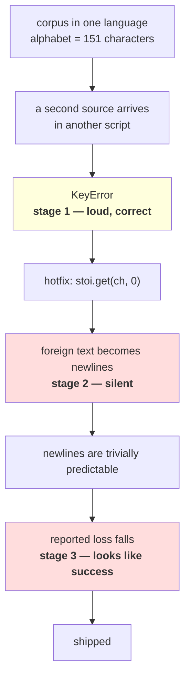

# 1.5 — 💥 The character tokenizer that met a new alphabet

## One-line answer

A character tokenizer built from a corpus has an alphabet of exactly that corpus: measured here, **151
characters — 0.101% of assigned Unicode** — so it raises on Cyrillic, Greek, Arabic and Chinese, and
the fix that stops the crash converts a foreign sentence into blank lines that no test, no metric and no
reviewer will notice.

---

## The story

You take a parcel to be posted. The person behind the counter types the address into a machine that
prints the label.

The address has a street name in a script the machine's keyboard does not have. You watch them look for
the letters, not find them, and then do the sensible thing: they type the part they can and leave the
rest.

The label prints. It looks like a label. It has a name, a city, a postcode and a barcode. Everything
about it says "this is a valid address", and the parcel goes into the sack.

Nobody at the counter did anything wrong, and nothing on the label says a line is missing. The only
person who will ever find out is whoever is waiting for the parcel.

---

## The idea in plain language

This is parts [1.2](1.2-what-counts-as-a-character.md) and [1.4](1.4-the-unknown-character-policy.md)
allowed to run into a real pipeline, and it is the failure that ends the character tokenizer's case.

Part 1.2 measured the alphabet: **151 characters**, built by `sorted(set(text))` from one corpus. That
sounds like a complete alphabet because for the corpus it is one. Set against the character set the
world actually uses, it is 0.101% of it — measured below against Day 10 part
[2.4](../../../day-010-unicode-code-points-bytes/parts/02-utf-8-and-bytes/2.4-256-is-a-vocabulary.md)'s
count of 149,251 assigned characters.

So the failure is not exotic. It is: *somebody sends the model a sentence in a language the corpus did
not contain.* Day 9 part
[1.1](../../../day-009-the-vocabulary-problem/parts/01-the-vocabulary-problem/1.1-a-model-can-only-emit-its-vocabulary.md)
already established the consequence for output — the model can only emit its vocabulary — and this part
is the input side, which is worse, because at least an output limitation is visible in the output.

There are three stages to this failure and the third one is the one that costs money.

**Stage one: it raises.** A `KeyError` on the first foreign character. Loud, immediate, and correct.

**Stage two: somebody stops the raising.** `stoi.get(ch, 0)`, two words, in a hotfix. Part 1.4 measured
what that does: id `0` is the newline, so foreign text becomes blank lines. The job stops crashing.

**Stage three: the damage becomes invisible in aggregate.** This is the part that is specific to
training a language model rather than to any other program, and it is why this is a `production`-level
part. Blank lines are *cheap to predict*. A corpus in which one language has been replaced by newlines
has a **lower** average loss than the same corpus intact — the same mechanism Day 9 part
[1.5](../../../day-009-the-vocabulary-problem/parts/01-the-vocabulary-problem/1.5-the-vocabulary-that-could-not-spell.md)
measured for `<unk>`. So the metric on your dashboard moves in the direction that means "good" at
exactly the moment your corpus is being destroyed.

**Three checks would each have caught it, and none of them is usually written**: the fallback rate per
source language, the round-trip assertion on a sample of every source, and a look at the decoded corpus
by eye. The rest of this part is those three, and what they print.

---

## Why Akshara needs it

- **Part [3.1](../03-together/3.1-two-tokenizers-one-table.md)** puts this in a column: the character
  tokenizer's out-of-vocabulary rate is `0.00%` on held-out text from the same corpus and undefined on
  anything else. A number measured only in-distribution is the thing this part exists to distrust.
- **Day 13**'s byte-level BPE makes this failure **impossible** rather than rarer, which is a stronger
  claim than any tuning could buy, and it is the reason that day exists.
- **Day 14** opens a real tokenizer and the first thing to check is what it does with a script it has
  never seen. This part is what you are checking *for*.
- **Day 60 onward**, the pretraining corpus is assembled from more than one source. This failure is what
  happens on the day a second source is added, and the loss curve will look better afterwards.

---

## The mechanism

First the size of the gap, stated as a fraction rather than a feeling:

```python
import hashlib
import sys
import unicodedata
from pathlib import Path

raw = Path("docs/00_MASTER_PLAN.md").read_bytes()
text = raw.decode("utf-8")
print("  corpus sha256[:16] :", hashlib.sha256(raw).hexdigest()[:16])

chars = sorted(set(text))
stoi = {ch: i for i, ch in enumerate(chars)}

assigned = sum(1 for cp in range(sys.maxunicode + 1)
               if unicodedata.category(chr(cp)) not in ("Cn", "Co", "Cs"))
print("  alphabet           :", len(stoi))
print("  assigned characters:", assigned)
print("  coverage           :", f"{len(stoi) / assigned:.6%}")
```

**Line by line:**
- `assigned` is Day 10 part 2.4's census, recomputed here rather than quoted, so the two numbers cannot
  drift apart. Excluding `Cn`, `Co` and `Cs` — unassigned, private use and surrogates — is what makes
  it a count of characters rather than of code point slots.
- The division is the whole point of the block. **151 is a number that sounds like an alphabet; 0.101%
  is a number that sounds like a bug.** They are the same fact.
- Measured on Intel Core i3-1115G4 (2 cores / 4 threads), 11.7 GB RAM, Windows 11, CPython 3.12.12,
  `unicodedata` 15.0.0, on 2026-08-26:

```text
  corpus sha256[:16] : 9760f2b6d4340b97
  alphabet           : 151
  assigned characters: 149251
  coverage           : 0.101172%
```

Now the failure, in the order it actually happens. Stage one:

```python
scripts = {
    "English":    "the quick brown fox",
    "Cyrillic":   "\u043f\u0440\u0438\u0432\u0435\u0442",
    "Greek":      "\u03b1\u03bb\u03b5\u03c0\u03bf\u03cd",
    "Chinese":    "\u4f60\u597d",
    "Arabic":     "\u0645\u0631\u062d\u0628\u0627",
    "Devanagari": "\u0936\u092c\u094d\u0926",
}

for name, probe in scripts.items():
    try:
        ids = [stoi[c] for c in probe]
        print(f"    {name:<11} encoded to {len(ids)} ids")
    except KeyError as e:
        missing = sorted({c for c in probe if c not in stoi})
        print(f"    {name:<11} KeyError {ascii(e.args[0])} — {len(missing)}/{len(set(probe))} "
              f"distinct characters missing")
```

**Line by line:**
- English is in the list as the control. A test suite containing only this row passes, which is the
  point.
- The `except` block reports the **proportion** of distinct characters missing, not just the first one.
  A row saying `1/6` is a stray symbol; a row saying `6/6` is a language the tokenizer cannot read, and
  the two need different responses.
- Measured on this machine, 2026-08-26:

```text
    English     encoded to 19 ids
    Cyrillic    KeyError '\u043f' — 6/6 distinct characters missing
    Greek       KeyError '\u03b1' — 6/6 distinct characters missing
    Chinese     KeyError '\u4f60' — 2/2 distinct characters missing
    Arabic      KeyError '\u0645' — 5/5 distinct characters missing
    Devanagari  KeyError '\u0936' — 3/4 distinct characters missing
```

**Four of five scripts are entirely outside the alphabet.** Devanagari is `3/4`, which is the worst
kind: the corpus contains a few of its letters as examples, so some words in that language will encode
and some will not, and the failure looks intermittent and data-dependent rather than structural.

Stage two — the hotfix, and the output it produces:

```python
def encode_hotfix(s: str) -> list[int]:
    """The two-word change that makes the crash stop."""
    return [stoi.get(c, 0) for c in s]


def decode(ids: list[int]) -> str:
    return "".join(chars[i] for i in ids)


sentence = "\u043f\u0440\u0438\u0432\u0435\u0442 world"
ids = encode_hotfix(sentence)
out = decode(ids)
print("    input      :", ascii(sentence))
print("    ids        :", ids)
print("    decoded    :", ascii(out))
print("    round trip :", out == sentence)
print("    id 0 is    :", ascii(chars[0]))
```

**Line by line:**
- The probe mixes scripts on purpose — a foreign word next to an English one — because that is what real
  text looks like and because it shows the damage being *partial*, which is what makes it survive a
  glance.
- `decode` is the same function part 1.1 built. Nothing here is a broken decoder; the decoder is
  faithfully rendering the ids it was given.
- Measured on this machine, 2026-08-26:

```text
    input      : '\u043f\u0440\u0438\u0432\u0435\u0442 world'
    ids        : [0, 0, 0, 0, 0, 0, 1, 85, 77, 80, 74, 66]
    decoded    : '\n\n\n\n\n\n world'
    round trip : False
    id 0 is    : '\n'
```

**A greeting became six blank lines and the word `world` survived.** Read the decoded line as it would
appear in a corpus file: a run of empty lines, then some English. That is indistinguishable from
formatting.

Stage three — what it does to the number on the dashboard. This is arithmetic over an explicitly
described model, not a training run:

```python
import math

V = len(stoi)
print(f"    vocabulary                    : {V}")
print(f"    uniform loss over V, in nats  : {math.log(V):.4f}")

# A corpus where a fraction p of tokens have been replaced by a single, perfectly predictable token.
for p in (0.0, 0.05, 0.20, 0.50):
    loss = (1 - p) * math.log(V) + p * 0.0
    print(f"    {p:>5.0%} of tokens replaced      : {loss:.4f} nats  "
          f"({(math.log(V) - loss) / math.log(V):>5.1%} lower)")
```

**Line by line:**
- `math.log(V)` is the loss of a model that has learned nothing and predicts every token with equal
  probability — Day 6 established it as the `ln(V)` floor, and it is the honest baseline to compare
  against.
- The loop describes **a deliberately stupid model**: it predicts the replacement token perfectly (loss
  `0.0`) and everything else at chance. That is not what a real model does, and this block is not a
  claim about one. It establishes the **direction and rough size** of the bias, which is the claim being
  made — Principle 8 requires saying which of those two things a number is.
- The `p * 0.0` term is written out rather than dropped, because the zero is the assumption. Deleting it
  would hide the thing that makes this arithmetic rather than a measurement.
- Measured on this machine, 2026-08-26:

```text
    vocabulary                    : 151
    uniform loss over V, in nats  : 5.0173
       0% of tokens replaced      : 5.0173 nats  ( 0.0% lower)
       5% of tokens replaced      : 4.7664 nats  ( 5.0% lower)
      20% of tokens replaced      : 4.0138 nats  (20.0% lower)
      50% of tokens replaced      : 2.5086 nats  (50.0% lower)
```

**Destroying a fifth of the corpus lowers the reported loss by a fifth.** Nobody set out to fake a
result. Somebody stopped a crash, and the metric that everybody watches moved in the direction that
means success.



---

## When it breaks

**The loud failure, which is stage one and is the version you want:**

```console
>>> tok = CharTokenizer.from_text(Path("docs/00_MASTER_PLAN.md").read_text(encoding="utf-8"))
>>> tok.encode("привет")
Traceback (most recent call last):
  File "<stdin>", line 1, in <module>
  File "<stdin>", line 2, in encode
  File "<stdin>", line 2, in <listcomp>
KeyError: 'п'
```

What it means: this tokenizer has never seen this script. The smallest fix is **not** to catch it. The
correct responses are to add that language to the corpus and rebuild the table — which changes every id
and therefore the tokenizer hash — or to change tokenization scheme, which is Day 13.

**The silent failure, and here it is with the damage counted, verbatim:**

```text
  input      : 'привет world'            6 Cyrillic characters + 6 ASCII
  encode     : succeeds, 12 ids, all in range 0..150
  ids        : [0, 0, 0, 0, 0, 0, 1, 85, 77, 80, 74, 66]
  decoded    : '\n\n\n\n\n\n world'
  round trip : False
  raised     : nothing
  in a corpus file this reads as: six blank lines, then the word "world"
  and the reported loss on that corpus is lower than on the intact one.
```

**The checks that catch it** — three, because no single one is enough:

```python
import unicodedata
from collections import Counter


def coverage_report(tok, sample: str) -> dict[str, object]:
    """What fraction of this text can the tokenizer actually represent, and what is missing?"""
    norm = unicodedata.normalize(tok.NORM, sample)
    missing = [ch for ch in norm if ch not in tok.stoi]
    by_script = Counter(unicodedata.name(ch, "<unnamed>").split()[0] for ch in missing)
    return {
        "chars": len(norm),
        "missing_chars": len(missing),
        "missing_rate": len(missing) / len(norm) if norm else 0.0,
        "missing_by_script": dict(by_script.most_common(5)),
    }


def assert_source_is_covered(tok, source_name: str, sample: str) -> None:
    """Run this per source, before the source joins the corpus. Not on the corpus as a whole."""
    report = coverage_report(tok, sample)
    assert report["missing_rate"] == 0.0, (
        f"source {source_name!r}: {report['missing_rate']:.2%} of characters are outside the "
        f"tokenizer's alphabet ({report['missing_by_script']})"
    )
```

**Line by line:**
- `unicodedata.name(ch, "<unnamed>").split()[0]` takes the **first word of the character's name** —
  `CYRILLIC`, `GREEK`, `ARABIC`, `DEVANAGARI` — as a cheap script label. It is an approximation and not
  the Unicode `Script` property, which `unicodedata` does not expose; naming it `by_script` rather than
  `script` would be the honest thing if this were shipping. The two-argument form of `name` returns the
  default instead of raising, which Day 10 part 1.1 flagged as the documented contract.
- `assert_source_is_covered` takes a **source name** and is meant to run **per source**. That is the
  whole design: a corpus-wide coverage number is dominated by the majority language and will read
  `0.3%` while one source is at `100%`. Averaging is how this bug hides.
- The assertion is `== 0.0`, not a threshold. For a character tokenizer, *any* missing character means
  text will be silently altered, so there is no tolerance to set — unlike part 1.4's `<unk>` rate, where
  a threshold is the right shape.
- The message prints the script breakdown, so the failure says *which language* rather than *which
  character*. At three in the morning that is the difference between one grep and one day.
- What this cannot do is check the corpus you already trained on. That is why it runs **before** a source
  joins, and why the third check — reading a decoded sample by eye — is not replaceable by any assertion.

---

## In production

**What a research engineer writes instead of the teaching version.** They do not build alphabets from
corpora at all, because this failure has no fix within the design — every corpus is a subset of the
world's characters, and the alphabet is frozen before the corpus is finished growing. They use byte
fallback, and Day 13 is where you build it. Where a character-level scheme genuinely is right — a
constrained domain, a single script, a fixed input format — the alphabet is written down **as a
specification** rather than derived from data, and input outside it is rejected at the door.

The second habit is per-source data validation. Every source that joins a corpus is sampled, encoded,
round-tripped and eyeballed *before* it is merged, and the result is recorded. That is not tokenizer
work; it is data work, and it is the discipline that catches this and Silent Failure #1 with the same
pass.

**What degrades at scale.** The visibility of the damage, which falls as the corpus grows. In a 10 MB
corpus a destroyed source is a noticeable fraction and somebody spots the blank lines. In a 10 TB corpus
it is a rounding error in every aggregate — total tokens, mean document length, loss — while remaining
100% destruction *for the users of that language*. **Aggregates hide exactly the population being
failed**, which is the same lesson part 1.4 reached from the fallback-rate direction.

**The failure that only shows with real data.** Partial coverage, the Devanagari row. A corpus that
contains three of a script's letters gives the alphabet three of them, so words in that script encode
when they happen to use those letters and raise otherwise. That produces an intermittent, input-dependent
`KeyError` that survives many rounds of "we fixed the crash", because each fix addresses the specific
character in that traceback.

**The review comment.** *"This builds the tokenizer's alphabet from the training corpus, and the loader
uses `.get(ch, 0)`. Any document in a script the corpus lacks will be encoded as id 0 — which is the
newline — and we will never know. Either assert coverage per source before ingest, or move to byte-level
so the question cannot arise."*

**The interview question.** *"Your loss dropped 20% after a data pipeline change. What do you check
first?"* The weak answer is "great, ship it". The strong answer names the mechanism: **a loss can fall
because the model learned or because the data got easier, and replacing text with a trivially
predictable token does the second — so I would check the token distribution before and after, look for
a spike in one id, and round-trip a sample of every source through the tokenizer.** Then the specific
instance: *I have seen a tokenizer's `.get(ch, 0)` fallback turn a whole language into newlines, which
lowered the reported loss in proportion to how much text it destroyed.*

**Compute tier: T0.** The standard library on a laptop, over a 113,283-byte file in this repository. No
packages, no network, no GPU, no seed, no training run. The alphabet size, the coverage fraction and the
script probes reproduce exactly for anyone whose corpus hash matches `9760f2b6d4340b97` — and the script
probes do not depend on the corpus at all. **The loss table is arithmetic over an explicitly described
model and is not a measurement of any trained system**; it establishes the direction of the bias, which
is the claim. Measuring the magnitude on a real model needs runs, and that is Day 17.

---

## Check yourself

Run this. It prints **a foreign greeting turned into blank lines, with no exception**:

```python
import hashlib
import sys
import unicodedata
from pathlib import Path

raw = Path("docs/00_MASTER_PLAN.md").read_bytes()
text = raw.decode("utf-8")
chars = sorted(set(text))
stoi = {ch: i for i, ch in enumerate(chars)}

print("  corpus sha256[:16] :", hashlib.sha256(raw).hexdigest()[:16])
print("  alphabet           :", len(stoi))
assigned = sum(1 for cp in range(sys.maxunicode + 1)
               if unicodedata.category(chr(cp)) not in ("Cn", "Co", "Cs"))
print("  coverage of Unicode:", f"{len(stoi) / assigned:.6%}")

sentence = "\u043f\u0440\u0438\u0432\u0435\u0442 world"
ids = [stoi.get(c, 0) for c in sentence]
out = "".join(chars[i] for i in ids)
print("  ids                :", ids)
print("  decoded            :", ascii(out))
print("  round trip         :", out == sentence)
print("  how many ids are 0 :", ids.count(0), "of", len(ids))
```

**Line by line:**
- `coverage of Unicode` prints `0.101172%`. **Say out loud whether 151 characters felt like a complete
  alphabet before you saw that number.**
- The decoded line prints six escaped newlines followed by ` world`. Say what that looks like in a
  corpus file opened in an editor, and say which of your existing tests would have failed.
- `how many ids are 0` prints `6 of 12`. Say what fraction of that sentence survived, and say what the
  reported loss would do if a fifth of your corpus looked like this.
- Now rebuild the table as `["<unk>"] + sorted(set(text))` and re-run. Say what the decoded line becomes,
  say whether the round trip is now `True`, and say why the change is still worth making.

**Say this out loud, without scrolling up:** state your tokenizer's alphabet as a fraction of assigned
Unicode, name the three stages by which a `KeyError` becomes a falling loss curve, and name the one check
that has to run per source rather than over the whole corpus — and say why averaging defeats it.
