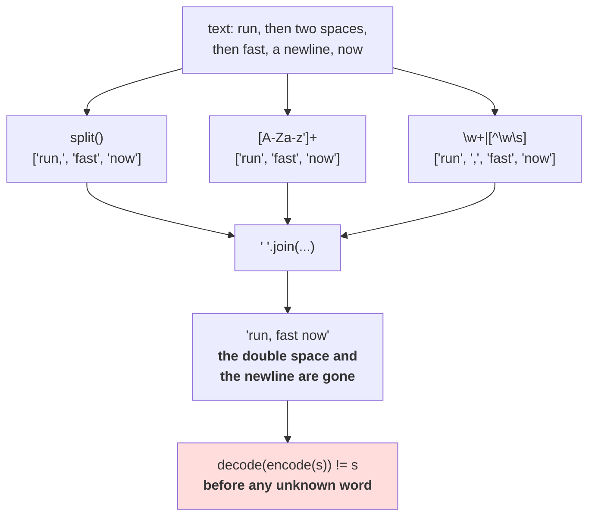

# 2.1 — What counts as a word

## One-line answer

"Split on words" is five different tokenizers giving between **15,082 and 29,081 tokens** on the same
corpus — and every one of them fails the round-trip contract before it has met a single unknown word,
because splitting throws the whitespace away.

---

## The story

You are asked to count how many words are on a shopping list.

*Rice, 2kg. Cooking oil — 1 litre. Tea (loose). Soap x3.*

You say twelve. Somebody else says nine, because they did not count the numbers. A third person says
seventeen, because they counted the brackets and the dash as words in their own right.

Then somebody asks the question that actually matters: if you gave your list of words to a person who
had never seen the original, could they write the list back out exactly as it was?

None of you could. The commas are gone, the brackets are gone, the line breaks are gone. You all
counted something real, and none of you kept enough to put the list back.

---

## The idea in plain language

A character tokenizer needed no decision about where tokens begin: a character is a character. A word
tokenizer needs one, and there is no correct answer, only a set of consequences.

The candidates, all of them ordinary and all of them in real code somewhere:

- **`text.split()`** — split on runs of whitespace. Punctuation stays glued to words, so `run,` and
  `run` and `run.` are three different vocabulary entries.
- **`re.findall(r"[A-Za-z']+", text)`** — runs of letters and apostrophes. Punctuation and digits
  vanish entirely.
- **The same, lowercased** — merges `The` and `the`, and cannot be undone. Part
  [1.2](../01-character-level/1.2-what-counts-as-a-character.md) already ruled this out on contract
  grounds; it is here to be measured.
- **`re.findall(r"\w+", text)`** — `\w` is the regular-expression class for "word character", which in
  Python means letters, digits and underscore **in any script**. Devanagari and Cyrillic are included;
  punctuation is not.
- **`re.findall(r"\w+|[^\w\s]", text)`** — word runs **or** single non-space, non-word characters. This
  keeps punctuation as its own tokens, which is what real pre-tokenizers do, and it is the first option
  in this list that is not throwing information away on purpose.

Two terms before the measurements. A **token** is one item the tokenizer produces; a **type** is one
distinct token value. 15,082 tokens and 2,425 types means the corpus used 2,425 different words a total
of 15,082 times. Day 9 part
[1.2](../../../day-009-the-vocabulary-problem/parts/01-the-vocabulary-problem/1.2-why-not-words.md)
used the same pair.

Now the thing that is easy to miss and is the most important sentence in this part. Day 9 part
[2.1](../../../day-009-the-vocabulary-problem/parts/02-what-a-tokenizer-is/2.1-a-function-and-its-inverse.md)
defined a tokenizer by one property: `decode(encode(s)) == s`. **A word tokenizer built on any of these
splitters fails that property immediately**, on plain English, with every word in the vocabulary,
because the split discards the whitespace and the punctuation between the words and nothing records how
to put them back. Measured below: all five, `False`.

That is a different failure from the out-of-vocabulary problem that parts
[2.3](2.3-the-out-of-vocabulary-wall.md) and [2.5](2.5-the-word-tokenizer-that-could-not-say-the-word.md)
are about. It happens first, it happens on text the vocabulary fully covers, and it is structural: you
cannot fix it by making the vocabulary bigger. **The repair is to make the separators into tokens too**
— which is what the fifth option starts doing and what Day 13's pre-tokenizer finishes.

---

## Why Akshara needs it

- **Part [2.2](2.2-building-a-word-vocabulary.md)** builds the vocabulary from whichever splitter you
  choose, so every number in the rest of this section inherits this decision. The section states which
  splitter it uses for exactly that reason.
- **Part [2.3](2.3-the-out-of-vocabulary-wall.md)**'s out-of-vocabulary rate depends on the splitter:
  a splitter that keeps punctuation attached invents thousands of extra types and makes the wall worse.
- **Day 13** builds the GPT-style regex pre-tokenizer, symbol by symbol. It is the fifth option here,
  taken seriously, and it exists to solve the round-trip problem this part measures.
- **Day 17** measures tokenization pathologies on numbers, whitespace and code. Every one of them is a
  pre-tokenizer decision, and this is where the idea of "a pre-tokenizer decision" is introduced.

---

## The mechanism

Five splitters, one corpus:

```python
import hashlib
import re
from collections import Counter
from pathlib import Path

raw = Path("docs/00_MASTER_PLAN.md").read_bytes()
text = raw.decode("utf-8")
print("  corpus sha256[:16] :", hashlib.sha256(raw).hexdigest()[:16])

SPLITTERS = {
    "text.split()":          lambda s: s.split(),
    "[A-Za-z']+":            lambda s: re.findall(r"[A-Za-z']+", s),
    "[A-Za-z']+ lowercased": lambda s: re.findall(r"[A-Za-z']+", s.lower()),
    r"\w+ (unicode)":         lambda s: re.findall(r"\w+", s),
    r"\w+|[^\w\s] (+punct)":  lambda s: re.findall(r"\w+|[^\w\s]", s),
}

print(f"  {'splitter':<24} {'tokens':>7} {'types':>7} {'hapax':>7} {'hapax %':>8}")
for name, fn in SPLITTERS.items():
    toks = fn(text)
    c = Counter(toks)
    hap = sum(1 for v in c.values() if v == 1)
    print(f"  {name:<24} {len(toks):>7} {len(c):>7} {hap:>7} {hap / len(c):>7.1%}")
```

**Line by line:**
- Every pattern is a **raw string** (`r"..."`). Without the `r`, `\w` is not a valid Python escape and
  the interpreter emits a `SyntaxWarning` — which is a warning today and was an error in an earlier
  Python, and either way means the pattern is not what you wrote.
- `\w` in Python's `re` matches Unicode word characters by default, so it covers Devanagari and Cyrillic
  as well as ASCII. `[A-Za-z']` does not. **That single difference is the gap between a splitter that
  works for one language and one that works for several**, and it is invisible in an English test.
- `[^\w\s]` is "not a word character and not whitespace" — that is, punctuation and symbols. The
  alternation `\w+|[^\w\s]` tries the word run first, so a full stop after a word becomes its own token
  rather than being swallowed.
- `hapax` counts types that occur exactly once. Day 9 part
  [1.2](../../../day-009-the-vocabulary-problem/parts/01-the-vocabulary-problem/1.2-why-not-words.md)
  established why the number matters: a vocabulary slot spent on a word seen once is a slot spent on
  nothing the model can learn.
- Measured on Intel Core i3-1115G4 (2 cores / 4 threads), 11.7 GB RAM, Windows 11, CPython 3.12.12, on
  2026-08-26:

```text
  corpus sha256[:16] : 9760f2b6d4340b97
  splitter                  tokens   types   hapax  hapax %
  text.split()               19772    5494    3517   64.0%
  [A-Za-z']+                 15082    2848    1162   40.8%
  [A-Za-z']+ lowercased      15082    2425     880   36.3%
  \w+ (unicode)              16956    3037    1178   38.8%
  \w+|[^\w\s] (+punct)       29081    3118    1192   38.2%
```

**`text.split()` produces 5,494 types and 64% of them occur once.** That is what leaving punctuation
attached costs: `batch`, `batch.`, `batch,` and `(batch` are four entries, three of which will be seen
a handful of times. The regex splitters cut the type count roughly in half by refusing to make
punctuation part of a word.

**Lowercasing removes 423 types** — the difference between 2,848 and 2,425 — which is a real saving and
still not allowed, for the reason part 1.2 measured: a model trained on it cannot emit a capital letter.

**Adding punctuation as tokens nearly doubles the token count**, 15,082 to 29,081, while adding only
270 types. That is the trade in its clearest form: **almost all the extra tokens are full stops,
commas and brackets**, a tiny set of very frequent types. It costs sequence length and buys back the
ability to reproduce the text.

Now the eight strings that decide which splitter you can live with:

```python
PROBES = ["don't", "state-of-the-art", "3.14", "GPT-2", "run,",
          "https://a.b/c", "\u0936\u092c\u094d\u0926", "hello  world"]

for p in PROBES:
    row = " | ".join(f"{len(fn(p))}" for fn in SPLITTERS.values())
    print(f"    {ascii(p):<22} -> {row}")
```

**Line by line:**
- Each probe is chosen for one specific decision: an apostrophe, hyphens, a decimal point, a mixed
  alphanumeric name, a trailing comma, a URL, a non-Latin script, and doubled whitespace.
- The columns are in the order of the `SPLITTERS` dictionary, which preserves insertion order in Python
  3.7 and later — that is a language guarantee and not an accident, which is why printing a header
  separately is safe.
- Measured on this machine, 2026-08-26:

```text
    "don't"                -> 1 | 1 | 1 | 2 | 3
    'state-of-the-art'     -> 1 | 4 | 4 | 4 | 7
    '3.14'                 -> 1 | 0 | 0 | 2 | 3
    'GPT-2'                -> 1 | 1 | 1 | 2 | 3
    'run,'                 -> 1 | 1 | 1 | 1 | 2
    'https://a.b/c'        -> 1 | 4 | 4 | 4 | 9
    '\u0936\u092c\u094d\u0926' -> 1 | 0 | 0 | 2 | 3
    'hello  world'         -> 2 | 2 | 2 | 2 | 2
    (columns: split() | [A-Za-z'] | lowercased | \w+ | \w+ with punctuation)
```

**Two rows print `0`.** `3.14` and the Devanagari word disappear completely under `[A-Za-z']+` — the
pattern matches nothing, so the tokenizer produces no tokens at all for them. Not an error, not an
`<unk>`: **the text is simply gone**, and a document consisting only of numbers encodes to an empty
sequence.

`state-of-the-art` is one token, four tokens or seven depending on the splitter, and all three are
defensible. `https://a.b/c` becomes nine tokens under the punctuation-aware pattern, which is the honest
answer and also the reason URLs are expensive in every real tokenizer.

Now the contract:

```python
for name, fn in SPLITTERS.items():
    joined = " ".join(fn(text))
    print(f"    {name:<24} joined == text : {joined == text}")
```

**Line by line:**
- `" ".join(...)` is the most generous possible reconstruction — it assumes exactly one space between
  every pair of tokens, which is the best a splitter that discarded the separators can do.
- The comparison is against the **whole corpus**, so a single lost newline anywhere makes it `False`.
  That is the right strictness: the contract is equality, not similarity.
- Measured on this machine, 2026-08-26:

```text
    text.split()             joined == text : False
    [A-Za-z']+               joined == text : False
    [A-Za-z']+ lowercased    joined == text : False
    \w+ (unicode)              joined == text : False
    \w+|[^\w\s] (+punct)       joined == text : False
```

**Five out of five, `False`.** Not one of these is a tokenizer by Day 9's definition, and the reason has
nothing to do with vocabulary size. Every newline, every double space, every tab in the corpus has been
replaced by a single space. Compare with part [1.1](../01-character-level/1.1-from-a-script-to-a-module.md),
where the same test over the same corpus printed `True`.



---

## When it breaks

**The loud failure — a pattern that is not the pattern you wrote:**

```console
>>> import re
>>> re.findall("\w+", "hello world")
<stdin>:1: SyntaxWarning: invalid escape sequence '\w'
['hello', 'world']
```

What it means: without the `r` prefix, Python parses `"\w"` as a string escape, does not recognise it,
and — in this version — warns and passes the two characters through, so the pattern happens to still
work. **It happens to work.** A different escape in the same position (`"\b"`, which Python reads as a
backspace character) does not, and the failure is then a pattern that silently matches nothing. Always
use raw strings for regular expressions.

**The silent failure, which is this part's subject.** The splitter runs, produces plausible tokens, and
loses the layout. Here it is at the smallest possible scale:

```text
  input        : 'run,  fast\nnow'
  split()      : ['run,', 'fast', 'now']
  ' '.join     : 'run, fast now'
  round trip   : False
  what was lost: one of the two spaces, and the newline
  raised       : nothing
```

**And the second silent failure, which is worse and is measured above:** `re.findall(r"[A-Za-z']+",
"3.14")` returns `[]`. A document of pure numbers, or in a non-Latin script, encodes to **zero tokens**.
Downstream, that is an empty training example — which most data loaders will skip without comment,
so an entire class of document can disappear from a corpus with no error and no count.

**The check that catches both,** and the important thing is that it is a *pre-tokenizer* test rather
than a tokenizer test:

```python
def assert_pretokenizer_is_lossless(split_fn, join_fn, sample: str) -> None:
    """A pre-tokenizer must be invertible. If it is not, the tokenizer built on it cannot be."""
    pieces = split_fn(sample)
    assert join_fn(pieces) == sample, (
        f"pre-tokenizer lost {len(sample) - len(join_fn(pieces))} characters; "
        f"first difference at {_first_diff(join_fn(pieces), sample)}"
    )


def assert_nothing_vanishes(split_fn, samples: list[str]) -> None:
    """No non-empty input may produce zero tokens."""
    for s in samples:
        assert split_fn(s), f"{ascii(s)} produced no tokens at all"


def _first_diff(a: str, b: str) -> int:
    for i, (x, y) in enumerate(zip(a, b)):
        if x != y:
            return i
    return min(len(a), len(b))
```

**Line by line:**
- The first function takes **both** a splitter and a joiner, because losslessness is a property of the
  pair. A splitter that returns `["run", ",", " ", "fast"]` with the space as a token is invertible with
  `"".join`; the same splitter with `" ".join` is not. Testing the splitter alone cannot express this.
- `_first_diff` returns the index rather than the characters, because at corpus scale the useful
  question is *where* the reconstruction diverged — usually at the first newline, which tells you
  immediately what class of thing was dropped.
- `assert_nothing_vanishes` is separate on purpose. It is a much weaker property than losslessness and
  it catches the `3.14` case, which the losslessness test also catches — but this one is cheap enough to
  run over every document in a corpus scan, and its failure message names the document.
- The sample list for the second function must contain a number, a non-Latin string and a punctuation-only
  string. **A probe list of English words reports that everything is fine**, which is the plan's Silent
  Failure #5 in the smallest possible costume.
- What neither function does is check the vocabulary. Coverage is parts 2.2 and 2.3; this is the layer
  below, and running these first saves you from debugging an out-of-vocabulary rate that was actually a
  splitting bug.

---

## In production

**What a research engineer writes instead of the teaching version.** They do not write a splitter that
loses text. The component is called a **pre-tokenizer**, it produces pieces that reassemble exactly —
usually by attaching each leading space to the word that follows it, so the joiner is `"".join` and the
inverse is free — and it is a named, serialised part of the tokenizer file rather than a line in a
script. Day 13 builds one; Day 14 opens a real one and compares.

The second habit is that the pre-tokenizer is **versioned with the vocabulary**. A vocabulary trained
under one splitting rule and used under another produces tokens that do not exist in the table, or worse,
tokens that do exist and mean something else — which is Day 9 part 2.5's mismatch arriving through the
pre-tokenizer instead of through the id table.

**What degrades at scale.** Type count, and it degrades worst for the splitter that looks most
innocent. `text.split()` gives 5,494 types on 110,837 characters. Every new document brings new
punctuation-attached variants — `word.`, `word,`, `word)`, `word."` — so the type count grows roughly
with the corpus and the tail is almost entirely these variants. Day 9 measured that growth curve; this
part explains where a large part of it comes from.

**The failure that only shows with real data.** Code, URLs and numbers. English prose is kind to every
splitter in the table. A corpus containing source code has identifiers with underscores, operators,
indentation that carries meaning, and strings; a corpus with URLs has the nine-token row measured above.
Whitespace-significant text is the extreme case: **a splitter that collapses runs of spaces destroys
Python source**, and it will pass every test written on prose.

**The review comment.** *"`text.split()` here means `run,` and `run` are different vocabulary entries,
and the double spaces in the source files are gone. If we need the original text back — for a diff, for
an evaluation, for anything — this has to keep the separators as tokens."*

**The interview question.** *"How do you split text into words?"* The weak answer is "on whitespace".
The strong answer starts by refusing the premise: **there is no language-independent notion of a word,
so the question is which pre-tokenization rule, and the property that decides it is whether the pieces
reassemble into the original exactly.** Then the measurements: *`split()` gave me 5,494 types with 64%
of them occurring once, mostly punctuation variants; a letters-only regex silently produced zero tokens
for `3.14` and for Devanagari; and none of the five reassembled the corpus, which is why real
pre-tokenizers keep whitespace as part of the token.*

**Compute tier: T0.** The standard library on a laptop, over a 113,283-byte file in this repository. No
packages, no network, no GPU, no seed. Every number reproduces exactly for anyone whose corpus hash
matches `9760f2b6d4340b97`; the eight probe strings do not depend on the corpus at all and reproduce
everywhere. What T0 **cannot** tell you is which splitter trains a better model — that is a run, it is
Day 17, and this part deliberately decides nothing on those grounds. It decides on losslessness, which
is a correctness property and settles the question without a benchmark.

---

## Check yourself

Run this. It prints **five different token counts for one corpus, and five `False`s**:

```python
import hashlib
import re
from collections import Counter
from pathlib import Path

raw = Path("docs/00_MASTER_PLAN.md").read_bytes()
text = raw.decode("utf-8")
print("  corpus sha256[:16] :", hashlib.sha256(raw).hexdigest()[:16])

SPLITTERS = {
    "split()":     lambda s: s.split(),
    "[A-Za-z']+":  lambda s: re.findall(r"[A-Za-z']+", s),
    r"\w+":         lambda s: re.findall(r"\w+", s),
    r"\w+|[^\w\s]":  lambda s: re.findall(r"\w+|[^\w\s]", s),
}
for name, fn in SPLITTERS.items():
    toks = fn(text)
    c = Counter(toks)
    print(f"  {name:<12} tokens {len(toks):>6}  types {len(c):>5}  "
          f"lossless {' '.join(fn(text)) == text}")

for probe in ("3.14", "\u0936\u092c\u094d\u0926", "don't", "hello  world"):
    print(f"  {ascii(probe):<24}", [len(fn(probe)) for fn in SPLITTERS.values()])
```

**Line by line:**
- The four `lossless` values are all `False`. **Say out loud what was lost, and say whether a bigger
  vocabulary would fix any of it.**
- `split()` reports the largest type count. Say what most of those extra types are, and say what
  fraction of them you would expect to occur exactly once.
- The `3.14` row starts with `1` and then has a `0`. Say what a document containing only numbers encodes
  to under that splitter, and say what a data loader would do with the result.
- Now change `" ".join(fn(text))` to `"".join(fn(text))` and run again. Say why that does not fix
  anything either, and say what a pre-tokenizer would have to keep for `"".join` to work.

**Say this out loud, without scrolling up:** name the property that disqualifies all five splitters
before vocabulary size is even discussed, say which two probe strings vanish entirely under a
letters-only pattern, and say what a pre-tokenizer must do differently so that the pieces reassemble.
