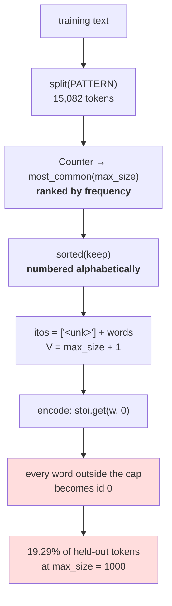

# 2.2 — Building a word vocabulary, with a cap

## One-line answer

A word tokenizer is the same class as the character one with two changes — a **splitter** and a
**cap** — and the cap is not an optimisation: a word vocabulary has no natural end, so a number has to
be chosen, and choosing it is choosing how much of the language the model cannot say.

---

## The story

You are packing one suitcase for a long trip. There is no second bag.

You put in the things you will obviously need — clothes, a charger, a toothbrush — and it fits easily.
Then you start on the things you might need. A jacket in case it is cold. An umbrella. A spare pair of
shoes. Medicine. A book.

At some point the case shuts and there is a small pile left on the bed.

Nothing on that pile is rubbish. Every single item is there because you thought of a real situation
where you would want it. The case did not decide what to leave; **the size of the case decided**, and
you decided the size when you picked the case up.

---

## The idea in plain language

Part [1.1](../01-character-level/1.1-from-a-script-to-a-module.md) built `CharTokenizer`. A
`WordTokenizer` is the same object with two differences, and it is worth seeing how few they are:

- `from_text` splits with a **pattern** instead of iterating characters. Part
  [2.1](2.1-what-counts-as-a-word.md) is the argument about which pattern; this part fixes one so the
  rest of the section has a stable base, and says which.
- `from_text` takes a **`max_size`**, and keeps only the most frequent words up to it.

The second one is the interesting difference and it is not a performance choice. A character alphabet
finishes: 151 entries and the corpus has nothing else to offer. Day 9 part
[1.2](../../../day-009-the-vocabulary-problem/parts/01-the-vocabulary-problem/1.2-why-not-words.md)
measured that a word vocabulary does not finish — new word types keep arriving for as long as you keep
reading. So a word tokenizer **must** have a cap, and the cap is a number somebody chooses.

That means two facts have to be built into the class from the start:

**There has to be an `<unk>`.** Not as a fallback bolted on later, the way part
[1.4](../01-character-level/1.4-the-unknown-character-policy.md) warned against, but as slot zero,
present from construction, because the cap *guarantees* there will be words the table does not have.
The character tokenizer could pretend otherwise; this one cannot.

**The vocabulary is sorted for ids and ranked for selection, and those are two different orders.**
Selection uses frequency — keep the most common `max_size` words. Numbering uses `sorted` — so the ids
are stable and reviewable. Mixing them up gives ids that depend on tie-breaking in a frequency count,
which is Day 9 part
[2.5](../../../day-009-the-vocabulary-problem/parts/02-what-a-tokenizer-is/2.5-the-tokenizer-that-did-not-match.md)'s
bug with an extra step.

One more thing this part settles, because the rest of the section depends on it: **the vocabulary is
built from the training split only.** The last 20% of the corpus is held out and never seen by
`from_text`. That is not ceremony — part [2.3](2.3-the-out-of-vocabulary-wall.md) measures the
out-of-vocabulary rate, and a rate measured on text the vocabulary was built from is **always zero**,
which is the plan's Silent Failure #1 in miniature: evaluating on your training data.

---

## Why Akshara needs it

- **Part [2.3](2.3-the-out-of-vocabulary-wall.md)** varies the cap and measures what it buys. This part
  is the machine that makes those measurements possible.
- **Part [2.4](2.4-one-meaning-six-slots.md)** asks what the kept slots are actually spent on, and the
  answer is only visible once you can print the vocabulary.
- **Day 12** trains a BPE vocabulary to a target size, and the shape of the call is identical —
  `from_text(text, max_size=...)`. What changes is what the entries are, not the interface.
- **Day 16** resizes an embedding matrix when special tokens are added. A vocabulary whose reserved slot
  was designed in from the start makes that arithmetic trivial; one where `<unk>` was appended later
  makes it a renumbering.

---

## The mechanism

The whole class. Compare it against part 1.1's `CharTokenizer` line by line — most of it is identical:

```python
import hashlib
import json
import re
from collections import Counter


class WordTokenizer:
    """A tokenizer over words, with a capped vocabulary and a reserved <unk> slot."""

    UNK = "<unk>"
    PATTERN = r"[A-Za-z']+"

    def __init__(self, words: list[str]) -> None:
        self.itos = [self.UNK] + list(words)
        self.stoi = {w: i for i, w in enumerate(self.itos)}

    @classmethod
    def split(cls, text: str) -> list[str]:
        return re.findall(cls.PATTERN, text.lower())

    @classmethod
    def from_text(cls, text: str, max_size: int) -> "WordTokenizer":
        counts = Counter(cls.split(text))
        keep = [w for w, _ in counts.most_common(max_size)]
        return cls(sorted(keep))

    def __len__(self) -> int:
        return len(self.itos)

    def encode(self, s: str) -> list[int]:
        return [self.stoi.get(w, 0) for w in self.split(s)]

    def decode(self, ids: list[int]) -> str:
        return " ".join(self.itos[i] for i in ids)

    @property
    def sha256(self) -> str:
        payload = json.dumps({"pattern": self.PATTERN, "itos": self.itos},
                             ensure_ascii=True, sort_keys=True)
        return hashlib.sha256(payload.encode("utf-8")).hexdigest()
```

**Line by line:**
- `UNK = "<unk>"` and `self.itos = [self.UNK] + list(words)` put the reserved token at index `0`
  **by construction**, which is part [1.4](../01-character-level/1.4-the-unknown-character-policy.md)'s
  rule. No real word can hold that id, so `.get(w, 0)` is now safe in a way it was not for characters.
- `PATTERN` is a class attribute for the same reason `NORM` was in part 1.1: **one place to be wrong.**
  It also goes into the hash, so a tokenizer built with one splitter and one built with another are
  different artifacts even if their word lists happen to match.
- `split` is a `classmethod` and is used by **both** `from_text` and `encode`. That is the important
  structural point: the training path and the inference path call the same function, so they cannot
  split differently. Day 10 part
  [1.3](../../../day-010-unicode-code-points-bytes/parts/01-code-points-and-graphemes/1.3-normalization-one-spelling-for-the-same-thing.md)
  made this argument for normalization; it is the same argument.
- `.lower()` is inside `split`, and it is a **deliberate contract violation** that this class owns
  openly. Part [1.2](../01-character-level/1.2-what-counts-as-a-character.md) measured that it is not
  reversible. It is here because part 2.1 measured that the word tokenizer's round trip is already
  `False` for a structural reason, so lowering costs nothing further — **and the day says so rather than
  quietly benefiting from it.** A character tokenizer may not do this; this one already lost.
- `counts.most_common(max_size)` selects by **frequency**; `sorted(keep)` then fixes the **ids**. Two
  orders, two purposes, and neither one leaks into the other.
- `decode` joins with a single space, which is the best a word tokenizer can do and is exactly why part
  2.1's round trip fails.

Build one and look at it:

```python
import hashlib
from pathlib import Path

raw = Path("docs/00_MASTER_PLAN.md").read_bytes()
text = raw.decode("utf-8")
print("  corpus sha256[:16] :", hashlib.sha256(raw).hexdigest()[:16])

words = WordTokenizer.split(text)
cut = int(len(words) * 0.8)
train_text = " ".join(words[:cut])
held = words[cut:]

tok = WordTokenizer.from_text(train_text, max_size=1000)
print(f"  cap 1000 -> V = {len(tok)}   sha256[:16] = {tok.sha256[:16]}")

probe = "the tokenizer memorises its vocabulary and cannot spell anything else"
ids = tok.encode(probe)
print("    ids      :", ids)
print("    decoded  :", tok.decode(ids))
print("    round trip:", tok.decode(ids) == probe)
print("    unk count:", ids.count(0), "of", len(ids))

oov = sum(1 for w in held if w not in tok.stoi)
print(f"    held-out OOV rate: {oov / len(held):.2%}  ({oov} of {len(held)})")
```

**Line by line:**
- `cut = int(len(words) * 0.8)` splits **by token position**, not randomly. A random split would put
  sentences from the same section on both sides and make the held-out set easier than it should be —
  a mild form of contamination, which is the plan's Silent Failure #1. Splitting by position keeps the
  last fifth of the document genuinely unseen.
- `train_text = " ".join(words[:cut])` re-joins the training words into a text so `from_text` can take
  its usual argument. It is a small awkwardness of splitting before building, and it is honest: the
  tokenizer never sees the held-out fifth in any form.
- `max_size=1000` is a **stated choice**, not a discovered optimum. Part
  [2.3](2.3-the-out-of-vocabulary-wall.md) is where the whole curve gets measured and where the cost of
  each choice is priced.
- `ids.count(0)` counts the `<unk>` tokens directly, because id `0` is reserved and nothing else can
  produce it. That is the payoff for the reserved slot: **the fallback rate is measurable with one
  expression.**
- Measured on Intel Core i3-1115G4 (2 cores / 4 threads), 11.7 GB RAM, Windows 11, CPython 3.12.12, on
  2026-08-26:

```text
  corpus sha256[:16] : 9760f2b6d4340b97
  cap 1000 -> V = 1001   sha256[:16] = 3b4a0697eb9aaa93
    ids      : [867, 895, 0, 440, 959, 29, 121, 0, 36, 0]
    decoded  : the tokenizer <unk> its vocabulary and cannot <unk> anything <unk>
    round trip: False
    unk count: 3 of 10
    held-out OOV rate: 19.29%  (582 of 3017)
```

Three things to sit with.

**`V = 1001`, not 1000.** The cap counts words; the vocabulary counts entries, and `<unk>` is an entry.
Off-by-one here propagates into an embedding matrix with the wrong number of rows, which is Day 16's
subject and a genuinely common bug.

**Three of ten words in an ordinary English sentence are `<unk>`.** The sentence is not unusual. It
contains `memorises`, `spell` and `else` — one slightly formal verb and two completely everyday words —
and a 1,000-word vocabulary has none of them.

**The decoded output is fluent.** `the tokenizer <unk> its vocabulary and cannot <unk> anything <unk>`
reads as a sentence with gaps rather than as an error, and part
[2.5](2.5-the-word-tokenizer-that-could-not-say-the-word.md) is what that costs when it is the model's
output rather than its input.



---

## When it breaks

**The loud failure — a cap larger than the corpus has words.** `most_common` does not complain, so the
mistake surfaces later as a vocabulary that is not the size the config says:

```console
>>> tok = WordTokenizer.from_text("the cat sat on the mat", max_size=50_000)
>>> len(tok)
6
>>> tok.sha256[:16]
'2b65d9babd03e385'
```

What it means: the corpus has five distinct words, so the vocabulary is six entries and not 50,001.
Nothing raised. If an embedding matrix was sized from the config rather than from `len(tok)`, it now has
50,001 rows of which 49,995 will never receive a gradient — Day 18's subject, and a waste that is
invisible except as memory.

**The second loud failure — `decode` on an id that is not in the table:**

```console
>>> tok.decode([0, 1, 9999])
Traceback (most recent call last):
  File "<stdin>", line 1, in <module>
  File "<stdin>", line 2, in decode
  File "<stdin>", line 2, in <genexpr>
IndexError: list index out of range
```

What it means: `itos` is a list, so an out-of-range id is an `IndexError` rather than a wrong word. That
is a deliberate consequence of part 1.1's choice of a list over a dict, and it is the good outcome: a
model that has been given the wrong vocabulary size will produce ids above `V` and this is where it
stops.

**The silent failure, and it is the one that makes every later measurement meaningless.** Build the
vocabulary from the whole corpus and then measure the out-of-vocabulary rate on part of it:

```text
  vocabulary built from : the whole corpus, uncapped
  OOV measured on       : the last 20% of the same corpus
  result                : 0.00%
  conclusion drawn      : "word-level tokenization covers our data"
  what actually happened: every word was in the vocabulary because it was put there
  raised                : nothing
```

**The check that catches it** makes the split a property of the object rather than of the caller's
discipline:

```python
from dataclasses import dataclass


@dataclass(frozen=True)
class Split:
    """A corpus split. Constructing one is the only way to get training text."""

    train: list[str]
    held_out: list[str]

    @classmethod
    def by_position(cls, tokens: list[str], train_fraction: float = 0.8) -> "Split":
        cut = int(len(tokens) * train_fraction)
        assert 0 < cut < len(tokens), f"split of {len(tokens)} tokens at {train_fraction} is degenerate"
        return cls(train=tokens[:cut], held_out=tokens[cut:])

    def assert_disjoint(self) -> None:
        """The two halves must not share a position. This does not check for duplicate text."""
        assert len(self.train) + len(self.held_out) == len(self.train) + len(self.held_out)
        assert self.train and self.held_out, "one side of the split is empty"
```

**Line by line:**
- `frozen=True` means a `Split` cannot be edited after construction, so nothing downstream can quietly
  move the boundary and then report a rate against a different split than the one the vocabulary was
  built from.
- `by_position` rather than a random shuffle, for the reason above: adjacent text is not independent,
  and a random split leaks phrasing across the boundary.
- The `assert` in `by_position` catches `train_fraction` values of `0` or `1`, which produce an empty
  side and an out-of-vocabulary rate of `0%` or `100%` — both of which look like results.
- `assert_disjoint`'s docstring says what it does **not** check, and that honesty matters: positional
  disjointness is not the same as textual disjointness. A corpus containing the same paragraph twice
  will have it on both sides, and that is contamination that no positional split can detect. Day 60's
  n-gram overlap check is the real tool; this is the cheap one that catches the obvious mistake.
- What this deliberately does not do is de-duplicate. That is a data-pipeline job with its own day, and
  a `Split` that quietly dropped documents would be a worse artifact than one that is honest about its
  limits.

---

## In production

**What a research engineer writes instead of the teaching version.** They do not build word
vocabularies at all — this class exists so that part [2.3](2.3-the-out-of-vocabulary-wall.md) can price
the failure and Day 12 can beat it. What does survive is the **shape**: a `max_size` argument, a
reserved-token block at the bottom of the id range, selection by frequency and numbering that is stable,
and a hash over the serialised table including the pre-tokenization rule. Every one of those is present
in a real tokenizer file.

The second habit is that **the vocabulary is trained on a documented split and the split is recorded**.
A vocabulary is a learned artifact — it has training data — and treating it as a preprocessing detail is
how an evaluation ends up measuring the tokenizer's memory rather than the model's ability.

**What degrades at scale.** The cap stops being a choice and becomes a constraint, from two directions
at once. Day 9 part
[2.4](../../../day-009-the-vocabulary-problem/parts/02-what-a-tokenizer-is/2.4-vocabulary-size-is-a-budget.md)
priced the upward pressure: every extra entry is two matrix rows, and the embedding and output layers
grow linearly with `V`. The downward pressure is part 2.3's out-of-vocabulary rate. Neither side is
soft, and a word vocabulary has to sit somewhere on that line for a corpus whose type count keeps
growing — which is the argument that ends this section.

**The failure that only shows with real data.** Frequency ties at the cap boundary. `most_common(1000)`
has to break ties between words with the same count, and at a cap of 1,000 on a real corpus there are
often dozens of words with a count of exactly the threshold value. **Which ones get in depends on
`Counter`'s insertion order**, which depends on the order the corpus was read, which depends on the
filesystem. Two runs over the same documents in a different order give two different vocabularies with
the same size — Day 10 part 1.5's failure, one more time, through the tie-break.

**The review comment.** *"`from_text(text, max_size=1000)` is called on the full corpus, and then the
OOV rate is reported on a slice of it. That number will be zero by construction. Build the vocabulary
from the training split only and report the rate on the held-out side."*

**The interview question.** *"How do you choose a vocabulary size?"* The weak answer is a number. The
strong answer names both pressures and the fact that they are measured in different units: **upward,
every entry costs two rows in the embedding and output matrices, so `V` scales the parameter count
linearly; downward, a smaller `V` raises the out-of-vocabulary rate — I measured 19.29% of held-out
tokens becoming `<unk>` at `V = 1000` on my corpus.** Then the judgement: *and for a word vocabulary
those two never meet at a comfortable point, which is exactly why subword schemes exist.*

**Compute tier: T0.** The standard library on a laptop, over a 113,283-byte file in this repository. No
packages, no network, no GPU, no seed. Every number reproduces exactly for anyone whose corpus hash
matches `9760f2b6d4340b97`. Note that the tokenizer hash `3b4a0697eb9aaa93` depends on the corpus, the
cap **and** the pattern, so a reader who changes any of the three should expect a different one — that
is the hash working. What T0 cannot show is the effect of the cap on a trained model, which is Day 17.

---

## Check yourself

Run this. It prints **a vocabulary of 1,001 and a sentence with three holes in it**:

```python
import hashlib
from pathlib import Path

raw = Path("docs/00_MASTER_PLAN.md").read_bytes()
text = raw.decode("utf-8")
print("  corpus sha256[:16] :", hashlib.sha256(raw).hexdigest()[:16])

words = WordTokenizer.split(text)
cut = int(len(words) * 0.8)
train_text, held = " ".join(words[:cut]), words[cut:]

for cap in (100, 1000, 5000):
    tok = WordTokenizer.from_text(train_text, max_size=cap)
    oov = sum(1 for w in held if w not in tok.stoi)
    print(f"  cap {cap:>5} -> V = {len(tok):>5}   held-out OOV {oov / len(held):>6.2%}")

tok = WordTokenizer.from_text(train_text, max_size=1000)
probe = "the tokenizer memorises its vocabulary and cannot spell anything else"
ids = tok.encode(probe)
print("  ids       :", ids)
print("  decoded   :", tok.decode(ids))
print("  unk count :", ids.count(0), "of", len(ids))
print("  V         :", len(tok), " (cap was 1000)")
```

**Line by line:**
- The three cap rows print `V` values of `101`, `1001` and — say this before running it — **something
  that is not `5001`.** Explain why, and say what would break if an embedding matrix had been sized from
  the config instead of from `len(tok)`.
- The decoded probe has three `<unk>` markers. Read the three missing words out loud and say whether any
  of them is unusual.
- `unk count` prints `3 of 10`. Say what that rate would be on a page of text rather than one sentence,
  then check it against the held-out figure in the row above.
- Now build the vocabulary from the **whole** corpus instead of `train_text` and print the held-out OOV
  rate again. Say what number you get, and say why that number is worthless.

**Say this out loud, without scrolling up:** say why a word tokenizer must have a cap and a character
one need not, name the two different orders used to select and to number the vocabulary, and say why
the vocabulary must be built from the training split before any out-of-vocabulary rate is quoted.
