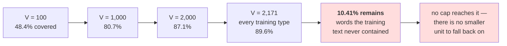

# 2.3 — The out-of-vocabulary wall

## One-line answer

Growing a word vocabulary buys coverage at a punishing exchange rate — measured on held-out text,
**100 words cover 48.4%, 1,000 cover 80.7%, and 2,000 cover 87.1%** — and keeping *every* word the
training split contained still leaves **10.41%** of held-out tokens unrepresentable, which is the wall:
it is not reached by spending more slots.

---

## The story

You run a shop selling spare parts for household things — taps, fans, mixer jars, pressure cookers.

You cannot stock everything, so you stock what people ask for most. The hundred commonest parts fit on
the shelves easily, and about half the people who come in leave with what they wanted.

You expand. A thousand parts now, four times the shelving, and four in five customers leave happy.
Better. So you expand again, to two thousand, and it moves to about seven in eight.

Then you do the thing that should settle it: you stock **one of everything anybody asked for last
year.** Every single part, no cap.

One customer in ten still leaves empty-handed. They wanted something nobody asked for last year.

---

## The idea in plain language

Part [2.2](2.2-building-a-word-vocabulary.md) built a vocabulary with a cap and measured one point:
19.29% of held-out tokens were `<unk>` at `max_size = 1000`. This part varies the cap and looks at the
whole curve, because a single point makes the problem look like a tuning question.

Two definitions first, because they are two views of the same number and people slide between them.
**Out-of-vocabulary rate** is the fraction of held-out *tokens* the vocabulary cannot represent.
**Coverage** is one minus that. A coverage of 80.71% means four in five word occurrences are
representable — and note it counts occurrences, not distinct words: common words are covered first, so
coverage rises much faster than the fraction of the dictionary you have kept.

The curve measured below has two halves and the second one is the point of the part.

**The first half is ordinary diminishing returns.** Going from 100 to 1,000 slots — ten times the
vocabulary — takes coverage from 48.39% to 80.71%. Going from 1,000 to 2,000 takes it to 87.11%. Each
doubling buys less than the last, which is what Zipf's observation about word frequencies predicts and
is not by itself an argument against anything.

**The second half is the wall.** Set the cap to infinity. Keep every one of the 2,171 word types the
training split contained. The out-of-vocabulary rate does not go to zero — measured below, it goes to
**10.41%**, and it stops there.

That floor is not a tuning failure and no cap can move it, because it is not caused by the cap. It is
caused by the held-out text containing words the training text did not. Day 9 part
[1.2](../../../day-009-the-vocabulary-problem/parts/01-the-vocabulary-problem/1.2-why-not-words.md)
measured why that keeps happening: word types never stop arriving. **The vocabulary is finite and the
language is not**, so there is always a next word, and a word-level tokenizer has no way to represent it
even in principle — there is no smaller piece to fall back on.

That last clause is the whole difference between this failure and the character tokenizer's in part
[1.5](../01-character-level/1.5-the-character-tokenizer-that-met-a-new-alphabet.md). The character
tokenizer failed on a *script* it had never seen and would have been fine had the corpus contained one
example of each letter. The word tokenizer fails on **ordinary English words in the language it was
trained on**, and adding examples does not close the gap, it only moves it.

---

## Why Akshara needs it

- **Part [2.5](2.5-the-word-tokenizer-that-could-not-say-the-word.md)** shows what a token that cannot
  be represented does to the model's *output*, which is where an input problem becomes a capability
  problem.
- **Part [3.1](../03-together/3.1-two-tokenizers-one-table.md)** puts `10.41%` in a column next to the
  character tokenizer's `0.00%`, and next to the sequence length that bought it.
- **Day 12–13** exist because of this floor. A subword vocabulary is the answer to "what do you fall
  back on", and Day 13's byte-level version drives the floor to exactly zero rather than to a small
  number.
- **Day 17** measures the same curve for a trained subword tokenizer, and the comparison against this
  one is the point of that measurement.

---

## The mechanism

One split, six caps, one number each:

```python
import hashlib
import re
from collections import Counter
from pathlib import Path

raw = Path("docs/00_MASTER_PLAN.md").read_bytes()
text = raw.decode("utf-8")
print("  corpus sha256[:16] :", hashlib.sha256(raw).hexdigest()[:16])

words = re.findall(r"[A-Za-z']+", text.lower())
cut = int(len(words) * 0.8)
train, held = words[:cut], words[cut:]
print("  train tokens:", len(train), " held-out tokens:", len(held))

train_counts = Counter(train)
print(f"    {'V cap':>7} {'kept types':>11} {'OOV tokens':>11} {'OOV rate':>9} {'coverage':>9}")
for cap in (100, 250, 500, 1000, 2000, len(train_counts)):
    keep = {w for w, _ in train_counts.most_common(cap)}
    oov = sum(1 for w in held if w not in keep)
    print(f"    {cap:>7} {len(keep):>11} {oov:>11} {oov / len(held):>8.2%} "
          f"{1 - oov / len(held):>8.2%}")
```

**Line by line:**
- `train` and `held` come from the **positional** split part 2.2 argued for. The vocabulary is built
  only from `train`; every rate is measured only on `held`. Swap either and the numbers become
  meaningless in the specific way part 2.2's silent failure describes.
- The last cap is `len(train_counts)` — **every type in the training split**, no cap at all. That row is
  the whole point of the table and it is why the loop is written with a computed final entry rather than
  a list of round numbers.
- `keep` is a `set` and the test is `w not in keep`, so the count is over **tokens** — occurrences —
  rather than types. Counting types instead would give a much worse-looking and much less relevant
  number.
- Measured on Intel Core i3-1115G4 (2 cores / 4 threads), 11.7 GB RAM, Windows 11, CPython 3.12.12, on
  2026-08-26:

```text
  corpus sha256[:16] : 9760f2b6d4340b97
  train tokens: 12065  held-out tokens: 3017
      V cap  kept types  OOV tokens  OOV rate  coverage
        100         100        1557   51.61%   48.39%
        250         250        1206   39.97%   60.03%
        500         500         913   30.26%   69.74%
       1000        1000         582   19.29%   80.71%
       2000        2000         389   12.89%   87.11%
       2171        2171         314   10.41%   89.59%
```

Read the table from the bottom up, because that is where the argument is.

**The last row has no cap.** Every word the training text contained is in the vocabulary — 2,171 of
them — and **314 held-out tokens still have no id.** That is 10.41%, or roughly one word in ten of
ordinary text from the same document, and there is no larger number you could have set to fix it.

**The second-to-last row is the exchange rate.** Going from 2,000 slots to 2,171 — the last 171 types,
every one of them a word that appeared in training — buys 2.48 percentage points. Day 9 part
[2.4](../../../day-009-the-vocabulary-problem/parts/02-what-a-tokenizer-is/2.4-vocabulary-size-is-a-budget.md)
priced what a slot costs in parameters; this is what it buys in coverage, and the two do not meet
anywhere comfortable.

**The first row is the reason small vocabularies feel workable in demos.** A hundred words already cover
nearly half of all word occurrences, because the commonest words are enormously common — `the` alone
occurs 914 times in this corpus. Coverage of *occurrences* rises fast; coverage of *the language* does
not.

Now look at which words fall outside, because the aggregate hides something important:

```python
keep = {w for w, _ in train_counts.most_common(1000)}
in_vocab = [w for w in held if w in keep]
out_vocab = [w for w in held if w not in keep]
oov_types = Counter(out_vocab)

print("    distinct OOV types in held-out :", len(oov_types))
print("    12 most frequent OOV words     :", [w for w, _ in oov_types.most_common(12)])
print("    mean length, in-vocabulary word:",
      f"{sum(len(w) for w in in_vocab) / len(in_vocab):.2f}")
print("    mean length, OOV word          :",
      f"{sum(len(w) for w in out_vocab) / len(out_vocab):.2f}")
```

**Line by line:**
- The mean-length comparison is the measurement worth taking away from this part. It is a one-line proxy
  for "how informative is the word", because in English longer words carry more specific meaning than
  shorter ones.
- `oov_types.most_common(12)` shows the actual words rather than a count, because the list is more
  convincing than the number — every one of them is a word a reader would expect a language model to
  know.
- Measured on this machine, 2026-08-26:

```text
    distinct OOV types in held-out : 431
    12 most frequent OOV words     : ['papers', 'scene', 'append', 'progress', 'six', 'me',
                                      'foundation', 'twenty', 'whose', 'forgotten', 'missing',
                                      'regenerated']
    mean length, in-vocabulary word: 4.07
    mean length, OOV word          : 6.60
```

**The words you lose are 62% longer than the words you keep.** `me`, `six` and `whose` are in that list,
which is a reminder that the cut is by frequency and not by importance — but the bulk of it is
`foundation`, `forgotten`, `regenerated`, `progress`: the content words. Day 9 part 1.2 made this point
in prose; here it is as two numbers.

The wall, drawn:



---

## When it breaks

**The loud failure — there is not one, and that is the finding.** Every row of that table came from code
that ran cleanly. `encode` returns ids, `decode` returns text, nothing raises at any cap. The word
tokenizer's failure mode is entirely silent by construction, because part 2.2 built the `<unk>` slot in
from the start precisely so that it would not raise.

The nearest thing to a loud failure is measuring the rate against the wrong split, and it fails by
returning a number that is too good:

```console
>>> vocab = {w for w, _ in Counter(words).most_common(1000)}   # built from ALL words
>>> held = words[int(len(words) * 0.8):]
>>> sum(1 for w in held if w not in vocab) / len(held)
0.12330129267484256
```

What it means: the vocabulary saw the held-out text, so the rate is optimistic — `12.33%` against the
honest `19.29%`. It is not zero, because the cap still bites, which makes it **more** dangerous than an
obviously-broken zero: it looks like a plausible measurement.

**The silent failure that matters in a pipeline** is not measuring the rate at all. The wrong output is
a report:

```text
  vocabulary size      : 1,000
  training loss        : looks healthy
  held-out perplexity  : looks healthy
  <unk> rate           : never computed
  what it actually was : 19.29% of held-out tokens
  what the loss means  : the model was rewarded for predicting <unk>, which is easy and frequent
```

Day 9 part
[1.5](../../../day-009-the-vocabulary-problem/parts/01-the-vocabulary-problem/1.5-the-vocabulary-that-could-not-spell.md)
measured the direction of that bias: a higher `<unk>` rate *lowers* reported loss. So a vocabulary that
is too small looks better on the metric than one that is right, and the only thing that distinguishes
them is the number nobody computed.

**The check that catches it** is a report the training script cannot run without:

```python
from dataclasses import dataclass


@dataclass(frozen=True)
class CoverageReport:
    """Everything you must know about a vocabulary before training on it."""

    vocab_size: int
    held_out_tokens: int
    oov_tokens: int

    @property
    def oov_rate(self) -> float:
        return self.oov_tokens / self.held_out_tokens

    def assert_acceptable(self, max_oov_rate: float) -> None:
        assert self.oov_rate <= max_oov_rate, (
            f"V={self.vocab_size}: {self.oov_rate:.2%} of held-out tokens are <unk> "
            f"({self.oov_tokens} of {self.held_out_tokens}); "
            f"the loss will be flattered by exactly this fraction"
        )


def measure_coverage(tok, held_out: list[str]) -> CoverageReport:
    return CoverageReport(
        vocab_size=len(tok),
        held_out_tokens=len(held_out),
        oov_tokens=sum(1 for w in held_out if w not in tok.stoi),
    )
```

**Line by line:**
- The report stores **counts** and derives the rate, rather than storing the rate. A stored rate cannot
  be re-aggregated across sources; counts can, and part
  [1.4](../01-character-level/1.4-the-unknown-character-policy.md) established that per-source
  breakdown is the thing that matters.
- `assert_acceptable` takes the threshold as an argument with **no default**, so a caller has to state
  what they consider acceptable. A default here would become the industry standard by accident.
- The failure message says *"the loss will be flattered by exactly this fraction"* rather than just
  reporting the number, because the person reading it at three in the morning needs to know that their
  metric is not just noisy but biased in a known direction.
- `measure_coverage` takes the held-out tokens as an argument rather than reaching for a global, so it
  is impossible to accidentally pass the training split — the caller has to name which list they mean.
- What this deliberately does **not** do is choose a cap for you. There is no optimum to find: the table
  above has no knee, only a floor, and a function that returned a "recommended vocabulary size" would be
  inventing a number.

---

## In production

**What a research engineer writes instead of the teaching version.** They do not tune this curve,
because the floor at 10.41% is the answer to whether word-level tokenization is viable and the answer is
no. What they keep is the **measurement**: an out-of-vocabulary or fallback rate computed on a held-out
sample, per source and per language, recorded alongside the vocabulary. For a subword tokenizer that
number should be zero or near it, and a non-zero value is a signal that the pre-tokenizer or the
normalizer is dropping something.

The second habit is that **the coverage number and the vocabulary ship together**. A vocabulary file
without a recorded coverage measurement invites the next person to assume it is fine, and the
measurement is cheap — one pass over a held-out sample.

**What degrades at scale.** The floor rises rather than falls. A bigger corpus gives more types, so the
cap has to grow to keep the same coverage — Day 9 measured that types keep arriving — but the held-out
text also contains more unseen words, from more sources and more domains. The 10.41% measured on one
technical document is optimistic for a general corpus, because this text is unusually repetitive and
narrow. **A coverage figure is a property of a corpus pair**, not of a tokenizer, and quoting it without
both is meaningless.

**The failure that only shows with real data.** Domain shift. A vocabulary built on one kind of text and
used on another has a much higher out-of-vocabulary rate than the held-out figure predicts, and the
held-out figure will not warn you, because held-out text from the same document is the *easiest*
possible test. Names, places, product identifiers, code and numbers are all effectively infinite sets,
and every one of them is absent from a curated training split.

**The review comment.** *"The vocabulary is capped at 1,000 and we do not log the `<unk>` rate. On
held-out text that is 19.29% of tokens — nearly one word in five — and it will make the loss look better
than it is. Log the rate per source and put it next to the loss on the dashboard."*

**The interview question.** *"You increased the vocabulary from 1,000 to 2,000 and out-of-vocabulary
dropped from 19% to 13%. What do you do next?"* The weak answer is "keep increasing it". The strong
answer identifies the shape of the curve: **coverage rises with diminishing returns and then stops —
keeping every type in my training split still left 10.41% of held-out tokens unrepresentable, so the
remaining gap is not a cap problem and no vocabulary size closes it.** Then the conclusion: *the fix is
a unit that can compose — subwords, or bytes underneath them — so that an unseen word is spelled rather
than replaced.*

**Compute tier: T0.** The standard library on a laptop, over a 113,283-byte file in this repository. No
packages, no network, no GPU, no seed, no training run. Every number reproduces exactly for anyone whose
corpus hash matches `9760f2b6d4340b97`. **All of these figures are properties of this corpus pair and
not of word-level tokenization in general** — a larger, more varied corpus gives a higher floor, not a
lower one, and that direction is the claim. What T0 cannot show is what a 19.29% `<unk>` rate does to a
trained model's quality; Day 9 part 1.5 established the direction of the metric bias by arithmetic, and
Day 17 measures the magnitude with runs.

---

## Check yourself

Run this. It prints **a coverage curve that stops before it reaches 100%**:

```python
import hashlib
import re
from collections import Counter
from pathlib import Path

raw = Path("docs/00_MASTER_PLAN.md").read_bytes()
text = raw.decode("utf-8")
print("  corpus sha256[:16] :", hashlib.sha256(raw).hexdigest()[:16])

words = re.findall(r"[A-Za-z']+", text.lower())
cut = int(len(words) * 0.8)
train, held = words[:cut], words[cut:]
counts = Counter(train)

for cap in (100, 1000, 2000, len(counts)):
    keep = {w for w, _ in counts.most_common(cap)}
    oov = sum(1 for w in held if w not in keep)
    print(f"  V {cap:>5} -> coverage {1 - oov / len(held):>7.2%}   OOV {oov:>5} tokens")

keep = {w for w, _ in counts.most_common(1000)}
out_vocab = [w for w in held if w not in keep]
in_vocab = [w for w in held if w in keep]
print("  mean length in/out :",
      f"{sum(map(len, in_vocab)) / len(in_vocab):.2f}",
      f"{sum(map(len, out_vocab)) / len(out_vocab):.2f}")
print("  first 12 lost      :", [w for w, _ in Counter(out_vocab).most_common(12)])
```

**Line by line:**
- The last row uses `len(counts)` — no cap at all. **Say out loud what coverage you expected from an
  uncapped vocabulary before you ran it, and what you got.**
- The `mean length in/out` line prints `4.07` and `6.60`. Say what that says about which words are being
  lost, and say whether a frequency cut is the same as an importance cut.
- Read the twelve lost words out loud. Say how many of them you would consider unusual English.
- Now rebuild `counts` from **all** the words instead of `train` and print the curve again. Say which
  direction every number moves, and say why that version of the measurement is worthless.

**Say this out loud, without scrolling up:** state the coverage at `V = 1000` and the coverage with no
cap at all, explain in one sentence why the second number is not 100%, and say what property a
tokenizer needs for that floor to be zero instead.
