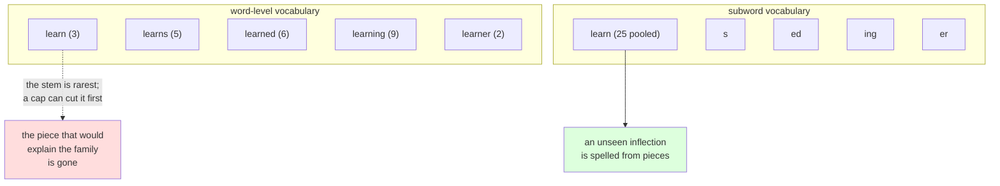

# 2.4 — One meaning, six slots

## One-line answer

A word vocabulary spends separate slots on `learn`, `learns`, `learned`, `learner` and `learning` as
though they were unrelated — measured here, **338 of 2,171 types (15.57%)** are another vocabulary word
plus a common suffix — and the model has to learn from scratch, five times, a relationship that is
spelled out in the letters it was never shown.

---

## The story

A clothes shop sells one shirt design in six sizes.

Every size gets its own space on the shelf. Six spaces, six labels, six counts to keep. When a size runs
out, the shop cannot make more from the others — a large is not two smalls — so it orders that size
again and waits.

Across the road there is a tailor with bolts of the same cloth. No sizes on the shelf at all: one
material, cut to whoever walks in. Somebody unusually tall is not a problem, and no shelf space is spent
on sizes nobody asked for.

The shop's way is quicker at the counter, and every size it does not stock is a customer it cannot serve
at all. The tailor is slower every single time and can serve everyone.

---

## The idea in plain language

Part [2.3](2.3-the-out-of-vocabulary-wall.md) measured what a word vocabulary cannot cover. This part
asks the other question: **what are the slots it does have actually spent on?**

The answer, in English and much more so in other languages, is that a large fraction of them are spent
on **inflections** — the same word wearing a grammatical ending. `learn`, `learns`, `learned`,
`learning`, `learner` are five vocabulary entries. To a reader they are one word and four endings. To a
word-level tokenizer they are five unrelated symbols, as unrelated as `learn` and `bicycle`.

Two terms, defined now. A **stem** is the part of a word that carries its meaning; a **suffix** is an
ending attached to it. **Morphology** is the study of how words are built from those pieces. English has
relatively little of it — a handful of endings — and even so, measured below, **15.57% of this
vocabulary is a stem-plus-suffix form of another entry in the same vocabulary.**

Three separate costs follow, and they are worth separating because people usually name only the first.

**Slots.** 338 entries in a 2,171-entry vocabulary are inflected forms. At a cap of 1,000 those slots
are competing against words that carry new meaning, and part 2.3 measured what losing that competition
does.

**Statistics.** This is the expensive one. A word-level model sees the five forms as unrelated symbols,
so **the evidence about the concept is split across five entries** and each one is learned from a
fraction of the data. Measured below, no form of `learn` in this corpus occurs more than 9 times while
the family occurs 25 times between them — so every one of the five is a rare token carrying a
concept that is not rare at all.

**Generalisation.** A model that has seen `learn`, `learns` and `learned` has, at the word level, no
mechanism at all for guessing `learning`. The relationship is spelled out in the letters, and the word
tokenizer threw the letters away. So the word tokenizer's failure in part 2.3 was not just "the word is
missing" — it is "the word is missing *and* the four related words it saw ten thousand times cannot
help".

That third cost is the one that makes this a `production`-level part rather than a curiosity, and it is
the positive argument for subwords rather than merely an argument against words. **A tokenizer that
splits `learning` into `learn` and `ing` gets all three costs back at once**: one slot for the stem, all
the statistics pooled on it, and an unseen inflection spelled from pieces it already knows. Day 12 is
where that tokenizer starts to exist.

---

## Why Akshara needs it

- **Day 12** builds BPE, whose merges discover exactly these shared prefixes from frequency alone —
  without being told anything about grammar. This part is the phenomenon that makes that work.
- **Day 12**'s `TODO(me)` from Day 9 part 1.4 asked what you would rank candidate pieces by, given that
  raw word frequency never discovers a suffix like `ing`. The 338 forms measured here are what that
  question was about.
- **Part [3.1](../03-together/3.1-two-tokenizers-one-table.md)** needs this as the column the word
  tokenizer loses on that is not about coverage: even where it covers the text, it is spending its
  budget badly.
- **Day 17** measures multilingual token inflation. English is the easy case; the same measurement on a
  morphologically rich language is far worse, and this part is the baseline it is worse *than*.

---

## The mechanism

Find every vocabulary entry that is another entry plus a common English suffix:

```python
import hashlib
import re
from collections import Counter
from pathlib import Path

raw = Path("docs/00_MASTER_PLAN.md").read_bytes()
text = raw.decode("utf-8")
print("  corpus sha256[:16] :", hashlib.sha256(raw).hexdigest()[:16])

words = re.findall(r"[A-Za-z']+", text.lower())
train = words[:int(len(words) * 0.8)]
vocab = set(Counter(train))

SUFFIXES = ("s", "es", "ed", "ing", "er", "ers", "ly", "ion", "ions")

families: dict[str, set[str]] = {}
for w in sorted(vocab):
    for suf in SUFFIXES:
        if w.endswith(suf) and len(w) > len(suf) + 2:
            stem = w[: -len(suf)]
            if stem in vocab:
                families.setdefault(stem, set()).add(w)
                break

derived = sum(len(v) for v in families.values())
print(f"    vocabulary types             : {len(vocab)}")
print(f"    types that are stem + suffix : {derived}")
print(f"    share of the vocabulary      : {derived / len(vocab):.2%}")
print(f"    distinct stems with a family : {len(families)}")
```

**Line by line:**
- `SUFFIXES` is a hand-written list of nine common English endings. It is **not** a morphological
  analyser and the part does not pretend otherwise: it will miss irregular forms (`ran` from `run`),
  spelling changes (`running` has a doubled letter, `studies` changes `y` to `i`), and it will
  occasionally match by accident. **That makes every number here a lower bound**, which is the honest
  direction for the claim being made.
- `len(w) > len(suf) + 2` requires the stem to be at least three characters, which throws away
  coincidences like `is` = `i` + `s`. Without it the count roughly doubles with nonsense.
- `if stem in vocab` is the condition that matters: the form only counts if **both** the stem and the
  inflected form are separately in the vocabulary, spending two slots on one meaning. A form whose stem
  is absent is a different problem.
- `break` after the first matching suffix stops `learners` from being counted twice, once for `s` and
  once for `ers`. Order matters in `SUFFIXES` and the shorter endings come first, which is a choice —
  and, being a choice, it belongs in the walkthrough rather than in a comment.
- Measured on Intel Core i3-1115G4 (2 cores / 4 threads), 11.7 GB RAM, Windows 11, CPython 3.12.12, on
  2026-08-26:

```text
  corpus sha256[:16] : 9760f2b6d4340b97
    vocabulary types             : 2171
    types that are stem + suffix : 338
    share of the vocabulary      : 15.57%
    distinct stems with a family : 276
```

**One entry in six is a grammatical variant of another entry.** And that is with a crude nine-suffix
list on English, the least inflected major European language. The true figure is higher and the figure
for a morphologically rich language is much higher.

Look at the biggest families:

```python
big = sorted(families.items(), key=lambda kv: -len(kv[1]))[:6]
for stem, forms in big:
    print(f"      {stem:<10} + {sorted(forms)}")
```

**Line by line:**
- `key=lambda kv: -len(kv[1])` sorts by family size descending. Negating the length is the usual way to
  get a descending sort without `reverse=True`, and either is fine — what matters is that the tie order
  is then insertion order, which for a dict built from a `sorted` loop is alphabetical and therefore
  stable between runs.
- Measured on this machine, 2026-08-26:

```text
      learn      + ['learned', 'learner', 'learning', 'learns']
      work       + ['worked', 'workers', 'working', 'works']
      account    + ['accounted', 'accounting', 'accounts']
      check      + ['checked', 'checking', 'checks']
      contain    + ['contained', 'container', 'containing']
      look       + ['looked', 'looking', 'looks']
```

**`learn` costs five vocabulary slots.** Read that list the way the tokenizer sees it: five symbols with
no relationship, whose only connection is that a human can see they share four letters. The tokenizer
cannot see letters. It threw them away in part [2.1](2.1-what-counts-as-a-word.md).

Now the statistical cost, which is the one that does not show up in a slot count:

```python
counts = Counter(train)
for stem in ("learn", "work", "check"):
    forms = sorted(families.get(stem, set())) + [stem]
    total = sum(counts[f] for f in forms)
    detail = "  ".join(f"{f}={counts[f]}" for f in forms)
    print(f"    {stem:<7} pooled={total:<4}  {detail}")
```

**Line by line:**
- `total` is what a subword tokenizer sharing a stem token would see; the individual counts are what the
  word tokenizer sees. **The gap between them is the evidence the word tokenizer is throwing away.**
- The rarest form in each family is the one to look at: it is a rare token carrying a common concept,
  which is the worst possible position in a frequency-ranked vocabulary — likely to be cut by the cap in
  part 2.3, despite the concept being one the corpus discusses constantly.
- Measured on this machine, 2026-08-26:

```text
    learn   pooled=25    learned=6  learner=2  learning=9  learns=5  learn=3
    work    pooled=13    worked=2  workers=2  working=4  works=3  work=2
    check   pooled=25    checked=3  checking=2  checks=1  check=19
```

**Read the `learn` row again: the bare stem occurs 3 times and `learning` occurs 9.** The stem is
*rarer than its own inflections*, so a frequency-ranked cap can cut `learn` while keeping `learning` --
and the model is then holding a word it cannot take apart, having lost the piece that would have
explained it. No single form has more than 9 observations while the concept has 25 between them. A
subword tokenizer with a token for `learn` and a token for `ing` would need no extra slot and would
see the stem 25 times.



---

## When it breaks

**The loud failure — a suffix rule that eats the word.** Remove the length guard and the analysis stops
being an analysis:

```console
>>> vocab = {"is", "i", "as", "a", "us", "u"}
>>> [(w, w[:-1]) for w in vocab if w.endswith("s") and w[:-1] in vocab]
[('is', 'i'), ('as', 'a'), ('us', 'u')]
```

What it means: with no minimum stem length, every two-letter word ending in `s` is "an inflection". The
smallest fix is the `len(w) > len(suf) + 2` guard the working version has. The lesson is that **a
morphological rule with no length constraint matches noise**, and the resulting number will be large and
meaningless.

**The silent failure, which is the one this part is about.** Nothing raises anywhere. The vocabulary is
built, the model trains, the loss goes down, and the waste is invisible because there is nothing to
compare against — you cannot see the slots you did not need to spend. The wrong output is a design
review that concludes the opposite of the truth:

```text
  vocabulary   : 2,171 types, all legitimate English words
  observation  : "every entry is a real word, so nothing is wasted"
  what is true : 338 of them (15.57%) are inflections of other entries
  and worse    : 'learner' has 1 observation while the concept 'learn' has 87
  the model    : learns 'learner' as an unrelated rare symbol
  raised       : nothing, ever
```

**The check that catches it** is a report on the vocabulary itself, run before training:

```python
def morphology_report(vocab: set[str], counts: Counter,
                      suffixes: tuple[str, ...] = SUFFIXES) -> dict[str, object]:
    """How much of this vocabulary is grammatical variants of the rest of it?

    APPROXIMATE: a fixed suffix list, no irregular forms, no spelling changes.
    Every number is a LOWER BOUND on the real redundancy.
    """
    families: dict[str, set[str]] = {}
    for w in sorted(vocab):
        for suf in suffixes:
            if w.endswith(suf) and len(w) > len(suf) + 2 and w[: -len(suf)] in vocab:
                families.setdefault(w[: -len(suf)], set()).add(w)
                break
    derived = sum(len(v) for v in families.values())
    starved = [f for fam in families.values() for f in fam if counts[f] <= 2]
    return {
        "types": len(vocab),
        "derived_types_lower_bound": derived,
        "derived_share_lower_bound": derived / len(vocab) if vocab else 0.0,
        "forms_with_two_or_fewer_observations": len(starved),
    }
```

**Line by line:**
- The docstring says **APPROXIMATE** and says which direction the error goes. A number that is honestly
  a lower bound supports the argument being made here; the same number presented as exact would be a
  claim the method cannot support.
- Every key name carries `lower_bound`, so the qualifier survives being pasted into a spreadsheet. This
  is Day 10 part [3.1](../../../day-010-unicode-code-points-bytes/parts/03-together/3.1-one-string-five-layers.md)'s
  naming rule applied to a different kind of uncertainty.
- `forms_with_two_or_fewer_observations` is the number that actually predicts trouble. A family whose
  members are all frequent is merely wasteful; a family with a member seen once or twice is a token the
  model cannot learn and the cap will probably cut.
- `suffixes` is a parameter with a default rather than a hard-coded global, so the same function can be
  pointed at a different language's endings — which is the only way this report means anything outside
  English.
- What it deliberately does not do is **fix** anything. There is no fix at the word level; the report
  exists to make the case for changing tokenization scheme, which is Day 12.

---

## In production

**What a research engineer writes instead of the teaching version.** They do not do morphological
analysis at all, and they do not need to — a subword tokenizer discovers the shared pieces from
frequency, without a linguist, without a suffix list, and in every language at once. That is the single
most attractive property of BPE and it is why Day 12 comes next. What survives from this part is the
*ability to explain why* it works, which matters when somebody proposes a hand-built morphological
tokenizer for a specific language: it will be better for that language and it will need a new one for
every other.

The second habit is looking at the token frequency distribution of the vocabulary before training. Any
entry with a handful of observations is a row of the embedding matrix that will receive almost no
gradient — Day 18's subject — and a vocabulary full of them is a vocabulary in the wrong units.

**What degrades at scale.** Language, not corpus size. English has a few suffixes and this part measured
15.57%. A language with rich inflection — where a single verb has dozens of forms, or where words
routinely combine — has vastly more, so a word vocabulary of the same size covers far less of it. **The
word-level scheme is not equally bad everywhere; it is much worse for most of the world's languages than
it is for English**, and a design validated on English will look far better than it will behave. Day 17
measures that inflation properly.

**The failure that only shows with real data.** Compounding and agglutination. English mostly puts
spaces between its pieces, so `spare part` is two words. Languages that write compounds as one word
produce a genuinely unbounded set of valid word forms, and no cap and no corpus size makes a word
vocabulary work for them — the out-of-vocabulary floor from part 2.3 is not 10% there, it is far higher,
and it is structural.

**The review comment.** *"The vocabulary has `learn`, `learns`, `learned`, `learning` and `learner` as
five independent entries, and `learner` has one observation. We are spending five slots and splitting
the evidence five ways for one concept. This is the argument for moving to subwords before we tune the
cap any further."*

**The interview question.** *"Why do subword tokenizers work so well?"* The weak answer is "they handle
unknown words". The strong answer names all three gains and the mechanism: **a shared stem token pools
the statistics — in my corpus no single form of `learn` had more than 9 observations,
while the family had 25 between them — it frees the
slots the inflections were using, and it lets the model spell a form it has never seen from pieces it
knows.** Then the part that shows judgement: *and it finds those pieces from frequency alone, with no
grammar and no language-specific rules, which is why it works for languages nobody on the team speaks.*

**Compute tier: T0.** The standard library on a laptop, over a 113,283-byte file in this repository. No
packages, no network, no GPU, no seed. Every number reproduces exactly for anyone whose corpus hash
matches `9760f2b6d4340b97`. **The 15.57% is a lower bound produced by a nine-suffix heuristic, not a
morphological analysis**, and both the code and the report name it as such. What T0 cannot show is the
benefit of pooling those statistics in a trained model — that needs a run and it is Day 17; this part
establishes only that the evidence is being split, which is a property of the vocabulary and is
countable.

---

## Check yourself

Run this. It prints **five vocabulary slots spent on one word**:

```python
import hashlib
import re
from collections import Counter
from pathlib import Path

raw = Path("docs/00_MASTER_PLAN.md").read_bytes()
text = raw.decode("utf-8")
print("  corpus sha256[:16] :", hashlib.sha256(raw).hexdigest()[:16])

words = re.findall(r"[A-Za-z']+", text.lower())
train = words[:int(len(words) * 0.8)]
counts = Counter(train)
vocab = set(counts)

SUFFIXES = ("s", "es", "ed", "ing", "er", "ers", "ly", "ion", "ions")
families = {}
for w in sorted(vocab):
    for suf in SUFFIXES:
        if w.endswith(suf) and len(w) > len(suf) + 2 and w[: -len(suf)] in vocab:
            families.setdefault(w[: -len(suf)], set()).add(w)
            break

derived = sum(len(v) for v in families.values())
print(f"  types {len(vocab)}, derived {derived} ({derived / len(vocab):.2%})")
for stem in ("learn", "work", "check"):
    forms = sorted(families.get(stem, set())) + [stem]
    print(f"  {stem:<7} pooled={sum(counts[f] for f in forms):<4} "
          + "  ".join(f"{f}={counts[f]}" for f in forms))
```

**Line by line:**
- The `derived` line prints `338` and `15.57%`. **Say out loud whether that is an over- or an
  under-estimate, and name two English forms the suffix list cannot catch.**
- The `learn` row shows the bare stem at `3` and `learning` at `9`. Say what a frequency-ranked cap does
  when the stem is rarer than the forms built on it, and what a subword tokenizer would need instead.
- Now drop the `len(w) > len(suf) + 2` guard and re-run. Say what the percentage becomes and say why the
  bigger number is worth less.
- Add `"ness"` and `"ment"` to `SUFFIXES` and re-run. Say which direction the number moves and what that
  tells you about the 15.57%.

**Say this out loud, without scrolling up:** name the three separate costs of spending one slot per
inflected form, say which of the three a bigger vocabulary would fix and which two it would not, and
state what a subword tokenizer gets for free that a hand-written suffix list would need per language.
