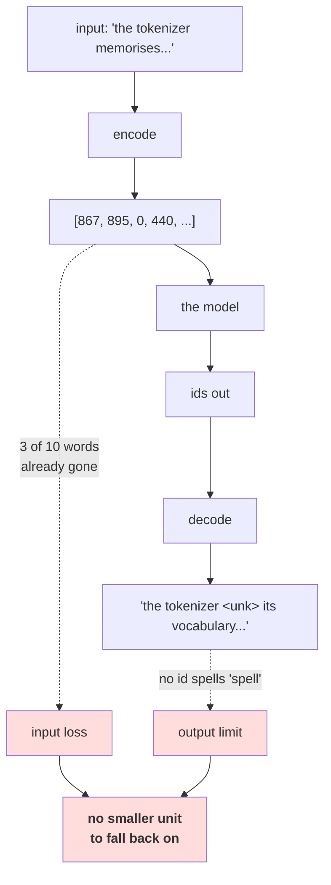

# 2.5 — 💥 The word tokenizer that could not say the word

## One-line answer

An out-of-vocabulary word is not a degraded word — it is the **absence** of one, in both directions: the
model cannot read it and cannot write it, there is no smaller unit to spell it from, and the output
`the tokenizer <unk> its vocabulary and cannot <unk> anything <unk>` is a grammatical English sentence
that no shape check, range check or length check will flag.

---

## The story

Somebody is helping at a counter in a language they are still learning, using a printed card of the two
hundred phrases that come up most.

Most of the day goes fine. The card covers the greetings, the prices, the yes and the no.

Then a customer asks about something that is not on the card. The helper cannot say "I do not know that
word", because that sentence is not on the card either. So they say the nearest thing that is — and the
conversation continues, politely, in complete sentences, about slightly the wrong thing.

The customer leaves believing they were understood. Nothing in the exchange sounded broken. The card
had no way to say the one thing that mattered, and no way to say that it could not.

---

## The idea in plain language

Part [2.3](2.3-the-out-of-vocabulary-wall.md) measured the input side: 19.29% of held-out tokens have no
id at a cap of 1,000, and 10.41% have none even with no cap at all. This part is what that costs once
the tokenizer is wired to a model, and it is worse than the input rate suggests, for three reasons that
compound.

**First: the loss is total, not partial.** A word the vocabulary lacks does not arrive degraded. It
arrives as `<unk>` — one symbol that means "something was here". Day 9 part
[1.1](../../../day-009-the-vocabulary-problem/parts/01-the-vocabulary-problem/1.1-a-model-can-only-emit-its-vocabulary.md)
established this for output and part 2.3 for input; putting them together, **the word is gone in both
directions.** Compare with the character tokenizer, which can always spell: an unusual word costs it
sequence length and nothing else.

**Second: there is no fallback, in principle.** This is the sentence that ends the word-level scheme.
When a character tokenizer meets an unknown character, Day 10 part
[2.4](../../../day-010-unicode-code-points-bytes/parts/02-utf-8-and-bytes/2.4-256-is-a-vocabulary.md)
offers bytes underneath it. When a word tokenizer meets an unknown word there is **nothing underneath**
— the tokenizer discarded the letters in part [2.1](2.1-what-counts-as-a-word.md), so the pieces that
would spell the word are not available to it at any price. Part
[2.4](2.4-one-meaning-six-slots.md) sharpened this: even the four related words the model saw cannot
help, because the relationship is in the letters.

**Third: the output is fluent.** This is what makes it a `production`-level failure rather than a
tutorial one. The decoded sentence measured below is grammatical, well-formed, correctly punctuated
English with three holes in it. It passes every automatic check anybody writes about a model's output —
the ids are in range, the length is right, the characters are printable, the grammar is intact — and
Day 9 part
[2.5](../../../day-009-the-vocabulary-problem/parts/02-what-a-tokenizer-is/2.5-the-tokenizer-that-did-not-match.md)
already made the general point: **fluent-but-wrong output points at the tokenizer, not the model.**

And then the measurement that makes it worse than an aggregate rate suggests: measured in part 2.3, the
words that fall outside the vocabulary are **62% longer** than the words inside it — 6.60 characters
against 4.07. The tokenizer is not losing a random one word in five. It is losing, preferentially, the
words that carry the specific meaning.

---

## Why Akshara needs it

- **Part [3.1](../03-together/3.1-two-tokenizers-one-table.md)** closes the day with both failures side
  by side. This is the word column's entry, and it is a **gate** rather than a trade: no vocabulary size
  fixes it.
- **Day 12** builds BPE, whose entire purpose is to put something underneath the word so that this
  failure cannot happen. Every design decision on that day is a response to this part.
- **Day 13**'s byte-level version drives the floor from "small" to exactly zero, which is a different
  kind of claim and worth the extra day.
- **Day 17** measures generation quality across tokenizers. The fluent-nonsense output shown here is the
  thing those evaluations have to be designed to catch, and an evaluation that only checks well-formedness
  will not.

---

## The mechanism

Encode one ordinary sentence with the tokenizer from part 2.2:

```python
import hashlib
from pathlib import Path

raw = Path("docs/00_MASTER_PLAN.md").read_bytes()
text = raw.decode("utf-8")
print("  corpus sha256[:16] :", hashlib.sha256(raw).hexdigest()[:16])

words = WordTokenizer.split(text)
cut = int(len(words) * 0.8)
train_text = " ".join(words[:cut])
tok = WordTokenizer.from_text(train_text, max_size=1000)

probe = "the tokenizer memorises its vocabulary and cannot spell anything else"
ids = tok.encode(probe)
print("    V         :", len(tok))
print("    probe     :", probe)
print("    ids       :", ids)
print("    decoded   :", tok.decode(ids))
print("    round trip:", tok.decode(ids) == probe)
print("    unk count :", ids.count(0), "of", len(ids))
print("    lost words:", [w for w in tok.split(probe) if w not in tok.stoi])
```

**Line by line:**
- The probe is an ordinary English sentence written to be unremarkable. It contains no jargon, no proper
  nouns and no numbers — the three categories everybody expects to be missing.
- `ids.count(0)` works because part 2.2 reserved id `0` for `<unk>` and nothing else can produce it. That
  is the reserved-slot discipline from part
  [1.4](../01-character-level/1.4-the-unknown-character-policy.md) paying for itself.
- The last line lists the actual lost words rather than the count, because **the count is an abstraction
  and the words are an argument**.
- Measured on Intel Core i3-1115G4 (2 cores / 4 threads), 11.7 GB RAM, Windows 11, CPython 3.12.12, on
  2026-08-26:

```text
  corpus sha256[:16] : 9760f2b6d4340b97
    V         : 1001
    probe     : the tokenizer memorises its vocabulary and cannot spell anything else
    ids       : [867, 895, 0, 440, 959, 29, 121, 0, 36, 0]
    decoded   : the tokenizer <unk> its vocabulary and cannot <unk> anything <unk>
    round trip: False
    unk count : 3 of 10
    lost words: ['memorises', 'spell', 'else']
```

**Read the lost words out loud: `memorises`, `spell`, `else`.** One slightly formal verb and two
completely ordinary English words. `else` is among the most common words in the language and it is not in
a 1,000-word vocabulary built from a technical document — which is part 2.3's point about a vocabulary
describing a corpus rather than a language, arriving in a concrete sentence.

**And notice which word survived: `tokenizer`.** A specialised technical term is in the vocabulary and
`spell` is not, because this corpus talks about tokenizers constantly and about spelling rarely.
Frequency ranking is doing exactly what it was asked to do.

Now the five checks that pass on that output:

```python
V = len(tok)
out = tok.decode(ids)

checks = {
    "every id is in range":        all(0 <= i < V for i in ids),
    "the id count matches words":  len(ids) == len(tok.split(probe)),
    "the output is a str":         isinstance(out, str),
    "the output is printable":     out.isprintable(),
    "the output is non-empty":     bool(out.strip()),
}
for name, ok in checks.items():
    print(f"    {name:<28} {ok}")
print(f"    {'the round trip':<28} {out == probe}")
```

**Line by line:**
- These five are not straw men. They are the checks that get written: a range assertion on ids before an
  embedding lookup, a length assertion against the pre-tokenized input, and type and printability checks
  on anything shown to a person.
- The round trip is printed **last and separately**, because it is the only one that compares the output
  against the *input* rather than checking the output for plausibility. That is the structural lesson,
  and it is the same shape as Day 10 part
  [1.5](../../../day-010-unicode-code-points-bytes/parts/01-code-points-and-graphemes/1.5-the-string-that-was-not-equal-to-itself.md)'s
  seven-pass-one-fail table.
- Measured on this machine, 2026-08-26:

```text
    every id is in range         True
    the id count matches words   True
    the output is a str          True
    the output is printable      True
    the output is non-empty      True
    the round trip               False
```

**Five checks pass and the sixth fails.** An embedding lookup would succeed. A batch would have the
right shape. A response validator would let it through. Nothing between the tokenizer and the user can
tell that three words of the input were deleted.

Now the direction that has no fix — generation:

```python
target = "the model cannot spell a word outside its vocabulary"
target_ids = tok.encode(target)
print("    target        :", target)
print("    as ids        :", target_ids)
print("    best the model can emit:", tok.decode(target_ids))
print("    can any id sequence produce 'spell'? ", "spell" in tok.stoi)
print("    is any piece of 'spell' in the table?",
      [p for p in ("s", "sp", "spe", "spel", "spell") if p in tok.stoi])
```

**Line by line:**
- `tok.decode(target_ids)` is the **ceiling** on the model's output, not a sample from a model. Whatever
  the model learns, whatever the sampler does, it emits ids, and those ids decode through this table.
  This line is the arithmetic upper bound on what any model with this tokenizer could ever say.
- The last check asks whether **any** smaller piece of the word exists in the vocabulary, which is the
  question that separates this failure from a character tokenizer's. An empty list means there is no
  path, at any temperature, with any prompt.
- Measured on this machine, 2026-08-26:

```text
    target        : the model cannot spell a word outside its vocabulary
    as ids        : [867, 545, 121, 0, 2, 982, 0, 440, 959]
    best the model can emit: the model cannot <unk> a word <unk> its vocabulary
    can any id sequence produce 'spell'?  False
    is any piece of 'spell' in the table? []
```

**Two words went, not one — `outside` is missing as well — and no id sequence in this vocabulary
produces the word `spell`.** Not an unlikely one — none. The word is
outside what the model is capable of saying, permanently, and no prompt, sampler, temperature or amount
of training changes it. That is the sentence Day 9 part 1.1 opened the phase with, arriving as a measured
fact about an object you built.



---

## When it breaks

**The loud failure — there isn't one, and that is the finding.** Every line in this part ran cleanly.
The only exception available anywhere in the word-level pipeline is the `IndexError` from part
[2.2](2.2-building-a-word-vocabulary.md) when an id exceeds `V`, and that fires on a model
misconfiguration rather than on this.

**The silent failure, in full, verbatim:**

```text
  input          : 'the tokenizer memorises its vocabulary and cannot spell anything else'
  encode         : succeeds, 10 ids, every one in range
  ids            : [867, 895, 0, 440, 959, 29, 121, 0, 36, 0]
  decode         : 'the tokenizer <unk> its vocabulary and cannot <unk> anything <unk>'
  words lost     : memorises, spell, else
  round trip     : False
  grammar        : intact
  exception      : none
  and generation : no id sequence in this vocabulary can produce the word 'spell'
```

**The check that catches it** has to compare against the input, and it has to report the rate rather
than a boolean:

```python
from dataclasses import dataclass


@dataclass(frozen=True)
class EncodeAudit:
    """What a single encode actually did. Returned alongside the ids, never separately."""

    n_tokens: int
    n_unk: int
    lost_words: tuple[str, ...]

    @property
    def unk_rate(self) -> float:
        return self.n_unk / self.n_tokens if self.n_tokens else 0.0


def encode_audited(tok, s: str) -> tuple[list[int], EncodeAudit]:
    pieces = tok.split(s)
    ids = tok.encode(s)
    lost = tuple(w for w in pieces if w not in tok.stoi)
    return ids, EncodeAudit(n_tokens=len(ids), n_unk=ids.count(0), lost_words=lost)


def assert_can_be_said(tok, required: list[str]) -> None:
    """Before deploying: assert the model is capable of emitting the words it must emit."""
    missing = [w for w in required if w not in tok.stoi]
    assert not missing, (
        f"{len(missing)} required word(s) have no id and can never be generated: {missing}"
    )
```

**Line by line:**
- `encode_audited` returns the ids **and** the audit as a pair, so a caller cannot get one without the
  other. This is the same argument part 1.4 made for `encode_with_stats`, and it is the only structure
  that reliably gets the rate measured: an optional audit function is an unused audit function.
- `lost_words` is a `tuple` inside a frozen dataclass so the audit is hashable and immutable — it can be
  logged, counted and compared across runs without anybody editing it in place.
- `assert_can_be_said` is the check almost nobody writes and it is the important one in this part. It
  runs **before deployment**, against a list of words the application must be able to produce — product
  names, required vocabulary, the words in your own error messages. A model that cannot say them will
  never be able to, and finding that out from a test is enormously cheaper than finding it out from a
  user.
- The failure message says *"can never be generated"* rather than "not found", because the severity is
  the point: this is not a miss that might resolve with more training.
- What none of this can do is repair the damage. There is no repair at the word level, which is why the
  next day changes the unit rather than improving the check.

---

## In production

**What a research engineer writes instead of the teaching version.** They do not deploy a word-level
tokenizer, and this part is the reason. What survives is the **audit habit**: fallback rate returned
alongside the encoding, logged per request, aggregated per source and per language, and alerted on. For
a subword tokenizer that rate should be zero, so any non-zero value is a live signal that something
upstream — the normalizer, the pre-tokenizer, a bad decode — is dropping text.

The second habit is the deployment check: **assert that the vocabulary can express the things the
product must express.** It takes one list and one assertion, and it catches an entire class of "the
model refuses to say our product name" bug before it reaches anyone.

**What degrades at scale.** The gap between the aggregate rate and the per-user experience. A 19% token
fallback rate is not 19% of users mildly affected; it is a distribution, and the users whose text is
unusual — different dialect, different domain, different language, unusual names — sit in the tail where
the rate is far higher. **An average computed over a corpus is not a statement about any user**, which is
the same lesson parts [1.4](../01-character-level/1.4-the-unknown-character-policy.md) and
[1.5](../01-character-level/1.5-the-character-tokenizer-that-met-a-new-alphabet.md) reached from two
other directions, and it keeps being true.

**The failure that only shows with real data.** Names. Every person, place, company and product is a
word, essentially all of them are outside any fixed vocabulary, and they are exactly the words a user
most needs the model to handle correctly. A held-out slice of a curated corpus has few of them; real
traffic is full of them. **The measured 19.29% is an optimistic number**, and the fact that it was
measured on held-out data does not make it representative of use.

**The review comment.** *"`encode` returns ids with no indication that three of the ten words were
dropped. Return the fallback count with them and log it — and before we ship, assert that our own
product names are in the vocabulary, because if they are not the model can never say them."*

**The interview question.** *"What is wrong with `<unk>`?"* The weak answer is "it loses information".
The strong answer names the asymmetry and the finality: **it is total rather than partial, there is no
smaller unit to fall back on so the loss is unrecoverable in principle, and it acts in both directions —
I measured a vocabulary where no id sequence could produce the word `spell` at all.** Then the detail
that shows you have looked: *and the words it loses are not random — in my measurement the
out-of-vocabulary words averaged 6.6 characters against 4.07 for the covered ones, so it preferentially
deletes the words carrying the specific meaning.*

**Compute tier: T0.** The standard library on a laptop, over a 113,283-byte file in this repository. No
packages, no network, no GPU, no seed and **no model** — every claim here is about what a tokenizer makes
possible or impossible, which is arithmetic over a table rather than a property of a trained system. That
is what makes the generation claim strong: it is not "the model is unlikely to say `spell`", it is "no
id sequence decodes to it". What T0 cannot show is how a real model's output quality degrades at a given
fallback rate; that needs runs and it is Day 17.

---

## Check yourself

Run this. It prints **a grammatical English sentence with three words deleted, and five checks that
pass**:

```python
import hashlib
from pathlib import Path

raw = Path("docs/00_MASTER_PLAN.md").read_bytes()
text = raw.decode("utf-8")
print("  corpus sha256[:16] :", hashlib.sha256(raw).hexdigest()[:16])

words = WordTokenizer.split(text)
tok = WordTokenizer.from_text(" ".join(words[:int(len(words) * 0.8)]), max_size=1000)

probe = "the tokenizer memorises its vocabulary and cannot spell anything else"
ids = tok.encode(probe)
out = tok.decode(ids)
print("  decoded    :", out)
print("  lost words :", [w for w in tok.split(probe) if w not in tok.stoi])
print("  ids in range:", all(0 <= i < len(tok) for i in ids))
print("  printable   :", out.isprintable())
print("  round trip  :", out == probe)
print("  can it ever say 'spell'?", "spell" in tok.stoi)
print("  any piece of 'spell'?   ",
      [p for p in ("s", "sp", "spe", "spel", "spell") if p in tok.stoi])
```

**Line by line:**
- The decoded line is a sentence a person would read as slightly odd rather than as broken. **Say out
  loud which automated check in your own codebase would have caught it.**
- The lost words include `else` and `spell`. Say whether you would have predicted those two, and say what
  that tells you about vocabularies built from a specific corpus.
- `can it ever say 'spell'?` prints `False` and the piece list is empty. Say what that means for a model
  using this tokenizer, and say whether more training or a better sampler changes it.
- Now raise `max_size` to `5000` and run it again. Say which words come back, say what the vocabulary
  size actually becomes, and say what part [2.3](2.3-the-out-of-vocabulary-wall.md)'s floor implies about
  raising it further.

**Say this out loud, without scrolling up:** say why an out-of-vocabulary word is worse than a rare word,
name the property a character tokenizer has that makes the same situation survivable, and state what "no
id sequence produces this word" means for a model's capability as opposed to its quality.
