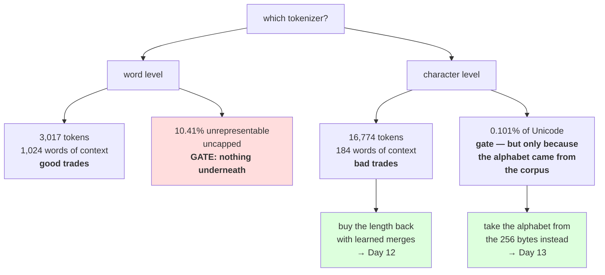

# 3.1 — Two tokenizers, one table

## One-line answer

Both tokenizers you built today fail, in opposite directions and not equally: the character one is
**lossless with a 5.56× sequence** and a 184-word context window, the word one is **compact and cannot
represent 10.41% of held-out text even uncapped** — and one of those is a trade you can budget for while
the other is a gate that no setting opens.

---

## The story

There are two ways home from work.

One is the local bus. It stops everywhere, takes three times as long, and it goes past every street in
the area — wherever you need to get off, there is a stop.

The other is the fast bus. Twenty minutes, no stopping, and it serves eleven fixed stops. If your street
is one of the eleven it is obviously the better choice.

Most days you are going to one of the eleven. Then one evening you need somewhere else, and the fast bus
has nothing to offer — not a longer walk, not a worse stop, **nothing**. It does not go there and no
amount of waiting changes that.

The slow bus is a cost you pay every day. The fast bus is free every day and then, occasionally, it
simply cannot take you.

---

## The idea in plain language

Today built two tokenizers with the same interface and measured both. This part puts them in one table,
because the decision only makes sense side by side — and because the table's shape is the argument for
the next two days.

Day 9 part
[3.1](../../../day-009-the-vocabulary-problem/parts/03-together/3.1-three-tokenizers-one-table.md)
introduced the distinction this part turns on: in a comparison table, **most columns are trades and one
is a gate.** A trade is something you can be worse at and still ship, because you can pay for it —
with compute, with memory, with money. A gate is something that disqualifies you, because there is no
amount of anything that fixes it.

Sort today's findings into those two piles.

**Trades.** Sequence length: the character tokenizer needs 5.56× the tokens, which is 30.9× the
attention work — expensive, budgetable, and part
[1.3](../01-character-level/1.3-the-sequence-length-problem.md) shows exactly how to price it.
Vocabulary size: 151 against 1,001, which Day 9 part
[2.4](../../../day-009-the-vocabulary-problem/parts/02-what-a-tokenizer-is/2.4-vocabulary-size-is-a-budget.md)
priced in parameters. Wasted slots: 15.57% of the word vocabulary is inflections, measured in part
[2.4](../02-word-level/2.4-one-meaning-six-slots.md). All of these are numbers you can put in a budget
and argue about.

**Gates.** There are two, one per tokenizer, and they are not the same kind of thing.

The word tokenizer's gate is part [2.5](../02-word-level/2.5-the-word-tokenizer-that-could-not-say-the-word.md):
**no id sequence produces the word `spell`.** Uncapped, 10.41% of held-out tokens still have no id. There
is no smaller unit to fall back on, so this is not a tuning problem — it is the scheme.

The character tokenizer's gate is part [1.5](../01-character-level/1.5-the-character-tokenizer-that-met-a-new-alphabet.md):
an alphabet built from a corpus covers **0.101% of assigned Unicode**, so the first document in an unseen
script raises. But look closely, because this gate has a hinge the other one does not: **it is fixed by
changing where the alphabet comes from.** Take the alphabet from the byte set instead of from the corpus
— Day 10 part [2.4](../../../day-010-unicode-code-points-bytes/parts/02-utf-8-and-bytes/2.4-256-is-a-vocabulary.md)'s
256 — and the coverage failure disappears entirely while the sequence-length trade stays.

That asymmetry is the whole conclusion of the day. **One scheme's gate is a door with a handle on it and
the other's is a wall.** The next two days walk through the door: keep the compose-from-small-pieces
property that makes coverage total, and buy back the sequence length with learned merges.

---

## Why Akshara needs it

- **Day 12** builds the merge loop. It exists to move a tokenizer from the character column toward the
  word column on sequence length **without** giving up the coverage property — this table is the
  statement of what it has to achieve.
- **Day 13** finishes the job by putting bytes underneath, which is the door named above.
- **Day 17** re-runs this comparison with a trained subword tokenizer in a third column. The numbers here
  are the baseline it is measured against, which is why they are recorded with a corpus hash.
- **Day 51 onward**, the pretraining run inherits whichever scheme won. Sequence length sets the compute
  bill, and coverage sets which users the model works for; this table is where both were decided.

---

## The mechanism

One held-out text, four schemes, six columns:

```python
import hashlib
import re
from collections import Counter
from pathlib import Path

raw = Path("docs/00_MASTER_PLAN.md").read_bytes()
text = raw.decode("utf-8")
print("  corpus sha256[:16] :", hashlib.sha256(raw).hexdigest()[:16])

words = re.findall(r"[A-Za-z']+", text.lower())
cut = int(len(words) * 0.8)
train, held = words[:cut], words[cut:]
counts = Counter(train)
CAP = 1000
keep = {w for w, _ in counts.most_common(CAP)}
held_text = " ".join(held)

rows = [
    ("character",      len(set(text)),   len(held_text),                    0.0, True),
    ("word, V=1000",   CAP + 1,          len(held),
     sum(1 for w in held if w not in keep) / len(held),                          False),
    ("word, uncapped", len(counts) + 1,  len(held),
     sum(1 for w in held if w not in counts) / len(held),                        False),
    ("byte",           256,              len(held_text.encode("utf-8")),    0.0, True),
]

print(f"  {'scheme':<16} {'V':>6} {'tokens':>7} {'OOV rate':>9} {'lossless':>9} {'words in 1024':>14}")
for name, V, ntok, oovr, loss in rows:
    per_word = ntok / len(held)
    print(f"  {name:<16} {V:>6} {ntok:>7} {oovr:>8.2%} {str(loss):>9} {1024 / per_word:>14.1f}")
```

**Line by line:**
- Every row is measured on **the same held-out text**, which is the only way a comparison table means
  anything. Day 9 part 3.1 made the same insistence; it is worth repeating because tokenizer comparisons
  quoted from different sources are the norm and are worthless.
- The `byte` row is not a tokenizer built today — it is Day 10 part 2.4's 256-entry table, included
  because it is where the next two days are going and because it makes the character row's weakness
  legible.
- `1024 / per_word` converts each scheme's token count into **words of context**, which is the unit a
  person planning a product thinks in. Day 10 part
  [3.1](../../../day-010-unicode-code-points-bytes/parts/03-together/3.1-one-string-five-layers.md)'s
  rule again: convert at the edge, and name the unit.
- The `lossless` column is a **hard-coded claim per row**, not a computed one, and that is deliberate:
  for the word rows it is `False` for the structural reason part
  [2.1](../02-word-level/2.1-what-counts-as-a-word.md) measured, and computing it here would suggest the
  answer depends on the text. It does not.
- Measured on Intel Core i3-1115G4 (2 cores / 4 threads), 11.7 GB RAM, Windows 11, CPython 3.12.12, on
  2026-08-26:

```text
  corpus sha256[:16] : 9760f2b6d4340b97
  scheme                V  tokens  OOV rate  lossless  words in 1024
  character           151   16774    0.00%      True          184.2
  word, V=1000       1001    3017   19.29%     False         1024.0
  word, uncapped     2172    3017   10.41%     False         1024.0
  byte                256   16774    0.00%      True          184.2
```

**Now read the two columns that are lying to you**, because a table you cannot read critically is worse
than no table.

**The character row's `0.00%` is measured in-distribution and is not a general claim.** The held-out
text is the last fifth of the same document, written in the same script, so of course every character is
in the alphabet. Part [1.5](../01-character-level/1.5-the-character-tokenizer-that-met-a-new-alphabet.md)
measured what that same tokenizer does on Cyrillic: `6/6` characters missing. **The honest entry for that
cell is "0.00% here, undefined elsewhere"**, and the difference between those two readings is the whole
of part 1.5.

**The byte row's `16774` matches the character row exactly**, which looks like the two schemes are the
same. They are not — this held-out slice is pure ASCII, because it was built from lowercased alphabetic
words joined by spaces, and Day 10 part 2.4 measured that bytes and characters diverge by 2.75× on
Devanagari and 4× on emoji. **The two columns agree here because of what this text is**, and a reader who
took `bytes == characters` from this table would be wrong the moment the corpus was not English.

Both of those readings are the same skill, and it is the one to take from the day: **a measurement is a
statement about the thing measured, and the interesting question is always what would have to change for
the number to move.**

Now the sorting that actually decides it:

```python
print("  TRADES — payable with compute, memory or money")
print(f"    sequence length      : character is {16774 / 3017:.2f}x the word count")
print(f"    attention work       : {(16774 / 3017) ** 2:.1f}x")
print(f"    context in words     : 184 vs 1024 at a 1024-token window")
print(f"    vocabulary           : 151 vs 1001 entries")
print()
print("  GATES — no setting fixes them")
print("    word: 10.41% of held-out tokens have no id, uncapped, and no sub-unit exists")
print("    char: alphabet covers 0.101172% of assigned Unicode; unseen script raises")
print()
print("  and the difference between the two gates:")
print("    word gate: structural — the scheme discarded the letters")
print("    char gate: sourced   — take the alphabet from bytes instead of the corpus")
```

**Line by line:**
- The trades are printed as **ratios and counts**, because a trade is something you multiply into a
  budget. The gates are printed as sentences, because a gate is not a quantity to be optimised.
- The last two lines are the day's conclusion in eleven words, and they are the reason Day 12 and Day 13
  are two separate days rather than one: Day 12 attacks the sequence-length trade, Day 13 closes the
  character gate at its source.
- Measured on this machine, 2026-08-26:

```text
  TRADES — payable with compute, memory or money
    sequence length      : character is 5.56x the word count
    attention work       : 30.9x
    context in words     : 184 vs 1024 at a 1024-token window
    vocabulary           : 151 vs 1001 entries

  GATES — no setting fixes them
    word: 10.41% of held-out tokens have no id, uncapped, and no sub-unit exists
    char: alphabet covers 0.101172% of assigned Unicode; unseen script raises

  and the difference between the two gates:
    word gate: structural — the scheme discarded the letters
    char gate: sourced   — take the alphabet from bytes instead of the corpus
```



---

## When it breaks

**The loud failure — a comparison table whose rows were measured on different text.** It does not raise;
it produces a number that is confidently wrong, which is why it belongs here:

```console
>>> len(char_tok.encode(whole_corpus)) / len(word_tok.encode(held_out_slice))
36.73
```

What it means: `36.73` is not a tokens-per-word ratio, it is 110,837 characters divided by 3,017 words
from a different piece of text. The real answer is `5.56`. **Nothing about the expression looks wrong**,
both variables are real, both functions are correct, and the number is off by a factor of six. The
smallest fix is to compute every column from one variable.

**The silent failure — quoting a cell without its conditions.** Every number in the table above is a
property of a corpus pair, a split and a cap. Lifted out, they become claims about tokenization in
general, and three of them are then false:

```text
  written down as      : "character-level tokenizers have no OOV problem"
  what was measured    : 0.00% on held-out text from the same English document
  what part 1.5 measured: 6 of 6 characters missing on Cyrillic
  written down as      : "byte-level costs the same as character-level"
  what was measured    : equal on an ASCII-only slice
  what Day 10 measured : 2.75x on Devanagari, 4x on emoji
  raised               : nothing. The table was correct; the sentence was not.
```

**The check that catches it** is to make the conditions part of the value:

```python
from dataclasses import dataclass


@dataclass(frozen=True)
class Measurement:
    """A number, and everything that has to be true for it to mean anything."""

    value: float
    unit: str
    corpus_sha256: str
    split: str
    note: str = ""

    def __str__(self) -> str:
        tail = f" ({self.note})" if self.note else ""
        return f"{self.value:g} {self.unit} [corpus {self.corpus_sha256[:8]}, {self.split}]{tail}"


OOV_CHAR = Measurement(
    value=0.0, unit="OOV rate", corpus_sha256="9760f2b6", split="last 20%, same document",
    note="in-distribution only; 6/6 characters missing on Cyrillic — see part 1.5",
)
```

**Line by line:**
- `unit` is mandatory and has no default, which is Day 10 part 3.1's rule with the loophole closed: a
  `Measurement` cannot be constructed without saying what it counts.
- `corpus_sha256` and `split` are mandatory too, so a number physically cannot exist in this codebase
  without the conditions that produced it. That is stronger than a comment, because comments do not
  survive being copied into a slide.
- `__str__` prints all of it, so **pasting the value somewhere pastes the conditions with it** — which is
  the actual failure mode being defended against.
- `note` is where the honest caveat lives, and the example above carries the caveat that matters: the
  `0.0` is true and it is in-distribution. A cell that reads `0 OOV rate [corpus 9760f2b6, last 20%,
  same document] (in-distribution only; 6/6 characters missing on Cyrillic)` cannot be misquoted by
  accident.
- What this does not do is prevent anyone from writing a bare float. Nothing can. It makes the honest
  version cheap, which is the most a helper can do.

---

## In production

**What a research engineer writes instead of the teaching version.** They keep a table like this one for
every tokenizer decision, with the corpus hash in it, and they re-run it when the corpus changes. The
columns that matter in practice are the two gates and the sequence-length ratio; vocabulary size follows
from the parameter budget, and the rest is commentary. The habit that distinguishes them is **sorting the
columns into trades and gates before arguing about any of them** — most tokenizer arguments are people
optimising a trade while a gate is open.

The second habit is that the comparison is re-run **per language** rather than once. Every number in this
table is different for Devanagari, and a decision made on English numbers is a decision made for English
users.

**What degrades at scale.** The word column, in both directions at once, which is why it is not a live
option. More corpus means more types, so either the cap grows — Day 9 part 2.4's parameter cost — or the
out-of-vocabulary rate grows. The character column degrades more gracefully: its alphabet grows slowly
and its cost is a multiplier that stays put. **A scheme that gets worse in one dimension is survivable; a
scheme that gets worse in two at once is a dead end.**

**The failure that only shows with real data.** Every gate in this table opens onto real traffic rather
than onto a held-out split. The word gate is names, products and jargon; the character gate is scripts
and emoji. A held-out slice of a curated corpus contains almost none of either, so **both `0.00%` and
`10.41%` are optimistic**, and the direction of the error is the same for both columns.

**The review comment.** *"This table compares the two tokenizers on sequence length and vocabulary size
and concludes word-level wins. Both of those are trades. The row that decides it is the coverage one, and
uncapped word-level still cannot represent one held-out token in ten — with nothing to fall back on."*

**The interview question.** *"Character-level or word-level?"* The weak answer picks one. The strong
answer refuses the framing with numbers: **character-level is lossless and costs 5.56× the tokens, which
is 30.9× the attention and a context window of 184 words instead of 1,024; word-level is compact and
cannot represent 10.41% of held-out text even with no cap, because it has no smaller unit — so the first
is a trade and the second is a gate.** Then the move that shows you know where this goes: *which is why
neither is the answer, and why the field uses subwords over a byte alphabet — you keep the compose-from-
pieces property that makes coverage total and buy the sequence length back with learned merges.*

**Compute tier: T0.** The standard library on a laptop, over a 113,283-byte file in this repository. No
packages, no network, no GPU, no seed, no training run. Every number reproduces exactly for anyone whose
corpus hash matches `9760f2b6d4340b97`. **Two cells in the table are in-distribution artefacts and the
part says so twice**: the character row's `0.00%` and the equality between the character and byte token
counts. What T0 cannot settle is the question the whole day is circling — whether a given scheme produces
a better model at fixed compute. That needs runs, it is Day 17, and this day's job was to narrow the
field on correctness grounds so that fewer runs are needed.

---

## Check yourself

Run this. It prints **four schemes and two of them cannot represent the text at all**:

```python
import hashlib
import re
from collections import Counter
from pathlib import Path

raw = Path("docs/00_MASTER_PLAN.md").read_bytes()
text = raw.decode("utf-8")
print("  corpus sha256[:16] :", hashlib.sha256(raw).hexdigest()[:16])

words = re.findall(r"[A-Za-z']+", text.lower())
cut = int(len(words) * 0.8)
train, held = words[:cut], words[cut:]
counts = Counter(train)
held_text = " ".join(held)

for name, V, ntok in (
    ("character", len(set(text)), len(held_text)),
    ("word V=1k", 1001, len(held)),
    ("byte", 256, len(held_text.encode("utf-8"))),
):
    print(f"  {name:<10} V={V:>5}  tokens={ntok:>6}  context@1024={1024 / (ntok / len(held)):>7.1f} words")

keep = {w for w, _ in counts.most_common(1000)}
print("  word OOV @1000  :", f"{sum(1 for w in held if w not in keep) / len(held):.2%}")
print("  word OOV uncapped:", f"{sum(1 for w in held if w not in counts) / len(held):.2%}")
print("  char OOV on Cyrillic:",
      f"{sum(1 for c in chr(0x43f) + chr(0x440) if c not in set(text)) } of 2 characters missing")
```

**Line by line:**
- The three `context@1024` values differ by 5.56×. **Say out loud which of them is a budget question and
  which is a capability question.**
- `word OOV uncapped` prints `10.41%`. Say what setting would reduce it, and then say why the answer is
  "none".
- The last line prints `2 of 2 characters missing`. Say why the table's character row said `0.00%`
  anyway, and say what a single word of that in your corpus would do to the tokenizer.
- Now recompute the byte row over `text` itself instead of `held_text`. Say whether the byte and
  character token counts still match, and say what changed.

**Say this out loud, without scrolling up:** sort today's four findings into trades and gates, name the
one gate that is closed by changing where the alphabet comes from rather than by tuning, and say what
property the next two days have to preserve while buying the sequence length back.
