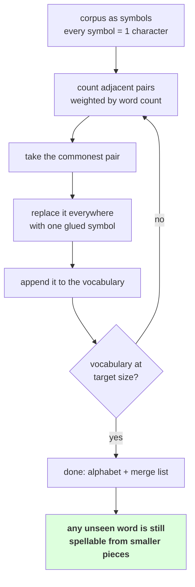

# 1.1 — Merge the commonest pair

## One-line answer

Byte-pair encoding is one rule applied over and over — **count every adjacent pair of symbols, glue the
commonest one into a single new symbol, repeat** — and that rule, with no grammar and no word list,
discovers `ing`, `ion`, `er` and `est` from frequency alone.

---

## The story

You are writing out the same address on a hundred envelopes by hand.

The first few you write in full. By the tenth you have noticed that four of the lines are identical
every time, and you are tired, so you get a rubber stamp made for the block that repeats.

Now each envelope is one stamp and two written lines. You do a few more and notice the street name
repeats too, so you get a second stamp for that. Then the postcode.

You did not sit down and design a set of stamps. You made one for whatever you were writing most, then
looked again at what was left and made one for whatever was *now* most common. The stamps you ended up
with are a description of what you actually wrote, and nobody chose them in advance.

---

## The idea in plain language

Day 11 ended with two failures and one door. The character tokenizer was lossless and 5.56× too long;
the word tokenizer was compact and could not represent 10.41% of held-out text with nothing underneath
to fall back on. The door was: **keep the compose-from-small-pieces property, and buy the sequence
length back.**

Byte-pair encoding buys it back with one rule.

Start with the text split into its smallest pieces — for today, characters. Then repeat:

1. Count every **adjacent pair** of symbols in the corpus.
2. Take the pair that occurs most often.
3. Replace every occurrence of that pair with a **single new symbol** that is the two glued together.
4. Add that new symbol to the vocabulary.

That is the whole algorithm. It began life as a data-compression method in the 1990s and was brought
into language modelling as a tokenizer by **arXiv:1508.07909**, *Neural Machine Translation of Rare
Words with Subword Units*, which is the version this day builds.

Three terms, defined now:

- A **symbol** is whatever the algorithm currently treats as indivisible. At the start every symbol is
  one character. After a merge, some symbols are two characters, then three, and so on.
- A **merge** is one application of the rule: an ordered pair of symbols, recorded in the order it was
  learned. The list of merges **is** the trained artifact — part
  [2.1](../02-training-a-vocabulary/2.1-the-merge-table-is-the-artifact.md) is about why.
- The **vocabulary** is the starting alphabet plus one entry per merge. So `V = len(alphabet) +
  n_merges`, exactly, and the target vocabulary size is how you decide when to stop.

Now the property that makes this different from Day 11's word tokenizer, and it is the whole reason the
day exists. **Every merge is optional at encode time.** A word the merges have never seen is not
unrepresentable — it is simply spelled with smaller pieces, all the way down to single characters if
necessary. Measured in part [2.3](../02-training-a-vocabulary/2.3-reading-the-table.md), the word
`regenerated`, which has no single token, encodes as `re` + `g` + `ener` + `ated` and decodes back
exactly. **There is always something underneath**, which is the property Day 11 part
[2.5](../../../day-011-character-and-word-tokenizers/parts/02-word-level/2.5-the-word-tokenizer-that-could-not-say-the-word.md)
said the word tokenizer did not have.

And the thing nobody promises in advance but which falls out anyway: because English glues the same
endings onto many stems, those endings become the commonest pairs. Measured in part 2.3, **merge 18 on
this corpus is `ing` and merge 23 is `ion`** — the exact pieces Day 11 part
[2.4](../../../day-011-character-and-word-tokenizers/parts/02-word-level/2.4-one-meaning-six-slots.md)'s
`TODO(me)` asked how you would ever find by counting whole words. You cannot find them by counting whole
words. You find them by counting pairs.

---

## Why Akshara needs it

- **Part [1.2](1.2-six-merges-by-hand.md)** runs this rule six times on a toy corpus so you can check
  every step by eye before trusting it on 110,837 characters.
- **Part [2.2](../02-training-a-vocabulary/2.2-training-to-a-target-size.md)** turns the rule into a
  trainer with a target vocabulary size, which is the interface Day 11's tokenizers already had.
- **Day 13** replaces the starting alphabet with the 256 bytes, which closes the coverage gate Day 11
  part 3.1 identified as the one with a handle on it. Nothing else about the algorithm changes.
- **Day 14** opens a production tokenizer and compares. What you compare against is this rule, which
  they also implement — the differences are speed, the pre-tokenizer and the special-token handling,
  not the idea.

---

## The mechanism

Three functions. The first counts pairs:

```python
from collections import Counter


def pair_counts(words: dict[tuple[str, ...], int]) -> Counter:
    """Count every adjacent symbol pair, weighted by how often its word occurs."""
    pairs: Counter = Counter()
    for symbols, n in words.items():
        for a, b in zip(symbols, symbols[1:]):
            pairs[(a, b)] += n
    return pairs
```

**Line by line:**
- The corpus is a `dict` from **word** to **count**, not a list of words. That is the single most
  important design decision in a BPE trainer: the word `the` may occur 914 times, and counting its pairs
  once and multiplying by 914 is 914 times less work than counting them 914 times. Part
  [2.4](../02-training-a-vocabulary/2.4-what-training-costs.md) measures what this buys.
- A word is a `tuple` of symbols rather than a string, because the symbols stop being single characters
  after the first merge and a string could not tell you where one symbol ends. `("l", "ow")` and
  `("lo", "w")` are different states with the same letters.
- `zip(symbols, symbols[1:])` is the standard way to walk adjacent pairs. It stops naturally at the last
  pair, so a one-symbol word contributes nothing — correctly, because it has no adjacent pair.
- `pairs[(a, b)] += n` adds the **word's count**, not `1`. Forgetting the weight gives you a tokenizer
  trained on the vocabulary rather than on the corpus, which is a real and quiet bug: it still runs, and
  it optimises for rare words.

The second applies one merge to one word:

```python
def merge_word(symbols: tuple[str, ...], pair: tuple[str, str]) -> tuple[str, ...]:
    """Replace every occurrence of `pair` in `symbols` with the two glued together."""
    a, b = pair
    out, i = [], 0
    while i < len(symbols):
        if i < len(symbols) - 1 and symbols[i] == a and symbols[i + 1] == b:
            out.append(a + b)
            i += 2
        else:
            out.append(symbols[i])
            i += 1
    return tuple(out)
```

**Line by line:**
- The `while` loop with a manual index is used rather than a `for`, because a match consumes **two**
  symbols and the loop has to skip both. That is why `i += 2` in one branch and `i += 1` in the other.
- `i < len(symbols) - 1` guards the lookahead. Without it the last symbol raises `IndexError`, and the
  bug only appears on words whose final symbol is the first half of the merge — which is most of them,
  eventually.
- Consuming two symbols also means **overlapping matches do not double-count**. Merging `("a", "a",
  "a")` on the pair `("a", "a")` gives `("aa", "a")` and not `("aa", "aa")`, because the middle `a` is
  already used. That is the standard behaviour and it matters for repeated characters — runs of spaces,
  for instance, which part [2.3](../02-training-a-vocabulary/2.3-reading-the-table.md) shows the merges
  seizing on.
- `a + b` is plain string concatenation. **The new symbol is literally the two old ones stuck together**,
  which is what makes the whole scheme lossless: no information is added or lost by a merge, only
  bracketing.

And the rule itself, as one step:

```python
def one_merge_step(words: dict[tuple[str, ...], int]) -> tuple[tuple[str, str], dict, int]:
    """Find the commonest pair, apply it everywhere, return it with the new corpus."""
    pairs = pair_counts(words)
    best = max(pairs.items(), key=lambda kv: (kv[1], kv[0]))[0]
    merged = {merge_word(w, best): n for w, n in words.items()}
    return best, merged, pairs[best]
```

**Line by line:**
- `key=lambda kv: (kv[1], kv[0])` sorts by **count first, then by the pair itself**. The second element
  is the tie-break, and it is not decoration: part
  [2.5](../02-training-a-vocabulary/2.5-the-vocabulary-that-depended-on-the-order-of-the-corpus.md)
  measures two runs over the same words in a different order diverging at merge 24 without it. Writing
  `max(pairs, key=pairs.get)` instead is the bug.
- The dict comprehension rebuilds the whole corpus each step. That is `O(corpus)` per merge and it is why
  part 2.4 exists; it is also why the code is short enough to read, which is the trade this day is
  making deliberately.
- Two different words can merge into the same key — if `("l", "o", "w")` and `("lo", "w")` were both
  present, one merge makes them identical — and the dict comprehension would then **keep only one
  count**. It cannot happen here because all words start as characters and every merge is applied to
  every word, so the states stay in step. It is worth knowing that the invariant is what makes the
  comprehension safe.

Run it once on a corpus small enough to check by hand:

```python
from collections import Counter

TOY = "low low low low low lower lower newest newest newest widest widest"
words = {tuple(w): n for w, n in Counter(TOY.split()).items()}
print("  words:", {"".join(k): v for k, v in words.items()})

pairs = pair_counts(words)
top = sorted(pairs.items(), key=lambda kv: (-kv[1], kv[0]))[:4]
print("  top pairs:", [(a + b, c) for (a, b), c in top])

best, words, count = one_merge_step(words)
print("  merged:", best, "->", best[0] + best[1], "count", count)
print("  after :", [(("".join(k)), list(k)) for k in sorted(words, key="".join)])
```

**Line by line:**
- `TOY.split()` is used here rather than the pre-tokenizer part
  [1.4](1.4-the-pre-tokenizer.md) introduces, because this block is about the merge rule alone and
  splitting on whitespace is the least distracting way to get words. Part 1.4 explains why the real
  version keeps the spaces.
- `Counter(TOY.split())` gives word counts, and `{tuple(w): n ...}` converts each word to its symbol
  tuple. Those two lines are the whole corpus representation.
- `sorted(..., key=lambda kv: (-kv[1], kv[0]))` prints the top four so you can see **what the winner
  beat**, which is more informative than the winner alone.
- Measured on Intel Core i3-1115G4 (2 cores / 4 threads), 11.7 GB RAM, Windows 11, CPython 3.12.12, on
  2026-08-26:

```text
  words: {'low': 5, 'lower': 2, 'newest': 3, 'widest': 2}
  top pairs: [('lo', 7), ('ow', 7), ('es', 5), ('st', 5)]
  merged: ('o', 'w') -> ow count 7
  after : [('low', ['l', 'ow']), ('lower', ['l', 'ow', 'e', 'r']), ('newest', ['n', 'e', 'w', 'e', 's', 't']), ('widest', ['w', 'i', 'd', 'e', 's', 't'])]
```

**`lo` and `ow` both occur 7 times, and `ow` won.** That is the tie-break doing its job: `('o','w')`
sorts after `('l','o')`, so `max` with the `(count, pair)` key picks `ow`. Which one wins does not matter
for quality; **that the same one wins every time does**, and part 2.5 is what happens when it does not.

After one merge, `low` is two symbols instead of three. Six symbols became five across the corpus's
distinct words, and the vocabulary gained one entry. Part [1.2](1.2-six-merges-by-hand.md) runs it five
more times.



---

## When it breaks

**The loud failure — the missing lookahead guard:**

```console
>>> def broken(symbols, pair):
...     a, b = pair
...     out, i = [], 0
...     while i < len(symbols):
...         if symbols[i] == a and symbols[i + 1] == b:
...             out.append(a + b); i += 2
...         else:
...             out.append(symbols[i]); i += 1
...     return tuple(out)
...
>>> broken(("l", "o", "w"), ("o", "w"))
('l', 'ow')
>>> broken(("l", "o", "w"), ("l", "o"))
Traceback (most recent call last):
  File "<stdin>", line 1, in <module>
  File "<stdin>", line 5, in broken
IndexError: tuple index out of range
```

What it means: the first call happens to work because the match consumes the last two symbols. The
second reaches `symbols[i + 1]` when `i` is the last index. **It fails on some inputs and not others**,
which is why it survives a quick test — and the inputs it fails on are the ones where the last symbol
starts a candidate pair, which is common.

**The silent failure — counting words instead of occurrences.** Drop the `n` and the algorithm still
runs, still produces merges, still compresses:

```python
pairs[(a, b)] += 1      # instead of += n
```

**Line by line:**
- Every distinct word now contributes equally: `the`, which occurs 914 times in the corpus, counts the
  same as a word seen once.
- The result is a tokenizer optimised for the **vocabulary** rather than for the **text**. Rare words get
  good merges; frequent words do not; the compression ratio is worse and nothing says why.
- There is no exception and no warning. The trained artifact is valid, the round trip holds, and the only
  symptom is that the tokenizer is worse than it should be by an amount you would have to measure to
  notice.

The wrong output, on the toy corpus:

```text
  weighted   (+= n): top pairs [('lo', 7), ('ow', 7), ('es', 5), ('st', 5)]  -> first merge 'ow'
  unweighted (+= 1): top pairs [('es', 2), ('lo', 2), ('ow', 2), ('st', 2)]  -> first merge 'we'
  both run, both produce a valid tokenizer, and the second one ignored that 'low' occurs five times.
```

**The check that catches it** compares against the property the algorithm is supposed to have:

```python
def assert_merge_is_lossless(words: dict[tuple[str, ...], int],
                             merged: dict[tuple[str, ...], int]) -> None:
    """A merge may re-bracket the symbols. It may not change the text or the counts."""
    before = Counter()
    after = Counter()
    for w, n in words.items():
        before["".join(w)] += n
    for w, n in merged.items():
        after["".join(w)] += n
    assert before == after, (
        f"merge changed the corpus: {(before - after) or (after - before)}"
    )


def assert_shortens(words: dict[tuple[str, ...], int],
                    merged: dict[tuple[str, ...], int]) -> None:
    """Every merge must reduce the total symbol count. If it does not, the pair was not present."""
    n_before = sum(len(w) * n for w, n in words.items())
    n_after = sum(len(w) * n for w, n in merged.items())
    assert n_after < n_before, f"merge did not shorten anything: {n_before} -> {n_after}"
```

**Line by line:**
- `"".join(w)` throws away the bracketing and keeps the text, which is exactly the invariant: **a merge
  changes how the text is cut up and never what it says.** Comparing the joined counts is the strongest
  cheap check available.
- `Counter` equality compares both keys and counts, so this catches a merge that dropped a word as well
  as one that altered it — including the dict-comprehension collision described above.
- `assert_shortens` catches a different bug: a merge applied when the pair does not actually occur, which
  produces an identical corpus, a wasted vocabulary slot and an infinite loop if the trainer does not
  stop.
- The subtraction in the message — `(before - after) or (after - before)` — prints **which words
  changed** rather than saying `False`. `Counter` subtraction keeps only positive counts, so one of the
  two is non-empty and it names the culprit.
- Neither function checks that the merge was the *best* one. That is a quality question, not a
  correctness one, and part 2.5 shows that the answer to it depends on a tie-break rather than on
  anything provable.

---

## In production

**What a research engineer writes instead of the teaching version.** The rule is unchanged — every
production BPE implementation does exactly what is above — but nobody recounts every pair after every
merge. A real trainer keeps an index from pair to the words containing it and updates only the affected
counts, which turns the per-merge cost from "the whole corpus" into "the words that changed". Part
[2.4](../02-training-a-vocabulary/2.4-what-training-costs.md) measures the naive version's cost and does
the arithmetic for the indexed one; Day 14 opens an implementation that has it.

The second thing that survives is the **`(count, pair)` tie-break**, or some other deterministic rule.
It costs nothing, it is one tuple, and without it the artifact depends on the order the corpus was read
— which is Day 9 part
[2.5](../../../day-009-the-vocabulary-problem/parts/02-what-a-tokenizer-is/2.5-the-tokenizer-that-did-not-match.md)'s
failure arriving through a new door.

**What degrades at scale.** Training time, and only training time — the encoder is fast regardless. The
naive trainer is `O(merges × corpus)`, and both factors grow: a bigger corpus makes each pass longer, and
a bigger target vocabulary needs more passes. Part 2.4 measures 50.8 seconds for 1,849 merges over
110,837 characters; the same shape at a realistic corpus size and vocabulary is not a laptop job, which
is why real trainers are indexed and written in a compiled language.

**The failure that only shows with real data.** Repeated characters. Runs of spaces, runs of dashes,
long lines of `=` in ASCII art — these produce pairs with enormous counts, so the first merges are spent
on them. Measured in part 2.3, merge 10 on this corpus is two spaces and merge 6 in a 20,000-character
slice is four spaces. That is not wrong — those really are the commonest pairs — but a corpus with a lot
of formatting spends its early vocabulary on formatting, and only a look at the merge list reveals it.

**The review comment.** *"`pairs[(a, b)] += 1` — this counts each distinct word once regardless of how
often it occurs, so the merges are being chosen from the vocabulary rather than the corpus. It needs the
word's count."*

**The interview question.** *"Explain BPE in one minute."* The weak answer describes subwords in general.
The strong answer is the rule and its consequence: **count adjacent symbol pairs across the corpus, glue
the commonest one into a new symbol, add it to the vocabulary, repeat until the vocabulary is the size
you wanted — and because a merge is only ever an option, an unseen word falls back to smaller pieces
instead of becoming `<unk>`.** Then the observation that shows you have run it: *and the pieces it finds
are the ones you would have chosen by hand — on my corpus merge 18 was `ing` and merge 23 was `ion` —
without any grammar in the algorithm at all.*

**Compute tier: T0.** The standard library on a laptop. The toy corpus in this part is twelve words and
the merge step is instantaneous; the full-corpus training in part 2.2 is the expensive one and it is
still a laptop job. No packages, no network, no GPU, no seed. Every number here is exact and reproducible
for anyone running the same code. What T0 **cannot** show is whether BPE produces a better *model* than
the alternatives at fixed compute — that is Day 17. Today establishes what it produces and that the
round trip holds, both of which are properties of the algorithm rather than of a run.

**Citation, fetched rather than recalled** — see the hub's §8 for the date: **arXiv:1508.07909**,
*Neural Machine Translation of Rare Words with Subword Units*, is the paper that brought byte-pair
encoding into use as a tokenizer. Its abstract was fetched on 2026-08-26 to confirm the title and that
the method described is the one built here.

---

## Check yourself

Run this. It prints **the commonest pair in a twelve-word corpus, and what it beat**:

```python
from collections import Counter


def pair_counts(words):
    pairs = Counter()
    for symbols, n in words.items():
        for a, b in zip(symbols, symbols[1:]):
            pairs[(a, b)] += n
    return pairs


def merge_word(symbols, pair):
    a, b = pair
    out, i = [], 0
    while i < len(symbols):
        if i < len(symbols) - 1 and symbols[i] == a and symbols[i + 1] == b:
            out.append(a + b)
            i += 2
        else:
            out.append(symbols[i])
            i += 1
    return tuple(out)


TOY = "low low low low low lower lower newest newest newest widest widest"
words = {tuple(w): n for w, n in Counter(TOY.split()).items()}
print("  words     :", {"".join(k): v for k, v in words.items()})

pairs = pair_counts(words)
print("  top pairs :", [(a + b, c) for (a, b), c in
                        sorted(pairs.items(), key=lambda kv: (-kv[1], kv[0]))[:4]])
best = max(pairs.items(), key=lambda kv: (kv[1], kv[0]))[0]
print("  winner    :", best[0] + best[1])

unweighted = Counter()
for symbols, n in words.items():
    for a, b in zip(symbols, symbols[1:]):
        unweighted[(a, b)] += 1
print("  unweighted:", [(a + b, c) for (a, b), c in
                        sorted(unweighted.items(), key=lambda kv: (-kv[1], kv[0]))[:4]])
```

**Line by line:**
- `top pairs` shows `lo` and `ow` tied at 7. **Say out loud which one wins and why, without guessing.**
- The `unweighted` line drops the word counts. Say which pair wins there instead, and say what kind of
  text that tokenizer would be good at.
- Now merge the winner and re-run `pair_counts` on the result. Say what the new top pair is and whether
  you could have predicted it.
- Change `TOY` so that one word appears fifty times. Say what happens to the first merge, and say whether
  that is the algorithm working or failing.

**Say this out loud, without scrolling up:** state the four steps of the merge rule, say what `V` is in
terms of the alphabet and the number of merges, and say what happens to a word the merges have never
seen — and why that is different from what happened on Day 11.
