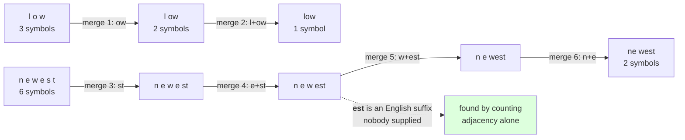

# 1.2 — Six merges, by hand

## One-line answer

Six applications of one rule on a four-word corpus take it from **55 symbols to 25** and produce the
token `est` — a real English suffix — at step four, discovered from nothing but adjacency counts.

---

## The story

You are watching somebody lay a brick path across a garden.

They put down the first brick, then the next, and after a while you notice they are not laying them one
by one any more. They have started picking up pairs that always go together — two bricks side by side,
lifted and placed as one — because the same pairing keeps coming up.

By the end they are handling blocks of four and six at a time, and the path goes down in a fraction of
the trips.

Nobody designed the blocks. They came from noticing what kept repeating, and each new block was made out
of the blocks that already existed.

---

## The idea in plain language

Part [1.1](1.1-merge-the-commonest-pair.md) applied the rule once. This part applies it six times and
shows every intermediate state, because BPE is one of those algorithms that is obvious once you have
watched it and mysterious until you have.

The corpus is four distinct words. Small enough to check every count by hand, big enough to show the two
things that matter.

**Merges compound.** A merge does not just shorten words — it creates a new symbol that later merges can
themselves merge. Watch `st` become a symbol at step three and then get absorbed into `est` at step four.
By step five the corpus contains a five-character symbol, `west`, built from three earlier merges. This
is why the algorithm produces long tokens without ever considering anything longer than a pair: **length
comes from stacking, not from looking further ahead.**

**Nothing is spelled out for it.** `est` is a real English suffix. Nobody told the algorithm that. It
appeared because `newest` and `widest` share it and the counting noticed. Day 11 part
[2.4](../../../day-011-character-and-word-tokenizers/parts/02-word-level/2.4-one-meaning-six-slots.md)
asked what you would have to count to find `ing` without a suffix list; this is the answer, at four-word
scale, and part [2.3](../02-training-a-vocabulary/2.3-reading-the-table.md) is the same thing at
110,837-character scale.

One term to name before the trace. The **symbol count** is the total number of symbols in the corpus,
weighted by word frequency — 55 at the start here. It is the quantity BPE reduces, and it is exactly
what Day 11 part
[1.3](../../../day-011-character-and-word-tokenizers/parts/01-character-level/1.3-the-sequence-length-problem.md)
called sequence length. **Every merge trades one vocabulary slot for a reduction in symbol count**, and
the whole of BPE is choosing which trades to make.

This part uses `text.split()` for the words, which throws the spaces away. That is a real problem and
part [1.4](1.4-the-pre-tokenizer.md) fixes it — but fixing it first would put two new ideas in one
trace, so the spaces come back in two parts' time.

---

## Why Akshara needs it

- **Part [1.3](1.3-the-loop-and-where-it-stops.md)** wraps this trace in a loop and asks when to stop.
  You need to have seen the states to have an opinion about that.
- **Part [1.5](1.5-the-merge-that-ate-the-space.md)** is the same trace with the pre-tokenizer removed,
  and the difference is only legible if you know what the correct trace looks like.
- **Day 13** encodes with a trained merge list, applying the merges in order. The order visible in this
  trace is the order that matters there.
- **Day 17** debugs a tokenizer that splits numbers badly. Reading a merge trace is the diagnostic, and
  this is where you learn to read one.

---

## The mechanism

The whole trace, printed state by state:

```python
from collections import Counter

TOY = "low low low low low lower lower newest newest newest widest widest"
words = {tuple(w): n for w, n in Counter(TOY.split()).items()}
print("  toy words:", {"".join(k): v for k, v in words.items()})

for step in range(1, 7):
    pairs = pair_counts(words)
    top = sorted(pairs.items(), key=lambda kv: (-kv[1], kv[0]))[:4]
    best = max(pairs.items(), key=lambda kv: (kv[1], kv[0]))[0]
    n = pairs[best]
    words = {merge_word(w, best): c for w, c in words.items()}
    state = "  ".join(f"{''.join(k)}={list(k)}" for k in sorted(words, key="".join))
    print(f"  merge {step}: top " + ", ".join(f"{a+b!r}:{c}" for (a, b), c in top))
    print(f"           -> {best[0] + best[1]!r} ({n})   {state}")
```

**Line by line:**
- `pair_counts` and `merge_word` are part [1.1](1.1-merge-the-commonest-pair.md)'s functions, unchanged.
  This part adds no new machinery at all — it only runs the existing rule more than once, which is the
  whole point.
- The `top` list prints the four leading pairs **before** the merge, so at every step you can see the
  decision rather than only the outcome. A trace that prints only the winner teaches nothing about ties
  or near-misses.
- `sorted(words, key="".join)` orders the printed states alphabetically by the word's text, so the rows
  line up between steps and the changes are easy to follow by eye. **Without a stable print order the
  trace is unreadable**, and unreadable output is why people give up on tracing algorithms.
- `f"{best[0] + best[1]!r}"` uses `!r` so a merged symbol containing a space or a newline shows its
  quotes. Part 1.4 makes that essential; here it is a habit being formed early.
- Measured on Intel Core i3-1115G4 (2 cores / 4 threads), 11.7 GB RAM, Windows 11, CPython 3.12.12, on
  2026-08-26:

```text
  toy words: {'low': 5, 'lower': 2, 'newest': 3, 'widest': 2}
  merge 1: top 'lo':7, 'ow':7, 'es':5, 'st':5
           -> 'ow' (7)   low=['l', 'ow']  lower=['l', 'ow', 'e', 'r']  newest=['n', 'e', 'w', 'e', 's', 't']  widest=['w', 'i', 'd', 'e', 's', 't']
  merge 2: top 'low':7, 'es':5, 'st':5, 'ew':3
           -> 'low' (7)   low=['low']  lower=['low', 'e', 'r']  newest=['n', 'e', 'w', 'e', 's', 't']  widest=['w', 'i', 'd', 'e', 's', 't']
  merge 3: top 'es':5, 'st':5, 'ew':3, 'ne':3
           -> 'st' (5)   low=['low']  lower=['low', 'e', 'r']  newest=['n', 'e', 'w', 'e', 'st']  widest=['w', 'i', 'd', 'e', 'st']
  merge 4: top 'est':5, 'ew':3, 'ne':3, 'we':3
           -> 'est' (5)   low=['low']  lower=['low', 'e', 'r']  newest=['n', 'e', 'w', 'est']  widest=['w', 'i', 'd', 'est']
  merge 5: top 'ew':3, 'ne':3, 'west':3, 'dest':2
           -> 'west' (3)   low=['low']  lower=['low', 'e', 'r']  newest=['n', 'e', 'west']  widest=['w', 'i', 'd', 'est']
  merge 6: top 'ewest':3, 'ne':3, 'dest':2, 'er':2
           -> 'ne' (3)   low=['low']  lower=['low', 'e', 'r']  newest=['ne', 'west']  widest=['w', 'i', 'd', 'est']
```

Five things happen in that trace and each is worth naming.

**Merge 1 was a tie and the tie-break decided it.** `lo` and `ow` both occur 7 times. `ow` won because
`('o','w')` sorts after `('l','o')` and `max` keeps the larger key. Nothing about quality chose it, and
part [2.5](../02-training-a-vocabulary/2.5-the-vocabulary-that-depended-on-the-order-of-the-corpus.md) is
what happens when nothing decides it consistently.

**Merge 2 used the symbol merge 1 created.** The pair is `('l', 'ow')` — one character and one merged
symbol — giving `low` at count 7. This is compounding, and it is why the pairs list at step 2 contains
`low` at all: it did not exist as a candidate before step 1 ran.

**Merge 3 changed subject.** `low` is finished; the algorithm moves to the other side of the corpus and
takes `st`, which is shared by `newest` and `widest` — two words with nothing else in common. **BPE
finds structure across words, not within them.**

**Merge 4 is the one to remember.** `est`, count 5, built by absorbing `st` into the `e` before it. That
is an English suffix, discovered on the fourth step of a mechanical count, in a corpus that contains no
grammar and no instructions.

**Merge 5 and 6 are the algorithm running out of good ideas.** `west` at count 3 is a real pattern in
this corpus and meaningless English. `ne` at count 3 is the same. With a corpus this small the useful
merges are exhausted after four steps, which is a miniature of a real trade-off: part
[2.2](../02-training-a-vocabulary/2.2-training-to-a-target-size.md) shows the same shape at scale, where
the useful merges last a lot longer but still run out.

Now the quantity all of this is spending:

```python
w0 = {tuple(w): n for w, n in Counter(TOY.split()).items()}
print(f"    start: {sum(len(w) * n for w, n in w0.items())} symbols")

w = dict(w0)
for i, m in enumerate(merges, 1):
    w = {merge_word(k, m): c for k, c in w.items()}
    print(f"    after merge {i} ({''.join(m)!r}): {sum(len(k) * c for k, c in w.items())} symbols")
```

**Line by line:**
- `len(w) * n` weights each word's symbol count by its frequency, giving the corpus's total symbol count
  — the number a model would have to process. Counting distinct words instead would report a number no
  training run cares about.
- The loop re-applies the merges from the original corpus rather than continuing from the previous state,
  which is slower and is the right choice here: it proves the merge list alone reproduces every
  intermediate state, which is the property part
  [2.1](../02-training-a-vocabulary/2.1-the-merge-table-is-the-artifact.md) depends on.
- Measured on this machine, 2026-08-26:

```text
    start: 55 symbols
    after merge 1 ('ow'): 48 symbols
    after merge 2 ('low'): 41 symbols
    after merge 3 ('st'): 36 symbols
    after merge 4 ('est'): 31 symbols
    after merge 5 ('west'): 28 symbols
    after merge 6 ('ne'): 25 symbols
```

**Fifty-five symbols became twenty-five, for six vocabulary slots.** That is the exchange rate, and it is
the same trade Day 11 part 3.1 called a budget question: sequence length for vocabulary size. The
difference from Day 11 is that here you get to choose where on the line to sit, one merge at a time, and
**the algorithm always spends the next slot on the biggest available saving.**

Notice the shape of the savings: 7, 7, 5, 5, 3, 3. Each merge saves exactly its pair's count, because
each occurrence of the pair becomes one symbol instead of two. **The savings are the counts**, and since
the counts only ever go down, so do the savings. Part 2.2 measures where that curve flattens on a real
corpus.



---

## When it breaks

**The loud failure — merging a pair that is no longer there.** After a merge, the pair's components may
have been consumed, so re-applying the same merge does nothing and the trainer can spin:

```console
>>> words = {("l", "o", "w"): 5}
>>> words = {merge_word(w, ("o", "w")): n for w, n in words.items()}
>>> words
{('l', 'ow'): 5}
>>> words = {merge_word(w, ("o", "w")): n for w, n in words.items()}
>>> words
{('l', 'ow'): 5}
```

What it means: the second application is a no-op — `o` and `w` are gone, absorbed into `ow`. It does not
raise. A trainer that appends a merge without checking that it changed anything adds a useless vocabulary
entry and, if its stopping rule is "keep going until `V` is reached", **never terminates**. Part
[1.3](1.3-the-loop-and-where-it-stops.md) is where the stopping rule earns its place.

**The silent failure — a trace you cannot read, which is how tie bugs survive.** Print only the winner
and the tie in merge 1 is invisible:

```text
  what a minimal trace prints:
    merge 1 -> 'ow'
    merge 2 -> 'low'
    merge 3 -> 'st'
  what it hides:
    merge 1 was a tie between 'lo' (7) and 'ow' (7)
    the winner was chosen by the tie-break, not by the counts
    a different tie-break gives 'lo', then 'low' via ('lo','w'), and a different vocabulary
  both traces look correct, and part 2.5 measures two runs diverging at merge 24.
```

**The check that catches it** asserts the invariant the trace should satisfy at every step:

```python
def assert_trace_is_sound(words: dict[tuple[str, ...], int],
                          merges: list[tuple[str, str]]) -> None:
    """Replaying the merge list must reproduce the trace, and every step must shorten."""
    text_before = Counter()
    for w, n in words.items():
        text_before["".join(w)] += n

    state = dict(words)
    previous = sum(len(w) * n for w, n in state.items())
    for i, m in enumerate(merges, 1):
        state = {merge_word(w, m): n for w, n in state.items()}
        current = sum(len(w) * n for w, n in state.items())
        assert current < previous, f"merge {i} ({''.join(m)!r}) saved nothing: {previous} symbols"
        previous = current

    text_after = Counter()
    for w, n in state.items():
        text_after["".join(w)] += n
    assert text_before == text_after, "replaying the merges changed the text"
```

**Line by line:**
- The function takes the **starting corpus and the merge list**, not the intermediate states, so it tests
  the thing that will actually be shipped: part 2.1's artifact is the merge list and nothing else.
- `current < previous` at every step is the strict version of "a merge must do something". It catches the
  no-op above, and it catches a merge list that has been reordered — a later merge whose inputs have not
  been created yet saves nothing.
- The text comparison at the end is part 1.1's losslessness invariant, applied to the whole replay rather
  than one step. **Together the two assertions say: the merge list reconstructs the trace, and the trace
  never altered the text.**
- What it does not check is that each merge was the *best* available. That is unprovable from the artifact
  alone — you would need the corpus and the tie-break — which is precisely why part 2.5 argues the
  tie-break belongs in the recorded configuration.

---

## In production

**What a research engineer writes instead of the teaching version.** They do not print traces during
training — a real run makes tens of thousands of merges — but they do **read the first hundred merges of
every trained tokenizer**, because that list is a compressed description of the corpus and anomalies show
up immediately. Part [2.3](../02-training-a-vocabulary/2.3-reading-the-table.md) is that skill; this part
is where you learn what a healthy trace looks like so that an unhealthy one is recognisable.

The second habit is keeping a **toy fixture** exactly like this one in the test suite. Four words, six
merges, a hand-checked expected output. It runs in milliseconds, it fails loudly when somebody changes the
tie-break or the weighting, and it is the only test in a tokenizer suite that a human can verify by
reading.

**What degrades at scale.** Nothing about the algorithm — the same six steps happen the same way. What
degrades is your ability to check it. At four words the trace fits on a page and every count can be
verified by counting letters; at 5,712 distinct chunks it cannot, and from then on you are trusting the
implementation. That is the argument for the toy fixture: **the last point at which you can verify the
algorithm by hand is the point worth freezing into a test.**

**The failure that only shows with real data.** Merges spent on formatting. This toy corpus is four
English words, so every merge is linguistic. Part 2.3 measures merge 10 on the real corpus being two
spaces and a 20,000-character slice putting four spaces at merge 6 — because indented code blocks and
tables really do contain the commonest pairs in the document. The algorithm is correct and the corpus is
not what you assumed.

**The review comment.** *"The trace only prints the chosen merge. Print the top few candidates with their
counts — half the tokenizer bugs I have seen are ties resolved differently between two runs, and you
cannot see a tie in a list of winners."*

**The interview question.** *"How does BPE end up with long tokens if it only ever merges pairs?"* The
weak answer is that it looks at longer spans. The strong answer is compounding: **a merge creates a
symbol, and later merges treat that symbol as a unit, so a four-character token is a pair of two-character
symbols — in my trace `west` appeared at step five, built from `st`, then `est`, then `w`+`est`.** Then
the observation that shows you traced it: *and the savings per merge are exactly the pair's count, so
they decrease monotonically — which is why the compression curve flattens.*

**Compute tier: T0.** The standard library on a laptop, on a corpus of twelve words written into the
script. No packages, no network, no GPU, no seed, no file on disk — **this part's numbers do not depend on
the corpus hash at all** and reproduce exactly on any machine running Python 3. That is deliberate: the
by-hand trace is the one thing in this day that should be checkable without reference to anything
external. What T0 cannot show is whether these merges are *good* — on twelve words the question is not
meaningful, and part 2.2 is where quality becomes measurable.

---

## Check yourself

Run this. It prints **six merges and a symbol count falling from 55 to 25**:

```python
from collections import Counter


def pair_counts(words):
    pairs = Counter()
    for symbols, n in words.items():
        for a, b in zip(symbols, symbols[1:]):
            pairs[(a, b)] += n
    return pairs


def merge_word(symbols, pair):
    a, b = pair
    out, i = [], 0
    while i < len(symbols):
        if i < len(symbols) - 1 and symbols[i] == a and symbols[i + 1] == b:
            out.append(a + b)
            i += 2
        else:
            out.append(symbols[i])
            i += 1
    return tuple(out)


TOY = "low low low low low lower lower newest newest newest widest widest"
words = {tuple(w): n for w, n in Counter(TOY.split()).items()}
print("  start:", sum(len(w) * n for w, n in words.items()), "symbols")

for step in range(1, 7):
    pairs = pair_counts(words)
    best = max(pairs.items(), key=lambda kv: (kv[1], kv[0]))[0]
    saved = pairs[best]
    words = {merge_word(w, best): c for w, c in words.items()}
    print(f"  merge {step}: {best[0] + best[1]!r:<8} saved {saved:>2}  "
          f"now {sum(len(w) * n for w, n in words.items()):>2} symbols")
```

**Line by line:**
- The `saved` column equals the pair's count every time. **Say out loud why that is exactly true, and say
  what it implies about whether the savings can ever increase.**
- Merge 4 produces `est`. Say what would have had to be in the algorithm for it to find that deliberately,
  and confirm that none of it is.
- The final count is `25` from `55`. Say how many vocabulary slots that cost, and compare the trade with
  Day 11's character-versus-word table.
- Now change the tie-break to `max(pairs, key=pairs.get)` and re-run. Say whether merge 1 changes, and say
  whether you can predict the answer without running it.

**Say this out loud, without scrolling up:** explain how a six-character token can come out of an
algorithm that only ever merges two symbols, say exactly how many symbols each merge saves, and name the
step at which a real English suffix appeared and what told the algorithm to look for it.
