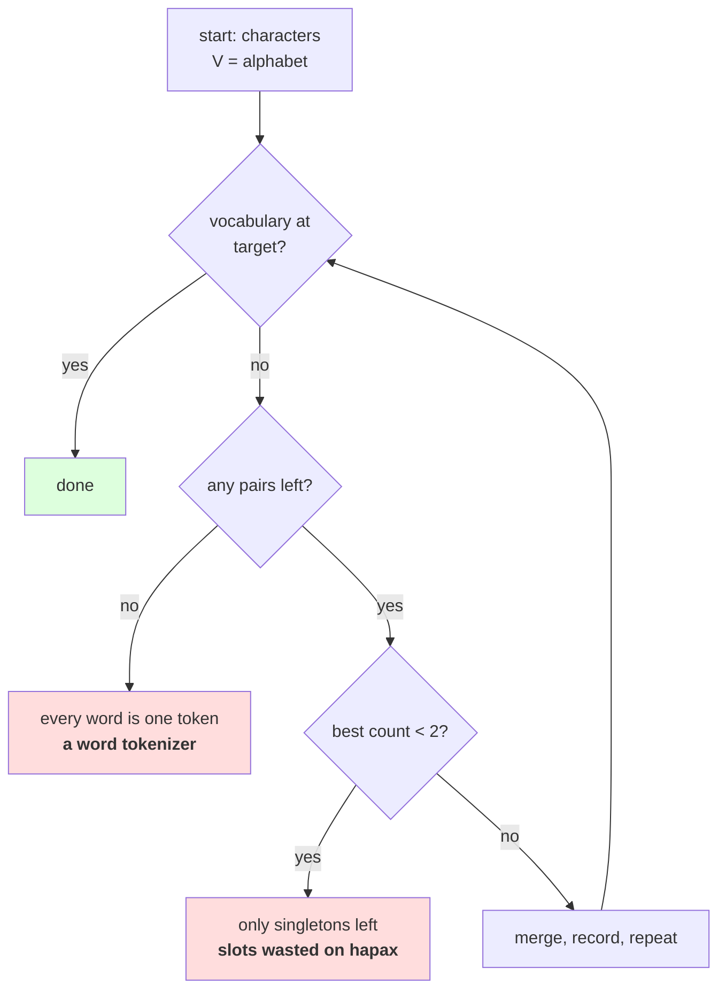

# 1.3 — The loop, and where it stops

## One-line answer

Left to run, BPE does not converge on something clever — it **becomes a word tokenizer**: on the toy
corpus it exhausts itself after 12 merges with every word a single token, so the target vocabulary size
is not a tuning knob but the thing that places BPE between Day 11's two failures.

---

## The story

You are boiling milk down for sweets. The longer it cooks, the thicker it gets.

Take it off early and it is still mostly liquid. Cook it a while and it is the consistency you wanted.
Leave it on and it keeps thickening, past what you wanted, until it is a solid block stuck to the pan.

Nothing goes wrong at any point. The process is the same process the whole way through — the only
decision anybody makes is **when to take it off the heat**, and that decision is the entire recipe.

---

## The idea in plain language

Parts [1.1](1.1-merge-the-commonest-pair.md) and [1.2](1.2-six-merges-by-hand.md) applied the rule once
and six times. The obvious next question is: how many times?

It matters more than it looks, because BPE has no natural stopping point that produces something good.
It has two stopping points that produce something *finished*, and they are both bad:

- **No pairs left.** Every word has been merged down to a single symbol. Measured below, the toy corpus
  reaches this after 12 merges, and at that point `low`, `lower`, `newest` and `widest` are each one
  token. **That is a word tokenizer** — the exact object Day 11 part
  [2.5](../../../day-011-character-and-word-tokenizers/parts/02-word-level/2.5-the-word-tokenizer-that-could-not-say-the-word.md)
  showed cannot spell.
- **The best pair occurs once.** Merging it saves exactly one symbol and spends a whole vocabulary slot.
  Day 11 part
  [2.3](../../../day-011-character-and-word-tokenizers/parts/02-word-level/2.3-the-out-of-vocabulary-wall.md)
  made the same argument about words seen once: a slot spent on a single occurrence is a slot spent on
  nothing the model can learn.

So the loop stops on a number **you choose**, and that number is `target_vocab`. The arithmetic is exact:

```
n_merges = target_vocab - len(alphabet)
```

Because the vocabulary is the alphabet plus one entry per merge and nothing else, there is no rounding
and no surprise — unlike Day 11 part
[2.2](../../../day-011-character-and-word-tokenizers/parts/02-word-level/2.2-building-a-word-vocabulary.md)'s
off-by-one, where `max_size=1000` gave `V = 1001`. **Here the target is the vocabulary size**, provided
you remember that the alphabet is part of it.

That relation has a consequence worth stating before it bites: **the alphabet is a floor on `V`.** On
this corpus the alphabet is 151 characters, so no target below 151 is achievable — asking for 100 gives
you 151 and zero merges. Day 13's byte alphabet makes that floor exactly 256, always, for every corpus
and every language, which is one more thing that becomes predictable when the alphabet stops depending
on the data.

And the three guards the loop needs, each of which corresponds to something that actually goes wrong:

- **Stop when there are no pairs.** Otherwise `max()` raises `ValueError` on an empty sequence.
- **Stop when the best count is below a threshold.** Otherwise you spend slots on singletons.
- **Never append a merge that changed nothing.** Part [1.2](1.2-six-merges-by-hand.md) measured the
  no-op case; without this guard a trainer can loop forever appending useless entries.

---

## Why Akshara needs it

- **Part [2.2](../02-training-a-vocabulary/2.2-training-to-a-target-size.md)** varies `target_vocab` on
  the real corpus and measures what each choice buys. This part is the loop it varies.
- **Part [2.4](../02-training-a-vocabulary/2.4-what-training-costs.md)** measures the cost per merge, and
  the total is that cost times the number this part decides.
- **Day 13** keeps the loop unchanged and swaps the alphabet, so the `V = alphabet + merges` relation is
  what makes a byte-level vocabulary's size predictable.
- **Day 17** treats vocabulary size as a design decision with an embedding cost and a sequence-length
  benefit. The knob it turns is the one this part introduces.

---

## The mechanism

The loop, with its three guards:

```python
def train(text: str, target_vocab: int) -> tuple[list[str], list[tuple[str, str]]]:
    """Learn merges until the vocabulary reaches target_vocab, or until there is nothing worth merging."""
    alphabet = sorted(set(text))
    words = word_counts(text)
    merges: list[tuple[str, str]] = []

    for _ in range(max(0, target_vocab - len(alphabet))):
        pairs = pair_counts(words)
        if not pairs:
            break
        best = max(pairs.items(), key=lambda kv: (kv[1], kv[0]))[0]
        if pairs[best] < 2:
            break
        words = {merge_word(w, best): n for w, n in words.items()}
        merges.append(best)

    vocab = alphabet + ["".join(m) for m in merges]
    return vocab, merges
```

**Line by line:**
- `max(0, target_vocab - len(alphabet))` is the alphabet floor made safe. A target below the alphabet
  size gives a negative count, and `range` of a negative number is empty rather than an error — so
  wrapping it in `max(0, …)` is not strictly required, and it is written anyway because **the intent
  should be visible without reasoning about `range`'s behaviour on negatives.**
- `if not pairs: break` guards the first stopping point. `max()` on an empty `Counter` raises
  `ValueError: max() arg is an empty sequence`, which is an unhelpful traceback from deep inside a
  training run.
- `if pairs[best] < 2: break` is the second. The threshold is written as a literal `2` rather than a
  parameter because at `1` the merge is worthless by definition; anything higher is a policy choice and
  would belong in the signature if you wanted one.
- `merges.append(best)` comes **after** the corpus is updated, so a merge is only recorded once it has
  actually been applied. Appending first and applying inside a `try` is how a merge list ends up with an
  entry the corpus never saw.
- `vocab = alphabet + [...]` builds the vocabulary in **learned order**: alphabet first, then merges in
  the order they were made. That ordering is not cosmetic — part
  [2.1](../02-training-a-vocabulary/2.1-the-merge-table-is-the-artifact.md) shows that applying the merges
  in a different order gives different tokens.
- The function returns **both** the vocabulary and the merges. They are not redundant: the vocabulary is
  what sizes an embedding matrix, and the merge list is what encodes text. Day 13 needs the second and
  Day 18 needs the first.

Let it run to exhaustion on the toy corpus:

```python
from collections import Counter

TOY = "low low low low low lower lower newest newest newest widest widest"
w = {tuple(x): n for x, n in Counter(TOY.split()).items()}
alphabet = sorted(set(TOY))
count = 0

while True:
    pairs = pair_counts(w)
    if not pairs:
        print(f"    stopped: no pairs left after {count} merges")
        break
    best = max(pairs.items(), key=lambda kv: (kv[1], kv[0]))[0]
    if pairs[best] < 2:
        print(f"    stopped: best pair {ascii(''.join(best))} occurs only {pairs[best]} time(s), "
              f"after {count} merges")
        break
    w = {merge_word(k, best): c for k, c in w.items()}
    count += 1

print(f"    alphabet {len(alphabet)} + merges {count} = V {len(alphabet) + count}")
print("    final words:", [(("".join(k)), list(k)) for k in sorted(w, key="".join)])
```

**Line by line:**
- The `while True` with two `break`s is deliberately written without a target, because this block is
  asking **what happens with no target at all** — which is the question the target exists to answer.
- Both `break`s print which condition fired. In a real trainer that goes to a log line, and it matters:
  "stopped early at 4,812 of 8,000 requested merges" is a fact about your corpus that you want to know.
- Measured on Intel Core i3-1115G4 (2 cores / 4 threads), 11.7 GB RAM, Windows 11, CPython 3.12.12, on
  2026-08-26:

```text
    stopped: no pairs left after 12 merges
    alphabet 11 + merges 12 = V 23
    final words: [('low', ['low']), ('lower', ['lower']), ('newest', ['newest']), ('widest', ['widest'])]
```

**Read the final line.** Every word is one token. The tokenizer that started as a character tokenizer has
become a word tokenizer, with all of Day 11 section 2's problems, arrived at by a completely different
route.

That is the sentence this part exists for. **BPE is not a scheme that sits between characters and words —
it is a dial that runs from one to the other**, and where it stops is the only thing that distinguishes
the good answer from the two bad ones:

| Merges | What the tokenizer is | Day 11's verdict |
| --- | --- | --- |
| 0 | a character tokenizer, `V = 151` | lossless, 5.56× too long |
| some | a subword tokenizer | what Day 12 and 13 are for |
| all of them | a word tokenizer over the training corpus | cannot spell an unseen word |

And it is worth being precise about the last row, because it is *not* quite Day 11's word tokenizer.
Run to exhaustion, BPE has a token for every training word **and still has the alphabet underneath it**.
An unseen word falls back to characters rather than to `<unk>`. So even the degenerate case keeps the
one property Day 11's word tokenizer lacked — it just spends an enormous vocabulary to do it, and gets no
compression on anything it has not seen.

The stopping conditions, drawn:



---

## When it breaks

**The loud failure — no guard on the empty case:**

```console
>>> pairs = pair_counts({("a",): 3})
>>> pairs
Counter()
>>> max(pairs.items(), key=lambda kv: (kv[1], kv[0]))
Traceback (most recent call last):
  File "<stdin>", line 1, in <module>
ValueError: max() arg is an empty sequence
```

What it means: every word is already a single symbol, so there are no adjacent pairs. The smallest fix is
the `if not pairs: break`. **It fires at the end of a long training run**, which is the worst time for an
unguarded `ValueError` — hours of work and no artifact written.

**The second loud failure — a target below the alphabet:**

```console
>>> vocab, merges = train("hello world", target_vocab=3)
>>> len(vocab), len(merges)
(8, 0)
```

What it means: the alphabet has 8 distinct characters, so `V` cannot be 3. It does not raise; it returns
a vocabulary larger than requested with no merges at all. If a config says `vocab_size: 3` and an
embedding matrix is built from it, the matrix has 3 rows and the tokenizer emits ids up to 7 — an
`IndexError` far away from here, or worse, silently wrapped indices in a framework that allows them.

**The silent failure — a trainer that stops early and does not say so.** This is the one that reaches
production:

```text
  config          : vocab_size: 8000
  alphabet        : 151
  merges requested: 7,849
  merges made     : 4,812   <- the corpus ran out of pairs worth merging
  V actually      : 4,963
  embedding built from the config: 8,000 rows
  rows 4,963..7,999 : never indexed, never receive a gradient, never mentioned
  exception       : none
```

**The check that catches it** returns what happened rather than only the artifact:

```python
from dataclasses import dataclass


@dataclass(frozen=True)
class TrainingOutcome:
    """What the trainer actually did, as opposed to what it was asked to do."""

    target_vocab: int
    alphabet_size: int
    merges_requested: int
    merges_made: int
    stopped_because: str

    @property
    def vocab_size(self) -> int:
        return self.alphabet_size + self.merges_made

    def assert_as_requested(self) -> None:
        assert self.target_vocab >= self.alphabet_size, (
            f"target {self.target_vocab} is below the alphabet size {self.alphabet_size}; "
            f"V will be {self.vocab_size}"
        )
        assert self.merges_made == self.merges_requested, (
            f"asked for {self.merges_requested} merges, made {self.merges_made} "
            f"({self.stopped_because}); V is {self.vocab_size}, not {self.target_vocab}"
        )
```

**Line by line:**
- `vocab_size` is **derived** from the alphabet and the merges actually made, never stored. A stored `V`
  can disagree with the artifact; a derived one cannot.
- `stopped_because` is a string set by whichever `break` fired, so the failure message names the cause
  rather than leaving you to guess between "small corpus" and "target too high".
- `assert_as_requested` is separate from the dataclass's construction, so a caller can **record** the
  outcome without failing on it — which is what you want when deliberately training a small tokenizer on
  a small corpus.
- The first assertion catches the alphabet-floor case and the second catches early stopping, and both
  messages end by stating the real `V`. **The number that has to reach the embedding layer is the one in
  the message**, which is the whole point of the check.
- What this does not do is fix the config. A trainer that quietly lowered `vocab_size` to match would
  produce a tokenizer that disagrees with every other artifact built from that config, which is a worse
  outcome than a loud failure.

---

## In production

**What a research engineer writes instead of the teaching version.** The loop is the same. What is added
is **reporting**: merges made against merges requested, the count of the last merge accepted, and the
symbol-count reduction per thousand merges. The last of those is the one that tells you the target was
too high — when the curve has flattened, the remaining merges are buying almost nothing, and part
[2.2](../02-training-a-vocabulary/2.2-training-to-a-target-size.md) measures that curve.

The second habit is that **`vocab_size` is derived from the tokenizer, never from the config, everywhere
downstream.** The config says what to aim for; the artifact says what was achieved; the embedding matrix
is sized from the artifact. Any pipeline that reads the number from the config has a latent version of the
silent failure above.

**What degrades at scale.** The alphabet, which is the floor. On this corpus it is 151 characters and
irrelevant to a target of 8,000. On a large multilingual corpus a character alphabet can be tens of
thousands of entries — every Chinese character in the corpus is one — so the floor stops being a floor and
becomes most of the vocabulary, leaving few slots for merges. **That is not a tuning problem, it is the
character alphabet again**, and it is one more reason Day 13's fixed 256-byte alphabet is the answer
rather than a bigger target.

**The failure that only shows with real data.** Early stopping on a small or repetitive corpus. Ask for
32,000 merges from a corpus of a few megabytes and the trainer will run out of pairs worth merging long
before it gets there. Nothing is wrong — there genuinely is no more structure — but every downstream
artifact sized from the config is now wrong, and the only signal is the number nobody printed.

**The review comment.** *"`train(text, vocab_size)` returns the vocabulary but the embedding is built from
`config.vocab_size`. If the trainer stops early those two disagree and we silently allocate rows that never
get a gradient. Size the embedding from `len(tokenizer)`."*

**The interview question.** *"How do you choose the number of BPE merges?"* The weak answer is a number or
"experiment". The strong answer starts from what the endpoints are: **zero merges is a character
tokenizer and running to exhaustion is a word tokenizer — on my toy corpus that took 12 merges and left
every word as a single token — so the merge count is a dial between Day 11's two failures rather than a
hyperparameter with an optimum.** Then the practical part: *`V` is exactly the alphabet plus the merges,
the alphabet is a floor you cannot go below, and the trainer can stop early, so the number that matters
downstream is the one the artifact reports and not the one the config asked for.*

**Compute tier: T0.** The standard library on a laptop. The toy corpus runs to exhaustion instantly; the
full-corpus training is part 2.2's and is still a laptop job. No packages, no network, no GPU, no seed.
**The toy figures here do not depend on the corpus hash** and reproduce on any Python 3. What T0 cannot
tell you is where on the dial to stop for a given task — that is a training comparison and it is Day 17.
What this part settles is what the two ends of the dial are, which is a property of the algorithm and
needs no run at all.

---

## Check yourself

Run this. It prints **a tokenizer turning into a word tokenizer, and the exact merge count where it
happens**:

```python
from collections import Counter


def pair_counts(words):
    pairs = Counter()
    for symbols, n in words.items():
        for a, b in zip(symbols, symbols[1:]):
            pairs[(a, b)] += n
    return pairs


def merge_word(symbols, pair):
    a, b = pair
    out, i = [], 0
    while i < len(symbols):
        if i < len(symbols) - 1 and symbols[i] == a and symbols[i + 1] == b:
            out.append(a + b)
            i += 2
        else:
            out.append(symbols[i])
            i += 1
    return tuple(out)


TOY = "low low low low low lower lower newest newest newest widest widest"
w = {tuple(x): n for x, n in Counter(TOY.split()).items()}
alphabet = sorted(set(TOY))
count = 0
while True:
    pairs = pair_counts(w)
    if not pairs:
        reason = "no pairs left"
        break
    best = max(pairs.items(), key=lambda kv: (kv[1], kv[0]))[0]
    if pairs[best] < 2:
        reason = f"best pair occurs {pairs[best]} time(s)"
        break
    w = {merge_word(k, best): c for k, c in w.items()}
    count += 1

print("  stopped because:", reason)
print("  merges made    :", count)
print("  alphabet       :", len(alphabet))
print("  V              :", len(alphabet) + count)
print("  final words    :", [list(k) for k in sorted(w, key="".join)])
```

**Line by line:**
- `stopped because` prints `no pairs left`. **Say out loud what the tokenizer has become, and name the
  Day 11 part that describes its failure mode.**
- `V` prints `23` for an eleven-character alphabet. Say what `V` would be if you had asked for 100, and
  say what the trainer would have returned.
- The final words are each a single symbol. Say what happens when this tokenizer meets the word `slowest`,
  and say why that is still better than Day 11's word tokenizer meeting it.
- Now change the threshold from `pairs[best] < 2` to `pairs[best] < 3` and re-run. Say how many merges you
  get, and say what kind of token you stopped buying.

**Say this out loud, without scrolling up:** state the exact relation between `V`, the alphabet and the
merge count; name the two conditions that stop the loop on their own and what the tokenizer has become at
each; and say why the alphabet is a floor that no target can go below.
