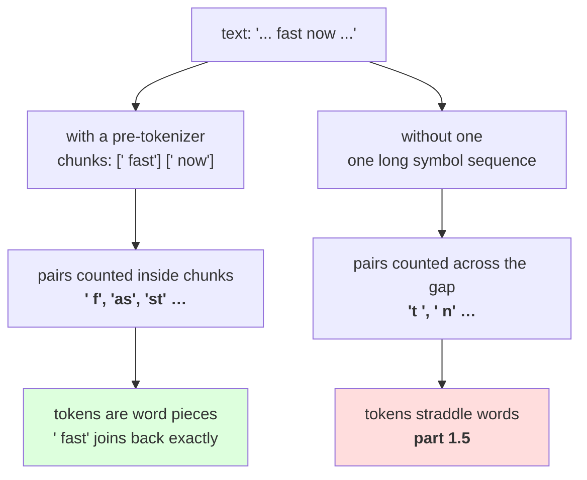

# 1.4 — The pre-tokenizer, or where merges are not allowed to reach

## One-line answer

Before any merging happens the text is cut into chunks that merges may not cross, and the pattern
`\s*\S+|\s+` does it while **reassembling into the original exactly** — which repairs, in one line, the
round-trip failure Day 11 measured on all five of its word splitters.

---

## The story

You are packing a lunchbox with two compartments.

Rice in one side, curry in the other. Nothing is stopping the two from touching if you tip the box, but
the divider is there, so they stay where you put them and you can still eat them separately at the other
end.

Take the divider out and the box holds exactly the same food. It travels the same distance. And when you
open it, the rice at the edge has gone the colour of the curry, and there is no getting it back to how
it was.

The divider does not change the food or the box. It changes what is allowed to mix.

---

## The idea in plain language

Parts [1.1](1.1-merge-the-commonest-pair.md) to [1.3](1.3-the-loop-and-where-it-stops.md) merged pairs
inside words, and got words by calling `text.split()`. That was a placeholder and it has two problems,
one obvious and one not.

**The obvious problem: it throws the layout away.** Day 11 part
[2.1](../../../day-011-character-and-word-tokenizers/parts/02-word-level/2.1-what-counts-as-a-word.md)
measured five splitters and all five failed `decode(encode(s)) == s` before meeting a single unknown
word, because the spaces and newlines between the words were simply gone. A tokenizer built on such a
splitter cannot honour the contract Day 9 established, no matter how good its merges are.

**The less obvious problem: without a boundary, merges cross words.** If the whole corpus is one long
sequence of symbols, then the commonest pairs include pairs that straddle a gap — the end of one word
and the space before the next. Part [1.5](1.5-the-merge-that-ate-the-space.md) measures what that costs;
this part is the fix.

A **pre-tokenizer** solves both at once. It is a function that cuts text into chunks with two required
properties:

- **The chunks reassemble.** `"".join(chunks) == text`, exactly. Nothing is dropped, nothing is added.
- **Merges never cross a chunk boundary.** Pairs are counted within a chunk only, so no token can ever
  span two chunks.

The pattern this day uses is `r"\s*\S+|\s+"`, and it is worth reading slowly because every piece of it
is doing something:

- `\s*\S+` — **any run of whitespace, followed by a run of non-whitespace.** The leading whitespace is
  *attached to the word that follows it*, so ` the` is one chunk rather than a space and a word. That is
  the trick that makes the join work with no separator.
- `|\s+` — **or a run of whitespace on its own.** This catches trailing whitespace at the end of the
  text, and any whitespace not followed by a word.
- The alternation order matters. Regular expressions try alternatives left to right, so `\s*\S+` is
  preferred and whitespace is only emitted alone when there is no following word.

Measured below, that pattern gives **19,773 chunks** on this corpus and joins back to the original
exactly. Compare with Day 11, where five splitters gave five different chunk counts and five `False`s.

One consequence to be clear about, because it changes what the tokens look like: **a token can now begin
with a space.** Measured in part [2.3](../02-training-a-vocabulary/2.3-reading-the-table.md), merge 12
on this corpus is ` the` — with the space — and merge 24 is ` and`. That is not a mistake in the trace.
The leading space is part of the token, it is how the text is put back together, and it is why real
tokenizers show tokens with visible leading spaces.

And the property it buys, which is the one Day 11 could not get: **the whole tokenizer is now lossless
again.** Measured in part [3.1](../03-together/3.1-three-tokenizers-one-table.md), `"".join(tokens) ==
text` over all 110,837 characters, with a subword vocabulary. That is a character tokenizer's property
at a word tokenizer's sequence length, which is what the day promised.

---

## Why Akshara needs it

- **Part [1.5](1.5-the-merge-that-ate-the-space.md)** removes this and measures the damage: 16 merges out
  of 60 gluing a word ending to the next space, against **none** with the pre-tokenizer in place.
- **Part [3.1](../03-together/3.1-three-tokenizers-one-table.md)** claims the BPE tokenizer is lossless.
  That claim is this pattern, and nothing else.
- **Day 13** replaces this pattern with the GPT-style one and reads it symbol by symbol. This part is why
  such a pattern exists at all; that day is about what a better one buys.
- **Day 17** measures tokenization pathologies on numbers, whitespace and code. Every one of those is a
  pre-tokenizer decision, taken here.

---

## The mechanism

The pattern, and the property that justifies it:

```python
import hashlib
import re
from pathlib import Path

PATTERN = r"\s*\S+|\s+"

raw = Path("docs/00_MASTER_PLAN.md").read_bytes()
text = raw.decode("utf-8")
print("  corpus sha256[:16] :", hashlib.sha256(raw).hexdigest()[:16])

chunks = re.findall(PATTERN, text)
print("  chunks             :", len(chunks))
print("  lossless           :", "".join(chunks) == text)
print("  distinct chunks    :", len(set(chunks)))
print("  first 8            :", [repr(c) for c in chunks[:8]])
```

**Line by line:**
- `PATTERN` is a module-level constant and a raw string, for the two reasons Day 11 part 2.1 gave: one
  place to be wrong, and `\s` is not a valid Python escape without the `r`.
- `"".join(chunks)` uses **no separator**, which is the whole design. A pre-tokenizer whose inverse needs
  a separator has not kept the layout; one whose inverse is a bare join has.
- `len(set(chunks))` is the number of distinct chunk types, which is what the trainer actually iterates
  over — 5,712 here against 19,773 occurrences. Part
  [2.4](../02-training-a-vocabulary/2.4-what-training-costs.md) is where that ratio becomes the reason
  training is affordable at all.
- Measured on Intel Core i3-1115G4 (2 cores / 4 threads), 11.7 GB RAM, Windows 11, CPython 3.12.12, on
  2026-08-26:

```text
  corpus sha256[:16] : 9760f2b6d4340b97
  chunks             : 19773
  lossless           : True
  distinct chunks    : 5712
  first 8            : ["'---'", "'\\nplan:'", "' akshara'", "'\\nversion:'", '\' "v1.3.0"\'', "'\\ncurricula:'", "' 17'", "'\\nids:'"]
```

**`lossless: True`.** Day 11 part 2.1's table had five `False`s in that column and no fix; this is the
fix, and it is one regular expression.

Look at the chunks themselves. `'\\nplan:'` is a newline, then `plan:` — the newline is *part of the
chunk*. `' akshara'` carries its leading space. Nothing between the chunks is discarded because there is
nothing between the chunks: **they tile the text.** The doubled backslashes are one level of
escaping per level of container — `repr` inside a list that is itself printed — exactly as Day 10 part
1.5 measured.

Now the second property. Merges are counted inside chunks, so a pair can never straddle two:

```python
from collections import Counter


def word_counts(text: str) -> dict[tuple[str, ...], int]:
    """Chunk the text, count the chunks, and split each into its starting symbols."""
    counts = Counter(re.findall(PATTERN, text))
    return {tuple(chunk): n for chunk, n in counts.items()}


TOY = "low low low low low lower lower newest newest newest widest widest"
words = word_counts(TOY)
for chunk, n in sorted(words.items(), key=lambda kv: (-kv[1], kv[0])):
    print(f"    {''.join(chunk)!r:<10} x{n}   symbols={list(chunk)}")
```

**Line by line:**
- `Counter(...)` over the chunks collapses the 19,773 occurrences into 5,712 entries with counts — which
  is the representation parts 1.1 to 1.3 already assumed, now produced by a pre-tokenizer that keeps the
  layout.
- `tuple(chunk)` splits a chunk into single characters. For `' akshara'` that is `[' ', 'a', 'k', ...]`
  — **the space is the first symbol**, an ordinary member of the alphabet, and merges can attach it to
  what follows exactly as they attach any other pair.
- What no code here does is join chunks. `pair_counts` iterates each chunk's symbols separately, so a pair
  spanning two chunks is never counted and therefore never merged. **The boundary is enforced by the data
  structure rather than by a rule**, which is why there is nothing to forget.
- Measured on this machine, 2026-08-26:

```text
    ' low'     x4   symbols=[' ', 'l', 'o', 'w']
    ' newest'  x3   symbols=[' ', 'n', 'e', 'w', 'e', 's', 't']
    ' lower'   x2   symbols=[' ', 'l', 'o', 'w', 'e', 'r']
    ' widest'  x2   symbols=[' ', 'w', 'i', 'd', 'e', 's', 't']
    'low'      x1   symbols=['l', 'o', 'w']
```

**Two things changed from part [1.2](1.2-six-merges-by-hand.md)'s table.**

`low` is now two entries: `' low'` occurring four times and `'low'` — the very first word in the string,
which has no space before it — occurring once. That is correct and it is the cost of the scheme: **the
same word at the start of a line and in the middle of a sentence are different tokens.** Real tokenizers
have this property and it is the source of the trailing-space bug Day 17 measures.

And the counts have shifted: `' low'` is 4 rather than 5, because one `low` went to the no-space chunk.
Every number in part 1.2's trace changes slightly under the real pre-tokenizer, which is exactly why that
part used `.split()` — one new idea at a time.

Run the merges with the divider in and the difference is immediate:



---

## When it breaks

**The loud failure — a pattern with a capturing group.** `re.findall` changes what it returns when the
pattern contains groups, and the change is silent until you check the join:

```console
>>> import re
>>> re.findall(r"(\s*)(\S+)", " the cat")
[(' ', 'the'), (' ', 'cat')]
>>> "".join(re.findall(r"(\s*)(\S+)", " the cat"))
Traceback (most recent call last):
  File "<stdin>", line 1, in <module>
TypeError: sequence item 0: expected str instance, tuple found
```

What it means: with groups, `findall` returns tuples rather than strings. The smallest fix is to use
non-capturing groups `(?:...)` or, as here, no groups at all. **This is the good outcome** — the
`TypeError` fires immediately. A pattern with *one* group returns strings again and silently returns only
that group's text, which does not raise and does lose data.

**The silent failure — a pre-tokenizer that drops something.** Any pattern that does not tile the text
loses whatever falls between the matches, and the loss is invisible unless you check the join:

```text
  pattern  : r"\S+"            chunks 19773   lossless False   (every space gone)
  pattern  : r"\w+"            chunks 16956   lossless False   (spaces and punctuation gone)
  pattern  : r"\s*\S+|\s+"     chunks 19773   lossless True
  the first two produce perfectly reasonable-looking chunk lists and a tokenizer
  that cannot reproduce its own input. No exception is raised by any of them.
```

**The check that catches it** is the join, made mandatory:

```python
import re


def pretokenize(text: str, pattern: str = PATTERN) -> list[str]:
    """Cut text into chunks that merges may not cross. Asserts the tiling property."""
    chunks = re.findall(pattern, text)
    assert "".join(chunks) == text, (
        f"pre-tokenizer is not lossless: {len(text)} characters in, "
        f"{len(''.join(chunks))} out"
    )
    return chunks


def assert_no_merge_crosses_a_chunk(tokens: list[str], chunks: list[str]) -> None:
    """Every token must lie inside exactly one chunk. Checked by re-deriving the boundaries."""
    boundaries, pos = set(), 0
    for c in chunks:
        pos += len(c)
        boundaries.add(pos)
    pos = 0
    for t in tokens:
        start, pos = pos, pos + len(t)
        crossed = {b for b in boundaries if start < b < pos}
        assert not crossed, f"token {t!r} at {start} crosses a chunk boundary at {sorted(crossed)}"
```

**Line by line:**
- The assertion lives **inside** `pretokenize`, so there is no way to obtain chunks without the property
  having been checked. A separate `validate_pretokenizer` function is one somebody forgets to call.
- The message prints both character counts, so a failure says *how much* was lost. Losing one trailing
  newline and losing every space are different bugs and the numbers separate them at a glance.
- `assert_no_merge_crosses_a_chunk` re-derives the boundaries from the chunk lengths rather than trusting
  the tokenizer, which is what makes it an independent check. It is `O(chunks)` per call and belongs in
  the test suite rather than in the encode path.
- `start < b < pos` uses strict inequalities on both sides, because a token that *ends* exactly on a
  boundary is fine — that is the normal case — and only a boundary strictly inside a token is a
  violation.
- Running this on a real corpus is expensive and worth doing once, on a sample, in the tests. Part
  [1.5](1.5-the-merge-that-ate-the-space.md) is what it catches.

---

## In production

**What a research engineer writes instead of the teaching version.** They use a more elaborate pattern —
Day 13 builds one — that also separates letters from digits, isolates punctuation, and caps runs of
whitespace. The requirements do not change: it must tile the text, and it must define the boundaries
merges cannot cross. What is added is control over *where* the boundaries fall, because every boundary
is a place the tokenizer is forbidden to compress, and putting one between every digit is how you stop a
tokenizer learning that `2019` is one token and `2020` is three.

The second habit is that **the pattern is part of the serialised tokenizer**, exactly like the
normalization form on Day 11 part 1.1. A vocabulary trained under one pattern and used under another
produces chunks the merges were never fitted to — the merges still apply, nothing raises, and the
compression quietly gets worse. Part [2.1](../02-training-a-vocabulary/2.1-the-merge-table-is-the-artifact.md)
puts it in the artifact and in the hash.

**What degrades at scale.** Chunk-type growth, which is the trainer's real input size. This corpus has
19,773 chunks and 5,712 distinct ones — a ratio of 3.5. On a large corpus the distinct count grows and
the ratio improves, so the collapse into counts saves more; but a pattern that produces very long chunks
(a URL, a base64 blob, a line of minified code) gives the trainer single chunks of thousands of symbols,
and the inner loop over `zip(symbols, symbols[1:])` is linear in that length on every pass. **A pattern
with no upper bound on chunk length is a training-time hazard**, which is one of the things Day 13's
pattern addresses.

**The failure that only shows with real data.** Whitespace-significant text. This pattern attaches leading
whitespace to the following word, so a run of sixteen spaces before an indented line becomes part of one
chunk and the merges will happily learn tokens for common indentation levels. That is fine and even
desirable for code — and it means **a corpus of indented code spends early vocabulary on indentation**,
which part 2.3 measures happening on this corpus at merge 10.

**The review comment.** *"`re.findall(r'\S+', text)` as the pre-tokenizer — that drops every space, so the
tokenizer cannot reproduce its input and the merges will never learn a token with a leading space. Use a
pattern that tiles the text and assert the join in the function."*

**The interview question.** *"What does a pre-tokenizer do, and why not just merge over the whole text?"*
The weak answer is "it splits into words". The strong answer names both jobs: **it defines the boundaries
merges may not cross, and it has to tile the text so the tokenizer stays lossless — the pattern I used
attaches leading whitespace to the following word, so the inverse is a bare join.** Then the reason the
second job matters: *merging across word boundaries produces tokens like `'t '` and `', '` that glue a
word's ending to the next word's space, and once those are in the vocabulary the tokenization of a word
depends on what follows it.*

**Compute tier: T0.** The standard library on a laptop, over a 113,283-byte file in this repository. No
packages, no network, no GPU, no seed. The chunk counts reproduce exactly for anyone whose corpus hash
matches `9760f2b6d4340b97`; the toy table and the losslessness property do not depend on the corpus at
all. What T0 cannot show is which pre-tokenizer pattern trains a better model — that is Day 17 — but it
does settle which patterns are *permissible*, because losslessness is a property you can check without a
run and five of Day 11's splitters fail it.

---

## Check yourself

Run this. It prints **a splitter that reassembles into the original, which none of Day 11's did**:

```python
import hashlib
import re
from collections import Counter
from pathlib import Path

raw = Path("docs/00_MASTER_PLAN.md").read_bytes()
text = raw.decode("utf-8")
print("  corpus sha256[:16] :", hashlib.sha256(raw).hexdigest()[:16])

for name, pat in (("\\S+", r"\S+"),
                  ("\\w+", r"\w+"),
                  ("\\s*\\S+|\\s+", r"\s*\S+|\s+")):
    chunks = re.findall(pat, text)
    print(f"  {name:<14} chunks={len(chunks):>6}  distinct={len(set(chunks)):>5}  "
          f"lossless={''.join(chunks) == text}")

chunks = re.findall(r"\s*\S+|\s+", text)
print("  first 6 chunks :", [repr(c) for c in chunks[:6]])
print("  chunks starting with a space:",
      f"{sum(1 for c in chunks if c.startswith(' ')) / len(chunks):.1%}")
```

**Line by line:**
- Only the third pattern prints `lossless=True`. **Say out loud what the first two lost, and say whether
  a bigger vocabulary could recover it.**
- The first six chunks show leading newlines and spaces attached to the following word. Say what token
  merge 12 of part 2.3 will turn out to be, and why it has a space in it.
- The last line prints the share of chunks that begin with a space. Say what that implies about how many
  vocabulary entries will have a leading space, and say what happens to a word at the very start of a
  document.
- Now try `re.findall(r"(\s*)(\S+)", text)` and call `"".join` on the result. Say what error you get and
  say what the fix is.

**Say this out loud, without scrolling up:** name the two jobs a pre-tokenizer does, state the one-line
property that makes a pattern permissible, and say why a token in this scheme can begin with a space.
