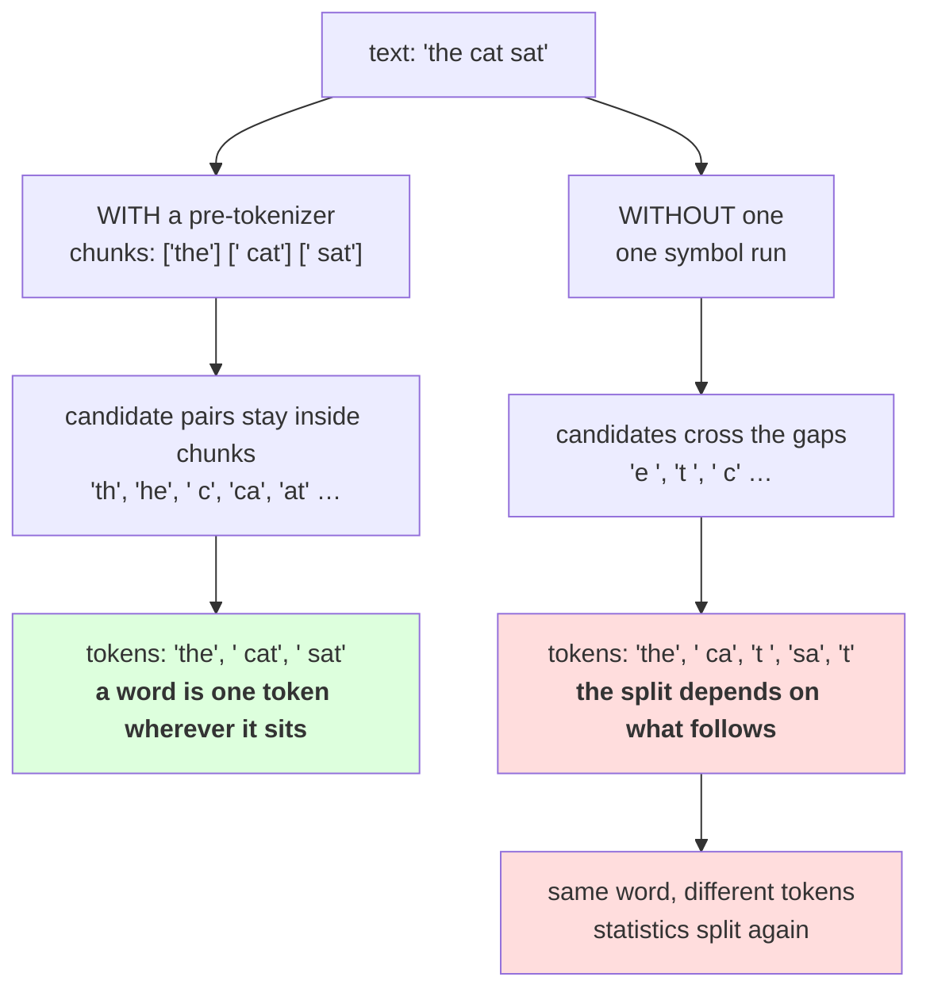

# 1.5 — 💥 The merge that ate the space

## One-line answer

Train BPE with no pre-tokenizer and it does exactly what it is told: **16 of the first 60 merges glue a
word's ending to the gap after it** — tokens like `'e '`, `'t '` and `', '` — against **none** with the
divider in place, and every one of them is a perfectly valid, lossless, deeply unhelpful token.

---

## The story

A form is printed with two boxes: one for a name, one for a town.

The next batch comes back from the printer with the line between them missing. It is still a form. People
still fill it in, writing their name and then their town, and the writing is perfectly legible.

But now every entry is one long piece of text and nobody can say where the name ends. Some people left a
big gap, some did not. Some towns are two words. The forms are complete, readable, and no longer
separable into the two things they were collecting.

Nothing was lost when the line went missing. What was lost was the ability to tell two things apart, and
that turned out to be the entire point of the form.

---

## The idea in plain language

Part [1.4](1.4-the-pre-tokenizer.md) introduced the divider and said merges must not cross it. This part
takes it out and measures what happens, because the failure is instructive in a specific way: **nothing
goes wrong.** The algorithm runs, the merges are correct, the round trip holds, the compression is fine.
The tokenizer is just quietly bad, in a way that only shows up in the merge list.

Here is why it happens. Without a pre-tokenizer the corpus is one long sequence of symbols, so the pair
counter sees pairs that span the gap between words: the last letter of one word and the space before the
next. In English those are enormously common. Every sentence ends `.` + space. Thousands of words end in
`e` and are followed by a space. So the commonest pairs in the whole corpus include `'e '`, `'t '`,
`'s '` and `', '`, and the algorithm — correctly, obediently — spends its earliest and most valuable
merges on them.

Measured below, on a 20,000-character slice: **16 of the first 60 merges are a word ending glued to a
following space** without a pre-tokenizer, and **none** with one. Both versions also learn a few
whitespace-only tokens — `'  '`, `'    '`, `'        '` — and those are legitimate: a run of spaces is a
single chunk in an indented document, which is why the check below counts the two categories separately.

Three costs follow, and the third is the one that matters most.

**Wasted vocabulary.** More than a quarter of the early merges are spent on tokens like `'t '` that
carry no meaning.
Those are the merges with the highest counts, which means they are the ones that would have bought the
most compression if spent on something useful.

**Tokenization depends on what comes next.** This is the real damage. With a token `'t '` in the
vocabulary, the word `cat` tokenizes one way at the end of a sentence and another way in the middle,
because in one case the following character is a space and in the other it is a full stop. **The same
word has different token sequences depending on its context**, so the model has to learn it more than
once — which is Day 11 part
[2.4](../../../day-011-character-and-word-tokenizers/parts/02-word-level/2.4-one-meaning-six-slots.md)'s
split-statistics problem, reintroduced by the tokenizer rather than by the language.

**Prompt boundaries become fragile.** A prompt ending in a space and the same prompt without it tokenize
differently right at the join, so the model sees a different last token — which is the trailing-space bug
Day 17 measures and Day 13 part
[1.2](../../../day-013-bpe-encode-decode-bytes/parts/01-encode-and-decode/1.2-decode-is-a-lookup-not-a-search.md)
sets up. Merges that eat spaces make it dramatically worse, because there are far more space-containing
tokens to be inconsistent about.

**And none of this raises.** The round trip still holds — `"".join(tokens) == text` — because merges only
ever re-bracket. That is the trap: **losslessness is necessary and it is not sufficient**, and a
tokenizer can pass every correctness check while being structurally worse than the one next to it.

---

## Why Akshara needs it

- **Day 13**'s regex pre-tokenizer exists to control exactly where these boundaries fall, and it is much
  more elaborate than part 1.4's. This part is why the elaboration is worth it.
- **Day 13 part 2.5** and **Day 17** both measure the trailing-space failure. This part is where the
  mechanism that makes it possible is introduced.
- **Part [2.3](../02-training-a-vocabulary/2.3-reading-the-table.md)** reads the merge table as a
  diagnostic. What you are looking for is exactly this: merges that should not be there.
- **Day 14** compares against a production tokenizer. One of the first things to check is how its
  pre-tokenizer treats whitespace, and this part is what you are checking for.

---

## The mechanism

Train the same number of merges twice, with and without the divider:

```python
import hashlib
import re
from collections import Counter
from pathlib import Path

raw = Path("docs/00_MASTER_PLAN.md").read_bytes()
text = raw.decode("utf-8")
SLICE = text[:20000]
print("  corpus sha256[:16] :", hashlib.sha256(raw).hexdigest()[:16])
print("  slice              : first 20,000 characters")


def train_words(words, n_merges):
    merges = []
    for _ in range(n_merges):
        pairs = pair_counts(words)
        if not pairs:
            break
        best = max(pairs.items(), key=lambda kv: (kv[1], kv[0]))[0]
        if pairs[best] < 2:
            break
        words = {merge_word(w, best): n for w, n in words.items()}
        merges.append(best)
    return merges


with_pre = {tuple(w): n for w, n in Counter(re.findall(r"\s*\S+|\s+", SLICE)).items()}
without_pre = {tuple(SLICE): 1}

m_with = train_words(with_pre, 60)
m_without = train_words(without_pre, 60)

print("  first 12 merges WITH a pre-tokenizer:")
print("   ", [ascii("".join(m)) for m in m_with[:12]])
print("  first 12 merges WITHOUT one:")
print("   ", [ascii("".join(m)) for m in m_without[:12]])
```

**Line by line:**
- `SLICE = text[:20000]` keeps the run short enough to be interactive. Part
  [2.4](../02-training-a-vocabulary/2.4-what-training-costs.md) measures why: the no-pre-tokenizer case
  is a single 20,000-symbol "word", so every pass walks all of it, and the full corpus would take
  minutes for a demonstration that a slice makes just as well. **Saying which slice is part of the
  measurement.**
- `without_pre = {tuple(SLICE): 1}` is the whole "no pre-tokenizer" configuration: one word, containing
  the entire text, occurring once. That is what "merge over the whole corpus" means as a data structure,
  and writing it this way makes the comparison exact — the same trainer, the same merge rule, one
  different input.
- `ascii("".join(m))` prints each merged token with escapes, so a token containing a newline or a
  trailing space is visible. **Printing these without `ascii()` is how the bug hides**, because `'t '`
  and `'t'` look identical at the end of a list entry.
- Measured on Intel Core i3-1115G4 (2 cores / 4 threads), 11.7 GB RAM, Windows 11, CPython 3.12.12, on
  2026-08-26:

```text
  corpus sha256[:16] : 9760f2b6d4340b97
  slice              : first 20,000 characters
  first 12 merges WITH a pre-tokenizer:
    ["'  '", "' a'", "' t'", "'er'", "'in'", "'    '", "'on'", "'he'", "'re'", "'en'", "'**'", "'it'"]
  first 12 merges WITHOUT one:
    ["'  '", "'e '", "' a'", "'er'", "'in'", "' t'", "'    '", "'t '", "'on'", "'s '", "'en'", "', '"]
```

**Read the second list.** Position 2 is `'e '`. Position 8 is `'t '`. Position 10 is `'s '`. Position 12
is `', '`. Four of the first twelve merges are a character followed by a space — the ends of words glued
to the gap after them.

The first list has none of those. It has `' a'` and `' t'` — a space followed by a character, which is a
*leading* space and is exactly what part 1.4 said the pre-tokenizer would produce and what real
tokenizers look like. **Leading spaces are the design; trailing spaces are the bug.**

Now count them properly rather than eyeballing twelve:

```python
def boundary_tokens(merges):
    """Whitespace PLUS something else: a word ending glued to the gap after it."""
    return [t for t in ("".join(m) for m in merges) if " " in t[1:] and t.strip() != ""]


def whitespace_tokens(merges):
    """Only whitespace: a legitimate run, not a boundary crossing."""
    return [t for t in ("".join(m) for m in merges) if t.strip() == ""]


for label, ms in (("with", m_with), ("without", m_without)):
    bad, ws = boundary_tokens(ms), whitespace_tokens(ms)
    print(f"  {label:<8} boundary tokens : {len(bad)} of {len(ms)}  {[ascii(t) for t in bad[:6]]}")
    print(f"  {label:<8} whitespace-only : {len(ws)} {[ascii(t) for t in ws[:4]]}")
```

**Line by line:**
- `t[1:]` skips the **first** character before looking for a space, so a token whose only space is a
  leading one does not count. That is the distinction the whole part turns on and it is one slice
  index — without it, a well-behaved token like `' the'` would be flagged and the measurement would
  say nothing.
- `t.strip() != ""` separates the two categories. A token that is **only** whitespace is a legitimate
  run; a token that is whitespace **plus** something else is the bug. Conflating them is how this
  measurement gets reported as "a few in both" instead of "none against sixteen".
- Both helpers take the merge list and nothing else — no corpus, no text — which is what makes this
  audit runnable against any tokenizer you are handed, including one from a library.
- Measured on this machine, 2026-08-26:

```text
  with     boundary tokens : 0 of 60  []
  with     whitespace-only : 3 ["'  '", "'    '", "'        '"]
  without  boundary tokens : 16 of 60  ["'e '", "'t '", "'s '", "', '", "'d '", "'y '"]
  without  whitespace-only : 4 ["'  '", "'    '", "'        '", "'   '"]
```

**Sixteen of sixty, against none.** The whitespace-only counts are near-identical — 3 and 4 — because
both tokenizers legitimately learn runs of indentation. The gap is entirely in the other column: more
than a quarter of the without-divider merges are spent on tokens that straddle a word boundary, and the
divided tokenizer has zero of them **by construction**, not by luck.



---

## When it breaks

**The loud failure — there is none, and that is the entire finding.** Both trainers ran to completion.
Both merge lists are valid. Both tokenizers round-trip. There is no exception anywhere in this part, and
no assertion in a normal test suite that separates them.

**The silent failure, stated as what a reasonable person would conclude:**

```text
  trained without a pre-tokenizer
  merges made          : 60, all valid
  round trip           : True
  compression          : slightly better than the divided version on this slice
  vocabulary inspection: not performed
  conclusion drawn     : "the pre-tokenizer is an unnecessary complication"
  what is actually true: 16 of 60 merges are word-boundary tokens; the tokenization of
                         a word now depends on the character that follows it
  exception            : none
```

Note the third line. **Merging across boundaries compresses slightly better on the training text**,
because more pairs are available, so a comparison on compression alone chooses the worse tokenizer. That
is why this part measures the merge list rather than the token count.

**The check that catches it** looks at the artifact rather than at the output:

```python
def audit_merges(merges: list[tuple[str, str]]) -> dict[str, object]:
    """Inspect a merge list for tokens that straddle a word boundary."""
    tokens = ["".join(m) for m in merges]
    interior_space = [t for t in tokens if " " in t[1:] and t.strip() != ""]
    all_space = [t for t in tokens if t.strip() == ""]
    return {
        "merges": len(tokens),
        "boundary_tokens": len(interior_space),
        "boundary_share": len(interior_space) / len(tokens) if tokens else 0.0,
        "whitespace_run_tokens": len(all_space),
        "examples": [ascii(t) for t in interior_space[:8]],
    }


def assert_no_boundary_tokens(merges: list[tuple[str, str]], max_share: float = 0.0) -> None:
    report = audit_merges(merges)
    assert report["boundary_share"] <= max_share, (
        f"{report['boundary_tokens']} of {report['merges']} merges straddle a word boundary "
        f"({report['boundary_share']:.1%}): {report['examples']}"
    )
```

**Line by line:**
- `t.strip() != ""` separates the two cases the raw space test conflates: a token that is **only**
  whitespace is a legitimate run, and a token that is whitespace **plus** something else is the bug. The
  earlier eyeball measurement did not make that distinction and reported 3 for the good tokenizer; this
  one reports the two categories separately, which is what you want in a check.
- `max_share=0.0` is the default because for a pre-tokenized trainer the correct number is exactly zero —
  the boundaries make it structurally impossible. A non-zero value means the pre-tokenizer is not doing
  what you think, which is a stronger statement than "the number is a bit high".
- `examples` is capped at eight and escaped, so a failure message is readable in a terminal and shows the
  offending tokens rather than only counting them.
- The audit runs on the **merge list alone** — no corpus, no text, no encoding. That makes it cheap enough
  to run on any tokenizer you are handed, including one from a library, which is what Day 14 does.
- What it cannot detect is a pre-tokenizer whose boundaries are in the *wrong places* — one that splits
  inside words, say. That is a different property and part 1.4's tiling assertion plus a look at the
  chunk list is the tool for it.

---

## In production

**What a research engineer writes instead of the teaching version.** They read the first hundred merges
of every tokenizer they train or adopt, and this is one of the three things they are looking for —
alongside merges spent on formatting and merges that split numbers oddly. It takes a minute, it needs no
corpus, and it catches a class of problem that no downstream metric reports.

The second habit is that **the pre-tokenizer pattern is serialised with the vocabulary and hashed with
it**, which part [2.1](../02-training-a-vocabulary/2.1-the-merge-table-is-the-artifact.md) does. A merge
list trained with boundaries and applied without them produces different tokens for the same text, and
nothing raises — it is Day 9 part 2.5's mismatch arriving through the pre-tokenizer instead of through
the id table.

**What degrades at scale.** The share of boundary tokens gets worse, not better, as the corpus grows. The
pairs that straddle boundaries are the most frequent pairs in any natural-language corpus — sentence
endings, common word endings before spaces — so a larger corpus makes them *more* dominant, and a larger
vocabulary spends more of its early, highest-value merges on them.

**The failure that only shows with real data.** Whitespace variety. On clean prose the damage is limited
to a handful of endings. On real text there are newlines, tabs, non-breaking spaces, double spaces after
full stops and trailing spaces at line ends, so the boundary tokens multiply into dozens of near-duplicate
variants — `'e '`, `'e\n'`, `'e  '` — each of which splits the statistics for the same word ending one
more way.

**The review comment.** *"We dropped the pre-tokenizer because compression was marginally better without
it. A third of the first sixty merges are now tokens like `'t '` and `', '` — that means the tokenization
of a word depends on what follows it, and the model has to learn every word twice. The compression number
is measuring the wrong thing."*

**The interview question.** *"Why do BPE tokenizers use a pre-tokenizer at all? The algorithm does not
need one."* The weak answer is "for speed". The strong answer names the failure: **without it the
commonest pairs in English are word endings followed by a space, so the highest-value merges get spent on
tokens like `'e '` and `', '` — I measured 16 of the first 60 — and once those exist a word's tokenization
depends on the character after it.** Then the trap: *and it does not show up in the round trip or in the
compression ratio, which is actually slightly better without the pre-tokenizer, so the only way to see it
is to read the merge list.*

**Compute tier: T0.** The standard library on a laptop, over the first 20,000 characters of a file in this
repository. No packages, no network, no GPU, no seed. The slice is stated because it is part of the
measurement; the full corpus gives the same shape and takes long enough that a slice is the honest choice
for a demonstration. Every number reproduces exactly for anyone whose corpus hash matches
`9760f2b6d4340b97`. What T0 cannot show is how much a boundary-polluted vocabulary costs a **trained
model** — that needs runs and it is Day 17. What it does show is that the damage exists and is invisible
to every check you would otherwise run, which is enough to decide the design.

---

## Check yourself

Run this. It prints **two merge lists from the same text, one of which is full of trailing spaces**:

```python
import hashlib
import re
from collections import Counter
from pathlib import Path

raw = Path("docs/00_MASTER_PLAN.md").read_bytes()
SLICE = raw.decode("utf-8")[:20000]
print("  corpus sha256[:16] :", hashlib.sha256(raw).hexdigest()[:16])


def train_words(words, n):
    merges = []
    for _ in range(n):
        pairs = pair_counts(words)
        if not pairs:
            break
        best = max(pairs.items(), key=lambda kv: (kv[1], kv[0]))[0]
        if pairs[best] < 2:
            break
        words = {merge_word(w, best): c for w, c in words.items()}
        merges.append(best)
    return merges


with_pre = {tuple(w): n for w, n in Counter(re.findall(r"\s*\S+|\s+", SLICE)).items()}
without_pre = {tuple(SLICE): 1}

for label, words in (("with", with_pre), ("without", without_pre)):
    merges = train_words(words, 60)
    tokens = ["".join(m) for m in merges]
    bad = [t for t in tokens if " " in t[1:] and t.strip() != ""]
    print(f"  {label:<8} first 10: {[ascii(t) for t in tokens[:10]]}")
    print(f"  {label:<8} boundary tokens: {len(bad)} of {len(tokens)}  {[ascii(t) for t in bad[:5]]}")
```

**Line by line:**
- The `without` list contains tokens ending in a space. **Say out loud what `cat` tokenizes to at the end
  of a sentence versus in the middle, once `'t '` is in the vocabulary.**
- The `with` list contains tokens *starting* with a space. Say why that one is fine, and say what it has
  to do with part [1.4](1.4-the-pre-tokenizer.md)'s pattern.
- The boundary counts are `0` and `16`. Say which of the two tokenizers compresses this slice better, and
  say why that is the wrong thing to compare.
- Now check the round trip for both by tokenizing a sentence and joining the result. Say whether either
  one fails, and say what that tells you about using losslessness as your only test.

**Say this out loud, without scrolling up:** say why the commonest pairs in undivided English text are
word endings before spaces, name the three costs of letting merges cross a boundary, and say which of your
usual checks — round trip, compression, id range — would have caught any of it.
