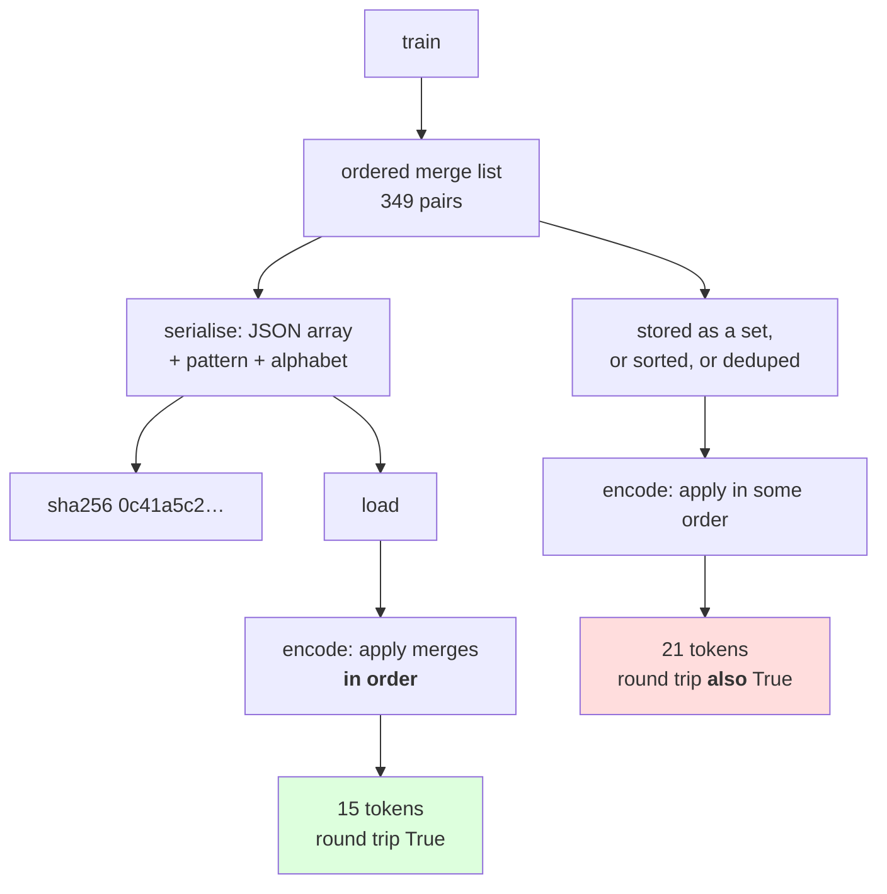

# 2.1 — The merge table is the artifact

## One-line answer

Training a BPE tokenizer produces one thing worth keeping — an **ordered list of merges** — and the
order is not incidental: the same 349 merges applied in a shuffled order tokenize the same sentence into
**21 tokens instead of 15**, both round-tripping perfectly.

---

## The story

Somebody gives you a recipe as a list of steps.

Boil the water. Add the rice. Cover and lower the heat. Wait. Take it off.

The list is short and none of the steps is complicated. What makes it a recipe rather than a set of
instructions is that they are **in an order** — do the same five things in a different sequence and you
have rice in cold water, or a covered empty pan.

Nobody writes "step 3 comes after step 2" on a recipe. The order is carried by the list itself, and if
you copy the steps into a note without keeping them in order, you have copied everything except the part
that mattered.

---

## The idea in plain language

Day 11 part
[1.1](../../../day-011-character-and-word-tokenizers/parts/01-character-level/1.1-from-a-script-to-a-module.md)
established what a tokenizer artifact is: a file, with a hash, written by training and read by serving.
For `CharTokenizer` that file was a sorted list of characters. For BPE it is different in one important
way, and the difference is easy to get wrong.

**The vocabulary is not the artifact. The merge list is.**

You can derive the vocabulary from the merges — it is the alphabet plus one entry per merge, in learned
order, which part [1.3](../01-the-merge-loop/1.3-the-loop-and-where-it-stops.md) established. You cannot
derive the merges from the vocabulary, because the vocabulary is a *set of strings* and the merges are an
*ordered list of pairs*. Given the token `low`, nothing in the vocabulary says whether it was built as
`l` + `ow` or as `lo` + `w`, and — measured below — that difference changes how text is encoded.

So a BPE tokenizer file has to contain three things, and dropping any one of them breaks it:

- **The pre-tokenizer pattern.** Part [1.4](../01-the-merge-loop/1.4-the-pre-tokenizer.md) showed that
  merges are counted inside chunks; applying them to differently-cut chunks gives different tokens.
- **The alphabet.** The starting symbols, in a fixed order, because they occupy the first ids.
- **The merges, in learned order.** This is the trained part, and the order is load-bearing.

Now the property that makes the order matter, because it is not obvious. When you *encode* a new word,
you apply the merges **in the order they were learned** — every merge, in sequence, to the whole word.
Merge 1 first, then merge 2 to the result, and so on. Merge 2 may well depend on a symbol that merge 1
created: part [1.2](../01-the-merge-loop/1.2-six-merges-by-hand.md) measured exactly that, where merge 2
was `('l', 'ow')` and `ow` only existed because merge 1 made it.

Apply them in a different order and the dependent merge finds nothing to work with. Measured below, the
same merge list shuffled encodes a 38-character phrase into **21 tokens rather than 15**, and — this is
the trap — **both round-trip perfectly**. The shuffled tokenizer is not broken. It is worse, silently, in
the one dimension the whole day is about.

One more consequence, and it is the practical one: **you cannot sort a merge list, deduplicate it, or
store it in a set.** Every one of those is a natural thing to do to a list of pairs and every one of them
destroys the artifact while leaving something that still works.

---

## Why Akshara needs it

- **Part [2.2](2.2-training-to-a-target-size.md)** produces these artifacts at four sizes; this part is
  what it produces them *as*.
- **Part [2.5](2.5-the-vocabulary-that-depended-on-the-order-of-the-corpus.md)** shows two training runs
  producing different merge lists from the same words. The hash defined here is how you notice.
- **Day 13** writes the encoder that applies the merges in order, and its correctness depends entirely
  on the order being preserved through save and load.
- **Day 51 onward**, the run record names the tokenizer by hash. A hash over a set rather than a list
  would say two different tokenizers were the same.

---

## The mechanism

The artifact, serialised:

```python
import hashlib
import json
from pathlib import Path

PATTERN = r"\s*\S+|\s+"

raw = Path("docs/00_MASTER_PLAN.md").read_bytes()
text = raw.decode("utf-8")
print("  corpus sha256[:16] :", hashlib.sha256(raw).hexdigest()[:16])

vocab, merges = train(text, target_vocab=500)

blob = {
    "pattern": PATTERN,
    "alphabet": sorted(set(text)),
    "merges": [list(m) for m in merges],
}
payload = json.dumps(blob, ensure_ascii=True, sort_keys=True)

out = Path("_bpe_demo.json")
out.write_text(payload, encoding="utf-8")
print("  V                  :", len(vocab))
print("  merges             :", len(merges))
print("  file bytes         :", out.stat().st_size)
print("  sha256[:16]        :", hashlib.sha256(payload.encode("utf-8")).hexdigest()[:16])
print("  first 60 of file   :", payload[:60])
```

**Line by line:**
- `"merges": [list(m) for m in merges]` converts each tuple to a list because **JSON has no tuple type**.
  A tuple would serialise as an array and come back as a list, so converting explicitly makes the round
  trip symmetric rather than accidental.
- The merges go into a **JSON array**, which preserves order. Storing them as an object keyed by the
  merged token — `{"ow": ["o", "w"], ...}` — is the tempting alternative and it is wrong: `sort_keys=True`
  would then reorder them, and the artifact would be destroyed by the very flag that makes the hash
  stable.
- `sort_keys=True` sorts the **top-level keys** — `alphabet`, `merges`, `pattern` — which is what makes
  the bytes reproducible. It does not touch the contents of the arrays, which is exactly the behaviour
  needed here. That distinction is worth checking rather than assuming, and it was checked against the
  Python 3.12 `json` documentation on 2026-08-26.
- `ensure_ascii=True` escapes every non-ASCII character, per Day 11 part 1.1. A merge list contains
  tokens with leading spaces and embedded newlines; without this the file is unreviewable and its
  encoding is a question.
- `PATTERN` is in the blob and therefore in the hash. A tokenizer trained with one pre-tokenizer and used
  with another is a different tokenizer, and part 1.5 measured how differently it behaves.
- Measured on Intel Core i3-1115G4 (2 cores / 4 threads), 11.7 GB RAM, Windows 11, CPython 3.12.12, on
  2026-08-26:

```text
  corpus sha256[:16] : 9760f2b6d4340b97
  V                  : 500
  merges             : 349
  file bytes         : 5863
  sha256[:16]        : 0c41a5c26d941738
  first 60 of file   : {"alphabet": ["\n", " ", "\"", "#", "$", "%", "&", "'", "(",
```

**Five thousand eight hundred and sixty-three bytes.** That is the entire trained tokenizer — 151
alphabet entries and 349 merges. Day 11's character tokenizer was 1,286 bytes; this one has learned
something and is still small enough to read in a text editor, which is the point of looking at it in
part [2.3](2.3-reading-the-table.md).

Reload it and check the artifact survived:

```python
back = json.loads(out.read_text(encoding="utf-8"))
merges2 = [tuple(m) for m in back["merges"]]
print("  reloaded merges    :", len(merges2), " identical:", merges2 == merges)

probe = "the tokenizer memorises its vocabulary"
print("  same tokens        :", tokenize(probe, merges) == tokenize(probe, merges2))
out.unlink()
```

**Line by line:**
- `[tuple(m) for m in back["merges"]]` converts back from lists. Skipping this works for `tokenize` —
  which only indexes into the pair — and then fails an equality check against the original tuples, so the
  conversion is about keeping the two representations comparable rather than about function.
- `merges2 == merges` compares **lists**, so it checks order as well as contents. That is the assertion
  this whole part is about, and comparing sets here would pass on a shuffled file.
- The `same tokens` line is the behavioural version of the same check. Two artifacts that compare equal
  must tokenize identically; if they ever disagree, the equality check is testing the wrong thing.
- Measured on this machine, 2026-08-26:

```text
  reloaded merges    : 349  identical: True
  same tokens        : True
```

Now the measurement that makes the order matter:

```python
import random

shuffled = merges[:]
random.seed(0)
random.shuffle(shuffled)

a = tokenize(probe, merges)
b = tokenize(probe, shuffled)
print("  merges in learned order :", len(a), "tokens", [ascii(t) for t in a][:8])
print("  merges shuffled         :", len(b), "tokens", [ascii(t) for t in b][:8])
print("  same result?            :", a == b)
print("  both round trip?        :", "".join(a) == probe, "".join(b) == probe)
```

**Line by line:**
- `merges[:]` copies the list before shuffling, because `random.shuffle` works **in place** and would
  otherwise destroy the original — a mistake that makes the two sides of the comparison identical and the
  result meaningless.
- `random.seed(0)` before the shuffle, so this measurement reproduces exactly. Principle 9: an unseeded
  shuffle in a measurement is a number nobody can check.
- `[:8]` on the printed tokens keeps the line readable; the counts above it are the actual result.
- Measured on this machine, 2026-08-26:

```text
  merges in learned order : 15 tokens ["'the'", "' token'", "'iz'", "'er'", "' m'", "'em'", "'or'", "'is'"]
  merges shuffled         : 21 tokens ["'th'", "'e'", "' to'", "'k'", "'en'", "'iz'", "'er'", "' m'"]
  same result?            : False
  both round trip?        : True True
```

**Fifteen tokens against twenty-one, and both round-trip.** The shuffled tokenizer produces valid,
lossless output that is 40% longer. Look at the first two entries: in learned order the word `the` is one
token; shuffled, it is `th` + `e`, because the merge that would have joined them ran before the merge
that created `th`.

That is the whole argument for treating the merge list as an ordered artifact. **A set of merges is not a
tokenizer.** It is the ingredients with the recipe thrown away.



---

## When it breaks

**The loud failure — a merge list stored as a JSON object.** It survives the round trip and fails on
order, and the failure is visible only if you look:

```console
>>> blob = {"merges": {"ow": ["o", "w"], "low": ["l", "ow"], "st": ["s", "t"]}}
>>> json.dumps(blob, sort_keys=True)
'{"merges": {"low": ["l", "ow"], "ow": ["o", "w"], "st": ["s", "t"]}}'
```

What it means: `sort_keys=True` has put `low` before `ow`, so on reload the merge that builds `low` from
`ow` runs first — before `ow` exists. It does not raise; `merge_word` simply finds no match and the merge
is a no-op. **The flag that makes the hash stable is the flag that destroys the artifact**, which is why
the merges must be an array.

**The second loud failure — losing the tuple type.** JSON gives back lists, and a list is unhashable:

```console
>>> merges = json.loads('[["o", "w"], ["l", "ow"]]')
>>> {tuple(m) for m in merges}      # fine
{('o', 'w'), ('l', 'ow')}
>>> set(merges)
Traceback (most recent call last):
  File "<stdin>", line 1, in <module>
TypeError: unhashable type: 'list'
```

What it means: any code that puts merges in a set or uses them as dict keys needs tuples. This is the
good outcome — the `TypeError` is immediate. The bad outcome is code that works on lists and silently
compares `["o", "w"] == ("o", "w")` as `False`.

**The silent failure — the artifact that is a set.** This is the one that ships, because a set is the
natural structure for "the merges we know about":

```text
  saved   : {"merges": [["o","w"], ["l","ow"], ["s","t"], ...]}   ordered, 349 entries
  loaded  : set(tuple(m) for m in blob["merges"])                 unordered, 349 entries
  V       : identical
  round trip: True
  hash of the loaded object: depends on iteration order, so it changes between runs
  tokens for one sentence: 21 instead of 15
  exception: none
```

**The check that catches it** compares the behaviour, not just the contents:

```python
def assert_artifact_round_trips(merges: list[tuple[str, str]], pattern: str,
                                alphabet: list[str], probe: str) -> None:
    """Serialising and reloading must give an artifact that tokenizes identically."""
    payload = json.dumps(
        {"pattern": pattern, "alphabet": alphabet, "merges": [list(m) for m in merges]},
        ensure_ascii=True, sort_keys=True,
    )
    back = json.loads(payload)
    merges2 = [tuple(m) for m in back["merges"]]

    assert merges2 == merges, "merge order did not survive serialisation"
    assert back["pattern"] == pattern, "pre-tokenizer pattern did not survive"
    assert tokenize(probe, merges2) == tokenize(probe, merges), (
        f"reloaded tokenizer produced different tokens for {probe!r}"
    )


def assert_order_matters(merges: list[tuple[str, str]], probe: str) -> None:
    """A sanity check on the check: if order did not matter, the test above would be vacuous."""
    import random

    shuffled = merges[:]
    random.Random(0).shuffle(shuffled)
    assert tokenize(probe, shuffled) != tokenize(probe, merges), (
        "shuffling the merges changed nothing — the probe is too simple to detect an order bug"
    )
```

**Line by line:**
- `assert merges2 == merges` before the behavioural check, so a failure says **which** layer broke: the
  serialisation or the encoder.
- The third assertion is the one that would still catch a subtler corruption — a merge list that compares
  equal but whose tuples contain the wrong types, say — because it exercises the artifact rather than
  inspecting it.
- `assert_order_matters` is unusual and worth defending: it asserts that the *test above is not vacuous*.
  A probe like `"aaa"` might tokenize identically under any order, and then `assert_artifact_round_trips`
  would pass on a broken artifact. **A test whose probe cannot distinguish the failure is a test that
  passes for the wrong reason**, and this asserts that the chosen probe can.
- `random.Random(0)` rather than `random.seed(0)` uses a **local** generator, so the check does not
  disturb the global random state that a training run may be relying on. Principle 9 again, from the
  other side.
- What none of this checks is that the merges are *good*. That is part 2.3's reading exercise and part
  2.5's determinism argument; correctness of the artifact and quality of the artifact are separate
  questions and this part is only about the first.

---

## In production

**What a research engineer writes instead of the teaching version.** The same three fields, in whatever
format the library uses — merges as an ordered list, the pre-tokenizer as a named component with its
configuration, the vocabulary as an explicit id mapping. Day 14 opens one and the first thing to check is
that its merges are a list and not a mapping. What is added in production is a **version field** and a
strict loader, so that an artifact written by a newer trainer fails loudly on an older reader rather than
being partially understood.

The second habit is that **the tokenizer hash goes in the run record and is checked at serving startup**,
which is Day 11 part 1.1's discipline unchanged. The hash must be over the serialised bytes — including
the pattern and the merge order — so that any of the three failures above changes it.

**What degrades at scale.** File size and load time, mildly, and neither is interesting: a 32,000-merge
tokenizer is a few hundred kilobytes and loads in milliseconds. What does become a problem is **diffing**.
A merge list is an ordered log, so retraining on a slightly different corpus can shift everything after
the first divergence, and a version-control diff shows the whole file as changed. That is a real
inconvenience and it is also correct — the artifacts genuinely are different — and it is why the hash is
the thing you compare rather than the diff.

**The failure that only shows with real data.** Merges containing characters that need escaping. A real
merge list contains tokens with newlines, tabs, quotes and non-ASCII characters. `ensure_ascii=True`
handles them; a hand-rolled format that writes one merge per line, space-separated, does not — and it
fails on exactly the merges that contain a space, which after part 1.4 is most of them.

**The review comment.** *"The merges are stored as a dict keyed by the merged token. With `sort_keys=True`
that reorders them on save, so on load a merge can run before the merge that creates its input. It has to
be a JSON array."*

**The interview question.** *"What does a trained BPE tokenizer consist of?"* The weak answer is "a
vocabulary". The strong answer names all three and the asymmetry: **the pre-tokenizer pattern, the
starting alphabet, and the merges as an ordered list — and you can derive the vocabulary from the merges
but not the merges from the vocabulary, because encoding applies them in learned order.** Then the
measurement that proves it: *I shuffled a 349-merge list and the same sentence went from 15 tokens to 21,
with both versions round-tripping perfectly — so a set of merges is lossless and 40% worse.*

**Compute tier: T0.** The standard library on a laptop. Training the 349 merges is the expensive step and
part [2.4](2.4-what-training-costs.md) times it; everything else here is serialisation. No packages, no
network, no GPU. The shuffle is seeded, so the 15-against-21 result reproduces exactly. Every number holds
for anyone whose corpus hash matches `9760f2b6d4340b97`. What T0 cannot show is whether a 40% longer
tokenization costs a trained model anything measurable — Day 11 part 1.3 gives the arithmetic and Day 17
does the run.

---

## Check yourself

Run this. It prints **the same merges in two orders giving two different token counts, both lossless**:

```python
import hashlib
import json
import random
from pathlib import Path

raw = Path("docs/00_MASTER_PLAN.md").read_bytes()
text = raw.decode("utf-8")
print("  corpus sha256[:16] :", hashlib.sha256(raw).hexdigest()[:16])

vocab, merges = train(text, target_vocab=500)
payload = json.dumps({"pattern": r"\s*\S+|\s+", "alphabet": sorted(set(text)),
                      "merges": [list(m) for m in merges]},
                     ensure_ascii=True, sort_keys=True)
print("  V                  :", len(vocab), " merges:", len(merges))
print("  artifact bytes     :", len(payload.encode("utf-8")))
print("  sha256[:16]        :", hashlib.sha256(payload.encode("utf-8")).hexdigest()[:16])

probe = "the tokenizer memorises its vocabulary"
shuffled = merges[:]
random.Random(0).shuffle(shuffled)
a, b = tokenize(probe, merges), tokenize(probe, shuffled)
print("  learned order      :", len(a), "tokens", [ascii(t) for t in a[:6]])
print("  shuffled           :", len(b), "tokens", [ascii(t) for t in b[:6]])
print("  both round trip    :", "".join(a) == probe, "".join(b) == probe)
```

**Line by line:**
- The two token counts differ. **Say out loud which check in your test suite would have caught the
  shuffle, and then check whether you actually have that check.**
- Both round trips print `True`. Say what that tells you about using losslessness as a sufficient test,
  and name the Day 12 part that made the same point about the pre-tokenizer.
- The first tokens differ: `'the'` against `'th'` + `'e'`. Say which merge must have run out of order for
  that to happen.
- Now serialise `merges` as a JSON **object** keyed by the merged token, reload it, and tokenize the probe
  again. Say what the token count becomes and what `sort_keys=True` did to it.

**Say this out loud, without scrolling up:** name the three fields a BPE tokenizer file must contain, say
why the merges cannot be stored as a set even though every element is unique, and state what both the
correct and the shuffled tokenizer have in common that makes losslessness useless as a test here.
