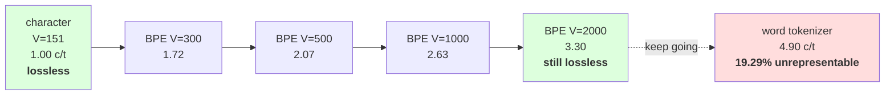

# 2.2 — Training to a target size

## One-line answer

Four training runs on the same corpus, at `V` = 300, 500, 1,000 and 2,000, take the tokenization from
**1.72 characters per token to 3.30** — and the curve is the trade Day 11 could not make, because every
point on it is lossless and none of it costs coverage.

---

## The story

You are buying a set of spanners.

The five-piece set covers the bolts you meet most often. Most jobs are fine, and now and again you have
to make do with an adjustable one, which is slower and works.

The twenty-piece set fits more of them exactly. You reach for an adjustable spanner much less often.

The eighty-piece set fits almost everything, costs a lot more, and takes up a whole drawer — and for
most of those extra sizes you will use them once a year.

At no point does a smaller set stop you finishing a job. It just means more of the job is done the slow
way, and the question is only ever how much drawer space the speed is worth.

---

## The idea in plain language

Part [1.3](../01-the-merge-loop/1.3-the-loop-and-where-it-stops.md) established that `target_vocab` is
the only real knob, and that its two extremes are Day 11's two failures. This part turns it on a real
corpus and measures what each setting buys.

The unit to measure in is **characters per token** — the corpus's character count divided by its token
count. It is the reciprocal of Day 11 part
[1.3](../../../day-011-character-and-word-tokenizers/parts/01-character-level/1.3-the-sequence-length-problem.md)'s
tokens-per-word and it is the more natural direction here, because higher is better and the character
tokenizer sits at exactly 1.00.

Two reference points frame the whole table, both measured on Day 11:

- **The character tokenizer is 1.00 characters per token**, by definition, with `V = 151`.
- **The word tokenizer is 4.90**, with `V = 1001` and 19.29% of held-out tokens unrepresentable.

Everything BPE does is fill in between them **without the second column's cost**. Measured below,
`V = 2000` reaches 3.30 characters per token — two thirds of the way to the word tokenizer's compression
— and its out-of-vocabulary rate on the corpus is zero, because every word decomposes into pieces it has.

Three things about the curve are worth having in your head before reading it.

**It is concave, and that is the whole story of vocabulary sizing.** Doubling `V` does not double the
compression. From 300 to 500 buys 0.35 characters per token; from 1,000 to 2,000 buys 0.67 for **five
times** as many merges. Each merge saves exactly its pair count — part
[1.2](../01-the-merge-loop/1.2-six-merges-by-hand.md) measured that — and the counts fall as the common
pairs are used up.

**The alphabet is included in `V`.** `V = 300` is 151 alphabet entries and 149 merges, so half of that
vocabulary is not learned at all. At `V = 2000` it is 151 and 1,849, and the alphabet is a rounding
error. **The smaller the target, the more of it is spent before training starts**, which is the same
floor part 1.3 named and one more reason a fixed 256-byte alphabet is easier to reason about than a
corpus-derived one.

**Training time grows with both factors.** Measured below, 5.8 seconds at `V = 300` and 50.8 at
`V = 2000` — roughly linear in the merge count, because each merge costs a pass over the corpus. Part
[2.4](2.4-what-training-costs.md) is about why, and about what a real implementation does instead.

---

## Why Akshara needs it

- **Part [3.1](../03-together/3.1-three-tokenizers-one-table.md)** puts one of these rows next to Day 11's
  two tokenizers. The row it uses is `V = 1000`, chosen so that the vocabulary size matches Day 11's word
  tokenizer exactly and only the scheme differs.
- **Day 13** re-runs this with a byte alphabet, and the alphabet's contribution to `V` becomes a constant
  256 for every corpus in every language.
- **Day 17** treats vocabulary size as a design decision with an embedding cost. This curve is the benefit
  side; Day 9 part
  [2.4](../../../day-009-the-vocabulary-problem/parts/02-what-a-tokenizer-is/2.4-vocabulary-size-is-a-budget.md)
  is the cost side, and the decision is where they cross.
- **Day 51 onward**, the pretraining run's token budget is spent at whatever rate this curve sets. A
  tokenizer at 3.30 characters per token sees 3.3× more text than one at 1.00 for the same number of
  tokens.

---

## The mechanism

Four runs, one loop:

```python
import hashlib
import time
from pathlib import Path

raw = Path("docs/00_MASTER_PLAN.md").read_bytes()
text = raw.decode("utf-8")
print("  corpus sha256[:16] :", hashlib.sha256(raw).hexdigest()[:16])
print("  characters         :", len(text))
print("  alphabet           :", len(set(text)))
print("  pre-tokenized chunks:", len(pretokenize(text)))

for target in (300, 500, 1000, 2000):
    t0 = time.perf_counter()
    vocab, merges = train(text, target)
    dt = time.perf_counter() - t0
    toks = tokenize(text, merges)
    print(f"  V={len(vocab):>5}  merges={len(merges):>5}  tokens={len(toks):>7}  "
          f"chars/token={len(text) / len(toks):>5.2f}  train={dt:>6.1f}s")
```

**Line by line:**
- `time.perf_counter()` rather than `time.time()`, because it is monotonic and has the highest available
  resolution — it is the right clock for measuring a duration, and `time.time()` can move backwards. This
  was checked against the Python 3.12 `time` documentation on 2026-08-26.
- The timing is **measured wall-clock on stated hardware**, which Principle 17 explicitly permits: it is
  data about a run, not a reader-directed pace. It is also the least portable number in the day, and the
  hardware line below is what makes it meaningful.
- `tokenize(text, merges)` re-encodes the **whole corpus** after each training run rather than sampling.
  A compression figure from a sample is a figure about the sample, and this is cheap enough to do
  properly.
- `len(text) / len(toks)` is characters per token. Printing the token count next to it matters: the ratio
  alone hides whether a run stopped early, and part 1.3 showed that it can.
- Measured on Intel Core i3-1115G4 (2 cores / 4 threads), 11.7 GB RAM, Windows 11, CPython 3.12.12, on
  2026-08-26:

```text
  corpus sha256[:16] : 9760f2b6d4340b97
  characters         : 110837
  alphabet           : 151
  pre-tokenized chunks: 19773
  V=  300  merges=  149  tokens=  64446  chars/token= 1.72  train=   5.8s
  V=  500  merges=  349  tokens=  53588  chars/token= 2.07  train=  11.5s
  V= 1000  merges=  849  tokens=  42130  chars/token= 2.63  train=  25.9s
  V= 2000  merges= 1849  tokens=  33626  chars/token= 3.30  train=  50.8s
```

Now put those numbers next to Day 11's, because the comparison is the point:

| Scheme | `V` | tokens | chars/token | lossless | unrepresentable |
| --- | --- | --- | --- | --- | --- |
| character | 151 | 110,837 | 1.00 | yes | none in this corpus |
| BPE | 300 | 64,446 | 1.72 | yes | none |
| BPE | 500 | 53,588 | 2.07 | yes | none |
| BPE | 1,000 | 42,130 | 2.63 | yes | none |
| BPE | 2,000 | 33,626 | 3.30 | yes | none |
| word | 1,001 | 15,082 | 4.90 | **no** | **19.29% of held-out** |

**Compare the two rows at `V ≈ 1000`.** The word tokenizer gets 4.90 characters per token and cannot
represent one held-out word in five; BPE gets 2.63 and can represent everything. That is the trade in its
starkest form, and it is the reason the field chose BPE: **the word tokenizer's extra compression is
bought with a capability the model never gets back.**

And compare the BPE rows against each other. Going from `V = 300` to `V = 2000` is 1,700 more vocabulary
entries — which Day 9 part 2.4 priced at `2VC` parameters — for 1.58 more characters per token. Whether
that is worth it depends on the model's width `C` and on how long the sequences are, which is exactly the
arithmetic Day 17 does.

The shape of the curve:

```python
prev_ratio = None
for target in (300, 500, 1000, 2000):
    vocab, merges = train(text, target)
    ratio = len(text) / len(tokenize(text, merges))
    gain = "-" if prev_ratio is None else f"+{ratio - prev_ratio:.2f}"
    print(f"  V={len(vocab):>5}  merges={len(merges):>5}  chars/token={ratio:>5.2f}  "
          f"gain over previous={gain:>6}  per 100 merges="
          f"{'-' if prev_ratio is None else f'{(ratio - prev_ratio) / (len(merges) - prev_merges) * 100:.3f}'}")
    prev_ratio, prev_merges = ratio, len(merges)
```

**Line by line:**
- The `per 100 merges` column is the one that shows the concavity. An absolute gain looks respectable at
  every step; the gain **per merge spent** is what falls, and that is the quantity a vocabulary budget is
  actually trading against.
- The `-` for the first row is deliberate: there is no previous point, and printing `0.00` there would
  invite somebody to read it as "no gain".
- Measured on this machine, 2026-08-26:

```text
  V=  300  merges=  149  chars/token= 1.72  gain over previous=     -  per 100 merges=-
  V=  500  merges=  349  chars/token= 2.07  gain over previous= +0.35  per 100 merges=0.174
  V= 1000  merges=  849  chars/token= 2.63  gain over previous= +0.56  per 100 merges=0.113
  V= 2000  merges= 1849  chars/token= 3.30  gain over previous= +0.67  per 100 merges=0.067
```

**The per-merge return falls by more than half across the table**, from 0.174 to 0.067 characters per
token per hundred merges. That is the diminishing return, quantified, and it is why nobody trains a
vocabulary of a million: the merges keep working, they just stop being worth their slots.



---

## When it breaks

**The loud failure — asking for a target the corpus cannot reach.** Part 1.3's early stop, seen at scale:

```console
>>> vocab, merges = train("the cat sat on the mat", target_vocab=500)
>>> len(vocab), len(merges)
(13, 3)
```

What it means: a 22-character corpus has 10 distinct characters and almost no repeated pairs, so the
trainer stops after 3 merges. It does not raise. **`V` is 13, not 500**, and any embedding matrix sized
from the config now has 487 rows that will never be indexed — part 1.3's `TrainingOutcome` check is what
catches it.

**The silent failure — comparing compression across corpora.** This is the one that produces confident
wrong conclusions in a design review:

```text
  tokenizer A: trained on this corpus, V=2000 -> 3.30 chars/token
  tokenizer B: trained on a different corpus, V=2000 -> 4.10 chars/token
  conclusion drawn : "B is a better tokenizer"
  what is actually true: B's corpus is more repetitive, or more English, or has longer words
  what would settle it : evaluate BOTH tokenizers on the SAME held-out text
  exception raised : none
```

Compression is a property of a **tokenizer and a text together**. A number quoted without both is not a
measurement, which is Day 10 part
[3.1](../../../day-010-unicode-code-points-bytes/parts/03-together/3.1-one-string-five-layers.md)'s rule
arriving in a new place.

**The second silent failure — measuring compression on the training text**, which is what every number in
this part does. It is stated openly here because it is defensible for this purpose and indefensible for
others:

```text
  what this part measures : compression on the text the merges were trained on
  why that is OK here     : the question is "what did the merges buy", not "how will it generalise"
  why it is NOT OK        : for comparing two tokenizers, or for predicting production behaviour
  the honest version      : train on the 80% split, measure on the 20%, as Day 11 part 2.3 did
  the difference          : not measured in this part, and it will be positive
```

**The check that catches both** makes the text an explicit part of the result:

```python
from dataclasses import dataclass


@dataclass(frozen=True)
class Compression:
    """A compression measurement, with everything needed to interpret it."""

    tokenizer_sha256: str
    text_sha256: str
    text_is_training_text: bool
    characters: int
    tokens: int

    @property
    def chars_per_token(self) -> float:
        return self.characters / self.tokens

    def __str__(self) -> str:
        note = " (ON TRAINING TEXT)" if self.text_is_training_text else ""
        return (f"{self.chars_per_token:.2f} chars/token  "
                f"[tok {self.tokenizer_sha256[:8]}, text {self.text_sha256[:8]}]{note}")


def assert_comparable(a: Compression, b: Compression) -> None:
    """Two compression figures may only be compared on identical text."""
    assert a.text_sha256 == b.text_sha256, (
        f"different texts: {a.text_sha256[:8]} vs {b.text_sha256[:8]} — these numbers "
        f"say nothing about which tokenizer is better"
    )
```

**Line by line:**
- Both hashes are **mandatory fields**, so a compression figure cannot exist without recording which
  tokenizer and which text produced it. That is the same discipline Day 11 part 3.1's `Measurement`
  applied, specialised to the number this part produces.
- `text_is_training_text` is a boolean that forces the caller to answer the question. `__str__` prints
  `(ON TRAINING TEXT)` when it is true, so **the caveat travels with the number** into any log line or
  slide it is pasted into.
- `chars_per_token` is derived rather than stored, so it cannot disagree with the counts beside it.
- `assert_comparable` refuses rather than converting, and the message says what the comparison would
  actually be measuring. A function that silently re-tokenized one side to match would be doing the
  user's thinking for them and hiding a real methodological error.
- What this cannot do is stop somebody writing `3.30` in a document. Nothing can. It makes the honest
  version the path of least resistance, which is all a helper ever achieves.

---

## In production

**What a research engineer writes instead of the teaching version.** They train once at the target size
and record the curve as a by-product — compression at every thousand merges, written to a log — because
the shape tells you whether the target was sensible without a second run. A curve that is still climbing
steeply at the target means the vocabulary is too small for the corpus; one that flattened long ago means
slots are being spent on nothing.

The second habit is that **compression is always reported on held-out text**, and the training-text figure
is used only as this part uses it: to see what the merges did. The gap between the two is itself
informative — a large one means the merges have fitted to material that does not recur.

**What degrades at scale.** Training time, quadratically in the sense that matters: a bigger corpus makes
each pass longer *and* supports a bigger target, so the two factors multiply. Part
[2.4](2.4-what-training-costs.md) measures the naive trainer's cost on 110,837 characters and does the
arithmetic for what that shape means at a realistic size — which is the point where "run it on the
laptop" stops being an option.

**The failure that only shows with real data.** Compression figures that are not about language. A corpus
with a lot of repeated boilerplate — licence headers, generated tables, log lines — has enormously
compressible regions, so the characters-per-token figure looks excellent and most of it comes from the
boilerplate. Part [2.3](2.3-reading-the-table.md) is the diagnostic: **read the merge list, and if the
longest tokens are boilerplate rather than language, the compression number is measuring your data
pipeline.**

**The review comment.** *"These two compression figures were measured on different corpora, so the
comparison does not say which tokenizer is better. Re-run both on the same held-out sample — and note
that the number in the table is on training text, which flatters it."*

**The interview question.** *"How do you pick the vocabulary size for a BPE tokenizer?"* The weak answer is
a number, or "32k because that is what people use". The strong answer is the shape and the two costs:
**compression rises concavely with `V` — on my corpus the return fell from 0.174 to 0.067 characters per
token per hundred merges between `V = 500` and `V = 2000` — while the parameter cost rises linearly at
`2VC`, so the decision is where a falling benefit meets a constant marginal cost.** Then the constraint
people forget: *and every point on that curve is lossless, so unlike a word vocabulary you are trading
sequence length against parameters and never against coverage.*

**Compute tier: T0.** The standard library on a laptop, over a 113,283-byte file in this repository. No
packages, no network, no GPU, no seed — BPE training is deterministic given the tie-break, which part 2.5
is about. **The four timings are measured wall-clock on the hardware named above** and will differ on
other machines; the token counts and ratios will not. Every number reproduces for anyone whose corpus
hash matches `9760f2b6d4340b97`. What T0 cannot show is which target trains the best model — that needs
runs, it is Day 17, and this part supplies the compression side of the arithmetic that narrows the
candidates.

---

## Check yourself

Run this. It prints **a compression curve that flattens as it climbs**:

```python
import hashlib
import time
from pathlib import Path

raw = Path("docs/00_MASTER_PLAN.md").read_bytes()
text = raw.decode("utf-8")
print("  corpus sha256[:16] :", hashlib.sha256(raw).hexdigest()[:16])
print("  characters         :", len(text), " alphabet:", len(set(text)))

prev = None
for target in (300, 500, 1000):
    t0 = time.perf_counter()
    vocab, merges = train(text, target)
    dt = time.perf_counter() - t0
    toks = tokenize(text, merges)
    ratio = len(text) / len(toks)
    gain = "-" if prev is None else f"+{ratio - prev:.2f}"
    print(f"  V={len(vocab):>5} merges={len(merges):>5} tokens={len(toks):>7} "
          f"chars/token={ratio:>5.2f} gain={gain:>6} train={dt:>5.1f}s")
    prev = ratio

print("  character level would be:", f"{1.00:.2f}", "chars/token at V =", len(set(text)))
print("  round trip at V=1000    :", "".join(tokenize(text, merges)) == text)
```

**Line by line:**
- The `gain` column shrinks per merge spent even as it grows in absolute terms. **Say out loud which of
  those two readings a vocabulary budget cares about.**
- The last line prints `True`. Say what Day 11's word tokenizer printed for the same check, and say what
  it cost to get `True` here.
- Your `train` times will differ from this document's. Say why that is fine and which columns should
  match exactly.
- Now set the target to `10000` and run it. Say what `V` you get, whether the trainer reached the target,
  and how you would find out without reading the code.

**Say this out loud, without scrolling up:** state what characters-per-token means and where the character
and word tokenizers sit on that scale, say what shape the BPE curve has and what that implies for choosing
`V`, and name the one column where BPE beats the word tokenizer at every single vocabulary size.
