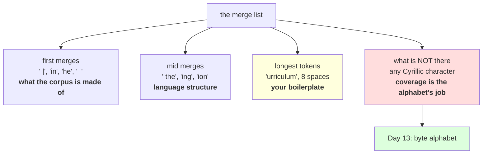

# 2.3 — Reading the table, or what the merges learned

## One-line answer

The merge list is a readable description of your corpus: merge 18 is `ing`, merge 23 is `ion`, merge 12
is ` the` — and merge 10 is **two spaces**, because indented code blocks really are among the commonest
pairs in this document, which tells you something about the data that no aggregate metric would.

---

## The story

You lend somebody your kitchen for a week and come back to find the drawers rearranged.

You do not need to ask what they cooked. The salt and the chilli are now at the front. The big pot has
been moved to a low shelf. The tin opener has migrated to the drawer nearest the hob, and the baking tray
is at the back behind everything else.

Nobody wrote down what they made. The arrangement *is* the record — things that got used constantly
ended up within reach, and things that did not got pushed to the back.

---

## The idea in plain language

Part [2.1](2.1-the-merge-table-is-the-artifact.md) established that the merge list is the artifact. This
part is about the fact that it is also a **document you can read**, and reading it is the cheapest
diagnostic in tokenization.

The merges come out in frequency order, so the list is ordered by how common each pattern was. That
means:

- **The first merges tell you what your corpus is made of.** Not what it is about — what it is *made of*.
  Letter pairs, common words, and, on this corpus, whitespace.
- **The long tokens tell you what repeats.** A token is only long if the algorithm found the same long
  string over and over, so the longest tokens are a list of your corpus's boilerplate.
- **Anything surprising is a data problem.** A merge you cannot explain is a pattern you did not know
  was in your corpus, and that is almost always worth chasing.

Three specific things to look for, all measured below.

**Linguistic pieces.** `ing` at merge 18, `ion` at 23, plus `er`, `ed`, `es`, `ly`, `est` and `able`
further down. These are the suffixes Day 11 part
[2.4](../../../day-011-character-and-word-tokenizers/parts/02-word-level/2.4-one-meaning-six-slots.md)
measured as 15.57% of a word vocabulary, now appearing as **shared tokens** rather than as duplicated
entries. That is the payoff the whole of Day 11 section 2 was arguing towards, and it arrived without a
suffix list.

**Whole common words, with their leading space.** ` the` at merge 12, ` and` at 24. Part
[1.4](../01-the-merge-loop/1.4-the-pre-tokenizer.md) explained the space: it is part of the chunk, so it
is part of the token. This is what a healthy merge list looks like and it is why real tokenizers display
tokens with visible leading spaces.

**Formatting.** Merge 10 is two spaces. Among the longest tokens is a run of eight spaces. Merge 21 is
`**`, merge 22 is `` ` `` with a leading space, merge 13 is a newline followed by a pipe. **This corpus is
a Markdown document with tables and indented code blocks, and the merge list says so in the first two
dozen entries.** Nothing is wrong; the algorithm found the commonest pairs and they are formatting. But
if you expected a tokenizer for prose, one in ten of your early vocabulary slots has gone to layout.

And the check that this part exists to make possible: **a character-level BPE still has a character-level
alphabet.** Measured below, the same tokenizer that handles English perfectly is missing 6 of 6 Cyrillic
characters and 2 of 2 Chinese ones. Day 11 part
[1.5](../../../day-011-character-and-word-tokenizers/parts/01-character-level/1.5-the-character-tokenizer-that-met-a-new-alphabet.md)'s
coverage gate is **completely untouched by BPE** — merges make sequences shorter, they do not add
characters — and closing it is exactly what Day 13 is for.

---

## Why Akshara needs it

- **Day 13** replaces the alphabet with bytes. The coverage measurement at the end of this part is the
  problem that day solves, measured on the tokenizer you just trained rather than on Day 11's.
- **Day 14** opens a production tokenizer, and the first thing to do with it is read its merge list. This
  part is the skill; that day is where it pays.
- **Day 17** debugs tokenization pathologies — numbers, whitespace, code. Every one of them is visible in
  a merge list before it is visible in a metric.
- **Part [3.1](../03-together/3.1-three-tokenizers-one-table.md)** claims BPE can spell an unseen word.
  The decomposition measured here is the evidence.

---

## The mechanism

Train, then read:

```python
import hashlib
from pathlib import Path

raw = Path("docs/00_MASTER_PLAN.md").read_bytes()
text = raw.decode("utf-8")
print("  corpus sha256[:16] :", hashlib.sha256(raw).hexdigest()[:16])

vocab, merges = train(text, target_vocab=500)
print("  V:", len(vocab), " merges:", len(merges))

print("  the first 24 merges, in order:")
for i in range(0, 24, 4):
    row = "  ".join(f"{i+j+1:>3}. {ascii(merges[i+j][0] + merges[i+j][1]):<14}" for j in range(4))
    print("   ", row)
```

**Line by line:**
- `ascii(...)` on every token, without exception. A merge list contains tokens made of spaces, newlines
  and punctuation, and printing them raw makes ` the` and `the` indistinguishable — which is the one
  distinction this list is most useful for. Day 10 part
  [1.1](../../../day-010-unicode-code-points-bytes/parts/01-code-points-and-graphemes/1.1-a-character-is-three-different-things.md)
  established the habit; here it is load-bearing.
- `merges[i+j][0] + merges[i+j][1]` concatenates the pair into the token it produces. The pair itself is
  what the artifact stores; the concatenation is what you read.
- Four to a row purely so the list fits on a screen. **Reading the first two dozen merges is a habit worth
  making frictionless**, and a one-per-line list of 349 entries is not read.
- Measured on Intel Core i3-1115G4 (2 cores / 4 threads), 11.7 GB RAM, Windows 11, CPython 3.12.12, on
  2026-08-26:

```text
  corpus sha256[:16] : 9760f2b6d4340b97
  V: 500  merges: 349
  the first 24 merges, in order:
      1. ' |'              2. ' a'              3. ' t'              4. 'in'
      5. 'he'              6. 'on'              7. 'er'              8. 'at'
      9. 're'             10. '  '             11. 'en'             12. ' the'
     13. '\n|'            14. ' s'             15. 'it'             16. ' an'
     17. ' c'             18. 'ing'            19. ' d'             20. ' \u2014'
     21. '**'             22. ' `'             23. 'ion'            24. ' and'
```

**Merge 1 is a space followed by a pipe.** That is a Markdown table cell boundary, and it is the single
commonest pair in this document — more common than `he` or `in`. Merge 13 is a newline followed by a
pipe: the start of a table row. Merge 21 is `**`, which is bold. Merge 20 is a space and an em dash, printed by `ascii()` as `\u2014`.

**Four of the first twenty-four merges are Markdown syntax**, and one more is a run of two spaces. If you
had been told this corpus was English prose, the merge list would have corrected you in five seconds.

The linguistic ones are there too, and in a satisfying order: the commonest English letter pairs first
(`in`, `he`, `on`, `er`, `at`, `re`, `en`), then whole function words with their spaces (` the`, ` an`,
` and`), then the suffixes (`ing` at 18, `ion` at 23). **The algorithm rebuilt the structure of English
from the bottom up**, in roughly the order a linguist would rank it, having been told nothing.

Now look for the specific pieces Day 11 asked about:

```python
SUFFIX_LIKE = ("ing", "ed", "es", "er", "ly", "tion", "ion", "est",
               "ment", "ness", "able", "the", "and")
found = [m for m in merges if "".join(m) in SUFFIX_LIKE]
print("  merges that are recognisable English pieces:")
print("   ", [ascii("".join(m)) for m in found])

longest = sorted(("".join(m) for m in merges), key=len, reverse=True)[:12]
print("  the longest tokens the merges produced:")
print("   ", [ascii(t) for t in longest])
```

**Line by line:**
- `SUFFIX_LIKE` is a hand-written list and the search is exact-match, so this **under-reports**: a merge
  producing ` running` contains `ing` and will not be found. That is the honest direction for the claim —
  it says "at least these" — and Day 11 part 2.4's heuristic had the same property and said so.
- `sorted(..., key=len, reverse=True)` finds the longest tokens, which is a different question from the
  earliest merges and often the more revealing one. **Early merges tell you about letters; long tokens
  tell you about boilerplate.**
- Measured on this machine, 2026-08-26:

```text
  merges that are recognisable English pieces:
    ["'er'", "'ing'", "'ion'", "'ed'", "'es'", "'ly'", "'est'", "'and'", "'the'", "'able'"]
  the longest tokens the merges produced:
    ["'urriculum'", "'        '", "'urricul'", "'tention'", "'ization'", "' model'", "' train'",
     "'ection'", "' every'", "' token'", "' check'", "' `ARCH'"]
```

**Ten recognisable English pieces in a 349-merge vocabulary**, including `est` — which part
[1.2](../01-the-merge-loop/1.2-six-merges-by-hand.md) found by hand on twelve words and which is here at
full scale.

The longest tokens are the corpus talking about itself. `urriculum` — the tail of *curriculum*, because
the leading `c` merged elsewhere first. `ization`, `tention`, `ection`: the endings of *tokenization*,
*attention*, *section*. ` model`, ` train`, ` token`, ` check`: the words this document repeats. And
`' `ARCH'` — a backtick, then `ARCH` — because this document is full of `` `ARCH-01` `` style identifiers
in code spans.

**A run of eight spaces is the second-longest token in the vocabulary.** That is one slot spent on
indentation, and it is correct: the pairs really are that common. It is also the sort of thing you only
find out by looking.

Now the encoding, which is where the pieces earn their keep:

```python
vocab, merges = train(text, target_vocab=1000)

probe = "the tokenizer memorises its vocabulary and cannot spell anything else"
ptoks = tokenize(probe, merges)
print("  probe :", probe)
print("  tokens:", [ascii(t) for t in ptoks])
print("  count :", len(ptoks), "vs", len(probe), "characters and", len(probe.split()), "words")
print("  round trip:", "".join(ptoks) == probe)

unseen = "regenerated foundations"
utoks = tokenize(unseen, merges)
print("  unseen words:", unseen)
print("  tokens      :", [ascii(t) for t in utoks])
print("  round trip  :", "".join(utoks) == unseen)
```

**Line by line:**
- The probe is Day 11 part
  [2.5](../../../day-011-character-and-word-tokenizers/parts/02-word-level/2.5-the-word-tokenizer-that-could-not-say-the-word.md)'s
  sentence, unchanged, so the comparison is exact: the same words, the same corpus, a different scheme.
- `unseen` contains words the merge list has no single token for. **There is no `try` around it**, which
  is the claim.
- Measured on this machine, 2026-08-26:

```text
  probe : the tokenizer memorises its vocabulary and cannot spell anything else
  tokens: ["'the'", "' tokenizer'", "' mem'", "'or'", "'is'", "'es'", "' its'", "' v'", "'oc'",
           "'ab'", "'ul'", "'ary'", "' and'", "' cannot'", "' sp'", "'el'", "'l'", "' any'",
           "'th'", "'ing'", "' '", "'el'", "'se'"]
  count : 23 vs 69 characters and 10 words
  round trip: True
  unseen words: regenerated foundations
  tokens      : ["'re'", "'g'", "'ener'", "'ated'", "' f'", "'ound'", "'ation'", "'s'"]
  round trip  : True
```

**Read the third token: `' mem'`, then `'or'`, `'is'`, `'es'`.** That is `memorises` — the word Day 11's
word tokenizer replaced with `<unk>` — spelled out of four pieces, and it round-trips exactly. `spell`
becomes `' sp'` + `'el'` + `'l'`. `else` becomes `'el'` + `'se'`.

Day 11 part 2.5's sentence lost three words and could never say `spell` at any temperature. This
tokenizer, with a **smaller** vocabulary — 1,000 against 1,001 — loses nothing.

And `regenerated foundations`, two words that appear in neither the merge list nor Day 11's word
vocabulary, encode to eight tokens and come back exactly. `re` + `g` + `ener` + `ated`: a prefix, a stray
letter, and two learned pieces. **The stray `g` is the point** — when nothing fits, the alphabet is
underneath, and a single character is always available.

Finally, the gate BPE does **not** close:

```python
alphabet = set(sorted(set(text)))
for name, probe in (("English", "the quick brown fox"),
                    ("Cyrillic", "\u043f\u0440\u0438\u0432\u0435\u0442"),
                    ("Chinese", "\u4f60\u597d")):
    missing = sorted({c for c in probe if c not in alphabet})
    print(f"    {name:<9} missing {len(missing)} of {len(set(probe))} distinct characters")
```

**Line by line:**
- The check is against the **alphabet**, not the merge list, because that is where coverage lives. Merges
  can only ever combine symbols that already exist; **no merge has ever added a character to a
  vocabulary** and none ever will.
- Measured on this machine, 2026-08-26:

```text
    English   missing 0 of 16 distinct characters
    Cyrillic  missing 6 of 6 distinct characters
    Chinese   missing 2 of 2 distinct characters
```

**BPE bought compression and bought exactly nothing in coverage.** The tokenizer that spells
`regenerated` beautifully cannot represent a single Cyrillic letter. That is not a flaw in BPE; it is the
alphabet, inherited unchanged from Day 11, and Day 13 changes it.



---

## When it breaks

**The loud failure — encoding text with a character outside the alphabet:**

```console
>>> tokenize("\u043f\u0440\u0438\u0432\u0435\u0442", merges)
Traceback (most recent call last):
  File "<stdin>", line 1, in <module>
  File "<stdin>", line 4, in tokenize
KeyError: '\u043f'
```

What it means: exactly Day 11 part 1.5, unchanged, on a tokenizer that is otherwise much better. The
merges are irrelevant to this failure. The smallest fix is not available at this level of the design,
which is why Day 13 changes the alphabet rather than the algorithm.

**The silent failure — never reading the list.** There is no exception and no metric for this; the whole
point is that the information is sitting in a file nobody opened:

```text
  what the metrics said : V=500, 2.07 chars/token, round trip True, training completed
  what the list says    : merge 1 is ' |', merge 13 is '\n|', merge 21 is '**'
                          4 of the first 24 merges are Markdown table and bold syntax
                          the second-longest token in the vocabulary is 8 spaces
  what that means       : this vocabulary was trained on formatting as much as on language
  exception raised      : none, and none of the metrics moved
```

**The check that catches it** is a report you run on every tokenizer you train or receive:

```python
from collections import Counter


def describe_merges(merges: list[tuple[str, str]], top: int = 24) -> dict[str, object]:
    """A readable summary of what a merge list learned. Runs on the artifact alone."""
    tokens = ["".join(m) for m in merges]
    return {
        "merges": len(tokens),
        "first": [ascii(t) for t in tokens[:top]],
        "longest": [ascii(t) for t in sorted(tokens, key=len, reverse=True)[:12]],
        "whitespace_only": sum(1 for t in tokens if t.strip() == ""),
        "with_leading_space": sum(1 for t in tokens if t.startswith(" ")),
        "purely_alphabetic": sum(1 for t in tokens if t.strip().isalpha()),
    }


def assert_mostly_language(merges: list[tuple[str, str]], min_alphabetic: float = 0.5) -> None:
    """Fail a vocabulary that has spent most of itself on things that are not words."""
    report = describe_merges(merges)
    share = report["purely_alphabetic"] / report["merges"]
    assert share >= min_alphabetic, (
        f"only {share:.1%} of merges are alphabetic; the first few are {report['first'][:6]} — "
        f"this vocabulary may be fitting formatting rather than language"
    )
```

**Line by line:**
- Every function here takes **only the merge list**. No corpus, no text, no encoding — so the report runs
  on a tokenizer downloaded from anywhere, in under a millisecond, which is what makes it a habit rather
  than a chore.
- `t.strip().isalpha()` counts tokens that are letters once their leading space is removed, so ` the`
  counts as alphabetic and `' |'` does not. The `strip()` is doing real work: without it, part 1.4's
  design means almost nothing would count.
- `with_leading_space` is a health indicator rather than a failure condition. After part 1.4's
  pre-tokenizer a healthy list has many; a list with **none** means the pre-tokenizer is not attaching
  whitespace and the tokenizer will have Day 17's trailing-space problem badly.
- `min_alphabetic=0.5` is a **stated policy, not a discovered threshold**. It is an argument so a caller
  training on source code — where half the vocabulary being punctuation is correct — can set their own.
- The failure message includes the first six tokens, because the number alone does not tell you *what*
  the vocabulary went on. `' |'` and `'\n|'` in that list diagnose the problem instantly.
- What this deliberately does not do is check coverage. That is a property of the alphabet, the merge list
  cannot tell you about it, and conflating the two is exactly the mistake this part's last measurement
  exists to prevent.

---

## In production

**What a research engineer writes instead of the teaching version.** They read the first hundred merges
and the hundred longest tokens of every tokenizer before using it, and they keep those two lists in the
model card. It takes a minute and it answers questions that cost days later: whether the tokenizer saw
your domain, whether it splits numbers digit by digit, whether it wasted itself on HTML.

The second habit is comparing merge lists between retrainings. Two tokenizers trained on nominally the
same corpus a month apart should have nearly the same early merges; **a divergence in the first fifty is a
data pipeline change nobody told you about.**

**What degrades at scale.** Readability, and it degrades in a specific way: at 32,000 merges the tail is
unreadable and uninteresting, while the head stays exactly as informative as it is here. The habit does
not become impractical — you still read the first hundred — but the temptation to skip it grows, and the
long-token list becomes the more useful half because it surfaces boilerplate you would never scroll to.

**The failure that only shows with real data.** Domain leakage into the vocabulary. A corpus that happens
to contain a lot of one source — a single website's navigation, one licence header, one log format — gets
long tokens for that source's boilerplate. Those tokens are dead weight for everything else and they are
invisible in the compression figure, because the boilerplate compresses beautifully and drags the average
up. Part 2.2's warning about compression measuring your data pipeline is diagnosed here.

**The review comment.** *"Before we adopt this tokenizer, print its first hundred merges. If a chunk of
them are Markdown syntax we are spending vocabulary on formatting our production text does not contain,
and the compression number from the training corpus will not transfer."*

**The interview question.** *"You have a trained BPE tokenizer and no documentation. How do you find out
what it was trained on?"* The weak answer is to run it on some text. The strong answer goes to the
artifact: **read the merges in order — the first few tell you what the corpus is made of, and the longest
tokens are its boilerplate.** Then the specific: *on mine, merge 1 was a space and a pipe and merge 13 was
a newline and a pipe, which told me it was Markdown with tables before I encoded a single character —
and separately I checked the alphabet, because merges never add coverage and a character-level BPE fails
on an unseen script exactly like a character tokenizer.*

**Compute tier: T0.** The standard library on a laptop. Training the 349 merges takes about 11 seconds on
the hardware named above; the reading is instantaneous. No packages, no network, no GPU, no seed. Every
number reproduces exactly for anyone whose corpus hash matches `9760f2b6d4340b97` — **and the merge list
is the one output in this day that changes most visibly when the corpus changes**, which is the point of
the last habit in the production section. What T0 cannot show is whether these merges produce a better
model than a different set; that is Day 17. What it shows is what they are, which is enough to catch a
tokenizer trained on the wrong thing.

---

## Check yourself

Run this. It prints **the first two dozen merges, and four of them are Markdown**:

```python
import hashlib
from pathlib import Path

raw = Path("docs/00_MASTER_PLAN.md").read_bytes()
text = raw.decode("utf-8")
print("  corpus sha256[:16] :", hashlib.sha256(raw).hexdigest()[:16])

vocab, merges = train(text, target_vocab=500)
tokens = ["".join(m) for m in merges]
print("  first 24 :", [ascii(t) for t in tokens[:24]])
print("  longest  :", [ascii(t) for t in sorted(tokens, key=len, reverse=True)[:8]])
print("  whitespace-only tokens :", sum(1 for t in tokens if t.strip() == ""))
print("  tokens with a leading space:", sum(1 for t in tokens if t.startswith(" ")))
print("  purely alphabetic      :", sum(1 for t in tokens if t.strip().isalpha()))

alphabet = set(text)
for name, probe in (("English", "the quick brown fox"),
                    ("Cyrillic", "\u043f\u0440\u0438\u0432\u0435\u0442")):
    print(f"  {name:<9} missing {len({c for c in probe if c not in alphabet})} distinct characters")
```

**Line by line:**
- The `first 24` list contains `' |'`, `'\n|'` and `'**'`. **Say out loud what kind of document this
  corpus is, using only that list as evidence.**
- The `longest` list contains a run of spaces. Say what that slot is being spent on and whether it is a
  bug.
- `purely alphabetic` prints 286 of 349 — a large majority, despite the Markdown in the head of the
  list. Say why the head of a merge list is a bad guide to the whole of it, and say which of the two you
  would rather read to judge a tokenizer.
- The Cyrillic line reports 6 missing characters. Say what part of the tokenizer is responsible, say
  whether more merges would help, and name the day that fixes it.

**Say this out loud, without scrolling up:** say what the first merges of a list tell you and what the
longest tokens tell you, name two English suffixes this corpus's merge list discovered without a suffix
list, and say why no number of merges can ever improve a tokenizer's coverage.
