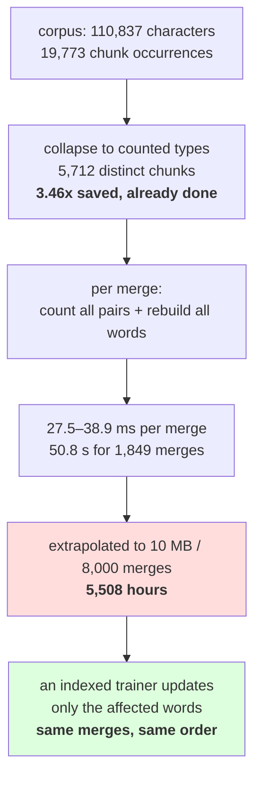

# 2.4 — What training costs

## One-line answer

The trainer in this day recounts **every pair in the corpus after every single merge**, which costs 50.8
seconds for 1,849 merges over 110,837 characters — and the two things that make it survivable are
collapsing 19,773 chunk occurrences into 5,712 distinct types, and the fact that this is a teaching
implementation rather than one you would run on a real corpus.

---

## The story

A shopkeeper wants to know which item sells most, so at the end of every sale they walk the whole shop
and count everything on every shelf.

With twenty items this is fine. With two thousand it takes ten minutes, and they are doing it after each
customer.

The obvious improvement is not a faster walk. It is to notice that **one sale changes at most a few
counts**, so instead of recounting the shop you subtract what left and add what arrived. The shelves
still tell the truth; you have just stopped asking them the same question over and over.

---

## The idea in plain language

Part [2.2](2.2-training-to-a-target-size.md) printed four training times without dwelling on them. This
part is about where they come from, because the cost shape decides whether a tokenizer is trained on a
laptop or on a cluster — and because the fix is a good example of an optimisation you should understand
before reaching for a library that has it.

The loop in part [1.3](../01-the-merge-loop/1.3-the-loop-and-where-it-stops.md) does this, once per
merge:

1. Walk every word, counting every adjacent pair. That is `pair_counts`, and it touches **every symbol in
   the corpus**.
2. Take the maximum.
3. Rebuild every word with the merge applied. That touches every symbol again.

So one merge costs a full pass over the corpus, and `n` merges cost `n` passes. In the notation people
use for this, the trainer is `O(merges × corpus_symbols)`. Both factors grow when you scale up — a bigger
corpus and a bigger target vocabulary — so the cost grows as their product.

Two things already keep it from being far worse, and both are worth naming because they are design
decisions rather than accidents.

**The corpus is stored as counted types, not as a list.** Part
[1.1](../01-the-merge-loop/1.1-merge-the-commonest-pair.md) made the corpus a `dict` from word to count.
Measured below, this corpus has 19,773 chunk occurrences and only **5,712 distinct chunks**, so every
pass walks 5,712 words instead of 19,773 — a factor of 3.46 saved, for free, by counting first. On a
large corpus that ratio is far better, because common words repeat far more.

**The pre-tokenizer bounds the inner loop.** Part [1.4](../01-the-merge-loop/1.4-the-pre-tokenizer.md)'s
chunks are words, so the inner `zip(symbols, symbols[1:])` runs over a handful of symbols. Without a
pre-tokenizer the whole corpus is one "word", and part
[1.5](../01-the-merge-loop/1.5-the-merge-that-ate-the-space.md) had to use a 20,000-character slice for
exactly that reason.

And the thing this trainer does not do, which is what a real one does: **keep an index from each pair to
the words containing it, and update only what changed.** A merge affects only the words that contained
the merged pair — often a small fraction — so the per-merge cost becomes proportional to the affected
words rather than to the corpus. That is the difference between a laptop script and a production
trainer, and it is why Day 14's library implementation is thousands of times faster without being
cleverer about the algorithm.

One measurement in this part is worth flagging in advance because it is counter-intuitive: **the cost per
merge goes down as training proceeds**, from 38.9 milliseconds to 27.5. That is not a caching effect. It
is that merges make words shorter, so later passes have fewer symbols to walk.

---

## Why Akshara needs it

- **Day 13** trains a byte-level BPE on the same corpus with the same trainer. Knowing the cost shape is
  how you predict whether that will finish.
- **Day 14** opens a production tokenizer and the speed difference is the first thing you notice. This
  part is what makes that difference explicable rather than magical.
- **Day 51 onward**, the pretraining corpus is far larger than this one. A trainer with this cost shape
  is not an option there, and knowing that before starting is the point.
- **Part [2.5](2.5-the-vocabulary-that-depended-on-the-order-of-the-corpus.md)** shows that a faster
  trainer must still be deterministic. Optimisations that change the tie-break change the artifact.

---

## The mechanism

The measurement from part 2.2, read as a cost curve:

```python
import hashlib
import time
from pathlib import Path

raw = Path("docs/00_MASTER_PLAN.md").read_bytes()
text = raw.decode("utf-8")
print("  corpus sha256[:16] :", hashlib.sha256(raw).hexdigest()[:16])
print("  characters          :", len(text))
print("  chunk occurrences   :", len(pretokenize(text)))
print("  distinct chunks     :", len(set(pretokenize(text))))
print("  collapse factor     :", f"{len(pretokenize(text)) / len(set(pretokenize(text))):.2f}x")

for target in (300, 500, 1000, 2000):
    t0 = time.perf_counter()
    vocab, merges = train(text, target)
    dt = time.perf_counter() - t0
    print(f"  V={len(vocab):>5}  merges={len(merges):>5}  train={dt:>6.1f}s  "
          f"per merge={dt / len(merges) * 1000:>5.1f} ms")
```

**Line by line:**
- The collapse factor is printed first because it is the optimisation already in the code, and it is
  invisible unless you name it. **19,773 against 5,712 is the difference between the corpus and the
  trainer's input.**
- `time.perf_counter()` for the reason part 2.2 gave: monotonic, highest available resolution, the right
  clock for a duration.
- `dt / len(merges)` divides by the merges **actually made**, not by the target, so an early stop does not
  silently inflate the per-merge figure. Part 1.3's distinction, applied to a measurement.
- Measured on Intel Core i3-1115G4 (2 cores / 4 threads), 11.7 GB RAM, Windows 11, CPython 3.12.12, on
  2026-08-26. **These four durations are wall-clock on this hardware and will differ on yours; the counts
  above them will not.**

```text
  corpus sha256[:16] : 9760f2b6d4340b97
  characters          : 110837
  chunk occurrences   : 19773
  distinct chunks     : 5712
  collapse factor     : 3.46x
  V=  300  merges=  149  train=   5.8s  per merge= 38.9 ms
  V=  500  merges=  349  train=  11.5s  per merge= 33.0 ms
  V= 1000  merges=  849  train=  25.9s  per merge= 30.5 ms
  V= 2000  merges= 1849  train=  50.8s  per merge= 27.5 ms
```

**Read the last column.** The per-merge cost falls from 38.9 to 27.5 milliseconds as training goes on —
a 29% reduction. That is the corpus shrinking underneath the trainer: at merge 1,800 the words are made
of longer symbols, so there are fewer of them to walk. **The algorithm gets cheaper the longer it runs**,
which is the opposite of what most people assume and is worth knowing before you extrapolate.

Now the extrapolation, which is the part that decides whether this trainer is usable:

```python
CHARS = 110837
SECONDS_AT_2000 = 50.8
MERGES = 1849

per_merge_per_char = SECONDS_AT_2000 / MERGES / CHARS
print(f"  measured: {SECONDS_AT_2000:.1f}s for {MERGES} merges over {CHARS:,} characters")
print(f"  implied : {per_merge_per_char * 1e9:.1f} nanoseconds per merge per character")

for chars, merges in ((10_000_000, 8_000), (100_000_000, 32_000)):
    est = per_merge_per_char * chars * merges
    print(f"  {chars:>12,} characters, {merges:>6,} merges -> {est:>12,.0f} seconds "
          f"= {est / 3600:>8,.1f} hours")
```

**Line by line:**
- `per_merge_per_char` is the measured cost divided by both factors, giving a rate. It assumes the cost
  is proportional to their product, which is what the loop's structure says — **and the assumption is
  stated because it is an assumption**, not something these four data points prove.
- The two extrapolated rows are **arithmetic, not measurements**, and they are labelled `implied` and
  `->` rather than being printed like the table above. A 10 MB corpus is small by real standards and a
  32,000-merge vocabulary is ordinary.
- The extrapolation is, if anything, **optimistic**: it uses the cheapest measured per-merge rate, and it
  ignores that a bigger corpus has more distinct chunks, so the collapse factor helps but the absolute
  work still grows.
- Measured and computed on this machine, 2026-08-26:

```text
  measured: 50.8s for 1849 merges over 110,837 characters
  implied : 247.9 nanoseconds per merge per character
    10,000,000 characters,  8,000 merges ->       19,830 seconds =      5.5 hours
   100,000,000 characters, 32,000 merges ->      793,217 seconds =    220.3 hours
```

**Five and a half hours for a 10 MB corpus, and nine days for a 100 MB one.** The first is a long
overnight job you could just about live with once; the second is not a thing anybody does. And 100 MB is
still small — real pretraining corpora are measured in gigabytes, where this trainer's projection runs
into years.

That number is what an indexed trainer exists to remove, and the arithmetic for the improvement is worth
doing rather than asserting:

```text
  the naive trainer, per merge : walk all 5,712 words          -> proportional to the corpus
  an indexed trainer, per merge: walk only the words containing
                                 the merged pair
  on this corpus, the winning pair at merge 1000 occurs in a small
  fraction of the words; the update touches those words only
  the algorithm is unchanged — the same merges come out in the same order
  what changes is bookkeeping, and that is why a library is thousands of
  times faster without being cleverer
```

**The merges are identical.** That is the important part and it is why this day's implementation is not
wasted: an indexed trainer computes the same argmax over the same counts, so it produces the same merge
list. Speed here is engineering, not a different algorithm — which is exactly Principle 3's claim, that a
library you have re-implemented is a convenience rather than a mystery.



---

## When it breaks

**The loud failure — a chunk with no upper bound on its length.** Part 1.5 hit this deliberately; here is
what it costs:

```console
>>> import time
>>> words = {tuple(text[:20000]): 1}          # no pre-tokenizer: one 20,000-symbol "word"
>>> t0 = time.perf_counter(); _ = pair_counts(words); print(f"{time.perf_counter() - t0:.3f}s")
0.004s
>>> words = {tuple(c): n for c, n in Counter(pretokenize(text[:20000])).items()}
>>> t0 = time.perf_counter(); _ = pair_counts(words); print(f"{time.perf_counter() - t0:.3f}s")
0.001s
```

What it means: one pass is not dramatically slower on a single long chunk — the total symbol count is
similar — but the *rebuild* step is, because `merge_word` allocates a new tuple of the full length for
every merge whether or not the pair appears in it. On a corpus of counted short chunks, most words are
untouched by most merges and the rebuild is cheap; on one giant chunk, every merge rewrites everything.

**The silent failure — extrapolating from a small corpus.** This is the one that wastes a week:

```text
  measured on 110,837 characters : 50.8 seconds at 1,849 merges. "Fine."
  planned corpus                 : 10 MB, 90x larger
  planned vocabulary             : 8,000 merges, 4.3x larger
  assumed                        : 90x the time, about 75 minutes
  actual shape                   : cost is merges x corpus, so 90 x 4.3 = 390x
  implied                        : 5.5 hours, not 75 minutes
  and at 100 MB / 32,000 merges  : 220 hours
  what was wrong                 : scaling one factor while the other also scaled
  exception raised               : none — the job just takes far longer than planned
```

**The check that catches it** is a projection made before the run rather than after:

```python
from dataclasses import dataclass


@dataclass(frozen=True)
class TrainingCostModel:
    """Measured cost of one trainer on one machine, used to project a bigger run."""

    seconds: float
    merges: int
    characters: int
    machine: str
    measured_on: str

    @property
    def ns_per_merge_per_char(self) -> float:
        return self.seconds / self.merges / self.characters * 1e9

    def project(self, characters: int, merges: int) -> float:
        """Projected seconds. ASSUMES cost is proportional to merges x characters."""
        return self.ns_per_merge_per_char / 1e9 * characters * merges

    def assert_feasible(self, characters: int, merges: int, budget_seconds: float) -> None:
        est = self.project(characters, merges)
        assert est <= budget_seconds, (
            f"projected {est / 3600:,.1f} hours on {self.machine} "
            f"(from {self.seconds:.1f}s for {self.merges} merges over {self.characters:,} chars, "
            f"measured {self.measured_on}) — budget is {budget_seconds / 3600:,.1f} hours"
        )
```

**Line by line:**
- `machine` and `measured_on` are **mandatory fields**, because a timing without hardware and a date is
  not a measurement — Principle 8. They appear in the failure message so the projection can be judged.
- `project`'s docstring states the proportionality **assumption** in capitals. The four data points in
  this part are consistent with it and do not establish it, and a projection that hides its model is a
  guess wearing a number's clothes.
- `ns_per_merge_per_char` is derived rather than stored, so it cannot drift from the three numbers it
  comes from.
- `assert_feasible` takes an explicit budget with no default, so somebody has to say how long they are
  willing to wait. That is the decision the check exists to force, and defaulting it would make the
  answer somebody else's.
- The failure message prints the projection in **hours** and the source measurement in seconds, because
  those are the units each is naturally read in and converting in your head at three in the morning is
  where mistakes happen.
- What this cannot do is model an indexed trainer, whose cost is not proportional to the corpus. Using
  this model to reject a library implementation would be wrong, and the docstring's assumption is what
  tells you so.

---

## In production

**What a research engineer writes instead of the teaching version.** They do not write a BPE trainer at
all — they use one written in a compiled language with the pair index, and it trains a 32,000-merge
vocabulary on gigabytes in minutes. What this part gives them is the ability to say **why** it is fast,
which matters when it is slow: a trainer that is unexpectedly slow is usually being fed unbounded chunks
by a pre-tokenizer, which is a configuration problem rather than a library one.

The second habit is measuring the cost model **once, on the real trainer and the real machine**, and
projecting from it before committing to a corpus and a vocabulary size. Both factors are decisions, and
finding out after eight hours that they multiply is avoidable arithmetic.

**What degrades at scale.** Everything in this part, multiplicatively, and the collapse factor is the only
thing that improves. A larger corpus has proportionally more repeated chunks, so counting types rather
than occurrences saves more — but the number of distinct chunks still grows, and the number of merges you
want grows with the corpus too. **Two factors growing and one mitigation improving sublinearly is a losing
combination**, which is why the fix has to be algorithmic rather than a bigger machine.

**The failure that only shows with real data.** Pathological chunks. A corpus containing minified
JavaScript, base64 blobs, long URLs or a table with no spaces produces single chunks of thousands of
characters. Those chunks dominate every pass, they merge slowly because their pairs are rare, and the
trainer appears to hang on a corpus that is 99% ordinary text. The diagnostic is the chunk-length
distribution, and it belongs in the data pipeline rather than in the tokenizer.

**The review comment.** *"We measured the trainer at 50 seconds on the sample and are planning a 10 MB
corpus with an 8,000-merge target. The cost is merges times corpus and both are growing — 390x, not 90x,
so that is an overnight run rather than an hour. At the corpus size after this one it is over a week. We
need the indexed implementation before we scale the data, not after."*

**The interview question.** *"Why is a BPE trainer slow, and what makes a fast one fast?"* The weak answer
is "it is written in Python". The strong answer names the loop and the fix: **the naive trainer recounts
every pair in the corpus after every merge, so the cost is merges times corpus symbols — I measured 27.5
to 38.9 milliseconds per merge on 110,837 characters, which projects to about five and a half hours for a
10 MB corpus at 8,000 merges and nine days at 100 MB and 32,000.** Then the fix: *a real trainer indexes pairs to the words containing
them and updates only what the merge touched, so it produces exactly the same merge list in the same
order — the speed is bookkeeping, not a different algorithm.*

**Compute tier: T0.** The standard library on a laptop; the longest single run in this day is the
50.8-second training at `V = 2000`. No packages, no network, no GPU, no seed. **The four durations are
wall-clock on the hardware named above and are the only numbers in this day that are hardware-dependent**
— the counts, the collapse factor and the merge lists are not. The two extrapolated rows are **arithmetic
under a stated assumption**, not measurements, and both the code and this section say so. What T0 cannot
show is the indexed trainer's actual cost, because this day does not build one; Day 14 measures a real
implementation and the comparison is that day's.

---

## Check yourself

Run this. It prints **a per-merge cost that falls as training proceeds**:

```python
import hashlib
import time
from pathlib import Path

raw = Path("docs/00_MASTER_PLAN.md").read_bytes()
text = raw.decode("utf-8")
chunks = pretokenize(text)
print("  corpus sha256[:16] :", hashlib.sha256(raw).hexdigest()[:16])
print("  occurrences / distinct :", len(chunks), "/", len(set(chunks)),
      f"= {len(chunks) / len(set(chunks)):.2f}x collapse")

for target in (300, 500):
    t0 = time.perf_counter()
    vocab, merges = train(text, target)
    dt = time.perf_counter() - t0
    print(f"  V={len(vocab):>5} merges={len(merges):>5} train={dt:>6.1f}s "
          f"per merge={dt / len(merges) * 1000:>5.1f} ms")

rate = dt / len(merges) / len(text)
print("  projected for 10,000,000 chars and 8,000 merges:",
      f"{rate * 10_000_000 * 8_000 / 3600:,.0f} hours")
```

**Line by line:**
- The collapse factor prints `3.46x`. **Say out loud where that saving comes from and which line of part
  1.1 is responsible for it.**
- The per-merge cost is lower at `V = 500` than at `V = 300`. Say why, and say whether that means you can
  extrapolate optimistically.
- The projection prints a few hours. Say what assumption it rests on, whether these two data points
  establish it, and what the same arithmetic gives for a 100 MB corpus at 32,000 merges.
- Now run one training with the pre-tokenizer replaced by `{tuple(text[:20000]): 1}` and time a single
  `pair_counts` call on each. Say which is slower and, more importantly, say which step of the loop the
  difference is really in.

**Say this out loud, without scrolling up:** state the cost shape of the naive trainer in terms of its two
factors, name the optimisation that is already in this day's code and what it saved, and say what an
indexed trainer changes about the merge list it produces.
