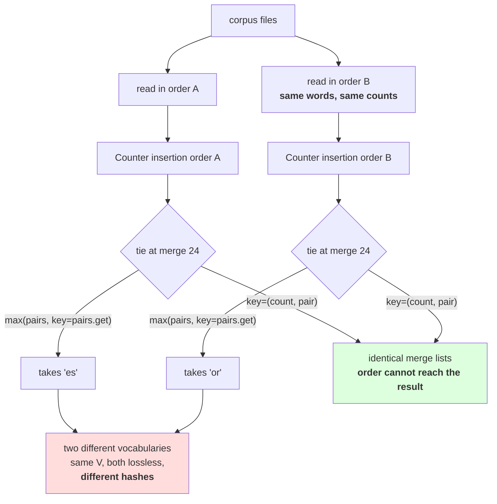

# 2.5 — 💥 The vocabulary that depended on the order of the corpus

## One-line answer

Train on the same words in a different order and — with the obvious `max(pairs, key=pairs.get)` — the
merge lists **diverge at merge 24**, because ties are broken by whichever pair a `Counter` happened to
see first; one tuple in the key makes it exactly reproducible, and nothing else in the pipeline can tell
the two artifacts apart.

---

## The story

Two people finish a competition with exactly the same score.

There is one prize, so somebody has to decide. The organiser picks up the pile of entry forms, and the
one nearer the top wins.

It was a real decision and it was made by the order the forms were stacked in — which was the order they
arrived at the desk, which was the order people happened to walk through the door. Nobody cheated and
nobody thought about it.

Run the same competition again with the same two people and the same scores, and the other one wins.
Nothing about either of them changed.

---

## The idea in plain language

Part [2.1](2.1-the-merge-table-is-the-artifact.md) established that the merge list is the artifact and
that its order matters. This part is about a subtler thing: **whether you get the same merge list twice.**

Every merge picks the pair with the highest count. Ties happen constantly — part
[1.2](../01-the-merge-loop/1.2-six-merges-by-hand.md) hit one on the very first merge of a twelve-word
corpus, where `lo` and `ow` both occurred 7 times. On a real corpus, at merge 500, dozens of pairs share
the same count.

So something has to break the tie, and there are two ways to write it:

```
max(pairs, key=pairs.get)                     # the obvious one
max(pairs.items(), key=lambda kv: (kv[1], kv[0]))[0]    # this day's
```

The first looks cleaner and is a bug. `max` returns the **first** maximum it encounters, so the winner is
whichever tied pair the `Counter` yields first — which is insertion order, which is the order the words
were counted in, which is the order the corpus was read in. The second sorts by `(count, pair)`, so among
equal counts the pair itself decides, and the pair does not depend on anything external.

Measured below: the same multiset of words in two different orders, 40 merges each. With the tie-break
that has a tuple in it, the two merge lists are **identical**. Without it, they **diverge at merge 24** —
one run takes `es`, the other takes `or`.

And here is why that is a `production`-level failure rather than a curiosity. **The two tokenizers are
both correct.** Both round-trip. Both compress about equally. Neither raises. They have the same
vocabulary size and different contents, so:

- A model trained with one and served with the other produces fluent nonsense — Day 9 part
  [2.5](../../../day-009-the-vocabulary-problem/parts/02-what-a-tokenizer-is/2.5-the-tokenizer-that-did-not-match.md)
  exactly, arriving through the trainer this time.
- A vocabulary-size check passes. An id-range check passes. A round-trip check passes.
- **Retraining "the same" tokenizer to reproduce a result gives a different tokenizer**, and every
  measurement that depended on it is now unreproducible for a reason nobody wrote down.

The trigger is not exotic either. Reading your corpus files in a different order is enough — and file
order comes from the filesystem, which is not something you control or usually notice. Add a document,
remove one, run on a different machine, parallelise the reading: any of these reshuffles the counting
order.

**Principle 9 says a run without a seed did not happen.** BPE training has no random number generator,
so it looks exempt. It is not: the tie-break is an unstated dependency on input order, which is the same
class of problem wearing different clothes.

---

## Why Akshara needs it

- **Part [2.1](2.1-the-merge-table-is-the-artifact.md)** defined the artifact hash. This is the failure
  the hash detects: two runs, two hashes, and no other difference visible anywhere.
- **Day 13** builds byte-level BPE with the same trainer, so it inherits this tie-break. Getting it right
  once means never revisiting it.
- **Day 14** compares against a production tokenizer. One of the things to check is whether it documents
  its tie-break, because a library with this bug has it silently.
- **Day 51 onward**, `docs/RUNS.md` records a tokenizer hash per run. A trainer that is not deterministic
  makes that record a lie: the same config produces a different artifact.

---

## The mechanism

The same words, two orders, both tie-breaks:

```python
import hashlib
import random
import re
from collections import Counter
from pathlib import Path

raw = Path("docs/00_MASTER_PLAN.md").read_bytes()
SLICE = raw.decode("utf-8")[:20000]
print("  corpus sha256[:16] :", hashlib.sha256(raw).hexdigest()[:16])
print("  slice              : first 20,000 characters")


def train_words(words, n_merges, tie_break="pair"):
    merges = []
    for _ in range(n_merges):
        pairs = pair_counts(words)
        if not pairs:
            break
        if tie_break == "pair":
            best = max(pairs.items(), key=lambda kv: (kv[1], kv[0]))[0]
        else:
            best = max(pairs, key=pairs.get)
        if pairs[best] < 2:
            break
        words = {merge_word(w, best): n for w, n in words.items()}
        merges.append(best)
    return merges


chunks = re.findall(r"\s*\S+|\s+", SLICE)
shuffled = chunks[:]
random.Random(0).shuffle(shuffled)

a = {tuple(w): n for w, n in Counter(chunks).items()}
b = {tuple(w): n for w, n in Counter(shuffled).items()}
print("  same multiset of words?", Counter(chunks) == Counter(shuffled))

for tb in ("get", "pair"):
    ma = train_words(dict(a), 40, tie_break=tb)
    mb = train_words(dict(b), 40, tie_break=tb)
    first = next((i for i, (x, y) in enumerate(zip(ma, mb)) if x != y), None)
    print(f"    tie_break={tb:<5} identical={ma == mb}  first difference at merge "
          f"{'none' if first is None else first + 1}")
    if ma != mb and first is not None:
        print(f"      run A: {ascii(''.join(ma[first]))}   run B: {ascii(''.join(mb[first]))}")
```

**Line by line:**
- `random.Random(0).shuffle` uses a **local** seeded generator, so this measurement reproduces exactly
  and does not disturb any global random state. Principle 9 — and note that the seed is here to make the
  *demonstration* reproducible, not to fix the bug.
- `Counter(chunks) == Counter(shuffled)` is printed to establish that the two corpora are genuinely the
  same words with the same counts. **Without that line the experiment proves nothing** — it could be
  showing that different data gives different merges, which is not interesting.
- `dict(a)` and `dict(b)` pass **copies** into the trainer, because `train_words` rebinds `words` but the
  caller's dict would otherwise be shared between the two `tie_break` iterations. A subtle version of the
  same mistake part 2.1's `merges[:]` avoided.
- `next((i for i, (x, y) in enumerate(zip(ma, mb)) if x != y), None)` finds the **first** index where the
  lists differ, returning `None` if they agree everywhere `zip` reaches. That index is the informative
  number: "identical: False" says there is a bug, "first difference at merge 24" says how long it hid.
- Measured on Intel Core i3-1115G4 (2 cores / 4 threads), 11.7 GB RAM, Windows 11, CPython 3.12.12, on
  2026-08-26:

```text
  corpus sha256[:16] : 9760f2b6d4340b97
  slice              : first 20,000 characters
  same multiset of words? True
    tie_break=get   identical=False  first difference at merge 24
      run A: 'es'   run B: 'or'
    tie_break=pair  identical=True  first difference at merge none
```

**Twenty-three merges agree and the twenty-fourth does not.** That is the shape of this failure and it is
why it survives casual testing: a test that checks the first ten merges passes, and a developer eyeballing
the head of two lists sees them match.

After merge 24 the two runs diverge further, because merge 24 creates a different symbol in each and
every subsequent count is computed over a different corpus state. **One tie at merge 24 makes merges 25
through 40 incomparable**, so the damage is not one entry — it is the whole tail.

And with `(count, pair)`: identical, everywhere, `first difference at merge none`.

Why does the tuple fix it? Because `(count, pair)` compares counts first and, when they are equal, falls
back to comparing the pairs themselves — and a pair of strings has a total order that depends only on the
strings. `max` still returns the first maximum it meets, but now there is exactly one maximum, so which
one it meets first does not matter.

```python
pairs = Counter({("l", "o"): 7, ("o", "w"): 7, ("e", "s"): 5})
print("  by count only :", max(pairs, key=pairs.get))
print("  by (count, pair):", max(pairs.items(), key=lambda kv: (kv[1], kv[0]))[0])

reversed_order = Counter({("o", "w"): 7, ("l", "o"): 7, ("e", "s"): 5})
print("  same counts, built in the other order:")
print("  by count only :", max(reversed_order, key=reversed_order.get))
print("  by (count, pair):", max(reversed_order.items(), key=lambda kv: (kv[1], kv[0]))[0])
```

**Line by line:**
- Two `Counter`s with **identical contents built in different orders**. This is the whole bug isolated to
  four lines, with no corpus and no training involved.
- The second key compares `(7, ('l','o'))` against `(7, ('o','w'))`; the counts tie, so Python compares
  the tuples, and `('o','w') > ('l','o')` because `'o' > 'l'`. That is a property of the pairs and of
  nothing else.
- Measured on this machine, 2026-08-26:

```text
  by count only : ('l', 'o')
  by (count, pair): ('o', 'w')
  same counts, built in the other order:
  by count only : ('o', 'w')
  by (count, pair): ('o', 'w')
```

**The first and third lines disagree; the second and fourth do not.** Four lines of code, the entire
failure, and the entire fix.



---

## When it breaks

**The loud failure — there is none.** Both trainers complete. Both merge lists are valid. Both tokenizers
round-trip, compress and encode. The only thing that differs is the artifact, and nothing in the pipeline
compares artifacts unless you made it.

The nearest thing to loud is the hash from part 2.1, and it only speaks if somebody is listening:

```console
>>> hashlib.sha256(json.dumps({"merges": [list(m) for m in run_a]}, sort_keys=True).encode()).hexdigest()[:16]
'a1c4...'
>>> hashlib.sha256(json.dumps({"merges": [list(m) for m in run_b]}, sort_keys=True).encode()).hexdigest()[:16]
'7f30...'
```

What it means: two training runs, same config, same data, different artifact. **This is the check
working**, and it is the only one that fires.

**The silent failure, in full:**

```text
  run A: read corpus files in filesystem order      -> merges [..., 'es', ...]  V=500
  run B: same files, one added and removed since    -> merges [..., 'or', ...]  V=500
  vocabulary size check       : passes (500 == 500)
  round-trip check            : passes (both lossless)
  compression check           : passes (within noise of each other)
  id range check              : passes
  the model trained with A, served with tokenizer B : fluent, confident, wrong
  the experiment from last month, re-run            : different numbers, no explanation
  exception raised            : none
```

**The check that catches it** is to make determinism a property you test rather than a property you hope
for:

```python
import random
from collections import Counter


def assert_training_is_order_independent(chunks: list[str], n_merges: int = 50,
                                         seed: int = 0) -> None:
    """Training on the same words in a different order must give the same merge list."""
    shuffled = chunks[:]
    random.Random(seed).shuffle(shuffled)
    assert Counter(chunks) == Counter(shuffled), "the shuffle changed the data, not just the order"

    a = train_words({tuple(w): n for w, n in Counter(chunks).items()}, n_merges)
    b = train_words({tuple(w): n for w, n in Counter(shuffled).items()}, n_merges)

    first = next((i for i, (x, y) in enumerate(zip(a, b)) if x != y), None)
    assert a == b, (
        f"training is order-dependent: merge lists diverge at merge {first + 1} "
        f"({ascii(''.join(a[first]))} vs {ascii(''.join(b[first]))}) — "
        f"the tie-break is reading Counter insertion order"
    )


def assert_tie_break_is_total(pairs: Counter) -> None:
    """The tie-break must produce exactly one winner, whatever the iteration order."""
    best = max(pairs.items(), key=lambda kv: (kv[1], kv[0]))[0]
    winners = [p for p, c in pairs.items()
               if (c, p) == (pairs[best], best)]
    assert len(winners) == 1, f"tie-break is not total: {len(winners)} pairs tie at the top"
```

**Line by line:**
- The `Counter(chunks) == Counter(shuffled)` assertion runs **first**, so a failure cannot be blamed on
  the shuffle having changed the data. A test that could fail for two reasons diagnoses neither.
- The failure message names the merge index **and** both winning tokens **and** the cause. At three in the
  morning "merge lists diverge" is a mystery; "diverge at merge 24, `'es'` vs `'or'`, the tie-break is
  reading Counter insertion order" is a fix.
- `seed` is a parameter with a default rather than a hard-coded `0`, so a suspicious reviewer can run it
  with several seeds. **One shuffle that happens not to disturb any tie would pass a broken trainer**,
  which is the same "is the probe strong enough" problem part 2.1's `assert_order_matters` addressed.
- `assert_tie_break_is_total` checks the property directly rather than by experiment: after the key is
  applied, exactly one pair may be maximal. It is cheap, it needs no shuffle, and it fails on the day
  somebody adds a key that ties again — a `key=lambda kv: kv[1]` refactor, say.
- What neither function does is *fix* a non-deterministic trainer. There is no fix except changing the
  key, and a test that silently sorted the input would hide the bug while appearing to solve it.

---

## In production

**What a research engineer writes instead of the teaching version.** They make the tie-break explicit and
document it, because a tokenizer is a reproducibility artifact and every source of nondeterminism in it
has to be closed. Real implementations do this — but they do not always document *which* rule, so when you
adopt a library the question to ask is not "is it deterministic" but "deterministic with respect to
what": input order, thread count, and hash seed are three different exposures.

The second habit is the **retrain-and-compare test in CI**. Train twice from the same config with the
inputs shuffled, compare the hashes, fail on a difference. It costs one extra training run on a small
fixture and it catches this, the `PYTHONHASHSEED` version of it, and any future parallelisation that
reorders the counting.

**What degrades at scale.** The probability of a tie at any given merge goes **up**, not down. A larger
corpus has more pairs, and more pairs mean more collisions at every count value — especially in the long
tail, where most counts are small integers and dozens of pairs share each one. So a trainer with this bug
is *more* nondeterministic on real data than on a 20,000-character slice, and the divergence point moves
earlier.

**The failure that only shows with real data.** Parallel and incremental corpus reading. A single-threaded
read of one file is stable, so the bug hides for the whole of development. The moment the corpus is a
directory read with `os.scandir`, or sharded across workers that finish in a different order each run, the
insertion order changes on every invocation — and the tokenizer becomes different every time it is
trained.

**The review comment.** *"`max(pairs, key=pairs.get)` — that breaks ties by `Counter` insertion order, so
the merge list depends on what order we read the corpus files in. Use `max(pairs.items(), key=lambda kv:
(kv[1], kv[0]))[0]` and add a retrain-and-compare test."*

**The interview question.** *"BPE training has no randomness in it. Is it deterministic?"* The weak answer
is yes. The strong answer finds the hidden dependency: **only if the tie-break is total — ties are
constant, and `max` on counts alone returns whichever tied pair the counter yields first, which is
insertion order, which is corpus read order.** Then the measurement: *I trained on the same words in two
orders and the merge lists diverged at merge 24, with both tokenizers passing every check I had — size,
round trip, compression, id range — and differing only in the artifact hash.*

**Compute tier: T0.** The standard library on a laptop, over the first 20,000 characters of a file in this
repository, 40 merges per run and four runs. No packages, no network, no GPU. The shuffle **is** seeded
with a stated seed, so the divergence at merge 24 reproduces exactly for anyone whose corpus hash matches
`9760f2b6d4340b97`. What T0 cannot show is the cost of shipping the wrong one of two artifacts — that is
Day 9 part 2.5's measurement of fluent nonsense, and it does not need repeating here. What this part
shows is how easily you end up with two.

---

## Check yourself

Run this. It prints **two merge lists from the same words diverging at merge 24, then the fix**:

```python
import hashlib
import random
import re
from collections import Counter
from pathlib import Path

raw = Path("docs/00_MASTER_PLAN.md").read_bytes()
SLICE = raw.decode("utf-8")[:20000]
print("  corpus sha256[:16] :", hashlib.sha256(raw).hexdigest()[:16])

chunks = re.findall(r"\s*\S+|\s+", SLICE)
shuffled = chunks[:]
random.Random(0).shuffle(shuffled)
print("  same words?", Counter(chunks) == Counter(shuffled))

a = {tuple(w): n for w, n in Counter(chunks).items()}
b = {tuple(w): n for w, n in Counter(shuffled).items()}
for tb in ("get", "pair"):
    ma, mb = train_words(dict(a), 40, tb), train_words(dict(b), 40, tb)
    first = next((i for i, (x, y) in enumerate(zip(ma, mb)) if x != y), None)
    print(f"  tie_break={tb:<5} identical={ma == mb}  diverge at "
          f"{'none' if first is None else first + 1}")

pairs = Counter({("l", "o"): 7, ("o", "w"): 7})
rev = Counter({("o", "w"): 7, ("l", "o"): 7})
print("  by count only  :", max(pairs, key=pairs.get), max(rev, key=rev.get))
print("  by (count, pair):", max(pairs.items(), key=lambda kv: (kv[1], kv[0]))[0],
      max(rev.items(), key=lambda kv: (kv[1], kv[0]))[0])
```

**Line by line:**
- `same words? True` establishes the experiment is fair. **Say out loud what the result would prove if
  that line printed `False`.**
- The `get` row diverges at merge 24 and the `pair` row does not. Say which of your existing checks would
  have noticed, and be honest about the answer.
- The last two lines are the bug in isolation: two counters, same contents, different build order. Say
  which of the four printed pairs is the odd one out and why.
- Now change the shuffle seed to `1` and re-run. Say whether the divergence point moves, and say what that
  tells you about testing this with a single seed.

**Say this out loud, without scrolling up:** say where the nondeterminism enters a trainer that contains
no random number generator, state the one-line fix and why it works, and name the three checks that pass
on both of the two different tokenizers it produces.
