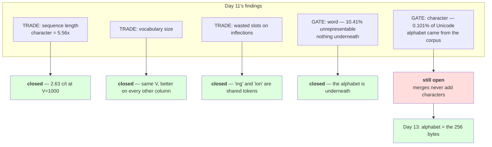

# 3.1 — Three tokenizers, one table

## One-line answer

At the same vocabulary size, BPE gives up compression to the word tokenizer — **2.63 characters per token
against 4.90** — and takes back everything Day 11 said was a gate: it is lossless, its out-of-vocabulary
rate is zero, and it spells `memorises` as `mem` + `or` + `is` + `es` where the word tokenizer emitted
`<unk>`.

---

## The story

You are choosing how to carry water from the tap to the house.

One person carries it in cupped hands: nothing to buy, nothing to store, and it takes all afternoon.

Another has one enormous drum. Two trips and the job is done — except the drum only fits under the one
tap it was made for, and at any other tap it is useless.

The third has a stack of ordinary buckets. More trips than the drum, far fewer than the hands, and they
work at every tap in the village.

Nobody chose the buckets because they won on trips. They won because they were the only option that still
worked when the tap changed.

---

## The idea in plain language

Day 11 part
[3.1](../../../day-011-character-and-word-tokenizers/parts/03-together/3.1-two-tokenizers-one-table.md)
sorted its findings into **trades** — things you can pay for — and **gates** — things that disqualify
you. It ended with two gates and one door: the word tokenizer's gate was structural, and the character
tokenizer's was fixable by changing where the alphabet comes from.

This part checks what Day 12 actually achieved against that framing, and the answer has two halves.

**On the trades, BPE wins comfortably.** Measured below at `V = 1000`, the same vocabulary size as Day
11's word tokenizer: 42,130 tokens against the character tokenizer's 110,837, which is 2.63 characters
per token against 1.00. Sequence length is the character tokenizer's only real cost and BPE takes 62% of
it away for the same number of vocabulary slots.

**On the word tokenizer's gate, BPE closes it completely.** This is the important half. At `V = 1000`
the word tokenizer could not represent 19.29% of held-out tokens and could never emit the word `spell`.
BPE at `V = 1000` represents everything, because when no learned piece fits, the alphabet is underneath.
Measured below, `memorises` — the word Day 11 part
[2.5](../../../day-011-character-and-word-tokenizers/parts/02-word-level/2.5-the-word-tokenizer-that-could-not-say-the-word.md)
lost — comes out as four tokens and round-trips exactly.

**And on the character tokenizer's gate, BPE changes nothing at all.** Part
[2.3](../02-training-a-vocabulary/2.3-reading-the-table.md) measured it: the same trained tokenizer is
missing 6 of 6 Cyrillic characters. **Merges combine symbols; they never add one.** So the coverage gate
is exactly where Day 11 left it, and Day 13 is where it closes.

That is the honest summary of the day: **BPE solved one of Day 11's two gates and every one of its
trades, and left the other gate untouched.** A day that claimed to solve both would be a day you should
distrust.

One more column belongs in the table and it is easy to leave out. The word tokenizer's 4.90 characters
per token is **not comparable** to the other two, because part
[2.1](../../../day-011-character-and-word-tokenizers/parts/02-word-level/2.1-what-counts-as-a-word.md)
measured that its splitter discards whitespace: it is not encoding the same text. The character and BPE
rows encode all 110,837 characters; the word row encodes 73,854 of them and silently drops the rest. **A
compression figure from a lossy tokenizer is flattering itself**, and putting the losslessness column next
to it is what stops the table lying.

---

## Why Akshara needs it

- **Day 13** takes the one gate left open and closes it by swapping the alphabet for the 256 bytes. This
  table is the statement of what is already done and what is not.
- **Day 14** adds a fourth row: a production tokenizer, measured the same way on the same text. The value
  of that comparison depends entirely on these three rows existing first.
- **Day 17** re-runs this comparison across scripts and with a trained model behind it. Every number here
  is English-only and this part says so.
- **Day 51 onward**, the pretraining run's token budget is spent at whatever rate this table's winning
  row sets.

---

## The mechanism

Three tokenizers, one corpus, one table:

```python
import hashlib
import re
from collections import Counter
from pathlib import Path

raw = Path("docs/00_MASTER_PLAN.md").read_bytes()
text = raw.decode("utf-8")
print("  corpus sha256[:16] :", hashlib.sha256(raw).hexdigest()[:16])

vocab, merges = train(text, target_vocab=1000)
bpe_toks = tokenize(text, merges)
words = re.findall(r"[A-Za-z']+", text.lower())

print(f"  {'scheme':<16} {'V':>6} {'tokens':>8} {'chars/token':>12} {'lossless':>9}")
print(f"  {'character':<16} {len(set(text)):>6} {len(text):>8} {1.00:>12.2f} {'True':>9}")
print(f"  {'word, V=1000':<16} {1001:>6} {len(words):>8} "
      f"{sum(len(w) for w in words) / len(words):>12.2f} {'False':>9}")
print(f"  {'BPE, V=1000':<16} {len(vocab):>6} {len(bpe_toks):>8} "
      f"{len(text) / len(bpe_toks):>12.2f} {'True':>9}")
print("  BPE round trip :", "".join(bpe_toks) == text)
```

**Line by line:**
- All three rows are measured on **one variable**, `text`, so the comparison is between schemes rather
  than between corpora. Day 11 part 3.1 made the same insistence and Day 12 part 2.2's silent failure is
  what happens without it.
- The word row's characters-per-token is `sum(len(w)) / len(words)` — the mean word length — rather than
  `len(text) / len(words)`. That is deliberate and it is the **generous** reading: dividing the full
  character count by the word count would credit the word tokenizer with encoding whitespace it discarded.
  Even flattered, the row is disqualified by the column beside it.
- The `lossless` values are literals for the same reason Day 11 part 3.1 gave: for the word row it is
  `False` structurally, not as a function of this text.
- `"".join(bpe_toks) == text` is computed rather than asserted, because it is the claim of the day and a
  claim should be visible in output.
- Measured on Intel Core i3-1115G4 (2 cores / 4 threads), 11.7 GB RAM, Windows 11, CPython 3.12.12, on
  2026-08-26:

```text
  corpus sha256[:16] : 9760f2b6d4340b97
  scheme                V   tokens  chars/token  lossless
  character           151   110837         1.00      True
  word, V=1000       1001    15082         4.90     False
  BPE, V=1000        1000    42130         2.63      True
  BPE round trip : True
```

**Look at rows two and three: `V` of 1,001 and 1,000.** Essentially the same vocabulary budget. One of
them is lossless and one is not, and that is not a tuning difference — it is the scheme.

Now the sentence that carries the day. This is Day 11 part 2.5's probe, unchanged:

```python
probe = "the tokenizer memorises its vocabulary and cannot spell anything else"
ptoks = tokenize(probe, merges)
print("  probe :", probe)
print("  tokens:", [ascii(t) for t in ptoks])
print("  count :", len(ptoks), "vs", len(probe), "characters and", len(probe.split()), "words")
print("  round trip:", "".join(ptoks) == probe)

unseen = "regenerated foundations"
utoks = tokenize(unseen, merges)
print("  unseen words:", unseen, "->", [ascii(t) for t in utoks])
print("  round trip  :", "".join(utoks) == unseen)
```

**Line by line:**
- The probe is byte-for-byte the sentence Day 11 part 2.5 used, which is what makes this a comparison
  rather than an anecdote.
- `unseen` contains two words that have no single token in this vocabulary. **There is no `try` and no
  fallback branch**, because none is needed — that is the claim being demonstrated.
- Measured on this machine, 2026-08-26:

```text
  probe : the tokenizer memorises its vocabulary and cannot spell anything else
  tokens: ["'the'", "' tokenizer'", "' mem'", "'or'", "'is'", "'es'", "' its'", "' v'", "'oc'",
           "'ab'", "'ul'", "'ary'", "' and'", "' cannot'", "' sp'", "'el'", "'l'", "' any'",
           "'th'", "'ing'", "' '", "'el'", "'se'"]
  count : 23 vs 69 characters and 10 words
  round trip: True
  unseen words: regenerated foundations -> ["'re'", "'g'", "'ener'", "'ated'", "' f'", "'ound'", "'ation'", "'s'"]
  round trip  : True
```

Put the two outputs side by side, same sentence, same corpus, same vocabulary size:

| | word tokenizer, `V = 1001` | BPE, `V = 1000` |
| --- | --- | --- |
| tokens | 10 | 23 |
| output | `the tokenizer <unk> its vocabulary and cannot <unk> anything <unk>` | the sentence, exactly |
| round trip | `False` | `True` |
| words lost | `memorises`, `spell`, `else` | none |
| can it ever emit `spell`? | **no id sequence produces it** | yes — `' sp'` + `'el'` + `'l'` |

**Thirteen extra tokens is the entire price**, and what it buys is three words and the ability to say
them. Day 11 called the word tokenizer's failure a gate because no vocabulary size opened it; BPE opens
it at a *smaller* vocabulary size than the one that failed.

And `regenerated foundations` — neither word has a token — comes out as `re` + `g` + `ener` + `ated` +
` f` + `ound` + `ation` + `s`. The lone `g` is the mechanism working: **when nothing fits, a single
character is always available.**

Now the column that has not moved:

```python
alphabet = set(text)
for name, probe in (("English", "the quick brown fox"),
                    ("Cyrillic", "\u043f\u0440\u0438\u0432\u0435\u0442"),
                    ("Chinese", "\u4f60\u597d")):
    missing = {c for c in probe if c not in alphabet}
    print(f"    {name:<9} missing {len(missing)} of {len(set(probe))} distinct characters")
```

**Line by line:**
- The check is against the **alphabet**, not against the vocabulary or the merges, because that is the
  only place coverage lives. Part 2.3 established the rule: no merge has ever added a character.
- Measured on this machine, 2026-08-26:

```text
    English   missing 0 of 16 distinct characters
    Cyrillic  missing 6 of 6 distinct characters
    Chinese   missing 2 of 2 distinct characters
```

**Identical to Day 11 part 1.5's result.** BPE improved everything and improved coverage by exactly
nothing, and the reason is structural rather than incidental. Day 13 is one line of change: build the
alphabet from `range(256)` instead of from the corpus.

The state of Day 11's scoreboard, after Day 12:



---

## When it breaks

**The loud failure — encoding text outside the alphabet, unchanged from Day 11:**

```console
>>> tokenize("\u043f\u0440\u0438\u0432\u0435\u0442", merges)
Traceback (most recent call last):
  File "<stdin>", line 1, in <module>
  File "<stdin>", line 4, in tokenize
KeyError: '\u043f'
```

What it means: the merges are irrelevant to this. The alphabet came from the corpus and the corpus had no
Cyrillic. **A better-trained BPE would fail identically**, which is what makes this a gate rather than a
quality issue.

**The silent failure — reading the compression column and stopping.** This is the one this table exists to
prevent:

```text
  the compression column alone : word 4.90 > BPE 2.63 > character 1.00
  conclusion if read alone     : "word-level is the most efficient"
  what the next column says    : the word row is not lossless
  what it is actually encoding : 73,854 of 110,837 characters — the rest was discarded by the splitter
  what it cannot do            : represent 19.29% of held-out tokens, or ever emit 'spell'
  exception raised             : none. Every number in the row is correctly computed.
```

**The check that catches it** refuses to report compression for a tokenizer that has not proved it is
lossless:

```python
from dataclasses import dataclass


@dataclass(frozen=True)
class TokenizerReport:
    """A tokenizer comparison row. Compression is only meaningful once losslessness is established."""

    name: str
    vocab_size: int
    tokens: int
    characters: int
    round_trips: bool
    corpus_sha256: str

    @property
    def chars_per_token(self) -> float:
        if not self.round_trips:
            raise ValueError(
                f"{self.name}: compression is not comparable — this tokenizer is lossy, "
                f"so it is not encoding the same text as the others"
            )
        return self.characters / self.tokens


def compare(rows: list[TokenizerReport]) -> None:
    corpora = {r.corpus_sha256 for r in rows}
    assert len(corpora) == 1, f"rows measured on {len(corpora)} different corpora: {corpora}"
    for r in rows:
        ratio = f"{r.chars_per_token:.2f}" if r.round_trips else "n/a (lossy)"
        print(f"  {r.name:<16} V={r.vocab_size:>5} tokens={r.tokens:>8} chars/token={ratio:>12}")
```

**Line by line:**
- `chars_per_token` **raises** for a lossy tokenizer rather than returning a number with a caveat. That is
  a deliberate and slightly aggressive choice: a caveat gets dropped when the number is copied into a
  slide, and an exception does not.
- `compare` catches the raise and prints `n/a (lossy)` in the table, so the row still appears — the word
  tokenizer belongs in the comparison, it just does not belong in that column. **Excluding the row would
  hide the trade; excluding the number is the honest middle.**
- `corpus_sha256` is mandatory and `compare` asserts all rows share it, which is Day 11 part 3.1's rule
  enforced structurally rather than by discipline.
- `characters` is stored alongside `tokens` so the ratio is derived, and a reader can see both. A stored
  ratio can disagree with its inputs; a derived one cannot.
- What this does not do is judge. It will happily print a row for a tokenizer with 100% out-of-vocabulary
  rate, because coverage is a separate column and conflating the two is the mistake Day 11 part 1.5 and
  Day 12 part 2.3 both warn about.

---

## In production

**What a research engineer writes instead of the teaching version.** They keep this table for every
tokenizer decision, with the corpus hash, and they add two columns this one does not have: **compression
per language**, because every number here is English, and **fertility** — tokens per word — which is the
figure that makes cross-language comparison legible. Day 17 builds both.

The second habit is refusing to compare compression across schemes without the losslessness column beside
it. The word tokenizer's 4.90 is the most attractive number in the table and it is the only one that is
not a like-for-like measurement; a table that reports it without the qualifier is worse than no table.

**What degrades at scale.** The BPE row improves and the word row gets worse. A bigger corpus gives BPE
more structure to find, so compression rises for the same `V`; it gives the word tokenizer more types,
so either the cap grows or the out-of-vocabulary rate does — Day 11 part 2.3 measured that squeeze. **The
gap between the two rows narrows on compression and widens on everything else**, which is why the field
settled where it did.

**The failure that only shows with real data.** All three rows are English. On Devanagari the character
row's byte cost triples — Day 10 part
[2.4](../../../day-010-unicode-code-points-bytes/parts/02-utf-8-and-bytes/2.4-256-is-a-vocabulary.md)
measured 2.75 bytes per character — and the BPE row depends entirely on whether the training corpus
contained that script. A tokenizer trained on English and used on Devanagari has learned no useful merges
for it, so it falls back towards character level and the compression advantage evaporates, *for those
users only*. That is Day 17's subject and it is invisible in this table.

**The review comment.** *"The table ranks the tokenizers by compression and the word tokenizer wins. It is
also the only lossy one and it is not encoding the same text — it dropped every space before counting.
Put the losslessness column next to the ratio, or take the ratio out of that row."*

**The interview question.** *"You have three tokenizers and one corpus. How do you decide?"* The weak
answer ranks them by compression. The strong answer sorts the columns first: **compression and vocabulary
size are trades you can pay for; losslessness and coverage are gates. At `V ≈ 1000` on my corpus, word
was 4.90 characters per token but lossy and unable to represent 19.29% of held-out tokens; BPE was 2.63,
lossless, and could spell every word it had never seen.** Then the honesty that shows you read your own
table: *and BPE did nothing for coverage of unseen scripts — my alphabet still missed all six Cyrillic
characters — because merges combine symbols and never add one, which is a separate fix.*

**Compute tier: T0.** The standard library on a laptop, over a 113,283-byte file in this repository. The
one expensive step is training to `V = 1000`, about 26 seconds on the hardware named above. No packages,
no network, no GPU, no seed. Every count and ratio reproduces exactly for anyone whose corpus hash matches
`9760f2b6d4340b97`. **Two honesty notes carried from the parts:** the word row's compression is computed
generously and is still not comparable, and every row is English-only. What T0 cannot settle is which of
these three trains the best model at fixed compute — that is Day 17. What it settles is that one of the
three is disqualified on correctness and one has an open gate, which is why the field has one answer and
not three.

---

## Check yourself

Run this. It prints **a table where the best compression belongs to the only lossy row**:

```python
import hashlib
import re
from pathlib import Path

raw = Path("docs/00_MASTER_PLAN.md").read_bytes()
text = raw.decode("utf-8")
print("  corpus sha256[:16] :", hashlib.sha256(raw).hexdigest()[:16])

vocab, merges = train(text, target_vocab=1000)
bpe = tokenize(text, merges)
words = re.findall(r"[A-Za-z']+", text.lower())

print(f"  character    V={len(set(text)):>5} tokens={len(text):>7} chars/token={1.00:>5.2f} lossless=True")
print(f"  word V=1000  V={1001:>5} tokens={len(words):>7} "
      f"chars/token={sum(map(len, words)) / len(words):>5.2f} lossless=False")
print(f"  BPE  V=1000  V={len(vocab):>5} tokens={len(bpe):>7} "
      f"chars/token={len(text) / len(bpe):>5.2f} lossless={''.join(bpe) == text}")

probe = "the tokenizer memorises its vocabulary and cannot spell anything else"
print("  BPE on the probe:", [ascii(t) for t in tokenize(probe, merges)])
print("  round trip      :", "".join(tokenize(probe, merges)) == probe)
alphabet = set(text)
print("  Cyrillic characters missing from the alphabet:",
      len({c for c in "\u043f\u0440\u0438\u0432\u0435\u0442" if c not in alphabet}))
```

**Line by line:**
- The word row has the highest compression and `lossless=False`. **Say out loud which of those two facts
  you would put first in a summary, and why.**
- The BPE probe contains `' mem'`, `'or'`, `'is'`, `'es'`. Say what Day 11's word tokenizer produced for
  that word, and say what it cost in tokens to fix it.
- The Cyrillic line prints `6`. Say what changed about coverage between Day 11 and Day 12, and say what
  will change it tomorrow.
- Now train at `V = 2000` and re-run the table. Say which numbers move, which do not, and whether the
  Cyrillic line ever will.

**Say this out loud, without scrolling up:** sort Day 11's five findings into the ones Day 12 closed and
the one it did not, say why the word tokenizer's compression figure is not comparable with the other two,
and state the one-line change that closes the remaining gate.
