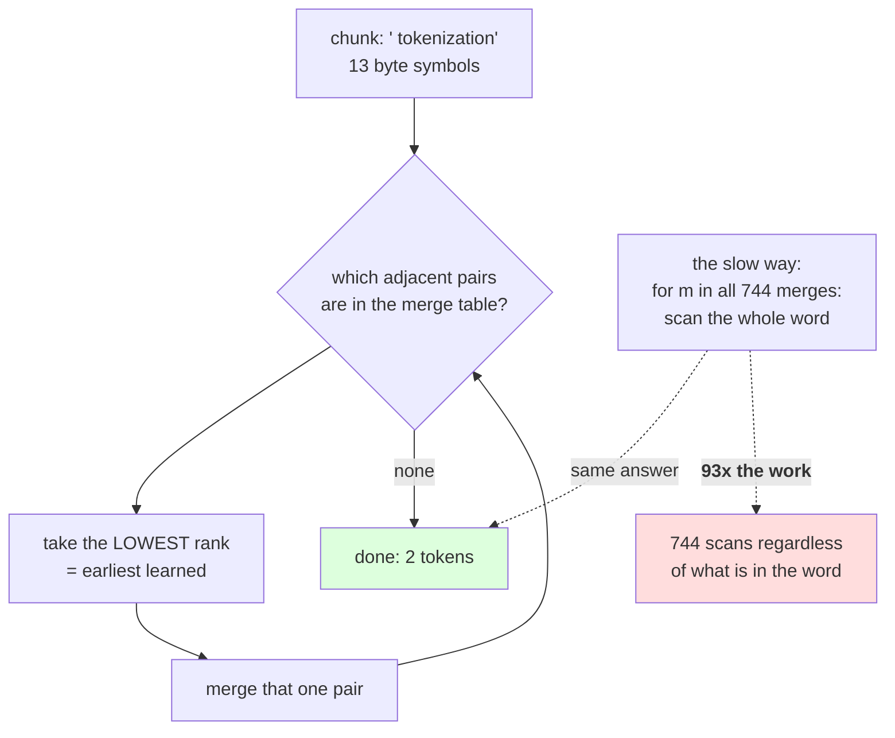

# 1.1 — Encoding applies merges by rank

## One-line answer

Encoding a word means repeatedly finding the **lowest-numbered merge that applies** and doing it, which
gives the identical result to walking all 744 merges in order and is **93× faster** — because most merges
do not apply to most words and the rank lookup skips them.

---

## The story

You have a printed list of two hundred discount codes, numbered in the order the shop introduced them,
and the rule is that the oldest applicable code wins.

The slow way is to read down the whole list, checking each code against your basket. Two hundred checks,
every time, and for almost all of them the answer is no.

The quick way is to look at what is actually in your basket — rice, oil, soap — and ask only "which
codes mention any of these?" Then take the lowest-numbered one of those. You have looked at three items
instead of two hundred codes, and you get the same discount.

The rule did not change. What changed is which direction you searched from.

---

## The idea in plain language

Day 12 part [2.1](../../../day-012-bpe-the-merge-loop/parts/02-training-a-vocabulary/2.1-the-merge-table-is-the-artifact.md)
established that the merge list is an **ordered** artifact and that applying it in a different order gives
different tokens. It also, quietly, used a slow encoder: for each chunk, walk every merge in order and
apply it. That is correct and it is not what anybody runs.

The insight is that the merge list is really a **ranking**. Merge 0 was learned first, merge 743 last, and
"apply the merges in order" means "at every step, do the earliest-learned merge that is currently
possible". So instead of iterating over merges and asking which apply, you iterate over the **pairs
actually present in this word** and ask which has the lowest rank.

The algorithm, in words:

1. Turn the chunk into its starting symbols.
2. Look at every adjacent pair currently in the word. Find the one with the **lowest rank** in the merge
   table.
3. If no pair is in the table, stop — this word is fully encoded.
4. Otherwise merge that one pair and go back to step 2.

Two properties fall out, and both are measured below.

**It gives the same answer.** Rank-first and merge-first are the same algorithm read from two directions,
so the token lists are identical. That is not obvious and it is worth checking rather than trusting,
which is what the measurement does.

**It is dramatically cheaper.** Measured below: 2,000 chunks with 744 merges takes 0.014 seconds by rank
and 1.280 seconds by walking the list — **93× slower**. The reason is that a typical chunk is a short
word with a handful of pairs, while the merge list has 744 entries of which perhaps three ever apply.
Walking the list does 744 scans of the word; the rank version does one scan per merge actually performed.

One term, because it is the thing being built: **ranks** is a `dict` from pair to its position in the
merge list, `{merge: i for i, merge in enumerate(merges)}`. It is derived from the artifact rather than
stored in it — Day 12 part 2.1's file has the ordered list, and the rank table is what you build from it
at load time.

And one thing this part does **not** change: the ordering still matters, for exactly the reason Day 12
gave. Shuffle the merge list and the ranks change, so the encoder makes different choices. The rank table
is a faster way to honour the order, not a way to escape it.

---

## Why Akshara needs it

- **Part [1.3](1.3-from-tokens-to-ids.md)** turns tokens into ids and needs an encoder that runs at
  corpus scale rather than a demonstration.
- **Day 51 onward**, the pretraining corpus is tokenized once before training. At Day 12's encoder speed
  that step would dominate; at this one it is a small fraction of the job.
- **Day 100 onward**, the serving path encodes every request. A 93× difference is the difference between
  a tokenizer that is invisible in a latency profile and one that is not.
- **Day 14** compares against a production implementation. This is the algorithm they use — the remaining
  difference is the language it is written in, which is worth knowing before you are impressed.

---

## The mechanism

The encoder:

```python
def encode_chunk(chunk: str, ranks: dict[tuple[str, str], int]) -> list[str]:
    """Apply merges lowest-rank-first until no pair in the word is in the table."""
    symbols = list(to_symbols(chunk))
    while len(symbols) >= 2:
        best, best_rank = None, None
        for i in range(len(symbols) - 1):
            r = ranks.get((symbols[i], symbols[i + 1]))
            if r is not None and (best_rank is None or r < best_rank):
                best, best_rank = i, r
        if best is None:
            break
        symbols[best:best + 2] = [symbols[best] + symbols[best + 1]]
    return symbols
```

**Line by line:**
- `ranks.get(...)` returns `None` for a pair that was never merged, which is most pairs. The `is not
  None` test rather than a truthiness test matters: **rank `0` is a real rank** — it is the first merge
  ever learned — and `if r:` would skip it forever.
- `best_rank is None or r < best_rank` keeps the **minimum**, which is the earliest-learned merge. Taking
  the maximum, or the first found, gives a different tokenizer that is still lossless — Day 12 part 2.1's
  shuffle measured what that costs.
- `symbols[best:best + 2] = [symbols[best] + symbols[best + 1]]` replaces two list entries with one, in
  place. Slice assignment with a shorter list shrinks the list, which is why the loop's `len(symbols)`
  re-evaluates each time.
- `while len(symbols) >= 2` stops on a single-symbol word, which has no pairs. Without it the inner
  `range(len(symbols) - 1)` would be empty, `best` would stay `None`, and the `break` would catch it —
  so the guard is about clarity rather than correctness.
- The loop merges **one pair per iteration**, not all occurrences of that pair. That differs from Day 12's
  `merge_word`, which merged every occurrence at once, and the two still agree because the next iteration
  finds the same pair again at the same rank.
- `to_symbols` is part [3.2](../03-byte-level-bpe/3.2-the-byte-to-unicode-trick.md)'s byte mapping. For
  this part it is enough to know it turns text into one symbol per UTF-8 byte.

Now check that it agrees with the slow version:

```python
import json
from pathlib import Path

merges = [tuple(m) for m in json.loads(Path("tokenizer.json").read_text())["merges"]]
ranks = {m: i for i, m in enumerate(merges)}

probe = " tokenization"
by_rank = encode_chunk(probe, ranks)

seq = to_symbols(probe)
for m in merges:
    seq = merge_word(seq, m)

print("  probe:", ascii(probe))
print("    by rank           :", [ascii(t) for t in by_rank], len(by_rank))
print("    apply all in order:", [ascii(t) for t in seq], len(seq))
print("    same?", by_rank == list(seq))
```

**Line by line:**
- `merge_word` is Day 12 part 1.1's function, unchanged, and the loop over `merges` is Day 12's encoder.
  Keeping both in the same script is the whole point: **a rewrite is only trustworthy against the version
  it replaces.**
- The probe is a single chunk with a leading space, because that is what the pre-tokenizer produces and
  encoding a bare word would exercise a case that never occurs in practice.
- Measured on Intel Core i3-1115G4 (2 cores / 4 threads), 11.7 GB RAM, Windows 11, CPython 3.12.12, on
  2026-08-27, against a `V = 1000` byte-level tokenizer trained on `docs/00_MASTER_PLAN.md`
  (`sha256[:16] = 9760f2b6d4340b97`):

```text
  probe: ' tokenization'
    by rank           : ["'\u0120token'", "'ization'"] 2
    apply all in order: ["'\u0120token'", "'ization'"] 2
    same? True
```

**Thirteen characters, two tokens, and the two encoders agree.** The `\u0120` is the byte-mapped space
from part [3.2](../03-byte-level-bpe/3.2-the-byte-to-unicode-trick.md); read it as ` token` followed by
`ization`.

Now the reason to prefer one:

```python
import time

chunks = pretokenize(text)[:2000]

t0 = time.perf_counter()
a = [encode_chunk(c, ranks) for c in chunks]
t_rank = time.perf_counter() - t0

def encode_sequential(chunk, merges):
    s = to_symbols(chunk)
    for m in merges:
        s = merge_word(s, m)
    return list(s)

t0 = time.perf_counter()
b = [encode_sequential(c, merges) for c in chunks]
t_seq = time.perf_counter() - t0

print(f"  2,000 chunks, {len(merges)} merges")
print(f"    by rank      : {t_rank:.3f}s")
print(f"    apply all    : {t_seq:.3f}s   ({t_seq / t_rank:.0f}x slower)")
print(f"    identical    : {a == b}")
```

**Line by line:**
- Both timings are on **the same 2,000 chunks**, in the same process, so the comparison is between the
  algorithms rather than between runs.
- `a == b` is printed alongside the timings, because a speed comparison between two functions that
  disagree is meaningless. **Correctness first, then cost** — and printing both together makes it hard to
  quote one without the other.
- `time.perf_counter` for the reason Day 12 part 2.2 gave.
- Measured on this machine, 2026-08-27:

```text
  2,000 chunks, 744 merges
    by rank      : 0.014s
    apply all    : 1.280s   (93x slower)
    identical    : True
```

**Ninety-three times, and identical output.** The whole difference is that walking the merge list does
744 scans of every word regardless of content, while the rank version does one scan per merge it actually
performs — which for a short word is two or three.

That ratio grows with the vocabulary. At 744 merges it is 93×; at a realistic 32,000 merges the sequential
version does 43× more work again while the rank version does almost the same amount, because the number
of merges *applied* to a short word barely changes.



---

## When it breaks

**The loud failure — a truthiness test on the rank.** This is the classic bug in this function and it is
one character:

```console
>>> ranks = {("t", "h"): 0, ("h", "e"): 1}
>>> r = ranks.get(("t", "h"))
>>> r
0
>>> if r:                     # the bug
...     print("merge it")
... else:
...     print("skip it")
...
skip it
```

What it means: rank `0` is falsy, so `if r:` skips **the first merge ever learned** — which is the most
frequent pair in the corpus and applies almost everywhere. The tokenizer still works, still round-trips,
and compresses noticeably worse. The fix is `if r is not None:`, and the reason it is easy to get wrong is
that the code reads naturally either way.

**The second loud failure — a `ranks` table built from a set.** Day 12 part 2.1 warned about this; here is
where it bites:

```console
>>> ranks = {m: i for i, m in enumerate(set(merges))}
>>> [ascii(t) for t in encode_chunk(" tokenization", ranks)]
["'\u0120t'", "'ok'", "'en'", "'ization'"]
```

What it means: `set` destroyed the order, so `enumerate` assigned ranks by iteration order rather than
by learning order. Four tokens instead of two. **No exception, valid output, twice as many tokens** —
the same failure Day 12 measured, now arriving through the rank table rather than through the merge
list. The exact split you get is not worth memorising: set iteration order is not part of the
language's contract, so a different run may split it differently. That it is worse is the reproducible
part.

**The silent failure — taking the first applicable merge rather than the lowest-ranked.** It is a natural
simplification and it produces a working, lossless, worse tokenizer:

```text
  correct : scan all pairs, take the minimum rank, merge, repeat
  tempting: scan left to right, merge the first pair that is in the table, repeat
  on ' tokenization': correct gives 2 tokens; left-to-right gives more
  both round-trip, both are valid, and the difference does not appear in any check
  that does not compare against a reference implementation.
```

**The check that catches all three** is to keep the slow encoder as a test oracle:

```python
def assert_encoders_agree(chunks: list[str], merges: list[tuple[str, str]]) -> None:
    """The fast encoder must agree with the obvious one on every chunk."""
    ranks = {m: i for i, m in enumerate(merges)}
    for chunk in chunks:
        fast = encode_chunk(chunk, ranks)
        slow = list(_encode_sequential(chunk, merges))
        assert fast == slow, (
            f"encoders disagree on {ascii(chunk)}: "
            f"fast={[ascii(t) for t in fast]} slow={[ascii(t) for t in slow]}"
        )


def _encode_sequential(chunk: str, merges: list[tuple[str, str]]) -> tuple[str, ...]:
    """Day 12's encoder, kept only as an oracle. Never used in the hot path."""
    s = to_symbols(chunk)
    for m in merges:
        s = merge_word(s, m)
    return s
```

**Line by line:**
- The slow encoder is kept in the codebase **as a test oracle**, with a leading underscore and a docstring
  saying so. Deleting it after the rewrite is the tempting move and it removes the only independent check
  the fast version has.
- The assertion compares on **every chunk given**, so pointing it at a sample of the real corpus exercises
  far more cases than a hand-written probe list. The chunks are cheap to produce — they are what the
  pre-tokenizer already emits.
- The message prints both tokenizations rather than saying `False`, because the *shape* of the
  disagreement identifies the bug: one extra token at the start says the rank-`0` truthiness bug; a
  completely different split says the order was lost.
- What this cannot catch is both encoders being wrong in the same way — if `merges` itself is shuffled,
  they agree and are both bad. Day 12 part 2.1's artifact round trip is the check for that, and the two
  are complementary rather than redundant.

---

## In production

**What a research engineer writes instead of the teaching version.** This algorithm, in a compiled
language, with the rank table as a hash map and the symbol list as an arena rather than a Python list.
Day 14 measures one. The structure does not change, which is the point: when you read a production
tokenizer's encode function you will recognise this loop, and the parts you do not recognise will be
allocation strategy rather than algorithm.

The second habit is **building the rank table once at load time**, not per call. It is derived from the
artifact and it is immutable; rebuilding it inside `encode` turns an `O(1)` lookup into an `O(merges)`
construction on every request and is a genuinely common performance bug.

**What degrades at scale.** The inner scan, mildly. `encode_chunk` scans all pairs in the word on every
iteration, so a chunk of length `n` needing `k` merges costs about `n × k`. For words that is nothing. For
a pathological chunk — a long URL, a base64 blob, a line of minified code with no spaces — `n` is in the
thousands and the cost is quadratic in it. Real implementations keep a priority queue of candidate merges
instead of rescanning, which turns it into `n log n`; part
[2.2](../02-the-regex-pre-tokenizer/2.2-the-gpt-pattern-symbol-by-symbol.md) shows the other half of the
defence, which is a pre-tokenizer that does not emit such chunks in the first place.

**The failure that only shows with real data.** Chunks the training corpus never contained. The encoder
handles them correctly — that is the whole promise of BPE — but it does more merging work per character,
because none of the high-rank merges apply and it falls through to short pieces. Encoding speed is
therefore *data-dependent*, and a latency benchmark on in-domain text is optimistic for a service that
sees anything else.

**The review comment.** *"`if r:` on the rank — rank zero is the most frequent merge in the whole
tokenizer and this skips it. It needs `is not None`, and the fast encoder needs a test against the
sequential one so this class of thing cannot ship."*

**The interview question.** *"How does a BPE tokenizer encode a word at inference time?"* The weak answer
is "it applies the merges". The strong answer inverts the loop: **you do not iterate over the merges, you
iterate over the pairs present in the word and take the one with the lowest rank, repeatedly — the merge
list is a ranking, and rank order is learning order.** Then the reason: *walking the merge list gives the
same answer and does a scan per merge whether or not it applies — I measured 93× slower at 744 merges,
and the gap widens with vocabulary size because the number of merges actually applied to a short word
barely changes.*

**Compute tier: T0.** The standard library on a laptop. The timings are wall-clock on the hardware named
above and are the hardware-dependent numbers in this part; the token lists and the agreement check are
not. No packages, no network, no GPU, no seed. The tokenizer used is trained in part
[3.1](../03-byte-level-bpe/3.1-the-alphabet-becomes-256.md) and every figure reproduces for anyone whose
corpus hash matches `9760f2b6d4340b97`. What T0 cannot show is how this compares with a compiled
implementation — that is Day 14, and the useful thing to carry there is that the *algorithm* is the same.

---

## Check yourself

Run this. It prints **two encoders agreeing and one of them 90-odd times faster**:

```python
import json
import time
from pathlib import Path

merges = [tuple(m) for m in json.loads(Path("tokenizer.json").read_text())["merges"]]
ranks = {m: i for i, m in enumerate(merges)}
text = Path("docs/00_MASTER_PLAN.md").read_text(encoding="utf-8")
chunks = pretokenize(text)[:2000]

t0 = time.perf_counter()
fast = [encode_chunk(c, ranks) for c in chunks]
t_fast = time.perf_counter() - t0

t0 = time.perf_counter()
slow = [list(_encode_sequential(c, merges)) for c in chunks]
t_slow = time.perf_counter() - t0

print(f"  merges       : {len(merges)}")
print(f"  by rank      : {t_fast:.3f}s")
print(f"  apply all    : {t_slow:.3f}s  ({t_slow / t_fast:.0f}x)")
print(f"  identical    : {fast == slow}")

broken = {m: i for i, m in enumerate(set(merges))}
print("  with a shuffled rank table:",
      [ascii(t) for t in encode_chunk(" tokenization", broken)])
print("  with the real one         :",
      [ascii(t) for t in encode_chunk(" tokenization", ranks)])
```

**Line by line:**
- `identical: True` next to a large speed ratio. **Say out loud why you would keep the slow one in the
  repository anyway.**
- The last two lines encode the same chunk with a shuffled and a correct rank table. Say how many tokens
  each produced, and say which of your checks would have noticed the difference.
- Now change `if r is not None` to `if r` in `encode_chunk` and re-run. Say what happens to the token
  count, and say why the bug is invisible on a word whose merges all have high ranks.
- Time it again with `ranks` rebuilt **inside** `encode_chunk`. Say what the ratio becomes and what that
  tells you about where to put derived tables.

**Say this out loud, without scrolling up:** state the encoding rule in one sentence without using the
word "loop", say why rank `0` is the dangerous one, and say what the rank table is derived from and why it
is not stored in the tokenizer file.
