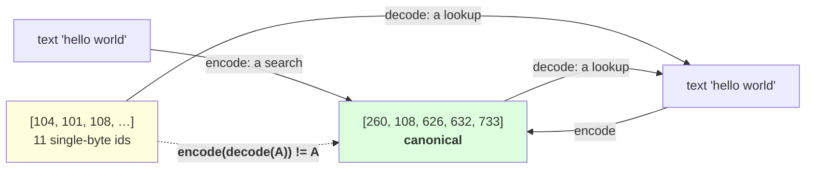

# 1.2 — Decode is a lookup, not a search

## One-line answer

`decode(encode(s)) == s` always holds and `encode(decode(y)) == y` does **not**: measured here, the ids
`[104, 101, 108, 108, 111, …]` and `[260, 108, 626, 632, 733]` both decode to `hello world`, so decode is
a many-to-one table lookup while encode is a search for one particular answer.

---

## The story

You give somebody your address to write down, and they write it down.

Read their note back and you get your address — that direction always works. Every time, exactly.

Now go the other way. Take your address and ask two different people to write it down. One puts the flat
number on its own line, one runs it into the street. One writes "Rd", one writes "Road". Both notes are
correct, both read back to the same address, and the two notes are not the same note.

Reading is one answer. Writing is a choice, and there are several right ones.

---

## The idea in plain language

Day 9 part
[2.1](../../../day-009-the-vocabulary-problem/parts/02-what-a-tokenizer-is/2.1-a-function-and-its-inverse.md)
called a tokenizer "a function and its inverse". That is the right first idea and it is not quite true,
and this part is about the gap — because the gap is where a specific family of bugs lives.

**Decoding is trivial.** Look each id up in the vocabulary, concatenate the tokens, and turn the result
back into text. There is no search, no ranking, no order-dependence: three lines and no decisions. It is
the same operation for every BPE tokenizer ever built.

**Encoding is a search.** Part [1.1](1.1-encoding-applies-merges-by-rank.md) showed it: repeatedly find
the lowest-ranked applicable merge. Out of many possible ways to cut a word into vocabulary entries, it
picks **one** — the one the merge order dictates.

So the two directions have different shapes, and the consequence is an asymmetry in the round trip:

- `decode(encode(s)) == s` — **always**, for every string. This is the contract, and part
  [3.3](../03-byte-level-bpe/3.3-zero-out-of-vocabulary.md) shows byte-level makes it hold for every
  input in every script.
- `encode(decode(ids)) == ids` — **not in general.** Measured below, `hello world` has at least two id
  sequences that decode to it: the five ids encode produces, and eleven single-character ids that decode
  identically. Decode maps both to the same text; encode maps that text back to only one of them.

The word for the one encode produces is **canonical**. A tokenizer defines a canonical tokenization for
every string, and there are many non-canonical ones that decode to the same thing.

That sounds like pedantry until you notice where non-canonical id sequences come from, which is
everywhere:

- **A model generates them.** Sampling picks ids one at a time from a distribution. Nothing constrains
  the model to emit the canonical sequence, and a well-trained one usually does because that is what it
  saw — but "usually" is not "always", and the further from its training distribution you push it the
  less it holds.
- **A prompt is assembled from pieces.** Encode the system text, encode the user text, concatenate the id
  lists. The join between them is not where encode would have put a boundary, so the whole is
  non-canonical even though both halves were canonical. Day 16's chat templates are exactly this.
- **Ids are edited.** Truncating a sequence, dropping a token, splicing in a special token — each leaves
  something encode would not have produced.

And the reason it matters: **the model was trained on canonical sequences.** Feed it a non-canonical one
and every id is in range, the shapes are right, decode gives sensible text, and the model is seeing a
token pattern that essentially never occurred in training. Day 17's token-healing material is the
industrial version of this problem; today's job is to know that the asymmetry exists and where it comes
from.

---

## Why Akshara needs it

- **Part [1.4](1.4-the-token-that-was-half-a-character.md)** is what happens when a *prefix* of an id
  sequence is decoded, which is the streaming case and a different failure again.
- **Day 16** builds chat templates by concatenating encoded pieces. Every join it makes is a potential
  non-canonical boundary, and this part is the reason that is worth checking.
- **Day 17** measures token healing and the trailing-space bug, both of which are this asymmetry with
  real consequences attached.
- **Day 69 onward**, generation emits ids one at a time and something has to turn them into text. Knowing
  that decode is a pure lookup is what makes incremental decoding tractable.

---

## The mechanism

Decode, in full:

```python
def decode_ids(ids: list[int], vocab: list[str]) -> str:
    """Look up, concatenate, and turn byte symbols back into text. No search, no order-dependence."""
    return from_symbols([vocab[i] for i in ids])
```

**Line by line:**
- `vocab[i]` is a list index, not a dictionary lookup, because the ids are `0..V-1` with no gaps — the
  same choice Day 11 part
  [1.1](../../../day-011-character-and-word-tokenizers/parts/01-character-level/1.1-from-a-script-to-a-module.md)
  made for `itos`. An out-of-range id raises `IndexError` here, which is the correct loud failure for a
  model that has been given the wrong vocabulary size.
- There is **no reference to `merges` or `ranks`.** Decoding does not need them at all — which is worth
  pausing on, because it means a decoder is portable in a way an encoder is not, and it is why a
  vocabulary file alone is enough to read a model's output.
- `from_symbols` is part [3.2](../03-byte-level-bpe/3.2-the-byte-to-unicode-trick.md)'s inverse byte
  mapping. It is the only step that can fail, and part
  [1.4](1.4-the-token-that-was-half-a-character.md) is when.
- The whole function is one expression. **Compare it with part 1.1's encoder**, which is a nested loop
  with a minimum-search: that difference in size is the asymmetry, visible.

Now the round trip, in both directions:

```python
s = "hello world"
ids = encode_ids(s, merges, vocab)
print("  encode(%r) -> %s" % (s, ids))
print("  tokens     ->", [ascii(vocab[i]) for i in ids])
print("  decode     ->", ascii(decode_ids(ids, vocab)))
print("  decode(encode(s)) == s :", decode_ids(ids, vocab) == s)
```

**Line by line:**
- Printing the **tokens** as well as the ids is the habit worth forming. Ids are opaque; tokens tell you
  what the model actually saw, and the difference between `'he'` and `'h'` is invisible in `[260, 108]`.
- `ascii()` on the tokens, per Day 12 part 2.3, because a leading space is the distinction that matters
  most and is invisible otherwise.
- Measured on Intel Core i3-1115G4 (2 cores / 4 threads), 11.7 GB RAM, Windows 11, CPython 3.12.12, on
  2026-08-27, with a `V = 1000` byte-level tokenizer trained on `docs/00_MASTER_PLAN.md`
  (`sha256[:16] = 9760f2b6d4340b97`):

```text
  encode('hello world') -> [260, 108, 626, 632, 733]
  tokens     -> ["'he'", "'l'", "'lo'", "'\u0120wor'", "'ld'"]
  decode     -> 'hello world'
  decode(encode(s)) == s : True
```

**Five tokens: `he`, `l`, `lo`, ` wor`, `ld`.** Note that `hello` is *not* split into obvious pieces —
`he` then `l` then `lo` — because the merge ranks say so and nothing else does. There is no rule that a
token boundary lands anywhere meaningful.

Now the other direction:

```python
alt = ([stoi[c] for c in "hello"]
       + [stoi[BYTE_ENCODER[0x20]]]
       + [stoi[c] for c in "world"])

print("  alt ids            :", alt)
print("  alt tokens         :", [ascii(vocab[i]) for i in alt])
print("  decode(alt)        :", ascii(decode_ids(alt, vocab)))
print("  encode(decode(alt)):", encode_ids(decode_ids(alt, vocab), merges, vocab))
print("  encode(decode(y)) == y :", encode_ids(decode_ids(alt, vocab), merges, vocab) == alt)
print("  both decode to the same text:", decode_ids(alt, vocab) == decode_ids(ids, vocab))
```

**Line by line:**
- `alt` is built from **single-character tokens only**, which are guaranteed to exist because the byte
  alphabet is the bottom 256 entries of the vocabulary. That is what makes this a legitimate id sequence
  rather than a made-up one: every id is real and in range.
- `stoi[BYTE_ENCODER[0x20]]` is the id of the space, byte `0x20`, through the byte mapping. It is written
  the long way rather than as a literal id because the literal would be a magic number that breaks if the
  vocabulary changes.
- The last line is the check that makes the point: both id sequences decode to **the same string**, so
  decode cannot be injective.
- Measured on this machine, 2026-08-27:

```text
  alt ids            : [104, 101, 108, 108, 111, 32, 119, 111, 114, 108, 100]
  alt tokens         : ["'h'", "'e'", "'l'", "'l'", "'o'", "'\u0120'", "'w'", "'o'", "'r'", "'l'", "'d'"]
  decode(alt)        : 'hello world'
  encode(decode(alt)): [260, 108, 626, 632, 733]
  encode(decode(y)) == y : False
  both decode to the same text: True
```

**Eleven ids and five ids, both decoding to `hello world`.** The eleven-id version is not corrupt, not
invalid and not an error — it is a perfectly good encoding of the string that `encode` would never
produce.

Both directions of the round trip, side by side:

| | starts from | result | holds? |
| --- | --- | --- | --- |
| `decode(encode(s))` | any string | the same string | **always** |
| `encode(decode(y))` | any id sequence | the *canonical* ids for that text | only if `y` was already canonical |

**The second row is the one to remember.** `encode ∘ decode` is not the identity — it is a
*canonicalisation*: it maps any id sequence to the one encode would have produced for the same text. That
is a useful operation and it is worth knowing you are performing it, because it silently rewrites the
input.



---

## When it breaks

**The loud failure — an id outside the vocabulary:**

```console
>>> decode_ids([260, 9999], vocab)
Traceback (most recent call last):
  File "<stdin>", line 1, in <module>
  File "<stdin>", line 3, in decode_ids
  File "<stdin>", line 3, in <listcomp>
IndexError: list index out of range
```

What it means: something produced an id `≥ V`. Almost always that is a model whose output layer was sized
from a different vocabulary — Day 12 part
[1.3](../../../day-012-bpe-the-merge-loop/parts/01-the-merge-loop/1.3-the-loop-and-where-it-stops.md)'s
early-stop failure arriving downstream. **This is the good outcome**: the list index makes it impossible
to silently decode a wrong token, which a `dict.get(i, "")` would not.

**The silent failure — assuming the round trip works both ways.** It is a natural assumption and it
produces a specific, hard-to-find class of bug:

```text
  a prompt assembled from two encoded pieces:
    encode("You are helpful.")  -> canonical for that string
    encode(" Answer briefly.")  -> canonical for that string
    ids = piece_a + piece_b     -> NOT canonical for the concatenation
  what the checks say : every id in range, length correct, decode gives the right text
  what the model sees : a token pattern at the join that essentially never occurred in training
  what encode would have produced for the joined text: something different at the boundary
  exception raised    : none
```

**The check that catches it** is to canonicalise and compare, and to be explicit that it is a check
rather than a repair:

```python
def is_canonical(ids: list[int], merges, vocab) -> bool:
    """Would encode have produced exactly these ids for the text they decode to?"""
    return encode_ids(decode_ids(ids, vocab), merges, vocab) == ids


def assert_canonical(ids: list[int], merges, vocab, where: str) -> None:
    """Use at every point ids are assembled from pieces or edited."""
    canonical = encode_ids(decode_ids(ids, vocab), merges, vocab)
    if canonical == ids:
        return
    first = next(i for i, (a, b) in enumerate(zip(ids, canonical)) if a != b)
    raise AssertionError(
        f"{where}: ids are not canonical; first difference at position {first} "
        f"(got {ascii(vocab[ids[first]])}, encode gives {ascii(vocab[canonical[first]])}); "
        f"{len(ids)} ids vs {len(canonical)}"
    )
```

**Line by line:**
- `is_canonical` is the cheap boolean for logging and metrics; `assert_canonical` is the loud version for
  a place where non-canonical input is a bug. Having both means the check can be used where it should
  fail and where it should only be counted.
- `where` is a mandatory string naming the call site. A canonicality failure says nothing useful without
  it: the interesting information is *which* join produced it.
- `next(i for i, (a, b) in enumerate(zip(...)) if a != b)` finds the **first divergence**, which is almost
  always the boundary between two concatenated pieces — so the position is a direct pointer at the bug.
- The message prints both **tokens**, not just ids, because `'he'` versus `'h'` is a readable
  explanation and `260` versus `104` is not.
- What this deliberately does **not** do is fix the ids. Re-encoding would change the input, which is
  exactly what you do not want to do silently to a prompt somebody constructed — Day 17's token healing
  is the considered version of that repair, and it belongs where a person decided it should happen.

---

## In production

**What a research engineer writes instead of the teaching version.** They rely on the decode side being
trivial and treat it as such: a decoder needs only the vocabulary, so it can live in a client, a log
viewer or a debugging tool without the merge table. What they are careful about is the encode side —
prompts assembled from pieces, templates, and anything that edits ids — and the discipline is that **ids
are produced by one encode call over the final string wherever possible**, rather than by concatenating
separately encoded parts.

The second habit is logging the token count and the canonicality of assembled prompts in development. It
is one boolean, it costs an extra encode, and it turns "the model behaves oddly with this template" into a
one-line answer.

**What degrades at scale.** Nothing about decode — it is a lookup and stays one. What degrades is the
number of places ids get assembled: one template becomes ten, tool calls and retrieved documents get
spliced in, and each join is a boundary encode never saw. **The number of non-canonical boundaries grows
with the complexity of your prompt construction**, not with your data.

**The failure that only shows with real data.** Model-generated ids. A model trained on canonical
sequences mostly emits them, so in-distribution generation looks fine. Push it with an unusual prompt, a
high temperature or a constrained-decoding mask and it starts emitting sequences encode would not
produce — which decode handles perfectly, and which then look strange if they are re-encoded anywhere in
the loop.

**The review comment.** *"We encode the system prompt and the user turn separately and concatenate the id
lists. The join is not where `encode` would put a boundary, so the model sees a token pattern it was not
trained on. Either encode the assembled string once, or assert canonicality so we know when it happens."*

**The interview question.** *"Is a tokenizer's encode the inverse of its decode?"* The weak answer is yes.
The strong answer names the direction that fails and why: **`decode(encode(s)) == s` always holds, but
`encode(decode(y)) == y` only holds when `y` was already canonical — decode is a many-to-one table lookup
and encode is a search that picks one particular cut.** Then where it bites: *I can build two id sequences
that decode to the same string — five tokens and eleven — and non-canonical ones arise naturally from
concatenating separately encoded prompt pieces, from truncation, and from the model's own sampling.*

**Compute tier: T0.** The standard library on a laptop, with the `V = 1000` byte-level tokenizer trained
in part [3.1](../03-byte-level-bpe/3.1-the-alphabet-becomes-256.md). No packages, no network, no GPU, no
seed, no model. Every id and token here reproduces exactly for anyone whose corpus hash matches
`9760f2b6d4340b97` — **the specific ids depend on the trained tokenizer**, so a different corpus gives
different numbers and the same asymmetry. What T0 cannot show is how much a non-canonical prompt actually
degrades a model's output; that needs a trained model, it is Day 17, and this part establishes only that
the input is off-distribution, which is a property of the tokenizer.

---

## Check yourself

Run this. It prints **two id sequences of different lengths decoding to the same string**:

```python
import json
from pathlib import Path

merges = [tuple(m) for m in json.loads(Path("tokenizer.json").read_text())["merges"]]
vocab = [BYTE_ENCODER[b] for b in range(256)] + ["".join(m) for m in merges]
stoi = {t: i for i, t in enumerate(vocab)}

s = "hello world"
ids = encode_ids(s, merges, vocab)
alt = ([stoi[c] for c in "hello"] + [stoi[BYTE_ENCODER[0x20]]]
       + [stoi[c] for c in "world"])

print("  canonical    :", len(ids), "ids", [ascii(vocab[i]) for i in ids])
print("  alternative  :", len(alt), "ids", [ascii(vocab[i]) for i in alt[:5]], "...")
print("  same text?   :", decode_ids(ids, vocab) == decode_ids(alt, vocab))
print("  decode(encode(s)) == s     :", decode_ids(encode_ids(s, merges, vocab), vocab) == s)
print("  encode(decode(alt)) == alt :", encode_ids(decode_ids(alt, vocab), merges, vocab) == alt)

a = encode_ids("You are helpful.", merges, vocab)
b = encode_ids(" Answer briefly.", merges, vocab)
joined = a + b
print("  concatenated pieces canonical?",
      encode_ids(decode_ids(joined, vocab), merges, vocab) == joined)
```

**Line by line:**
- The first two lines print `5` and `11`. **Say out loud which one a model would have been trained on and
  why.**
- `decode(encode(s))` is `True` and `encode(decode(alt))` is `False`. Say in one sentence why the two
  directions differ, using the words "lookup" and "search".
- The last line concatenates two separately encoded pieces. Say what you predicted before running it, and
  if it printed `True`, say what would have to be different about the two strings for it to print `False`.
- Now truncate `ids` to its first three entries and canonicalise. Say whether you get the first three
  entries back, and say what that means for a pipeline that trims prompts to fit a context window.

**Say this out loud, without scrolling up:** say which of the two round trips always holds and which does
not, say what `encode(decode(y))` actually computes when it is not the identity, and name two ordinary
things in a serving path that produce non-canonical id sequences.
