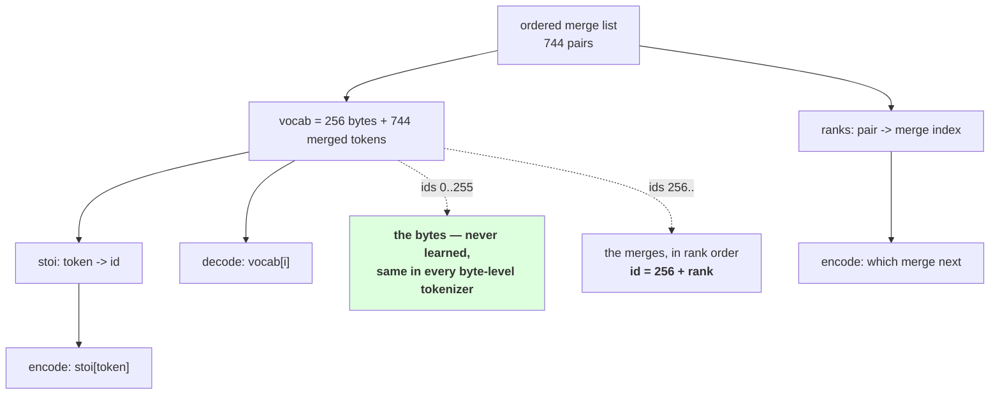

# 1.3 — From tokens to ids

## One-line answer

The vocabulary is the alphabet followed by the merged tokens **in learned order**, so an id is a position
in that list — which makes `V = 256 + len(merges)` exactly, makes the first 256 ids the bytes in every
byte-level tokenizer ever built, and makes id order a fact about training rather than about the text.

---

## The story

A library gives every book a number by putting it on the shelf and counting along.

The numbering is not clever. Book 1 is the first one on the first shelf; book 4,712 is the four thousand
seven hundred and twelfth along. Nobody chose 4,712 for that book — it fell out of where the book already
was.

That means two things at once. Finding book 4,712 is instant: walk to that position. And if somebody
inserts a new book in the middle, every number after it changes, and every note anybody wrote referring
to a number is now wrong.

The numbering costs nothing to use and cannot be changed without changing everything.

---

## The idea in plain language

Parts [1.1](1.1-encoding-applies-merges-by-rank.md) and
[1.2](1.2-decode-is-a-lookup-not-a-search.md) worked in **tokens** — strings like `'he'` and `'\u0120wor'`.
A model cannot consume strings. It consumes integers, and this part is the layer that converts.

The conversion is a list, and where the list comes from is the whole content of the part.

```
vocab = alphabet + ["".join(m) for m in merges]
```

The alphabet first, in a fixed order, then one entry per merge in the order the merges were learned. So:

- **Ids `0` to `255` are the bytes.** Part [3.2](../03-byte-level-bpe/3.2-the-byte-to-unicode-trick.md)
  fixes which byte is which id, and that mapping is the same for every byte-level tokenizer regardless of
  corpus, language or vocabulary size. A byte-level tokenizer's first 256 entries are not learned.
- **Ids `256` upward are the merges**, in rank order. Id `256` is the first merge ever made, which is the
  commonest pair in the corpus.
- **`V = 256 + len(merges)`**, exactly. Day 12 part
  [1.3](../../../day-012-bpe-the-merge-loop/parts/01-the-merge-loop/1.3-the-loop-and-where-it-stops.md)
  gave this relation with a corpus-derived alphabet; with bytes the first term is a constant and the
  arithmetic stops depending on the data.

Two consequences worth having straight.

**The id of a token is its rank plus 256.** That is not a coincidence, it is the same list read twice:
`ranks` maps a *pair* to its position among merges, and `stoi` maps the *resulting token* to its position
in the vocabulary. Part 1.1 built `ranks` for the encoder; `stoi` is built from the same list for this
step. Keeping them consistent is automatic if both are derived from `merges`, and is a bug waiting to
happen if either is stored separately.

**Inserting anything shifts everything after it.** Add one special token in the middle and every later id
changes, so the model's embedding rows now mean different tokens. Day 11 part
[1.4](../../../day-011-character-and-word-tokenizers/parts/01-character-level/1.4-the-unknown-character-policy.md)
made this argument for `<unk>` and it is why special tokens are reserved **at the ends** — either below
the alphabet or appended after the merges. Day 16 does that properly.

And the thing that makes all of this safe rather than fragile: **the id list is derived, never stored
separately.** The tokenizer file from Day 12 part
[2.1](../../../day-012-bpe-the-merge-loop/parts/02-training-a-vocabulary/2.1-the-merge-table-is-the-artifact.md)
holds the pattern, the alphabet and the ordered merges. Everything else — `stoi`, `ranks`, `V` — is
computed at load time from those three. A file that stored the ids as well would have two sources of
truth and no way to tell which was right.

---

## Why Akshara needs it

- **Day 18** builds the embedding matrix, whose row count is `V` and whose row `i` is the vector for
  token `i`. This part is where `i` comes from.
- **Day 16** adds special tokens and has to resize that matrix. The append-at-the-end discipline
  established here is what makes the resize additive rather than a renumbering.
- **Day 51 onward**, the corpus is tokenized to a flat array of ids once, before training. That array is
  meaningless without the exact vocabulary that produced it, which is Day 9 part 2.3's argument arriving
  as an array on disk.
- **Part [4.1](../04-together/4.1-four-tokenizers-one-table.md)** compares vocabularies of different
  sizes; `V` has to mean the same thing in every row for that table to be readable.

---

## The mechanism

The vocabulary, and both tables derived from it:

```python
def build_vocab(merges: list[tuple[str, str]]) -> list[str]:
    """The 256 byte symbols, then one entry per merge in learned order."""
    return [BYTE_ENCODER[b] for b in range(256)] + ["".join(m) for m in merges]


def build_tables(merges: list[tuple[str, str]]) -> tuple[list[str], dict[str, int], dict]:
    vocab = build_vocab(merges)
    stoi = {t: i for i, t in enumerate(vocab)}
    ranks = {m: i for i, m in enumerate(merges)}
    return vocab, stoi, ranks
```

**Line by line:**
- `range(256)`, not `sorted(set(text))`. **The alphabet no longer depends on the corpus**, which is the
  change part [3.1](../03-byte-level-bpe/3.1-the-alphabet-becomes-256.md) argues for and this part
  benefits from: `V` is now predictable before you have seen the data.
- `build_tables` returns all three from **one** call, so they cannot be built from different merge lists.
  Two separate constructor functions is how `stoi` and `ranks` end up describing different tokenizers
  after somebody retrains.
- `stoi` maps token to id; `ranks` maps pair to merge index. They are different keys for related things,
  and the relation is `stoi["".join(m)] == 256 + ranks[m]` — asserted below rather than assumed.
- Neither table is stored in the artifact. Both are derived at load, which takes microseconds and removes
  a whole class of drift.

Now encode and decode, at the id level:

```python
def encode_ids(text: str, merges, vocab, pattern: str = GPT_LIKE) -> list[int]:
    stoi = {t: i for i, t in enumerate(vocab)}
    return [stoi[t] for t in tokenize(text, merges, pattern)]


def decode_ids(ids: list[int], vocab: list[str]) -> str:
    return from_symbols([vocab[i] for i in ids])
```

**Line by line:**
- `encode_ids` builds `stoi` on every call, which is fine for a teaching version and is the performance
  bug part 1.1's production note warned about. In `akshara/` it belongs on the tokenizer object, built
  once.
- `stoi[t]` uses a bare subscript rather than `.get`, so a token not in the vocabulary raises `KeyError`.
  For a byte-level tokenizer that cannot happen — part
  [3.3](../03-byte-level-bpe/3.3-zero-out-of-vocabulary.md) is why — and keeping the loud version means
  a bug in `tokenize` surfaces here rather than becoming a wrong id.
- `decode_ids` is part 1.2's function unchanged, and it is worth noticing that it needs `vocab` and not
  `stoi`: the two directions use the two halves of the same table.

Check the relation and the sizes:

```python
import hashlib
import json
from pathlib import Path

merges = [tuple(m) for m in json.loads(Path("tokenizer.json").read_text())["merges"]]
vocab, stoi, ranks = build_tables(merges)

print("  merges          :", len(merges))
print("  V               :", len(vocab), "= 256 +", len(merges))
print("  ids 0..255 are the bytes:", all(vocab[b] == BYTE_ENCODER[b] for b in range(256)))
print("  id == 256 + rank:", all(stoi["".join(m)] == 256 + ranks[m] for m in merges))
print("  first merged id :", 256, ascii(vocab[256]))
print("  last merged id  :", len(vocab) - 1, ascii(vocab[-1]))
```

**Line by line:**
- `all(vocab[b] == BYTE_ENCODER[b] for b in range(256))` asserts the bottom of the vocabulary is
  untouched. It is a one-line check and it catches the most damaging possible edit: anything that shifts
  the byte block invalidates every trained model that used this tokenizer.
- `stoi["".join(m)] == 256 + ranks[m]` is the relation stated above, checked over **every** merge rather
  than spot-checked. It would fail if a merge produced a token that already existed — which cannot happen
  for BPE, and checking rather than arguing is cheaper than being wrong.
- Printing `vocab[256]` names the commonest pair in the corpus, which is a free sanity check on the
  training: if it is not something extremely common, something is wrong upstream.
- Measured on Intel Core i3-1115G4 (2 cores / 4 threads), 11.7 GB RAM, Windows 11, CPython 3.12.12, on
  2026-08-27, with the tokenizer trained in part
  [3.1](../03-byte-level-bpe/3.1-the-alphabet-becomes-256.md) on `docs/00_MASTER_PLAN.md`
  (`sha256[:16] = 9760f2b6d4340b97`):

```text
  merges          : 744
  V               : 1000 = 256 + 744
  ids 0..255 are the bytes: True
  id == 256 + rank: True
  first merged id : 256 '\u0120|'
  last merged id  : 999 '\u0120embedding'
```

**`V = 1000` exactly, and it was `256 + 744` before the corpus was read.** Compare with Day 12, where the
alphabet was 151 because that is what the corpus happened to contain and a different corpus would have
given a different `V` for the same target.

And id 256 is `' |'` — a space and a pipe, the Markdown table separator that Day 12 part
[2.3](../../../day-012-bpe-the-merge-loop/parts/02-training-a-vocabulary/2.3-reading-the-table.md) found
as merge 1. The same corpus, the same commonest pair, now with an id attached.

Ids in practice:

```python
s = "hello world"
ids = encode_ids(s, merges, vocab)
for i in ids:
    kind = "byte" if i < 256 else f"merge {i - 256}"
    print(f"    {i:>5}  {ascii(vocab[i]):<14} {kind}")
print("  decode:", ascii(decode_ids(ids, vocab)))
```

**Line by line:**
- The `kind` column is the point of the block: it makes visible that **an id below 256 is a raw byte and
  an id above it is something the tokenizer learned.** That distinction is invisible in a bare list of
  integers and it is the first thing you want when debugging a tokenization.
- Measured on this machine, 2026-08-27:

```text
      260  'he'           merge 4
      108  'l'            byte
      626  'lo'           merge 370
      632  '\u0120wor'    merge 376
      733  'ld'           merge 477
  decode: 'hello world'
```

One of those five ids is a raw byte and four are learned merges. **The single `l` at id 108 is the byte
alphabet doing its job**: no merge covered that position, so the tokenizer fell through to a byte, which
is always available. That is the property Day 11 could not get and Day 12 got only for characters the
corpus contained.



---

## When it breaks

**The loud failure — an id past the end of the vocabulary:**

```console
>>> decode_ids([260, 1000], vocab)
Traceback (most recent call last):
  File "<stdin>", line 1, in <module>
  File "<stdin>", line 2, in decode_ids
  File "<stdin>", line 2, in <listcomp>
IndexError: list index out of range
```

What it means: `V` is 1000, so the highest valid id is 999. Something produced 1000 — usually a model
whose output layer was sized from a config rather than from the tokenizer, which is Day 12 part 1.3's
failure surfacing here. The list index is what makes it loud; a `dict` with a `.get` default would have
decoded it as an empty string and moved on.

**The silent failure — two tables built from two merge lists.** Nothing raises and the tokenizer is
subtly wrong:

```text
  ranks built from : merges loaded at start-up
  stoi  built from : a vocab list saved separately at training time
  after a retrain, the two files disagree by three entries
  encode: picks merges using the OLD ranks
  then  : looks the resulting tokens up in the NEW stoi
  result: valid ids, in range, decoding to the right text for most inputs
  and for the tokens whose ids moved: a different id than the model was trained with
  exception: none
```

**The check that catches it** is to refuse to have two sources of truth:

```python
from dataclasses import dataclass


@dataclass(frozen=True)
class Tokenizer:
    """Everything derived from one merge list. There is no second source of truth."""

    pattern: str
    merges: tuple[tuple[str, str], ...]

    @property
    def vocab(self) -> list[str]:
        return [BYTE_ENCODER[b] for b in range(256)] + ["".join(m) for m in self.merges]

    @property
    def stoi(self) -> dict[str, int]:
        return {t: i for i, t in enumerate(self.vocab)}

    @property
    def ranks(self) -> dict[tuple[str, str], int]:
        return {m: i for i, m in enumerate(self.merges)}

    def __len__(self) -> int:
        return 256 + len(self.merges)

    def assert_consistent(self) -> None:
        vocab, stoi, ranks = self.vocab, self.stoi, self.ranks
        assert len(vocab) == len(self), f"V is {len(vocab)}, expected {len(self)}"
        assert all(vocab[b] == BYTE_ENCODER[b] for b in range(256)), "the byte block has moved"
        assert all(stoi["".join(m)] == 256 + ranks[m] for m in self.merges), \
            "id and rank disagree — vocab and merges are out of step"
        assert len(stoi) == len(vocab), "two vocabulary entries collide"
```

**Line by line:**
- `merges` is a `tuple` of tuples inside a frozen dataclass, so the artifact is **immutable**. Nothing
  downstream can append to it, and the derived properties therefore cannot go stale.
- `vocab`, `stoi` and `ranks` are all `@property` and all computed from `self.merges`. That is
  deliberately wasteful — each access rebuilds — and in `akshara/` they become `functools.cached_property`
  once the class is known to be immutable. **The teaching version makes the derivation visible; the
  production version makes it fast.**
- `__len__` returns `256 + len(merges)` without building the vocabulary, so `len(tok)` is `O(1)` and can
  be used to size an embedding matrix without allocating a thousand strings.
- `len(stoi) == len(vocab)` catches a genuine impossibility: two vocabulary entries with the same string.
  BPE cannot produce one, and a hand-edited merge list can, and the failure would otherwise be a silently
  unreachable id.
- What the class does **not** have is a `vocab_size` field. That is the one number everybody wants to
  store, and storing it creates exactly the disagreement `assert_consistent` exists to find.

---

## In production

**What a research engineer writes instead of the teaching version.** The same structure with the
properties cached, plus one thing this version does not have: a **reserved block for special tokens**,
decided before training and never renumbered. Conventionally that is either the very bottom of the id
range — below the bytes — or appended after the merges; either works, and what matters is that adding a
token later appends rather than shifts. Day 16 is where that is set up.

The second habit is that **`V` is read from the tokenizer, never from a config file.** Every model
dimension that depends on the vocabulary — the embedding rows, the output projection, the loss's class
count — comes from `len(tokenizer)`. A config that also states `vocab_size` is a second source of truth,
and Day 12 part 1.3 measured what happens when the trainer stops early and the two disagree.

**What degrades at scale.** Nothing about the mapping — it is a list index either way. What degrades is
the **cost of changing it**. At Day 11's scale, renumbering meant rebuilding a 1,286-byte file. Once a
model has been trained, the ids are baked into every weight in the embedding and output matrices, and
renumbering means retraining. **The id assignment is the most expensive decision in this day to reverse**,
which is why the reserved-block discipline is worth setting up before the first real run rather than
after.

**The failure that only shows with real data.** Vocabulary files that have been edited by hand. Adding a
domain-specific token by appending a line to a merge list looks harmless — it is one more entry at the
end, so no id shifts — and it is fine *provided the token was actually reachable by the merge process*.
An appended merge whose pair never occurs produces a vocabulary entry with an id no encoding ever emits,
so the model has an embedding row it can never use and an output logit it will never be trained to
suppress.

**The review comment.** *"`vocab_size` is in the training config and also derivable from the tokenizer.
Delete it from the config and read `len(tokenizer)` — otherwise the day the trainer stops early we size
the embedding from a number that is not true."*

**The interview question.** *"How does a token become an integer?"* The weak answer is "a dictionary". The
strong answer describes the construction and its consequence: **the vocabulary is the alphabet followed by
the merged tokens in learned order, so the id is a position in that list — for byte-level, ids 0 to 255
are the bytes and are the same in every such tokenizer, and a merged token's id is 256 plus its merge
rank.** Then the consequence: *which means inserting anything in the middle shifts every later id and
invalidates a trained model, so special tokens go at a reserved end and `V` is always read from the
tokenizer rather than from a config.*

**Compute tier: T0.** The standard library on a laptop, with the `V = 1000` byte-level tokenizer from part
3.1. No packages, no network, no GPU, no seed, no model. `V = 256 + 744` and the byte-block check hold for
any byte-level tokenizer; **the specific ids and the identity of id 256 depend on the corpus** and
reproduce for anyone whose corpus hash matches `9760f2b6d4340b97`. What T0 cannot show is the cost of a
renumbering, which is measured in retraining time and is Day 51's currency rather than this day's.

---

## Check yourself

Run this. It prints **a vocabulary size that was decided before the corpus was read**:

```python
import json
from pathlib import Path

merges = [tuple(m) for m in json.loads(Path("tokenizer.json").read_text())["merges"]]
vocab = [BYTE_ENCODER[b] for b in range(256)] + ["".join(m) for m in merges]
stoi = {t: i for i, t in enumerate(vocab)}
ranks = {m: i for i, m in enumerate(merges)}

print("  merges  :", len(merges))
print("  V       :", len(vocab), "= 256 +", len(merges))
print("  bytes intact :", all(vocab[b] == BYTE_ENCODER[b] for b in range(256)))
print("  id == 256+rank:", all(stoi["".join(m)] == 256 + ranks[m] for m in merges))
print("  id 256  :", ascii(vocab[256]))
print("  id 999  :", ascii(vocab[999]))

for i in encode_ids("hello world", merges, vocab):
    print(f"    {i:>5}  {ascii(vocab[i]):<14} {'byte' if i < 256 else f'merge {i - 256}'}")
```

**Line by line:**
- `V` prints `1000` and the arithmetic beside it. **Say out loud what Day 12's `V` would have been for the
  same target on a corpus in a different language, and why this one would not change.**
- `bytes intact` prints `True`. Say what would break if it printed `False`, and how far downstream you
  would find out.
- The per-id table shows one `byte` row among four `merge` rows. Say what the byte row means about that
  position in the word.
- Now append a made-up merge to the list, rebuild the tables, and re-encode. Say whether `V` changed,
  whether any existing id changed, and whether the new id can ever be produced.

**Say this out loud, without scrolling up:** state the exact relation between `V`, the alphabet and the
merges for a byte-level tokenizer, say what an id below 256 tells you, and say why nothing derived from
the merge list is ever stored in the tokenizer file.
