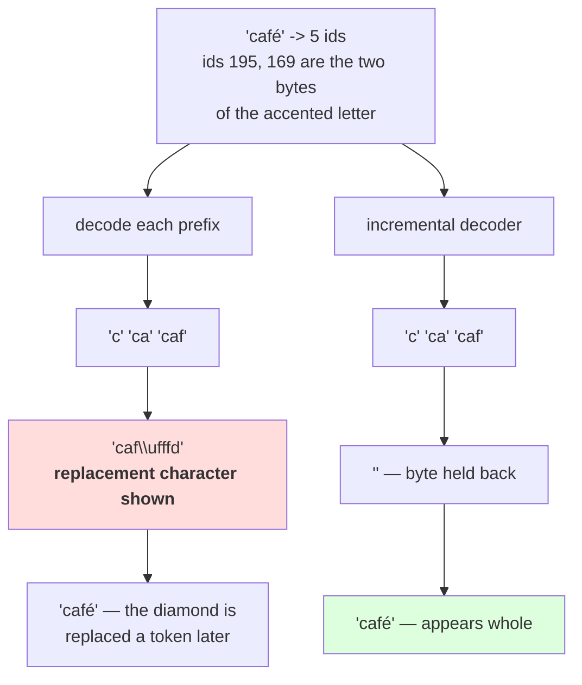

# 1.4 — 💥 The token that was half a character

## One-line answer

A byte-level token can be **half of a character**: `café` encodes to five ids, and decoding the first
four gives `caf�` — a replacement character — because the accented letter's two UTF-8 bytes landed
in tokens four and five, which is Day 10's chunk-boundary failure arriving inside a language model's
output stream.

---

## The story

Somebody is reading a phone number out to you and you are typing it into the phone as they go.

They say "nine", you type nine. "Eight", you type eight. It works right up until they say a digit you
half hear, and you type what you think you heard because the field wants a digit and you have one to
give.

The number is now wrong and looks completely normal — ten digits, correct format, no gap. Nothing on the
screen says one of them was a guess.

If you had waited for the whole number before typing any of it, you would have asked them to repeat the
one you missed.

---

## The idea in plain language

Part [1.3](1.3-from-tokens-to-ids.md) established that ids `0`–`255` are raw bytes. Part
[1.2](1.2-decode-is-a-lookup-not-a-search.md) established that decoding is a lookup and a join. Put those
together and a fact falls out that people find surprising: **a token is a sequence of bytes, and nothing
requires those bytes to be a whole character.**

For ASCII it never comes up — one character is one byte. For everything else it comes up constantly. Day
10 part [2.4](../../../day-010-unicode-code-points-bytes/parts/02-utf-8-and-bytes/2.4-256-is-a-vocabulary.md)
measured the widths: 2 bytes for an accented Latin letter, 3 for Devanagari, 4 for an emoji. BPE merges
bytes by frequency, and it has no idea where the character boundaries are — Day 10 part
[2.3](../../../day-010-unicode-code-points-bytes/parts/02-utf-8-and-bytes/2.3-self-synchronising.md)'s
self-synchronisation is a property of the *byte stream*, not something the merge algorithm consults.

So a merge can, and routinely does, produce a token that ends in the middle of a character. Measured
below, `café` encodes to `c`, `a`, `f`, and then the two bytes of the accented letter **as two separate
tokens** — because no merge joined them.

That is completely fine as long as you decode the whole sequence. `from_symbols` concatenates all the
bytes and then does one `decode("utf-8")`, and the character reassembles.

**It stops being fine the moment you decode a prefix.** And decoding a prefix is exactly what generation
does: a model emits one id at a time, and something has to turn the growing list into text for the user
to see. Decode after each id and you will, sooner or later, decode a byte sequence that ends mid-character
— and the decoder has to do something with the leftover byte.

Measured below, decoding the first four of five ids gives `caf�`, where `�` is
`U+FFFD REPLACEMENT CHARACTER`. Day 10 part 2.2 named it: **`ef bf bd` in a data file means somebody's
decode failed upstream and the original bytes are gone.** Here it means the character was not finished
yet — and if you print that to a user, they see a black diamond appear and then, one token later,
replaced by the letter it should have been.

Two things make this worse than Day 10's version of the same failure:

- **It is not an error.** `errors="replace"` is the sensible default for a decoder that must produce
  something, and it does. Day 10 part 2.5 measured `errors="ignore"` losing 95 characters silently; this
  is the same family, one step less destructive.
- **The boundary moves.** Which token ends mid-character depends on the merges, which depend on the
  corpus. A tokenizer that never splits an accented letter today will split one tomorrow after a retrain,
  so a streaming decoder that happens to work is not a streaming decoder that works.

The fix is the same as Day 10 part 2.5's: **do not decode prefixes independently.** Hold the undecodable
tail bytes and emit them when the next token completes them.

---

## Why Akshara needs it

- **Day 69 onward**, generation emits ids one at a time and the serving surface streams text back to the
  client. This failure is that path, exactly.
- **Day 100 onward**, the HTTP surface sends partial responses. Every chunk boundary is a potential
  half-character, and the fix belongs in the decoder rather than in the transport.
- **Part [3.3](../03-byte-level-bpe/3.3-zero-out-of-vocabulary.md)** claims byte-level tokenization can
  represent everything. It can — and this part is the bill for that: the atoms are bytes, so the atoms
  are smaller than characters.
- **Day 17** measures tokenization pathologies on non-English text. Every one of them has this shape:
  the tokenizer is correct and its units do not line up with a person's.

---

## The mechanism

Encode a four-character word with a byte-level tokenizer:

```python
import json
from pathlib import Path

merges = [tuple(m) for m in json.loads(Path("tokenizer.json").read_text())["merges"]]
vocab = [BYTE_ENCODER[b] for b in range(256)] + ["".join(m) for m in merges]
stoi = {t: i for i, t in enumerate(vocab)}

full = "caf\u00e9"
toks = tokenize(full, merges)
ids = [stoi[t] for t in toks]

print("  text  :", ascii(full), "-", len(full), "characters,", len(full.encode("utf-8")), "bytes")
print("  tokens:", [ascii(t) for t in toks])
print("  ids   :", ids)
```

**Line by line:**
- `"café"` is written as an escape, per Day 10 part
  [1.1](../../../day-010-unicode-code-points-bytes/parts/01-code-points-and-graphemes/1.1-a-character-is-three-different-things.md).
  Here it is doubly necessary: the whole part is about what happens to that one character's bytes, and a
  literal would leave the reader unsure which spelling was used.
- Printing the character count **and** the byte count next to each other is the setup for the entire
  failure: four characters, five bytes, and the tokens will follow the bytes.
- Measured on Intel Core i3-1115G4 (2 cores / 4 threads), 11.7 GB RAM, Windows 11, CPython 3.12.12, on
  2026-08-27, with the `V = 1000` byte-level tokenizer from part
  [3.1](../03-byte-level-bpe/3.1-the-alphabet-becomes-256.md) trained on `docs/00_MASTER_PLAN.md`
  (`sha256[:16] = 9760f2b6d4340b97`):

```text
  text  : 'caf\xe9' - 4 characters, 5 bytes
  tokens: ["'c'", "'a'", "'f'", "'\\xc3'", "'\\xa9'"]
  ids   : [99, 97, 102, 195, 169]
```

**Five tokens for four characters, and all five are raw bytes.** The last two — ids 195 and 169 — are the
two UTF-8 bytes of the accented letter, `c3` and `a9`, which Day 10 part
[2.2](../../../day-010-unicode-code-points-bytes/parts/02-utf-8-and-bytes/2.2-how-utf-8-encodes-a-code-point.md)
measured as its encoding. **No merge joined them**, because in this corpus that byte pair was not common
enough to earn a slot.

Now decode prefixes, which is what a streaming client does:

```python
for k in range(1, len(ids) + 1):
    piece = from_symbols([vocab[i] for i in ids[:k]])
    print(f"    first {k} id(s) -> {ascii(piece)}")
```

**Line by line:**
- `ids[:k]` is a **prefix**, which is the whole point: this is not a corrupted sequence, it is a correct
  sequence seen partway through. Every prefix of a valid tokenization arises during generation.
- `from_symbols` is part [3.2](../03-byte-level-bpe/3.2-the-byte-to-unicode-trick.md)'s inverse mapping,
  and it decodes with `errors="replace"` — which is what produces the visible symptom rather than an
  exception.
- `ascii()` on the result, because the replacement character is easy to miss when printed raw and
  impossible to miss as `�`.
- Measured on this machine, 2026-08-27:

```text
    first 1 id(s) -> 'c'
    first 2 id(s) -> 'ca'
    first 3 id(s) -> 'caf'
    first 4 id(s) -> 'caf\ufffd'
    first 5 id(s) -> 'caf\xe9'
```

**Read the fourth line.** The user's screen shows `caf` and then a black diamond. One token later the
diamond is replaced by the letter it should have been — so if your client appends rather than replaces,
the diamond stays on screen forever next to the correct text.

And notice what the sequence looks like from the outside: **four of the five prefixes decode to something
sensible.** A test that streams an English sentence passes completely. The failure needs a multi-byte
character and a token boundary inside it, which is one non-English word away.

The fix, and it is Day 10 part 2.5's fix with a different input:

```python
import codecs


class StreamingDecoder:
    """Decode ids as they arrive, holding back bytes that do not yet form a character."""

    def __init__(self, vocab: list[str]) -> None:
        self.vocab = vocab
        self._dec = codecs.getincrementaldecoder("utf-8")(errors="strict")

    def push(self, token_id: int) -> str:
        symbol = self.vocab[token_id]
        raw = bytes(BYTE_DECODER[c] for c in symbol)
        return self._dec.decode(raw, final=False)

    def finish(self) -> str:
        return self._dec.decode(b"", final=True)
```

**Line by line:**
- `codecs.getincrementaldecoder("utf-8")` is exactly the object Day 10 part
  [2.5](../../../day-010-unicode-code-points-bytes/parts/02-utf-8-and-bytes/2.5-the-decode-that-split-a-character.md)
  introduced. It **holds** an incomplete sequence internally and returns it when the next bytes arrive.
- `errors="strict"` on purpose. The whole point is that a genuinely broken stream should raise, and the
  incremental decoder distinguishes "not finished yet" from "invalid" — which `errors="replace"` cannot.
- `push` returns `""` for a token that only advances a partial character, and returns the completed text
  when it lands. **A caller that appends the return value gets correct text with no diamonds**, and one
  that ignores empty returns is doing exactly the right thing.
- `finish` with `final=True` is the flush, and it is the line people delete. Without it a response whose
  last token is an incomplete character ends silently short instead of raising — the same omission Day 10
  part 2.5 measured.
- `BYTE_DECODER[c]` maps each symbol character back to its byte, per part
  [3.2](../03-byte-level-bpe/3.2-the-byte-to-unicode-trick.md). The conversion happens per token, so the
  decoder never needs the whole sequence.

Run the same ids through it:

```python
dec = StreamingDecoder(vocab)
shown = ""
for i in ids:
    shown += dec.push(i)
    print(f"    after id {i:>4} -> {ascii(shown)}")
shown += dec.finish()
print("    final              ->", ascii(shown), " correct:", shown == full)
```

**Line by line:**
- `shown` accumulates exactly what a user would have seen, in order, which is what makes this a
  demonstration rather than a unit test.
- Measured on this machine, 2026-08-27:

```text
    after id   99 -> 'c'
    after id   97 -> 'ca'
    after id  102 -> 'caf'
    after id  195 -> 'caf'
    after id  169 -> 'caf\xe9'
    final              -> 'caf\xe9'  correct: True
```

**After the fourth id the display does not change**, and after the fifth the accented letter appears
whole. No replacement character at any point, and the final string is exactly the input.

That one-token pause is the entire cost of the fix: **the client sees a character slightly later rather
than seeing a wrong character now.**



---

## When it breaks

**The loud failure — a strict decode on a partial sequence, which is the good outcome:**

```console
>>> bytes([195]).decode("utf-8")
Traceback (most recent call last):
  File "<stdin>", line 1, in <module>
UnicodeDecodeError: 'utf-8' codec can't decode byte 0xc3 in position 0: unexpected end of data
```

What it means: byte `0xc3` announces a two-byte character and only one byte is present — Day 10 part
2.3's "unexpected end of data", which always means a truncation. **If your streaming decoder raises this,
it is telling you the truth** and the fix is to hold the byte rather than to catch the exception.

**The silent failure, and it is the one that ships**, because `errors="replace"` is what a decoder that
must return something does:

```text
  generated ids  : [99, 97, 102, 195, 169]        ('café')
  streamed with a per-token decode:
    token 1..3   : 'c' 'ca' 'caf'                 fine
    token 4      : 'caf\ufffd'                    <- a replacement character on the user's screen
    token 5      : 'café'                         <- the letter finally arrives
  what the user sees in an append-only client: 'caf' + a black diamond + 'café'
  exception raised: none
  and: which token ends mid-character depends on the merge list, so a retrain moves it
```

**The check that catches it** asserts the property that actually matters — that streaming and batch decode
agree:

```python
def assert_streaming_matches_batch(ids: list[int], vocab: list[str]) -> None:
    """Feeding ids one at a time must produce exactly the same text as decoding them together."""
    batch = decode_ids(ids, vocab)

    dec = StreamingDecoder(vocab)
    streamed = "".join(dec.push(i) for i in ids) + dec.finish()

    assert streamed == batch, (
        f"streaming decode disagrees with batch decode:\n"
        f"  streamed: {ascii(streamed)}\n"
        f"  batch   : {ascii(batch)}"
    )
    assert "\ufffd" not in streamed or "\ufffd" in batch, (
        f"streaming introduced a replacement character that batch decoding did not: {ascii(streamed)}"
    )


MULTIBYTE_PROBES = [
    "caf\u00e9",
    "\u0936\u092c\u094d\u0926",
    "\u4f60\u597d",
    "\U0001F600",
    "\U0001F468\u200d\U0001F469\u200d\U0001F467\u200d\U0001F466",
]
```

**Line by line:**
- The first assertion is the strong one: **streaming and batch must agree**, which is a property that
  holds for any correct decoder and fails for a per-token one on any multi-byte input.
- The second assertion is deliberately conditional. A replacement character in the *batch* decode means
  the ids genuinely contain invalid bytes, which is a different problem; this check only fires when
  streaming **introduced** one. Asserting `"\ufffd" not in streamed` unconditionally would fail on
  legitimately broken input and get deleted.
- `MULTIBYTE_PROBES` is the list that makes the test meaningful, and every entry is there for a width: two
  bytes, three bytes, three bytes with a virama, four bytes, and a seven-code-point emoji sequence. **A
  probe list of English strings passes on a broken decoder**, which is the plan's Silent Failure #5 in
  miniature.
- What this cannot check is the *timing* — that the text appears one token later. That is a user-experience
  property rather than a correctness one, and it is the price of the fix rather than a bug in it.

---

## In production

**What a research engineer writes instead of the teaching version.** An incremental decoder held per
request, exactly as above, usually with a small buffer so that partial tokens are held rather than
emitted. The serving frameworks that get this right do it in the token-to-text layer; the ones that get
it wrong emit replacement characters under load and nobody notices until a user in a non-English locale
complains. **The tell is a black diamond that appears and then disappears.**

The second habit is that the streaming path and the batch path go through **one** decoder implementation
with a flag, not two implementations. Two implementations drift, and the drift is invisible in English.

**What degrades at scale.** The probability that any given response contains a split character. For pure
English it is near zero; for a language whose every character is 2–3 bytes it is close to one, because
most character boundaries are inside or between tokens that the merges did not join. **The failure rate is
a property of your users' language**, not of your load, which means it is invisible in aggregate metrics
and concentrated in one population.

**The failure that only shows with real data.** Emoji and combining marks. Day 10 part
[1.1](../../../day-010-unicode-code-points-bytes/parts/01-code-points-and-graphemes/1.1-a-character-is-three-different-things.md)
measured a four-person family emoji as 25 bytes and 7 code points. Streamed one token at a time through a
per-token decoder, it produces a sequence of partial emoji and replacement characters — and even a correct
incremental decoder emits it as several *complete but different* emoji in succession, because the
zero-width joiners arrive between them. That second effect is a grapheme problem rather than a byte
problem, it is Day 10 part 1.4's subject, and no decoder fixes it.

**The review comment.** *"The streaming handler calls `decode(ids_so_far)` after every token. Byte-level
tokens can end mid-character, so that will emit `U+FFFD` for any multi-byte character split across two
tokens. Use an incremental decoder per request and flush it at the end."*

**The interview question.** *"You are streaming tokens to a browser and users report seeing a black
diamond that flickers. What is happening?"* The weak answer is an encoding problem in the transport. The
strong answer locates it precisely: **byte-level tokens are sequences of bytes, not characters, so a
multi-byte character can be split across two tokens — decoding the prefix after each token hits an
incomplete UTF-8 sequence and `errors='replace'` renders it as `U+FFFD`.** Then the fix and its cost:
*hold the partial bytes in an incremental decoder and flush at the end; the character appears one token
later than it otherwise would, which is the right trade.*

**Compute tier: T0.** The standard library on a laptop, with the `V = 1000` byte-level tokenizer from part
3.1. No packages, no network, no GPU, no seed, no model — the id sequence is produced by encoding, not by
generating, which makes the failure reproducible rather than occasional. Every figure holds for anyone
whose corpus hash matches `9760f2b6d4340b97`; **which token ends mid-character is a property of that
merge list**, and on a corpus containing more accented text the two bytes would have merged and this exact
probe would not split. That instability is the point of the part rather than a caveat about it. What T0
cannot show is the rate at which this occurs in real generation, which depends on the model, the language
and the sampler.

---

## Check yourself

Run this. It prints **a replacement character in the middle of a correct sequence**:

```python
import codecs
import json
from pathlib import Path

merges = [tuple(m) for m in json.loads(Path("tokenizer.json").read_text())["merges"]]
vocab = [BYTE_ENCODER[b] for b in range(256)] + ["".join(m) for m in merges]
stoi = {t: i for i, t in enumerate(vocab)}

for probe in ("cafe", "caf\u00e9", "\u4f60\u597d"):
    ids = [stoi[t] for t in tokenize(probe, merges)]
    print(f"  {ascii(probe):<12} {len(probe)} chars, {len(probe.encode('utf-8'))} bytes, {len(ids)} ids")
    for k in range(1, len(ids) + 1):
        piece = from_symbols([vocab[i] for i in ids[:k]])
        flag = "  <- replacement character" if "\ufffd" in piece else ""
        print(f"      prefix {k}: {ascii(piece)}{flag}")

    dec = codecs.getincrementaldecoder("utf-8")()
    shown = "".join(dec.decode(bytes(BYTE_DECODER[c] for c in vocab[i]), final=False) for i in ids)
    shown += dec.decode(b"", final=True)
    print("      streamed correctly:", ascii(shown), shown == probe)
```

**Line by line:**
- The first probe is pure ASCII and **no prefix ever shows a diamond**. Say out loud what that means for
  a test suite written in English.
- The second and third probes both produce at least one flagged prefix. Say which byte was orphaned in
  each, and check it against Day 10 part 2.2's width table.
- The `streamed correctly` line prints `True` for all three. Say what the incremental decoder returned for
  the token that only advanced a partial character.
- Now delete the `dec.decode(b"", final=True)` flush and run it on a string whose last character is
  multi-byte. Say what is missing from the output and say why nothing raised.

**Say this out loud, without scrolling up:** say why a byte-level token can be half a character, name the
character that appears when you decode a prefix that ends mid-character, and state the one-line cost of
the correct fix from the user's point of view.
