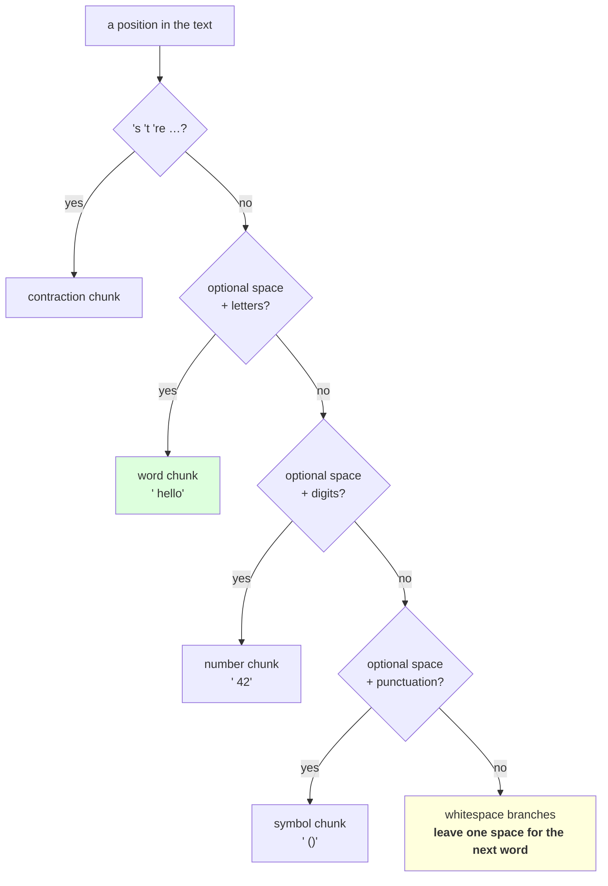

# 2.2 — The GPT pattern, symbol by symbol

## One-line answer

The published GPT-2 split pattern is seven alternatives tried left to right — seven hard-coded English
contractions, then letters, then digits, then punctuation, then three carefully separated whitespace
cases — and every one of them is a decision about a boundary merges may never cross.

---

## The story

A form asks for your date of birth and gives you three boxes: day, month, year.

It could have given you one long box. People would have written the date in a dozen formats and somebody
would have had to work out which was which afterwards.

Three boxes is not a cleverer form. It is the same form with the ambiguity moved to where somebody
thought about it once, in advance, instead of to every person who reads the answers.

---

## The idea in plain language

Part [2.1](2.1-why-day-12s-pattern-is-not-enough.md) listed what a whitespace-only pattern fails to
separate. This part reads the pattern that separates them.

Here is the published one, fetched on 2026-08-27 from the `tiktoken` source for the `gpt2` encoding
(the hub's §8 has the URL). It is quoted exactly:

```text
'(?:[sdmt]|ll|ve|re)| ?\p{L}++| ?\p{N}++| ?[^\s\p{L}\p{N}]++|\s++$|\s+(?!\S)|\s
```

Two things about it cannot be run with Python's standard library, and saying so is the honest start:

- **`\p{L}` and `\p{N}`** are Unicode *property* classes — "any letter", "any number" — and Python's `re`
  does not support them. The third-party `regex` module does, and Day 14 is when a package arrives.
- **`++`** is a *possessive* quantifier: match as much as possible and never give any back. It is a
  performance guarantee against catastrophic backtracking, and `re` does not support it either.

So this day uses a stdlib approximation, and every difference is named below rather than glossed:

```text
'(?:[sdmt]|ll|ve|re)| ?[^\W\d_]+| ?\d+| ?[^\s\w]+| ?_+|\s+(?!\S)|\s+
```

Now read the original, branch by branch. The alternation is tried **left to right at every position**, so
the order is part of the meaning.

**`'(?:[sdmt]|ll|ve|re)`** — an apostrophe followed by one of seven endings: `s`, `d`, `m`, `t`, `ll`,
`ve`, `re`. That is `'s`, `'d`, `'m`, `'t`, `'ll`, `'ve`, `'re` — the English contractions. It is first
so it wins before the letter branch can absorb the letters after the apostrophe. **This branch is
frankly English-specific**, hard-coded, case-sensitive in the original, and it is there because those
seven endings are common enough to be worth a rule of their own.

**` ?\p{L}++`** — an optional space, then one or more letters. The optional space is Day 12 part
[1.4](../../../day-012-bpe-the-merge-loop/parts/01-the-merge-loop/1.4-the-pre-tokenizer.md)'s trick that
keeps the tiling, and `\p{L}` is *any* letter in any script, so this branch handles Cyrillic and
Devanagari as well as Latin.

**` ?\p{N}++`** — an optional space, then one or more digits. Separate from letters, which is the branch
that makes `GPT-2` split and stops merges spanning a letter and a digit.

**` ?[^\s\p{L}\p{N}]++`** — an optional space, then one or more characters that are **not** whitespace,
letters or digits: punctuation and symbols. Note it is a run, so `()[]{}` stays as one chunk — part 2.1
measured that — while `-` between letters becomes its own.

**`\s++$`** — whitespace running to the end of the string.

**`\s+(?!\S)`** — one or more whitespace characters **not followed by a non-space**. The `(?!\S)` is a
negative lookahead and it is the subtle one: it forces this branch to give up its last space when a word
follows, so that space can be picked up by the ` ?\p{L}` branch and attached to the word. That is why
`  indented` becomes `' '` and `' indented'` rather than `'  '` and `'indented'`.

**`\s`** — a single whitespace character, the fallback so that nothing is ever left unmatched.

The last three branches are all about whitespace and they exist because **a run of spaces has to end up
somewhere, and where it ends up decides how indentation tokenizes.** Getting this wrong is the
difference between a code corpus whose indentation is a handful of tokens and one where it is one token
per level per line.

---

## Why Akshara needs it

- **Part [2.3](2.3-what-the-pattern-costs-and-buys.md)** measures what this pattern costs and buys at
  corpus scale. You cannot read that table without knowing what the branches do.
- **Part [2.4](2.4-the-number-that-was-three-tokens.md)** is about the digit branch specifically, and
  about what the published pattern does *not* fix.
- **Day 14** opens `tiktoken`, whose pattern this is. Reading it there is much easier having read it here.
- **Day 17** debugs tokenization on code and numbers; both are pre-tokenizer questions and this is the
  vocabulary for asking them.

---

## The mechanism

The stdlib approximation, with each branch labelled:

```python
import re

GPT_LIKE = (
    r"'(?:[sdmt]|ll|ve|re)"   # 1. English contractions: 's 'd 'm 't 'll 've 're
    r"| ?[^\W\d_]+"           # 2. optional space, then letters
    r"| ?\d+"                 # 3. optional space, then digits
    r"| ?[^\s\w]+"            # 4. optional space, then punctuation and symbols
    r"| ?_+"                  # 5. optional space, then underscores
    r"|\s+(?!\S)"             # 6. whitespace not followed by a non-space
    r"|\s+"                   # 7. any remaining whitespace
)
```

**Line by line:**
- **Branch 2, `[^\W\d_]`** is the stdlib idiom for "a letter": `\W` is "not a word character", so `[^\W]`
  is "a word character" — letters, digits and underscore — and excluding `\d` and `_` leaves letters. It
  is Unicode-aware by default in Python 3, so like `\p{L}` it covers every script.
- **Branch 4, `[^\s\w]`** is "not whitespace and not a word character". That is *nearly* `\p{L}\p{N}`'s
  complement and it differs in one place: `\w` includes the underscore, so `[^\s\w]` **excludes** it while
  the published `[^\s\p{L}\p{N}]` **includes** it. Branch 5 exists to put the underscore back, and it is
  the one branch in this approximation with no counterpart in the original.
- **Branch 5's position matters.** It is after punctuation, so a run like `_-_` is split rather than
  treated as one; the published pattern would keep it whole. That is a real difference and it is written
  down rather than hoped over.
- **`\s++$` is missing** from the approximation. Without possessive quantifiers it is not needed here —
  branches 6 and 7 between them match trailing whitespace — and its purpose in the original is to bound
  backtracking rather than to change what matches.
- The pattern is assembled from **adjacent raw string literals**, one per branch, so each can carry a
  comment. Python concatenates them at parse time, so this costs nothing and makes the thing readable —
  which is the only way a seven-branch alternation ever gets reviewed.

Now watch the branches fire:

```python
CASES = ["don't", "3.14", "GPT-2", "snake_case", "  indented", "()[]{}", "\u043f\u0440\u0438\u0432\u0435\u0442"]
for c in CASES:
    print(f"    {ascii(c):<26} -> {[ascii(x) for x in re.findall(GPT_LIKE, c)]}")
```

**Line by line:**
- The Cyrillic probe is there to check branch 2's Unicode-awareness. If `[^\W\d_]` were ASCII-only it
  would fall through to the punctuation branch and the whole word would be one chunk of "symbols" — which
  is what `[A-Za-z]` would have done and is the bug Day 11 part
  [2.1](../../../day-011-character-and-word-tokenizers/parts/02-word-level/2.1-what-counts-as-a-word.md)
  warned about.
- Measured on Intel Core i3-1115G4 (2 cores / 4 threads), 11.7 GB RAM, Windows 11, CPython 3.12.12, on
  2026-08-27:

```text
    "don't"                    -> ["'don'", '"\'t"']
    '3.14'                     -> ["'3'", "'.'", "'14'"]
    'GPT-2'                    -> ["'GPT'", "'-'", "'2'"]
    'snake_case'               -> ["'snake'", "'_'", "'case'"]
    '  indented'               -> ["' '", "' indented'"]
    '()[]{}'                   -> ["'()[]{}'"]
    '\u043f\u0440\u0438\u0432\u0435\u0442' -> ["'\\u043f\\u0440\\u0438\\u0432\\u0435\\u0442'"]
```

**The Cyrillic word is one chunk**, which is branch 2 working across scripts. That single property is
what separates a pre-tokenizer that works for one language from one that works for many, and it is one
character class.

**`'  indented'` gives `' '` then `' indented'`.** Trace it: at position 0 branch 2 tries to match an
optional space then letters, and position 1 is a space, so it fails. Branches 3, 4 and 5 fail. Branch 6
tries to take both spaces, but `(?!\S)` forbids ending immediately before a non-space, so it backtracks to
one space — which *is* followed by a space, so the lookahead is satisfied. Then from position 1, branch 2
takes ` indented`. **The lookahead's entire job is to leave one space behind for the word.**

Now the difference that the approximation makes, stated as a measurement rather than a claim:

```python
PUBLISHED_INTENT = {
    "don't":       ["don", "'t"],
    "3.14":        ["3", ".", "14"],
    "GPT-2":       ["GPT", "-", "2"],
    "  indented":  [" ", " indented"],
    "()[]{}":      ["()[]{}"],
    "a_b":         ["a", "_", "b"],
}
for probe, expected in PUBLISHED_INTENT.items():
    got = re.findall(GPT_LIKE, probe)
    flag = "" if got == expected else "   <- approximation differs"
    print(f"    {ascii(probe):<14} {[ascii(x) for x in got]}{flag}")
```

**Line by line:**
- `PUBLISHED_INTENT` records what the **original** pattern produces for each probe, worked out from its
  branches. It is a hand-derived expectation, not a measurement of the original — the original cannot be
  run here — and calling the variable `INTENT` rather than `EXPECTED` is the honest naming.
- The `a_b` row is the one where the two genuinely diverge in an interesting way: the published pattern's
  punctuation class includes the underscore, so `_` would join a run of adjacent punctuation; the
  approximation gives it its own branch.
- Measured on this machine, 2026-08-27:

```text
    "don't"        ["'don'", '"\'t"']
    '3.14'         ["'3'", "'.'", "'14'"]
    'GPT-2'        ["'GPT'", "'-'", "'2'"]
    '  indented'   ["' '", "' indented'"]
    '()[]{}'       ["'()[]{}'"]
    'a_b'          ["'a'", "'_'", "'b'"]
```

**Six of six agree on these probes**, which says the approximation is faithful where this day exercises
it and says nothing about the cases it does not exercise. The differences that remain — possessive
quantifiers, the underscore's class, `\s++$` — are listed above and are the honest boundary of the claim.

The seven branches, and what each one is protecting:

| Branch | Matches | The merge it makes impossible |
| --- | --- | --- |
| `'(?:[sdmt]\|ll\|ve\|re)` | `'s`, `'t`, `'re`, … | a word's letters joined across its apostrophe |
| ` ?\p{L}++` | optional space + letters | a letter joined to a digit or to punctuation |
| ` ?\p{N}++` | optional space + digits | a digit joined to a letter or to a decimal point |
| ` ?[^\s\p{L}\p{N}]++` | optional space + punctuation | punctuation joined to the word beside it |
| `\s++$` | trailing whitespace | — (bounds backtracking) |
| `\s+(?!\S)` | whitespace not before a word | a run of indentation swallowing the word after it |
| `\s` | one whitespace character | — (fallback so nothing is unmatched) |



---

## When it breaks

**The loud failure — `\p{L}` in Python's `re`:**

```console
>>> import re
>>> re.findall(r" ?\p{L}++", "hello")
Traceback (most recent call last):
  File "<stdin>", line 1, in <module>
  File "...\Lib\re\__init__.py", line 217, in findall
    return _compile(pattern, flags).findall(string)
           ^^^^^^^^^^^^^^^^^^^^^^^^
  File "...\Lib\re\_compiler.py", line 745, in compile
    p = _parser.parse(p, flags)
        ^^^^^^^^^^^^^^^^^^^^^^^
re.error: bad escape \p at position 2
```

What it means: the standard library does not know `\p`. **This is the good outcome** — it fails at compile
time, before any text is processed. The fix is either the `regex` module or the stdlib approximation
above, and choosing the second means writing down what changed.

**The silent failure — an ASCII-only letter class.** `[A-Za-z]` compiles fine and works on English:

```text
  pattern ' ?[A-Za-z]+'  on 'hello'   -> ['hello']        looks right
  pattern ' ?[A-Za-z]+'  on '\u043f\u0440\u0438\u0432\u0435\u0442'  -> []               matches nothing
  the word then falls through to the punctuation branch, or is dropped entirely
  depending on the other branches, and the tiling assertion is the only thing
  that notices — if the text is dropped. If it merely lands in the wrong branch,
  nothing notices at all.
```

**The check that catches it** exercises the branches deliberately rather than hoping a corpus does:

```python
BRANCH_PROBES = {
    "contraction": ("don't",      ["don", "'t"]),
    "latin":       (" hello",     [" hello"]),
    "cyrillic":    (" \u043f\u0440\u0438\u0432\u0435\u0442", [" \u043f\u0440\u0438\u0432\u0435\u0442"]),
    "devanagari":  (" \u0936\u092c\u094d\u0926", None),
    "digits":      (" 42",        [" 42"]),
    "punct":       (" ()",        [" ()"]),
    "indent":      ("  x",        [" ", " x"]),
    "trailing":    ("x  ",        ["x", "  "]),
}


def assert_branches_fire(pattern: str) -> None:
    """Every branch must be reachable, and the pattern must still tile."""
    for name, (probe, expected) in BRANCH_PROBES.items():
        got = re.findall(pattern, probe)
        assert "".join(got) == probe, f"{name}: pattern does not tile {ascii(probe)} -> {got}"
        if expected is not None:
            assert got == expected, f"{name}: expected {expected}, got {[ascii(g) for g in got]}"
```

**Line by line:**
- Every probe has a **name** saying which branch it exercises, so a failure says "the cyrillic branch"
  rather than "assertion failed".
- The tiling assertion runs on **every** probe, unconditionally, because that is the property no pattern
  may break — Day 12 part 1.4's rule.
- `devanagari` has `expected = None`, deliberately. Devanagari text contains combining marks, which are
  neither letters nor digits by these classes, so the split is script-specific and asserting a particular
  one would be encoding an assumption. **Checking only the tiling for that row is the honest thing**, and
  it is why the expectation is optional rather than universal.
- `trailing` exercises the whitespace branches at the end of a string, which is where the original's
  `\s++$` lives and where an approximation is most likely to differ.
- What this does not check is *performance*. The possessive quantifiers in the original exist to bound
  backtracking, and a stdlib pattern without them can be slow on adversarial input — which is a real
  concern for a pattern applied to untrusted text and is not something an equality assertion can see.

---

## In production

**What a research engineer writes instead of the teaching version.** They use the published pattern with
the `regex` module, because the possessive quantifiers are a denial-of-service defence rather than an
optimisation: a pre-tokenizer runs on every request, and a pattern that can backtrack exponentially on a
crafted string is an attack surface. **That is the one part of this pattern you should not approximate in
a service**, and it is a reason to install a dependency rather than to be clever.

The second habit is that the pattern is **read before adoption, not after a bug**. Seven branches take two
minutes to read and they tell you exactly what the tokenizer will do with your domain: whether it splits
identifiers, how it handles indentation, whether digits stay together.

**What degrades at scale.** Backtracking, on inputs nobody writes by hand. A long run of characters that
partially matches several branches can make a non-possessive pattern do quadratic work, and the inputs
that trigger it are exactly the inputs an adversary sends. At corpus-processing scale it shows up as one
document that never finishes; at serving scale it shows up as a latency spike.

**The failure that only shows with real data.** Scripts whose word structure the branches do not model.
The letter/digit/punctuation split is a Latin-alphabet idea. Languages written without spaces get one
enormous letter chunk per sentence — measured in part 2.1, the Chinese probe is a single chunk — so all
the boundary discipline this pattern buys for English does nothing for them, and the merges inside that
chunk are unconstrained. Day 17 measures what that costs.

**The review comment.** *"We are using `[A-Za-z]+` as the letter branch. That matches nothing for any
non-Latin script, so those words fall through to the punctuation branch and get tokenized as symbols. Use
`[^\W\d_]+`, or the `regex` module and `\p{L}`."*

**The interview question.** *"Walk me through the GPT-2 split pattern."* The weak answer describes it as
"splitting on words and punctuation". The strong answer takes the branches in order and says what each
prevents: **contractions first so the apostrophe is not absorbed into the word; then letters, then digits,
then punctuation, each with an optional leading space so the pieces still tile; then three whitespace
branches whose job is to leave exactly one space attached to the following word.** Then the detail that
shows you read it: *the `(?!\S)` in the whitespace branch is what forces it to give back its last space,
and the `++` quantifiers are possessive to bound backtracking, which is why it needs the `regex` module
rather than `re`.*

**Compute tier: T0.** The standard library on a laptop. No packages, no network, no GPU, no seed — and
**that constraint is the reason this part uses an approximation at all**, which is stated in the pattern's
own comments and in the differences list. Every probe result reproduces everywhere; nothing here depends
on the corpus. The published pattern was **fetched, not recalled** (see the hub's §8 for the URL and
date), and the claim that the approximation matches it is verified on six probes and explicitly not
claimed beyond them. What T0 cannot show is the backtracking behaviour of the two, which needs adversarial
inputs and a timing harness, and Day 14 is where the real implementation arrives.

---

## Check yourself

Run this. It prints **one chunk for a Cyrillic word, which an ASCII letter class would have missed**:

```python
import re

GPT_LIKE = (
    r"'(?:[sdmt]|ll|ve|re)"
    r"| ?[^\W\d_]+"
    r"| ?\d+"
    r"| ?[^\s\w]+"
    r"| ?_+"
    r"|\s+(?!\S)"
    r"|\s+"
)
ASCII_ONLY = GPT_LIKE.replace(r"[^\W\d_]", r"[A-Za-z]")

for probe in ("don't", "3.14", "  indented", "\u043f\u0440\u0438\u0432\u0435\u0442", "a_b"):
    g = re.findall(GPT_LIKE, probe)
    a = re.findall(ASCII_ONLY, probe)
    print(f"  {ascii(probe):<26} unicode={[ascii(x) for x in g]}")
    print(f"  {'':<26} ascii  ={[ascii(x) for x in a]}"
          f"{'   <- differs' if g != a else ''}")
    print(f"  {'':<26} tiles: unicode={''.join(g) == probe} ascii={''.join(a) == probe}")

try:
    re.findall(r" ?\p{L}++", "hello")
except re.error as e:
    print("  \\p{L} in stdlib re:", e)
```

**Line by line:**
- The Cyrillic row is the one to look at: the ASCII pattern returns **no chunks at all** and
  `tiles=False`. Say out loud what a tokenizer built on it would produce for that word, and say which
  check would have caught it.
- `a_b` splits into three under both. Say which branch matched the underscore in each, and check it
  against the branch table above.
- The `\p{L}` line prints a `re.error`. Say what you would have to install to use the published pattern
  verbatim, and which day that arrives.
- Now remove the `(?!\S)` from the whitespace branch and re-run `'  indented'`. Say what the chunks
  become and what the following word lost.

**Say this out loud, without scrolling up:** name the seven branches in order, say what the optional
leading space in four of them is for, and say what `(?!\S)` forces the whitespace branch to give up and
why that matters for indented code.
