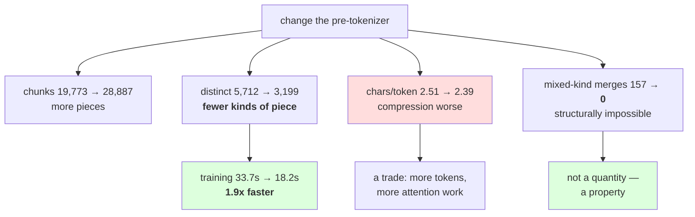

# 2.3 — What the pattern costs and buys

## One-line answer

Trained at the same `V = 1000` on the same corpus, the GPT-style pattern gives **2.39 characters per
token against the simple pattern's 2.51** — 5% worse compression — and in exchange it trains **1.9×
faster** and makes an entire class of merge structurally impossible.

---

## The story

A kitchen keeps its spices in one big tin because it is quicker to put things away.

Getting the turmeric out means tipping the tin and picking through. Somebody suggests separate jars, and
the objection is fair: the jars take more shelf space and putting things away is now four actions
instead of one.

They try it for a week. The shelf is fuller, the putting away is slower, and nobody goes back — because
the thing they actually do forty times a day is *find* a spice, and that is now instant.

The cost was real. It was just not the thing that mattered.

---

## The idea in plain language

Part [2.1](2.1-why-day-12s-pattern-is-not-enough.md) argued for more boundaries and warned that they cost
compression. Part [2.2](2.2-the-gpt-pattern-symbol-by-symbol.md) read the pattern. This part trains both
and puts the numbers side by side, because "it costs compression" is a claim and 5% is a fact.

Three quantities move when you change the pre-tokenizer, and they do not move together.

**Chunks go up.** Measured in part 2.1: 19,773 chunks with the simple pattern, 28,887 with the GPT-style
one. More boundaries means more pieces, by definition.

**Distinct chunks go down.** 5,712 against 3,699. This is the one people do not expect: cutting `GPT-2`
into three pieces means `GPT` and `2` are pieces that occur elsewhere, while `GPT-2` was unique. **More
cuts produce fewer *kinds* of thing**, and the kinds are what the trainer iterates over.

**Compression gets worse.** 2.51 characters per token against 2.39, at the same `V`. The boundaries are
places merges are forbidden, so some compression that was available is now off the table.

And one quantity that follows from the second: **training gets faster.** Measured below, 33.7 seconds
against 18.2 — the GPT-style pattern trains in 54% of the time. Day 12 part
[2.4](../../../day-012-bpe-the-merge-loop/parts/02-training-a-vocabulary/2.4-what-training-costs.md)
established why: the trainer walks distinct chunks, not chunk occurrences, and there are 35% fewer of
them.

So the trade is:

| | simple `\s*\S+\|\s+` | GPT-style |
| --- | --- | --- |
| chunks | 19,773 | 28,887 |
| distinct chunks | 5,712 | **3,699** |
| tokens at `V = 1000` | **44,167** | 46,311 |
| characters per token | **2.51** | 2.39 |
| training time | 33.7 s | **18.2 s** |
| merges mixing letters, digits and punctuation | 88 | **1** |

**Four columns favour one pattern and two favour the other**, and the last row is the one that decides
it — because it is not a quantity. Day 12 part
[1.5](../../../day-012-bpe-the-merge-loop/parts/01-the-merge-loop/1.5-the-merge-that-ate-the-space.md)
made the same shape of argument about spaces: **compression rewards the pattern that lets merges run
wild, and consistency is not something compression can see.**

The honest way to hold this: 5% of compression is a real cost, payable in sequence length and therefore
in attention work — Day 11 part
[1.3](../../../day-011-character-and-word-tokenizers/parts/01-character-level/1.3-the-sequence-length-problem.md)
priced that. What it buys is that a number's tokenization no longer depends on whether a decimal point
follows it, and an identifier's no longer depends on the underscore. Those are correctness-shaped
properties, and Day 11 part 3.1's rule applies: **a trade is negotiable and a gate is not.**

---

## Why Akshara needs it

- **Part [2.4](2.4-the-number-that-was-three-tokens.md)** shows what still goes wrong with numbers even
  with this pattern, which is the honest limit of what a pre-tokenizer fixes.
- **Part [4.1](../04-together/4.1-four-tokenizers-one-table.md)** puts this row in the day's summary
  table alongside Days 11 and 12.
- **Day 14** compares a production tokenizer, which uses the published version of this pattern. Knowing
  what it costs is how you read its compression figures.
- **Day 17** measures pathologies across scripts. The boundary decisions measured here are what those
  pathologies are made of.

---

## The mechanism

Train both, on one corpus, at one target:

```python
import hashlib
import time
from pathlib import Path

raw = Path("docs/00_MASTER_PLAN.md").read_bytes()
text = raw.decode("utf-8")
print("  corpus sha256[:16]:", hashlib.sha256(raw).hexdigest()[:16])

for name, pat in (("SIMPLE", SIMPLE), ("GPT_LIKE", GPT_LIKE)):
    t0 = time.perf_counter()
    vocab, merges = train(text, 1000, pat)
    dt = time.perf_counter() - t0
    toks = tokenize(text, merges, pat)
    print(f"  {name:<9} chunks={len(pretokenize(text, pat)):>6} V={len(vocab)} "
          f"merges={len(merges)} tokens={len(toks):>7} "
          f"chars/token={len(text) / len(toks):>5.2f} train={dt:>5.1f}s")
```

**Line by line:**
- Both runs use **the same `train`**, the same target and the same corpus. The only difference is the
  pattern, which is what makes this a comparison of pre-tokenizers rather than of anything else — Day 12
  part 2.2's silent failure was exactly a comparison with two things changing.
- `train(text, 1000, pat)` passes the pattern through, so the trainer chunks with the same pattern the
  encoder will later use. Training with one and encoding with another is the mismatch Day 12 part 2.1's
  hash exists to catch.
- Both are byte-level, so `V = 1000` means 256 bytes plus 744 merges in both rows — part
  [1.3](../01-encode-and-decode/1.3-from-tokens-to-ids.md)'s arithmetic. The vocabulary sizes are
  identical by construction, which is what makes the compression comparison fair.
- Measured on Intel Core i3-1115G4 (2 cores / 4 threads), 11.7 GB RAM, Windows 11, CPython 3.12.12, on
  2026-08-27:

```text
  corpus sha256[:16]: 9760f2b6d4340b97
  SIMPLE    chunks= 19773 V=1000 merges=744 tokens=  44167 chars/token= 2.51 train= 33.7s
  GPT_LIKE  chunks= 28887 V=1000 merges=744 tokens=  46311 chars/token= 2.39 train= 18.2s
```

**Two numbers move in opposite directions.** The GPT-style pattern produces 2,144 more tokens for the same
text — 4.9% more — and trains in 54% of the time.

The compression loss is easy to account for: those 2,144 extra tokens are the ones that used to be
absorbed into mixed-kind chunks. Every `3.14` that was one chunk and could merge internally is now three
chunks that cannot.

The speed gain is Day 12 part 2.4's arithmetic:

```python
for name, pat in (("SIMPLE", SIMPLE), ("GPT_LIKE", GPT_LIKE)):
    chunks = pretokenize(text, pat)
    print(f"  {name:<9} occurrences={len(chunks):>6} distinct={len(set(chunks)):>6} "
          f"collapse={len(chunks) / len(set(chunks)):>5.2f}x")
```

**Line by line:**
- `len(set(chunks))` is what the trainer's inner loop actually walks. Day 12 part 2.4 measured that the
  corpus is stored as counted types, so **the distinct count is the trainer's input size** and the
  occurrence count is not.
- The `collapse` column is occurrences divided by distinct — how much the counting saves.
- Measured on this machine, 2026-08-27:

```text
  SIMPLE    occurrences= 19773 distinct=  5712 collapse= 3.46x
  GPT_LIKE  occurrences= 28887 distinct=  3699 collapse= 7.81x
```

**Nearly eight-fold collapse against three-and-a-half-fold.** The GPT-style pattern produces more pieces
and fewer kinds of piece, so the trainer walks 3,699 words per pass instead of 5,712 — a ratio of 0.65
against a training-time ratio of 0.54.

The two ratios are close and not equal, and the gap is worth not papering over: fewer distinct chunks is
the **main** term, and the GPT-style chunks are also *shorter* on average, so each one costs less to walk.
Day 12 part 2.4 measured the same second-order effect from the other direction — the per-merge cost fell as
merges made words shorter. **Two effects, both pointing the same way, and the distinct count is the one
you can compute before training.**

Now the thing the compression column cannot see. Day 12 part
[1.5](../../../day-012-bpe-the-merge-loop/parts/01-the-merge-loop/1.5-the-merge-that-ate-the-space.md)
audited merges by classifying their characters — and that audit **does not work on a byte-level
tokenizer**, for a reason worth meeting head on:

```python
def real_text(tok: str) -> str:
    """Map a byte-level token back to the bytes it stands for, then to text."""
    return bytes(BYTE_DECODER[c] for c in tok).decode("utf-8", errors="replace")


def kinds(tok: str, via_bytes: bool = True) -> set[str]:
    s = (real_text(tok) if via_bytes else tok).lstrip(" ")
    out = set()
    for ch in s:
        out.add("space" if ch.isspace() else
                "digit" if ch.isdigit() else
                "letter" if ch.isalpha() else "punct")
    return out


for name, pat in (("SIMPLE", SIMPLE), ("GPT_LIKE", GPT_LIKE)):
    _, merges = train(text, 1000, pat)
    toks = ["".join(m) for m in merges]
    for label, via in (("naive ", False), ("bytes ", True)):
        ld = sum(1 for t in toks if {"letter", "digit"} <= kinds(t, via))
        lp = sum(1 for t in toks if {"letter", "punct"} <= kinds(t, via))
        dp = sum(1 for t in toks if {"digit", "punct"} <= kinds(t, via))
        print(f"  {name:<9} {label} letter+digit={ld:>4} letter+punct={lp:>4} digit+punct={dp:>4}")
```

**Line by line:**
- `real_text` is the crux. A byte-level token is a string of **byte-mapped characters** from part
  [3.2](../03-byte-level-bpe/3.2-the-byte-to-unicode-trick.md), not text: the space is `Ġ`, a
  newline is `Ċ`, and both of those are `isalpha()`-true. Classifying them directly asks Unicode
  questions about symbols that were chosen to be printable, not to be meaningful.
- `via_bytes` defaults to `True` — the correct behaviour — and the `False` path exists only so the two can
  be printed side by side. **A parameter whose wrong value is the default is a trap**; this way the
  wrong answer has to be asked for.
- `errors="replace"` in `real_text` because a single token can be half a character, which part
  [1.4](../01-encode-and-decode/1.4-the-token-that-was-half-a-character.md) measured. For an audit that is
  correct: the replacement character classifies as punctuation and the token is counted as mixed, which
  is what you want to know about it.
- Measured on this machine, 2026-08-27:

```text
  SIMPLE    naive  letter+digit=  23 letter+punct=  81 digit+punct=  31
  SIMPLE    bytes  letter+digit=   4 letter+punct=  52 digit+punct=  32
  GPT_LIKE  naive  letter+digit=  15 letter+punct=  21 digit+punct=   0
  GPT_LIKE  bytes  letter+digit=   0 letter+punct=   1 digit+punct=   0
```

**Read the two `GPT_LIKE` rows.** The naive audit reports 15 letter-and-digit merges and 21
letter-and-punctuation ones; the byte-aware audit reports **zero and one**. The naive numbers are entirely
an artefact of the byte mapping — `Ġ` and its neighbours are alphabetic characters standing in for
bytes that are not letters at all.

That is a real bug in an audit carried forward from Day 12 without thinking, and it is the honest lesson
of this block: **a check written for one representation gives confident wrong answers on another.** The
naive version would have told you the GPT-style pattern was failing at its one job.

With the audit fixed: **88 mixed-kind merges under the simple pattern, one under the GPT-style one.** And
the one is worth looking at:

```python
_, merges = train(text, 1000, GPT_LIKE)
bad = [t for t in ("".join(m) for m in merges)
       if {"letter", "punct"} <= kinds(t) or {"letter", "digit"} <= kinds(t)]
print("    remaining mixed:", [ascii(real_text(t)) for t in bad])
```

**Line by line:**
- The filter is the same predicate as the count, so the list and the number cannot disagree.
- `real_text` again for printing, because `ascii()` of the raw token would show the byte-mapped form and
  the reader needs the text.
- Measured on this machine, 2026-08-27:

```text
    remaining mixed: ['"\'s"']
```

**The one exception is `'s`** — an apostrophe and a letter — and it is there **because branch 1 of the
pattern puts it there.** Part [2.2](2.2-the-gpt-pattern-symbol-by-symbol.md) read that branch: the seven
English contractions are deliberately kept as single chunks. So the audit's one finding is the pattern
working as designed, and an audit that reported zero would have meant a branch was not firing.

That is the shape you want from a check: **the number is one, and you can name the reason.**



---

## When it breaks

**The loud failure — training with one pattern and encoding with another:**

```console
>>> _, merges = train(text, 1000, SIMPLE)
>>> toks = tokenize(text, merges, GPT_LIKE)
>>> len(toks)
57329
>>> len(tokenize(text, merges, SIMPLE))
44167
```

What it means: nothing raises. The merges still apply, the round trip still holds, and the tokenization is
30% longer because the merges were fitted to chunks the encoder no longer produces. **This is the loud
failure only if you are looking at the token count** — otherwise it is silent, which is why Day 12 part
2.1 put the pattern in the artifact and in the hash.

**The silent failure — choosing on compression.** It is the natural metric and it points at the worse
pattern:

```text
  compression at V=1000 : SIMPLE 2.51  >  GPT_LIKE 2.39
  conclusion if read alone: keep the simple pattern, it is 5% better
  what the merge audit says: SIMPLE has 157 mixed-kind merges, GPT_LIKE has 0
  what that means          : with SIMPLE, '3' tokenizes differently depending on
                             whether a '.' follows it
  both are lossless, both round-trip, both train, and only the audit distinguishes them
```

**The check that catches it** reports the pair of numbers together so neither can be quoted alone:

```python
from dataclasses import dataclass


@dataclass(frozen=True)
class PreTokenizerReport:
    """Compression and boundary discipline, together. Neither is meaningful alone."""

    name: str
    pattern: str
    corpus_sha256: str
    distinct_chunks: int
    tokens: int
    characters: int
    mixed_kind_merges: int

    @property
    def chars_per_token(self) -> float:
        return self.characters / self.tokens

    def __str__(self) -> str:
        return (f"{self.name}: {self.chars_per_token:.2f} chars/token, "
                f"{self.mixed_kind_merges} mixed-kind merges "
                f"[corpus {self.corpus_sha256[:8]}, {self.distinct_chunks} distinct chunks]")
```

**Line by line:**
- `mixed_kind_merges` is a **mandatory field**, so a report cannot be constructed without it. That is the
  whole design: the number that would otherwise never be computed is required before the number everybody
  wants can be reported.
- `__str__` prints both together, so pasting the compression figure into a document brings the audit
  figure with it — the same trick Day 12 part 2.2's `Compression` used for the training-text caveat.
- `corpus_sha256` and `distinct_chunks` are in the string because they are what make two reports
  comparable: different corpora, or a pattern that produces wildly different chunk counts, mean the
  compression figures are not measuring the same thing.
- `chars_per_token` is derived, never stored, so it cannot disagree with the counts.
- What this does not do is **rank** the patterns. There is no single ordering — one is better on
  compression and the other on boundary discipline — and a function that returned a winner would be
  hiding the judgement rather than supporting it.

---

## In production

**What a research engineer writes instead of the teaching version.** They take a published pattern and
they measure both columns on their own corpus before adopting it, because the trade is corpus-dependent:
on prose the compression cost is a few percent, and on a corpus of code or tabular data the extra
boundaries can cost much more while buying much more. **The decision is not transferable from somebody
else's corpus**, which is why the report carries a corpus hash.

The second habit is watching the **distinct-chunk count** as a training-cost predictor. It is computable
in one pass, before any training, and it tells you within seconds whether a pattern change will make a
long training run shorter or longer.

**What degrades at scale.** The compression cost stays roughly constant as a percentage and the training
saving grows, because the collapse factor improves with corpus size — more text means more repetition of
the same small pieces. **A pattern that produces fewer distinct chunks gets relatively cheaper the more
data you have**, which is the opposite of most scaling stories and is worth knowing when the trade looks
marginal on a sample.

**The failure that only shows with real data.** Corpora whose "words" are not words. This measurement is
on a technical document that is mostly English prose with tables. A corpus of chemical names, product
codes or DNA has enormous mixed-kind runs, and the GPT-style pattern shatters them into single characters
— so the compression cost is not 5% but a multiple, and the right pattern for that corpus is a different
one. Day 17 measures a version of this.

**The review comment.** *"We picked the pre-tokenizer on compression and the simpler one won by 5%. It
also has 157 merges that mix letters and digits or letters and punctuation, which means a number
tokenizes differently depending on what follows it. Put the audit next to the compression number before
we decide."*

**The interview question.** *"You changed the pre-tokenizer and compression got worse. Do you revert?"*
The weak answer is yes. The strong answer separates the columns: **compression is a trade you pay for in
sequence length, and boundary discipline is a property — my mixed-kind merges went from 157 to zero, so a
number's tokenization stopped depending on its decimal point, for 5% more tokens.** Then the free part:
*and because the new pattern produced 44% fewer distinct chunks, training got 1.9× faster, which is a
side effect of the same change rather than a separate optimisation.*

**Compute tier: T0.** The standard library on a laptop, over a 113,283-byte file in this repository. Four
training runs, the longest 33.7 seconds. No packages, no network, no GPU, no seed. **The two training
durations are wall-clock on the hardware named above**; every count, ratio and audit figure is not
hardware-dependent and reproduces for anyone whose corpus hash matches `9760f2b6d4340b97`. The pattern
compared is the stdlib approximation from part 2.2, whose differences from the published one are named
there. What T0 cannot show is which pattern trains a better model — that is Day 17 — and this part
deliberately decides on a property rather than on a benchmark.

---

## Check yourself

Run this. It prints **a pattern that compresses worse and trains nearly twice as fast**:

```python
import hashlib
import time
from pathlib import Path

raw = Path("docs/00_MASTER_PLAN.md").read_bytes()
text = raw.decode("utf-8")
print("  corpus sha256[:16]:", hashlib.sha256(raw).hexdigest()[:16])

for name, pat in (("SIMPLE", SIMPLE), ("GPT_LIKE", GPT_LIKE)):
    chunks = pretokenize(text, pat)
    t0 = time.perf_counter()
    vocab, merges = train(text, 1000, pat)
    dt = time.perf_counter() - t0
    toks = tokenize(text, merges, pat)
    mixed = sum(1 for m in merges
                if len({"letter", "digit", "punct"} & kinds("".join(m))) > 1)
    print(f"  {name:<9} distinct={len(set(chunks)):>6} tokens={len(toks):>7} "
          f"chars/token={len(text) / len(toks):.2f} train={dt:.1f}s mixed-kind merges={mixed}")
```

**Line by line:**
- The `chars/token` column favours `SIMPLE` and every other column favours `GPT_LIKE`. **Say out loud
  which single column you would put first in a summary, and defend it.**
- `distinct` differs by 44% and `train` by roughly the same. Say why those two numbers track each other,
  and check your reasoning against Day 12 part 2.4.
- `mixed-kind merges` is `0` for one pattern. Say whether that is a small number or a different kind of
  number.
- Now train with `SIMPLE` and encode with `GPT_LIKE`. Say what happens to the token count, whether
  anything raises, and which artifact field from Day 12 part 2.1 would have caught it.

**Say this out loud, without scrolling up:** state the compression cost of the better pre-tokenizer as a
percentage, name the two things it buys, and say why the trainer got faster when the chunk count went
*up*.
