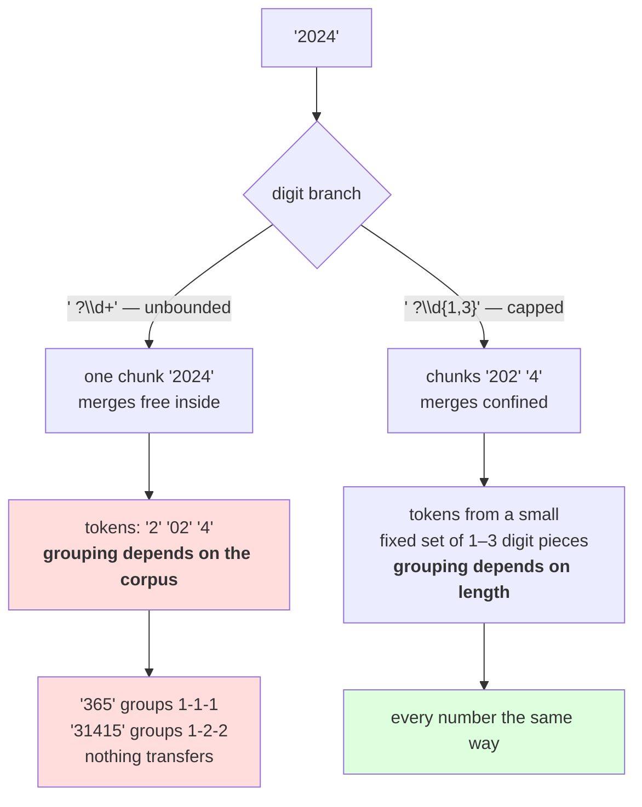

# 2.4 — 💥 The number that was three tokens

## One-line answer

The pre-tokenizer keeps digits away from letters and then leaves them entirely to the merges, so `2024`
becomes `2` + `02` + `4` while `365` becomes three single digits and `31415` becomes `3` + `14` + `15` —
**the same digit sits in a different-sized token depending on its neighbours**, which is why a model has
to learn arithmetic separately for every number shape.

---

## The story

Somebody is dictating quantities to you across a noisy room and you write them on the order pad.

"Two thousand and twenty four." You write 2024. "Three sixty five." You write 365. "Thirty one, four
fifteen." You write 31415 and pause, because you are not sure whether that was one number or two.

Every one of those arrived as a *different grouping* of the same ten digits, and you had to work out the
number from the grouping each time. The digits were never in doubt. The way they were bundled was.

---

## The idea in plain language

Part [2.3](2.3-what-the-pattern-costs-and-buys.md) showed the pre-tokenizer eliminating mixed-kind merges
entirely — zero merges spanning a letter and a digit. That is the fix working. This part is what it does
**not** fix.

The digit branch, ` ?\p{N}++`, says: a run of digits is one chunk, however long. Inside that chunk, the
merges are free. And merges are chosen by frequency, so the tokenizer learns whichever digit pairs happen
to be common in the training corpus — `20`, `01`, `14` — and applies them by rank wherever they fit.

The result, measured below, is that **the tokenization of a number has no relationship to its value**:

- `7` is one token.
- `42` is two tokens, `4` and `2`.
- `365` is three tokens, all single digits.
- `2024` is three tokens: `2`, `02`, `4`.
- `31415` is three tokens: `3`, `14`, `15`.
- `1000000` is six tokens: `10`, then five separate zeros.

Read the `2024` row again. The tokenizer produced a token `02` — a leading zero paired with a two — and
split the number so that the `0` and the `2` that a person would read as "twenty" are in *different*
tokens. There is no sense in which the model sees "two thousand and twenty four"; it sees three arbitrary
symbols that happen to co-occur.

Three consequences, and the third is the expensive one.

**Arithmetic has to be memorised per shape.** A model that has learned something about `2` + `02` + `4`
has learned nothing transferable about `2` + `03` + `4`, because those are different token sequences with
different embeddings. Digit-level regularity — that the third digit from the right is hundreds — is
invisible when the grouping is irregular.

**The same number tokenizes differently in different contexts.** Measured below, `2024` and ` 2024` do not
share their first token: one starts with `2` and the other with `Ġ2`, because the pre-tokenizer attaches
the leading space to the digit run. That is by design and it means a number at the start of a line and
the same number mid-sentence are different sequences.

**It is corpus-dependent and therefore unstable.** These groupings come from what was frequent in *this*
corpus. Retrain on different text and `2024` splits differently. **A tokenizer's number behaviour is an
accident of its training data**, not a property anybody chose.

And the fix that the field arrived at is in the pattern rather than in the merges. The `cl100k_base`
pattern — fetched and quoted in the hub's §8 — replaces the unbounded digit branch with:

```text
\p{N}{1,3}+
```

**One to three digits, and no more.** A digit run is cut into groups of at most three, so `1000000`
becomes `100` + `000` + `0` regardless of what the merges learned, and every number is built from a small,
fixed set of one-to-three-digit tokens. It does not make arithmetic easy; it makes it *consistent*, which
is the precondition.

Note what that fix is: **a pre-tokenizer boundary, not a smarter merge rule.** Day 12 part
[1.5](../../../day-012-bpe-the-merge-loop/parts/01-the-merge-loop/1.5-the-merge-that-ate-the-space.md)
made the same move for spaces and part [2.1](2.1-why-day-12s-pattern-is-not-enough.md) for letters and
digits. When merges do something you do not want, the lever is where they are forbidden to reach.

---

## Why Akshara needs it

- **Day 17** measures tokenization pathologies, and numbers are the headline one. This part is the
  mechanism; that day is the measurement across more cases.
- **Part [4.1](../04-together/4.1-four-tokenizers-one-table.md)** summarises what Day 13 fixed and what it
  did not. This is squarely in the second column.
- **Day 14** opens `tiktoken` and its `cl100k_base` pattern, which contains the fix quoted above. Seeing
  the problem first is what makes that one line interesting rather than noise.
- **Day 100 onward**, any application that asks a model to handle quantities inherits this. It is a
  tokenizer property, decided before training, and not fixable afterwards.

---

## The mechanism

Encode eight numbers with the tokenizer trained in part 2.3:

```python
import json
from pathlib import Path

merges = [tuple(m) for m in json.loads(Path("tokenizer.json").read_text())["merges"]]

for n in ("7", "42", "365", "2024", "31415", "1000000"):
    print(f"    {n:<9} -> {[ascii(t) for t in tokenize(n, merges)]}")
```

**Line by line:**
- The numbers are chosen to span the shapes: one digit, two, three, a year, five digits, and a round
  million. **None of them is unusual** — that is the point, and a probe list of random digits would hide
  the pattern by averaging over it.
- They are passed as bare strings with no leading space, so the pre-tokenizer's digit branch is the only
  one that fires and the split is entirely the merges' doing.
- Measured on Intel Core i3-1115G4 (2 cores / 4 threads), 11.7 GB RAM, Windows 11, CPython 3.12.12, on
  2026-08-27, with the `V = 1000` byte-level GPT-style tokenizer trained on `docs/00_MASTER_PLAN.md`
  (`sha256[:16] = 9760f2b6d4340b97`):

```text
    7         -> ["'7'"]
    42        -> ["'4'", "'2'"]
    365       -> ["'3'", "'6'", "'5'"]
    2024      -> ["'2'", "'02'", "'4'"]
    31415     -> ["'3'", "'14'", "'15'"]
    1000000   -> ["'10'", "'0'", "'0'", "'0'", "'0'", "'0'"]
```

**Six numbers, six different grouping patterns.** Not one of them groups the digits the way a person reads
the number.

`2024` is the row to sit with. The tokenizer has a token `02` — because `0` followed by `2` was frequent
in this corpus, probably in dates and version numbers — and its rank is low enough that it wins. So the
number is cut as `2 | 02 | 4`, straddling the boundary a reader would put between the thousands and the
tens.

`31415` gets `3 | 14 | 15` — three tokens for five digits, grouped 1-2-2. `365` gets three single digits,
because no two-digit token in this vocabulary matched. **Two three-and-five digit numbers, two completely
different strategies**, decided by which pairs happened to be frequent.

`1000000` is the worst: six tokens for seven digits, five of them identical single zeros. A model reading
that has to count zeros positionally, one token at a time, with nothing in the representation telling it
where the number ends.

Now the context effect:

```python
for n in ("2024", " 2024"):
    print(f"    {ascii(n):<9} -> {[ascii(t) for t in tokenize(n, merges)]}")
```

**Line by line:**
- The only difference between the two probes is a leading space, which is the difference between a number
  at the start of a chunk and one following a word — the overwhelmingly common case in real text.
- Measured on this machine, 2026-08-27:

```text
    '2024'    -> ["'2'", "'02'", "'4'"]
    ' 2024'   -> ["'Ġ2'", "'02'", "'4'"]
```

**The first tokens differ and the rest match.** `Ġ2` and `2` are different ids with different embeddings,
so the model sees two related-but-distinct sequences for the same number. That is Day 12 part 1.5's
context-dependence, surviving in the one place the pre-tokenizer deliberately allows it.

Now the fix, applied to the pattern rather than the merges:

```python
import re

CAPPED = GPT_LIKE.replace(r"| ?\d+", r"| ?\d{1,3}")

for n in ("2024", "31415", "1000000"):
    print(f"    {n:<9} chunks GPT_LIKE={[ascii(c) for c in re.findall(GPT_LIKE, n)]}")
    print(f"    {'':<9} chunks CAPPED  ={[ascii(c) for c in re.findall(CAPPED, n)]}")
```

**Line by line:**
- `GPT_LIKE.replace(...)` edits one branch and leaves the other six alone, which is the honest way to
  demonstrate that this is a **one-branch change**. Rewriting the whole pattern would obscure how small
  the fix is.
- `\d{1,3}` is the stdlib spelling of the published `\p{N}{1,3}+`; the possessive `+` is a backtracking
  guarantee rather than a change to what matches, per part
  [2.2](2.2-the-gpt-pattern-symbol-by-symbol.md).
- This block chunks only — it does not retrain — because **the point is that the boundaries change before
  any merge is consulted.** The merges cannot cross a chunk boundary, so capping the chunk caps the token.
- Measured on this machine, 2026-08-27:

```text
    2024      chunks GPT_LIKE=["'2024'"]
              chunks CAPPED  =["'202'", "'4'"]
    31415     chunks GPT_LIKE=["'31415'"]
              chunks CAPPED  =["'314'", "'15'"]
    1000000   chunks GPT_LIKE=["'1000000'"]
              chunks CAPPED  =["'100'", "'000'", "'0'"]
```

**Every number is now built from groups of at most three digits**, and the groups are determined by the
number's length rather than by what the corpus happened to contain. `1000000` is `100 | 000 | 0` — still
not how a person reads it, and **consistent**, which is the achievable goal.

That consistency is the whole benefit and it is worth being precise about what it is not. Capping does
not make the model good at arithmetic; it makes the input regular, so whatever the model learns about
three-digit groups transfers between numbers. Without it, there is nothing to transfer.



---

## When it breaks

**The loud failure — there is none.** Every number in this part encoded cleanly, round-tripped, and
produced ids in range. There is no exception anywhere in this failure and no metric that moves: token
counts for numbers are a tiny fraction of any prose corpus, so the compression figure barely notices.

**The silent failure, in full:**

```text
  the tokenizer     : trained normally, lossless, 0 mixed-kind merges, good compression
  '365'             -> '3' '6' '5'        three single digits
  '2024'            -> '2' '02' '4'       one two-digit token, straddling the reading boundary
  '31415'           -> '3' '14' '15'      grouped 1-2-2
  '1000000'         -> '10' '0' x5        six tokens, five identical
  what a model must learn: a separate representation of "number" per grouping pattern
  what changes on retrain : the groupings, because they come from corpus frequencies
  exception raised        : none, ever
  and the compression metric moves by a fraction of a percent, because numbers are rare in prose
```

**The check that catches it** measures consistency directly, because nothing else will:

```python
def digit_token_report(merges, lo: int = 0, hi: int = 2000) -> dict[str, object]:
    """How consistently does this tokenizer cut numbers? Runs on the tokenizer alone."""
    from collections import Counter

    shapes: Counter = Counter()
    pieces: Counter = Counter()
    for n in range(lo, hi):
        toks = tokenize(str(n), merges)
        shapes[tuple(len(t) for t in toks)] += 1
        pieces.update(toks)
    return {
        "numbers_tested": hi - lo,
        "distinct_grouping_shapes": len(shapes),
        "commonest_shapes": shapes.most_common(5),
        "distinct_digit_tokens": len(pieces),
        "single_digit_share": sum(v for k, v in pieces.items() if len(k) == 1) / sum(pieces.values()),
    }


def assert_number_grouping_is_regular(merges, max_shapes: int = 8) -> None:
    r = digit_token_report(merges)
    assert r["distinct_grouping_shapes"] <= max_shapes, (
        f"{r['distinct_grouping_shapes']} different grouping shapes across "
        f"{r['numbers_tested']} numbers (commonest: {r['commonest_shapes'][:3]}) — "
        f"number tokenization is corpus-dependent, not length-dependent"
    )
```

**Line by line:**
- The report sweeps **a range of integers** rather than a hand-picked list, so it cannot be gamed by
  choosing convenient probes — and 2,000 numbers is fast enough to run on every tokenizer you adopt.
- `shapes` records the **tuple of token lengths**, not the tokens themselves. That is the right
  abstraction: `(1, 2, 1)` for `2024` and `(1, 2, 1)` for `3045` are the same shape even though the
  tokens differ, and a regular tokenizer has few shapes.
- `single_digit_share` is the second signal: a tokenizer that falls back to single digits constantly is
  producing long sequences for numbers, which is a cost even when it is consistent.
- `max_shapes=8` is a **stated policy**, not a discovered threshold. With a three-digit cap the shapes are
  bounded by the number of lengths; without one they are bounded by the corpus. The argument exists so a
  caller can set it from their own measurement.
- What this cannot do is tell you the tokenizer is *good* at numbers. Consistency is necessary and not
  sufficient — Day 17 measures what a model actually does with these tokens, and no static audit
  substitutes for that.

---

## In production

**What a research engineer writes instead of the teaching version.** They use a pattern with the digit cap
and they check it on adoption, because the cap is one branch and it is easy to lose when a pattern is
copied and edited. The check is the sweep above: encode a few thousand integers, look at the distinct
shapes, and look at the token count for a long number.

The second habit is **not expecting the tokenizer to fix arithmetic**. The cap makes the input regular;
the model still has to learn place value from regular input, and applications that need reliable
arithmetic call out to something that can do arithmetic. **Knowing that this is a tokenizer property
decided before training is what stops it being debugged as a model problem.**

**What degrades at scale.** The inconsistency, in an uneven way. A larger corpus contains more numbers, so
more digit pairs become frequent, so the vocabulary acquires more multi-digit tokens — which makes common
numbers shorter and *rarer* numbers relatively worse, because they fall back to single digits while their
neighbours do not. **More data makes the grouping less uniform, not more.**

**The failure that only shows with real data.** Domain numbers. Years, version strings, prices, phone
numbers and identifiers each have their own digit statistics, so a tokenizer trained on one domain groups
another domain's numbers badly. This corpus is a curriculum plan full of day numbers and version strings,
which is exactly why `02` earned a token — and a model using this tokenizer would handle dates in this
document's style better than it handles arbitrary quantities.

**The review comment.** *"The digit branch is `\d+` with no cap, so a seven-digit number is one chunk and
the merges group it however the corpus happened to. Cap it at three digits like `cl100k` does — it is one
branch, and it makes the grouping depend on length rather than on our training data."*

**The interview question.** *"Why are language models bad at arithmetic?"* The weak answer is "they are
language models". The strong answer starts at the tokenizer: **with an uncapped digit branch the grouping
is chosen by merge frequency, so on my tokenizer `365` is three single digits, `2024` is `2` + `02` + `4`
and `31415` is `3` + `14` + `15` — the same digit sits in a different-sized token depending on its
neighbours, so nothing a model learns about one number transfers to another.** Then the fix and its limit:
*capping digit runs at three in the pre-tokenizer makes the grouping depend on length instead of on the
corpus, which is a precondition for learning place value rather than a solution to arithmetic.*

**Compute tier: T0.** The standard library on a laptop, with the tokenizer trained in part 2.3. No
packages, no network, no GPU, no seed, no model. The chunking comparison does not depend on the corpus and
reproduces everywhere; **the specific groupings do depend on the merge list** and reproduce for anyone
whose corpus hash matches `9760f2b6d4340b97` — and the fact that they would change on a different corpus
is the finding rather than a caveat. What T0 cannot show is how much this costs a model's arithmetic
accuracy; that needs a trained model, it is Day 17, and this part establishes only that the input is
irregular.

---

## Check yourself

Run this. It prints **six numbers grouped six different ways, and the one-branch fix**:

```python
import json
import re
from pathlib import Path

merges = [tuple(m) for m in json.loads(Path("tokenizer.json").read_text())["merges"]]
CAPPED = GPT_LIKE.replace(r"| ?\d+", r"| ?\d{1,3}")

for n in ("7", "42", "365", "2024", "31415", "1000000"):
    toks = tokenize(n, merges)
    print(f"  {n:<9} {len(toks)} tokens {[ascii(t) for t in toks]}  shape={tuple(len(t) for t in toks)}")

print("  with a leading space:")
for n in ("2024", " 2024"):
    print(f"    {ascii(n):<9} -> {[ascii(t) for t in tokenize(n, merges)]}")

print("  chunking with a three-digit cap:")
for n in ("2024", "31415", "1000000"):
    print(f"    {n:<9} {[ascii(c) for c in re.findall(CAPPED, n)]}")
```

**Line by line:**
- The `shape` column differs for almost every number. **Say out loud what a model would have to memorise
  separately for each shape.**
- `2024` and ` 2024` differ in their first token only. Say why, and name the pre-tokenizer branch
  responsible.
- The capped chunking gives groups of at most three for every number. Say what is still wrong with
  `100 | 000 | 0` and why it is nevertheless better.
- Now sweep `range(0, 200)` and count the distinct shape tuples under the current tokenizer. Say how many
  you get, and say what that number would be with the cap in place.

**Say this out loud, without scrolling up:** say why the pre-tokenizer's letter/digit boundary does not
help inside a number, state the one-branch change that makes number grouping depend on length rather than
on the corpus, and say what that change does and does not fix.
