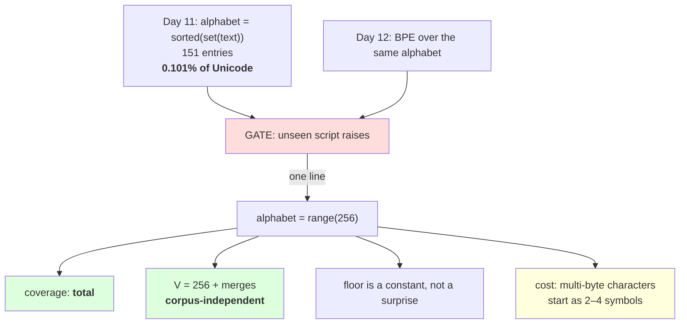

# 3.1 — The alphabet becomes 256

## One-line answer

Change one line — `sorted(set(text))` becomes `range(256)` — and the last gate Day 11 left open closes:
the alphabet stops being a description of the corpus, `V` becomes `256 + len(merges)` for every corpus
in every language, and there is no text the tokenizer cannot represent.

---

## The story

A shop that cuts keys keeps a rack of blanks.

For years the rack held the blanks for the locks in the surrounding streets — whatever people had
actually brought in. It worked, and every so often somebody arrived with a key it could not copy, and
they were sent away.

Then the shop switched to a different system: instead of stocking finished blanks, it stocks the raw
strip and cuts every blank from that. The rack is smaller now. Nobody is sent away.

The shop did not get better at guessing which locks people have. It stopped guessing.

---

## The idea in plain language

Day 11 part [3.1](../../../day-011-character-and-word-tokenizers/parts/03-together/3.1-two-tokenizers-one-table.md)
sorted its findings into trades and gates, and ended with one gate still open: **the character
tokenizer's alphabet came from the corpus**, so it covered 0.101% of assigned Unicode and raised on the
first document in an unseen script. Day 12 part
[2.3](../../../day-012-bpe-the-merge-loop/parts/02-training-a-vocabulary/2.3-reading-the-table.md)
confirmed BPE did nothing about it: merges combine symbols and never add one.

Day 11 also said that gate had a handle on it. This is the handle:

```
alphabet = sorted(set(text))        # Day 11 and 12
alphabet = [BYTE_ENCODER[b] for b in range(256)]   # today
```

That is the entire change. The merge loop, the pre-tokenizer, the encoder, the artifact format and the
id scheme are all unchanged. What changes is where the symbols come from, and four consequences follow
that are out of all proportion to the size of the edit.

**Coverage becomes total.** Day 10 part
[2.4](../../../day-010-unicode-code-points-bytes/parts/02-utf-8-and-bytes/2.4-256-is-a-vocabulary.md)
established the argument and this is where it is cashed: every text is a byte string, every byte is one
of 256, and all 256 are in the table. Measured in part
[3.3](3.3-zero-out-of-vocabulary.md), five scripts and an emoji sequence all encode and round-trip with
nothing missing. **There is no input for which this raises**, which is a stronger claim than any coverage
percentage.

**`V` stops depending on the data.** `V = 256 + len(merges)`, always. Day 12's `V = 300` was 151 corpus
characters plus 149 merges, and a corpus in another language would have given a different split for the
same target. Part [1.3](../01-encode-and-decode/1.3-from-tokens-to-ids.md) already used this: you can
size an embedding matrix before you have seen the corpus.

**The alphabet floor becomes a known constant.** Day 12 part
[1.3](../../../day-012-bpe-the-merge-loop/parts/01-the-merge-loop/1.3-the-loop-and-where-it-stops.md)
noted that the alphabet is a floor below which no target can go. At 151 that floor was a surprise waiting
in the data; at 256 it is a number you can write in a config. And on a large multilingual corpus a
*character* alphabet can be tens of thousands of entries — every distinct Chinese character is one — so
the floor would eat most of a small vocabulary. 256 does not.

**Merges now have to reassemble multi-byte characters.** This is the cost, and it is real. A Devanagari
letter is three bytes, so the tokenizer starts from three symbols where a character-level one started
from one. Part [3.4](3.4-the-vocabulary-you-cannot-read.md) measures what that spends.

One thing that does **not** change and is worth saying: the tokenizer is still lossless, still
order-dependent, still has the same failure modes for numbers and boundaries. **Byte-level fixes coverage
and nothing else.** Every other property is inherited unchanged from Day 12.

---

## Why Akshara needs it

- **Part [3.3](3.3-zero-out-of-vocabulary.md)** measures the coverage claim across scripts, which is the
  whole point of the change.
- **Part [3.4](3.4-the-vocabulary-you-cannot-read.md)** measures what it costs, so the day does not end
  on an unqualified win.
- **Part [4.1](../04-together/4.1-four-tokenizers-one-table.md)** closes Day 11's scoreboard, and this is
  the row that closes the last open item.
- **Day 51 onward**, the pretraining corpus is whatever text you can get. A tokenizer that raises on an
  unexpected script is a job that dies overnight; this one cannot.

---

## The mechanism

The change, in the trainer:

```python
def train(text: str, target_vocab: int, pattern: str = GPT_LIKE):
    """Byte-level BPE. The only difference from Day 12 is where `alphabet` comes from."""
    alphabet = [BYTE_ENCODER[b] for b in range(256)]
    words = word_counts(text, pattern)
    merges: list[tuple[str, str]] = []

    for _ in range(max(0, target_vocab - len(alphabet))):
        pairs = pair_counts(words)
        if not pairs:
            break
        best = max(pairs.items(), key=lambda kv: (kv[1], kv[0]))[0]
        if pairs[best] < 2:
            break
        words = {merge_word(w, best): n for w, n in words.items()}
        merges.append(best)

    return alphabet + ["".join(m) for m in merges], merges
```

**Line by line:**
- `[BYTE_ENCODER[b] for b in range(256)]` is the whole change. `BYTE_ENCODER` is part
  [3.2](3.2-the-byte-to-unicode-trick.md)'s mapping from byte value to a printable character; for now,
  read it as "the 256 byte symbols, in byte order".
- **`range(256)` is not `sorted(set(...))` of anything.** The alphabet does not look at `text` at all,
  which is why `V` is predictable and why the byte block is identical in every byte-level tokenizer ever
  built — part 1.3 checked that.
- `word_counts` now splits each chunk into **bytes** rather than characters. That is the second half of
  the change and it lives in `to_symbols`, part 3.2's function.
- The loop body is byte-for-byte Day 12 part
  [1.3](../../../day-012-bpe-the-merge-loop/parts/01-the-merge-loop/1.3-the-loop-and-where-it-stops.md)'s,
  including the `(count, pair)` tie-break from part
  [2.5](../../../day-012-bpe-the-merge-loop/parts/02-training-a-vocabulary/2.5-the-vocabulary-that-depended-on-the-order-of-the-corpus.md).
  **Nothing about the algorithm is byte-specific**, which is the point: the symbols changed, not the
  method.
- `max(0, target_vocab - 256)` now has a constant in it, so asking for `V = 200` gives zero merges and a
  vocabulary of 256 — a knowable outcome rather than a corpus-dependent one.

Train it and compare against Day 12's character-level run on the same corpus:

```python
import hashlib
import time
from pathlib import Path

raw = Path("docs/00_MASTER_PLAN.md").read_bytes()
text = raw.decode("utf-8")
print("  corpus sha256[:16] :", hashlib.sha256(raw).hexdigest()[:16])
print("  characters:", len(text), " utf-8 bytes:", len(raw))

for target in (500, 1000):
    t0 = time.perf_counter()
    vocab, merges = train(text, target)
    dt = time.perf_counter() - t0
    toks = tokenize(text, merges)
    print(f"  V={len(vocab):>5} merges={len(merges):>5} tokens={len(toks):>7} "
          f"chars/token={len(text) / len(toks):>5.2f} bytes/token={len(raw) / len(toks):>5.2f} "
          f"train={dt:>5.1f}s")
```

**Line by line:**
- Both a **characters per token** and a **bytes per token** column, because for a byte-level tokenizer the
  second is the natural one and the first is what compares with Days 11 and 12. Day 10 part
  [3.1](../../../day-010-unicode-code-points-bytes/parts/03-together/3.1-one-string-five-layers.md)'s rule:
  name the unit, and where two units are in play, print both.
- The two differ by the corpus's bytes-per-character ratio — 113,283 over 110,837, or 1.022 — which is
  small here because the corpus is mostly ASCII and would be 2.75 for Devanagari.
- Measured on Intel Core i3-1115G4 (2 cores / 4 threads), 11.7 GB RAM, Windows 11, CPython 3.12.12, on
  2026-08-27:

```text
  corpus sha256[:16] : 9760f2b6d4340b97
  characters: 110837  utf-8 bytes: 113283
  V=  500 merges=  244 tokens=  60738 chars/token= 1.82 bytes/token= 1.87 train=  6.9s
  V= 1000 merges=  744 tokens=  46311 chars/token= 2.39 bytes/token= 2.45 train= 20.2s
```

Now put those next to Day 12's character-level rows on the same corpus:

| | alphabet | `V` | merges | tokens | chars/token |
| --- | --- | --- | --- | --- | --- |
| Day 12, character-level | 151 from the corpus | 500 | 349 | 53,588 | 2.07 |
| Day 13, byte-level | **256, fixed** | 500 | 244 | 60,738 | 1.82 |
| Day 12, character-level | 151 from the corpus | 1,000 | 849 | 42,130 | 2.63 |
| Day 13, byte-level | **256, fixed** | 1,000 | 744 | 46,311 | 2.39 |

**Byte-level compresses worse at the same `V`, and the reason is in the merges column.** At `V = 500` the
character-level tokenizer got 349 merges and the byte-level one got 244, because 256 of the byte-level
vocabulary is spent on the alphabet against 151. **Over a hundred fewer merges is where the compression
went**, and it is arithmetic rather than a property of bytes.

That gap closes as `V` grows: at 500 the byte alphabet is 51% of the vocabulary, at 1,000 it is 26%, and
at a realistic 32,000 it is 0.8%. **The byte alphabet's cost is a fixed overhead, so it matters at toy
vocabulary sizes and disappears at real ones** — which is worth knowing before reading the table as a
verdict.

And the column that is not in the table:

```python
for name, probe in (("English", "the quick brown fox"),
                    ("Cyrillic", "\u043f\u0440\u0438\u0432\u0435\u0442"),
                    ("Chinese", "\u4f60\u597d")):
    toks = tokenize(probe, merges)
    print(f"    {name:<9} {len(toks):>3} tokens  round trip="
          f"{from_symbols(toks) == probe}")
```

**Line by line:**
- There is **no `try`** anywhere in this block, and that absence is the claim. Day 12 part 2.3's version
  of this measurement needed one, and printed `KeyError` for four of five scripts.
- `from_symbols(toks)` reassembles the byte symbols and decodes; part 3.2 is the mechanism, part 3.3 is
  the full measurement.
- Measured on this machine, 2026-08-27:

```text
    English   10 tokens  round trip=True
    Cyrillic  12 tokens  round trip=True
    Chinese    6 tokens  round trip=True
```

**Three scripts, three round trips, no exception.** The Cyrillic word costs 12 tokens against Day 12's
`KeyError`, and that is the trade in one line: **the coverage gate closed and the bill arrived as
sequence length.** Part [3.3](3.3-zero-out-of-vocabulary.md) measures the bill properly.



---

## When it breaks

**The loud failure — a target below the alphabet, now with a constant:**

```console
>>> vocab, merges = train("hello world", target_vocab=100)
>>> len(vocab), len(merges)
(256, 0)
```

What it means: 256 is the floor, so a target of 100 gives a vocabulary of 256 and no merges. It does not
raise — the same behaviour Day 12 part 1.3 measured — but now the outcome is **predictable without seeing
the corpus**, which is what makes it a config error you can catch in review rather than a surprise at
training time.

**The second loud failure — mixing a byte-level merge list with a character-level alphabet:**

```console
>>> vocab = sorted(set(text)) + ["".join(m) for m in byte_merges]
>>> decode_ids([99, 97, 102], vocab)
'&\\'('
```

What it means: the merges were learned over byte symbols and the vocabulary was built from characters, so
id 99 indexes the 100th *character* rather than the byte `c`. It does not raise; it decodes to something.
**This is Day 9 part 2.5's mismatch with a new cause**, and part 2.1 of Day 12 put the alphabet in the
artifact and the hash precisely so that the two cannot be paired by accident.

**The silent failure — reading the compression table as a verdict.** Byte-level is worse at `V = 500` and
the reason is arithmetic:

```text
  V=500  character-level: 151 alphabet + 349 merges -> 2.07 chars/token
  V=500  byte-level     : 256 alphabet + 244 merges -> 1.82 chars/token
  conclusion if read alone: "byte-level compresses 12% worse"
  what is actually true   : byte-level got 105 fewer merges at the same V
  at V=32000              : the alphabet is 0.8% of the vocabulary and the gap closes
  and the column not shown: character-level raises on 4 of 5 scripts
```

**The check that catches it** compares at a fixed *merge count* rather than a fixed `V`:

```python
def compare_at_equal_merges(text: str, n_merges: int) -> None:
    """Compare alphabets fairly: the same number of learned merges, not the same V."""
    char_vocab, char_merges = train_char_level(text, 151 + n_merges)
    byte_vocab, byte_merges = train(text, 256 + n_merges)
    assert len(char_merges) == len(byte_merges) == n_merges, "a trainer stopped early"

    for name, vocab, merges, pat in (("character", char_vocab, char_merges, GPT_LIKE),
                                     ("byte", byte_vocab, byte_merges, GPT_LIKE)):
        toks = tokenize(text, merges, pat)
        print(f"  {name:<10} V={len(vocab):>5} merges={len(merges):>5} "
              f"chars/token={len(text) / len(toks):>5.2f}")
```

**Line by line:**
- The two targets are `151 + n` and `256 + n`, so both trainers make **exactly `n` merges** and the
  comparison is between what the merges learned rather than between how many there were.
- The `assert` catches a trainer stopping early, which would silently make the comparison unequal again —
  Day 12 part 1.3's failure, arriving inside a measurement.
- The `V` column is still printed and is **deliberately different** between the rows. Hiding it would
  suggest the two tokenizers are interchangeable; showing it makes the alphabet's cost visible while the
  comparison stays fair.
- What this cannot equalise is coverage, and it should not try: the character-level row raises on text
  the byte-level row handles, and no fair-comparison framing makes those two the same tokenizer.

---

## In production

**What a research engineer writes instead of the teaching version.** Exactly this, and they do not think
about it — byte-level is the default and has been for years, for the reason this part gives. What they do
think about is the **vocabulary size**, because the 256-entry floor means a small vocabulary is mostly
alphabet: at `V = 1000` a quarter of the table is bytes, which is why real vocabularies are tens of
thousands.

The second habit is that **the alphabet goes in the artifact anyway**, even though it is derivable from
`range(256)`. Day 12 part 2.1 put it there and it stays there, because a file that says what it contains
can be validated, and one that relies on a convention cannot.

**What degrades at scale.** Nothing about the alphabet — 256 is 256. What improves is its relative cost:
the fixed overhead becomes negligible as `V` grows, so the compression gap measured here is a small-`V`
artefact. What genuinely degrades is the **multi-byte tax**: a corpus in a 3-bytes-per-character script
starts from three times as many symbols, so more of the merge budget goes on reassembling characters
before any linguistic structure is learned. Part 3.4 measures that on this corpus and Day 17 measures it
across languages.

**The failure that only shows with real data.** Corpora that are not text. A byte-level tokenizer will
happily encode a truncated file, a mislabelled encoding or a binary blob that got into the corpus — Day
10 part 2.4 called that the right behaviour and noted the consequence: **corpus junk is now invisible to
the tokenizer.** A character-level tokenizer would have raised and told you. The responsibility moves to
a data check, and if nobody wrote one, the junk is in the training data.

**The review comment.** *"The alphabet is `sorted(set(corpus))`, so this tokenizer will raise on any
script the corpus lacks and its `V` depends on what we happened to collect. Use the 256 bytes — it is one
line, `V` becomes predictable, and the coverage question goes away."*

**The interview question.** *"Why do modern tokenizers use a byte alphabet?"* The weak answer is "to
handle unicode". The strong answer is the two properties and the cost: **coverage becomes total by
construction rather than by having a big enough vocabulary, and `V` stops depending on the corpus, so
`V = 256 + merges` for every language.** Then the honest bill: *the price is that a multi-byte character
starts as two to four symbols, so at small vocabulary sizes the fixed 256-entry alphabet eats merges — I
measured 244 merges against a character-level 349 at the same `V = 500` — and that overhead becomes
negligible at realistic sizes.*

**Compute tier: T0.** The standard library on a laptop, over a 113,283-byte file in this repository. Two
training runs, the longer 20.2 seconds. No packages, no network, no GPU, no seed. **The two durations are
wall-clock on the hardware named above**; the token counts, ratios and the byte-alphabet properties are
not hardware-dependent. Every figure reproduces for anyone whose corpus hash matches `9760f2b6d4340b97`,
and **the coverage claim does not depend on the corpus at all** — that is the point of it. What T0 cannot
show is whether byte-level trains a better model at fixed compute; that is Day 17, and this part decides
on coverage, which is a property rather than a benchmark.

---

## Check yourself

Run this. It prints **a Cyrillic word encoding without a `try` block**:

```python
import hashlib
from pathlib import Path

raw = Path("docs/00_MASTER_PLAN.md").read_bytes()
text = raw.decode("utf-8")
print("  corpus sha256[:16] :", hashlib.sha256(raw).hexdigest()[:16])

vocab, merges = train(text, 1000)
print("  V        :", len(vocab), "= 256 +", len(merges))
print("  alphabet does not depend on the corpus:",
      [BYTE_ENCODER[b] for b in range(256)] == vocab[:256])

for name, probe in (("English", "the quick brown fox"),
                    ("Cyrillic", "\u043f\u0440\u0438\u0432\u0435\u0442"),
                    ("Chinese", "\u4f60\u597d"),
                    ("Devanagari", "\u0936\u092c\u094d\u0926")):
    toks = tokenize(probe, merges)
    print(f"  {name:<11} {len(toks):>3} tokens  round trip={from_symbols(toks) == probe}")

small, small_merges = train(text, 100)
print("  target 100 ->  V =", len(small), " merges =", len(small_merges))
```

**Line by line:**
- Every script prints `round trip=True` and **there is no `try`**. Say out loud what Day 12 part 2.3
  printed for the same three probes.
- `alphabet does not depend on the corpus` prints `True`. Say what that buys you when sizing an embedding
  matrix before the data arrives.
- The Cyrillic row costs 12 tokens for 6 characters. Say where the factor of two comes from, and check it
  against Day 10 part 2.4's width table.
- `target 100` gives `V = 256` and zero merges. Say why that is better than Day 12's version of the same
  mistake, even though neither raises.

**Say this out loud, without scrolling up:** state the one-line change, name the two properties it buys
and the one it costs, and say why the compression gap at `V = 500` is arithmetic rather than a fact about
bytes.
