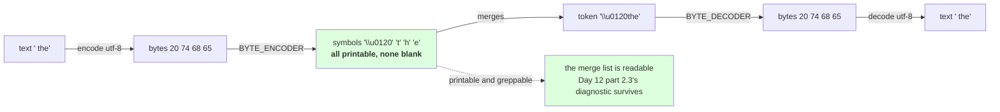

# 3.2 — The byte-to-unicode trick

## One-line answer

Byte `0x20` cannot be a token called `" "` — a vocabulary file full of spaces, tabs and control
characters is unreadable and unsplittable — so every byte is mapped to a **distinct printable non-space
character**: the space becomes `Ġ`, the newline becomes `Ċ`, and all 256 map to 256 different
visible symbols.

---

## The story

A warehouse labels its shelves with the names of what is on them.

Most labels are fine. Then somebody stocks an item whose name is a single space, another whose name is a
line break, and a third whose name is nothing at all. The labels print blank, the shelves look
unlabelled, and the stock list has three rows that are impossible to tell apart on paper.

The fix is not to rename the items. It is to give every item a **code** for the label — short, always
visible, never blank — and keep a sheet mapping codes to items. The items are unchanged. The labels are
now readable.

---

## The idea in plain language

Part [3.1](3.1-the-alphabet-becomes-256.md) said the alphabet is the 256 bytes and left one thing
unexplained: bytes are numbers, and the whole machinery of Days 12 and 13 works on **strings**.
`pair_counts` uses tuples of strings, `merge_word` concatenates with `+`, a token is `"".join(m)`, and
the artifact is JSON. Something has to turn a byte into a string.

The obvious answer is `chr(b)` — byte `65` becomes `"A"`, byte `32` becomes `" "`. It works and it makes
the tokenizer unusable in three specific ways:

- **The vocabulary file is unreadable.** Day 12 part
  [2.3](../../../day-012-bpe-the-merge-loop/parts/02-training-a-vocabulary/2.3-reading-the-table.md)
  argued that reading the merge list is the cheapest diagnostic in tokenization. A merge list containing
  raw newlines, tabs and control characters cannot be read, diffed or grepped.
- **Tokens containing whitespace are indistinguishable.** A token that is one space and a token that is
  two look the same in every listing. Day 12 part
  [1.5](../../../day-012-bpe-the-merge-loop/parts/01-the-merge-loop/1.5-the-merge-that-ate-the-space.md)'s
  entire failure was invisible without `ascii()`; this makes it invisible even with it.
- **Bytes `0x80`–`0xFF` are not valid characters on their own.** `chr(0xC3)` is a perfectly good code
  point, but round-tripping a vocabulary through a text file means encoding and decoding it, and a file
  of arbitrary code points has its own encoding question — which is the problem the tokenizer exists to
  solve, reintroduced one level up.

So byte-level tokenizers use a **byte-to-unicode map**: a fixed bijection from the 256 byte values to 256
distinct characters, all printable, none whitespace. The mapping is arbitrary in the sense that any
bijection would work, and it is **fixed** in the sense that everybody uses the same one, so a vocabulary
file is portable.

The construction, which is worth following because it looks odd until you see the constraint:

1. Take the byte ranges that are **already printable and not space** — `!` to `~`, and two runs in the
   Latin-1 supplement. Those bytes map to themselves.
2. Every remaining byte — the control characters, the space, and the gaps — is mapped to a code point
   starting at `256` and counting up.

Measured below: byte `0x41` maps to `"A"` (itself), byte `0x20` maps to `Ġ`, byte `0x0a` maps to
`Ċ`. **The printable ASCII is untouched**, which is why a merge list is still mostly readable
English, and the awkward bytes get pushed into a region of Unicode where they are visible.

That is the whole trick, and its payoff is what you see in every merge list in this day: `Ġthe` for
` the`, with the leading space rendered as a visible character you can see, count and grep for.

One consequence to be clear about: **a token is now a string of symbols, not text.** Part
[2.3](../02-the-regex-pre-tokenizer/2.3-what-the-pattern-costs-and-buys.md) measured what happens when you
forget that — an audit that classified symbols as letters reported 15 letter-and-digit merges that did not
exist, because `Ġ` is alphabetic. **To ask a question about the text a token stands for, map it back
to bytes first.**

---

## Why Akshara needs it

- **Part [3.3](3.3-zero-out-of-vocabulary.md)** relies on `to_symbols` and `from_symbols` being exact
  inverses; this part is where that is established.
- **Part [3.4](3.4-the-vocabulary-you-cannot-read.md)** reads a byte-level merge list and finds it partly
  illegible even with this mapping — which is the honest limit of the trick.
- **Day 14** opens a production tokenizer whose vocabulary file uses this exact mapping. Recognising
  `Ġ` at the start of half the tokens is what makes that file readable at a glance.
- **Part [1.4](../01-encode-and-decode/1.4-the-token-that-was-half-a-character.md)**'s streaming decoder
  maps symbols back to bytes one token at a time, which only works because the mapping is per-byte.

---

## The mechanism

The map:

```python
def bytes_to_unicode() -> dict[int, str]:
    """A fixed bijection from the 256 byte values to 256 printable, non-space characters."""
    bs = (list(range(ord("!"), ord("~") + 1))
          + list(range(ord("\u00a1"), ord("\u00ac") + 1))
          + list(range(ord("\u00ae"), ord("\u00ff") + 1)))
    cs = bs[:]
    n = 0
    for b in range(256):
        if b not in bs:
            bs.append(b)
            cs.append(256 + n)
            n += 1
    return dict(zip(bs, (chr(c) for c in cs)))


BYTE_ENCODER = bytes_to_unicode()
BYTE_DECODER = {v: k for k, v in BYTE_ENCODER.items()}
```

**Line by line:**
- The three `range` calls are the bytes that are **already safe**: `!` (0x21) to `~` (0x7E) is printable
  ASCII excluding the space; the two Latin-1 runs skip `0xAD`, the soft hyphen, which is a formatting
  character that many renderers hide. **The space is deliberately excluded from the first range** — it
  starts at `!`, not at `' '` — because a token containing an invisible space is the thing this map
  exists to prevent.
- `cs = bs[:]` copies, so the safe bytes map to themselves. Without the copy, `cs` and `bs` are the same
  list and the append loop corrupts both — a real and silent bug.
- The loop walks all 256 byte values and gives each **unmapped** one the next code point from `256`
  upward. That region is Latin Extended-A, whose characters are printable and unremarkable, and using it
  is a convention rather than a requirement.
- `b not in bs` is a linear scan of a growing list, so this is `O(256²)` — about 65,000 comparisons, once,
  at import. It is written this way because it mirrors the published construction and because the cost is
  invisible; a `set` would be faster and less recognisable.
- `BYTE_DECODER` inverts the map. It is built from `BYTE_ENCODER` rather than independently, so the two
  cannot drift — the same argument Day 11 part
  [1.1](../../../day-011-character-and-word-tokenizers/parts/01-character-level/1.1-from-a-script-to-a-module.md)
  made for `stoi` and `itos`.

Check the properties that make it usable:

```python
print("  byte map entries    :", len(BYTE_ENCODER))
print("  distinct characters :", len(set(BYTE_ENCODER.values())))
print("  any whitespace?     :", any(c.isspace() for c in BYTE_ENCODER.values()))
print("  any unprintable?    :", any(not c.isprintable() for c in BYTE_ENCODER.values()))
for b in (0x20, 0x41, 0x0a, 0x09, 0x00, 0xc3, 0xff):
    print(f"    byte 0x{b:02x} -> {ascii(BYTE_ENCODER[b])}  (U+{ord(BYTE_ENCODER[b]):04X})")
```

**Line by line:**
- `len(BYTE_ENCODER) == len(set(values))` is the **bijection check**: 256 keys and 256 distinct values. If
  two bytes mapped to the same character the tokenizer would be lossy in a way nothing downstream could
  detect, so this is the assertion that matters most.
- `any(c.isspace())` and `any(not c.isprintable())` are the two properties the construction exists for,
  checked rather than assumed.
- The sample bytes are chosen one per case: the space, an untouched letter, a newline, a tab, the null
  byte, a UTF-8 continuation-range byte and the last byte.
- Measured on Intel Core i3-1115G4 (2 cores / 4 threads), 11.7 GB RAM, Windows 11, CPython 3.12.12, on
  2026-08-27:

```text
  byte map entries    : 256
  distinct characters : 256
  any whitespace?     : False
  any unprintable?    : False
    byte 0x20 -> '\u0120'  (U+0120)
    byte 0x41 -> 'A'  (U+0041)
    byte 0x0a -> '\u010a'  (U+010A)
    byte 0x09 -> '\u0109'  (U+0109)
    byte 0x00 -> '\u0100'  (U+0100)
    byte 0xc3 -> '\xc3'  (U+00C3)
    byte 0xff -> '\xff'  (U+00FF)
```

**256 keys, 256 distinct values, no whitespace, nothing unprintable.** Byte `0x41` is still `A`, which is
why merge lists read as English. Byte `0x20` — the space — is `U+0120`, and that single fact explains
every `Ġ` you have seen in this day's merge lists.

Note that `0x00`, `0x09` and `0x0a` land at `U+0100`, `U+0109` and `U+010A` — **byte value plus 256**, for
the control characters at the bottom. That is not a rule of the construction, it is what falls out when
the first 33 unmapped bytes happen to be `0x00`–`0x20` in order.

Now the two functions everything else uses:

```python
def to_symbols(chunk: str) -> tuple[str, ...]:
    """A chunk of text -> one symbol per UTF-8 byte, each a printable character."""
    return tuple(BYTE_ENCODER[b] for b in chunk.encode("utf-8"))


def from_symbols(symbols) -> str:
    return bytes(BYTE_DECODER[c] for c in "".join(symbols)).decode("utf-8", errors="replace")
```

**Line by line:**
- `chunk.encode("utf-8")` is the only place text becomes bytes, and it is explicit — Day 10 part
  [2.1](../../../day-010-unicode-code-points-bytes/parts/02-utf-8-and-bytes/2.1-text-has-to-become-bytes.md)'s
  rule. Iterating `bytes` yields integers, which is exactly what `BYTE_ENCODER` is keyed on.
- `from_symbols` takes an **iterable of symbols** and joins them first, so it works on a list of tokens as
  well as on a single token. That matters because a token is itself several symbols after merging.
- `bytes(...)` from a generator of integers rebuilds the byte string, then one `decode` turns it into
  text. **One decode for the whole sequence** — not one per token — which is why part
  [1.4](../01-encode-and-decode/1.4-the-token-that-was-half-a-character.md)'s prefix decoding is the
  failure it is.
- `errors="replace"` is a deliberate choice for a *batch* decoder that must return something. Part 1.4's
  streaming decoder uses `errors="strict"` instead, and the difference between them is the subject of that
  part.

Check the inverse property:

```python
PROBES = ["the quick brown fox", "café", "привет", "你好",
          "\U0001F468‍\U0001F469‍\U0001F467‍\U0001F466", "", " ", "\n\t"]
for probe in PROBES:
    syms = to_symbols(probe)
    print(f"    {ascii(probe):<40} {len(probe):>2} chars -> {len(syms):>3} symbols  "
          f"round trip={from_symbols(syms) == probe}")
```

**Line by line:**
- The probe list covers one case per width — one, two, three and four bytes per character — plus the
  three that break naive implementations: the empty string, a bare space, and whitespace-only.
- `len(probe)` against `len(syms)` is the character-to-byte expansion, which is Day 10 part 2.4's table
  measured through this mapping.
- Measured on this machine, 2026-08-27:

```text
    'the quick brown fox'                            19 chars ->  19 symbols  round trip=True
    'caf\xe9'                                         4 chars ->   5 symbols  round trip=True
    '\u043f\u0440\u0438\u0432\u0435\u0442'            6 chars ->  12 symbols  round trip=True
    '\u4f60\u597d'                                    2 chars ->   6 symbols  round trip=True
    '\U0001f468\u200d\U0001f469\u200d\U0001f467\u200d\U0001f466'  7 chars ->  25 symbols  round trip=True
    ''                                                0 chars ->   0 symbols  round trip=True
    ' '                                               1 chars ->   1 symbols  round trip=True
    '\n\t'                                            2 chars ->   2 symbols  round trip=True
```

**Every round trip is `True`, including the empty string.** And the expansion column is Day 10's width
table exactly: 1 byte for ASCII, 2 for the accented letter, 2 per Cyrillic character, 3 per Chinese
character, and 25 symbols for the seven-code-point family emoji.



---

## When it breaks

**The loud failure — a symbol that is not in the map:**

```console
>>> from_symbols(["hello"])
Traceback (most recent call last):
  File "<stdin>", line 1, in <module>
  File "<stdin>", line 2, in from_symbols
  File "<stdin>", line 2, in <genexpr>
KeyError: 'h'
```

Wait — `h` **is** in the map, as itself. The failure needs a character outside the 256:

```console
>>> from_symbols(["\u0936"])
Traceback (most recent call last):
  File "<stdin>", line 1, in <module>
  File "<stdin>", line 2, in from_symbols
  File "<stdin>", line 2, in <genexpr>
KeyError: '\u0936'
```

What it means: a Devanagari character was passed to a function that expects **byte symbols**, not text. It
happens when somebody builds a vocabulary entry from raw text instead of from `to_symbols`, and the
`KeyError` is the correct loud outcome — the alternative would be silently dropping it.

**The silent failure — the aliasing bug in the construction.** Drop the copy and both lists grow together:

```text
  cs = bs      instead of      cs = bs[:]
  the append loop then appends to ONE list twice
  result: a map with fewer than 256 entries, or duplicate values
  what breaks: two bytes share a symbol, so from_symbols returns the wrong byte
  what raises: nothing — the tokenizer trains, encodes and decodes to almost-right text
  the check  : len(set(BYTE_ENCODER.values())) == 256
```

**The check that catches both** asserts the bijection and the inverse:

```python
def assert_byte_map_is_sound(encoder: dict[int, str], decoder: dict[str, int]) -> None:
    """256 bytes, 256 distinct printable non-space symbols, and an exact inverse."""
    assert set(encoder) == set(range(256)), "the encoder does not cover every byte"
    assert len(set(encoder.values())) == 256, "two bytes share a symbol"
    assert all(len(c) == 1 for c in encoder.values()), "a symbol is not a single character"
    assert not any(c.isspace() for c in encoder.values()), "a symbol is whitespace"
    assert all(c.isprintable() for c in encoder.values()), "a symbol is unprintable"
    assert all(decoder[encoder[b]] == b for b in range(256)), "encoder and decoder disagree"


def assert_symbols_round_trip(probes: list[str]) -> None:
    for p in probes:
        assert from_symbols(to_symbols(p)) == p, f"round trip failed on {ascii(p)}"
        assert len(to_symbols(p)) == len(p.encode("utf-8")), \
            f"symbol count does not match byte count for {ascii(p)}"
```

**Line by line:**
- `set(encoder) == set(range(256))` checks **coverage**, and `len(set(values)) == 256` checks
  **injectivity**. Both are needed: a map could cover every byte and still collide.
- `len(c) == 1` catches a symbol that is a multi-character string, which would break `from_symbols`'s
  per-character lookup silently — it iterates `"".join(symbols)` one character at a time.
- `decoder[encoder[b]] == b` for every byte is the inverse check, done exhaustively because 256 is small
  enough that sampling would be a false economy.
- The second function's **second** assertion is the one people omit: the symbol count must equal the byte
  count. A mapping that produced two symbols for one byte would still round-trip and would break every
  count in this day, including part [1.3](../01-encode-and-decode/1.3-from-tokens-to-ids.md)'s
  `V = 256 + merges`.
- What neither checks is that the mapping matches anybody else's. Two tokenizers with *different* valid
  bijections are both correct and mutually unintelligible — which is why the mapping is a convention
  everybody follows rather than a free choice, and why Day 12 part 2.1 puts the alphabet in the artifact.

---

## In production

**What a research engineer writes instead of the teaching version.** This exact function, copied, because
it is a convention rather than a design decision: using a different bijection would make your vocabulary
files incompatible with every tool that reads them. What they do add is the assertion block above, run
once at import, because the aliasing bug is silent and the map is small enough to verify exhaustively.

The second habit is **recognising `Ġ` on sight**. In any byte-level vocabulary file, roughly half the
tokens begin with it — Day 12 part
[2.3](../../../day-012-bpe-the-merge-loop/parts/02-training-a-vocabulary/2.3-reading-the-table.md)
measured 142 of 349 in a character-level list and the byte-level share is similar. Knowing that it is the
space turns an intimidating file into a readable one.

**What degrades at scale.** Nothing — the map is 256 entries and built once. What can bite is the
`O(256²)` construction being called repeatedly: it is cheap once and not cheap in a loop, and putting it
at module scope rather than inside a constructor is the whole fix.

**The failure that only shows with real data.** Vocabulary files edited by hand or by a tool that
normalizes text. `Ġ` is an ordinary Latin Extended-A character, so a well-meaning `NFKC` pass — Day
10 part [1.3](../../../day-010-unicode-code-points-bytes/parts/01-code-points-and-graphemes/1.3-normalization-one-spelling-for-the-same-thing.md)
— or a text editor that strips unusual characters will silently alter a vocabulary file and change what
every token means. **The file is text and is not prose**, and anything that processes it as prose will
damage it.

**The review comment.** *"The vocabulary is being built with `chr(b)` for each byte. That puts raw
newlines and control characters in the merge list, so it is not readable or greppable, and two
whitespace tokens are indistinguishable. Use the standard byte-to-unicode map."*

**The interview question.** *"Why does a GPT vocabulary file have `Ġ` all over it?"* The weak answer is
that it is an encoding artefact. The strong answer names the constraint and the solution: **a byte-level
tokenizer's symbols have to be strings, and using `chr(b)` directly puts spaces, newlines and control
characters into the vocabulary — so every byte is mapped to a distinct printable non-space character, and
the space happens to land on `U+0120`.** Then the practical consequence: *printable ASCII maps to itself,
so the file is still readable, and a token that looks like it starts with a strange letter is a token that
starts with a space.*

**Compute tier: T0.** The standard library on a laptop. The map is 256 entries built once; the probe round
trips are instantaneous. No packages, no network, no GPU, no seed. **Nothing in this part depends on the
corpus** — the map, its properties and the round trips are the same on every machine and for every
tokenizer — which makes it the one part of Day 13 whose numbers you can check without a corpus hash. What
T0 cannot show is compatibility with a specific published vocabulary; Day 14 loads one and the mapping is
the first thing that has to agree.

---

## Check yourself

Run this. It prints **256 distinct printable symbols and the code point the space landed on**:

```python
print("  entries          :", len(BYTE_ENCODER))
print("  distinct symbols :", len(set(BYTE_ENCODER.values())))
print("  any whitespace   :", any(c.isspace() for c in BYTE_ENCODER.values()))
print("  space  0x20 ->", ascii(BYTE_ENCODER[0x20]), f"U+{ord(BYTE_ENCODER[0x20]):04X}")
print("  newline 0x0a ->", ascii(BYTE_ENCODER[0x0a]), f"U+{ord(BYTE_ENCODER[0x0a]):04X}")
print("  letter  0x41 ->", ascii(BYTE_ENCODER[0x41]))
print("  bytes that map to themselves:",
      sum(1 for b in range(256) if BYTE_ENCODER[b] == chr(b)))

for probe in ("the quick brown fox", "caf\u00e9", "\u4f60\u597d", "", "\n\t"):
    syms = to_symbols(probe)
    print(f"  {ascii(probe):<26} {len(probe):>2} chars -> {len(syms):>3} symbols  "
          f"round trip={from_symbols(syms) == probe}")
```

**Line by line:**
- `distinct symbols` prints `256`. **Say out loud what would break if it printed 255, and say whether
  anything would raise.**
- `space 0x20` prints `U+0120`. Say how many tokens in a typical byte-level merge list begin with that
  character, and why.
- `bytes that map to themselves` prints a number under 256. Say which bytes those are and why leaving them
  alone matters for reading a vocabulary file.
- The empty-string row prints `0 chars -> 0 symbols` and `True`. Say why that row is in the probe list at
  all, and name one implementation it would catch.

**Say this out loud, without scrolling up:** name the three problems `chr(b)` causes in a vocabulary file,
say which byte `Ġ` stands for, and say why you must map a token back to bytes before asking whether
it contains a letter.
