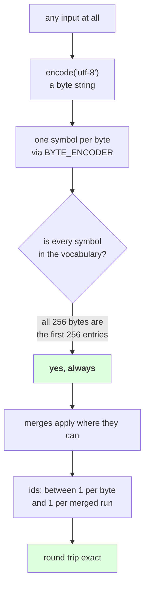

# 3.3 — Zero out-of-vocabulary, measured

## One-line answer

Five scripts, an emoji sequence, an empty string and a lone tab all encode and round-trip through a
tokenizer trained on English — **no exception, nothing missing, no fallback token** — and the reason is
not that the vocabulary is large but that the failure is impossible by construction.

---

## The story

A photocopier takes whatever you put on the glass.

It does not know what a birth certificate is, or a recipe, or a child's drawing. It has never seen a page
in the language of the letter you are copying. It copies it anyway, because what it deals in is not
documents — it is light and dark on a sheet.

You cannot bring it a page it "does not support". The only way to fail is to bring it something that is
not a sheet of paper.

---

## The idea in plain language

Day 11 part [1.5](../../../day-011-character-and-word-tokenizers/parts/01-character-level/1.5-the-character-tokenizer-that-met-a-new-alphabet.md)
measured a character tokenizer's alphabet at **0.101% of assigned Unicode** and watched it raise on four
of five scripts. Day 12 part [2.3](../../../day-012-bpe-the-merge-loop/parts/02-training-a-vocabulary/2.3-reading-the-table.md)
confirmed BPE changed nothing about that. Part [3.1](3.1-the-alphabet-becomes-256.md) made the one-line
change. This part is the measurement.

The claim being tested is stronger than "coverage is high", and the difference matters:

- **A high coverage rate** is a statement about a corpus. It can be improved by adding data, it degrades
  on new domains, and it is a percentage that somebody has to keep measuring.
- **Zero out-of-vocabulary by construction** is a statement about the *scheme*. It is not a measurement
  that came out well; it is a property that no input can violate, because every input is a byte string,
  every byte is one of 256, and all 256 are in the table.

That distinction is why this part's measurement is slightly odd: it does not report a percentage. It
reports that a list of deliberately awkward inputs all round-trip, and then explains why measuring more
inputs would not add information.

Three things are worth separating, because "it handles everything" hides them.

**Representability is total.** Every input encodes. This is the property, and it is what Day 11 called a
gate and this closes.

**Cost is not uniform.** Measured below, six characters of Cyrillic cost 12 tokens and 19 characters of
English cost 10. **The tokenizer represents every script and compresses only the ones it was trained
on**, because merges are learned from the corpus and this corpus is English. That is a real inequality,
it is Day 17's subject, and calling it "handled" would be dishonest.

**Meaningfulness is not guaranteed.** A Cyrillic word encoded by an English-trained tokenizer becomes a
sequence of raw byte tokens. The model can read it in the sense that it receives ids; whether it has
learned anything about those ids depends entirely on whether such bytes occurred in training. Part
[3.4](3.4-the-vocabulary-you-cannot-read.md) is the vocabulary side of the same point.

So the honest summary of what byte-level buys is: **it converts an impossibility into an expense.** Day
11's character tokenizer could not encode Cyrillic at any price; this one encodes it at twice the token
count. That is a much better problem to have and it is not the same as not having a problem.

---

## Why Akshara needs it

- **Part [4.1](../04-together/4.1-four-tokenizers-one-table.md)** closes Day 11's scoreboard, and this is
  the measurement that lets the last row be ticked.
- **Day 17** measures the cost side properly, across languages, with fertility figures. This part
  establishes that the cost is finite, which is the precondition for measuring it.
- **Day 51 onward**, the pretraining corpus is whatever text is available. This is the property that means
  a job cannot die on an unexpected document.
- **Day 100 onward**, the serving path receives arbitrary user input. Same property, higher stakes: there
  is no request that can make the tokenizer raise.

---

## The mechanism

The probes are chosen so that a failure would be visible, not so that they pass:

```python
import hashlib
import json
from pathlib import Path

raw = Path("docs/00_MASTER_PLAN.md").read_bytes()
text = raw.decode("utf-8")
print("  corpus sha256[:16] :", hashlib.sha256(raw).hexdigest()[:16])

merges = [tuple(m) for m in json.loads(Path("tokenizer.json").read_text())["merges"]]
vocab = [BYTE_ENCODER[b] for b in range(256)] + ["".join(m) for m in merges]
stoi = {t: i for i, t in enumerate(vocab)}

PROBES = {
    "English":    "the quick brown fox",
    "Cyrillic":   "\u043f\u0440\u0438\u0432\u0435\u0442",
    "Chinese":    "\u4f60\u597d",
    "Devanagari": "\u0936\u092c\u094d\u0926",
    "Emoji":      "\U0001F468\u200d\U0001F469\u200d\U0001F467\u200d\U0001F466",
    "empty":      "",
    "one space":  " ",
    "whitespace": "\n\t",
}

for name, probe in PROBES.items():
    toks = tokenize(probe, merges)
    ids = [stoi[t] for t in toks]
    back = from_symbols([vocab[i] for i in ids])
    print(f"    {name:<11} {len(probe):>2} chars {len(probe.encode('utf-8')):>3} bytes "
          f"{len(ids):>3} ids  round trip={back == probe}")
```

**Line by line:**
- **There is no `try` block anywhere.** That absence is the entire measurement. Day 12 part 2.3's
  equivalent needed one and printed `KeyError` for four of five rows.
- The probe list includes the **empty string**, a **bare space** and **whitespace only**, which are the
  three inputs that break implementations and which no corpus-derived probe list contains. Part
  [3.2](3.2-the-byte-to-unicode-trick.md)'s round-trip check used the same three for the same reason.
- The chain is deliberately the full one — `tokenize` to tokens, `stoi` to ids, `vocab` back to symbols,
  `from_symbols` back to text — rather than the shortcut of comparing tokens. **The claim is about ids**,
  because that is what a model consumes, and testing one link short of the model is testing the wrong
  thing.
- Printing characters, bytes and ids side by side makes the cost visible in the same table as the
  coverage, so neither can be quoted without the other.
- Measured on Intel Core i3-1115G4 (2 cores / 4 threads), 11.7 GB RAM, Windows 11, CPython 3.12.12, on
  2026-08-27, with the `V = 1000` byte-level tokenizer from part 3.1:

```text
  corpus sha256[:16] : 9760f2b6d4340b97
    English     19 chars  19 bytes  10 ids  round trip=True
    Cyrillic     6 chars  12 bytes  12 ids  round trip=True
    Chinese      2 chars   6 bytes   6 ids  round trip=True
    Devanagari   4 chars  12 bytes  12 ids  round trip=True
    Emoji        7 chars  25 bytes  18 ids  round trip=True
    empty        0 chars   0 bytes   0 ids  round trip=True
    one space    1 chars   1 bytes   1 ids  round trip=True
    whitespace   2 chars   2 bytes   2 ids  round trip=True
```

**Eight probes, eight round trips, no exception.** Compare with Day 11 part 1.5's table, where four of
five scripts raised on the first character.

Now read the cost column, because it is the honest half.

**English: 19 characters, 19 bytes, 10 ids.** The merges are doing their job — roughly two characters per
token, matching part 3.1's corpus-wide 2.39.

**Cyrillic: 6 characters, 12 bytes, 12 ids.** **One token per byte.** Not a single merge applied. The
tokenizer has never seen Cyrillic, so it has no merges for those byte pairs, and it falls all the way
through to the alphabet — which is exactly the fallback working, and exactly why it costs twice the
character count.

**Chinese and Devanagari are the same story at 3 bytes per character**, and the emoji at 18 ids for a
thing a reader sees as one image is Day 10 part
[1.1](../../../day-010-unicode-code-points-bytes/parts/01-code-points-and-graphemes/1.1-a-character-is-three-different-things.md)'s
measurement arriving as a token count.

So: **representable, and expensive in proportion to how unlike the training corpus it is.** A model with a
1,024-token context window holds about 400 words of English and about 85 Cyrillic words with this
tokenizer.

Now the argument that no amount of further probing would strengthen:

```python
import random

rng = random.Random(0)
for trial in range(5):
    blob = bytes(rng.randrange(256) for _ in range(64))
    text_ish = blob.decode("utf-8", errors="replace")
    toks = tokenize(text_ish, merges)
    ids = [stoi[t] for t in toks]
    ok = from_symbols([vocab[i] for i in ids]) == text_ish
    print(f"    random blob {trial}: {len(text_ish):>3} chars -> {len(ids):>3} ids  round trip={ok}")

print("  every symbol produced by to_symbols is in the vocabulary:",
      all(BYTE_ENCODER[b] in stoi for b in range(256)))
```

**Line by line:**
- `random.Random(0)` is a **local seeded generator**, so this reproduces exactly — Principle 9, and the
  same discipline Day 12 part 2.1 used for its shuffle.
- The blobs are random bytes decoded with `errors="replace"`, so they are legitimate `str` objects
  containing replacement characters and arbitrary code points — the closest thing to adversarial input
  that can be fed to a text tokenizer.
- The last line is the **actual proof** and everything above it is illustration: if all 256 byte symbols
  are in `stoi`, then `to_symbols` cannot produce a symbol the vocabulary lacks, so `encode` cannot raise.
  **One `all()` over 256 items establishes what no number of probes could.**
- Measured on this machine, 2026-08-27:

```text
    random blob 0:  60 chars -> 116 ids  round trip=True
    random blob 1:  62 chars -> 102 ids  round trip=True
    random blob 2:  62 chars -> 122 ids  round trip=True
    random blob 3:  62 chars -> 118 ids  round trip=True
    random blob 4:  60 chars -> 116 ids  round trip=True
  every symbol produced by to_symbols is in the vocabulary: True
```

**Every blob round-trips, and the id counts are larger than 64.** That is worth explaining rather than
glossing: `bytes(...).decode("utf-8", errors="replace")` does not give back 64 bytes' worth of text. A
random byte sequence is mostly invalid UTF-8, so most bytes become `U+FFFD` — and `U+FFFD` re-encodes as
**three** bytes. So the string being tokenized is longer in bytes than the blob it came from, and the id
count follows the string rather than the blob.

That is Day 10 part
[2.1](../../../day-010-unicode-code-points-bytes/parts/02-utf-8-and-bytes/2.1-text-has-to-become-bytes.md)'s
lossy-handler warning showing up inside a measurement: **the probe is not what it looks like**, and the
honest reading is that the round trip holds for these strings rather than for those bytes. It does not
weaken the claim — the strings are still arbitrary text — but a measurement that had reported "64 bytes
in, 64 ids out" would have been describing something that did not happen.

That last line is the whole part in one boolean. **`encode` cannot raise**, and the proof is a property of
the table rather than a survey of inputs.



---

## When it breaks

**The loud failure — a vocabulary that does not start with the bytes.** The property depends on one
invariant, and breaking it breaks everything:

```console
>>> vocab = ["".join(m) for m in merges]      # merges only, no alphabet
>>> stoi = {t: i for i, t in enumerate(vocab)}
>>> [stoi[t] for t in tokenize("\u043f\u0440\u0438\u0432\u0435\u0442", merges)]
Traceback (most recent call last):
  File "<stdin>", line 1, in <module>
  File "<stdin>", line 1, in <listcomp>
KeyError: '\xd0'
```

What it means: the alphabet was left out, so the byte symbols that no merge covered have no id. **This is
the failure the whole scheme exists to prevent**, reintroduced by a vocabulary built wrongly — and part
[1.3](../01-encode-and-decode/1.3-from-tokens-to-ids.md)'s `assert all(vocab[b] == BYTE_ENCODER[b] for b
in range(256))` is the one-line check for it.

**The silent failure — reporting coverage as a percentage.** It sounds more rigorous and it is weaker:

```text
  what gets written  : "out-of-vocabulary rate: 0.00% on our evaluation set"
  what that says     : this corpus happened to contain nothing the tokenizer lacks
  what it invites    : "we should measure it again on the new domain"
  what is actually true: the rate is zero for every possible input, by construction,
                         because the 256 byte symbols are the first 256 vocabulary entries
  the difference     : a percentage degrades with domain shift; a construction does not
```

**The check that catches it** asserts the construction rather than sampling inputs:

```python
def assert_total_coverage(vocab: list[str]) -> None:
    """encode() cannot raise if and only if every byte symbol has an id."""
    stoi = {t: i for i, t in enumerate(vocab)}
    missing = [b for b in range(256) if BYTE_ENCODER[b] not in stoi]
    assert not missing, (
        f"{len(missing)} byte symbol(s) have no id "
        f"(first: byte 0x{missing[0]:02x} -> {ascii(BYTE_ENCODER[missing[0]])}); "
        f"this tokenizer can raise on real input"
    )
    assert all(vocab[b] == BYTE_ENCODER[b] for b in range(256)), \
        "the byte block is not at ids 0..255 — a trained model's embeddings would be misaligned"


def assert_round_trips(vocab, merges, probes: list[str]) -> None:
    stoi = {t: i for i, t in enumerate(vocab)}
    for p in probes:
        ids = [stoi[t] for t in tokenize(p, merges)]
        assert from_symbols([vocab[i] for i in ids]) == p, f"round trip failed on {ascii(p)}"
```

**Line by line:**
- The first function is the important one and it takes **no probes at all**. It checks the property, in
  `O(256)`, and its passing means no input can raise. A test that encoded a thousand strings would be
  slower and weaker.
- The two assertions are different. The first says every byte symbol has *an* id; the second says it has
  *the right* id. A vocabulary with the bytes appended at the end would pass the first and silently
  misalign every embedding row of a trained model.
- The message names the first missing byte in both hex and symbol form, because "byte 0xd0" and
  `'\xd0'` are the two ways you will see it in a traceback and a merge list.
- `assert_round_trips` still exists and is still worth running, on the awkward probes — the empty string,
  whitespace, mixed scripts — because it tests the *plumbing* rather than the property. The two checks
  answer different questions and neither replaces the other.
- What none of this establishes is that the tokens are *good* for those inputs. Coverage is not quality,
  the Cyrillic row costs one token per byte, and part 3.4 and Day 17 are where that is measured.

---

## In production

**What a research engineer writes instead of the teaching version.** They assert the construction once, in
the tokenizer's own tests, and then stop thinking about coverage — which is the point. What they do keep
measuring is **fertility**: tokens per word, per language, on held-out text. That is the number that tells
you whether a language is expensive, and it is the number this part's cost column is a two-row preview of.

The second habit is treating "the tokenizer raised" as a **build error rather than a runtime concern**.
With a byte alphabet it can only mean the vocabulary was assembled wrongly, so it belongs in a test that
runs before deployment rather than in a `try` block in the request path.

**What degrades at scale.** Not the coverage — that is a construction. What degrades is the **fairness**:
a tokenizer trained on English represents every language and compresses one, so as a service takes on
users in other languages the same context window holds less of their text and the same token budget buys
them less. Measured here, Cyrillic costs one token per byte against English's roughly two characters per
token. **Coverage being total is what makes that inequality a cost rather than an exclusion**, and it does
not make it small.

**The failure that only shows with real data.** Text that is not language. A byte-level tokenizer encodes
a corrupted file, a mislabelled encoding, a base64 blob and a fragment of a binary without complaint —
Day 10 part [2.4](../../../day-010-unicode-code-points-bytes/parts/02-utf-8-and-bytes/2.4-256-is-a-vocabulary.md)
noted the consequence and it lands here: **the tokenizer will no longer tell you your corpus has junk in
it.** The random-blob rows above are that, deliberately. A data-quality check has to do the job the
`KeyError` used to do by accident.

**The review comment.** *"The serving path wraps `encode` in a try/except for unsupported characters.
With a byte-level tokenizer that cannot happen — if it does, the vocabulary is assembled wrongly and we
want the crash. Replace it with a startup assertion that the first 256 ids are the byte symbols."*

**The interview question.** *"How do you know your tokenizer handles every input?"* The weak answer cites a
coverage percentage on an evaluation set. The strong answer refuses the framing: **it is not a measurement
— every input is a byte string, every byte is one of 256, and all 256 are the first entries of the
vocabulary, so `encode` cannot raise.** Then the honesty that keeps it from being a boast: *what varies is
cost, not representability — a Cyrillic word on my English-trained tokenizer is one token per byte, twice
its character count, so the property converts an impossibility into an expense rather than removing the
problem.*

**Compute tier: T0.** The standard library on a laptop, with the tokenizer trained in part 3.1. No
packages, no network, no GPU. The random blobs are **seeded** with a stated seed and reproduce exactly.
The probe results depend on the merge list and so on the corpus — they reproduce for anyone whose corpus
hash matches `9760f2b6d4340b97` — but **the coverage property does not depend on the corpus at all**, and
the `all()` check that establishes it would pass for any byte-level vocabulary. What T0 cannot show is
whether a model *uses* the ids well for an unseen script; that needs training, it is Day 17, and this part
is careful to claim representability rather than quality.

---

## Check yourself

Run this. It prints **eight round trips and one boolean that makes the other eight redundant**:

```python
import json
import random
from pathlib import Path

merges = [tuple(m) for m in json.loads(Path("tokenizer.json").read_text())["merges"]]
vocab = [BYTE_ENCODER[b] for b in range(256)] + ["".join(m) for m in merges]
stoi = {t: i for i, t in enumerate(vocab)}

for name, probe in (("English", "the quick brown fox"),
                    ("Cyrillic", "\u043f\u0440\u0438\u0432\u0435\u0442"),
                    ("Devanagari", "\u0936\u092c\u094d\u0926"),
                    ("empty", ""), ("whitespace", "\n\t")):
    ids = [stoi[t] for t in tokenize(probe, merges)]
    back = from_symbols([vocab[i] for i in ids])
    print(f"  {name:<11} {len(probe):>2} chars {len(probe.encode('utf-8')):>3} bytes "
          f"{len(ids):>3} ids  round trip={back == probe}")

rng = random.Random(0)
blob = bytes(rng.randrange(256) for _ in range(64)).decode("utf-8", errors="replace")
ids = [stoi[t] for t in tokenize(blob, merges)]
print("  random 64 bytes ->", len(ids), "ids  round trip=",
      from_symbols([vocab[i] for i in ids]) == blob)

print("  every byte symbol has an id:", all(BYTE_ENCODER[b] in stoi for b in range(256)))
print("  and it is the right id     :", all(vocab[b] == BYTE_ENCODER[b] for b in range(256)))
```

**Line by line:**
- Every row prints `round trip=True` and **there is no `try` in the script**. Say out loud what Day 11
  part 1.5's version of this printed for the Cyrillic row.
- The Cyrillic row shows 12 bytes and 12 ids. Say what that means about how many merges applied, and say
  what would change if the tokenizer had been trained on Russian.
- The last two lines are the proof. **Say why they make the eight rows above them unnecessary**, and say
  what each of the two is checking that the other is not.
- Now rebuild `vocab` with the byte block **appended after** the merges instead of before them, and re-run.
  Say which of the two final checks fails, and say what would happen to a trained model's embeddings.

**Say this out loud, without scrolling up:** state the difference between a coverage percentage and a
coverage construction, name the one-line check that establishes the second, and say what byte-level does
**not** give you for a script it was never trained on.
