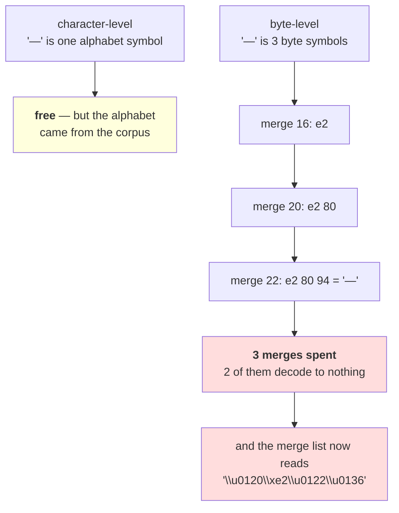

# 3.4 — 💥 The vocabulary you cannot read

## One-line answer

Byte-level BPE spends merges **reassembling characters it broke apart**: on this corpus merges 16, 20 and
22 are the three UTF-8 bytes of a single em dash, rebuilt one pair at a time — so three of the
twenty-two most valuable slots in the vocabulary go on producing one character, and the merge list Day
12 taught you to read is now half unreadable.

---

## The story

A shop starts selling furniture as flat packs instead of assembled.

Everything fits in the van now, and nothing is ever "too big to deliver". That was the whole point and it
worked.

What nobody mentioned is that the stockroom shelves are now full of boxes labelled *panel B*, *panel C*,
*bag of fixings 3*. Somebody looking for a bookcase cannot see one. The shelf that used to say
"bookcase" now says nothing at all until you know which four boxes to put together.

---

## The idea in plain language

Part [3.3](3.3-zero-out-of-vocabulary.md) measured the win. This part is the bill, and it has two lines.

**The tokenizer spends merges rebuilding characters.** A character-level tokenizer started with `—` as
one symbol. A byte-level one starts with three symbols — `0xE2`, `0x80`, `0x94` — and has to learn two
merges to put them back together before it can learn anything *about* the character. Measured below, on
this corpus the em dash costs merges 16, 20 and 22 out of 744.

That is a tax, and its size scales with how much of the corpus is non-ASCII. English pays almost nothing.
A corpus in a 3-bytes-per-character script pays it on every character, and the merges that would have
learned word structure go on character reconstruction instead. **Day 17 measures that across languages;
this part establishes the mechanism.**

**The merge list stops being readable.** Day 12 part
[2.3](../../../day-012-bpe-the-merge-loop/parts/02-training-a-vocabulary/2.3-reading-the-table.md)
argued that reading the first hundred merges is the cheapest diagnostic in tokenization — it tells you
what your corpus is made of. Part [3.2](3.2-the-byte-to-unicode-trick.md)'s byte mapping keeps ASCII
readable, so most of the list still is. But every non-ASCII character appears as a run of Latin-1
supplement characters that mean nothing: measured below, the em dash's merges read as `Ġâ`,
`ĠâĢ` and `Ġâĥ` — and none of those is a thing.

So the diagnostic still works for the English half of your corpus and goes dark for the rest. **The part
of the vocabulary you most need to inspect — the part in languages you do not read — is the part that
became illegible.**

Both lines of the bill have the same root cause and it is not a flaw: the atoms got smaller. Day 10 part
[2.4](../../../day-010-unicode-code-points-bytes/parts/02-utf-8-and-bytes/2.4-256-is-a-vocabulary.md)
said the byte set is the only finished one and this is what finishing it costs. **Byte-level does not
make Unicode simple; it makes Unicode representable and pushes the complexity into the merge list.**

The mitigation is not to abandon the scheme — nothing better exists — it is to **decode tokens before you
look at them**, which is one function and which part 2.3 already showed an audit getting wrong.

---

## Why Akshara needs it

- **Part [4.1](../04-together/4.1-four-tokenizers-one-table.md)** closes the day, and an honest summary
  needs this column as well as part 3.3's.
- **Day 14** opens a production vocabulary file. It will be full of these runs, and knowing to decode
  before reading is the difference between a useful hour and a confusing one.
- **Day 17** measures multilingual token inflation. The merge tax measured here is one of its causes.
- **Day 51 onward**, the merge list is the record of what a tokenizer learned from the corpus. A record
  you cannot read is a record you will not check.

---

## The mechanism

Find what the early merges are actually doing:

```python
import hashlib
import json
from pathlib import Path

raw = Path("docs/00_MASTER_PLAN.md").read_bytes()
print("  corpus sha256[:16] :", hashlib.sha256(raw).hexdigest()[:16])

merges = [tuple(m) for m in json.loads(Path("tokenizer.json").read_text())["merges"]]

print("  the first 24 merges, as symbols:")
for i in range(0, 24, 4):
    print("   ", "  ".join(f"{i+j+1:>3}. {ascii(''.join(merges[i+j])):<18}" for j in range(4)))
```

**Line by line:**
- `ascii("".join(m))` prints the **symbols**, which is what the artifact contains and what a text editor
  would show you. That is deliberately the wrong view — the point of the block is that it is unreadable.
- Measured on Intel Core i3-1115G4 (2 cores / 4 threads), 11.7 GB RAM, Windows 11, CPython 3.12.12, on
  2026-08-27, with the `V = 1000` byte-level tokenizer from part 3.1:

```text
  the first 24 merges, as symbols:
      1. '\u0120|'             2. '\u0120a'             3. '\u0120t'             4. 'in'
      5. 'he'                  6. 'on'                  7. 'er'                  8. 'at'
      9. 're'                 10. 'en'                 11. '\u0120the'          12. '\u0120s'
     13. 'it'                 14. '\u0120c'            15. '\u0120an'           16. '\u0120\xe2'
     17. '\u0120\u0120'       18. '\u0120d'            19. 'ing'                20. '\u0120\xe2\u0122'
     21. '\u0120`'           22. '\u0120\xe2\u0122\u0136'   23. '**'                 24. 'ion'
```

Most of it reads fine — `Ġthe`, `ing`, `ion`, `er` — because part 3.2's mapping leaves ASCII alone.

**Now look at 16, 20 and 22.** `Ġâ`, then `ĠâĢ`, then `ĠâĢĶ`. Each builds on the
last, each is one byte longer, and none of them is a word or a piece of one. Three of the first
twenty-two merges, spent on something you cannot identify from the list.

Decode them and the mystery resolves:

```python
def real_text(tok: str) -> str:
    return bytes(BYTE_DECODER[c] for c in tok).decode("utf-8", errors="replace")


for i in (16, 20, 22):
    m = merges[i - 1]
    tok = "".join(m)
    print(f"    merge {i:>2}: symbols {ascii(tok):<26} bytes "
          f"{' '.join(f'{BYTE_DECODER[c]:02x}' for c in tok):<12} text {ascii(real_text(tok))}")
```

**Line by line:**
- `real_text` is part 2.3's function, and this is the third time in Day 13 it has been needed. **That
  repetition is the finding**: any question about what a byte-level token *means* has to go through the
  byte mapping first.
- Printing the **bytes** in the middle column is what makes the pattern legible: `e2`, `e2 80`, `e2 80
  94` — the three-byte UTF-8 sequence being assembled left to right, which Day 10 part
  [2.2](../../../day-010-unicode-code-points-bytes/parts/02-utf-8-and-bytes/2.2-how-utf-8-encodes-a-code-point.md)
  taught you to read.
- `errors="replace"` because the first two merges are **incomplete characters** — a leading byte with no
  continuation — and the decoder cannot do better than a replacement character. Part
  [1.4](../01-encode-and-decode/1.4-the-token-that-was-half-a-character.md) is the same phenomenon in a
  stream.
- Measured on this machine, 2026-08-27:

```text
    merge 16: symbols '\u0120\xe2'               bytes 20 e2        text ' \ufffd'
    merge 20: symbols '\u0120\xe2\u0122'         bytes 20 e2 80     text ' \ufffd'
    merge 22: symbols '\u0120\xe2\u0122\u0136'   bytes 20 e2 80 94  text ' \u2014'
```

**Three merges to produce one em dash with its leading space.** Merges 16 and 20 are not tokens for
anything — they decode to a space and a replacement character — and exist only as scaffolding for merge
22. In a character-level vocabulary that character would have been in the alphabet for free.

Count the tax on this corpus:

```python
def is_ascii_token(tok: str) -> bool:
    return all(BYTE_DECODER[c] < 0x80 for c in tok)


non_ascii = [i for i, m in enumerate(merges, 1) if not is_ascii_token("".join(m))]
incomplete = [i for i in non_ascii
              if "�" in real_text("".join(merges[i - 1]))]
print("  merges                        :", len(merges))
print("  merges touching non-ASCII bytes:", len(non_ascii),
      f"({len(non_ascii) / len(merges):.1%})")
print("  of those, incomplete characters:", len(incomplete))
print("  first ten non-ASCII merges     :", non_ascii[:10])
```

**Line by line:**
- `BYTE_DECODER[c] < 0x80` asks whether every byte in the token is ASCII. It goes through the decoder
  rather than testing the symbol, for the reason part 2.3 measured: the symbol `Ġ` is not the byte
  it stands for.
- `incomplete` counts the merges that decode to a replacement character — **scaffolding merges**, which
  are pure overhead: they are not tokens for anything a reader would name.
- Measured on this machine, 2026-08-27:

```text
  merges                        : 744
  merges touching non-ASCII bytes: 30 (4.0%)
  of those, incomplete characters: 16
  first ten non-ASCII merges     : [16, 20, 22, 84, 86, 100, 142, 152, 210, 217]
```

**Thirty of 744 merges — 4.0% — go on non-ASCII bytes, and sixteen of those are incomplete
characters.** On a corpus that is 97.8% ASCII by byte count, that is a small and real tax — and three of
those merges are in the top 22, which is where the most valuable slots are. Six of the first hundred
merges are non-ASCII against two of the last hundred: **the tax falls on the expensive end of the
list.**

Now scale the argument, because 3.5% is not the number that matters:

```text
  this corpus            : 113,283 bytes, 110,837 characters -> 1.022 bytes per character
  merges on non-ASCII    : 30 of 744 (4.0%)
  a Devanagari corpus    : 3 bytes per character (Day 10 part 2.4)
  every character then   : starts as 3 symbols needing 2 merges to reassemble
  and those merges are   : one per character shape, not one per word
  so the vocabulary      : spends its early slots on an alphabet it already had at character level
```

**That is arithmetic, not a measurement**, and it is labelled as such — this day has no Devanagari corpus
to train on. What it establishes is the direction and the mechanism: the tax is proportional to the
bytes-per-character ratio, so it is near-zero for English and substantial for most of the world's
scripts. Day 17 measures it properly.



---

## When it breaks

**The loud failure — decoding a scaffolding merge strictly:**

```console
>>> bytes([0xe2, 0x80]).decode("utf-8")
Traceback (most recent call last):
  File "<stdin>", line 1, in <module>
UnicodeDecodeError: 'utf-8' codec can't decode bytes in position 0-1: unexpected end of data
```

What it means: merge 20 is two thirds of a character. It is a legitimate vocabulary entry and it is not
text, so a tool that decodes tokens strictly to display them will crash on a perfectly good tokenizer.
**Vocabulary viewers use `errors="replace"` for exactly this reason**, and the replacement character in
the display is information rather than corruption.

**The silent failure — auditing the merge list without decoding.** Part
[2.3](../02-the-regex-pre-tokenizer/2.3-what-the-pattern-costs-and-buys.md) measured this happening:

```text
  the audit asked  : does this token contain both a letter and a digit?
  what it examined : the SYMBOLS — 'Ġ' and friends
  'Ġ'.isalpha() : True    (it is a Latin Extended-A letter)
  '\xe2'.isalpha()   : True
  reported          : 15 letter+digit merges, 21 letter+punct merges
  actually true     : 0 and 1
  exception raised  : none. The audit was confidently, precisely wrong.
```

**The check that catches it** makes decoding the default and the raw view opt-in:

```python
def token_report(merges: list[tuple[str, str]]) -> dict[str, object]:
    """Read a byte-level merge list the way a person needs to see it."""
    rows = []
    for i, m in enumerate(merges, 1):
        tok = "".join(m)
        text = real_text(tok)
        rows.append({
            "rank": i,
            "symbols": ascii(tok),
            "bytes": " ".join(f"{BYTE_DECODER[c]:02x}" for c in tok),
            "text": ascii(text),
            "is_complete": "�" not in text,
            "is_ascii": all(BYTE_DECODER[c] < 0x80 for c in tok),
        })
    return {
        "merges": len(rows),
        "incomplete": sum(1 for r in rows if not r["is_complete"]),
        "non_ascii": sum(1 for r in rows if not r["is_ascii"]),
        "first_20": rows[:20],
    }


def assert_scaffolding_is_bounded(merges, max_incomplete_share: float = 0.05) -> None:
    r = token_report(merges)
    share = r["incomplete"] / r["merges"]
    assert share <= max_incomplete_share, (
        f"{r['incomplete']} of {r['merges']} merges ({share:.1%}) decode to incomplete "
        f"characters — this vocabulary is spending its budget reassembling bytes, which "
        f"usually means the corpus is much less ASCII than the vocabulary size assumes"
    )
```

**Line by line:**
- Every row carries **three views** — symbols, bytes and text — because each answers a different question
  and having only one is how part 2.3's audit went wrong. The symbols view is what is in the file, the
  bytes view is what it means, and the text view is what a person can read.
- `is_complete` is the scaffolding flag, and it is derived from the presence of a replacement character
  rather than by trying a strict decode and catching. **A predicate is easier to aggregate than an
  exception.**
- `assert_scaffolding_is_bounded` uses a **stated** default of 5%, which is a policy and not a discovered
  optimum — on this corpus the figure is 2.2% and on a non-Latin corpus a much higher value would be
  correct and expected.
- The failure message says what a high value usually *means*, because the number alone does not suggest an
  action. A vocabulary spending a fifth of its merges on scaffolding is telling you the vocabulary is too
  small for the corpus, not that the tokenizer is broken.
- What none of this fixes is the tax. There is no fix — it is what a byte alphabet costs — and the report
  exists so the cost is visible when you size the vocabulary rather than invisible afterwards.

---

## In production

**What a research engineer writes instead of the teaching version.** They keep a small vocabulary viewer
that decodes tokens to text before showing them, and they use it every time they inspect a tokenizer.
The raw symbol view is for diffing files; the decoded view is for understanding them, and confusing the
two is how somebody concludes that a tokenizer is full of garbage tokens when it is full of perfectly
ordinary non-English ones.

The second habit is **sizing the vocabulary against the corpus's byte-to-character ratio.** A 32,000-entry
vocabulary on an English corpus and the same on a Devanagari one are not comparable: the second spends a
chunk of its budget on character reassembly before it learns any word structure. That is one of the
concrete reasons multilingual models use larger vocabularies.

**What degrades at scale.** The tax, in proportion to the corpus's non-ASCII share, and the readability,
in proportion to the same thing. **Both get worse for exactly the languages you are least able to check
by eye**, which is the uncomfortable part: an English-reading team inspecting a multilingual tokenizer
sees a readable head and an illegible tail, and the tail is where the problems are.

**The failure that only shows with real data.** Mojibake in the corpus. Day 10 part
[2.1](../../../day-010-unicode-code-points-bytes/parts/02-utf-8-and-bytes/2.1-text-has-to-become-bytes.md)
measured what a wrong decode produces — sequences like `é` — and a byte-level tokenizer will
cheerfully learn merges for them, because they are frequent byte pairs. Those merges look exactly like
legitimate non-ASCII scaffolding in the symbol view. **The only way to tell a corpus encoding bug from
ordinary multilingual text in a merge list is to decode the tokens**, and the tell is a token whose text
is `é` rather than a character.

**The review comment.** *"The vocabulary inspector prints raw token symbols, so every non-English entry
looks like line noise and we cannot tell a real token from a decode bug in the corpus. Decode to text
before displaying, and flag the tokens that come back with a replacement character."*

**The interview question.** *"What does byte-level tokenization cost?"* The weak answer is "longer
sequences". The strong answer separates the two bills: **the sequence-length cost is the obvious one, and
the less obvious one is that merges are spent reassembling multi-byte characters — on my corpus the em
dash took three merges, two of which decode to nothing, and all three were in the first 22.** Then the
operational half: *and the merge list stops being readable for exactly the languages you cannot check by
eye, so any audit has to decode tokens to bytes first — I have seen an audit report fifteen letter-digit
merges that did not exist because the byte-mapping symbols are themselves letters.*

**Compute tier: T0.** The standard library on a laptop, reading a merge list trained in part 3.1. No
packages, no network, no GPU, no seed, no training in this part. The merge indices and the 30/744 count
**depend on the corpus** and reproduce for anyone whose corpus hash matches `9760f2b6d4340b97`; the
mechanism — that a three-byte character needs two merges — does not depend on the corpus at all. **The
Devanagari scaling block is arithmetic under a stated ratio, not a measurement**, and is labelled so in
the text. What T0 cannot show is the tax on a genuinely multilingual corpus, which needs one; Day 17
measures it.

---

## Check yourself

Run this. It prints **three merges that build one character, two of which decode to nothing**:

```python
import json
from pathlib import Path

merges = [tuple(m) for m in json.loads(Path("tokenizer.json").read_text())["merges"]]


def real_text(tok):
    return bytes(BYTE_DECODER[c] for c in tok).decode("utf-8", errors="replace")


for i in (16, 20, 22):
    tok = "".join(merges[i - 1])
    print(f"  merge {i:>2}: symbols {ascii(tok):<26} "
          f"bytes {' '.join(f'{BYTE_DECODER[c]:02x}' for c in tok):<12} "
          f"text {ascii(real_text(tok))}")

non_ascii = [i for i, m in enumerate(merges, 1)
             if not all(BYTE_DECODER[c] < 0x80 for c in "".join(m))]
incomplete = [i for i in non_ascii if "�" in real_text("".join(merges[i - 1]))]
print("  merges:", len(merges),
      " non-ASCII:", len(non_ascii),
      " incomplete:", len(incomplete))
print("  '\\u0120'.isalpha() :", "Ġ".isalpha(), " <- why a naive audit is wrong")
```

**Line by line:**
- Merges 16 and 20 print a replacement character in the `text` column. **Say out loud what those two
  entries are for, and whether they are tokens for anything.**
- The `bytes` column reads `20 e2`, `20 e2 80`, `20 e2 80 94`. Say what character that is and check the
  sequence against Day 10 part 2.2's width table.
- The last line prints `True`. Say what an audit that called `.isalpha()` on token symbols would have
  concluded, and check it against part 2.3's measured numbers.
- Now count how many of the first 100 merges are non-ASCII, and how many of the last 100 are. Say which
  end of the list the tax falls on and why that matters.

**Say this out loud, without scrolling up:** say why a byte-level tokenizer has to spend merges before it
can learn anything about a non-ASCII character, name the two views of a token and which one you must use
to ask what it means, and say which languages the readability problem hits hardest.
