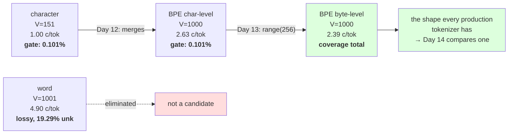

# 4.1 — Four tokenizers, one table

## One-line answer

Day 11 left five findings — three trades and two gates. Day 12 closed the trades and one gate; Day 13
closes the last one at a cost of **0.24 characters per token** — and the resulting tokenizer is lossless,
covers every possible input by construction, and is the shape every production tokenizer has.

---

## The story

A house is finished when the last thing on the list is crossed off, and the list has been getting shorter
for weeks.

The roof went on first — nothing else mattered until it did. Then the windows, then the wiring, then the
door that had been propped shut since the beginning.

Standing in it at the end, the thing worth noticing is not the door. It is that the list is empty, and
that you can say what each item cost.

---

## The idea in plain language

Day 11 part [3.1](../../../day-011-character-and-word-tokenizers/parts/03-together/3.1-two-tokenizers-one-table.md)
sorted its findings into **trades** — payable in compute, memory or sequence length — and **gates** —
things no setting fixes. It ended with a scoreboard, and three days later every line on it is closed.

| Day 11's finding | Kind | Closed by | Cost |
| --- | --- | --- | --- |
| character tokenizer is 5.56× too long | trade | Day 12's merges | vocabulary slots |
| vocabulary size | trade | — | priced, not eliminated |
| 15.57% of a word vocabulary is inflections | trade | Day 12's shared subword tokens | none |
| word: 10.41% unrepresentable, nothing underneath | **gate** | Day 12 — the alphabet is underneath | 13 extra tokens on a 10-word sentence |
| character: alphabet is 0.101% of Unicode | **gate** | **Day 13 — `range(256)`** | 0.24 chars/token, and 4.0% of merges |

**Every line is closed and each one has a price beside it.** That is what a finished argument looks like,
and the last row is today's.

Now the table the whole phase has been building towards. Four tokenizers, one corpus, one held-out
question each:

| | `V` | tokens | chars/token | lossless | coverage |
| --- | --- | --- | --- | --- | --- |
| character (Day 11) | 151 | 110,837 | 1.00 | yes | **0.101% of Unicode** |
| word (Day 11) | 1,001 | 15,082 | 4.90 | **no** | **19.29% `<unk>`** |
| BPE, character alphabet (Day 12) | 1,000 | 42,130 | 2.63 | yes | **0.101% of Unicode** |
| BPE, byte alphabet (Day 13) | 1,000 | 46,311 | 2.39 | yes | **total, by construction** |

Read it as a sequence rather than as four options, because that is what it is.

**Row 1 to row 2** is Day 11's dilemma: 5.56× shorter sequences, bought with losslessness and a fifth of
the text.

**Row 2 to row 3** is Day 12: BPE recovers most of the compression — 2.63 against the word tokenizer's
4.90, at the same `V` — while restoring losslessness completely. The word row is eliminated, permanently,
and nothing later in this curriculum returns to it.

**Row 3 to row 4** is today: 0.24 characters per token given up, and the coverage column goes from a
percentage to a construction. That is the trade this day exists to make, and it is the smallest cost of
the three transitions for the largest change in kind.

One thing the table cannot show and this part must say: **row 4 is not merely the best of four.** Rows 1
and 3 share a gate that has nothing to do with their compression, and row 2 is disqualified on
losslessness before compression is discussed. **The table has one viable row**, and the other three are
there to show what viability cost.

And what today did *not* fix, all of it measured in this day's own parts:

- **Numbers are still irregular** — part [2.4](../02-the-regex-pre-tokenizer/2.4-the-number-that-was-three-tokens.md)
  measured `2024` as `2` + `02` + `4`, fixable only by a further pre-tokenizer boundary.
- **Tokens can be half a character** — part
  [1.4](../01-encode-and-decode/1.4-the-token-that-was-half-a-character.md), which streaming has to
  handle.
- **The merge list is partly unreadable** — part
  [3.4](../03-byte-level-bpe/3.4-the-vocabulary-you-cannot-read.md), and worst for the languages you
  cannot check.
- **Compression is English-only.** Every number in this table is measured on an English corpus and part
  3.3 measured Cyrillic at one token per byte. Day 17 is where that becomes a proper measurement.

---

## Why Akshara needs it

- **Day 14** adds a fifth row: a production tokenizer, measured the same way on the same text. This table
  is what makes that comparison mean something rather than being a number in isolation.
- **Day 15** looks at the other subword families — WordPiece and Unigram — and the question it answers is
  what they do differently from row 4.
- **Day 16** adds special tokens to row 4's vocabulary, and **Day 17** measures its pathologies properly.
- **Day 51 onward**, row 4 is the tokenizer. Its `V`, its compression and its coverage are the three
  numbers every later day inherits.

---

## The mechanism

Four tokenizers, one corpus, one script:

```python
import hashlib
import re
from collections import Counter
from pathlib import Path

raw = Path("docs/00_MASTER_PLAN.md").read_bytes()
text = raw.decode("utf-8")
print("  corpus sha256[:16] :", hashlib.sha256(raw).hexdigest()[:16])

words = re.findall(r"[A-Za-z']+", text.lower())
_, char_bpe = train_char_level(text, 1000)
byte_vocab, byte_bpe = train(text, 1000)

rows = [
    ("character",      len(set(text)), len(text),                     1.00, True,  "0.101% of Unicode"),
    ("word V=1000",    1001,           len(words),
     sum(map(len, words)) / len(words),                                      False, "19.29% <unk>"),
    ("BPE char-level", 1000,           len(tokenize_char(text, char_bpe)),
     len(text) / len(tokenize_char(text, char_bpe)),                         True,  "0.101% of Unicode"),
    ("BPE byte-level", len(byte_vocab), len(tokenize(text, byte_bpe)),
     len(text) / len(tokenize(text, byte_bpe)),                              True,  "total"),
]

print(f"  {'scheme':<16} {'V':>6} {'tokens':>8} {'c/tok':>6} {'lossless':>9}  coverage")
for name, V, n, ratio, loss, cov in rows:
    print(f"  {name:<16} {V:>6} {n:>8} {ratio:>6.2f} {str(loss):>9}  {cov}")
```

**Line by line:**
- Every row is computed from **one `text` variable**. Day 11 part 3.1 and Day 12 part 2.2 both insisted on
  this and both showed what happens without it; a four-row table is four chances to get it wrong.
- The `coverage` column is a **string, not a number**, and deliberately so. Three rows carry a percentage
  and one carries the word `total`, and forcing them into one numeric column would suggest they are the
  same kind of claim. Part [3.3](../03-byte-level-bpe/3.3-zero-out-of-vocabulary.md) is the argument for
  why they are not.
- The word row's ratio is the mean word length, which Day 12 part 3.1 explained is the **generous**
  reading — dividing the full character count by the word count would credit it with whitespace it
  discarded.
- `lossless` is a literal per row rather than a computed value, because for the word row it is `False`
  structurally and computing it would imply the answer depends on the text.
- Measured on Intel Core i3-1115G4 (2 cores / 4 threads), 11.7 GB RAM, Windows 11, CPython 3.12.12, on
  2026-08-27:

```text
  corpus sha256[:16] : 9760f2b6d4340b97
  scheme                V   tokens  c/tok  lossless  coverage
  character           151   110837   1.00      True  0.101% of Unicode
  word V=1000        1001    15082   4.90     False  19.29% <unk>
  BPE char-level     1000    42130   2.63      True  0.101% of Unicode
  BPE byte-level     1000    46311   2.39      True  total
```

**The last two rows differ by 0.24 characters per token and by a column that is not a number.** That is
the whole of Day 13's trade, and it is worth stating in both directions: 9.9% more tokens, and the
difference between a tokenizer that raises on Cyrillic and one that cannot raise at all.

Now the check that the last row's claim is a construction rather than a measurement:

```python
stoi = {t: i for i, t in enumerate(byte_vocab)}
print("  every byte symbol has an id:", all(BYTE_ENCODER[b] in stoi for b in range(256)))
print("  and it is the right id     :", all(byte_vocab[b] == BYTE_ENCODER[b] for b in range(256)))
print("  V = 256 + merges           :", len(byte_vocab) == 256 + len(byte_bpe))

for name, probe in (("Cyrillic", "\u043f\u0440\u0438\u0432\u0435\u0442"),
                    ("Devanagari", "\u0936\u092c\u094d\u0926")):
    ids = [stoi[t] for t in tokenize(probe, byte_bpe)]
    print(f"  {name:<11} {len(ids):>3} ids  round trip="
          f"{from_symbols([byte_vocab[i] for i in ids]) == probe}")
    try:
        tokenize_char(probe, char_bpe)
        print(f"  {'':<11} character-level: encoded")
    except KeyError as e:
        print(f"  {'':<11} character-level: KeyError {ascii(e.args[0])}")
```

**Line by line:**
- The first three lines are part [3.3](../03-byte-level-bpe/3.3-zero-out-of-vocabulary.md)'s proof, and
  they are here rather than a probe sweep because **the property is what closes the gate**, not the
  probes.
- The `try` block is around the **character-level** tokenizer only. Its presence in one branch and absence
  in the other is the table's coverage column, expressed as code.
- Measured on this machine, 2026-08-27:

```text
  every byte symbol has an id: True
  and it is the right id     : True
  V = 256 + merges           : True
  Cyrillic     12 ids  round trip=True
              character-level: KeyError '\u043f'
  Devanagari   12 ids  round trip=True
              character-level: KeyError '\u0936'
```

**Same corpus, same `V`, same algorithm — one raises and one does not.** That is Day 11's last gate,
closed, and the entire difference is which alphabet the trainer started from.



---

## When it breaks

**The loud failure — comparing rows measured with different pre-tokenizers.** The table above uses the
GPT-style pattern for both BPE rows; using Day 12's for one of them changes its numbers without changing
anything you can see in the table:

```console
>>> len(tokenize(text, byte_bpe, SIMPLE))
46346
>>> len(tokenize(text, byte_bpe, GPT_LIKE))
46311
```

What it means: the same merge list encodes the same corpus into two different token counts depending on
the pattern — 46,346 against 46,311 — so a compression figure without its pattern is not a measurement.
The gap is small here because the merges were fitted to the GPT-style chunks and mostly still apply; a
merge list trained under SIMPLE and encoded under GPT_LIKE is much worse, which Day 12 part 2.3 measured. Nothing raises. Day 12
part [2.1](../../../day-012-bpe-the-merge-loop/parts/02-training-a-vocabulary/2.1-the-merge-table-is-the-artifact.md)
put the pattern in the artifact for exactly this reason.

**The silent failure — reading the table as a ranking.** It is four rows with a numeric column, so it
invites one:

```text
  ranked by chars/token : word 4.90 > BPE char 2.63 > BPE byte 2.39 > character 1.00
  what that ordering says: the lossy tokenizer is best and today made things worse
  what the other columns say:
    - the word row is not lossless and cannot represent 19.29% of held-out tokens
    - the two character-alphabet rows share a gate that has nothing to do with compression
    - the byte row's 9.9% extra tokens bought a property, not a number
  exception raised      : none. Every figure in the ranking is correctly computed.
```

**The check that catches it** refuses to produce a single ordering:

```python
from dataclasses import dataclass


@dataclass(frozen=True)
class SchemeRow:
    """One row of a tokenizer comparison. Gates are not comparable with trades."""

    name: str
    vocab_size: int
    tokens: int
    characters: int
    lossless: bool
    coverage: str          # a string on purpose: "total" is not a number
    corpus_sha256: str
    pattern: str

    @property
    def chars_per_token(self) -> float:
        if not self.lossless:
            raise ValueError(f"{self.name}: not lossless, so it is not encoding the same text")
        return self.characters / self.tokens

    @property
    def is_viable(self) -> bool:
        return self.lossless and self.coverage == "total"


def compare(rows: list[SchemeRow]) -> None:
    assert len({r.corpus_sha256 for r in rows}) == 1, "rows measured on different corpora"
    assert len({r.pattern for r in rows if r.pattern}) <= 1, "rows measured with different patterns"
    for r in rows:
        ratio = f"{r.chars_per_token:.2f}" if r.lossless else "n/a (lossy)"
        flag = "" if r.is_viable else "   <- gated"
        print(f"  {r.name:<16} V={r.vocab_size:>5} {ratio:>12}  {r.coverage}{flag}")
```

**Line by line:**
- `coverage` is typed as `str` and the docstring says why. **A column where one entry is "total" and three
  are percentages is not a numeric column**, and forcing it to be one is how a construction gets ranked
  against a measurement.
- `chars_per_token` **raises** for a lossy row, which is Day 12 part 3.1's design carried forward: a
  caveat gets dropped when a number is copied and an exception does not.
- `is_viable` is the judgement, and it is a **conjunction of the two gates** rather than a score. There is
  no weighting in which a better compression figure compensates for a gate, and expressing that as `and`
  rather than as a weighted sum is the point.
- `compare` asserts one corpus **and one pattern** across the rows. The second assertion is Day 13's
  addition — Day 11 and 12's versions did not need it because the pattern was fixed within a day.
- The `<- gated` flag is printed rather than the row being hidden. **A gated row belongs in the table**;
  it is the evidence for what viability cost, and removing it makes the surviving row look arbitrary.

---

## In production

**What a research engineer writes instead of the teaching version.** They do not build four tokenizers —
they use the fourth, because the field settled this argument some years ago. What this table gives them is
the ability to **say why**, which matters in exactly two situations: when somebody proposes a
character-level model for a constrained domain, and when somebody is surprised that a tokenizer produces
long sequences for their language. Both are answered by a row of this table.

The second habit is keeping a comparison like this **for the tokenizer you actually ship**, with the
corpus hash and the pattern recorded, re-run when either changes. It is the artifact that answers "why is
`V` 32,000?" a year later.

**What degrades at scale.** The compression gap between rows 3 and 4 narrows — part
[3.1](../03-byte-level-bpe/3.1-the-alphabet-becomes-256.md) showed the 256-entry alphabet is 26% of a
1,000-entry vocabulary and 0.8% of a 32,000-entry one — so **today's cost is largely an artefact of a toy
vocabulary size.** What does not narrow is the coverage column, which is why the argument is settled
rather than balanced.

**The failure that only shows with real data.** Every row of this table is English. Part 3.3 measured
Cyrillic at one token per byte on row 4, which is roughly *five times* worse than row 4's English figure —
and rows 1 and 3 do not have a number for it at all, because they raise. **A comparison table built on one
language tells you about that language**, and Day 17 exists because that is not enough.

**The review comment.** *"The table ranks four tokenizers by compression and concludes we should use the
word-level one. Two of the four have a coverage gate and one is lossy — put those columns beside the
ratio, and drop the ranking, because a gate is not a worse score."*

**The interview question.** *"Walk me from a character tokenizer to what people actually use."* The weak
answer lists the schemes. The strong answer is the sequence with its costs: **characters are lossless and
5.56× too long; words are compact and cannot represent one held-out token in ten with nothing underneath;
BPE over characters recovers most of the compression and keeps losslessness but inherits the alphabet's
coverage gate; and a byte alphabet closes that gate for 0.24 characters per token, because every input is
a byte string and all 256 bytes are in the table.** Then the honest tail: *and it does not fix numbers,
does not stop a token being half a character, and makes the merge list unreadable for the languages you
most need to check.*

**Compute tier: T0.** The standard library on a laptop, over a 113,283-byte file in this repository. Two
training runs, the longer about 20 seconds. No packages, no network, no GPU, no seed. Every number
reproduces for anyone whose corpus hash matches `9760f2b6d4340b97`, **except the coverage column's last
row, which does not depend on the corpus at all** — that is what makes it a construction. Two honesty
notes carried from the parts: the word row's compression is computed generously and is still not
comparable, and every row is English-only. What T0 cannot settle is which of these trains the best model
at fixed compute; that is Day 17, and this phase's job was to reduce four candidates to one on
correctness grounds so that fewer runs are needed.

---

## Check yourself

Run this. It prints **four rows where the best compression belongs to a row that is disqualified twice**:

```python
import hashlib
import re
from pathlib import Path

raw = Path("docs/00_MASTER_PLAN.md").read_bytes()
text = raw.decode("utf-8")
print("  corpus sha256[:16] :", hashlib.sha256(raw).hexdigest()[:16])

words = re.findall(r"[A-Za-z']+", text.lower())
byte_vocab, byte_bpe = train(text, 1000)
btoks = tokenize(text, byte_bpe)

print(f"  {'character':<16} V={len(set(text)):>5} tokens={len(text):>7} "
      f"c/tok={1.00:>5.2f} lossless=True  coverage=0.101%")
print(f"  {'word V=1000':<16} V={1001:>5} tokens={len(words):>7} "
      f"c/tok={sum(map(len, words)) / len(words):>5.2f} lossless=False coverage=19.29% unk")
print(f"  {'BPE byte-level':<16} V={len(byte_vocab):>5} tokens={len(btoks):>7} "
      f"c/tok={len(text) / len(btoks):>5.2f} lossless={''.join(btoks) == ''.join(pretokenize(text))}"
      f"  coverage=total")

stoi = {t: i for i, t in enumerate(byte_vocab)}
print("  coverage is a construction:",
      all(byte_vocab[b] == BYTE_ENCODER[b] for b in range(256)))
for probe in ("\u043f\u0440\u0438\u0432\u0435\u0442", "\u0936\u092c\u094d\u0926"):
    ids = [stoi[t] for t in tokenize(probe, byte_bpe)]
    print(f"  {ascii(probe):<32} {len(ids):>3} ids  round trip="
          f"{from_symbols([byte_vocab[i] for i in ids]) == probe}")
```

**Line by line:**
- The word row has the best `c/tok` and two disqualifying columns. **Say out loud how you would present
  this table to somebody who only reads the first numeric column.**
- The `lossless` check on the byte row compares against the joined **pre-tokenized chunks** rather than
  against `text`. Say why — and check your answer against part
  [3.2](../03-byte-level-bpe/3.2-the-byte-to-unicode-trick.md)'s note that tokens are symbols, not text.
- `coverage is a construction` prints `True` in one line. Say what that one line establishes that the two
  probe rows below it do not.
- Now add a row for the character-level BPE from Day 12 and try to encode the Cyrillic probe with it. Say
  which column changes and which stays the same.

**Say this out loud, without scrolling up:** list Day 11's five findings and say which day closed each,
state the cost of closing the last one in characters per token, and name three things Day 13 did **not**
fix.
