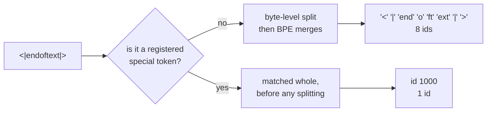

# 1.2 — A special token has to be one token

## One-line answer

Written as ordinary text, `<|endoftext|>` encodes to **8 tokens** — `['<', '|', 'end', 'o', 'ft', 'ext',
'|', '>']` — and a model cannot learn "stop" from a sequence of eight ordinary pieces, so the tokenizer has
to be told to keep it whole, after which it is **1 token**, id 1000.

---

## The story

A shop puts a card in the window that reads `CLOSED`.

Now imagine the card is made of six separate tiles, each with one letter, hung on six separate hooks.
Somebody walking past has to read all six tiles, in order, and put them together, and decide that those six
tiles standing next to each other mean the shop is shut. Most of the time that works.

Then one morning the shopkeeper hangs a poster about a sale, and the poster happens to have the word
`CLOSED` inside a sentence: *we are never CLOSED on Sundays*. The six tiles are there, in order, in the
window. A passer-by glances up and goes home.

The sign was never a sign. It was six letters that happened to spell one, and letters turn up inside
sentences.

---

## The idea in plain language

A **token** is one entry in the vocabulary — one id. Day 9 part
[2.1](../../../day-009-the-vocabulary-problem/parts/02-what-a-tokenizer-is/2.1-a-function-and-its-inverse.md)
defined the tokenizer as the function that turns text into a list of those ids.

A byte-level BPE tokenizer, built the way Days 12 and 13 built one, has one job when it meets a new string:
split it into the largest pieces that are in its vocabulary. It does not know that `<|endoftext|>` is
supposed to mean anything. It has never seen that string in training. So it does what it does to everything
else — it chops it into whatever known pieces fit.

That gives you a control instruction spread across **eight ids**, and three separate problems follow:

1. **The model cannot learn it reliably.** "Stop" is now a pattern of eight tokens in a row, and the model
   has to learn the whole pattern. Any *one* of those eight tokens can also appear in ordinary text — `end`,
   `ext` and `<` all do — so the model has to learn a conjunction rather than a symbol.
2. **The boundary can be forged.** Anyone who types those eight characters into your input has produced the
   exact same eight ids as your control marker. That is Day 14 part
   [1.5](../../../day-014-tiktoken-and-the-pipeline/parts/01-tiktoken/1.5-the-special-token-that-was-just-text.md)'s
   subject, and part [2.3](../02-attaching-them/2.3-the-library-that-did-not-raise.md) measures what happens
   when you fix it the obvious way.
3. **It costs eight positions of context.** Every document in your training corpus pays eight tokens for a
   marker that could cost one. On a corpus of a million documents that is eight million tokens spent on
   punctuation.

**Making it one token** means adding it to the vocabulary as an entry in its own right, and telling the
tokenizer to match it *before* the ordinary splitting runs. The tokenizer then treats it the way the shop
would treat a single painted board reading `CLOSED` — one object, one meaning, and no way for a sentence to
accidentally assemble it.

---

## Why Akshara needs it

Day 67 pretrains Akshara on a corpus of many documents concatenated into one long stream. The only thing
separating one document from the next is the end marker. If that marker is eight ordinary tokens, then the
attention mechanism built on Day 29 sees a document boundary as a *phrase*, and a phrase is exactly the kind
of thing a language model learns to continue rather than to obey.

And on Day 88, when the curriculum builds a chat template, every single turn boundary is a marker. A
conversation with six turns carries twelve markers. At eight tokens each that is 96 tokens of a context
window spent on structure. At one token each it is 12.

---

## The mechanism

The measurement is two lines apart, on the same tokenizer.

```python
# lab/specials_02.py  -  T0, laptop CPU.
import pathlib

from tokenizers import Tokenizer, decoders, models, pre_tokenizers, trainers

text = pathlib.Path("docs/00_MASTER_PLAN.md").read_text(encoding="utf-8")
tok = Tokenizer(models.BPE())
tok.pre_tokenizer = pre_tokenizers.ByteLevel(add_prefix_space=False)
tok.decoder = decoders.ByteLevel()
tok.train_from_iterator(
    [text],
    trainer=trainers.BpeTrainer(
        vocab_size=1000, show_progress=False,
        initial_alphabet=pre_tokenizers.ByteLevel.alphabet(),
    ),
)

S = "<|endoftext|>"

enc = tok.encode(S)                      # before: it is just text
print("before  n =", len(enc.ids), enc.ids)
print("before tokens:", enc.tokens)

created = tok.add_special_tokens([S])    # after: it is one entry
print("add_special_tokens created:", created)

enc = tok.encode(S)
print("after   n =", len(enc.ids), enc.ids)
print("after tokens:", enc.tokens)
```

**Line by line:**

- `tok.encode(S)` is called **twice on the same object**, with only `add_special_tokens` in between. That is
  deliberate: it removes every other explanation for the difference. Training twice, or building two
  tokenizers, would leave open the possibility that the vocabularies differ.
- `add_special_tokens([S])` takes a **list**, and returns the number of tokens it had to create. A return of
  `0` means every token you asked for was already in the vocabulary, which is a genuinely useful signal and
  the reason this line prints it rather than discarding it.
- The `.tokens` attribute gives the string pieces and `.ids` the integers. Day 15 part
  [2.1](../../../day-015-wordpiece-unigram-sentencepiece/parts/02-unigram/2.1-start-big-and-prune.md) showed
  a case where `.tokens` lies and only `.ids` is truthful, so both are printed here rather than either
  alone.
- `S` is stored in a variable rather than repeated, because the entire point is that the *same* string goes
  through both paths. Two typed copies of a 13-character string is a bug waiting for a missing pipe
  character.

Measured on this machine, 2026-08-29, corpus sha256 `9760f2b6d4340b97`:

```text
before  n = 8 [27, 91, 471, 78, 989, 627, 91, 29]
before tokens: ['<', '|', 'end', 'o', 'ft', 'ext', '|', '>']
add_special_tokens created: 1
after   n = 1 [1000]
after tokens: ['<|endoftext|>']
```

Eight ids become one. Look at the eight for a moment, because they are the argument: `end` is id 471 and
`ext` is id 627, and both of those appear all over ordinary English prose. The marker was made of pieces
that were never markers.



The diagram is the important part of this document. The special-token check happens **before** the
pre-tokenizer and the merge loop, not after. That ordering is what makes the guarantee absolute rather than
statistical: there is no vocabulary and no merge list that could split a string the matcher already claimed.

---

## When it breaks

**The loud version** happens when you add a special token to a tokenizer that has already been saved, and
then load an old copy alongside it:

```text
Traceback (most recent call last):
  File "serve.py", line 41, in <module>
    ids = [tok.token_to_id("<|endoftext|>")] + prompt_ids
TypeError: unsupported operand type(s) for +: 'NoneType' and 'list'
```

The old copy never had the token, so `token_to_id` returned `None`, and `[None] + [...]` is not the error —
the list built fine. The error came one line later. This is loud, cheap and welcome.

**The silent version is the one to fear.** Nothing raises when the marker is eight ordinary tokens. Training
runs, and the model even learns something — the eight-token phrase is genuinely predictive of a document
ending, so loss falls. Then at inference the sampling loop watches for id 1000, which the model was never
trained to emit and which does not exist in the vocabulary, so it never fires. The output looks like this:

```text
... byte pairs.<|endoftext|>The next section of the plan describes the merge ...
```

Read it closely. The model **did** emit the marker — as eight ordinary tokens, in the middle of a
continuing stream, and then carried straight on. The stop condition never matched because it was comparing
one integer against eight.

**The check that catches it,** and it can go red:

```python
marker = "<|endoftext|>"
enc = tok.encode(marker)
assert len(enc.ids) == 1, (
    f"{marker!r} encodes to {len(enc.ids)} tokens {enc.tokens} - it is text, not a marker; "
    "call add_special_tokens before saving the tokenizer"
)
assert tok.token_to_id(marker) == enc.ids[0], "the id lookup and the encoder disagree"
```

**Line by line:**

- `len(enc.ids) == 1` is the entire property, and it is worth asserting on its own rather than folding into
  a larger test. When it fails you want the failure to say *this string is not atomic*, not *the pipeline
  produced the wrong output*.
- Putting `enc.tokens` in the message means the failure prints the eight pieces. A test that shows you
  `['<', '|', 'end', 'o', 'ft', 'ext', '|', '>']` has diagnosed itself.
- The second assertion is not redundant. `token_to_id` reads the vocabulary; `encode` runs the pipeline.
  They can disagree — a token present in the vocabulary but shadowed by a normalizer, for instance, which is
  Day 14 part
  [2.5](../../../day-014-tiktoken-and-the-pipeline/parts/02-the-tokenizers-pipeline/2.5-the-normalizer-that-broke-the-round-trip.md)'s
  territory. Asserting that the two paths agree pins the tokenizer, not just the vocabulary file.

---

## In production

**The angle brackets and pipes are not decoration.** `<|endoftext|>`, `<|im_start|>`, `<s>`, `[CLS]` all
share a property: they are strings that essentially never occur in natural prose. That is a deliberate
choice, and it is a *defence in depth*, not the actual mechanism. The actual mechanism is the
match-before-split guarantee in the diagram above. The unusual spelling is there so that on the day
somebody disables that guarantee — and part
[2.3](../02-attaching-them/2.3-the-library-that-did-not-raise.md) shows exactly how one flag does that —
the collision is still unlikely.

**What changes at scale.** A production vocabulary carries far more than four special tokens. The published
tokenizer configuration read in part
[4.5](../04-chat-templates/4.5-a-published-template-read-line-by-line.md) has **17** of them, including
`<file_sep>`, `<issue_start>` and `<jupyter_output>` — markers for a training corpus that mixed prose with
source repositories and notebooks. Every one of those is a string the model can emit, so every one is a
string somebody has to decide whether to strip from user-facing output.

**The failure that only shows with real data.** Special-token matching runs over every input string, before
tokenization. On a corpus containing arbitrary user text — a code corpus especially — the matcher will hit.
Somebody has a file with `<|endoftext|>` in a test fixture. It becomes a document boundary in the middle of
their file, the model learns that a document can end there, and the effect is invisible in aggregate
statistics because it is one occurrence in millions. The defence is not cleverness at training time; it is
disabling special-token parsing on untrusted input, which is part
[2.3](../02-attaching-them/2.3-the-library-that-did-not-raise.md).

**The interview question:** *"Why is `<|endoftext|>` written with those characters?"* A good answer says the
spelling is a low-collision choice and then immediately says that the spelling is not what makes it work —
registration with the tokenizer is, and the registration is checked before splitting. An answer that stops
at "so it does not clash with normal text" has described a hope rather than a mechanism.

---

## Check yourself

Run this — it prints two counts and a list, not a pass:

```text
uv run python -c "
from tokenizers import Tokenizer, models, pre_tokenizers, decoders, trainers
import pathlib
t = Tokenizer(models.BPE()); t.pre_tokenizer = pre_tokenizers.ByteLevel(add_prefix_space=False)
t.decoder = decoders.ByteLevel()
t.train_from_iterator([pathlib.Path('docs/00_MASTER_PLAN.md').read_text(encoding='utf-8')],
  trainer=trainers.BpeTrainer(vocab_size=1000, show_progress=False,
                              initial_alphabet=pre_tokenizers.ByteLevel.alphabet()))
S = '<|endoftext|>'
print('as text  :', len(t.encode(S).ids), t.encode(S).tokens)
t.add_special_tokens([S])
print('as marker:', len(t.encode(S).ids), t.encode(S).tokens)
"
```

Expected: `8` with the eight pieces listed, then `1` with `['<|endoftext|>']`.

Then answer out loud, without scrolling up:

1. The marker split into eight pieces, two of which were `end` and `ext`. Say precisely why that is
   dangerous, in terms of what the model has to learn.
2. Where in the pipeline does the special-token match happen — before or after the merge loop? Why does the
   answer make the guarantee absolute rather than likely?
3. A serving loop watching for id 1000 never fires, and the marker is visibly present in the output. Explain
   the contradiction in one sentence.
